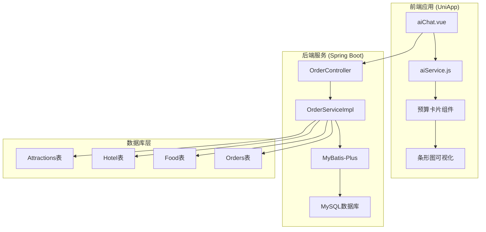
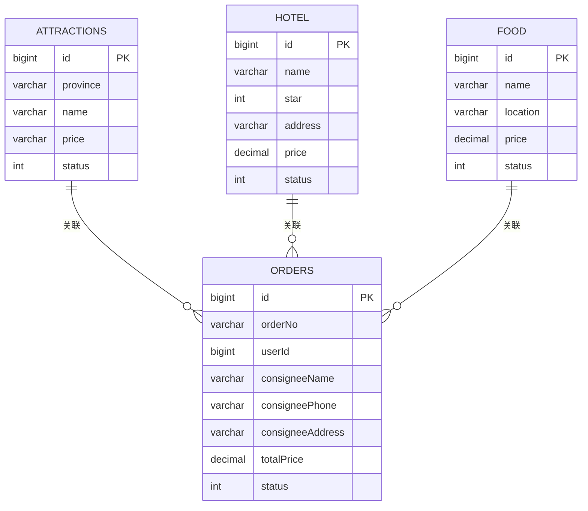
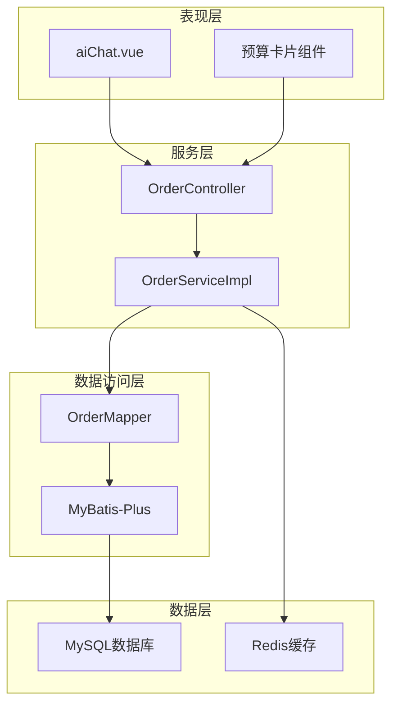
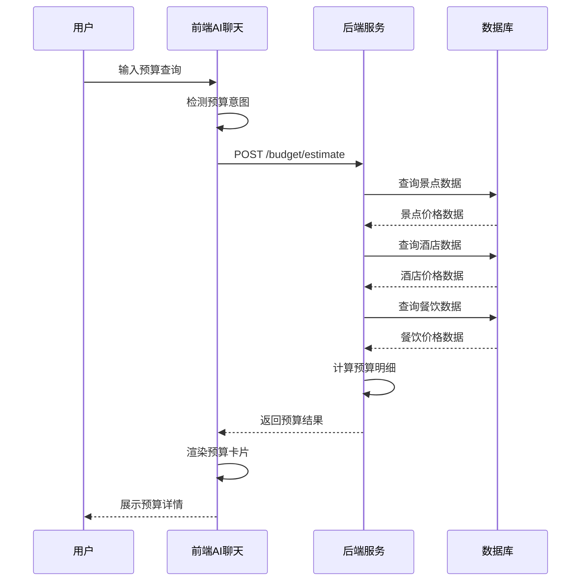
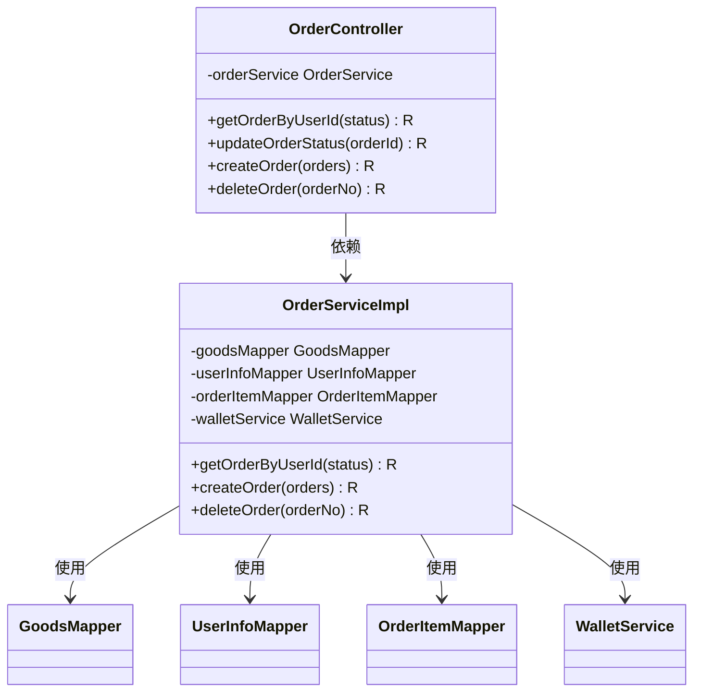
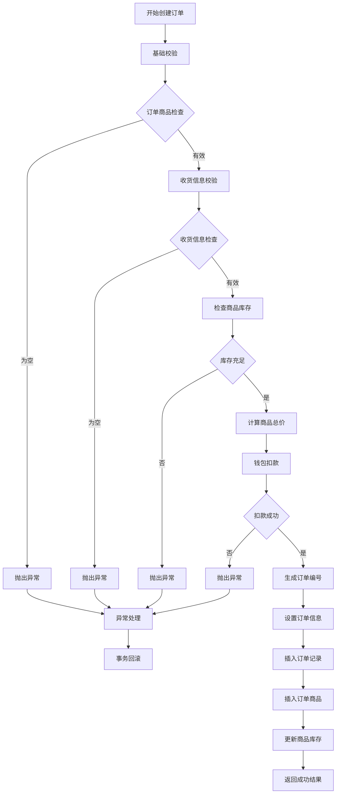
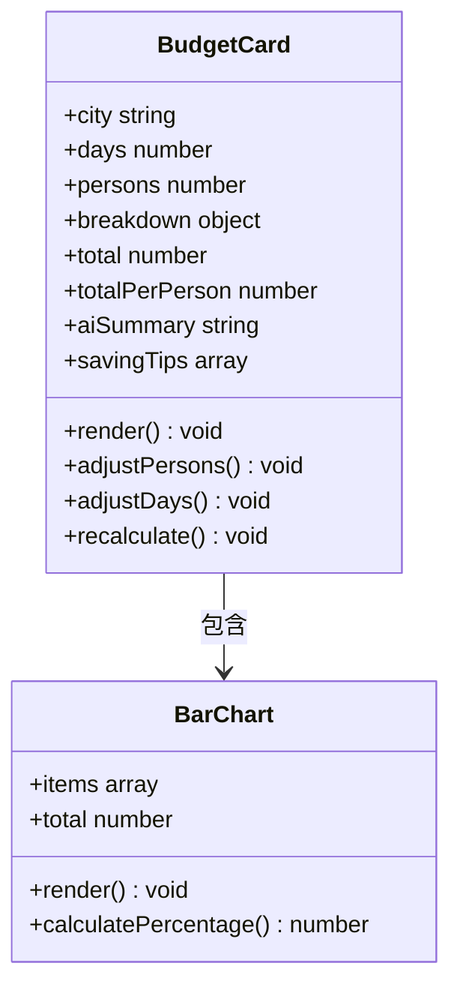
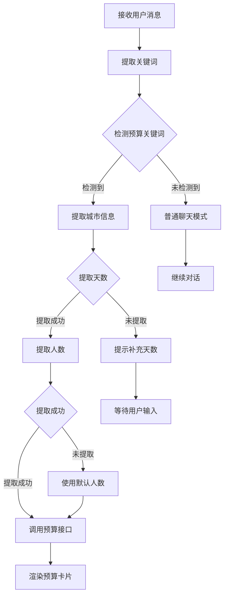
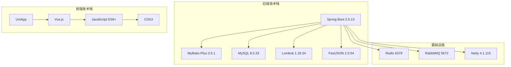
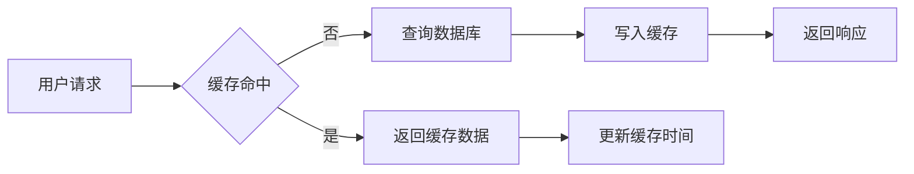

# 方案⑥-预算智能拆解

<cite>
**本文档引用的文件**
- [方案⑥-预算智能拆解.md](file://方案⑥-预算智能拆解.md)
- [application.properties](file://springboot-travel-social/src/main/resources/application.properties)
- [pom.xml](file://springboot-travel-social/pom.xml)
- [Attractions.java](file://springboot-travel-social/src/main/java/com/cxx/entity/Attractions.java)
- [Hotel.java](file://springboot-travel-social/src/main/java/com/cxx/entity/Hotel.java)
- [Food.java](file://springboot-travel-social/src/main/java/com/cxx/entity/Food.java)
- [Orders.java](file://springboot-travel-social/src/main/java/com/cxx/entity/Orders.java)
- [OrderMapper.java](file://springboot-travel-social/src/main/java/com/cxx/mapper/OrderMapper.java)
- [OrderServiceImpl.java](file://springboot-travel-social/src/main/java/com/cxx/service/impl/OrderServiceImpl.java)
- [OrderController.java](file://springboot-travel-social/src/main/java/com/cxx/controller/OrderController.java)
- [aiChat.vue](file://uniapp-travel-social/homePages/aiChat/aiChat.vue)
- [aiService.js](file://uniapp-travel-social/services/aiService.js)
</cite>

## 目录
1. [简介](#简介)
2. [项目结构](#项目结构)
3. [核心组件](#核心组件)
4. [架构概览](#架构概览)
5. [详细组件分析](#详细组件分析)
6. [依赖分析](#依赖分析)
7. [性能考虑](#性能考虑)
8. [故障排除指南](#故障排除指南)
9. [结论](#结论)

## 简介

方案⑥-预算智能拆解是一个基于真实数据的智能预算规划系统，旨在为用户提供精准的旅行预算参考。该系统通过AI对话界面识别用户的预算需求，自动从数据库中获取目标城市的景点票价、酒店均价、餐饮均价等真实数据，计算出详细的分类费用明细，并以可视化预算卡片的形式展示在聊天界面中。

### 主要功能特性

- **智能预算识别**：通过关键词检测识别用户预算需求
- **实时数据计算**：基于真实景点、酒店、餐饮数据进行精确计算
- **可视化展示**：以预算卡片形式直观展示各项费用构成
- **动态调整**：支持用户调整人数和天数后的实时重算
- **AI集成**：将预算数据注入AI上下文，提供更精准的旅行建议

## 项目结构

该项目采用前后端分离架构，包含Spring Boot后端服务和UniApp前端应用：

**图表来源**
- [application.properties:1-64](file://springboot-travel-social/src/main/resources/application.properties#L1-L64)
- [pom.xml:1-243](file://springboot-travel-social/pom.xml#L1-L243)

**章节来源**
- [方案⑥-预算智能拆解.md:1-326](file://方案⑥-预算智能拆解.md#L1-L326)
- [application.properties:1-64](file://springboot-travel-social/src/main/resources/application.properties#L1-L64)

## 核心组件

### 后端核心组件

#### 预算计算服务
系统的核心在于能够从真实数据源中提取和计算预算信息。根据技术方案，系统需要处理以下数据实体：

- **Attractions实体**：存储景点信息，包括省份、名称、价格等字段
- **Hotel实体**：存储酒店信息，包括星级、价格等字段  
- **Food实体**：存储餐饮信息，包括位置、价格等字段
- **Orders实体**：存储订单信息，用于钱包扣款等业务逻辑

#### 数据库设计
系统需要以下关键表结构：

**图表来源**
- [Attractions.java:1-41](file://springboot-travel-social/src/main/java/com/cxx/entity/Attractions.java#L1-L41)
- [Hotel.java:1-30](file://springboot-travel-social/src/main/java/com/cxx/entity/Hotel.java#L1-L30)
- [Food.java:1-32](file://springboot-travel-social/src/main/java/com/cxx/entity/Food.java#L1-L32)
- [Orders.java:1-51](file://springboot-travel-social/src/main/java/com/cxx/entity/Orders.java#L1-L51)

**章节来源**
- [方案⑥-预算智能拆解.md:48-103](file://方案⑥-预算智能拆解.md#L48-L103)
- [Attractions.java:1-41](file://springboot-travel-social/src/main/java/com/cxx/entity/Attractions.java#L1-L41)
- [Hotel.java:1-30](file://springboot-travel-social/src/main/java/com/cxx/entity/Hotel.java#L1-L30)
- [Food.java:1-32](file://springboot-travel-social/src/main/java/com/cxx/entity/Food.java#L1-L32)
- [Orders.java:1-51](file://springboot-travel-social/src/main/java/com/cxx/entity/Orders.java#L1-L51)

### 前端核心组件

#### AI聊天界面
前端的aiChat.vue组件负责预算意图识别和预算卡片展示：

- **预算意图识别**：通过关键词检测识别用户预算需求
- **预算卡片渲染**：展示分类费用条形图和总计信息
- **交互控制**：支持用户调整人数和天数的功能

#### 接口服务
aiService.js提供与后端API的通信能力，包括预算估算和重算功能。

**章节来源**
- [方案⑥-预算智能拆解.md:223-291](file://方案⑥-预算智能拆解.md#L223-L291)
- [aiChat.vue](file://uniapp-travel-social/homePages/aiChat/aiChat.vue)

## 架构概览

系统采用分层架构设计，实现了清晰的职责分离：

**图表来源**
- [OrderController.java:1-55](file://springboot-travel-social/src/main/java/com/cxx/controller/OrderController.java#L1-L55)
- [OrderServiceImpl.java:1-171](file://springboot-travel-social/src/main/java/com/cxx/service/impl/OrderServiceImpl.java#L1-L171)
- [OrderMapper.java:1-10](file://springboot-travel-social/src/main/java/com/cxx/mapper/OrderMapper.java#L1-L10)

### 数据流处理

系统的核心数据流如下：

**图表来源**
- [方案⑥-预算智能拆解.md:13-44](file://方案⑥-预算智能拆解.md#L13-L44)

**章节来源**
- [方案⑥-预算智能拆解.md:13-44](file://方案⑥-预算智能拆解.md#L13-L44)

## 详细组件分析

### 后端服务实现

#### 订单管理服务
OrderServiceImpl提供了完整的订单管理功能，包括订单查询、创建和删除：

**图表来源**
- [OrderServiceImpl.java:1-171](file://springboot-travel-social/src/main/java/com/cxx/service/impl/OrderServiceImpl.java#L1-L171)
- [OrderController.java:1-55](file://springboot-travel-social/src/main/java/com/cxx/controller/OrderController.java#L1-L55)

#### 订单创建流程
订单创建过程包含了严格的业务验证和事务控制：

**图表来源**
- [OrderServiceImpl.java:82-171](file://springboot-travel-social/src/main/java/com/cxx/service/impl/OrderServiceImpl.java#L82-L171)

**章节来源**
- [OrderServiceImpl.java:1-171](file://springboot-travel-social/src/main/java/com/cxx/service/impl/OrderServiceImpl.java#L1-L171)
- [OrderController.java:1-55](file://springboot-travel-social/src/main/java/com/cxx/controller/OrderController.java#L1-L55)

### 前端交互实现

#### 预算卡片组件
前端的预算卡片组件提供了直观的预算展示和交互功能：

**图表来源**
- [方案⑥-预算智能拆解.md:250-277](file://方案⑥-预算智能拆解.md#L250-L277)

#### 预算意图识别算法
前端实现了智能的预算意图识别功能：

**图表来源**
- [方案⑥-预算智能拆解.md:233-243](file://方案⑥-预算智能拆解.md#L233-L243)

**章节来源**
- [方案⑥-预算智能拆解.md:223-291](file://方案⑥-预算智能拆解.md#L223-L291)

## 依赖分析

### 技术栈依赖

系统采用了现代化的技术栈组合：

**图表来源**
- [pom.xml:16-182](file://springboot-travel-social/pom.xml#L16-L182)
- [application.properties:1-64](file://springboot-travel-social/src/main/resources/application.properties#L1-L64)

### 核心依赖配置

系统的关键依赖包括：

- **Spring Boot Starter Web**：提供Web开发基础功能
- **MyBatis-Plus**：简化数据库操作
- **MySQL Connector**：数据库连接驱动
- **Lombok**：简化Java代码编写
- **FastJSON**：高性能JSON处理库
- **Redis**：缓存和会话管理
- **Netty**：网络通信框架

**章节来源**
- [pom.xml:1-243](file://springboot-travel-social/pom.xml#L1-L243)
- [application.properties:1-64](file://springboot-travel-social/src/main/resources/application.properties#L1-L64)

## 性能考虑

### 数据库优化策略

1. **索引优化**：为常用查询字段建立适当索引
2. **查询优化**：使用分页查询避免大数据量影响
3. **缓存策略**：利用Redis缓存热点数据
4. **连接池配置**：合理配置数据库连接池参数

### 缓存机制

系统可以采用多层缓存策略：

### 异步处理

对于耗时的操作，可以采用异步处理方式：

- **批量数据处理**：使用消息队列异步处理
- **定时任务**：定期更新缓存数据
- **并发控制**：使用分布式锁避免重复计算

## 故障排除指南

### 常见问题及解决方案

#### 数据库连接问题
- **症状**：应用启动时报数据库连接错误
- **原因**：数据库配置不正确或网络问题
- **解决**：检查application.properties中的数据库配置

#### 缓存访问异常
- **症状**：Redis连接失败或超时
- **原因**：Redis服务器不可用或配置错误
- **解决**：检查Redis连接配置和服务器状态

#### 订单创建失败
- **症状**：订单创建接口返回错误
- **原因**：库存不足或钱包余额不足
- **解决**：检查商品库存和用户钱包余额

**章节来源**
- [OrderServiceImpl.java:165-171](file://springboot-travel-social/src/main/java/com/cxx/service/impl/OrderServiceImpl.java#L165-L171)

### 日志监控

系统应该配置完善的日志监控机制：

- **业务日志**：记录关键业务操作
- **错误日志**：捕获和记录异常信息
- **性能日志**：监控系统性能指标
- **审计日志**：记录重要数据变更

## 结论

方案⑥-预算智能拆解系统通过将真实数据与AI技术相结合，为用户提供了精准的旅行预算参考。系统具有以下优势：

1. **数据真实性**：基于实际景点、酒店、餐饮数据进行计算
2. **智能化程度高**：能够自动识别用户预算需求并提供相应服务
3. **用户体验优秀**：通过可视化卡片直观展示预算构成
4. **扩展性强**：模块化设计便于功能扩展和维护

该系统为旅游社交小程序提供了重要的商业化支撑，有助于提升用户粘性和商业转化率。通过持续优化数据质量和算法精度，系统将能够为用户提供更加精准和个性化的预算规划服务。