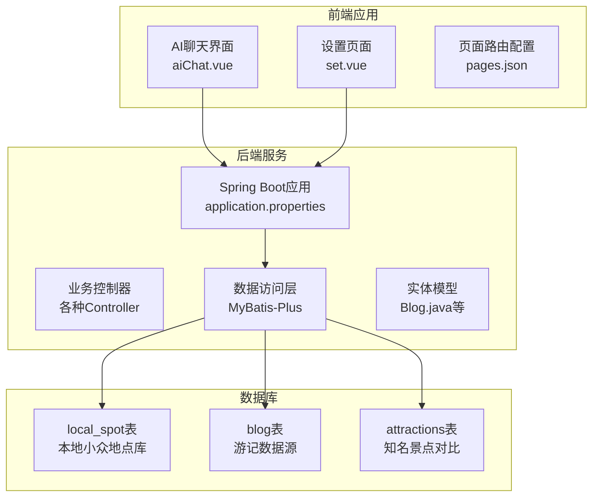
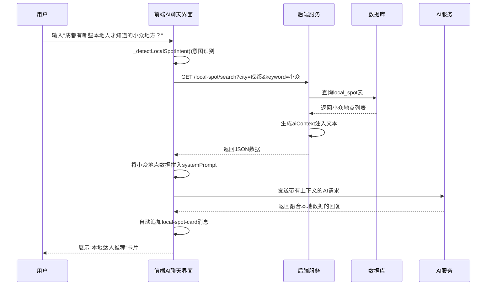
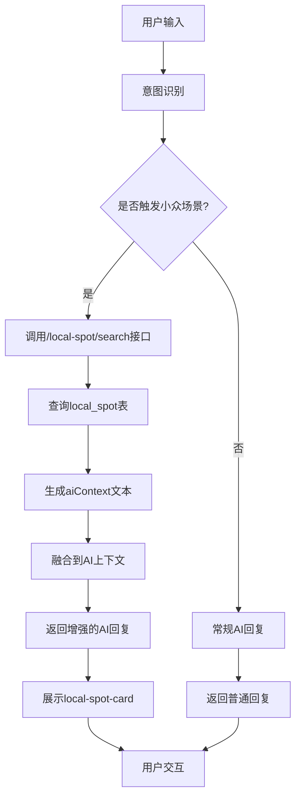
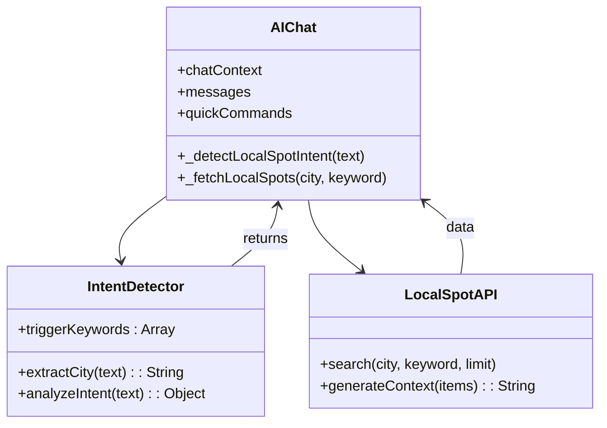
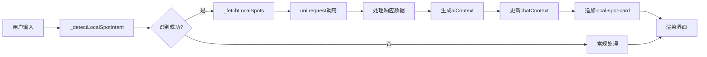
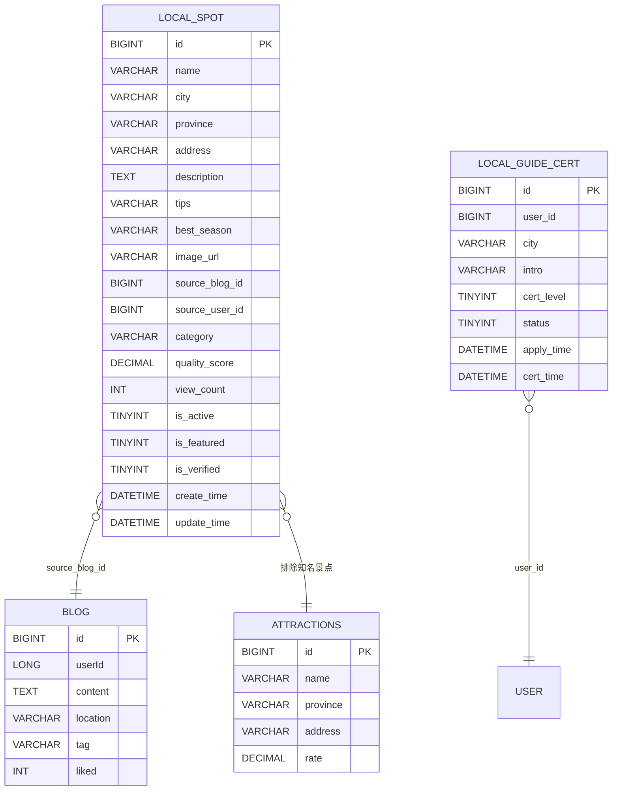
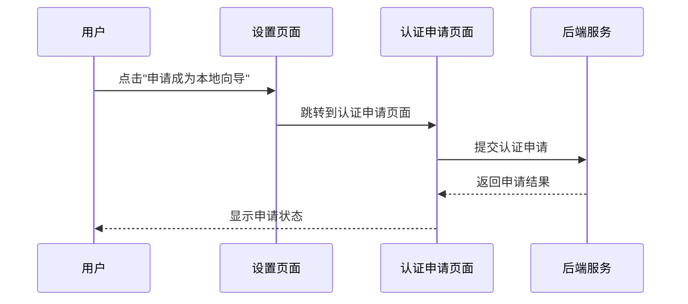
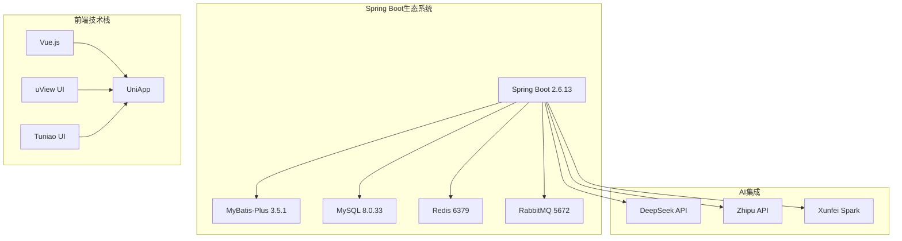

# 方案⑦ 本地向导小众路线

<cite>
**本文档引用的文件**
- [方案⑦-本地向导小众路线.md](file://方案⑦-本地向导小众路线.md)
- [aiChat.vue](file://uniapp-travel-social/homePages/aiChat/aiChat.vue)
- [set.vue](file://uniapp-travel-social/minePages/set.vue)
- [application.properties](file://springboot-travel-social/src/main/resources/application.properties)
- [Blog.java](file://springboot-travel-social/src/main/java/com/cxx/entity/Blog.java)
- [pages.json](file://uniapp-travel-social/pages.json)
- [pom.xml](file://springboot-travel-social/pom.xml)
</cite>

## 目录
1. [引言](#引言)
2. [项目结构](#项目结构)
3. [核心组件](#核心组件)
4. [架构概览](#架构概览)
5. [详细组件分析](#详细组件分析)
6. [依赖分析](#依赖分析)
7. [性能考虑](#性能考虑)
8. [故障排除指南](#故障排除指南)
9. [结论](#结论)

## 引言

方案⑦"本地向导小众路线"是旅游攻略社交小程序的一个重要功能模块，旨在通过平台用户的原创高质量游记来挖掘和沉淀小众景点数据，建立平台独有的"本地向导知识库"。该方案的核心目标是解决现有AI助手（如豆包）只能提供热门景点推荐的问题，通过本地达人的深度体验和真实推荐，为用户提供更加独特和个性化的旅游体验。

本方案通过"人工运营+自动提取"的双轨机制，从平台现有的游记数据中挖掘小众景点，建立local_spot表作为本地知识库，并在AI聊天界面中实现智能的小众景点推荐功能。这种设计不仅能够提升用户体验，还能增强平台的核心竞争力，形成难以被其他AI产品复制的独特优势。

## 项目结构

该项目采用前后端分离的架构设计，主要分为两个部分：

### 后端Spring Boot应用结构
- **核心业务模块**：包含完整的旅游相关业务逻辑
- **控制器层**：处理HTTP请求和响应
- **服务层**：实现业务逻辑和服务编排
- **数据访问层**：MyBatis-Plus映射数据库操作
- **配置层**：Spring Boot应用配置和第三方集成

### 前端UniApp应用结构
- **页面组件**：基于Vue.js的移动端页面
- **AI聊天界面**：核心的交互界面
- **设置页面**：用户账户和偏好设置
- **样式系统**：基于SCSS的样式管理

**图表来源**
- [aiChat.vue](file://uniapp-travel-social/homePages/aiChat/aiChat.vue)
- [set.vue](file://uniapp-travel-social/minePages/set.vue)
- [application.properties](file://springboot-travel-social/src/main/resources/application.properties)
- [Blog.java](file://springboot-travel-social/src/main/java/com/cxx/entity/Blog.java)

**章节来源**
- [方案⑦-本地向导小众路线.md](file://方案⑦-本地向导小众路线.md)
- [pages.json](file://uniapp-travel-social/pages.json)

## 核心组件

### 数据库层组件

#### local_spot表（本地小众地点库）
这是方案的核心数据存储组件，专门用于存放经过筛选和验证的小众景点数据。该表具有以下关键特性：

- **主键设计**：使用BIGINT类型的自增主键，支持大规模数据存储
- **地理位置索引**：为city、province、category字段建立索引，优化查询性能
- **全文检索**：使用ngram解析器为name、description、tips字段建立全文索引
- **质量评估**：包含quality_score字段，用于量化地点的质量和可信度
- **状态管理**：支持is_active、is_featured、is_verified等状态字段

#### local_guide_cert表（本地向导认证）
该表用于管理经过认证的本地达人用户，确保推荐内容的真实性和权威性。

#### blog表（游记数据源）
作为小众景点数据的主要来源，blog表包含了用户分享的原创游记内容，是整个知识库建设的基础。

### 前端组件

#### AI聊天界面（aiChat.vue）
这是用户交互的核心界面，实现了小众景点推荐功能的所有前端逻辑。

#### 设置页面（set.vue）
提供了用户账户管理和功能入口，包括本地向导认证申请的入口。

**章节来源**
- [方案⑦-本地向导小众路线.md](file://方案⑦-本地向导小众路线.md)
- [Blog.java](file://springboot-travel-social/src/main/java/com/cxx/entity/Blog.java)

## 架构概览

该方案采用了多层次的架构设计，确保系统的可扩展性和维护性：

**图表来源**
- [方案⑦-本地向导小众路线.md](file://方案⑦-本地向导小众路线.md)
- [aiChat.vue](file://uniapp-travel-social/homePages/aiChat/aiChat.vue)

### 数据流架构

**图表来源**
- [方案⑦-本地向导小众路线.md](file://方案⑦-本地向导小众路线.md)

## 详细组件分析

### AI聊天界面组件分析

#### 意图识别机制
前端实现了智能的意图识别功能，能够准确识别用户关于小众景点的查询需求：

**图表来源**
- [方案⑦-本地向导小众路线.md](file://方案⑦-本地向导小众路线.md)
- [aiChat.vue](file://uniapp-travel-social/homePages/aiChat/aiChat.vue)

#### 小众地点卡片组件
实现了独特的local-spot-card组件，与普通景点卡片形成明显区分：

| 维度 | 普通景点卡片 | 本地达人推荐 |
|------|-------------|-------------|
| 背景色 | 白色 | 暖米色 `#FFF8F0` |
| 标题标签 | 📸 相关景点图片 | 🏮 本地达人私藏 |
| 认证标识 | 无 | 显示达人名 + 认证图标 |
| 底部来源 | 无 | "来自《xxx游记》" 可点击 |
| 边框 | 无特殊 | 左侧4rpx暖橙色竖线 |

#### 数据处理流程
前端实现了完整的小众地点数据处理流程：

**图表来源**
- [方案⑦-本地向导小众路线.md](file://方案⑦-本地向导小众路线.md)
- [aiChat.vue](file://uniapp-travel-social/homePages/aiChat/aiChat.vue)

**章节来源**
- [方案⑦-本地向导小众路线.md](file://方案⑦-本地向导小众路线.md)
- [aiChat.vue](file://uniapp-travel-social/homePages/aiChat/aiChat.vue)

### 后端服务组件分析

#### 数据库设计分析
后端服务通过精心设计的数据库结构来支撑整个小众路线推荐功能：

**图表来源**
- [方案⑦-本地向导小众路线.md](file://方案⑦-本地向导小众路线.md)

#### API接口设计
后端提供了专门的API接口来支持小众地点的检索和管理：

| 接口路径 | 方法 | 功能描述 |
|----------|------|----------|
| `/local-spot/search` | GET | 搜索本地小众地点 |
| `/local-guide/apply` | POST | 本地向导认证申请 |
| `/local-guide/status/{userId}` | GET | 查询认证状态 |
| `/admin/local-spot/import` | POST | 批量导入小众地点 |
| `/admin/local-spot/{id}/verify` | PUT | 人工审核通过 |
| `/admin/local-spot/{id}/feature` | PUT | 标记为精选 |

**章节来源**
- [方案⑦-本地向导小众路线.md](file://方案⑦-本地向导小众路线.md)

### 前端页面组件分析

#### 设置页面集成
设置页面提供了本地向导认证申请的功能入口：

**图表来源**
- [方案⑦-本地向导小众路线.md](file://方案⑦-本地向导小众路线.md)
- [set.vue](file://uniapp-travel-social/minePages/set.vue)

**章节来源**
- [方案⑦-本地向导小众路线.md](file://方案⑦-本地向导小众路线.md)
- [set.vue](file://uniapp-travel-social/minePages/set.vue)

## 依赖分析

### 技术栈依赖

#### 后端技术栈
项目采用成熟的Spring Boot技术栈，确保了系统的稳定性和可维护性：

**图表来源**
- [pom.xml](file://springboot-travel-social/pom.xml)
- [application.properties](file://springboot-travel-social/src/main/resources/application.properties)

#### 第三方服务集成
系统集成了多个AI服务提供商，确保了推荐算法的多样性和准确性：

| 服务提供商 | API密钥 | 基础URL | 使用场景 |
|------------|---------|---------|----------|
| DeepSeek | sk-03162b8b45924e71a986c3a797c3573b | https://api.deepseek.com | 主要AI推理 |
| Zhipu | 58a1534ba40647ea804d9eefef774226.dYpMxgzW1MsT9YaZ | https://open.bigmodel.cn/api/paas/v4 | 大模型对话 |
| 讯飞星火 | d28c77d4 | - | 语音识别和合成 |

**章节来源**
- [application.properties](file://springboot-travel-social/src/main/resources/application.properties)
- [pom.xml](file://springboot-travel-social/pom.xml)

## 性能考虑

### 数据库性能优化
针对小众地点检索的高频访问需求，系统采用了多项性能优化策略：

1. **索引优化**：为city、province、category字段建立索引，支持快速地理查询
2. **全文检索**：使用ngram解析器优化中文搜索体验
3. **缓存策略**：结合Redis实现热点数据缓存
4. **分页查询**：限制默认返回数量，避免大数据量查询

### 前端性能优化
前端界面采用了多项优化措施来提升用户体验：

1. **懒加载**：图片资源采用懒加载策略
2. **虚拟滚动**：大量数据展示时使用虚拟滚动
3. **组件缓存**：合理使用组件缓存减少重复渲染
4. **按需加载**：非关键功能按需加载

## 故障排除指南

### 常见问题及解决方案

#### AI推荐不准确
**问题现象**：AI推荐的小众地点与用户需求不符
**可能原因**：
- local_spot表数据不足
- 意图识别关键词不够准确
- aiContext文本构建逻辑有问题

**解决方案**：
1. 检查local_spot表数据质量和数量
2. 优化_triggerKeywords数组
3. 验证aiContext生成逻辑

#### 页面显示异常
**问题现象**：local-spot-card组件显示不正确
**可能原因**：
- CSS样式冲突
- 数据格式不匹配
- 组件生命周期问题

**解决方案**：
1. 检查CSS样式覆盖情况
2. 验证数据结构完整性
3. 确认组件渲染时机

#### API接口错误
**问题现象**：调用/local-spot/search接口返回错误
**可能原因**：
- 数据库连接问题
- SQL查询语法错误
- 参数验证失败

**解决方案**：
1. 检查数据库连接配置
2. 验证SQL语句正确性
3. 确认参数传递完整性

**章节来源**
- [方案⑦-本地向导小众路线.md](file://方案⑦-本地向导小众路线.md)

## 结论

方案⑦"本地向导小众路线"通过创新的技术架构和精心的设计，成功解决了传统AI助手只能提供热门景点推荐的问题。该方案的核心价值在于：

1. **差异化竞争优势**：通过本地达人的深度体验，提供独特的旅游体验
2. **双轨数据机制**：人工运营和自动提取相结合，确保数据质量和效率
3. **智能化用户体验**：无缝集成的AI推荐和视觉差异化展示
4. **可扩展架构设计**：为未来功能扩展预留了充足空间

该方案不仅提升了用户满意度和平台粘性，更重要的是建立了难以被竞争对手复制的核心竞争力。通过持续优化算法和扩大数据规模，该功能有望成为平台的重要增长引擎。