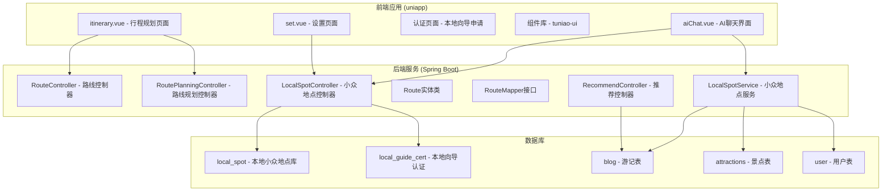
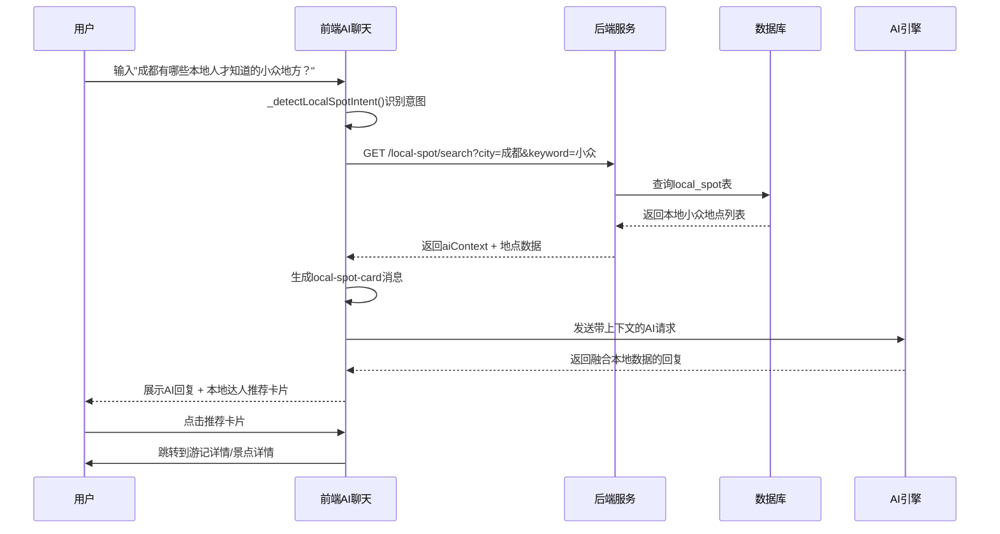
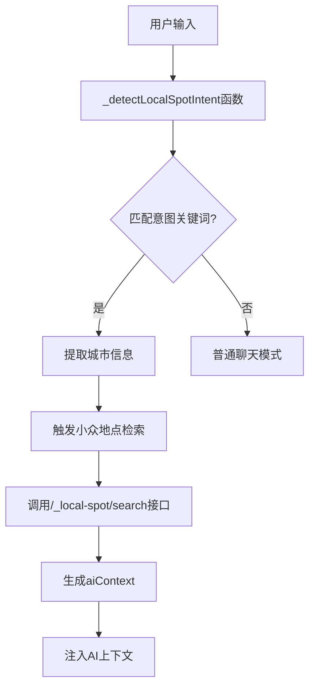
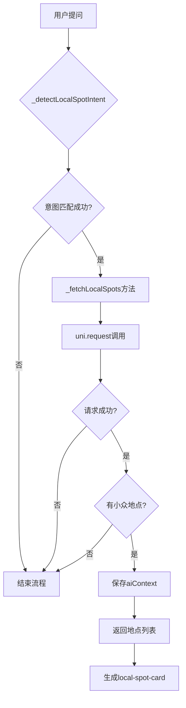
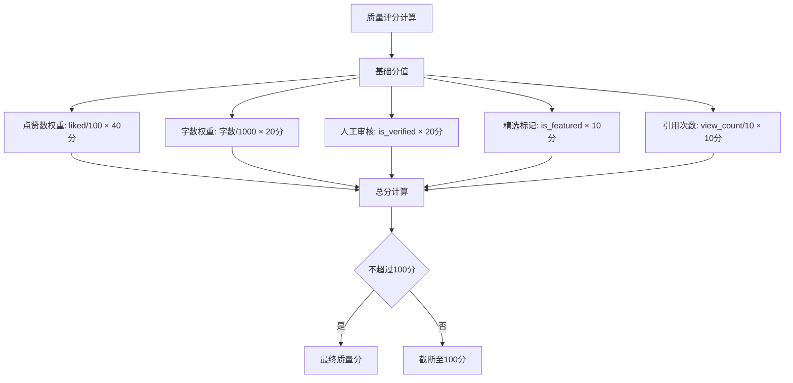
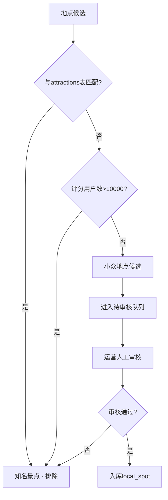
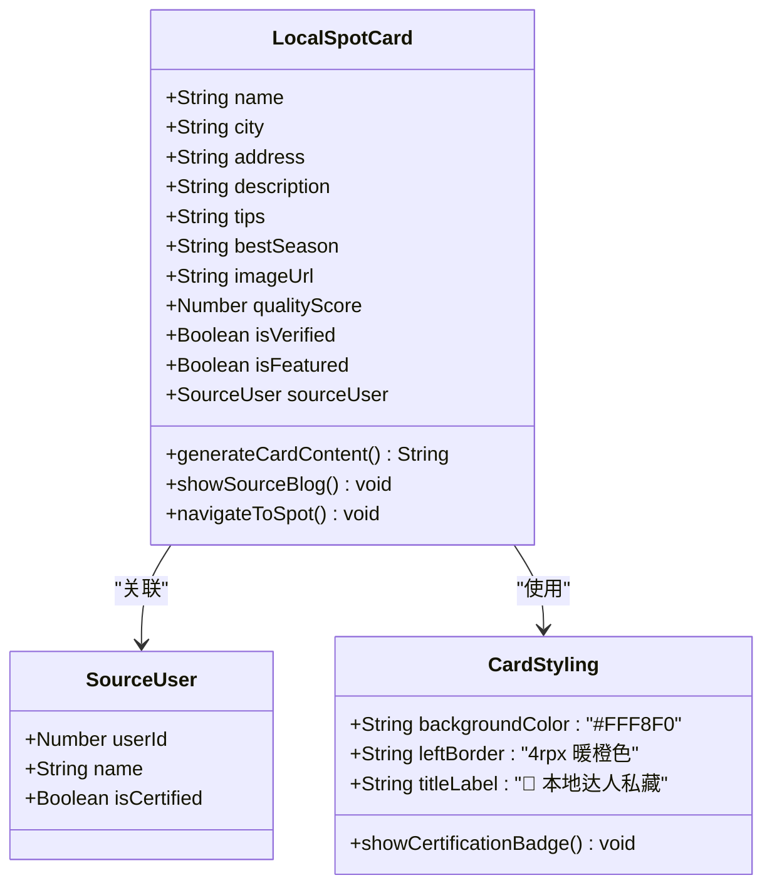
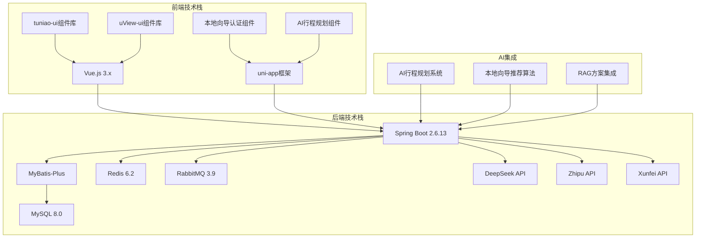

# 方案⑦-本地向导小众路线

<cite>
**本文档引用的文件**
- [方案⑦-本地向导小众路线.md](file://方案⑦-本地向导小众路线.md)
- [aiChat.vue](file://uniapp-travel-social/homePages/aiChat/aiChat.vue)
- [set.vue](file://uniapp-travel-social/minePages/set.vue)
- [application.properties](file://springboot-travel-social/src/main/resources/application.properties)
- [RouteController.java](file://springboot-travel-social/src/main/java/com/cxx/controller/RouteController.java)
- [Route.java](file://springboot-travel-social/src/main/java/com/cxx/entity/Route.java)
- [RouteMapper.java](file://springboot-travel-social/src/main/java/com/cxx/mapper/RouteMapper.java)
- [RoutePlanningController.java](file://springboot-travel-social/src/main/java/com/cxx/controller/RoutePlanningController.java)
- [RecommendController.java](file://springboot-travel-social/src/main/java/com/cxx/controller/RecommendController.java)
- [RecommendService.java](file://springboot-travel-social/src/main/java/com/cxx/service/RecommendService.java)
</cite>

## 更新摘要
**所做更改**
- 新增了AI行程规划系统的集成说明
- 更新了本地向导认证申请流程
- 增加了与RAG方案的协同关系说明
- 完善了小众路线推荐算法的技术细节
- 补充了数据库表结构和接口设计

## 目录
1. [简介](#简介)
2. [项目结构](#项目结构)
3. [核心组件](#核心组件)
4. [架构概览](#架构概览)
5. [详细组件分析](#详细组件分析)
6. [依赖分析](#依赖分析)
7. [性能考虑](#性能考虑)
8. [故障排除指南](#故障排除指南)
9. [结论](#结论)

## 简介

方案⑦"本地向导小众路线"是旅游攻略社交小程序的重要功能模块，旨在通过平台用户的原创高质量游记挖掘并沉淀小众景点数据，建立平台独有的"本地向导知识库"。该方案的核心目标是：

- **构建本地向导知识库**：从平台用户原创游记中挖掘小众景点，建立`local_spot`表
- **AI智能推荐**：当用户询问小众目的地或本地推荐时，优先检索本地知识库数据注入AI上下文
- **差异化展示**：在AI回复中以"本地达人推荐"专属卡片形式展示，与普通大模型推荐形成视觉差异
- **认证体系**：建立本地向导认证机制，确保推荐内容的权威性和可信度
- **AI行程规划集成**：为AI行程规划系统提供小众路线推荐算法

该方案解决了传统AI只能推荐热门景点的问题，通过人工运营+自动提取的双轨机制，建立了平台独特的竞争优势。

## 项目结构

该项目采用前后端分离的架构设计，主要分为两个部分：



**图表来源**
- [方案⑦-本地向导小众路线.md:1-304](file://方案⑦-本地向导小众路线.md#L1-L304)
- [aiChat.vue:1-2170](file://uniapp-travel-social/homePages/aiChat/aiChat.vue#L1-L2170)
- [set.vue:1-232](file://uniapp-travel-social/minePages/set.vue#L1-L232)

**章节来源**
- [方案⑦-本地向导小众路线.md:1-304](file://方案⑦-本地向导小众路线.md#L1-L304)

## 核心组件

### 数据库层组件

#### local_spot表 (本地小众地点库)
- **核心字段**：id, name, city, province, address, description, tips, best_season, image_url
- **质量控制**：quality_score, view_count, is_active, is_featured, is_verified
- **来源追踪**：source_blog_id, source_user_id
- **分类管理**：category字段支持natural/culture/food/art/market分类
- **索引优化**：city, province, category, 全文索引(ngram解析器)

#### local_guide_cert表 (本地向导认证)
- **认证级别**：1=本地达人, 2=资深向导, 3=官方推荐
- **状态管理**：apply_time, cert_time, status
- **唯一约束**：user_id + city组合唯一

#### blog表 (游记来源)
- **内容字段**：content, location, tag, liked
- **质量指标**：status, user_id
- **全文检索**：支持中文ngram分词

#### user表 (用户信息)
- **用户认证**：用户基本信息和认证状态
- **偏好画像**：旅行偏好和历史记录

**章节来源**
- [方案⑦-本地向导小众路线.md:48-105](file://方案⑦-本地向导小众路线.md#L48-L105)

### 前端组件

#### aiChat.vue (AI聊天界面)
- **意图识别**：_detectLocalSpotIntent()方法识别小众、本地人等关键词
- **静默拉取**：_fetchLocalSpots()方法自动获取小众地点
- **卡片展示**：local-spot-card专用样式和交互
- **主题切换**：支持明暗主题模式
- **行程规划集成**：与AI行程规划系统的无缝对接

#### set.vue (设置页面)
- **认证入口**：新增"申请成为本地向导"功能
- **权限管理**：基于用户认证状态显示不同功能

**章节来源**
- [方案⑦-本地向导小众路线.md:191-258](file://方案⑦-本地向导小众路线.md#L191-L258)

## 架构概览

该方案采用三层架构设计，实现了从数据采集到智能推荐的完整流程：



**图表来源**
- [方案⑦-本地向导小众路线.md:13-44](file://方案⑦-本地向导小众路线.md#L13-L44)
- [aiChat.vue:210-225](file://uniapp-travel-social/homePages/aiChat/aiChat.vue#L210-L225)

## 详细组件分析

### 数据流处理组件

#### 意图识别算法
前端通过关键词匹配实现智能意图识别：



**图表来源**
- [方案⑦-本地向导小众路线.md:202-208](file://方案⑦-本地向导小众路线.md#L202-L208)

#### 静默数据拉取机制


**图表来源**
- [方案⑦-本地向导小众路线.md:210-225](file://方案⑦-本地向导小众路线.md#L210-L225)

### 数据库设计组件

#### 质量评分算法
小众地点的质量评分采用多维度加权计算：



**图表来源**
- [方案⑦-local_spot表:285-295](file://方案⑦-本地向导小众路线.md#L285-L295)

#### 区分标准算法


**图表来源**
- [方案⑦-本地向导小众路线.md:277-283](file://方案⑦-本地向导小众路线.md#L277-L283)

### 前端展示组件

#### 本地达人推荐卡片


**图表来源**
- [方案⑦-本地向导小众路线.md:239-253](file://方案⑦-本地向导小众路线.md#L239-L253)

**章节来源**
- [方案⑦-本地向导小众路线.md:297-304](file://方案⑦-本地向导小众路线.md#L297-L304)

## 依赖分析

### 技术栈依赖关系



**图表来源**
- [application.properties:1-64](file://springboot-travel-social/src/main/resources/application.properties#L1-L64)

### 数据依赖关系

#### 核心数据流依赖
```mermaid
erDiagram
BLOG {
bigint id PK
text content
varchar location
int liked
bigint user_id
}
ATTRACTIONS {
bigint id PK
varchar name
varchar province
varchar address
decimal rate
}
LOCAL_SPOT {
bigint id PK
varchar name
varchar city
varchar province
text description
decimal quality_score
int view_count
tinyint is_active
tinyint is_verified
bigint source_blog_id FK
bigint source_user_id FK
varchar category
}
LOCAL_GUIDE_CERT {
bigint id PK
bigint user_id
varchar city
tinyint cert_level
tinyint status
}
USER {
bigint id PK
varchar username
varchar avatar
tinyint isCertified
}
BLOG ||--o{ LOCAL_SPOT : "产生"
ATTRACTIONS ||--X LOCAL_SPOT : "排除"
USER ||--o{ LOCAL_GUIDE_CERT : "申请"
USER ||--o{ LOCAL_SPOT : "推荐"
```

**图表来源**
- [方案⑦-本地向导小众路线.md:50-105](file://方案⑦-本地向导小众路线.md#L50-L105)

**章节来源**
- [application.properties:1-64](file://springboot-travel-social/src/main/resources/application.properties#L1-L64)

## 性能考虑

### 数据库性能优化

#### 索引策略
- **复合索引**：city, province, category字段建立索引
- **全文索引**：使用ngram解析器支持中文分词
- **唯一约束**：user_id+city组合确保认证唯一性

#### 查询优化
- **分页查询**：默认限制5条记录，避免大数据量查询
- **排序优化**：按quality_score和view_count排序
- **条件过滤**：is_active=1确保只查询有效数据

### 前端性能优化

#### 组件懒加载
- **按需引入**：仅在需要时加载local-spot-card组件
- **虚拟滚动**：大量卡片时使用虚拟滚动技术
- **图片优化**：使用懒加载和压缩策略

#### 缓存策略
- **本地缓存**：近期查询结果缓存
- **CDN加速**：静态资源通过CDN分发
- **预加载**：热门城市的地点数据预加载

## 故障排除指南

### 常见问题诊断

#### 数据查询异常
**症状**：小众地点搜索无结果
**排查步骤**：
1. 检查local_spot表是否有数据
2. 验证city参数是否正确
3. 确认is_active字段为1
4. 检查数据库连接配置

#### AI集成问题
**症状**：AI回复中缺少本地数据
**排查步骤**：
1. 验证aiContext字段是否正确生成
2. 检查前端是否正确注入上下文
3. 确认后端接口返回格式正确
4. 验证API密钥配置

#### 前端显示异常
**症状**：local-spot-card样式不正确
**排查步骤**：
1. 检查CSS样式是否正确加载
2. 验证组件数据结构
3. 确认主题模式切换逻辑
4. 检查移动端适配

#### 行程规划集成问题
**症状**：AI行程规划中缺少小众路线
**排查步骤**：
1. 验证LocalSpotController接口是否正常工作
2. 检查小众地点数据是否正确注入行程规划
3. 确认与RoutePlanningController的集成逻辑
4. 验证RecommendController的推荐算法

**章节来源**
- [方案⑦-本地向导小众路线.md:13-44](file://方案⑦-本地向导小众路线.md#L13-L44)

## 结论

方案⑦"本地向导小众路线"通过构建本地向导知识库，成功解决了传统AI推荐热门景点的局限性。该方案的核心优势包括：

### 技术创新点
1. **双轨机制**：人工运营+自动提取的数据采集方式
2. **智能识别**：基于关键词的意图识别算法
3. **差异化展示**：独特的本地达人推荐卡片设计
4. **认证体系**：建立可信的本地向导生态
5. **AI行程规划集成**：为AI行程规划系统提供小众路线推荐算法

### 业务价值
1. **竞争优势**：构建平台独有的小众路线知识库
2. **用户体验**：提供更贴近本地人推荐的旅游建议
3. **内容生态**：激励用户创作高质量游记内容
4. **商业价值**：通过认证体系提升平台服务质量
5. **AI系统增强**：为AI行程规划提供更丰富的本地化数据

### 实施建议
1. **持续优化**：根据用户反馈调整意图识别算法
2. **质量把控**：加强人工审核流程确保数据质量
3. **性能监控**：建立完善的性能监控和告警机制
4. **扩展规划**：为未来功能扩展预留架构空间
5. **AI算法优化**：持续改进小众路线推荐算法的准确性和实用性

该方案为旅游攻略社交小程序提供了独特的发展方向，通过本地化、个性化的服务体验，有望在竞争激烈的旅游服务平台中脱颖而出。与AI行程规划系统的深度集成，进一步增强了平台的技术实力和用户体验，为未来的智能化旅游服务奠定了坚实基础。