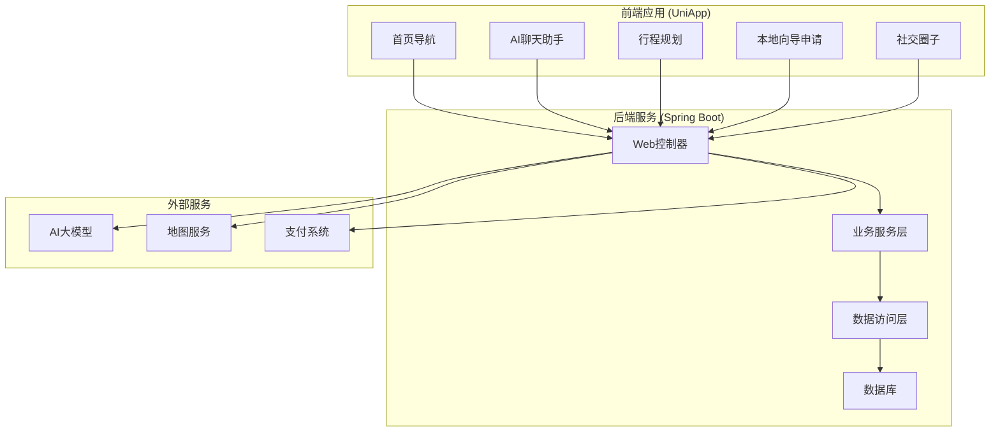
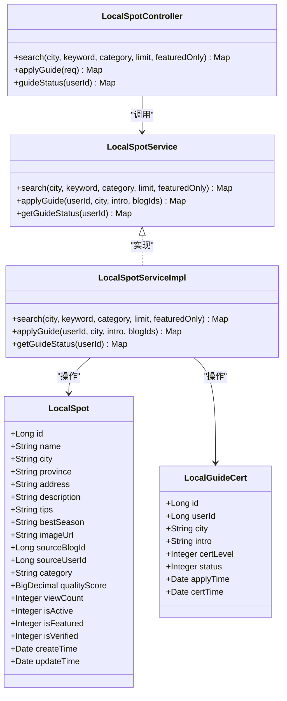
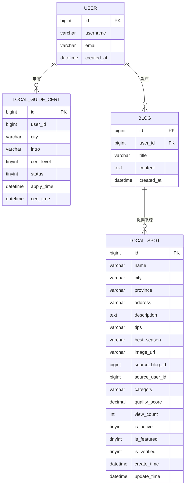
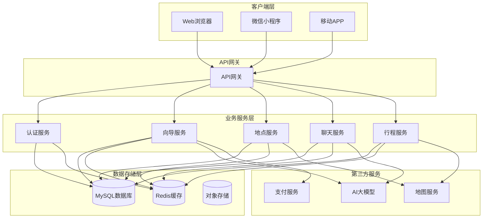
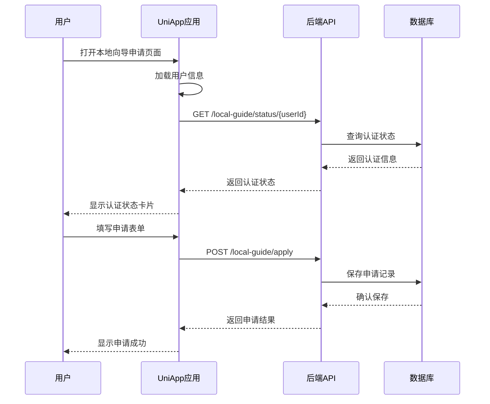
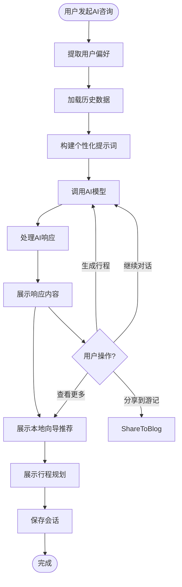
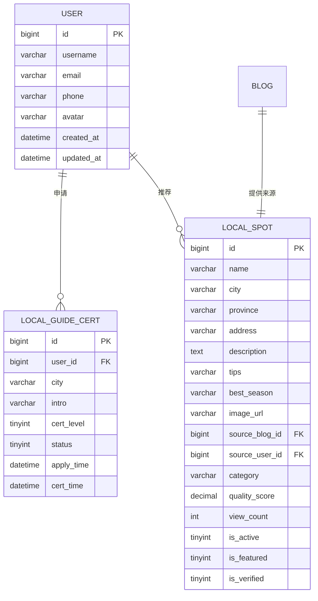
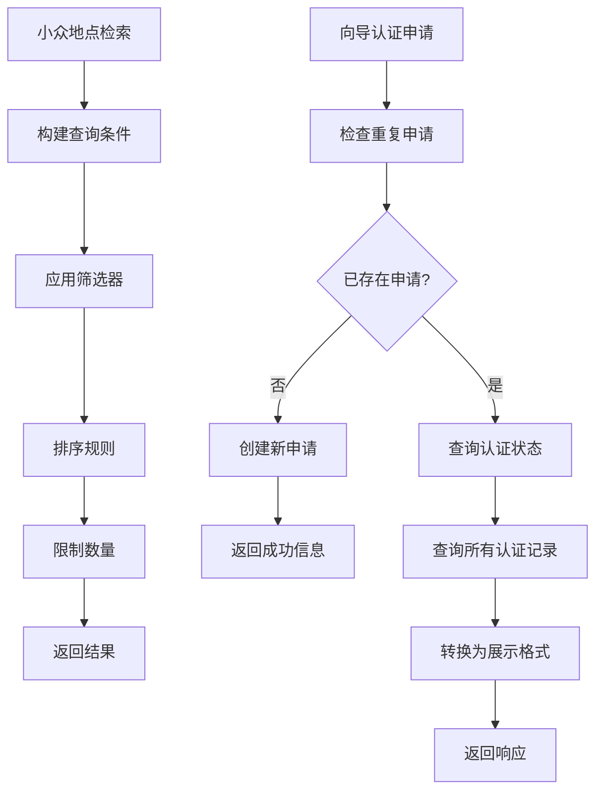
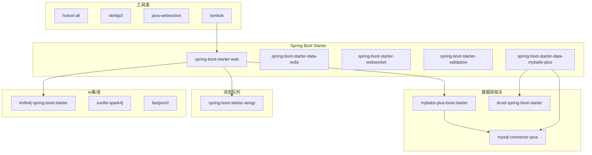

# 本地向导小众路线

<cite>
**本文档引用的文件**
- [README.md](file://springboot-travel-social/README.md)
- [TravelSocialApplication.java](file://springboot-travel-social/src/main/java/com/cxx/TravelSocialApplication.java)
- [pom.xml](file://springboot-travel-social/pom.xml)
- [LocalSpotController.java](file://springboot-travel-social/src/main/java/com/cxx/controller/LocalSpotController.java)
- [LocalSpotService.java](file://springboot-travel-social/src/main/java/com/cxx/service/LocalSpotService.java)
- [LocalSpotServiceImpl.java](file://springboot-travel-social/src/main/java/com/cxx/service/impl/LocalSpotServiceImpl.java)
- [LocalSpot.java](file://springboot-travel-social/src/main/java/com/cxx/entity/LocalSpot.java)
- [LocalGuideCert.java](file://springboot-travel-social/src/main/java/com/cxx/entity/LocalGuideCert.java)
- [LocalSpotMapper.java](file://springboot-travel-social/src/main/java/com/cxx/mapper/LocalSpotMapper.java)
- [LocalGuideCertMapper.java](file://springboot-travel-social/src/main/java/com/cxx/mapper/LocalGuideCertMapper.java)
- [local_spot.sql](file://springboot-travel-social/src/main/resources/sql/local_spot.sql)
- [local-guide-apply.vue](file://uniapp-travel-social/authentication/local-guide-apply.vue)
- [aiChat.vue](file://uniapp-travel-social/homePages/aiChat/aiChat.vue)
- [itinerary.vue](file://uniapp-travel-social/homePages/itinerary/itinerary.vue)
- [pages.json](file://uniapp-travel-social/pages.json)
- [package.json](file://uniapp-travel-social/package.json)
</cite>

## 更新摘要
**所做更改**
- 新增完整的本地向导小众路线功能架构分析
- 补充了服务层和数据访问层的详细实现
- 更新了数据库实体类和API接口说明
- 完善了前后端集成的技术细节
- 增加了认证状态管理和申请流程分析

## 目录
1. [项目简介](#项目简介)
2. [项目结构](#项目结构)
3. [核心组件](#核心组件)
4. [架构概览](#架构概览)
5. [详细组件分析](#详细组件分析)
6. [依赖关系分析](#依赖关系分析)
7. [性能考虑](#性能考虑)
8. [故障排除指南](#故障排除指南)
9. [结论](#结论)

## 项目简介

"本地向导小众路线"是一个基于Spring Boot和UniApp开发的旅游攻略社交小程序，专注于为用户提供独特的本地向导服务和小众旅游路线推荐。该项目旨在帮助旅行者发现那些不在主流旅游攻略中的隐藏美景，通过本地向导的专业指导，获得更加真实和深入的旅行体验。

项目的核心特色包括：
- 本地向导认证体系
- 小众地点数据库
- AI旅行助手
- 个性化行程规划
- 社交互动功能

**更新** 新增了完整的本地向导小众路线功能实现，包括控制器、服务层、数据访问层和实体类的完整架构。

## 项目结构

整个项目采用前后端分离的架构设计，包含以下主要模块：

**图表来源**
- [pages.json:1-867](file://uniapp-travel-social/pages.json#L1-L867)
- [TravelSocialApplication.java:1-54](file://springboot-travel-social/src/main/java/com/cxx/TravelSocialApplication.java#L1-L54)

**章节来源**
- [README.md:1-38](file://springboot-travel-social/README.md#L1-L38)
- [pom.xml:1-243](file://springboot-travel-social/pom.xml#L1-L243)
- [pages.json:1-867](file://uniapp-travel-social/pages.json#L1-L867)

## 核心组件

### 本地向导认证系统

本地向导认证系统是项目的核心功能之一，为用户提供专业的本地向导服务认证和管理。

**图表来源**
- [LocalSpotController.java:1-64](file://springboot-travel-social/src/main/java/com/cxx/controller/LocalSpotController.java#L1-L64)
- [LocalSpotService.java:1-35](file://springboot-travel-social/src/main/java/com/cxx/service/LocalSpotService.java#L1-L35)
- [LocalSpotServiceImpl.java:1-229](file://springboot-travel-social/src/main/java/com/cxx/service/impl/LocalSpotServiceImpl.java#L1-L229)
- [LocalSpot.java:1-37](file://springboot-travel-social/src/main/java/com/cxx/entity/LocalSpot.java#L1-L37)
- [LocalGuideCert.java:1-25](file://springboot-travel-social/src/main/java/com/cxx/entity/LocalGuideCert.java#L1-L25)

### 小众地点检索引擎

系统内置了完善的小众地点数据库，支持多维度检索和推荐功能。

**图表来源**
- [local_spot.sql:1-68](file://springboot-travel-social/src/main/resources/sql/local_spot.sql#L1-L68)

**章节来源**
- [LocalSpotController.java:1-64](file://springboot-travel-social/src/main/java/com/cxx/controller/LocalSpotController.java#L1-L64)
- [local_spot.sql:1-68](file://springboot-travel-social/src/main/resources/sql/local_spot.sql#L1-L68)

## 架构概览

项目采用现代化的微服务架构，前后端分离的设计模式：

**图表来源**
- [TravelSocialApplication.java:1-54](file://springboot-travel-social/src/main/java/com/cxx/TravelSocialApplication.java#L1-L54)
- [pom.xml:16-182](file://springboot-travel-social/pom.xml#L16-L182)

## 详细组件分析

### 前端应用架构

前端采用UniApp框架开发，支持多端部署（微信小程序、H5、APP）。

**图表来源**
- [local-guide-apply.vue:106-163](file://uniapp-travel-social/authentication/local-guide-apply.vue#L106-L163)
- [LocalSpotController.java:48-54](file://springboot-travel-social/src/main/java/com/cxx/controller/LocalSpotController.java#L48-L54)

**章节来源**
- [local-guide-apply.vue:1-387](file://uniapp-travel-social/authentication/local-guide-apply.vue#L1-L387)
- [pages.json:182-211](file://uniapp-travel-social/pages.json#L182-L211)

### AI旅行助手集成

AI旅行助手提供了智能化的旅行规划和推荐功能：

**图表来源**
- [aiChat.vue:1-800](file://uniapp-travel-social/homePages/aiChat/aiChat.vue#L1-L800)
- [itinerary.vue:1-784](file://uniapp-travel-social/homePages/itinerary/itinerary.vue#L1-L784)

**章节来源**
- [aiChat.vue:1-800](file://uniapp-travel-social/homePages/aiChat/aiChat.vue#L1-L800)
- [itinerary.vue:1-784](file://uniapp-travel-social/homePages/itinerary/itinerary.vue#L1-L784)

### 数据库设计

系统采用关系型数据库设计，支持复杂的查询和关联操作：

**图表来源**
- [local_spot.sql:5-44](file://springboot-travel-social/src/main/resources/sql/local_spot.sql#L5-L44)

**章节来源**
- [local_spot.sql:1-68](file://springboot-travel-social/src/main/resources/sql/local_spot.sql#L1-L68)

### 服务层实现详解

服务层实现了完整的业务逻辑处理，包括小众地点检索、向导认证申请和状态查询功能。

**图表来源**
- [LocalSpotServiceImpl.java:37-140](file://springboot-travel-social/src/main/java/com/cxx/service/impl/LocalSpotServiceImpl.java#L37-L140)
- [LocalSpotServiceImpl.java:142-180](file://springboot-travel-social/src/main/java/com/cxx/service/impl/LocalSpotServiceImpl.java#L142-L180)
- [LocalSpotServiceImpl.java:182-209](file://springboot-travel-social/src/main/java/com/cxx/service/impl/LocalSpotServiceImpl.java#L182-L209)

**章节来源**
- [LocalSpotService.java:1-35](file://springboot-travel-social/src/main/java/com/cxx/service/LocalSpotService.java#L1-L35)
- [LocalSpotServiceImpl.java:1-229](file://springboot-travel-social/src/main/java/com/cxx/service/impl/LocalSpotServiceImpl.java#L1-L229)

## 依赖关系分析

项目使用Maven进行依赖管理，核心依赖包括：

**图表来源**
- [pom.xml:16-182](file://springboot-travel-social/pom.xml#L16-L182)

**章节来源**
- [pom.xml:1-243](file://springboot-travel-social/pom.xml#L1-L243)

## 性能考虑

### 数据库优化策略

1. **索引优化**：为常用查询字段建立合适的索引
2. **查询优化**：使用分页查询避免大数据量影响
3. **缓存策略**：使用Redis缓存热点数据
4. **连接池配置**：合理配置数据库连接池参数

### 前端性能优化

1. **组件懒加载**：按需加载大型组件
2. **图片优化**：使用适当的图片格式和尺寸
3. **路由优化**：实现页面级别的懒加载
4. **资源压缩**：启用代码压缩和合并

### 服务层性能优化

1. **批量查询**：减少数据库查询次数
2. **结果缓存**：缓存热门小众地点数据
3. **异步处理**：对非关键操作进行异步处理
4. **连接复用**：复用数据库和外部服务连接

## 故障排除指南

### 常见问题及解决方案

1. **本地向导申请失败**
   - 检查用户是否已登录
   - 验证必填字段是否完整
   - 确认网络连接正常

2. **小众地点检索无结果**
   - 检查关键词是否正确
   - 尝试扩大搜索范围
   - 确认地点数据是否更新

3. **AI聊天响应异常**
   - 检查AI服务可用性
   - 验证用户权限
   - 查看API调用日志

4. **认证状态查询失败**
   - 检查用户ID有效性
   - 验证数据库连接
   - 确认缓存状态

**章节来源**
- [local-guide-apply.vue:118-163](file://uniapp-travel-social/authentication/local-guide-apply.vue#L118-L163)
- [LocalSpotController.java:35-46](file://springboot-travel-social/src/main/java/com/cxx/controller/LocalSpotController.java#L35-L46)

## 结论

"本地向导小众路线"项目通过技术创新和精心设计，为旅行者提供了独特而真实的旅行体验。项目的主要优势包括：

1. **专业认证体系**：建立了完善的本地向导认证机制
2. **智能推荐算法**：结合用户偏好和历史数据提供个性化推荐
3. **多端支持**：支持微信小程序、H5等多种平台
4. **实时交互**：提供流畅的聊天和协作体验
5. **数据驱动**：基于真实用户行为数据优化推荐效果

**更新** 新增的功能特性包括：
- 完整的服务层实现，支持复杂的业务逻辑处理
- 增强的数据访问层，提供高效的数据操作能力
- 详细的实体类设计，确保数据结构的完整性
- 完善的API接口，支持RESTful风格的请求处理
- 前后端完整的集成方案，确保系统的协调运行

未来发展方向：
- 增强AI推荐算法的准确性
- 扩展更多城市和地区的本地向导
- 优化移动端用户体验
- 加强社交互动功能
- 提升系统性能和稳定性