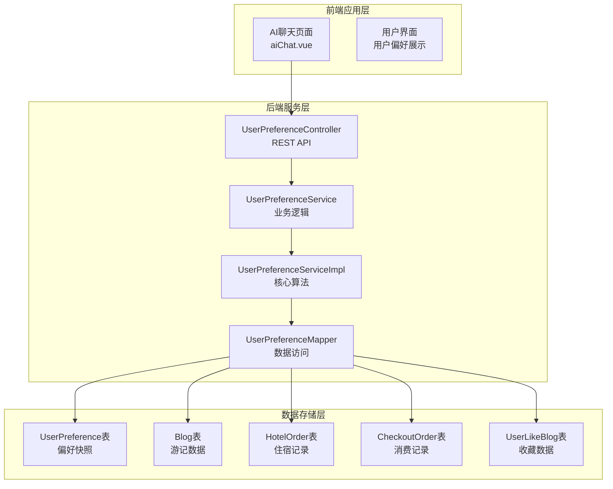
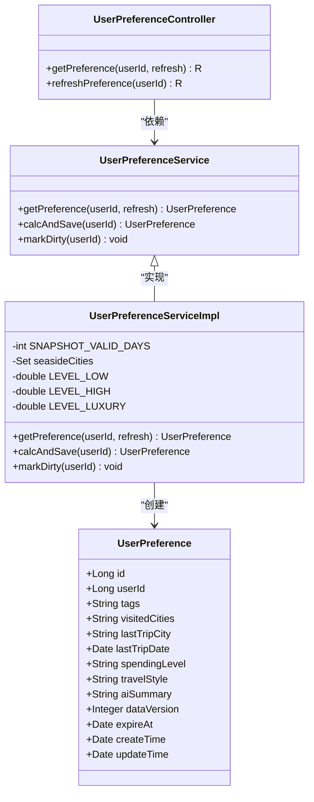
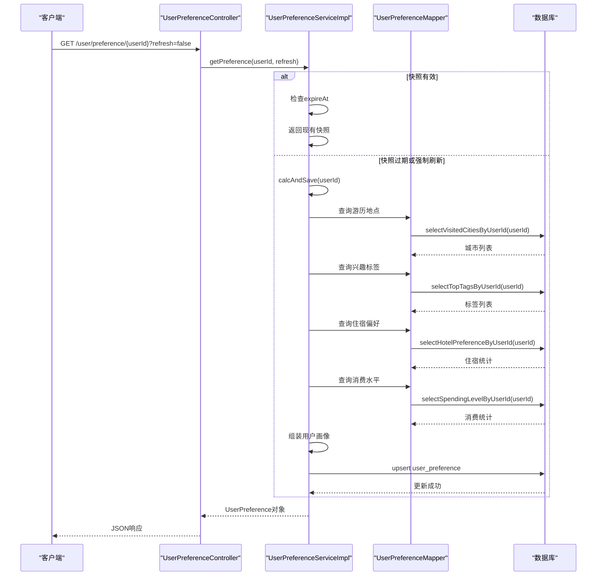
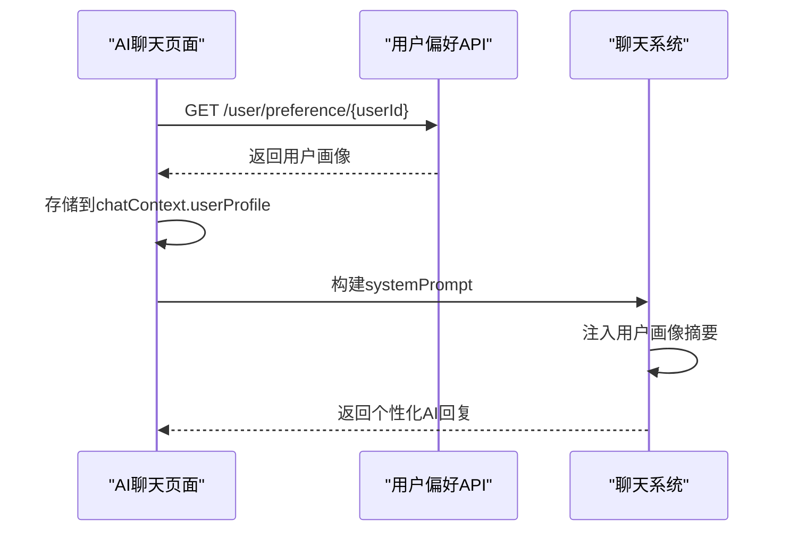
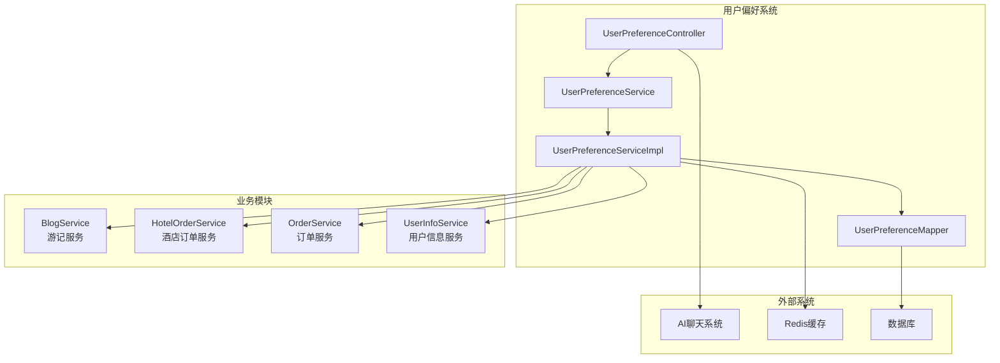

# 用户偏好系统

<cite>
**本文档引用的文件**
- [UserPreferenceController.java](file://springboot-travel-social/src/main/java/com/cxx/controller/UserPreferenceController.java)
- [UserPreferenceService.java](file://springboot-travel-social/src/main/java/com/cxx/service/UserPreferenceService.java)
- [UserPreferenceServiceImpl.java](file://springboot-travel-social/src/main/java/com/cxx/service/impl/UserPreferenceServiceImpl.java)
- [UserPreferenceMapper.java](file://springboot-travel-social/src/main/java/com/cxx/mapper/UserPreferenceMapper.java)
- [UserPreferenceMapper.xml](file://springboot-travel-social/src/main/resources/com/cxx/mapper/UserPreferenceMapper.xml)
- [UserPreference.java](file://springboot-travel-social/src/main/java/com/cxx/entity/UserPreference.java)
- [aiChat.vue](file://uniapp-travel-social/homePages/aiChat/aiChat.vue)
- [方案①-个性化AI推荐.md](file://方案①-个性化AI推荐.md)
- [travel_socical.sql](file://travel_socical.sql)
</cite>

## 目录
1. [简介](#简介)
2. [项目结构](#项目结构)
3. [核心组件](#核心组件)
4. [架构概览](#架构概览)
5. [详细组件分析](#详细组件分析)
6. [依赖关系分析](#依赖关系分析)
7. [性能考量](#性能考量)
8. [故障排除指南](#故障排除指南)
9. [结论](#结论)

## 简介

用户偏好系统是旅游攻略社交小程序中的核心智能化功能模块，旨在通过分析用户的历史旅行行为数据，构建个性化的旅行偏好画像，并将其注入AI聊天系统中，为用户提供更加精准和个性化的旅行推荐服务。

该系统通过聚合用户在平台内的多种行为数据，包括游记发布、酒店预订、消费记录、收藏内容等，自动提取用户的旅行偏好标签，如"海边度假"、"亲子游"、"美食探索"、"高端住宿"等，并生成自然语言描述的用户画像摘要。

## 项目结构

用户偏好系统主要分布在以下两个技术栈中：

### 后端Spring Boot服务层
- **控制器层**：UserPreferenceController - 提供RESTful API接口
- **服务层**：UserPreferenceService + UserPreferenceServiceImpl - 核心业务逻辑处理
- **数据访问层**：UserPreferenceMapper + UserPreferenceMapper.xml - 数据库操作
- **实体层**：UserPreference - 数据模型定义

### 前端UniApp应用层
- **AI聊天页面**：aiChat.vue - 集成用户偏好画像的AI交互界面



**图表来源**
- [UserPreferenceController.java:1-56](file://springboot-travel-social/src/main/java/com/cxx/controller/UserPreferenceController.java#L1-56)
- [UserPreferenceService.java:1-30](file://springboot-travel-social/src/main/java/com/cxx/service/UserPreferenceService.java#L1-30)
- [UserPreferenceServiceImpl.java:1-227](file://springboot-travel-social/src/main/java/com/cxx/service/impl/UserPreferenceServiceImpl.java#L1-227)

**章节来源**
- [UserPreferenceController.java:1-56](file://springboot-travel-social/src/main/java/com/cxx/controller/UserPreferenceController.java#L1-56)
- [UserPreferenceService.java:1-30](file://springboot-travel-social/src/main/java/com/cxx/service/UserPreferenceService.java#L1-30)
- [UserPreferenceServiceImpl.java:1-227](file://springboot-travel-social/src/main/java/com/cxx/service/impl/UserPreferenceServiceImpl.java#L1-227)

## 核心组件

### 用户偏好实体模型

UserPreference实体类定义了用户偏好的完整数据结构，包括基础信息、偏好标签、旅行历史和AI摘要等关键字段。



**图表来源**
- [UserPreference.java:1-74](file://springboot-travel-social/src/main/java/com/cxx/entity/UserPreference.java#L1-74)
- [UserPreferenceController.java:1-56](file://springboot-travel-social/src/main/java/com/cxx/controller/UserPreferenceController.java#L1-56)
- [UserPreferenceService.java:1-30](file://springboot-travel-social/src/main/java/com/cxx/service/UserPreferenceService.java#L1-30)
- [UserPreferenceServiceImpl.java:1-227](file://springboot-travel-social/src/main/java/com/cxx/service/impl/UserPreferenceServiceImpl.java#L1-227)

### 数据库表结构

系统使用专门的user_preference表来存储用户偏好的快照数据，确保查询性能和数据一致性。

**章节来源**
- [UserPreference.java:1-74](file://springboot-travel-social/src/main/java/com/cxx/entity/UserPreference.java#L1-74)
- [UserPreferenceMapper.xml:67-84](file://springboot-travel-social/src/main/resources/com/cxx/mapper/UserPreferenceMapper.xml#L67-84)

## 架构概览

用户偏好系统采用分层架构设计，实现了数据采集、处理、存储和应用的完整闭环。



**图表来源**
- [UserPreferenceController.java:31-43](file://springboot-travel-social/src/main/java/com/cxx/controller/UserPreferenceController.java#L31-43)
- [UserPreferenceServiceImpl.java:45-58](file://springboot-travel-social/src/main/java/com/cxx/service/impl/UserPreferenceServiceImpl.java#L45-58)
- [UserPreferenceMapper.xml:5-124](file://springboot-travel-social/src/main/resources/com/cxx/mapper/UserPreferenceMapper.xml#L5-124)

## 详细组件分析

### 数据采集与分析引擎

UserPreferenceServiceImpl是系统的核心算法引擎，负责从多个数据源收集用户行为信息并进行综合分析。

#### 数据源分析流程

系统从以下五个主要数据源获取用户信息：

1. **游记数据** (blog表) - 分析游历地点和兴趣标签
2. **酒店预订数据** (hotel_order表) - 分析住宿偏好和出行模式  
3. **消费记录** (checkout_order表) - 分析消费水平和购买偏好
4. **收藏数据** (user_like_blog表) - 分析间接兴趣偏好
5. **用户行为** (user_save_video表) - 分析内容偏好

#### 偏好标签生成规则

```mermaid
flowchart TD
A[开始计算用户偏好] --> B[收集基础数据]
B --> C[分析游历地点]
C --> D{是否包含海边城市?}
D --> |是| E[添加"海边"标签]
D --> |否| F[跳过]
E --> G[分析游记标签]
F --> G
G --> H[分析收藏标签]
H --> I[分析住宿偏好]
I --> J{平均入住人数>2?}
J --> |是| K[添加"亲子/团队"标签]
J --> |否| L[跳过]
K --> M[分析消费水平]
L --> M
M --> N{消费水平分类}
N --> |≥2000| O[添加"高端奢华"标签]
N --> |≥500| P[添加"中高档"标签]
N --> |<100| Q[添加"经济实惠"标签]
N --> |100-500| R[添加"中等"标签]
O --> S[分析美食偏好]
P --> S
Q --> S
R --> S
S --> T[分析最近出行]
T --> U[生成AI摘要]
U --> V[保存快照]
V --> W[结束]
```

**图表来源**
- [UserPreferenceServiceImpl.java:61-177](file://springboot-travel-social/src/main/java/com/cxx/service/impl/UserPreferenceServiceImpl.java#L61-177)

#### AI摘要生成算法

系统将分析得到的偏好信息转换为自然语言描述，用于AI系统的上下文注入：

| 偏好类型 | 生成规则 | 示例输出 |
|---------|---------|---------|
| 兴趣标签 | 列举所有标签，用顿号连接 | "喜欢海边、亲子、美食" |
| 消费水平 | 映射数值区间到描述词 | "消费档次偏中高档" |
| 历史城市 | 限制前5个，JSON数组格式 | "曾去过三亚、厦门" |
| 最近出行 | 包含时间和地点信息 | "最近一次出行是三亚（2024年10月）" |

**章节来源**
- [UserPreferenceServiceImpl.java:193-225](file://springboot-travel-social/src/main/java/com/cxx/service/impl/UserPreferenceServiceImpl.java#L193-225)

### 快照缓存机制

系统采用快照缓存策略来平衡数据新鲜度和系统性能：

#### 缓存策略设计

| 触发条件 | 操作 | 目的 |
|---------|------|------|
| 新增/完成订单 | 异步标记为"待刷新" | 确保偏好数据及时更新 |
| 发布新游记 | 异步标记为"待刷新" | 反映最新的旅行体验 |
| 用户进入AI页面 | 检查快照有效期 | 平衡性能和准确性 |
| 快照过期(7天) | 重新计算 | 保证数据时效性 |

#### 缓存失效机制

系统使用expire_at字段控制快照的有效期，支持以下失效场景：
- 快照创建7天后自动过期
- 用户行为变化时手动标记过期
- 强制刷新请求
- 系统维护期间的批量刷新

**章节来源**
- [UserPreferenceServiceImpl.java:30-31](file://springboot-travel-social/src/main/java/com/cxx/service/impl/UserPreferenceServiceImpl.java#L30-31)
- [UserPreferenceServiceImpl.java:180-189](file://springboot-travel-social/src/main/java/com/cxx/service/impl/UserPreferenceServiceImpl.java#L180-189)

### 前端集成与应用

AI聊天页面通过静默方式获取用户偏好信息，并将其注入到AI系统的提示词中。

#### 前端集成流程



**图表来源**
- [方案①-个性化AI推荐.md:165-196](file://方案①-个性化AI推荐.md#L165-196)

#### 个性化欢迎语实现

系统根据用户的最近出行记录提供个性化的欢迎语：
- 如果用户有最近出行记录：`"欢迎回来！您上次去了{lastTripCity}，这次想去哪里探索？"`
- 如果用户没有出行记录：使用默认欢迎语

**章节来源**
- [方案①-个性化AI推荐.md:198-202](file://方案①-个性化AI推荐.md#L198-202)

## 依赖关系分析

用户偏好系统与其他模块存在紧密的依赖关系：



**图表来源**
- [UserPreferenceController.java:1-56](file://springboot-travel-social/src/main/java/com/cxx/controller/UserPreferenceController.java#L1-56)
- [UserPreferenceService.java:1-30](file://springboot-travel-social/src/main/java/com/cxx/service/UserPreferenceService.java#L1-30)

### 数据依赖关系

系统依赖以下核心数据表：

| 表名 | 依赖关系 | 用途 |
|------|---------|------|
| blog | 主表 | 存储用户游记内容和标签 |
| hotel_order | 关联表 | 存储酒店预订信息 |
| checkout_order | 关联表 | 存储消费订单详情 |
| user_like_blog | 关联表 | 存储用户收藏的游记 |
| user_save_video | 关联表 | 存储用户收藏的视频内容 |

**章节来源**
- [方案①-个性化AI推荐.md:52-61](file://方案①-个性化AI推荐.md#L52-61)

## 性能考量

### 查询优化策略

系统针对大数据量场景采用了多项优化措施：

1. **索引优化**：在user_id、create_time等关键字段上建立索引
2. **分页查询**：限制查询结果数量，避免全表扫描
3. **缓存策略**：使用快照缓存减少重复计算
4. **异步处理**：使用@Async注解异步标记偏好刷新

### 性能指标

| 操作类型 | 响应时间 | 优化目标 |
|---------|---------|---------|
| 快照查询 | < 10ms | 使用缓存快照 |
| 偏好计算 | < 500ms | 优化SQL查询 |
| 数据库查询 | < 100ms | 索引和分页优化 |

### 扩展性设计

系统支持水平扩展和垂直扩展：
- **水平扩展**：支持多实例部署，使用分布式缓存
- **垂直扩展**：数据库读写分离，分库分表
- **异步处理**：使用消息队列处理大量计算任务

## 故障排除指南

### 常见问题及解决方案

#### 1. 偏好计算失败

**症状**：用户偏好为空，AI聊天无个性化推荐

**排查步骤**：
1. 检查数据库连接是否正常
2. 验证相关数据表是否存在
3. 查看服务日志中的异常信息
4. 确认用户ID是否正确

**解决方案**：
- 重启服务实例
- 检查数据库权限
- 验证SQL查询语法
- 清理缓存数据

#### 2. 偏好数据过期

**症状**：用户偏好信息陈旧，推荐不够准确

**排查步骤**：
1. 检查expire_at字段是否过期
2. 验证快照更新机制
3. 确认异步刷新任务是否正常

**解决方案**：
- 手动触发偏好刷新
- 检查定时任务配置
- 优化快照更新策略

#### 3. 前端集成问题

**症状**：AI聊天页面无法显示个性化推荐

**排查步骤**：
1. 检查API接口调用是否成功
2. 验证用户画像数据格式
3. 确认前端注入逻辑

**解决方案**：
- 检查网络连接
- 验证API响应格式
- 更新前端代码逻辑

**章节来源**
- [UserPreferenceServiceImpl.java:172-176](file://springboot-travel-social/src/main/java/com/cxx/service/impl/UserPreferenceServiceImpl.java#L172-176)

## 结论

用户偏好系统通过智能化的数据分析和机器学习算法，为旅游攻略社交小程序提供了强大的个性化推荐能力。系统采用分层架构设计，实现了高效的数据处理、智能的偏好分析和无缝的用户体验集成。

### 系统优势

1. **实时性强**：通过快照缓存和异步更新机制，平衡了数据新鲜度和系统性能
2. **覆盖面广**：聚合多种用户行为数据，提供全面的旅行偏好画像
3. **扩展性好**：模块化设计支持功能扩展和技术升级
4. **用户体验佳**：为用户提供个性化的旅行推荐和智能化服务

### 技术亮点

1. **智能标签生成**：自动识别用户兴趣偏好，生成准确的标签体系
2. **自然语言摘要**：将复杂的数据分析结果转换为易理解的描述文本
3. **缓存优化策略**：有效的快照管理和缓存机制提升系统性能
4. **异步处理架构**：支持大规模并发访问和实时数据更新

该系统为旅游攻略社交小程序的智能化发展奠定了坚实的技术基础，为用户提供了更加个性化和智能化的旅行服务体验。