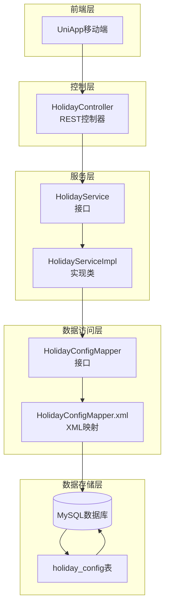
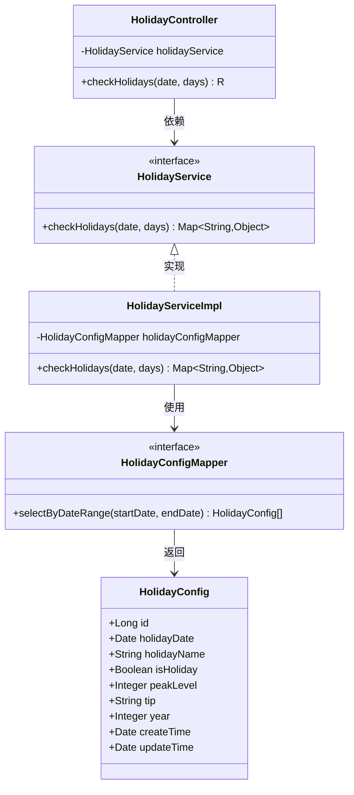
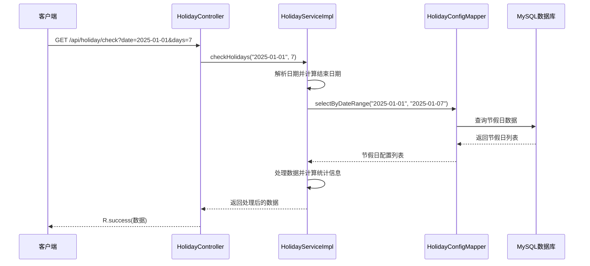
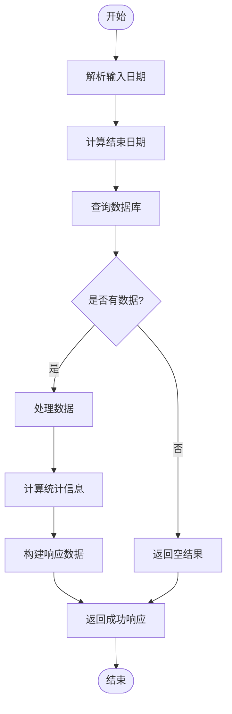

# 节假日配置系统

<cite>
**本文档引用的文件**
- [HolidayConfig.java](file://springboot-travel-social/src/main/java/com/cxx/entity/HolidayConfig.java)
- [HolidayController.java](file://springboot-travel-social/src/main/java/com/cxx/controller/HolidayController.java)
- [HolidayService.java](file://springboot-travel-social/src/main/java/com/cxx/service/HolidayService.java)
- [HolidayServiceImpl.java](file://springboot-travel-social/src/main/java/com/cxx/service/impl/HolidayServiceImpl.java)
- [HolidayConfigMapper.java](file://springboot-travel-social/src/main/java/com/cxx/mapper/HolidayConfigMapper.java)
- [HolidayConfigMapper.xml](file://springboot-travel-social/src/main/resources/com/cxx/mapper/HolidayConfigMapper.xml)
- [holiday_config.sql](file://springboot-travel-social/src/main/resources/sql/holiday_config.sql)
- [application.properties](file://springboot-travel-social/src/main/resources/application.properties)
- [MybatisPlusConfig.java](file://springboot-travel-social/src/main/java/com/cxx/config/MybatisPlusConfig.java)
- [SwaggerConfig.java](file://springboot-travel-social/src/main/java/com/cxx/config/SwaggerConfig.java)
- [R.java](file://springboot-travel-social/src/main/java/com/cxx/entity/R.java)
- [TravelSocialApplication.java](file://springboot-travel-social/src/main/java/com/cxx/TravelSocialApplication.java)
</cite>

## 目录
1. [项目概述](#项目概述)
2. [系统架构](#系统架构)
3. [核心组件分析](#核心组件分析)
4. [数据模型设计](#数据模型设计)
5. [API接口设计](#api接口设计)
6. [业务流程分析](#业务流程分析)
7. [性能优化策略](#性能优化策略)
8. [故障排查指南](#故障排查指南)
9. [总结](#总结)

## 项目概述

节假日配置系统是旅游攻略社交小程序后端的重要组成部分，主要用于管理和查询节假日信息。该系统通过RESTful API提供节假日数据查询功能，支持按日期范围查询节假日配置，并提供出行高峰等级评估和出行建议。

系统采用Spring Boot + MyBatis Plus技术栈构建，实现了完整的CRUD操作和灵活的数据查询功能。数据库中预置了2025年和2026年的主要节假日数据，包括春节、国庆节、五一劳动节等重要节日。

## 系统架构



**图表来源**
- [HolidayController.java:19-41](file://springboot-travel-social/src/main/java/com/cxx/controller/HolidayController.java#L19-L41)
- [HolidayServiceImpl.java:19-89](file://springboot-travel-social/src/main/java/com/cxx/service/impl/HolidayServiceImpl.java#L19-L89)
- [HolidayConfigMapper.java:12-22](file://springboot-travel-social/src/main/java/com/cxx/mapper/HolidayConfigMapper.java#L12-L22)
- [HolidayConfigMapper.xml:4-25](file://springboot-travel-social/src/main/resources/com/cxx/mapper/HolidayConfigMapper.xml#L4-L25)

## 核心组件分析

### 实体类设计



**图表来源**
- [HolidayConfig.java:21-56](file://springboot-travel-social/src/main/java/com/cxx/entity/HolidayConfig.java#L21-L56)
- [HolidayController.java:23-40](file://springboot-travel-social/src/main/java/com/cxx/controller/HolidayController.java#L23-L40)
- [HolidayService.java:8-18](file://springboot-travel-social/src/main/java/com/cxx/service/HolidayService.java#L8-L18)
- [HolidayServiceImpl.java:22-89](file://springboot-travel-social/src/main/java/com/cxx/service/impl/HolidayServiceImpl.java#L22-L89)
- [HolidayConfigMapper.java:12-22](file://springboot-travel-social/src/main/java/com/cxx/mapper/HolidayConfigMapper.java#L12-L22)

### 控制器层

HolidayController作为RESTful API的入口点，提供了简洁的接口设计：

- **端点**: `/api/holiday/check`
- **方法**: GET请求
- **参数**: 
  - `date`: 起始日期 (yyyy-MM-dd格式)
  - `days`: 查询天数 (默认7天)
- **返回值**: 统一响应格式R

**章节来源**
- [HolidayController.java:33-40](file://springboot-travel-social/src/main/java/com/cxx/controller/HolidayController.java#L33-L40)

### 服务层实现

HolidayServiceImpl实现了核心业务逻辑，包含以下关键功能：

1. **日期范围计算**: 将输入日期转换为LocalDate对象，并计算结束日期
2. **数据查询**: 调用Mapper接口查询指定日期范围内的节假日
3. **数据处理**: 对查询结果进行转换和聚合处理
4. **异常处理**: 提供完善的错误处理机制

**章节来源**
- [HolidayServiceImpl.java:29-89](file://springboot-travel-social/src/main/java/com/cxx/service/impl/HolidayServiceImpl.java#L29-L89)

## 数据模型设计

### 数据库表结构

```mermaid
erDiagram
HOLIDAY_CONFIG {
BIGINT id PK
DATE holiday_date UK
VARCHAR(50) holiday_name
TINYINT is_holiday
TINYINT peak_level
VARCHAR(200) tip
SMALLINT year
DATETIME create_time
DATETIME update_time
}
INDEX idx_year ON HOLIDAY_CONFIG(year)
UNIQUE uk_date ON HOLIDAY_CONFIG(holiday_date)
```

**图表来源**
- [holiday_config.sql:2-15](file://springboot-travel-social/src/main/resources/sql/holiday_config.sql#L2-L15)

### 关键字段说明

| 字段名 | 类型 | 约束 | 描述 |
|--------|------|------|------|
| id | BIGINT | 主键, 自增 | 节假日配置主键 |
| holiday_date | DATE | 唯一索引 | 节假日具体日期 |
| holiday_name | VARCHAR(50) | NOT NULL | 节假日名称 |
| is_holiday | TINYINT(1) | NOT NULL, 默认1 | 是否为节假日 (1=节假日, 0=调休工作日) |
| peak_level | TINYINT | NOT NULL, 默认1 | 出行高峰等级 (1=一般, 2=高峰, 3=超高峰) |
| tip | VARCHAR(200) | 可空 | 出行建议 |
| year | SMALLINT | NOT NULL | 所属年份 |
| create_time | DATETIME | NOT NULL, 默认当前时间 | 创建时间 |
| update_time | DATETIME | NOT NULL, 默认当前时间 | 更新时间 |

**章节来源**
- [holiday_config.sql:2-15](file://springboot-travel-social/src/main/resources/sql/holiday_config.sql#L2-L15)

## API接口设计

### 接口规范



**图表来源**
- [HolidayController.java:33-40](file://springboot-travel-social/src/main/java/com/cxx/controller/HolidayController.java#L33-L40)
- [HolidayServiceImpl.java:30-76](file://springboot-travel-social/src/main/java/com/cxx/service/impl/HolidayServiceImpl.java#L30-L76)
- [HolidayConfigMapper.java:21-22](file://springboot-travel-social/src/main/java/com/cxx/mapper/HolidayConfigMapper.java#L21-L22)

### 请求参数说明

| 参数名 | 必需 | 类型 | 默认值 | 描述 |
|--------|------|------|--------|------|
| date | 是 | String | 无 | 起始日期，格式: yyyy-MM-dd |
| days | 否 | Integer | 7 | 查询天数范围 |

### 响应数据结构

系统返回统一的JSON格式数据，包含以下关键字段：

| 字段名 | 类型 | 描述 |
|--------|------|------|
| holidays | Array | 节假日详细列表 |
| totalHolidayDays | Number | 节假日总天数 |
| isPeakSeason | Boolean | 是否处于出行高峰期 |
| peakLevel | Number | 最高出行等级 |
| holidayNames | String | 节假日名称集合 |
| tips | Array | 出行建议列表 |

**章节来源**
- [HolidayServiceImpl.java:69-76](file://springboot-travel-social/src/main/java/com/cxx/service/impl/HolidayServiceImpl.java#L69-L76)

## 业务流程分析

### 核心业务流程



**图表来源**
- [HolidayServiceImpl.java:30-89](file://springboot-travel-social/src/main/java/com/cxx/service/impl/HolidayServiceImpl.java#L30-L89)

### 数据处理逻辑

系统在查询到节假日数据后，会执行以下处理步骤：

1. **节假日列表转换**: 将数据库实体转换为API响应格式
2. **统计信息计算**: 
   - 计算节假日总天数
   - 判断是否处于出行高峰期
   - 获取最高出行等级
3. **去重处理**: 对出行建议和节假日名称进行去重
4. **结果组装**: 将所有信息组织成统一的响应格式

**章节来源**
- [HolidayServiceImpl.java:38-76](file://springboot-travel-social/src/main/java/com/cxx/service/impl/HolidayServiceImpl.java#L38-L76)

## 性能优化策略

### 数据库优化

1. **索引设计**:
   - `uk_date`: 唯一索引，确保日期唯一性
   - `idx_year`: 年份索引，支持按年份查询

2. **查询优化**:
   - 使用精确的日期范围查询
   - 避免SELECT *，只查询必要字段

### 缓存策略

虽然当前实现未集成缓存，但可以考虑以下优化方案：

1. **Redis缓存**: 缓存热点节假日数据
2. **本地缓存**: 使用Caffeine缓存近期查询结果
3. **分页查询**: 对大量数据查询使用分页机制

### 异步处理

对于大数据量的节假日统计，可以考虑异步处理机制，避免阻塞主线程。

## 故障排查指南

### 常见问题及解决方案

| 问题类型 | 症状 | 可能原因 | 解决方案 |
|----------|------|----------|----------|
| 数据库连接失败 | 应用启动报错 | 连接配置错误 | 检查application.properties中的数据库配置 |
| 查询无结果 | 返回空数组 | 日期范围超出数据范围 | 验证查询日期是否在预置数据范围内 |
| 日期格式错误 | 抛出ParseException | 日期格式不正确 | 确保传入日期格式为yyyy-MM-dd |
| 性能问题 | 查询响应慢 | 缺少索引或查询条件不当 | 检查数据库索引和查询条件 |

### 日志监控

系统提供了完善的异常处理机制，在发生异常时会记录详细的错误日志，包括：
- 异常时间
- 输入参数
- 异常堆栈信息

**章节来源**
- [HolidayServiceImpl.java:78-88](file://springboot-travel-social/src/main/java/com/cxx/service/impl/HolidayServiceImpl.java#L78-L88)

## 总结

节假日配置系统是一个设计合理、功能完整的模块化服务。系统采用清晰的分层架构，实现了良好的代码分离和职责划分。主要特点包括：

1. **清晰的架构设计**: 采用经典的三层架构模式，职责明确
2. **完善的异常处理**: 提供了健壮的错误处理机制
3. **标准化的响应格式**: 统一的R类封装，便于前后端交互
4. **可扩展的设计**: 接口抽象良好，易于功能扩展

系统目前支持2025年和2026年的节假日数据，为用户提供准确的节假日查询和出行建议。未来可以考虑增加更多功能，如节假日动态更新、用户个性化设置等。