# 行程协作系统

<cite>
**本文档引用的文件**
- [ItineraryCollabController.java](file://springboot-travel-social/src/main/java/com/cxx/controller/ItineraryCollabController.java)
- [ItineraryCollabService.java](file://springboot-travel-social/src/main/java/com/cxx/service/ItineraryCollabService.java)
- [ItineraryCollabServiceImpl.java](file://springboot-travel-social/src/main/java/com/cxx/service/impl/ItineraryCollabServiceImpl.java)
- [ItineraryCollabRoom.java](file://springboot-travel-social/src/main/java/com/cxx/entity/ItineraryCollabRoom.java)
- [ItineraryCollabMember.java](file://springboot-travel-social/src/main/java/com/cxx/entity/ItineraryCollabMember.java)
- [ItineraryCollabMessage.java](file://springboot-travel-social/src/main/java/com/cxx/entity/ItineraryCollabMessage.java)
- [Itinerary.java](file://springboot-travel-social/src/main/java/com/cxx/entity/Itinerary.java)
- [itinerary_collab.sql](file://springboot-travel-social/src/main/resources/sql/itinerary_collab.sql)
- [itinerary.vue](file://uniapp-travel-social/homePages/itinerary/itinerary.vue)
- [itinerary-collab.vue](file://uniapp-travel-social/homePages/itinerary/itinerary-collab.vue)
- [itinerary-history.vue](file://uniapp-travel-social/homePages/itinerary/itinerary-history.vue)
- [WebSocketServer.java](file://springboot-travel-social/src/main/java/com/cxx/component/WebSocketServer.java)
- [NettyWebSocketServer.java](file://springboot-travel-social/src/main/java/com/cxx/component/NettyWebSocketServer.java)
- [WebSocketConfig.java](file://springboot-travel-social/src/main/java/com/cxx/config/WebSocketConfig.java)
- [DeepSeekService.java](file://springboot-travel-social/src/main/java/com/cxx/service/DeepSeekService.java)
</cite>

## 更新摘要
**变更内容**
- 新增完整的行程协作控制器ItineraryCollabController及其相关实体类分析
- 更新后端服务实现，包含完整的协作房间管理、成员管理、消息通信功能
- 新增AI智能行程生成与WebSocket实时通信的完整实现
- 更新数据库设计，包含协作房间、成员、消息三张核心表结构
- 新增前端Vue组件分析，包含协作房间界面和实时消息交互
- 新增DeepSeekService集成AI服务的完整实现

## 目录
1. [项目概述](#项目概述)
2. [系统架构](#系统架构)
3. [核心组件](#核心组件)
4. [数据库设计](#数据库设计)
5. [API接口设计](#api接口设计)
6. [实时通信机制](#实时通信机制)
7. [AI智能生成](#ai智能生成)
8. [前端交互实现](#前端交互实现)
9. [安全与权限控制](#安全与权限控制)
10. [性能优化策略](#性能优化策略)
11. [故障排查指南](#故障排查指南)
12. [总结](#总结)

## 项目概述

行程协作系统是一个基于Spring Boot和UniApp开发的旅游行程协作平台，旨在为用户提供实时的多人行程规划功能。系统支持创建协作房间、邀请成员加入、实时消息聊天、AI智能行程生成等核心功能。

### 主要特性
- **实时协作**：支持多用户同时在线协作规划行程
- **AI智能生成**：基于成员偏好自动生成个性化行程方案
- **多种消息类型**：支持文本消息、AI生成消息、系统通知
- **权限管理**：区分房间创建者(owner)和普通成员(member)
- **消息持久化**：完整的消息记录和历史查询功能
- **行程管理**：支持行程保存、历史记录管理和分享功能

## 系统架构

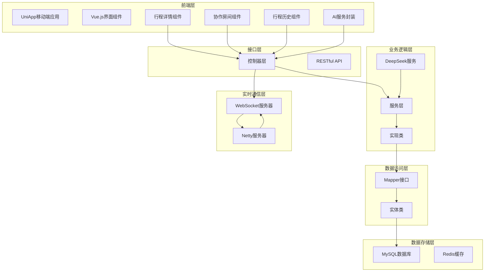

**图表来源**
- [ItineraryCollabController.java:26-138](file://springboot-travel-social/src/main/java/com/cxx/controller/ItineraryCollabController.java#L26-L138)
- [ItineraryCollabServiceImpl.java:27-368](file://springboot-travel-social/src/main/java/com/cxx/service/impl/ItineraryCollabServiceImpl.java#L27-L368)

## 核心组件

### 控制器层

控制器层负责处理HTTP请求和响应，提供RESTful API接口。

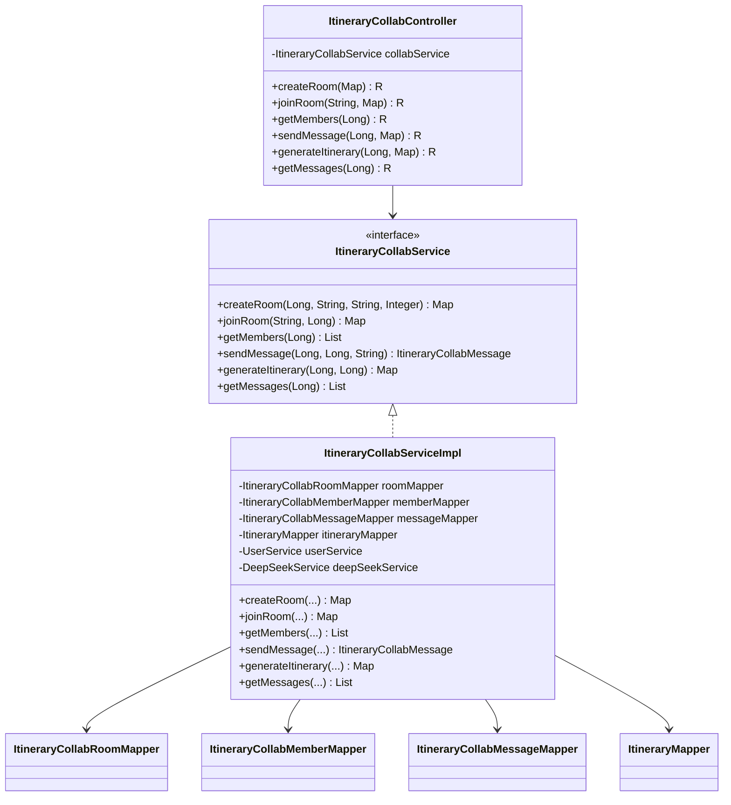

**图表来源**
- [ItineraryCollabController.java:26-138](file://springboot-travel-social/src/main/java/com/cxx/controller/ItineraryCollabController.java#L26-L138)
- [ItineraryCollabService.java:11-68](file://springboot-travel-social/src/main/java/com/cxx/service/ItineraryCollabService.java#L11-L68)
- [ItineraryCollabServiceImpl.java:27-368](file://springboot-travel-social/src/main/java/com/cxx/service/impl/ItineraryCollabServiceImpl.java#L27-L368)

**章节来源**
- [ItineraryCollabController.java:26-138](file://springboot-travel-social/src/main/java/com/cxx/controller/ItineraryCollabController.java#L26-L138)
- [ItineraryCollabService.java:11-68](file://springboot-travel-social/src/main/java/com/cxx/service/ItineraryCollabService.java#L11-L68)
- [ItineraryCollabServiceImpl.java:27-368](file://springboot-travel-social/src/main/java/com/cxx/service/impl/ItineraryCollabServiceImpl.java#L27-L368)

## 数据库设计

系统采用MySQL数据库存储协作相关信息，包含三个核心表和ai_itinerary表的扩展。

### 行程表扩展设计

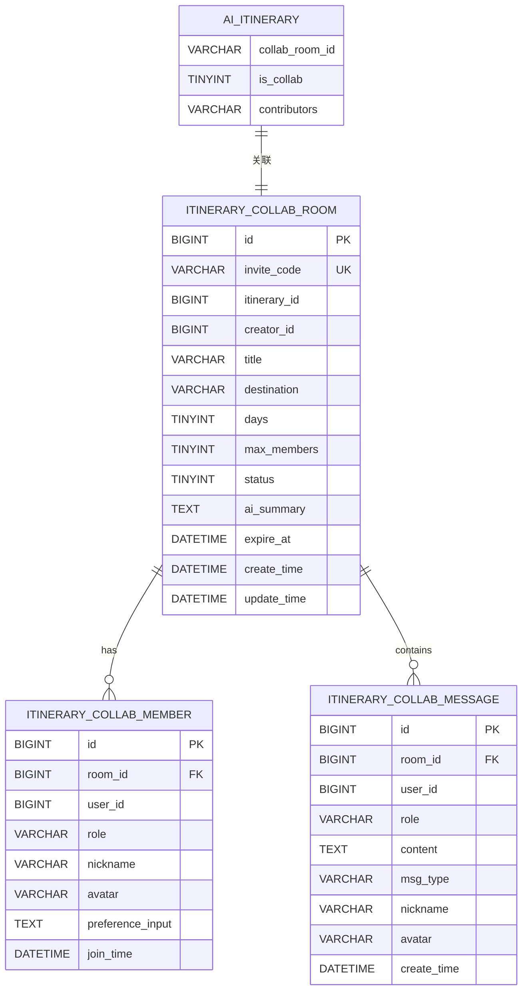

**图表来源**
- [itinerary_collab.sql:5-60](file://springboot-travel-social/src/main/resources/sql/itinerary_collab.sql#L5-L60)

### 实体类设计

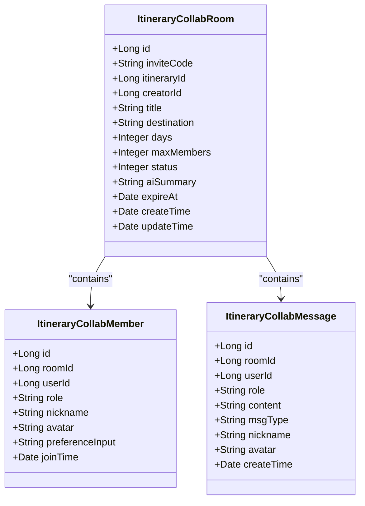

**图表来源**
- [ItineraryCollabRoom.java:21-67](file://springboot-travel-social/src/main/java/com/cxx/entity/ItineraryCollabRoom.java#L21-L67)
- [ItineraryCollabMember.java:21-48](file://springboot-travel-social/src/main/java/com/cxx/entity/ItineraryCollabMember.java#L21-L48)
- [ItineraryCollabMessage.java:21-52](file://springboot-travel-social/src/main/java/com/cxx/entity/ItineraryCollabMessage.java#L21-L52)

**章节来源**
- [itinerary_collab.sql:5-60](file://springboot-travel-social/src/main/resources/sql/itinerary_collab.sql#L5-L60)
- [ItineraryCollabRoom.java:21-67](file://springboot-travel-social/src/main/java/com/cxx/entity/ItineraryCollabRoom.java#L21-L67)
- [ItineraryCollabMember.java:21-48](file://springboot-travel-social/src/main/java/com/cxx/entity/ItineraryCollabMember.java#L21-L48)
- [ItineraryCollabMessage.java:21-52](file://springboot-travel-social/src/main/java/com/cxx/entity/ItineraryCollabMessage.java#L21-L52)

## API接口设计

系统提供完整的RESTful API接口，支持行程协作的所有核心功能：

### 协作房间接口

| 接口 | 方法 | 描述 | 请求参数 | 响应示例 |
|------|------|------|----------|----------|
| `/itinerary/collab/create` | POST | 创建协作房间 | creatorId, title, destination, days | 房间ID, 邀请码, 过期时间 |
| `/itinerary/collab/join/{code}` | POST | 通过邀请码加入房间 | userId | 房间信息, 成员列表 |
| `/itinerary/collab/members/{roomId}` | GET | 获取房间成员列表 | roomId | 成员信息列表 |
| `/itinerary/collab/{roomId}/message` | POST | 发送协作消息 | userId, content | 消息对象 |
| `/itinerary/collab/{roomId}/generate` | POST | AI生成协作行程 | userId | 行程ID, 内容 |
| `/itinerary/collab/{roomId}/messages` | GET | 获取历史消息 | roomId | 消息列表 |

**章节来源**
- [ItineraryCollabController.java:32-137](file://springboot-travel-social/src/main/java/com/cxx/controller/ItineraryCollabController.java#L32-L137)

## 实时通信机制

系统采用WebSocket技术实现实时消息推送，确保协作过程中的即时通信。

### WebSocket服务器架构

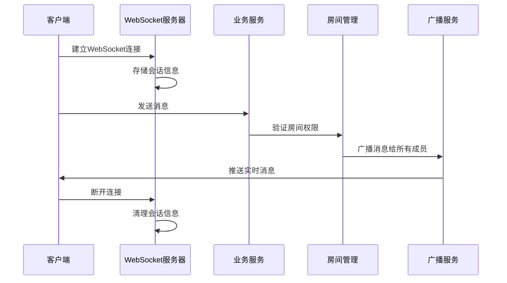

**图表来源**
- [WebSocketServer.java:23-137](file://springboot-travel-social/src/main/java/com/cxx/component/WebSocketServer.java#L23-L137)
- [ItineraryCollabServiceImpl.java:347-366](file://springboot-travel-social/src/main/java/com/cxx/service/impl/ItineraryCollabServiceImpl.java#L347-L366)

### 消息广播流程

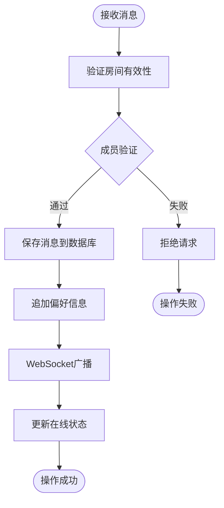

**图表来源**
- [ItineraryCollabServiceImpl.java:141-171](file://springboot-travel-social/src/main/java/com/cxx/service/impl/ItineraryCollabServiceImpl.java#L141-L171)

**章节来源**
- [WebSocketServer.java:23-137](file://springboot-travel-social/src/main/java/com/cxx/component/WebSocketServer.java#L23-L137)
- [NettyWebSocketServer.java:28-77](file://springboot-travel-social/src/main/java/com/cxx/component/NettyWebSocketServer.java#L28-L77)
- [WebSocketConfig.java:8-13](file://springboot-travel-social/src/main/java/com/cxx/config/WebSocketConfig.java#L8-L13)

## AI智能生成

系统集成了AI能力，能够根据成员的偏好输入自动生成个性化的行程方案。

### AI生成流程

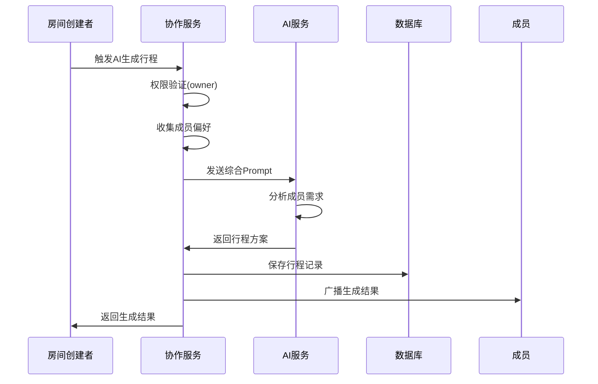

**图表来源**
- [ItineraryCollabServiceImpl.java:175-239](file://springboot-travel-social/src/main/java/com/cxx/service/impl/ItineraryCollabServiceImpl.java#L175-L239)

### Prompt构建策略

系统会动态构建AI提示词，综合考虑所有成员的偏好和需求：

1. **成员数量统计**：统计房间内成员总数
2. **目的地信息**：包含目的地和行程天数
3. **个人偏好汇总**：整合每个成员的偏好输入
4. **生成要求说明**：明确行程结构和格式要求

**章节来源**
- [ItineraryCollabServiceImpl.java:286-306](file://springboot-travel-social/src/main/java/com/cxx/service/impl/ItineraryCollabServiceImpl.java#L286-L306)

## 前端交互实现

前端采用UniApp框架开发，提供流畅的移动端用户体验。

### 界面组件设计

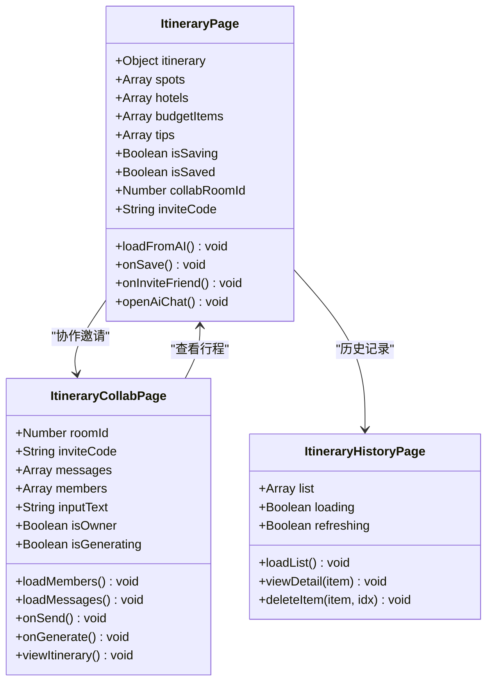

**图表来源**
- [itinerary.vue:461-514](file://uniapp-travel-social/homePages/itinerary/itinerary.vue#L461-L514)
- [itinerary-collab.vue:139-302](file://uniapp-travel-social/homePages/itinerary/itinerary-collab.vue#L139-L302)
- [itinerary-history.vue:84-172](file://uniapp-travel-social/homePages/itinerary/itinerary-history.vue#L84-L172)

### 轮询机制

由于小程序环境限制，系统采用轮询机制替代WebSocket：

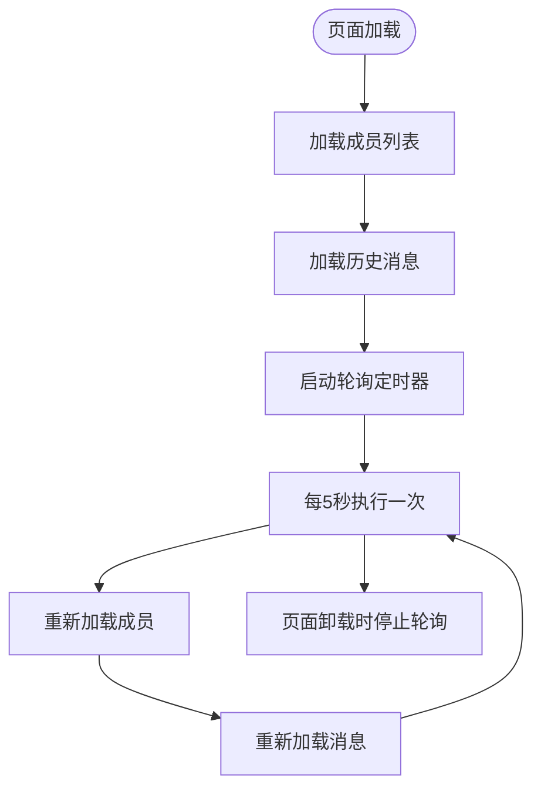

**图表来源**
- [itinerary-collab.vue:286-295](file://uniapp-travel-social/homePages/itinerary/itinerary-collab.vue#L286-L295)

### 行程保存流程

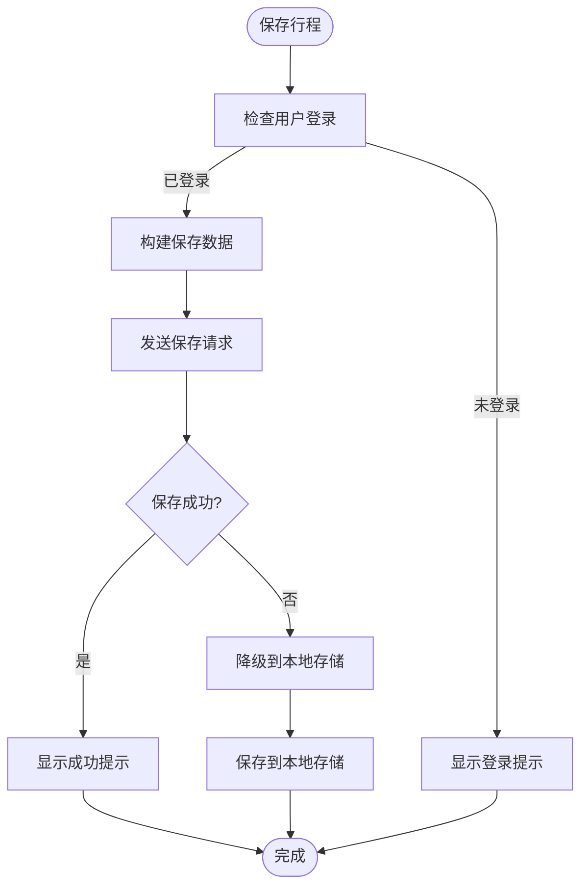

**图表来源**
- [itinerary.vue:387-437](file://uniapp-travel-social/homePages/itinerary/itinerary.vue#L387-L437)

**章节来源**
- [itinerary.vue:1-784](file://uniapp-travel-social/homePages/itinerary/itinerary.vue#L1-L784)
- [itinerary-collab.vue:1-487](file://uniapp-travel-social/homePages/itinerary/itinerary-collab.vue#L1-L487)
- [itinerary-history.vue:1-287](file://uniapp-travel-social/homePages/itinerary/itinerary-history.vue#L1-L287)

## 安全与权限控制

系统实现了多层次的安全防护和权限控制机制：

### 权限验证流程

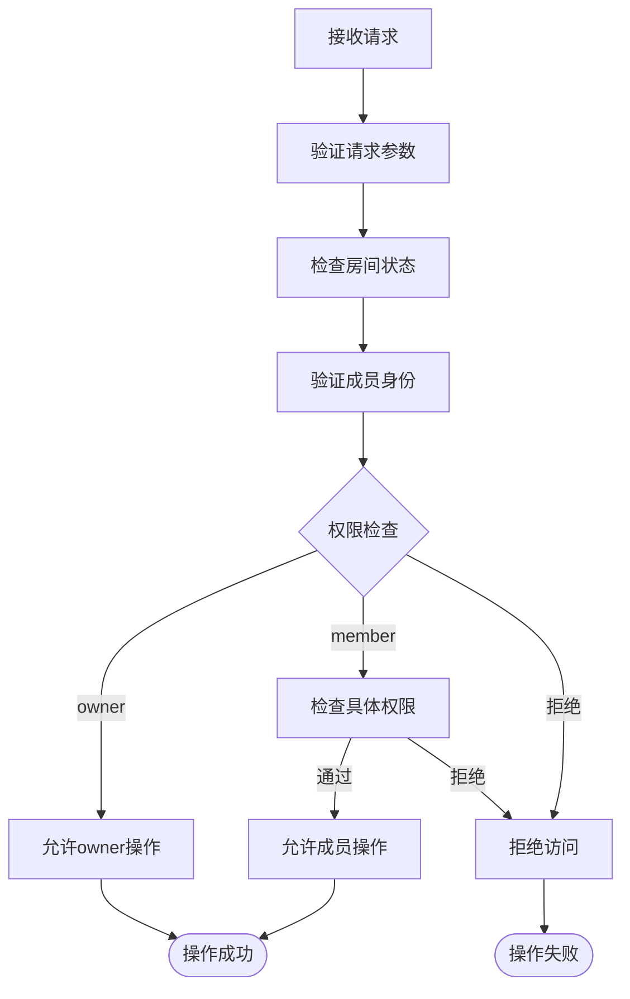

### 安全措施

1. **邀请码机制**：防止未授权用户加入房间
2. **权限分级**：区分房间创建者和普通成员权限
3. **参数验证**：严格的输入参数校验
4. **会话管理**：用户身份认证和会话保持
5. **数据验证**：前后端双重数据验证

**章节来源**
- [ItineraryCollabServiceImpl.java:85-122](file://springboot-travel-social/src/main/java/com/cxx/service/impl/ItineraryCollabServiceImpl.java#L85-L122)
- [ItineraryCollabServiceImpl.java:175-186](file://springboot-travel-social/src/main/java/com/cxx/service/impl/ItineraryCollabServiceImpl.java#L175-L186)

## 性能优化策略

系统采用了多项性能优化措施：

### 数据库优化

1. **索引设计**：为常用查询字段建立索引
2. **分页查询**：消息列表采用分页加载
3. **缓存策略**：热点数据缓存到Redis
4. **连接池配置**：数据库连接池和线程池优化

### 服务端优化

1. **异步处理**：耗时操作异步执行
2. **批量操作**：减少数据库交互次数
3. **事务管理**：合理使用事务确保数据一致性

### 前端优化

1. **虚拟滚动**：大量消息时使用虚拟滚动
2. **懒加载**：图片和组件懒加载
3. **状态缓存**：本地状态缓存避免重复请求
4. **轮询优化**：合理设置轮询间隔

## 故障排查指南

### 常见问题及解决方案

| 问题类型 | 症状 | 可能原因 | 解决方案 |
|----------|------|----------|----------|
| 房间创建失败 | 返回错误信息 | 邀请码冲突 | 重新生成邀请码 |
| 成员加入失败 | 提示房间不存在 | 邀请码过期 | 检查邀请码有效期 |
| 消息发送失败 | 消息不显示 | 权限不足 | 验证用户是否在房间内 |
| AI生成超时 | 生成进度条卡住 | AI服务异常 | 检查AI服务状态 |
| 行程保存失败 | 保存失败 | 用户未登录 | 先进行用户登录 |
| 历史记录为空 | 显示空状态 | 无保存记录 | 先创建并保存行程 |

### 调试方法

1. **日志查看**：检查服务端日志输出
2. **数据库检查**：验证数据表状态
3. **网络监控**：使用浏览器开发者工具
4. **API测试**：使用Postman测试接口
5. **轮询调试**：检查轮询定时器状态

**章节来源**
- [ItineraryCollabServiceImpl.java:89-97](file://springboot-travel-social/src/main/java/com/cxx/service/impl/ItineraryCollabServiceImpl.java#L89-L97)

## 总结

行程协作系统是一个功能完整、架构清晰的多人协作平台。系统通过合理的分层设计、完善的权限控制和高效的实时通信机制，为用户提供了优质的协作体验。

### 系统优势

1. **功能完整性**：涵盖协作房间管理、消息通信、AI生成、行程管理等核心功能
2. **技术先进性**：采用Spring Boot、UniApp等现代技术栈
3. **用户体验**：提供流畅的移动端交互体验
4. **扩展性强**：模块化设计便于功能扩展
5. **数据安全**：多重安全防护和权限控制机制

### 发展方向

1. **WebSocket升级**：解决小程序环境下的实时通信限制
2. **AI能力增强**：集成更多AI模型和算法
3. **性能优化**：进一步提升系统响应速度
4. **功能扩展**：增加更多协作工具和功能
5. **用户体验优化**：持续改进界面设计和交互流程