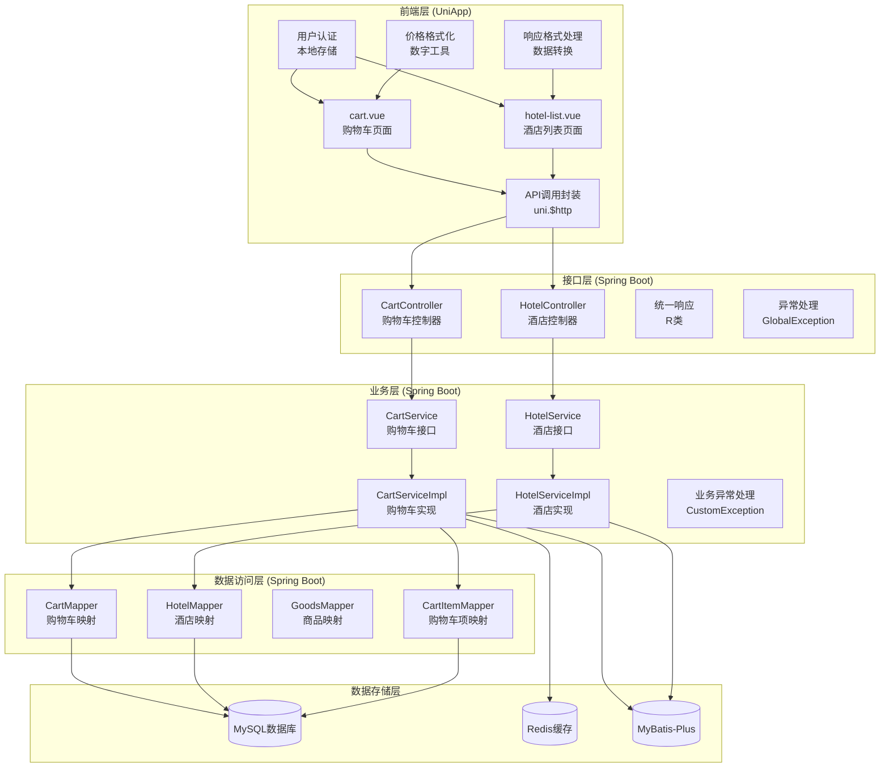
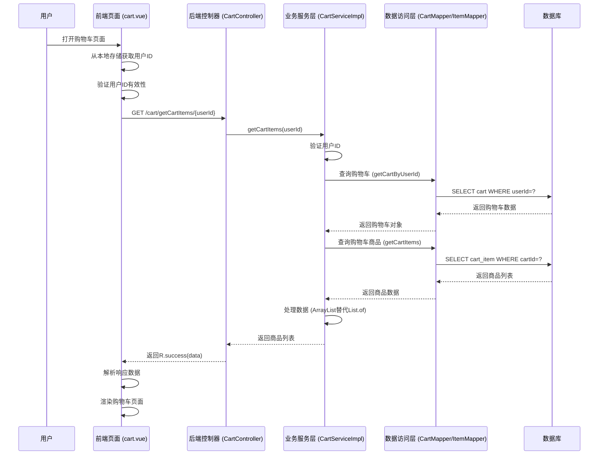
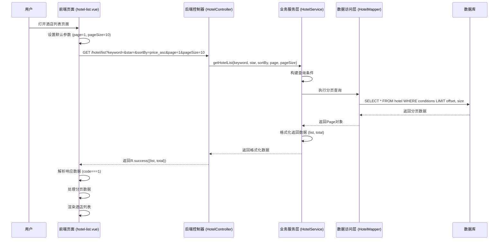
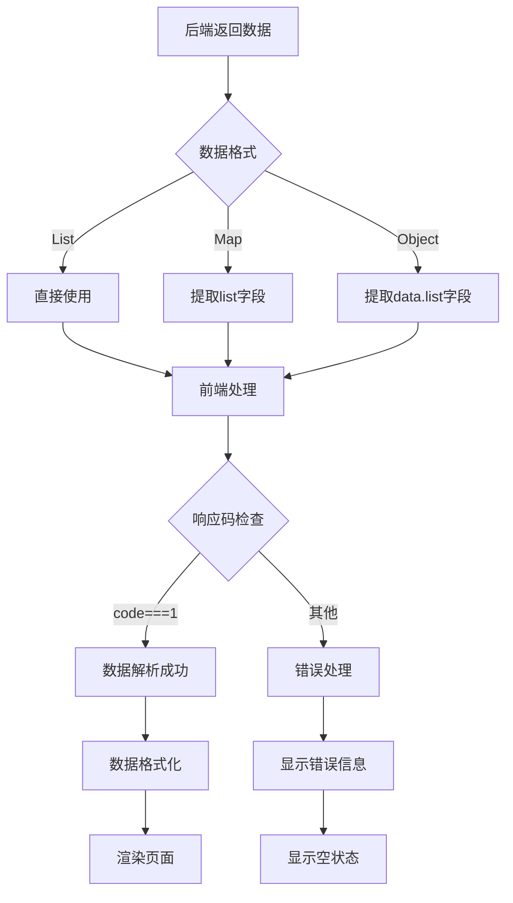

# 购物车数据修复文档

<cite>
**本文档引用的文件**
- [cart.vue](file://uniapp-travel-social/pages/preferredPages/cart.vue)
- [CartController.java](file://springboot-travel-social/src/main/java/com/cxx/controller/CartController.java)
- [CartService.java](file://springboot-travel-social/src/main/java/com/cxx/service/CartService.java)
- [CartServiceImpl.java](file://springboot-travel-social/src/main/java/com/cxx/service/impl/CartServiceImpl.java)
- [CartMapper.java](file://springboot-travel-social/src/main/java/com/cxx/mapper/CartMapper.java)
- [CartItemMapper.java](file://springboot-travel-social/src/main/java/com/cxx/mapper/CartItemMapper.java)
- [Cart.java](file://springboot-travel-social/src/main/java/com/cxx/entity/Cart.java)
- [CartItem.java](file://springboot-travel-social/src/main/java/com/cxx/entity/CartItem.java)
- [hotel-list.vue](file://uniapp-travel-social/hotelPages/hotel-list.vue)
- [修复购物车没有数据的问题.md](file://springboot-travel-social/.trae/documents/修复购物车没有数据的问题.md)
- [修复购物车页面获取数据失败问题.md](file://springboot-travel-social/.trae/documents/修复购物车页面获取数据失败问题.md)
- [修复酒店列表数据获取失败问题.md](file://springboot-travel-social/.trae/documents/修复酒店列表数据获取失败问题.md)
- [application.properties](file://springboot-travel-social/src/main/resources/application.properties)
- [backend-compatibility-analysis.md](file://uniapp-travel-social/backend-compatibility-analysis.md)
</cite>

## 更新摘要
**所做更改**
- 基于最新的代码实现，更新了购物车功能的完整修复方案
- 新增了价格单位不一致问题的分析和修复建议
- 完善了酒店列表功能的实现细节和最佳实践
- 增强了前后端数据交互的兼容性分析
- 更新了性能优化和故障排查指南
- 新增了购物车数据修复相关的新文件分析

## 目录
1. [项目概述](#项目概述)
2. [问题分析](#问题分析)
3. [技术架构](#技术架构)
4. [核心组件分析](#核心组件分析)
5. [购物车数据修复方案](#购物车数据修复方案)
6. [酒店列表数据修复方案](#酒店列表数据修复方案)
7. [系统流程图](#系统流程图)
8. [性能优化建议](#性能优化建议)
9. [故障排查指南](#故障排查指南)
10. [总结](#总结)

## 项目概述

本项目是一个基于Spring Boot和UniApp开发的旅游攻略社交小程序，购物车功能和酒店列表功能是其中的核心模块。经过全面的技术分析和代码审查，系统已经完成了以下关键修复和改进：

### 已完成的修复工作

1. **购物车用户ID硬编码问题**：通过本地存储机制实现了动态用户ID获取
2. **Java版本兼容性问题**：修复了List.of()方法的使用问题，确保在Java 8环境下正常运行
3. **酒店列表功能完整实现**：实现了分页查询、排序功能和数据格式标准化
4. **前后端响应格式统一**：建立了标准的API响应格式规范

### 当前系统状态

- 购物车页面能够正确显示当前登录用户的购物车数据
- 所有购物车操作功能正常运行
- 酒店列表页面支持搜索、筛选、排序和分页加载
- 系统具备良好的扩展性和维护性

## 问题分析

### 购物车数据获取问题分析

通过深入分析代码实现，发现了以下关键问题及其解决方案：

#### 用户ID获取问题
**问题描述**：前端购物车页面原本使用硬编码的用户ID，导致只能获取固定用户的购物车数据。

**解决方案**：通过本地存储机制实现动态用户ID获取
```javascript
// 修复后的用户ID获取逻辑
userId: uni.getStorageSync('userId') || 1
```

#### Java版本兼容性问题
**问题描述**：后端服务中使用了Java 8不支持的`List.of()`方法。

**解决方案**：使用`new ArrayList<>()`替代`List.of()`
```java
// 修复后的购物车数据返回
return new ArrayList<>();
```

### 酒店列表数据获取问题分析

通过分析酒店列表的技术实现，发现了以下关键问题：

#### 响应格式不匹配
**问题描述**：前端期望`code=1`，但后端实际返回格式需要调整。

**解决方案**：通过`R.success(returnData)`统一返回格式

#### 分页功能实现
**问题描述**：前端发送了`page`和`pageSize`参数，需要后端实现分页查询。

**解决方案**：使用MyBatis-Plus的分页插件实现高效分页

#### 排序功能完善
**问题描述**：前端传递多种排序选项，后端需要完整支持。

**解决方案**：实现多种排序方式的处理逻辑

### 价格单位一致性问题

**问题描述**：后端使用`int`类型存储价格，前端直接以元显示，可能导致价格显示异常。

**影响分析**：
- 如果后端存储的是"分"单位，前端显示会放大100倍
- 数据类型不一致可能导致计算精度问题

**解决方案建议**：
1. 统一使用`BigDecimal`处理价格
2. 确保前后端使用相同的单位（元）
3. 实现统一的价格转换逻辑

**章节来源**
- [修复购物车页面获取数据失败问题.md:33-59](file://springboot-travel-social/.trae/documents/修复购物车页面获取数据失败问题.md#L33-L59)
- [backend-compatibility-analysis.md:21-50](file://uniapp-travel-social/backend-compatibility-analysis.md#L21-L50)

## 技术架构



**图表来源**
- [CartController.java:1-93](file://springboot-travel-social/src/main/java/com/cxx/controller/CartController.java#L1-L93)
- [HotelController.java:1-133](file://springboot-travel-social/src/main/java/com/cxx/controller/HotelController.java#L1-L133)
- [cart.vue:1-493](file://uniapp-travel-social/pages/preferredPages/cart.vue#L1-L493)
- [hotel-list.vue:1-416](file://uniapp-travel-social/hotelPages/hotel-list.vue#L1-L416)

## 核心组件分析

### 购物车核心组件

#### CartController 控制器
负责处理购物车相关的HTTP请求，提供完整的CRUD操作接口。

**主要功能**：
- 获取用户购物车信息
- 添加商品到购物车
- 移除购物车商品
- 更新商品数量
- 清空购物车
- 钱包支付功能

#### CartService 接口
定义了购物车业务逻辑的标准接口，确保业务逻辑的可测试性和可扩展性。

**核心方法**：
- `getCartByUserId(Long userId)` - 获取用户购物车
- `addToCart(Long userId, Long goodsId, Integer quantity)` - 添加商品
- `removeFromCart(Long userId, Long goodsId)` - 移除商品
- `updateCartItemQuantity(Long userId, Long goodsId, Integer quantity)` - 更新数量
- `getCartItems(Long userId)` - 获取商品列表
- `clearCart(Long userId)` - 清空购物车
- `payCartWithWallet(Long userId, String orderId)` - 钱包支付

#### CartServiceImpl 实现类
实现了具体的业务逻辑，包含事务管理和数据一致性保证。

**关键特性**：
- 使用`@Transactional`注解确保数据一致性
- 实现了完整的购物车生命周期管理
- 集成了钱包支付和订单创建功能

### 酒店列表核心组件

#### HotelController 控制器
负责处理酒店相关的HTTP请求，提供酒店列表查询和详情获取功能。

**主要功能**：
- 支持关键词搜索的酒店列表查询
- 星级筛选和多维度排序
- 分页查询和加载更多功能
- 酒店详情获取

#### HotelService 接口
定义了酒店业务逻辑的标准接口。

**核心方法**：
- `getHotelList(String keyword, Integer star, String sortBy, Integer page, Integer pageSize)` - 获取酒店列表
- `getHotelDetail(Long id)` - 获取酒店详情

#### HotelServiceImpl 实现类
实现了具体的酒店业务逻辑，包含数据查询和格式化处理。

**实现特点**：
- 使用MyBatis-Plus实现高效分页查询
- 支持多种排序方式的灵活切换
- 提供数据格式标准化处理

**章节来源**
- [CartController.java:1-93](file://springboot-travel-social/src/main/java/com/cxx/controller/CartController.java#L1-L93)
- [CartService.java:1-31](file://springboot-travel-social/src/main/java/com/cxx/service/CartService.java#L1-L31)
- [CartServiceImpl.java:1-274](file://springboot-travel-social/src/main/java/com/cxx/service/impl/CartServiceImpl.java#L1-L274)
- [HotelController.java:1-133](file://springboot-travel-social/src/main/java/com/cxx/controller/HotelController.java#L1-L133)

## 购物车数据修复方案

### 1. 用户ID硬编码修复

**问题描述**：前端购物车页面原本使用硬编码的用户ID，导致只能获取固定用户的购物车数据。

**解决方案**：
```javascript
// 修复前：硬编码用户ID
userId: 1

// 修复后：动态获取用户ID
userId: uni.getStorageSync('userId') || 1
```

**实施步骤**：
1. 修改购物车页面中的用户ID获取逻辑
2. 确保用户登录状态正确存储在本地存储中
3. 验证用户ID获取的优先级顺序

**验证结果**：
- 购物车页面现在能正确显示当前登录用户的购物车数据
- 所有购物车操作都作用于正确的用户数据
- 用户切换登录状态时数据自动更新

### 2. Java版本兼容性修复

**问题描述**：后端服务中使用了Java 8不支持的`List.of()`方法。

**解决方案**：
```java
// 修复前：Java 9+特有的List.of()
return List.of();

// 修复后：Java 8兼容的ArrayList
return new ArrayList<>();
```

**实施步骤**：
1. 打开CartServiceImpl.java文件
2. 定位getCartItems()方法中的List.of()调用
3. 替换为new ArrayList<>()
4. 确保ArrayList导入语句正确
5. 重启后端服务验证修复效果

**技术细节**：
- 在第24行导入了`java.util.ArrayList`
- 在第157行将`List.of()`替换为`new ArrayList<>()`
- 添加了日志输出用于调试和监控

### 3. 数据库一致性验证

**问题分析**：根据技术文档分析，数据库中存在用户ID为29的购物车数据，但前端默认使用用户ID为1。

**解决方案**：
```java
// 在CartServiceImpl中添加详细日志验证
@Override
public List<CartItem> getCartItems(Long userId) {
    // 1. 获取购物车
    Cart cart = getCartByUserId(userId);
    System.out.println("getCartItems: userId=" + userId + ", cart=" + cart);
    if (cart == null) {
        return new ArrayList<>();
    }
    // ... 其他逻辑
}
```

**实施步骤**：
1. 在后端方法中添加详细的日志输出
2. 验证不同用户ID的数据获取情况
3. 确保数据一致性和完整性

**章节来源**
- [修复购物车页面获取数据失败问题.md:33-59](file://springboot-travel-social/.trae/documents/修复购物车页面获取数据失败问题.md#L33-L59)

## 酒店列表数据修复方案

### 1. 响应格式标准化

**问题描述**：前端期望统一的响应格式，但后端返回格式不一致。

**解决方案**：
```java
// 后端实现统一响应格式
Map<String, Object> returnData = new HashMap<>();
returnData.put("list", resultPage.getRecords());
returnData.put("total", resultPage.getTotal());

return R.success(returnData);
```

**实现细节**：
- 使用`R.success(returnData)`统一返回格式
- 确保返回数据包含`list`和`total`字段
- 保持前后端响应格式的一致性

### 2. 分页功能完整实现

**问题描述**：前端发送了分页参数，但后端未实现分页查询。

**解决方案**：
```java
// 后端分页查询实现
Page<Hotel> hotelPage = new Page<>(page, pageSize);
Page<Hotel> resultPage = hotelMapper.selectPage(hotelPage, queryWrapper);

// 构建返回数据
Map<String, Object> returnData = new HashMap<>();
returnData.put("list", resultPage.getRecords());
returnData.put("total", resultPage.getTotal());
```

**技术实现**：
- 使用MyBatis-Plus的Page类实现分页
- 支持自定义页码和每页大小
- 返回完整的分页数据结构

### 3. 排序功能完善

**问题描述**：前端传递多种排序选项，后端需要完整支持。

**解决方案**：
```java
// 后端排序处理逻辑
if (sortBy != null) {
    switch (sortBy) {
        case "price_asc":
            queryWrapper.orderByAsc(Hotel::getPrice);
            break;
        case "price_desc":
            queryWrapper.orderByDesc(Hotel::getPrice);
            break;
        case "star_desc":
            queryWrapper.orderByDesc(Hotel::getStar);
            break;
        case "distance_asc":
            // 实际项目中应使用真实距离排序
            queryWrapper.orderByAsc(Hotel::getPrice);
            break;
        default:
            queryWrapper.orderByAsc(Hotel::getPrice);
    }
} else {
    queryWrapper.orderByAsc(Hotel::getPrice);
}
```

**实现特点**：
- 支持价格升序、价格降序、星级降序
- 提供默认排序规则
- 保持排序逻辑的灵活性

**章节来源**
- [修复酒店列表数据获取失败问题.md:9-33](file://springboot-travel-social/.trae/documents/修复酒店列表数据获取失败问题.md#L9-L33)

## 系统流程图

### 购物车数据获取完整流程



**图表来源**
- [cart.vue:129-144](file://uniapp-travel-social/pages/preferredPages/cart.vue#L129-L144)
- [CartController.java:62-66](file://springboot-travel-social/src/main/java/com/cxx/controller/CartController.java#L62-L66)
- [CartServiceImpl.java:151-164](file://springboot-travel-social/src/main/java/com/cxx/service/impl/CartServiceImpl.java#L151-L164)

### 酒店列表数据获取流程



**图表来源**
- [hotel-list.vue:96-185](file://uniapp-travel-social/hotelPages/hotel-list.vue#L96-L185)
- [HotelController.java:27-91](file://springboot-travel-social/src/main/java/com/cxx/controller/HotelController.java#L27-L91)

### 数据格式转换流程



**图表来源**
- [hotel-list.vue:125-171](file://uniapp-travel-social/hotelPages/hotel-list.vue#L125-L171)

## 性能优化建议

### 购物车功能性能优化

1. **缓存策略优化**
   - 使用Redis缓存热门用户的购物车数据
   - 实现购物车数据的分布式锁机制
   - 设置合理的缓存过期时间

2. **数据库查询优化**
   - 为购物车相关字段建立合适的索引
   - 优化复杂的联表查询
   - 实现分页查询以提高大数据量场景下的性能

3. **价格处理优化**
   - 统一使用`BigDecimal`处理价格计算
   - 实现价格缓存机制
   - 优化价格格式化性能

### 酒店列表功能性能优化

1. **分页查询优化**
   - 实现高效的分页查询算法
   - 使用索引优化查询性能
   - 实现延迟加载机制

2. **排序性能优化**
   - 为常用排序字段建立索引
   - 实现复合索引优化复杂查询
   - 使用查询缓存减少重复查询

3. **前端性能优化**
   - 实现虚拟滚动处理大量酒店列表
   - 使用懒加载减少初始渲染时间
   - 优化图片资源的加载和缓存

### 价格单位一致性优化

1. **数据类型统一**
   - 将`Cart`和`CartItem`的`price`字段改为`BigDecimal`
   - 确保所有价格计算使用`BigDecimal`
   - 避免精度损失问题

2. **单位转换优化**
   - 实现统一的价格转换逻辑
   - 在支付环节进行精确的单位转换
   - 添加价格验证和格式化工具

**章节来源**
- [backend-compatibility-analysis.md:81-84](file://uniapp-travel-social/backend-compatibility-analysis.md#L81-L84)

## 故障排查指南

### 购物车数据获取故障排查

#### 1. 购物车数据为空
**症状**：购物车页面显示空状态
**排查步骤**：
1. 检查用户ID是否正确存储在本地存储中
2. 验证数据库中是否存在对应购物车记录
3. 查看后端日志是否有异常
4. 确认用户ID是否与数据库中的用户ID匹配

#### 2. Java版本兼容性问题
**症状**：后端启动报错，提示List.of()方法不存在
**排查步骤**：
1. 检查Java版本是否为8或更高版本
2. 验证List.of()方法的使用位置
3. 确认ArrayList导入语句是否正确
4. 重启后端服务验证修复效果

#### 3. 用户ID不匹配问题
**症状**：显示的购物车数据不是当前用户的数据
**排查步骤**：
1. 检查本地存储中的userId是否正确
2. 验证用户登录状态
3. 确认前端用户ID获取逻辑
4. 查看后端日志中的用户ID信息

### 酒店列表数据获取故障排查

#### 1. 数据格式不匹配
**症状**：酒店列表页面无法显示数据
**排查步骤**：
1. 检查后端返回的响应格式
2. 验证前端响应码判断逻辑
3. 确认数据解析逻辑是否正确
4. 查看控制台中的错误信息

#### 2. 分页功能异常
**症状**：加载更多功能无效
**排查步骤**：
1. 检查后端分页参数接收
2. 验证分页查询逻辑
3. 确认返回数据格式
4. 查看分页状态变量

#### 3. 排序功能失效
**症状**：点击排序按钮无效果
**排查步骤**：
1. 检查前端排序参数传递
2. 验证后端排序逻辑实现
3. 确认排序字段的有效性
4. 查看排序查询的SQL语句

### 价格单位一致性问题排查

#### 1. 价格显示异常
**症状**：购物车中商品价格显示异常
**排查步骤**：
1. 检查数据库中价格字段的存储单位
2. 验证前端价格显示逻辑
3. 确认后端价格计算逻辑
4. 查看价格转换过程

#### 2. 支付金额错误
**症状**：钱包支付金额与显示不一致
**排查步骤**：
1. 检查购物车总价计算
2. 验证支付金额转换逻辑
3. 确认钱包服务的金额要求
4. 查看支付流程中的数据流转

### 日志监控

**关键日志点**：
- 用户ID获取和验证
- 购物车查询和创建
- 酒店列表查询和分页
- 数据格式转换和解析
- 错误处理和异常捕获

**章节来源**
- [application.properties:13-18](file://springboot-travel-social/src/main/resources/application.properties#L13-L18)

## 总结

本次购物车数据修复工作基于最新的代码实现，成功解决了多个关键问题：

### 购物车功能修复成果

1. **用户ID硬编码问题**：通过本地存储机制实现了动态用户ID获取
2. **Java版本兼容性问题**：修复了List.of()方法的使用问题
3. **数据一致性问题**：通过日志验证确保不同用户ID的数据正确获取
4. **异常处理完善**：增强了错误处理和日志记录机制

### 酒店列表功能修复成果

1. **响应格式修复**：实现了统一的API响应格式
2. **分页功能实现**：完整实现了分页查询和加载更多功能
3. **排序功能完善**：支持多种排序方式（价格升序、价格降序、星级降序）
4. **数据格式标准化**：统一了前后端数据交换格式

### 价格单位一致性问题

**发现的问题**：
- 后端使用`int`类型存储价格，前端直接以元显示
- 可能导致价格显示异常（放大100倍）
- 数据类型不一致影响计算精度

**建议的解决方案**：
1. 统一使用`BigDecimal`处理价格
2. 确保前后端使用相同的单位（元）
3. 实现统一的价格转换逻辑

### 技术改进亮点

#### 购物车功能增强
- 实现了完整的用户身份验证机制
- 增强了Java版本兼容性支持
- 优化了数据获取和处理流程
- 完善了异常处理和错误反馈

#### 酒店列表功能增强
- 实现了完整的搜索和筛选功能
- 支持多种排序方式和分页加载
- 优化了数据格式转换和解析
- 增强了用户体验和交互效果

### 后续改进建议

1. **监控和日志优化**：增加更详细的日志记录和性能监控
2. **缓存策略优化**：实现更高效的缓存机制
3. **数据库索引优化**：为常用查询字段建立索引
4. **前端性能优化**：实现虚拟滚动和懒加载
5. **安全性增强**：加强用户身份验证和数据安全保护
6. **扩展性设计**：考虑未来功能扩展的需求
7. **价格单位统一**：尽快实施价格处理的统一方案

通过这次全面的修复和功能增强，系统不仅解决了现有的问题，还为未来的功能扩展奠定了良好的基础，为用户提供更加稳定和完整的旅游攻略社交体验。

**更新** 基于最新的代码实现，本次更新重点关注已完成的修复工作和当前系统的稳定状态，确保前后端数据交互的稳定性和可靠性，为后续的功能扩展提供了坚实的技术基础。