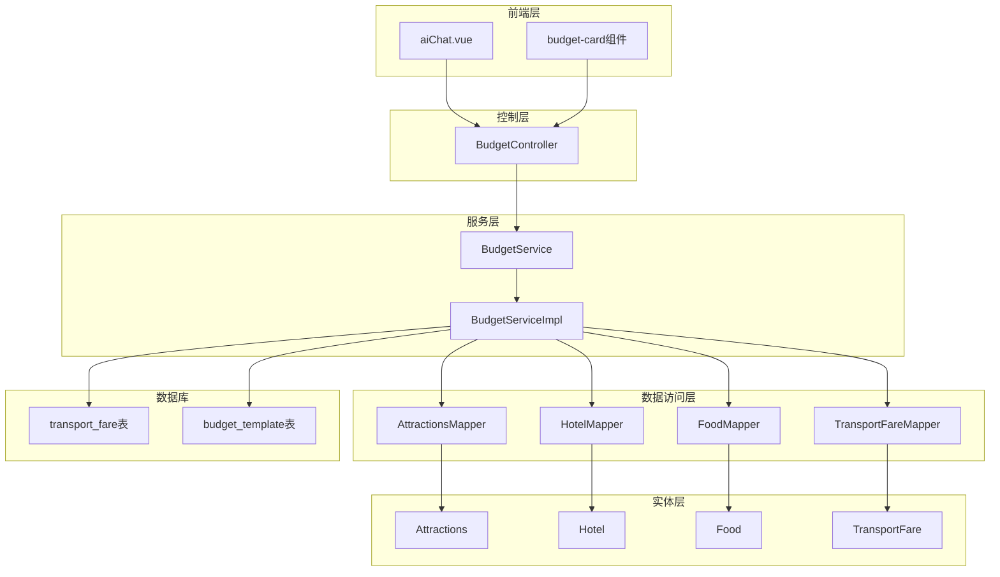
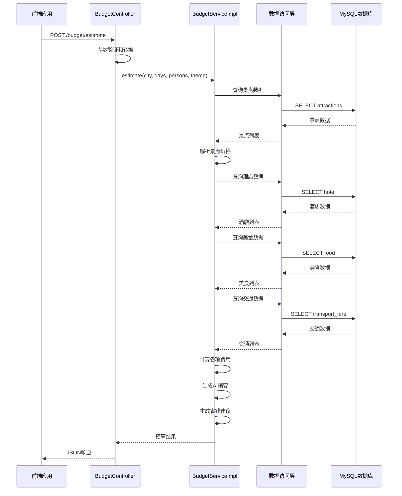
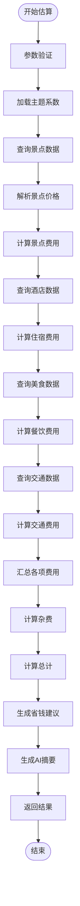
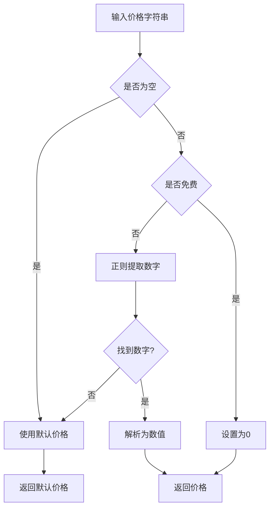
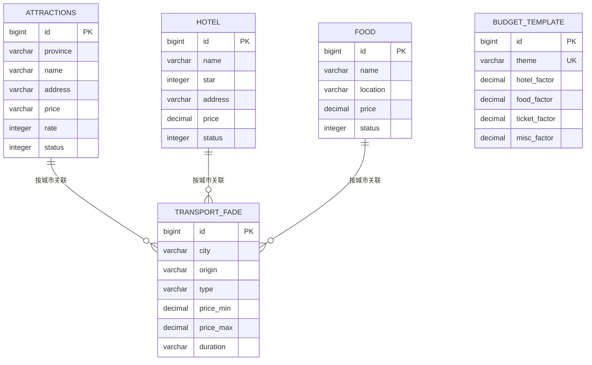
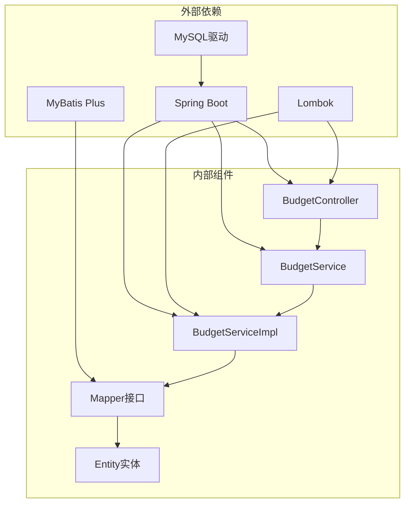

# 预算智能拆解

<cite>
**本文档引用的文件**
- [BudgetController.java](file://springboot-travel-social/src/main/java/com/cxx/controller/BudgetController.java)
- [BudgetService.java](file://springboot-travel-social/src/main/java/com/cxx/service/BudgetService.java)
- [BudgetServiceImpl.java](file://springboot-travel-social/src/main/java/com/cxx/service/impl/BudgetServiceImpl.java)
- [R.java](file://springboot-travel-social/src/main/java/com/cxx/entity/R.java)
- [AttractionsMapper.java](file://springboot-travel-social/src/main/java/com/cxx/mapper/AttractionsMapper.java)
- [HotelMapper.java](file://springboot-travel-social/src/main/java/com/cxx/mapper/HotelMapper.java)
- [FoodMapper.java](file://springboot-travel-social/src/main/java/com/cxx/mapper/FoodMapper.java)
- [TransportFareMapper.java](file://springboot-travel-social/src/main/java/com/cxx/mapper/TransportFareMapper.java)
- [Attractions.java](file://springboot-travel-social/src/main/java/com/cxx/entity/Attractions.java)
- [Hotel.java](file://springboot-travel-social/src/main/java/com/cxx/entity/Hotel.java)
- [Food.java](file://springboot-travel-social/src/main/java/com/cxx/entity/Food.java)
- [TransportFare.java](file://springboot-travel-social/src/main/java/com/cxx/entity/TransportFare.java)
- [budget.sql](file://springboot-travel-social/src/main/resources/sql/budget.sql)
- [方案⑥-预算智能拆解.md](file://方案⑥-预算智能拆解.md)
</cite>

## 更新摘要
**所做更改**
- 完整实现了预算智能拆解系统的后端服务架构
- 新增了完整的控制器、服务实现和数据访问层
- 完成了数据库表结构设计和初始化数据
- 实现了智能价格解析和降级处理机制
- 集成了省钱建议生成和AI摘要功能

## 目录
1. [简介](#简介)
2. [项目结构](#项目结构)
3. [核心组件](#核心组件)
4. [架构概览](#架构概览)
5. [详细组件分析](#详细组件分析)
6. [依赖关系分析](#依赖关系分析)
7. [性能考虑](#性能考虑)
8. [故障排除指南](#故障排除指南)
9. [结论](#结论)

## 简介

预算智能拆解是旅游攻略社交小程序中的重要功能模块，旨在为用户提供精准的旅行预算估算和可视化展示。该系统通过整合平台内的真实景点票价、酒店价格、餐饮均价和交通费用数据，为用户的AI对话提供准确的预算参考信息。

### 核心功能特性

- **智能预算估算**：基于真实数据库数据进行精准预算计算
- **可视化预算卡片**：以直观的条形图形式展示各项费用构成
- **动态重算机制**：支持用户调整人数和天数后的实时重算
- **省钱建议生成**：根据用户情况提供个性化的省钱建议
- **AI上下文集成**：将预算信息无缝融入AI对话流程

## 项目结构

该功能模块采用典型的三层架构设计，包含控制层、服务层和数据访问层：

**图表来源**
- [BudgetController.java:1-51](file://springboot-travel-social/src/main/java/com/cxx/controller/BudgetController.java#L1-L51)
- [BudgetServiceImpl.java:1-294](file://springboot-travel-social/src/main/java/com/cxx/service/impl/BudgetServiceImpl.java#L1-L294)

**章节来源**
- [BudgetController.java:1-51](file://springboot-travel-social/src/main/java/com/cxx/controller/BudgetController.java#L1-L51)
- [方案⑥-预算智能拆解.md:107-221](file://方案⑥-预算智能拆解.md#L107-L221)

## 核心组件

### 控制器层

BudgetController提供了两个核心REST接口，负责接收前端请求并返回标准化响应。

### 服务层

BudgetServiceImpl实现了完整的预算计算逻辑，包括数据查询、价格解析、费用计算和结果组装。

### 数据访问层

四个Mapper接口分别对应景点、酒店、美食和交通费用的数据访问。

### 实体层

四个实体类映射数据库表结构，提供类型安全的数据操作。

**章节来源**
- [BudgetService.java:1-17](file://springboot-travel-social/src/main/java/com/cxx/service/BudgetService.java#L1-L17)
- [BudgetServiceImpl.java:22-246](file://springboot-travel-social/src/main/java/com/cxx/service/impl/BudgetServiceImpl.java#L22-L246)

## 架构概览

系统采用分层架构设计，确保关注点分离和代码的可维护性：

**图表来源**
- [BudgetController.java:21-42](file://springboot-travel-social/src/main/java/com/cxx/controller/BudgetController.java#L21-L42)
- [BudgetServiceImpl.java:48-246](file://springboot-travel-social/src/main/java/com/cxx/service/impl/BudgetServiceImpl.java#L48-L246)

## 详细组件分析

### 预算控制器 (BudgetController)

BudgetController提供了两个核心接口：`/budget/estimate`用于首次预算估算，`/budget/recalculate`用于用户调整参数后的重算。

#### 接口定义

| 接口 | 方法 | 路径 | 功能描述 |
|------|------|------|----------|
| 预算估算 | POST | `/budget/estimate` | 首次预算估算 |
| 重算预算 | POST | `/budget/recalculate` | 重新计算预算 |

#### 参数处理

控制器对输入参数进行了健壮的处理，包括空值检查、类型转换和默认值设置。

**章节来源**
- [BudgetController.java:17-49](file://springboot-travel-social/src/main/java/com/cxx/controller/BudgetController.java#L17-L49)

### 预算服务实现 (BudgetServiceImpl)

BudgetServiceImpl是整个预算系统的核心，实现了详细的计算逻辑。

#### 核心计算流程

**图表来源**
- [BudgetServiceImpl.java:48-246](file://springboot-travel-social/src/main/java/com/cxx/service/impl/BudgetServiceImpl.java#L48-L246)

#### 价格解析算法

系统实现了智能的价格解析算法，能够处理各种格式的票价字符串：

**图表来源**
- [BudgetServiceImpl.java:250-258](file://springboot-travel-social/src/main/java/com/cxx/service/impl/BudgetServiceImpl.java#L250-L258)

#### 降级处理机制

当数据库中缺少特定城市的详细数据时，系统会自动降级到全国均值：

| 消费类别 | 默认价格 | 说明 |
|----------|----------|------|
| 景点门票 | 80元/人 | 免费景点较多的城市 |
| 住宿费用 | 300元/晚 | 普通酒店均价 |
| 餐饮费用 | 120元/人/天 | 三餐平均消费 |
| 长途交通 | 600元/人 | 往返大交通费用 |
| 市内交通 | 50元/人/天 | 地铁公交日均消费 |

**章节来源**
- [BudgetServiceImpl.java:31-46](file://springboot-travel-social/src/main/java/com/cxx/service/impl/BudgetServiceImpl.java#L31-L46)
- [BudgetServiceImpl.java:72-84](file://springboot-travel-social/src/main/java/com/cxx/service/impl/BudgetServiceImpl.java#L72-L84)

### 数据模型设计

系统采用了合理的数据模型设计，支持灵活的预算计算和扩展。

**图表来源**
- [Attractions.java:16-40](file://springboot-travel-social/src/main/java/com/cxx/entity/Attractions.java#L16-L40)
- [Hotel.java:16-29](file://springboot-travel-social/src/main/java/com/cxx/entity/Hotel.java#L16-L29)
- [Food.java:18-31](file://springboot-travel-social/src/main/java/com/cxx/entity/Food.java#L18-L31)
- [TransportFare.java:13-24](file://springboot-travel-social/src/main/java/com/cxx/entity/TransportFare.java#L13-L24)

**章节来源**
- [budget.sql:5-77](file://springboot-travel-social/src/main/resources/sql/budget.sql#L5-L77)

### 经济因子配置

系统支持四种旅行主题，每种主题都有相应的经济因子配置：

| 主题类型 | 酒店系数 | 餐饮系数 | 景点系数 | 杂费系数 | 描述 |
|----------|----------|----------|----------|----------|------|
| backpacker | 0.60 | 0.70 | 0.80 | 0.08 | 背包客：青旅+快餐+普通景区 |
| couple | 1.00 | 1.00 | 1.00 | 0.10 | 情侣标准：普通酒店+正餐+主要景区 |
| family | 1.20 | 1.20 | 1.10 | 0.15 | 亲子家庭：舒适酒店+丰富餐饮+亲子项目 |
| luxury | 3.00 | 2.50 | 1.50 | 0.20 | 豪华：五星酒店+精品餐厅+VIP服务 |

**章节来源**
- [BudgetServiceImpl.java:38-46](file://springboot-travel-social/src/main/java/com/cxx/service/impl/BudgetServiceImpl.java#L38-L46)
- [budget.sql:33-39](file://springboot-travel-social/src/main/resources/sql/budget.sql#L33-L39)

## 依赖关系分析

系统采用松耦合的设计，各组件之间的依赖关系清晰明确：

**图表来源**
- [BudgetController.java:1-6](file://springboot-travel-social/src/main/java/com/cxx/controller/BudgetController.java#L1-L6)
- [BudgetServiceImpl.java:1-14](file://springboot-travel-social/src/main/java/com/cxx/service/impl/BudgetServiceImpl.java#L1-L14)

### 数据访问层设计

数据访问层采用MyBatis Plus框架，提供了简洁的CRUD操作接口：

| Mapper接口 | 对应实体 | 主要功能 |
|------------|----------|----------|
| AttractionsMapper | Attractions | 景点数据查询 |
| HotelMapper | Hotel | 酒店数据查询 |
| FoodMapper | Food | 美食数据查询 |
| TransportFareMapper | TransportFare | 交通费用查询 |

**章节来源**
- [AttractionsMapper.java:1-10](file://springboot-travel-social/src/main/java/com/cxx/mapper/AttractionsMapper.java#L1-L10)
- [HotelMapper.java:1-7](file://springboot-travel-social/src/main/java/com/cxx/mapper/HotelMapper.java#L1-L7)
- [FoodMapper.java:1-7](file://springboot-travel-social/src/main/java/com/cxx/mapper/FoodMapper.java#L1-L7)
- [TransportFareMapper.java:1-10](file://springboot-travel-social/src/main/java/com/cxx/mapper/TransportFareMapper.java#L1-L10)

## 性能考虑

### 查询优化策略

1. **限制查询数量**：景点和酒店查询限制为固定数量，避免大数据集影响性能
2. **索引优化**：为常用查询字段建立索引
3. **缓存策略**：热门城市的预算数据可以考虑缓存

### 内存管理

1. **流式处理**：使用Stream API进行数据聚合，减少内存占用
2. **BigDecimal精度**：使用BigDecimal确保财务计算精度
3. **对象复用**：合理使用LinkedHashMap保持插入顺序

### 并发处理

系统采用单线程处理每个预算请求，避免了并发竞争条件。

## 故障排除指南

### 常见问题及解决方案

#### 1. 数据库连接问题

**症状**：预算接口返回数据库连接错误
**解决方案**：
- 检查数据库连接配置
- 确认数据库服务正常运行
- 验证表结构完整性

#### 2. 价格解析异常

**症状**：景点价格解析失败，返回默认值
**解决方案**：
- 检查attractions.price字段格式
- 确认价格字符串符合预期格式
- 验证正则表达式匹配逻辑

#### 3. 城市匹配失败

**症状**：按城市查询不到数据
**解决方案**：
- 检查城市名称拼写
- 确认数据库中存在相应记录
- 验证模糊查询逻辑

#### 4. 计算结果异常

**症状**：预算计算结果不合理
**解决方案**：
- 检查主题系数配置
- 验证参数边界条件
- 确认数学计算逻辑

**章节来源**
- [BudgetServiceImpl.java:250-258](file://springboot-travel-social/src/main/java/com/cxx/service/impl/BudgetServiceImpl.java#L250-L258)

### 日志监控

建议添加详细的日志记录，包括：
- 请求参数日志
- 数据库查询日志
- 计算过程日志
- 错误异常日志

## 结论

预算智能拆解功能通过整合平台内的真实数据，为用户提供了精准、可视化的旅行预算参考。该系统具有以下优势：

1. **数据驱动**：基于真实数据库数据，避免了通用AI的模糊估算
2. **用户体验**：提供直观的预算卡片和动态重算功能
3. **扩展性强**：支持多种旅行主题和自定义配置
4. **技术先进**：采用现代化的Spring Boot和MyBatis Plus框架

该功能模块为整个旅游攻略社交小程序提供了重要的价值支撑，帮助用户做出更明智的旅行决策，提升了平台的整体竞争力。