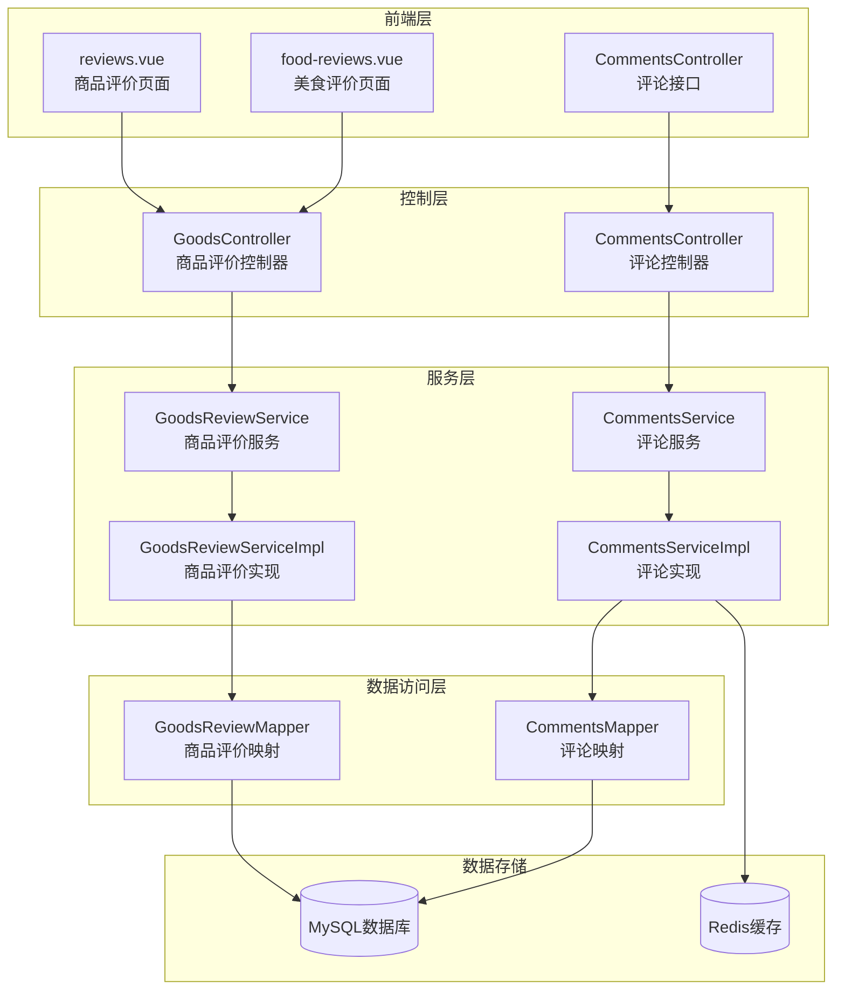
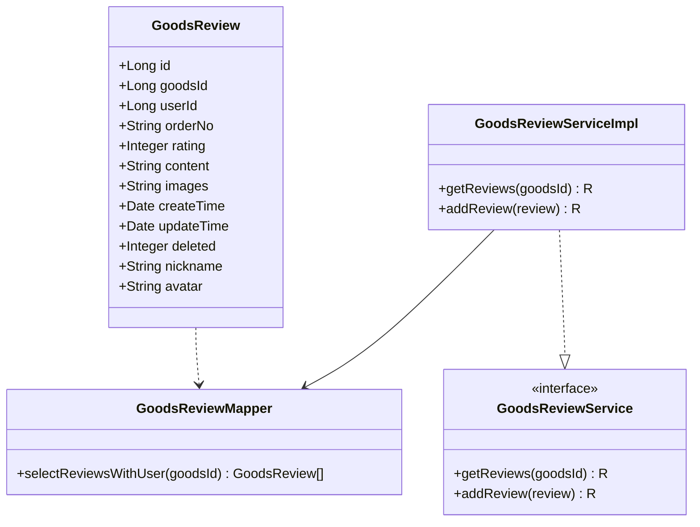
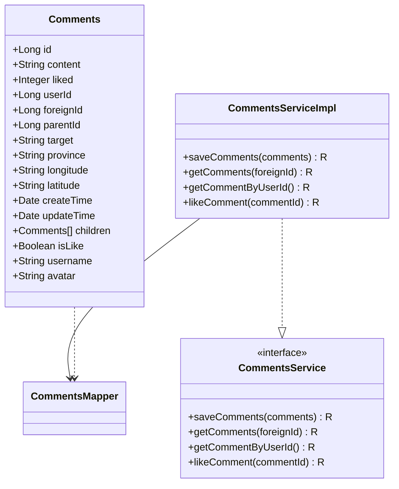
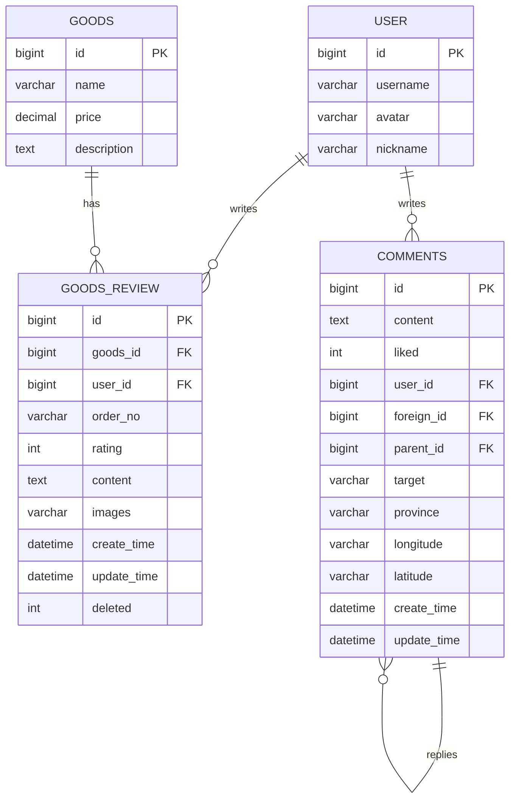
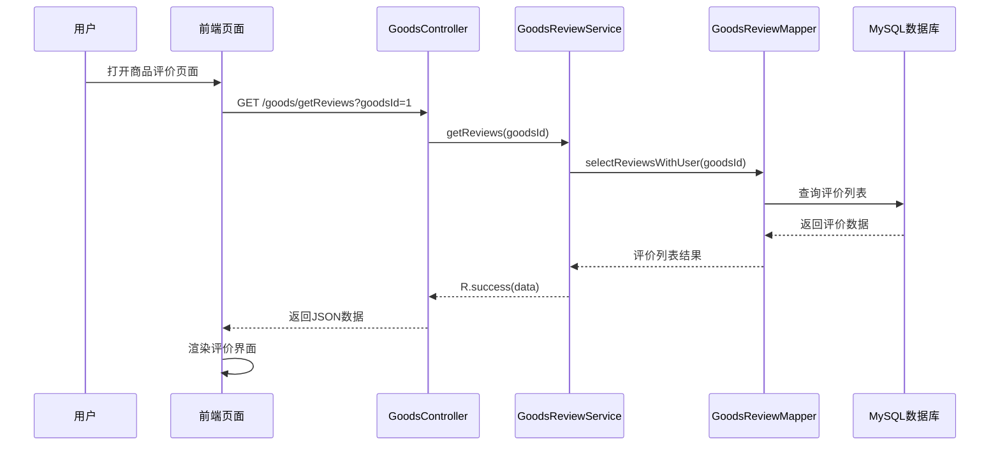
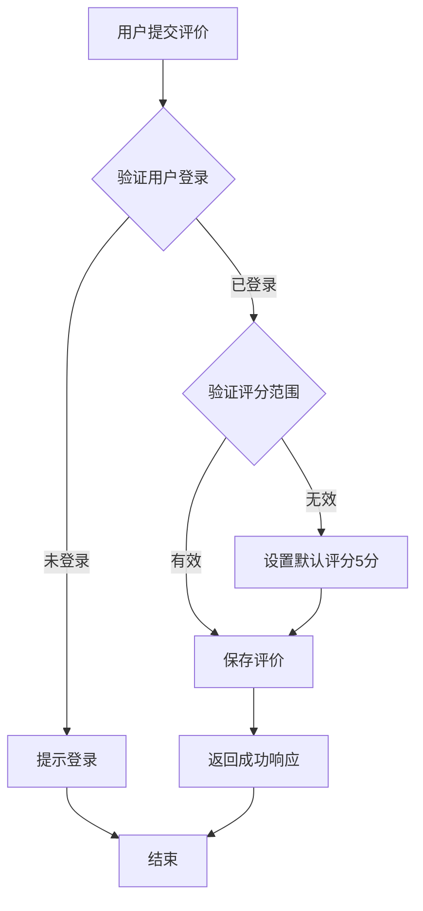
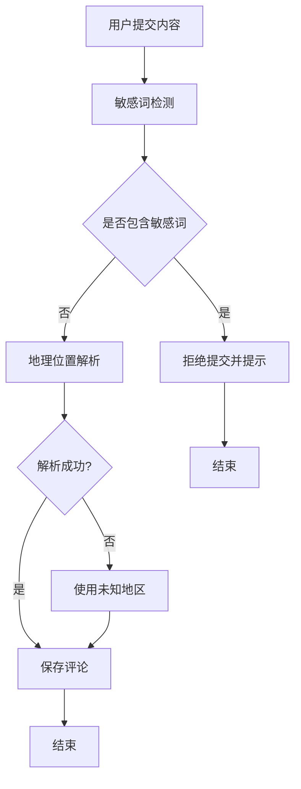

# 商品评价系统

<cite>
**本文档引用的文件**
- [GoodsReview.java](file://springboot-travel-social/src/main/java/com/cxx/entity/GoodsReview.java)
- [GoodsReviewMapper.java](file://springboot-travel-social/src/main/java/com/cxx/mapper/GoodsReviewMapper.java)
- [GoodsReviewService.java](file://springboot-travel-social/src/main/java/com/cxx/service/GoodsReviewService.java)
- [GoodsReviewServiceImpl.java](file://springboot-travel-social/src/main/java/com/cxx/service/impl/GoodsReviewServiceImpl.java)
- [GoodsController.java](file://springboot-travel-social/src/main/java/com/cxx/controller/GoodsController.java)
- [Comments.java](file://springboot-travel-social/src/main/java/com/cxx/entity/Comments.java)
- [CommentsMapper.java](file://springboot-travel-social/src/main/java/com/cxx/mapper/CommentsMapper.java)
- [CommentsService.java](file://springboot-travel-social/src/main/java/com/cxx/service/CommentsService.java)
- [CommentsServiceImpl.java](file://springboot-travel-social/src/main/java/com/cxx/service/impl/CommentsServiceImpl.java)
- [CommentsController.java](file://springboot-travel-social/src/main/java/com/cxx/controller/CommentsController.java)
- [reviews.vue](file://uniapp-travel-social/preferredPages/reviews.vue)
- [food-reviews.vue](file://uniapp-travel-social/foodPages/food-reviews.vue)
</cite>

## 目录
1. [项目概述](#项目概述)
2. [系统架构](#系统架构)
3. [核心组件分析](#核心组件分析)
4. [数据模型设计](#数据模型设计)
5. [前后端交互流程](#前后端交互流程)
6. [功能特性](#功能特性)
7. [性能优化策略](#性能优化策略)
8. [安全机制](#安全机制)
9. [故障排查指南](#故障排查指南)
10. [总结](#总结)

## 项目概述

商品评价系统是旅游攻略社交小程序的重要组成部分，为用户提供商品评价、评分展示和评论互动功能。该系统采用前后端分离架构，后端基于Spring Boot框架，前端使用UniApp开发，实现了完整的商品评价生命周期管理。

系统主要包含两个核心模块：
- **商品评价模块**：针对商品购买体验进行评价和评分
- **游记评论模块**：针对旅游攻略和游记内容进行评论互动

## 系统架构



**图表来源**
- [GoodsController.java:13-50](file://springboot-travel-social/src/main/java/com/cxx/controller/GoodsController.java#L13-L50)
- [CommentsController.java:21-65](file://springboot-travel-social/src/main/java/com/cxx/controller/CommentsController.java#L21-L65)

## 核心组件分析

### 商品评价模块

#### 实体类设计



**图表来源**
- [GoodsReview.java:17-58](file://springboot-travel-social/src/main/java/com/cxx/entity/GoodsReview.java#L17-L58)
- [GoodsReviewMapper.java:10-21](file://springboot-travel-social/src/main/java/com/cxx/mapper/GoodsReviewMapper.java#L10-L21)
- [GoodsReviewService.java:7-14](file://springboot-travel-social/src/main/java/com/cxx/service/GoodsReviewService.java#L7-L14)

#### 控制器实现

商品评价控制器提供了完整的RESTful API接口：

| 接口 | 方法 | 路径 | 功能描述 |
|------|------|------|----------|
| 获取评价列表 | GET | `/goods/getReviews` | 查询指定商品的所有评价 |
| 提交评价 | POST | `/goods/addReview` | 添加新的商品评价 |
| 获取商品详情 | GET | `/goods/getGoodsInfoById/{id}` | 获取商品详细信息 |

**章节来源**
- [GoodsController.java:33-49](file://springboot-travel-social/src/main/java/com/cxx/controller/GoodsController.java#L33-L49)

### 游记评论模块

#### 评论实体设计



**图表来源**
- [Comments.java:34-124](file://springboot-travel-social/src/main/java/com/cxx/entity/Comments.java#L34-L124)
- [CommentsService.java:17-26](file://springboot-travel-social/src/main/java/com/cxx/service/CommentsService.java#L17-L26)

#### 评论功能特性

游记评论模块支持多级评论和点赞功能：

| 功能特性 | 实现方式 | 描述 |
|----------|----------|------|
| 多级评论 | parentId字段 | 支持回复评论的回复 |
| 点赞功能 | Redis Set结构 | 使用blogComment:liked:{id}存储点赞用户 |
| 敏感词过滤 | SensitiveWordService | 实时检测并过滤敏感内容 |
| 地理位置标注 | MapApiUtils | 基于经纬度获取地理位置信息 |

**章节来源**
- [CommentsServiceImpl.java:125-151](file://springboot-travel-social/src/main/java/com/cxx/service/impl/CommentsServiceImpl.java#L125-L151)

## 数据模型设计

### 数据库表结构



**图表来源**
- [GoodsReview.java:17-50](file://springboot-travel-social/src/main/java/com/cxx/entity/GoodsReview.java#L17-L50)
- [Comments.java:38-103](file://springboot-travel-social/src/main/java/com/cxx/entity/Comments.java#L38-L103)

### Redis缓存设计

```mermaid
graph LR
subgraph "Redis缓存结构"
A[blogComment:liked:{commentId}<br/>Set类型<br/>存储点赞用户ID]
B[goods:review:{goodsId}<br/>List类型<br/>缓存商品评价]
C[user:info:{userId}<br/>Hash类型<br/>用户信息缓存]
end
subgraph "应用场景"
D[点赞去重]
E[评价列表缓存]
F[用户信息缓存]
end
A --> D
B --> E
C --> F
```

## 前后端交互流程

### 商品评价加载流程



**图表来源**
- [reviews.vue:113-136](file://uniapp-travel-social/preferredPages/reviews.vue#L113-L136)
- [GoodsController.java:37-40](file://springboot-travel-social/src/main/java/com/cxx/controller/GoodsController.java#L37-L40)

### 评价提交流程



**图表来源**
- [GoodsReviewServiceImpl.java:24-37](file://springboot-travel-social/src/main/java/com/cxx/service/impl/GoodsReviewServiceImpl.java#L24-L37)

## 功能特性

### 商品评价功能

| 功能模块 | 实现细节 | 用户体验 |
|----------|----------|----------|
| 评分统计 | 5星评分分布可视化 | 直观显示商品质量水平 |
| 评价筛选 | 全部/好评/中评/差评 | 快速定位目标评价 |
| 图片展示 | 评价图片预览功能 | 增强评价可信度 |
| 用户信息 | 昵称和头像展示 | 增强社区互动性 |
| Mock数据 | 降级处理机制 | 提升用户体验稳定性 |

### 评论互动功能

| 互动功能 | 技术实现 | 安全保障 |
|----------|----------|----------|
| 点赞功能 | Redis Set去重 | 防止重复点赞 |
| 敏感词过滤 | 正则表达式匹配 | 内容安全审核 |
| 多级回复 | parentId关联 | 支持复杂讨论场景 |
| 地理位置 | IP定位服务 | 标注评论来源 |

**章节来源**
- [reviews.vue:99-151](file://uniapp-travel-social/preferredPages/reviews.vue#L99-L151)
- [food-reviews.vue:195-236](file://uniapp-travel-social/foodPages/food-reviews.vue#L195-L236)

## 性能优化策略

### 缓存策略

1. **Redis缓存层**
   - 评论点赞数据缓存
   - 用户信息临时存储
   - 评价列表结果缓存

2. **数据库优化**
   - 评价查询索引优化
   - 关联查询性能优化
   - 分页查询限制

### 前端优化

1. **懒加载机制**
   - 评价图片按需加载
   - 滚动区域虚拟化
   - 组件按需渲染

2. **数据预处理**
   - 本地Mock降级
   - 计算结果缓存
   - 响应式数据更新

## 安全机制

### 用户认证

系统通过UserHolder工具类获取当前登录用户信息，确保只有认证用户才能进行评价和点赞操作。

### 数据安全

1. **输入验证**
   - 评分范围校验（1-5分）
   - 内容长度限制
   - 图片格式验证

2. **权限控制**
   - 评论删除权限验证
   - 点赞状态检查
   - 用户身份确认

### 内容安全



**图表来源**
- [CommentsServiceImpl.java:49-68](file://springboot-travel-social/src/main/java/com/cxx/service/impl/CommentsServiceImpl.java#L49-L68)

## 故障排查指南

### 常见问题及解决方案

| 问题类型 | 症状表现 | 可能原因 | 解决方案 |
|----------|----------|----------|----------|
| 评价加载失败 | 页面空白或错误提示 | 网络请求异常 | 检查API接口可用性 |
| 评分显示异常 | 评分计算错误 | 数据格式问题 | 验证JSON数据结构 |
| 点赞功能失效 | 点击无反应 | Redis连接问题 | 检查Redis服务状态 |
| 敏感词误判 | 正常内容被拦截 | 敏感词库配置问题 | 更新敏感词规则 |

### 日志监控

系统关键操作均记录详细日志，包括：
- 用户操作日志
- API调用记录
- 错误异常追踪
- 性能指标监控

**章节来源**
- [CommentsServiceImpl.java:101-107](file://springboot-travel-social/src/main/java/com/cxx/service/impl/CommentsServiceImpl.java#L101-L107)

## 总结

商品评价系统通过合理的架构设计和完善的功能实现，为用户提供了优质的商品评价和游记评论体验。系统具备以下特点：

1. **完整的功能体系**：涵盖评价、评分、筛选、互动等核心功能
2. **良好的扩展性**：模块化设计便于功能扩展和维护
3. **可靠的性能保障**：缓存机制和优化策略确保系统稳定运行
4. **完善的安全机制**：多层次安全防护保障系统安全

未来可以考虑的功能增强包括：
- 评价排序算法优化
- 智能推荐系统集成
- 多媒体评价支持
- 社交分享功能