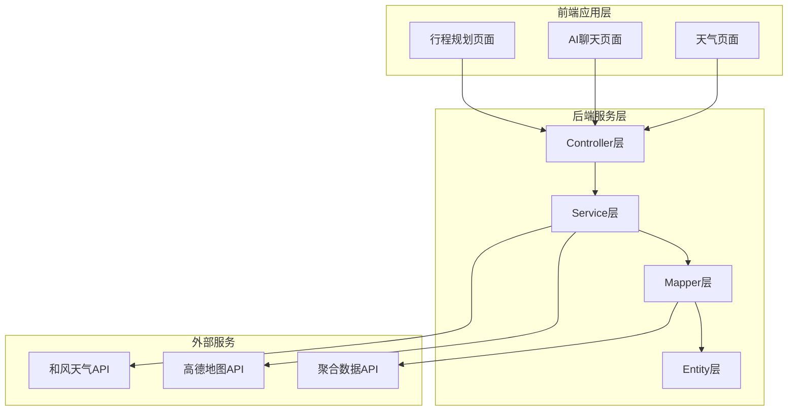
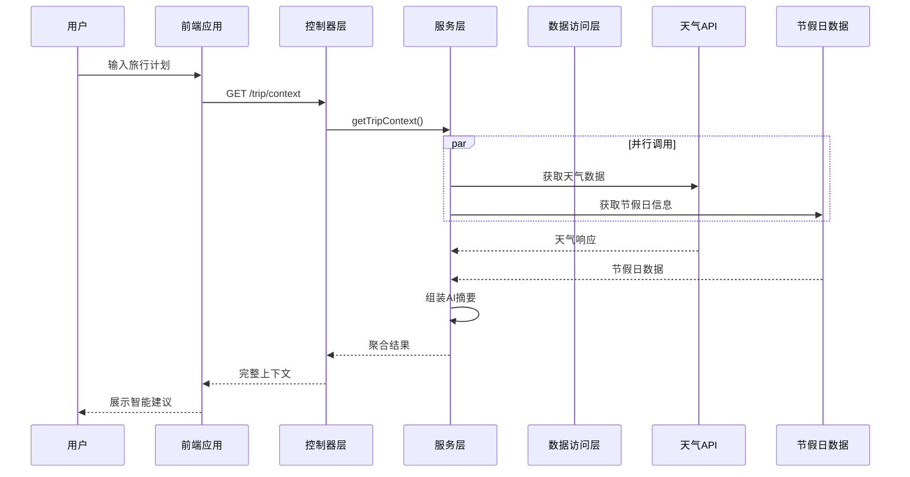
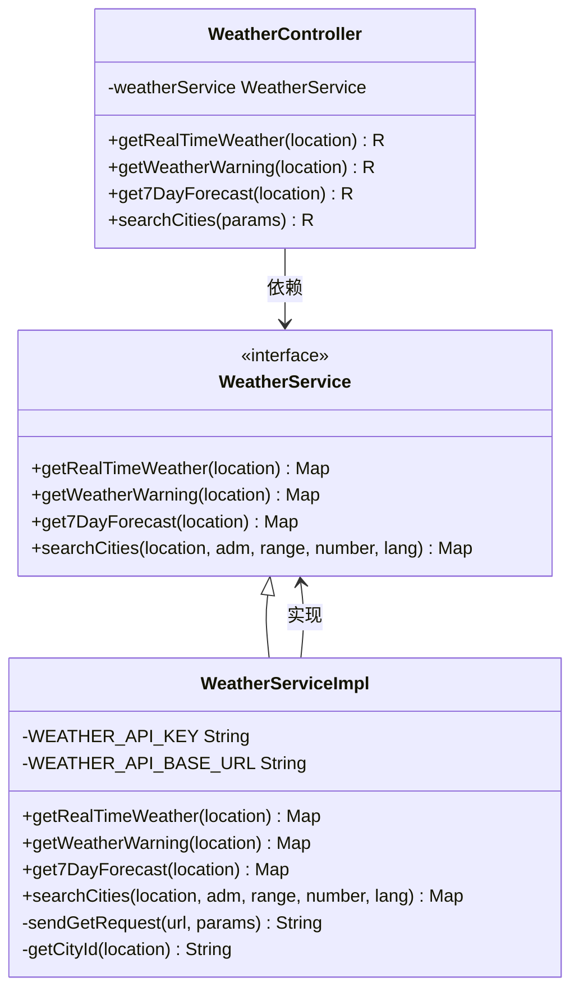
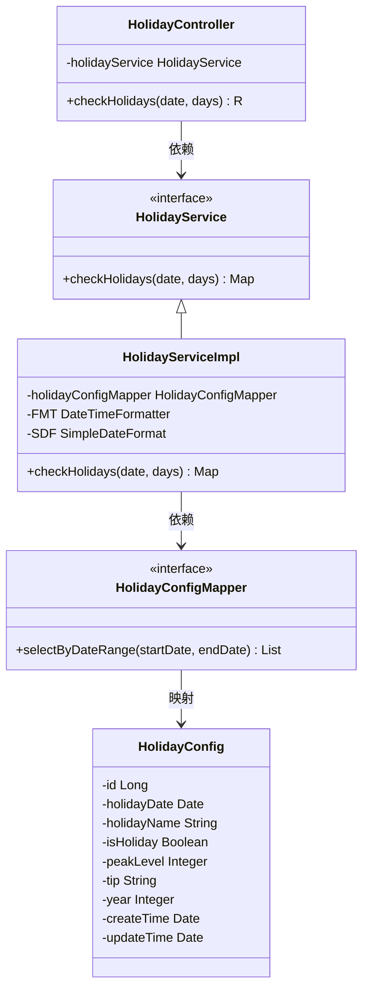
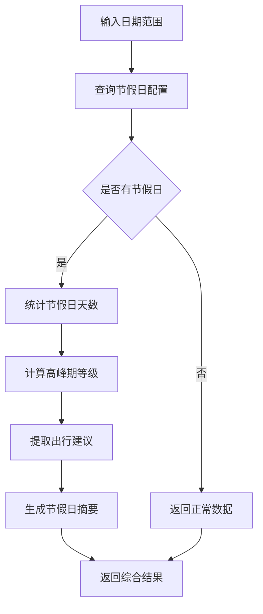
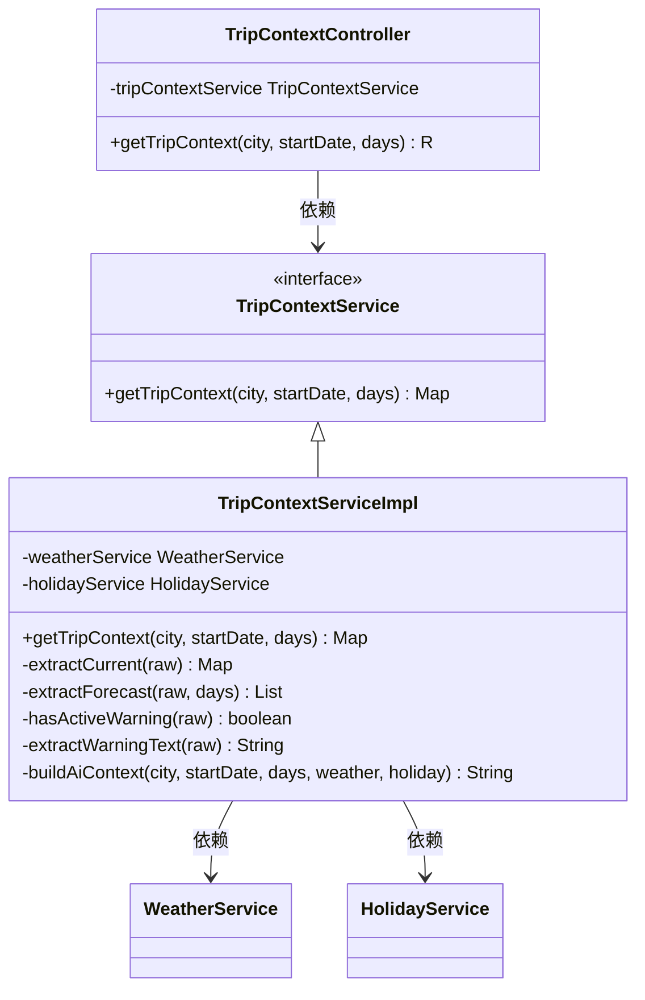
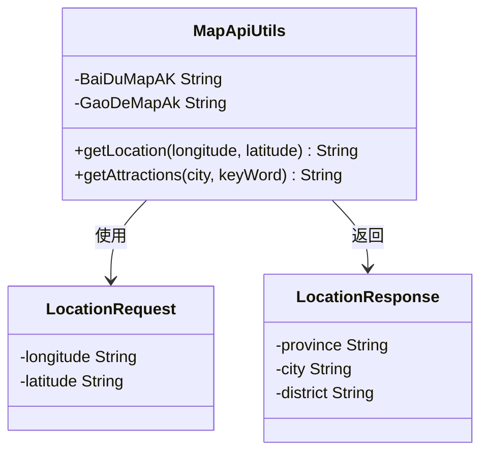
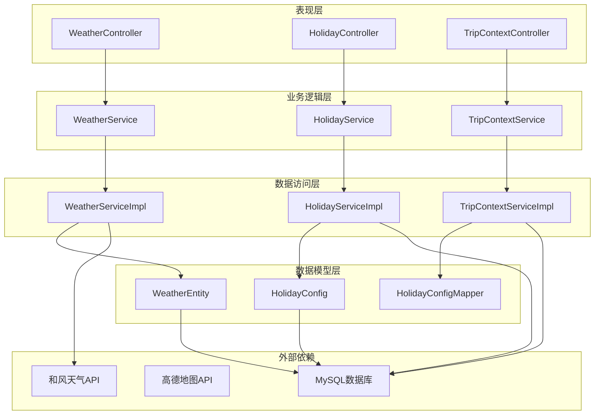

# 天气节假日感知

<cite>
**本文档引用的文件**
- [WeatherController.java](file://springboot-travel-social/src/main/java/com/cxx/controller/WeatherController.java)
- [WeatherService.java](file://springboot-travel-social/src/main/java/com/cxx/service/WeatherService.java)
- [WeatherServiceImpl.java](file://springboot-travel-social/src/main/java/com/cxx/service/impl/WeatherServiceImpl.java)
- [HolidayController.java](file://springboot-travel-social/src/main/java/com/cxx/controller/HolidayController.java)
- [HolidayService.java](file://springboot-travel-social/src/main/java/com/cxx/service/HolidayService.java)
- [HolidayServiceImpl.java](file://springboot-travel-social/src/main/java/com/cxx/service/impl/HolidayServiceImpl.java)
- [HolidayConfig.java](file://springboot-travel-social/src/main/java/com/cxx/entity/HolidayConfig.java)
- [HolidayConfigMapper.java](file://springboot-travel-social/src/main/java/com/cxx/mapper/HolidayConfigMapper.java)
- [HolidayConfigMapper.xml](file://springboot-travel-social/src/main/resources/com/cxx/mapper/HolidayConfigMapper.xml)
- [TripContextController.java](file://springboot-travel-social/src/main/java/com/cxx/controller/TripContextController.java)
- [TripContextService.java](file://springboot-travel-social/src/main/java/com/cxx/service/TripContextService.java)
- [TripContextServiceImpl.java](file://springboot-travel-social/src/main/java/com/cxx/service/impl/TripContextServiceImpl.java)
- [MapApiUtils.java](file://springboot-travel-social/src/main/java/com/cxx/utils/MapApiUtils.java)
- [holiday_config.sql](file://springboot-travel-social/src/main/resources/sql/holiday_config.sql)
- [方案③-天气节假日感知.md](file://方案③-天气节假日感知.md)
</cite>

## 更新摘要
**变更内容**
- 新增了完整的节假日服务组件实现
- 更新了数据库表结构和预置数据
- 完善了行程上下文聚合功能
- 增强了AI上下文生成策略
- 新增了TripContextService实现，提供更智能的旅行上下文感知能力

## 目录
1. [简介](#简介)
2. [项目结构](#项目结构)
3. [核心组件](#核心组件)
4. [架构概览](#架构概览)
5. [详细组件分析](#详细组件分析)
6. [依赖关系分析](#依赖关系分析)
7. [性能考虑](#性能考虑)
8. [故障排除指南](#故障排除指南)
9. [结论](#结论)

## 简介

天气节假日感知系统是旅游攻略社交小程序的重要组成部分，旨在为用户提供智能化的出行建议和决策支持。该系统通过整合实时天气数据、未来天气预报、天气预警信息以及节假日配置，为用户的旅行规划提供全面的环境感知能力。

系统采用前后端分离架构，后端基于Spring Boot框架，提供RESTful API接口，前端采用UniApp框架构建跨平台应用。通过统一的行程上下文聚合接口，用户可以在一次请求中获取完整的出行环境信息。

**更新** 新增了完整的节假日感知功能，包括节假日查询、高峰期分析和智能出行建议生成功能。TripContextService的实现提供了更智能的旅行上下文感知能力，能够将天气和服务信息进行深度整合，生成面向AI的自然语言摘要。

## 项目结构

项目采用标准的MVC架构模式，按照功能模块进行组织：

**图表来源**
- [WeatherController.java:1-87](file://springboot-travel-social/src/main/java/com/cxx/controller/WeatherController.java#L1-L87)
- [HolidayController.java:1-42](file://springboot-travel-social/src/main/java/com/cxx/controller/HolidayController.java#L1-L42)
- [TripContextController.java:1-45](file://springboot-travel-social/src/main/java/com/cxx/controller/TripContextController.java#L1-L45)

**章节来源**
- [WeatherController.java:1-87](file://springboot-travel-social/src/main/java/com/cxx/controller/WeatherController.java#L1-L87)
- [HolidayController.java:1-42](file://springboot-travel-social/src/main/java/com/cxx/controller/HolidayController.java#L1-L42)
- [TripContextController.java:1-45](file://springboot-travel-social/src/main/java/com/cxx/controller/TripContextController.java#L1-L45)

## 核心组件

系统包含四个核心组件，每个组件都有明确的职责分工：

### 天气服务组件
负责处理与天气相关的所有业务逻辑，包括实时天气获取、天气预警查询、7天天气预报和城市搜索功能。

### 节假日服务组件  
维护和管理节假日配置信息，提供节假日查询、高峰期分析和出行建议生成功能。

### 行程上下文聚合组件
将天气和服务信息进行整合，生成面向AI的自然语言摘要，为智能推荐提供上下文支持。

### 地图服务组件
提供地理位置解析和周边搜索功能，支持基于位置的服务集成。

**更新** 新增了TripContextService实现，提供更智能的旅行上下文感知能力，能够：
- 并行调用天气和节假日服务
- 深度整合多源数据
- 生成自然语言摘要
- 提供容错处理机制

**章节来源**
- [WeatherService.java:1-42](file://springboot-travel-social/src/main/java/com/cxx/service/WeatherService.java#L1-L42)
- [HolidayService.java:1-19](file://springboot-travel-social/src/main/java/com/cxx/service/HolidayService.java#L1-L19)
- [TripContextService.java:1-21](file://springboot-travel-social/src/main/java/com/cxx/service/TripContextService.java#L1-L21)
- [MapApiUtils.java:1-45](file://springboot-travel-social/src/main/java/com/cxx/utils/MapApiUtils.java#L1-L45)

## 架构概览

系统采用分层架构设计，确保各层之间的职责清晰和松耦合：

**图表来源**
- [TripContextController.java:28-43](file://springboot-travel-social/src/main/java/com/cxx/controller/TripContextController.java#L28-L43)
- [TripContextServiceImpl.java:24-78](file://springboot-travel-social/src/main/java/com/cxx/service/impl/TripContextServiceImpl.java#L24-L78)

系统架构特点：
- **统一入口**：通过/trip/context提供单一入口，减少网络请求次数
- **并行处理**：天气和节假日数据并行获取，提升响应速度
- **容错机制**：单个服务失败不影响整体功能
- **扩展性强**：易于添加新的感知维度

## 详细组件分析

### 天气服务组件

天气服务组件实现了完整的天气数据获取和处理功能：

**图表来源**
- [WeatherService.java:8-41](file://springboot-travel-social/src/main/java/com/cxx/service/WeatherService.java#L8-L41)
- [WeatherServiceImpl.java:24-295](file://springboot-travel-social/src/main/java/com/cxx/service/impl/WeatherServiceImpl.java#L24-L295)
- [WeatherController.java:22-87](file://springboot-travel-social/src/main/java/com/cxx/controller/WeatherController.java#L22-L87)

#### 天气数据获取流程

系统通过和风天气API获取准确的天气信息，支持多种查询方式：

1. **实时天气查询**：获取当前温度、湿度、风力等详细气象数据
2. **天气预警查询**：检测可能影响出行的极端天气预警
3. **7天天气预报**：提供行程期间的天气趋势预测
4. **城市搜索功能**：支持模糊的城市名称匹配和地理坐标查询

**章节来源**
- [WeatherServiceImpl.java:37-132](file://springboot-travel-social/src/main/java/com/cxx/service/impl/WeatherServiceImpl.java#L37-L132)
- [WeatherController.java:27-85](file://springboot-travel-social/src/main/java/com/cxx/controller/WeatherController.java#L27-L85)

### 节假日服务组件

**更新** 新增了完整的节假日服务组件，提供了智能的节假日分析和建议生成功能：

**图表来源**
- [HolidayService.java:8-18](file://springboot-travel-social/src/main/java/com/cxx/service/HolidayService.java#L8-L18)
- [HolidayServiceImpl.java:22-91](file://springboot-travel-social/src/main/java/com/cxx/service/impl/HolidayServiceImpl.java#L22-L91)
- [HolidayConfig.java:21-57](file://springboot-travel-social/src/main/java/com/cxx/entity/HolidayConfig.java#L21-L57)
- [HolidayConfigMapper.java:12-23](file://springboot-travel-social/src/main/java/com/cxx/mapper/HolidayConfigMapper.java#L12-L23)
- [HolidayController.java:23-41](file://springboot-travel-social/src/main/java/com/cxx/controller/HolidayController.java#L23-L41)

#### 节假日数据分析算法

系统采用智能算法对节假日数据进行分析：

**图表来源**
- [HolidayServiceImpl.java:29-89](file://springboot-travel-social/src/main/java/com/cxx/service/impl/HolidayServiceImpl.java#L29-L89)

**更新** 节假日服务组件提供了以下核心功能：
- **节假日查询**：支持按日期范围查询节假日配置
- **高峰期分析**：根据peakLevel字段分析出行高峰等级
- **智能建议生成**：从tip字段提取出行建议
- **数据聚合**：统计节假日天数和生成汇总信息

**章节来源**
- [HolidayServiceImpl.java:29-89](file://springboot-travel-social/src/main/java/com/cxx/service/impl/HolidayServiceImpl.java#L29-L89)
- [HolidayConfig.java:12-57](file://springboot-travel-social/src/main/java/com/cxx/entity/HolidayConfig.java#L12-L57)

### 行程上下文聚合组件

**更新** 新增了TripContextService实现，提供更智能的旅行上下文感知能力：

**图表来源**
- [TripContextService.java:9-20](file://springboot-travel-social/src/main/java/com/cxx/service/TripContextService.java#L9-L20)
- [TripContextServiceImpl.java:19-78](file://springboot-travel-social/src/main/java/com/cxx/service/impl/TripContextServiceImpl.java#L19-L78)
- [TripContextController.java:26-43](file://springboot-travel-social/src/main/java/com/cxx/controller/TripContextController.java#L26-L43)

#### AI上下文生成策略

**更新** 系统能够自动生成自然语言形式的出行建议：

1. **天气摘要**：包含当前天气状况、温度范围和未来几天的趋势
2. **预警提醒**：突出显示可能影响出行的安全隐患
3. **节假日分析**：根据高峰期等级提供针对性建议
4. **综合建议**：结合所有因素生成个性化的旅行指导

**更新** AI上下文生成策略现在包括：
- **出行时间信息**：包含开始日期和行程天数
- **天气详细摘要**：当前天气、未来预报和预警信息
- **节假日高峰分析**：根据peakLevel生成相应的出行建议
- **智能建议组合**：将多个建议源组合成连贯的指导文本

**章节来源**
- [TripContextServiceImpl.java:150-195](file://springboot-travel-social/src/main/java/com/cxx/service/impl/TripContextServiceImpl.java#L150-L195)

### 地图服务组件

地图服务组件提供地理位置解析和周边搜索功能：

**图表来源**
- [MapApiUtils.java:15-44](file://springboot-travel-social/src/main/java/com/cxx/utils/MapApiUtils.java#L15-L44)

**章节来源**
- [MapApiUtils.java:19-43](file://springboot-travel-social/src/main/java/com/cxx/utils/MapApiUtils.java#L19-L43)

## 依赖关系分析

系统采用清晰的依赖层次结构，确保模块间的松耦合：

**图表来源**
- [WeatherController.java:24-25](file://springboot-travel-social/src/main/java/com/cxx/controller/WeatherController.java#L24-L25)
- [HolidayController.java:25-25](file://springboot-travel-social/src/main/java/com/cxx/controller/HolidayController.java#L25-L25)
- [TripContextController.java:26-26](file://springboot-travel-social/src/main/java/com/cxx/controller/TripContextController.java#L26-L26)

**更新** 新增了节假日服务相关的依赖关系：
- **HolidayServiceImpl** 依赖 **HolidayConfigMapper** 进行数据访问
- **TripContextServiceImpl** 同时依赖 **WeatherService** 和 **HolidayService**
- **HolidayConfig** 实体映射到 **holiday_config** 数据表

**章节来源**
- [WeatherServiceImpl.java:24-295](file://springboot-travel-social/src/main/java/com/cxx/service/impl/WeatherServiceImpl.java#L24-L295)
- [HolidayServiceImpl.java:22-91](file://springboot-travel-social/src/main/java/com/cxx/service/impl/HolidayServiceImpl.java#L22-L91)
- [TripContextServiceImpl.java:19-78](file://springboot-travel-social/src/main/java/com/cxx/service/impl/TripContextServiceImpl.java#L19-L78)

## 性能考虑

系统在设计时充分考虑了性能优化：

### 缓存策略
- **短期缓存**：天气数据采用API提供的TTL缓存机制
- **数据库缓存**：节假日配置数据缓存在内存中，减少数据库查询
- **响应缓存**：对频繁查询的结果进行短期缓存

### 并发处理
- **异步调用**：天气和节假日数据并行获取，减少总等待时间
- **连接池**：HTTP客户端使用连接池管理，提高资源利用率
- **线程安全**：所有服务类都是无状态设计，支持高并发访问

### 错误处理
- **降级策略**：单个服务失败时不影响整体功能
- **超时控制**：设置合理的网络请求超时时间
- **重试机制**：对临时性错误进行自动重试

**更新** 新增了TripContextService的性能优化：
- **并行处理**：WeatherService和HolidayService并行调用
- **容错处理**：单个服务异常不影响整体结果
- **数据提取**：提供专门的数据提取和转换方法

## 故障排除指南

### 常见问题及解决方案

#### 天气数据获取失败
**症状**：天气接口返回错误信息
**原因**：
- API密钥配置错误
- 网络连接异常
- 城市名称解析失败

**解决方案**：
1. 检查API密钥配置
2. 验证网络连接状态
3. 确认城市名称格式正确

#### 节假日数据异常
**症状**：节假日查询结果不准确
**原因**：
- 数据库连接问题
- SQL查询条件错误
- 时间格式转换异常

**解决方案**：
1. 检查数据库连接配置
2. 验证SQL语句语法
3. 确认日期格式一致性

#### 接口响应超时
**症状**：API请求超过预期时间
**原因**：
- 网络延迟过高
- API服务器负载过重
- 客户端超时设置过短

**解决方案**：
1. 增加超时时间配置
2. 实施重试机制
3. 优化网络连接

**更新** 新增了TripContextService相关的故障排除指南：
- **并行调用失败**：检查WeatherService和HolidayService的独立可用性
- **AI上下文生成异常**：验证节假日配置数据的完整性
- **数据提取错误**：确认API响应格式的一致性

**章节来源**
- [WeatherServiceImpl.java:57-63](file://springboot-travel-social/src/main/java/com/cxx/service/impl/WeatherServiceImpl.java#L57-L63)
- [HolidayServiceImpl.java:78-89](file://springboot-travel-social/src/main/java/com/cxx/service/impl/HolidayServiceImpl.java#L78-L89)
- [TripContextServiceImpl.java:50-56](file://springboot-travel-social/src/main/java/com/cxx/service/impl/TripContextServiceImpl.java#L50-L56)

## 结论

天气节假日感知系统通过精心设计的架构和完善的实现，为用户提供了一站式的智能出行辅助服务。系统的主要优势包括：

### 技术优势
- **模块化设计**：清晰的职责分离和接口定义
- **高可用性**：完善的错误处理和降级机制
- **高性能**：并行处理和缓存策略优化
- **易扩展**：插件化的架构支持新功能添加

### 业务价值
- **提升用户体验**：提供准确、及时的出行建议
- **降低决策成本**：帮助用户做出更明智的旅行选择
- **增强平台竞争力**：独特的智能感知能力
- **促进业务增长**：提高用户粘性和转化率

### 发展前景
**更新** 系统具备良好的扩展基础，可以进一步集成更多感知维度，如空气质量、交通状况、景点热度等，为用户提供更加全面的智能出行服务。通过机器学习算法的引入，系统还能实现个性化的推荐和预测功能，为旅游业的数字化转型提供有力支撑。

**更新** 新增的TripContextService实现为系统增加了重要的业务价值：
- **智能决策支持**：基于节假日高峰期的出行建议
- **风险预警功能**：提前识别可能影响出行的节假日因素
- **个性化推荐**：根据不同节假日特点提供定制化建议
- **数据驱动优化**：通过历史节假日数据优化推荐算法
- **统一上下文管理**：提供一致的旅行环境感知体验

**更新** 新增的节假日感知功能为系统增加了重要的业务价值：
- **智能决策支持**：基于节假日高峰期的出行建议
- **风险预警功能**：提前识别可能影响出行的节假日因素
- **个性化推荐**：根据不同节假日特点提供定制化建议
- **数据驱动优化**：通过历史节假日数据优化推荐算法