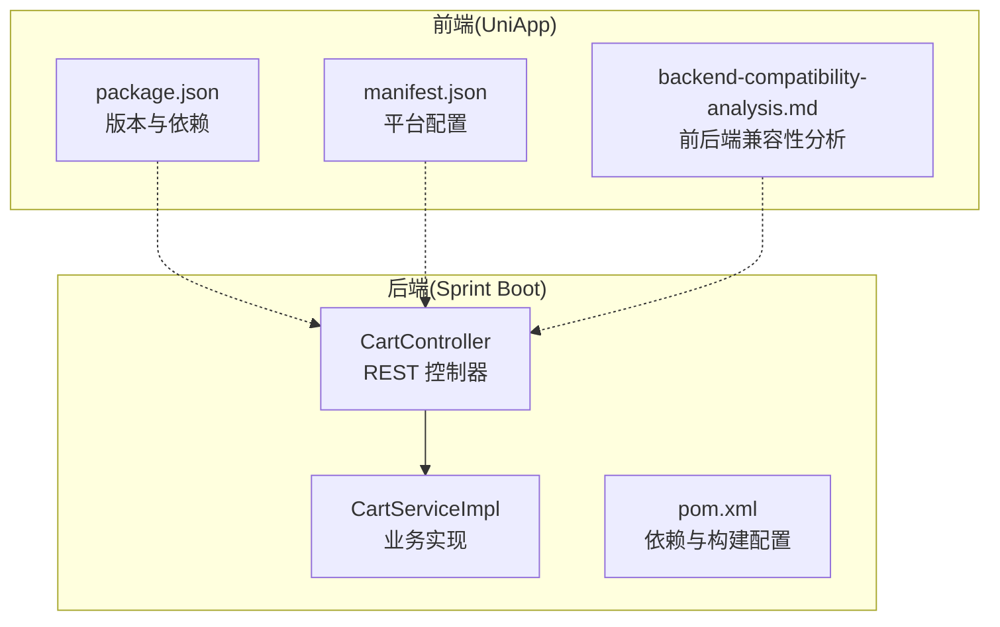
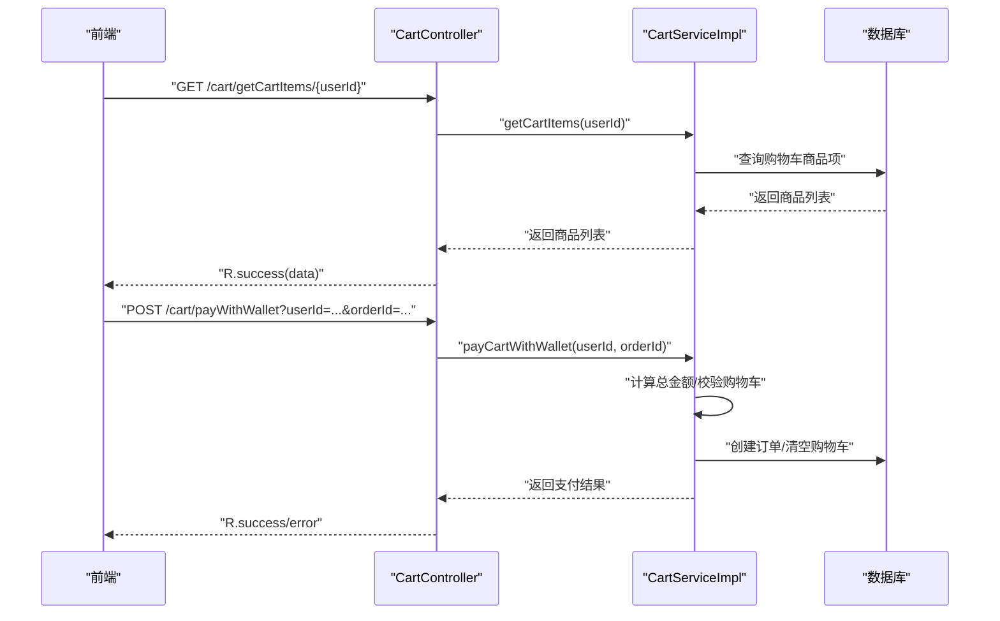
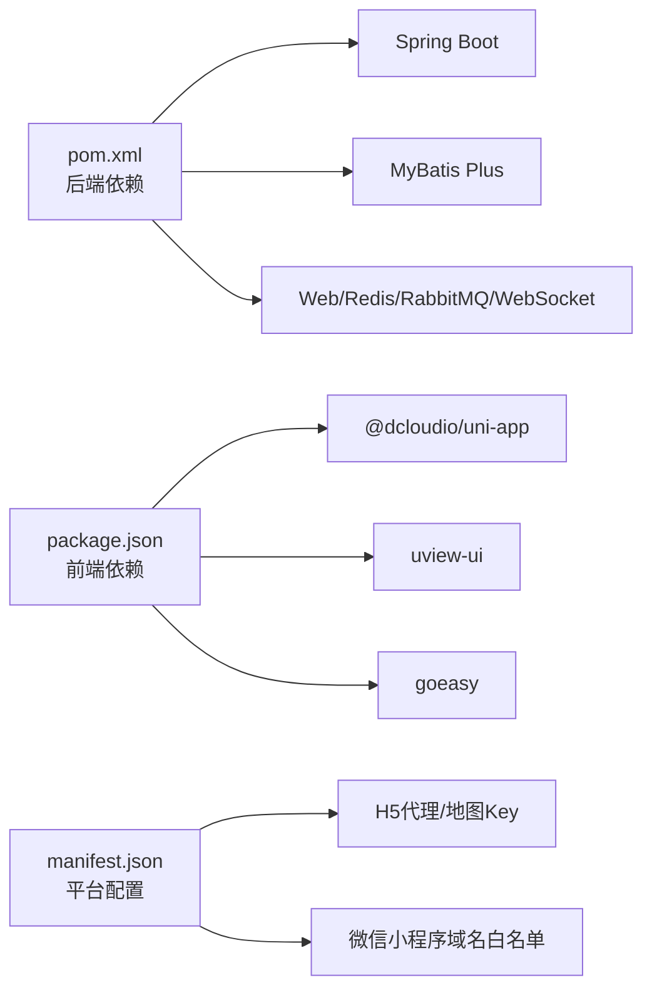

# Git工作流程

<cite>
**本文引用的文件**
- [springboot-travel-social/.gitignore](file://springboot-travel-social/.gitignore)
- [springboot-travel-social/README.md](file://springboot-travel-social/README.md)
- [springboot-travel-social/pom.xml](file://springboot-travel-social/pom.xml)
- [springboot-travel-social/src/main/java/com/cxx/controller/CartController.java](file://springboot-travel-social/src/main/java/com/cxx/controller/CartController.java)
- [springboot-travel-social/src/main/java/com/cxx/service/impl/CartServiceImpl.java](file://springboot-travel-social/src/main/java/com/cxx/service/impl/CartServiceImpl.java)
- [uniapp-travel-social/backend-compatibility-analysis.md](file://uniapp-travel-social/backend-compatibility-analysis.md)
- [uniapp-travel-social/package.json](file://uniapp-travel-social/package.json)
- [uniapp-travel-social/manifest.json](file://uniapp-travel-social/manifest.json)
</cite>

## 目录
1. [简介](#简介)
2. [项目结构](#项目结构)
3. [核心组件](#核心组件)
4. [架构总览](#架构总览)
5. [详细组件分析](#详细组件分析)
6. [依赖关系分析](#依赖关系分析)
7. [性能考虑](#性能考虑)
8. [故障排查指南](#故障排查指南)
9. [结论](#结论)
10. [附录](#附录)

## 简介
本文件面向“旅游攻略社交小程序”项目，系统化梳理Git工作流程与版本控制规范，覆盖分支管理策略、提交规范、Pull Request流程、冲突解决与合并最佳实践、Git标签与版本发布流程，以及.gitignore配置与忽略文件最佳实践。内容结合项目实际代码与配置文件，确保可操作、可落地。

## 项目结构
项目由前后端两部分组成：
- 后端：Spring Boot 应用，提供REST API与业务能力（如购物车、支付等）。
- 前端：uni-app 小程序应用，负责用户界面与交互，并通过API与后端通信。

图表来源
- [springboot-travel-social/src/main/java/com/cxx/controller/CartController.java:1-93](file://springboot-travel-social/src/main/java/com/cxx/controller/CartController.java#L1-L93)
- [springboot-travel-social/src/main/java/com/cxx/service/impl/CartServiceImpl.java:1-274](file://springboot-travel-social/src/main/java/com/cxx/service/impl/CartServiceImpl.java#L1-L274)
- [springboot-travel-social/pom.xml:1-243](file://springboot-travel-social/pom.xml#L1-L243)
- [uniapp-travel-social/package.json:1-27](file://uniapp-travel-social/package.json#L1-L27)
- [uniapp-travel-social/manifest.json:1-127](file://uniapp-travel-social/manifest.json#L1-L127)
- [uniapp-travel-social/backend-compatibility-analysis.md:1-85](file://uniapp-travel-social/backend-compatibility-analysis.md#L1-L85)

章节来源
- [springboot-travel-social/README.md:22-27](file://springboot-travel-social/README.md#L22-L27)
- [springboot-travel-social/.gitignore:1-34](file://springboot-travel-social/.gitignore#L1-L34)
- [springboot-travel-social/pom.xml:1-243](file://springboot-travel-social/pom.xml#L1-L243)
- [uniapp-travel-social/package.json:1-27](file://uniapp-travel-social/package.json#L1-L27)
- [uniapp-travel-social/manifest.json:1-127](file://uniapp-travel-social/manifest.json#L1-L127)

## 核心组件
- 后端控制器与业务实现：后端通过REST接口暴露购物车能力，前端通过统一路径调用；业务层实现价格计算、支付与订单创建等关键流程。
- 前端版本与平台配置：前端维护版本号与平台配置，便于构建与发布；同时提供前后端兼容性分析文档，指导接口一致性与数据格式统一。

章节来源
- [springboot-travel-social/src/main/java/com/cxx/controller/CartController.java:1-93](file://springboot-travel-social/src/main/java/com/cxx/controller/CartController.java#L1-L93)
- [springboot-travel-social/src/main/java/com/cxx/service/impl/CartServiceImpl.java:1-274](file://springboot-travel-social/src/main/java/com/cxx/service/impl/CartServiceImpl.java#L1-L274)
- [uniapp-travel-social/package.json:1-27](file://uniapp-travel-social/package.json#L1-L27)
- [uniapp-travel-social/manifest.json:1-127](file://uniapp-travel-social/manifest.json#L1-L127)
- [uniapp-travel-social/backend-compatibility-analysis.md:1-85](file://uniapp-travel-social/backend-compatibility-analysis.md#L1-L85)

## 架构总览
下图展示了前后端协作的关键流程：前端发起请求，后端控制器接收并委派给业务实现，业务实现完成价格计算与支付处理后返回结果。

图表来源
- [springboot-travel-social/src/main/java/com/cxx/controller/CartController.java:62-92](file://springboot-travel-social/src/main/java/com/cxx/controller/CartController.java#L62-L92)
- [springboot-travel-social/src/main/java/com/cxx/service/impl/CartServiceImpl.java:210-273](file://springboot-travel-social/src/main/java/com/cxx/service/impl/CartServiceImpl.java#L210-L273)

## 详细组件分析

### 分支管理策略
- 主分支(main/master)：存放稳定、可发布代码，合并前需通过审查与测试。
- 开发分支(dev/develop)：集成日常开发成果，作为功能分支的汇聚点。
- 功能分支(feature/feat)：按功能命名，如 feat_用户登录、feat_购物车优化，开发完成后合并回开发分支。
- 热修复分支(hotfix)：紧急修复线上问题，从主分支切出，修复后同时合并回主分支与开发分支。

章节来源
- [springboot-travel-social/README.md:24-27](file://springboot-travel-social/README.md#L24-L27)

### 提交规范
- 提交信息格式：type(scope): subject
  - type：feat、fix、docs、style、refactor、test、chore等
  - scope：影响范围，如 controller、service、ui、deps
  - subject：简要描述变更内容
- 示例参考：
  - feat(controller): 新增购物车支付接口
  - fix(service): 修复价格计算精度问题
  - docs(readme): 更新贡献指南
  - refactor(utils): 重构价格工具类
  - chore(deps): 升级Spring Boot版本
- 说明：本项目README中已体现“新建 Feat_xxx 分支”的贡献流程，建议在此基础上补充标准化的提交信息规范，提升可追溯性与自动化处理能力。

章节来源
- [springboot-travel-social/README.md:24-27](file://springboot-travel-social/README.md#L24-L27)

### Pull Request流程与代码审查
- PR流程建议：
  1) 从开发分支创建功能分支进行开发；
  2) 提交代码并推送远程；
  3) 在代码托管平台创建PR，填写变更说明与关联Issue；
  4) 指定至少一名审查者进行代码审查；
  5) 修改审查意见直至通过；
  6) 合并前执行必要的自动化检查（构建、测试）。
- 审查要点：
  - 代码风格与规范一致性；
  - 接口契约与数据模型变更；
  - 性能与安全风险评估；
  - 测试覆盖率与回归测试。

章节来源
- [springboot-travel-social/README.md:24-27](file://springboot-travel-social/README.md#L24-L27)

### 冲突解决策略与合并最佳实践
- 预防冲突：
  - 小步提交、频繁同步上游分支；
  - 功能拆分明确，避免大范围并行修改；
  - 严格遵循提交规范与代码风格。
- 解决冲突：
  - 使用工具定位冲突文件，逐段比对差异；
  - 明确业务语义，保留正确逻辑；
  - 必要时回滚并重新设计实现。
- 合并最佳实践：
  - 合并前确保CI通过、无未解决冲突；
  - 优先使用squash合并保持历史整洁；
  - 合并后及时删除已合并的功能分支。

章节来源
- [springboot-travel-social/README.md:24-27](file://springboot-travel-social/README.md#L24-L27)

### Git标签与版本发布流程
- 标签策略：
  - 语义化版本：v1.2.2、v1.2.3 等；
  - 仅在稳定发布时打标签，避免频繁小版本标签。
- 发布流程：
  1) 确认主分支稳定，完成必要测试；
  2) 更新版本号（后端pom.xml、前端package.json、manifest.json）；
  3) 提交版本变更并推送；
  4) 打标签并推送；
  5) 生成发布说明，上传构建产物。

章节来源
- [springboot-travel-social/pom.xml:7](file://springboot-travel-social/pom.xml#L7)
- [uniapp-travel-social/package.json:5](file://uniapp-travel-social/package.json#L5)
- [uniapp-travel-social/manifest.json:5](file://uniapp-travel-social/manifest.json#L5)

### .gitignore配置与忽略文件最佳实践
- 忽略对象：
  - 构建产物：target、build等；
  - IDE/编辑器：.idea、.vscode、.classpath等；
  - 平台私有文件：各IDE/平台缓存与临时文件。
- 最佳实践：
  - 仅忽略构建产物与临时文件，保留源码与配置文件；
  - 对于可选的本地配置，提供模板并在ignore中排除模板文件；
  - 团队统一ignore规则，减少差异化。

章节来源
- [springboot-travel-social/.gitignore:1-34](file://springboot-travel-social/.gitignore#L1-L34)

## 依赖关系分析
- 后端依赖管理：通过Maven集中管理依赖版本，统一Spring Boot版本与常用组件。
- 前端依赖管理：通过npm管理依赖与脚本，维护版本号与平台配置。
- 兼容性分析：前后端接口与数据格式需保持一致，避免价格单位与精度差异导致的支付问题。

图表来源
- [springboot-travel-social/pom.xml:16-182](file://springboot-travel-social/pom.xml#L16-L182)
- [uniapp-travel-social/package.json:15-21](file://uniapp-travel-social/package.json#L15-L21)
- [uniapp-travel-social/manifest.json:101-125](file://uniapp-travel-social/manifest.json#L101-L125)

章节来源
- [springboot-travel-social/pom.xml:1-243](file://springboot-travel-social/pom.xml#L1-L243)
- [uniapp-travel-social/package.json:1-27](file://uniapp-travel-social/package.json#L1-L27)
- [uniapp-travel-social/manifest.json:1-127](file://uniapp-travel-social/manifest.json#L1-L127)

## 性能考虑
- 接口幂等与事务边界：业务层涉及多表写入与支付，应确保事务完整性与幂等性，避免重复支付或数据不一致。
- 价格计算精度：统一使用高精度数值类型，避免因单位换算导致的误差。
- 前后端数据一致性：接口返回结构与字段命名需统一，减少解析与转换成本。

章节来源
- [springboot-travel-social/src/main/java/com/cxx/service/impl/CartServiceImpl.java:210-273](file://springboot-travel-social/src/main/java/com/cxx/service/impl/CartServiceImpl.java#L210-L273)
- [uniapp-travel-social/backend-compatibility-analysis.md:21-43](file://uniapp-travel-social/backend-compatibility-analysis.md#L21-L43)

## 故障排查指南
- 价格单位不一致：若后端存储以“分”为单位而前端以“元”展示，会导致显示与支付金额偏差。建议统一为“元”，并在后端进行单位转换或前端修正。
- 支付金额计算错误：当总金额来自“分”单位未转换为“元”，可能导致钱包支付失败。应在支付前进行单位换算。
- 数据类型不一致：购物车与订单间价格类型不一致会引发精度丢失与计算错误。建议统一使用高精度类型并建立工具类处理。

章节来源
- [uniapp-travel-social/backend-compatibility-analysis.md:21-43](file://uniapp-travel-social/backend-compatibility-analysis.md#L21-L43)
- [springboot-travel-social/src/main/java/com/cxx/service/impl/CartServiceImpl.java:225-226](file://springboot-travel-social/src/main/java/com/cxx/service/impl/CartServiceImpl.java#L225-L226)

## 结论
本规范以项目实际代码与配置为基础，明确了分支策略、提交规范、PR流程、冲突解决与合并实践、标签与发布流程，以及忽略文件最佳实践。建议团队在现有贡献流程基础上补充标准化提交信息与审查清单，持续完善自动化检查与发布流程，保障交付质量与效率。

## 附录
- 建议补充的提交类型说明：
  - feat：新增功能
  - fix：修复缺陷
  - docs：文档更新
  - style：不影响逻辑的样式调整
  - refactor：重构但不改变行为
  - test：新增或调整测试
  - chore：构建过程或辅助工具变动
- 建议补充的PR模板字段：
  - 变更类型、影响范围、测试验证、兼容性说明、回滚预案