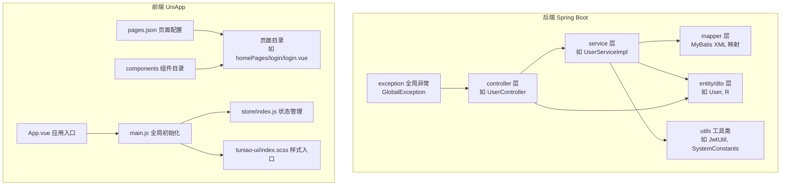
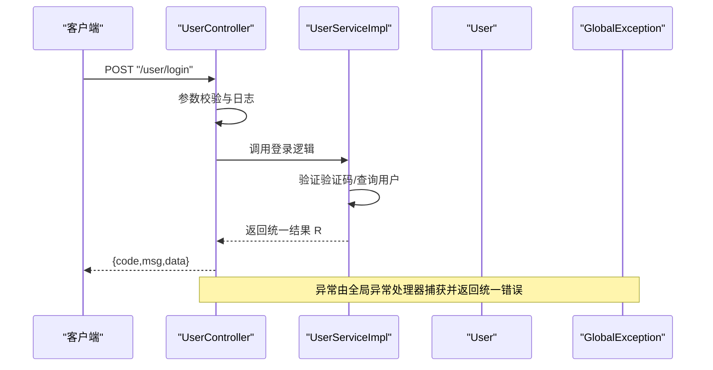
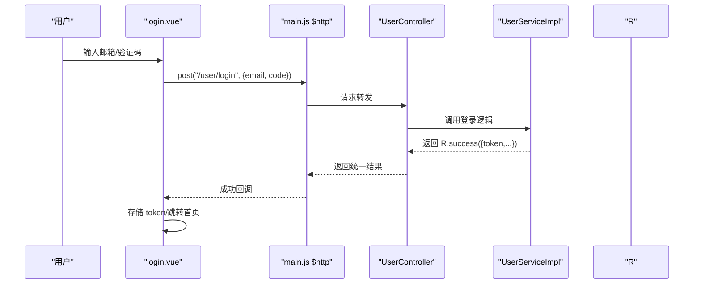
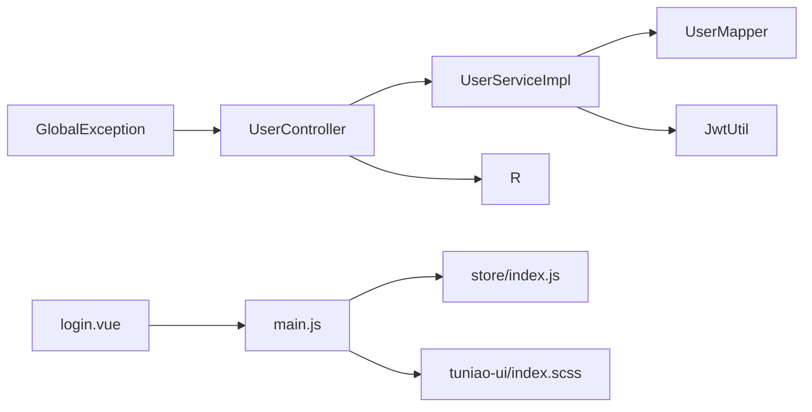

# 代码规范

<cite>
**本文引用的文件**
- [UserController.java](file://springboot-travel-social/src/main/java/com/cxx/controller/UserController.java)
- [User.java](file://springboot-travel-social/src/main/java/com/cxx/entity/User.java)
- [UserServiceImpl.java](file://springboot-travel-social/src/main/java/com/cxx/service/impl/UserServiceImpl.java)
- [JwtUtil.java](file://springboot-travel-social/src/main/java/com/cxx/utils/JwtUtil.java)
- [GlobalException.java](file://springboot-travel-social/src/main/java/com/cxx/exception/GlobalException.java)
- [R.java](file://springboot-travel-social/src/main/java/com/cxx/entity/R.java)
- [SystemConstants.java](file://springboot-travel-social/src/main/java/com/cxx/utils/SystemConstants.java)
- [App.vue](file://uniapp-travel-social/App.vue)
- [main.js](file://uniapp-travel-social/main.js)
- [pages.json](file://uniapp-travel-social/pages.json)
- [user-login.vue](file://uniapp-travel-social/components/user-login/user-login.vue)
- [login.vue](file://uniapp-travel-social/homePages/login/login.vue)
- [index.scss](file://uniapp-travel-social/tuniao-ui/index.scss)
- [index.js](file://uniapp-travel-social/store/index.js)
</cite>

## 目录
1. [引言](#引言)
2. [项目结构](#项目结构)
3. [核心组件](#核心组件)
4. [架构总览](#架构总览)
5. [详细组件分析](#详细组件分析)
6. [依赖分析](#依赖分析)
7. [性能考虑](#性能考虑)
8. [故障排查指南](#故障排查指南)
9. [结论](#结论)
10. [附录](#附录)

## 引言
本文件面向Java后端与前端UniApp团队，提供一套统一、可执行的代码规范与最佳实践，涵盖命名约定、注释规范、代码格式、异常处理、日志记录、前端组件命名与文件组织、样式命名、JavaScript/TypeScript风格、以及IDE与格式化工具配置建议。规范以仓库现有代码为依据进行提炼与总结，并通过图示与路径指引帮助团队快速落地。

## 项目结构
- 后端采用Spring Boot工程，按领域分层组织：controller、service、mapper、entity、dto、utils、exception、config等。
- 前端采用UniApp工程，页面按功能域分包管理，组件独立存放，样式通过SCSS组织，状态管理采用Vuex。

图表来源
- [UserController.java:31-34](file://springboot-travel-social/src/main/java/com/cxx/controller/UserController.java#L31-L34)
- [UserServiceImpl.java:43-44](file://springboot-travel-social/src/main/java/com/cxx/service/impl/UserServiceImpl.java#L43-L44)
- [pages.json:1-800](file://uniapp-travel-social/pages.json#L1-L800)
- [App.vue:1-93](file://uniapp-travel-social/App.vue#L1-L93)
- [main.js:1-118](file://uniapp-travel-social/main.js#L1-L118)
- [index.js:1-75](file://uniapp-travel-social/store/index.js#L1-L75)
- [index.scss:1-13](file://uniapp-travel-social/tuniao-ui/index.scss#L1-L13)

章节来源
- [UserController.java:31-34](file://springboot-travel-social/src/main/java/com/cxx/controller/UserController.java#L31-L34)
- [UserServiceImpl.java:43-44](file://springboot-travel-social/src/main/java/com/cxx/service/impl/UserServiceImpl.java#L43-L44)
- [pages.json:1-800](file://uniapp-travel-social/pages.json#L1-L800)
- [App.vue:1-93](file://uniapp-travel-social/App.vue#L1-L93)
- [main.js:1-118](file://uniapp-travel-social/main.js#L1-L118)
- [index.js:1-75](file://uniapp-travel-social/store/index.js#L1-L75)
- [index.scss:1-13](file://uniapp-travel-social/tuniao-ui/index.scss#L1-L13)

## 核心组件
- 统一响应体 R：用于前后端一致的返回结构，便于前端消费与异常处理。
- 全局异常 GlobalException：集中捕获运行时异常，输出统一错误信息。
- JWT 工具 JwtUtil：生成登录令牌，简化认证流程。
- 用户实体 User：包含字段注解与序列化控制，体现数据库映射与传输策略。
- 常量 SystemConstants：集中管理业务常量，提升可维护性。

章节来源
- [R.java:14-30](file://springboot-travel-social/src/main/java/com/cxx/entity/R.java#L14-L30)
- [GlobalException.java:8-17](file://springboot-travel-social/src/main/java/com/cxx/exception/GlobalException.java#L8-L17)
- [JwtUtil.java:8-18](file://springboot-travel-social/src/main/java/com/cxx/utils/JwtUtil.java#L8-L18)
- [User.java:22-80](file://springboot-travel-social/src/main/java/com/cxx/entity/User.java#L22-L80)
- [SystemConstants.java:3-24](file://springboot-travel-social/src/main/java/com/cxx/utils/SystemConstants.java#L3-L24)

## 架构总览
后端通过Controller接收请求，调用Service完成业务逻辑，Service操作Mapper访问数据库，统一返回R结构；前端通过main.js注入HTTP拦截器与全局状态，页面按pages.json配置加载，组件按需复用。

图表来源
- [UserController.java:83-93](file://springboot-travel-social/src/main/java/com/cxx/controller/UserController.java#L83-L93)
- [UserServiceImpl.java:75-110](file://springboot-travel-social/src/main/java/com/cxx/service/impl/UserServiceImpl.java#L75-L110)
- [GlobalException.java:10-17](file://springboot-travel-social/src/main/java/com/cxx/exception/GlobalException.java#L10-L17)

## 详细组件分析

### Java 后端代码规范

- 命名约定
  - 包名：全小写，如 com.cxx.controller。
  - 类名：帕斯卡命名，如 UserController、UserServiceImpl、GlobalException。
  - 方法名：驼峰命名，如 login、getTotalUserCount、updateUsername。
  - 常量：全大写+下划线，如 SystemConstants 中的常量。
  - DTO/VO：以 DTO/VO 结尾，如 LoginFormDTO、DelicacyVO。
  - 工具类：以 Util 结尾，如 JwtUtil。
  - 异常类：以 Exception 结尾，如 GlobalException。

- 注释规范
  - 类注释：使用标准Javadoc，描述类职责与作者信息，如UserController、User、GlobalException 的类注释。
  - 方法注释：说明参数、返回值、异常与业务逻辑，如 UserServiceImpl 中的方法注释。
  - 字段注释：对数据库映射字段进行注释，如 User 实体的字段注释。
  - 统一返回体：R 类提供 success/error 静态方法，确保前后端一致。

- 代码格式
  - 缩进：统一使用4空格缩进。
  - 大括号：控制语句与类声明的大括号独占一行。
  - 空行：方法之间保留空行，逻辑分组清晰。
  - 导入顺序：标准库在前，第三方在后，通配符尽量避免。

- 异常处理规范
  - 使用统一异常处理器 GlobalException 捕获运行时异常，返回 R.error。
  - 业务异常：直接返回 R.error(msg)，避免抛出受检异常。
  - 日志：使用 SLF4J 记录关键操作与错误，如 UserController 中的日志。

- 日志记录标准
  - 关键路径：登录、验证码发送、更新用户信息等。
  - 日志级别：INFO/ERROR，避免DEBUG冗余日志。
  - 参数脱敏：敏感字段（如密码）不直接打印。

- 数据模型与注解
  - MyBatis-Plus 注解：@TableName、@TableId、@TableField 等，保证字段映射与逻辑删除。
  - JSON 注解：@JsonFormat、@JsonIgnore 控制序列化。
  - Swagger 注解：@ApiModel 描述实体用途。

- 示例对比（仅路径，不展示具体代码）
  - 正确：类注释使用Javadoc，字段注释清晰，方法注释完整。
    - [UserController.java:23-30](file://springboot-travel-social/src/main/java/com/cxx/controller/UserController.java#L23-L30)
    - [User.java:14-28](file://springboot-travel-social/src/main/java/com/cxx/entity/User.java#L14-L28)
    - [UserServiceImpl.java:170-189](file://springboot-travel-social/src/main/java/com/cxx/service/impl/UserServiceImpl.java#L170-L189)
  - 错误：缺少类注释、字段注释不完整、方法注释缺失。
    - [UserController.java:127-133](file://springboot-travel-social/src/main/java/com/cxx/controller/UserController.java#L127-L133)

章节来源
- [UserController.java:23-30](file://springboot-travel-social/src/main/java/com/cxx/controller/UserController.java#L23-L30)
- [User.java:14-28](file://springboot-travel-social/src/main/java/com/cxx/entity/User.java#L14-L28)
- [UserServiceImpl.java:170-189](file://springboot-travel-social/src/main/java/com/cxx/service/impl/UserServiceImpl.java#L170-L189)
- [GlobalException.java:8-17](file://springboot-travel-social/src/main/java/com/cxx/exception/GlobalException.java#L8-L17)
- [R.java:14-30](file://springboot-travel-social/src/main/java/com/cxx/entity/R.java#L14-L30)

### 前端 UniApp 代码规范

- Vue 组件命名规范
  - 组件文件名：帕斯卡命名，如 user-login.vue。
  - 组件 name：与文件名一致，如 name: 'Login'。
  - 页面组件：页面级组件使用页面路径命名，如 login.vue。

- 文件组织结构
  - 页面按功能域分包：如 homePages、messagePages、routePages 等。
  - 组件独立存放：components 下的通用组件，如 user-login。
  - 样式入口：tuniao-ui/index.scss 引入公共样式与平台特有样式。
  - 状态管理：store/index.js 统一管理状态与持久化。

- 样式命名约定（BEM 方法论）
  - 块（Block）：login-container、login__mode。
  - 元素（Element）：login__mode__item、login__info__item__input。
  - 修饰符（Modifier）：login__mode__item--active。
  - 平台条件编译：通过 /* #ifdef MP/H5 */ 控制样式差异。

- JavaScript/TypeScript 规范
  - 统一使用 ES6+ 语法，模块化导入导出。
  - 全局初始化：main.js 中注入HTTP拦截器、全局状态、GoEasy IM 初始化。
  - 页面配置：pages.json 中定义页面路径、标题、下拉刷新等。
  - 组件复用：通过 easycom 自动匹配组件，如 tn-*、u-*。

- 示例对比（仅路径，不展示具体代码）
  - 正确：组件命名规范、BEM 命名、页面配置清晰。
    - [user-login.vue:11-25](file://uniapp-travel-social/components/user-login/user-login.vue#L11-L25)
    - [login.vue:172-333](file://uniapp-travel-social/homePages/login/login.vue#L172-L333)
    - [pages.json:1-800](file://uniapp-travel-social/pages.json#L1-L800)
  - 错误：组件名与文件名不一致、BEM 命名混乱、页面配置缺失。
    - [user-login.vue:13](file://uniapp-travel-social/components/user-login/user-login.vue#L13)

章节来源
- [user-login.vue:11-25](file://uniapp-travel-social/components/user-login/user-login.vue#L11-L25)
- [login.vue:172-333](file://uniapp-travel-social/homePages/login/login.vue#L172-L333)
- [pages.json:1-800](file://uniapp-travel-social/pages.json#L1-L800)
- [index.scss:1-13](file://uniapp-travel-social/tuniao-ui/index.scss#L1-L13)
- [index.js:1-75](file://uniapp-travel-social/store/index.js#L1-L75)

### 前后端交互流程

图表来源
- [login.vue:258-293](file://uniapp-travel-social/homePages/login/login.vue#L258-L293)
- [main.js:25-56](file://uniapp-travel-social/main.js#L25-L56)
- [UserController.java:83-93](file://springboot-travel-social/src/main/java/com/cxx/controller/UserController.java#L83-L93)
- [UserServiceImpl.java:75-110](file://springboot-travel-social/src/main/java/com/cxx/service/impl/UserServiceImpl.java#L75-L110)
- [R.java:19-29](file://springboot-travel-social/src/main/java/com/cxx/entity/R.java#L19-L29)

## 依赖分析
- 后端
  - Controller 依赖 Service，Service 依赖 Mapper 与工具类，统一返回 R。
  - 全局异常处理器统一捕获异常，保障接口稳定性。
- 前端
  - 页面依赖组件与全局样式，main.js 注入HTTP拦截器与状态管理。
  - pages.json 管理页面路由与样式配置。

图表来源
- [UserController.java:35-38](file://springboot-travel-social/src/main/java/com/cxx/controller/UserController.java#L35-L38)
- [UserServiceImpl.java:44](file://springboot-travel-social/src/main/java/com/cxx/service/impl/UserServiceImpl.java#L44)
- [JwtUtil.java:8-18](file://springboot-travel-social/src/main/java/com/cxx/utils/JwtUtil.java#L8-L18)
- [R.java:14-30](file://springboot-travel-social/src/main/java/com/cxx/entity/R.java#L14-L30)
- [GlobalException.java:8-17](file://springboot-travel-social/src/main/java/com/cxx/exception/GlobalException.java#L8-L17)
- [login.vue:172-333](file://uniapp-travel-social/homePages/login/login.vue#L172-L333)
- [main.js:1-118](file://uniapp-travel-social/main.js#L1-L118)
- [index.js:1-75](file://uniapp-travel-social/store/index.js#L1-L75)
- [index.scss:1-13](file://uniapp-travel-social/tuniao-ui/index.scss#L1-L13)

章节来源
- [UserController.java:35-38](file://springboot-travel-social/src/main/java/com/cxx/controller/UserController.java#L35-L38)
- [UserServiceImpl.java:44](file://springboot-travel-social/src/main/java/com/cxx/service/impl/UserServiceImpl.java#L44)
- [JwtUtil.java:8-18](file://springboot-travel-social/src/main/java/com/cxx/utils/JwtUtil.java#L8-L18)
- [R.java:14-30](file://springboot-travel-social/src/main/java/com/cxx/entity/R.java#L14-L30)
- [GlobalException.java:8-17](file://springboot-travel-social/src/main/java/com/cxx/exception/GlobalException.java#L8-L17)
- [login.vue:172-333](file://uniapp-travel-social/homePages/login/login.vue#L172-L333)
- [main.js:1-118](file://uniapp-travel-social/main.js#L1-L118)
- [index.js:1-75](file://uniapp-travel-social/store/index.js#L1-L75)
- [index.scss:1-13](file://uniapp-travel-social/tuniao-ui/index.scss#L1-L13)

## 性能考虑
- 后端
  - 缓存：合理使用Redis缓存验证码与登录信息，降低数据库压力。
  - 分页：大数据量场景使用分页查询，避免一次性加载过多数据。
  - 批量更新：涉及多表关联更新时，尽量合并SQL减少往返。
- 前端
  - 懒加载：页面与组件按需加载，减少首屏体积。
  - 图片优化：使用合适尺寸与格式，避免大图强加载。
  - 状态持久化：仅持久化必要状态，避免本地存储膨胀。

## 故障排查指南
- 后端
  - 统一异常：出现异常时检查 GlobalException 是否捕获并返回 R.error。
  - 日志定位：根据控制器与服务层日志快速定位问题点。
  - 响应一致性：前端通过 R.code 判断业务成功与否，异常时读取 R.msg。
- 前端
  - 登录失败：检查 main.js 中 $http.afterRequest 对401的处理与页面跳转逻辑。
  - 页面配置：pages.json 中页面路径与标题不一致会导致页面无法加载。
  - 组件样式：BEM 命名不规范可能导致样式覆盖或失效。

章节来源
- [GlobalException.java:10-17](file://springboot-travel-social/src/main/java/com/cxx/exception/GlobalException.java#L10-L17)
- [UserController.java:43-80](file://springboot-travel-social/src/main/java/com/cxx/controller/UserController.java#L43-L80)
- [main.js:43-56](file://uniapp-travel-social/main.js#L43-L56)
- [pages.json:1-800](file://uniapp-travel-social/pages.json#L1-L800)

## 结论
本规范以现有代码为依据，明确了Java后端与前端UniApp的命名、注释、格式、异常与日志标准，并提供了前后端交互流程与依赖关系图示。建议团队在日常开发中严格遵循，持续改进，确保代码质量与协作效率。

## 附录

### IDE 配置与代码格式化建议（基于仓库现状）
- Java
  - 使用 Lombok 注解时开启注解处理器。
  - 使用 SLF4J 日志框架，避免 System.out/printStackTrace。
  - 使用统一的 Maven/Gradle 构建脚本，确保依赖版本一致。
- 前端
  - 使用 HBuilderX 或 VS Code + UniApp 插件，启用ESLint与Prettier。
  - 在 pages.json 中统一配置页面样式与导航栏，避免分散配置。
  - 组件命名与文件名保持一致，遵循 BEM 命名法。