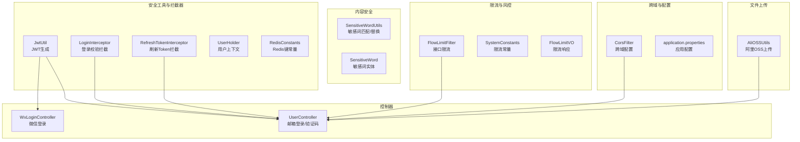
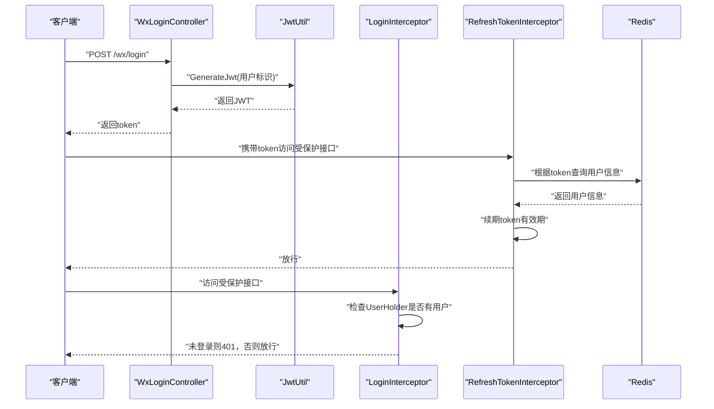
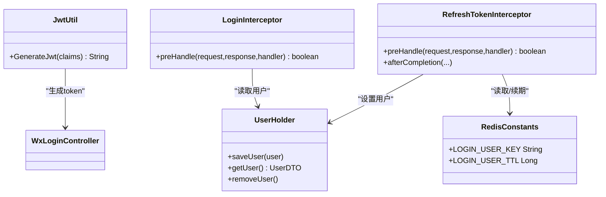
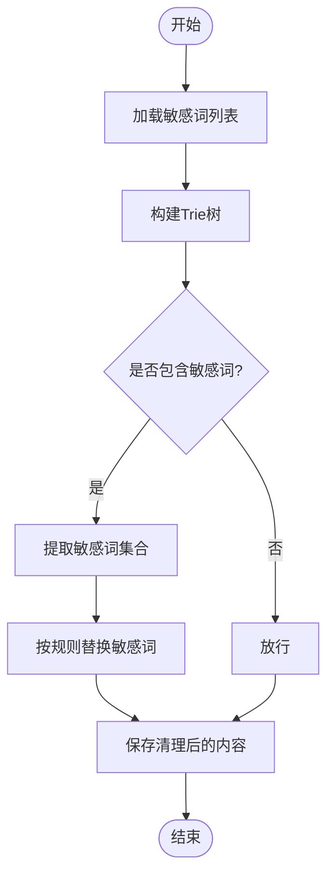
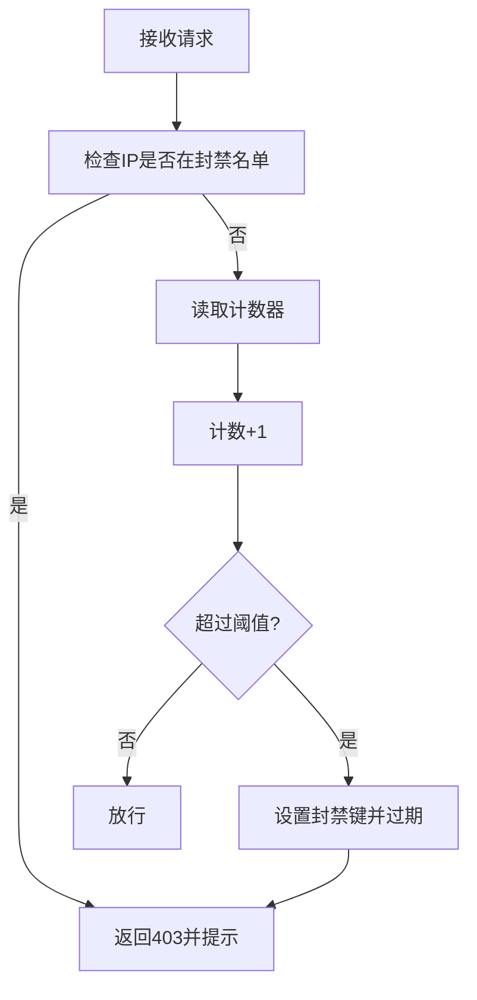
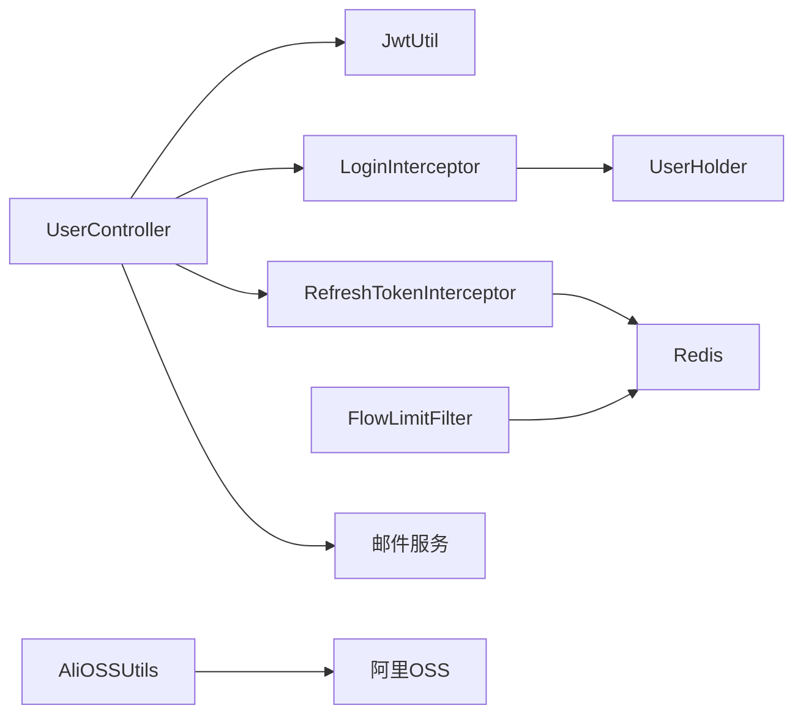

# 安全规范

<cite>
**本文引用的文件**
- [JwtUtil.java](file://springboot-travel-social/src/main/java/com/cxx/utils/JwtUtil.java)
- [LoginInterceptor.java](file://springboot-travel-social/src/main/java/com/cxx/utils/LoginInterceptor.java)
- [RefreshTokenInterceptor.java](file://springboot-travel-social/src/main/java/com/cxx/utils/RefreshTokenInterceptor.java)
- [UserHolder.java](file://springboot-travel-social/src/main/java/com/cxx/utils/UserHolder.java)
- [RedisConstants.java](file://springboot-travel-social/src/main/java/com/cxx/utils/RedisConstants.java)
- [FlowLimitFilter.java](file://springboot-travel-social/src/main/java/com/cxx/filter/FlowLimitFilter.java)
- [SystemConstants.java](file://springboot-travel-social/src/main/java/com/cxx/utils/SystemConstants.java)
- [FlowLimitVO.java](file://springboot-travel-social/src/main/java/com/cxx/vo/FlowLimitVO.java)
- [SensitiveWordUtils.java](file://springboot-travel-social/src/main/java/com/cxx/utils/SensitiveWordUtils.java)
- [SensitiveWord.java](file://springboot-travel-social/src/main/java/com/cxx/entity/SensitiveWord.java)
- [CorsFilter.java](file://springboot-travel-social/src/main/java/com/cxx/config/CorsFilter.java)
- [WxLoginController.java](file://springboot-travel-social/src/main/java/com/cxx/controller/WxLoginController.java)
- [UserController.java](file://springboot-travel-social/src/main/java/com/cxx/controller/UserController.java)
- [AliOSSUtils.java](file://springboot-travel-social/src/main/java/com/cxx/utils/AliOSSUtils.java)
- [application.properties](file://springboot-travel-social/src/main/resources/application.properties)
- [travel_socical.sql](file://travel_socical.sql)
</cite>

## 目录
1. [简介](#简介)
2. [项目结构](#项目结构)
3. [核心组件](#核心组件)
4. [架构总览](#架构总览)
5. [详细组件分析](#详细组件分析)
6. [依赖分析](#依赖分析)
7. [性能考量](#性能考量)
8. [故障排查指南](#故障排查指南)
9. [结论](#结论)
10. [附录](#附录)

## 简介
本文件面向“旅游攻略社交小程序”的后端工程，系统化梳理并输出一套安全编码与防护规范，覆盖身份认证与授权、输入验证与数据清理、密码安全处理、文件上传安全、API安全防护、日志审计与安全监控，以及常见安全漏洞的预防与检测方法。文档以代码为依据，配合可视化图示，帮助开发者与运维人员快速落地安全实践。

## 项目结构
后端采用 Spring Boot 工程，关键安全相关模块分布如下：
- 工具与拦截器：JWT 工具、登录拦截器、刷新 Token 拦截器、用户上下文持有、Redis 常量
- 过滤与限流：接口限流过滤器、系统常量、限流返回 VO
- 内容安全：敏感词工具与实体
- 跨域与配置：跨域配置
- 控制器：微信登录、邮箱登录、验证码发送
- 文件上传：阿里 OSS 工具
- 配置与数据库：应用配置、数据库结构

图表来源
- [JwtUtil.java:1-19](file://springboot-travel-social/src/main/java/com/cxx/utils/JwtUtil.java#L1-L19)
- [LoginInterceptor.java:1-18](file://springboot-travel-social/src/main/java/com/cxx/utils/LoginInterceptor.java#L1-L18)
- [RefreshTokenInterceptor.java:1-50](file://springboot-travel-social/src/main/java/com/cxx/utils/RefreshTokenInterceptor.java#L1-L50)
- [UserHolder.java:1-20](file://springboot-travel-social/src/main/java/com/cxx/utils/UserHolder.java#L1-L20)
- [RedisConstants.java:1-30](file://springboot-travel-social/src/main/java/com/cxx/utils/RedisConstants.java#L1-L30)
- [FlowLimitFilter.java:1-71](file://springboot-travel-social/src/main/java/com/cxx/filter/FlowLimitFilter.java#L1-L71)
- [SystemConstants.java:1-24](file://springboot-travel-social/src/main/java/com/cxx/utils/SystemConstants.java#L1-L24)
- [FlowLimitVO.java:1-23](file://springboot-travel-social/src/main/java/com/cxx/vo/FlowLimitVO.java#L1-L23)
- [SensitiveWordUtils.java:1-205](file://springboot-travel-social/src/main/java/com/cxx/utils/SensitiveWordUtils.java#L1-L205)
- [SensitiveWord.java:1-29](file://springboot-travel-social/src/main/java/com/cxx/entity/SensitiveWord.java#L1-L29)
- [CorsFilter.java:1-28](file://springboot-travel-social/src/main/java/com/cxx/config/CorsFilter.java#L1-L28)
- [WxLoginController.java:1-35](file://springboot-travel-social/src/main/java/com/cxx/controller/WxLoginController.java#L1-L35)
- [UserController.java:1-136](file://springboot-travel-social/src/main/java/com/cxx/controller/UserController.java#L1-L136)
- [AliOSSUtils.java:1-34](file://springboot-travel-social/src/main/java/com/cxx/utils/AliOSSUtils.java#L1-L34)
- [application.properties:1-61](file://springboot-travel-social/src/main/resources/application.properties#L1-L61)

章节来源
- [JwtUtil.java:1-19](file://springboot-travel-social/src/main/java/com/cxx/utils/JwtUtil.java#L1-L19)
- [LoginInterceptor.java:1-18](file://springboot-travel-social/src/main/java/com/cxx/utils/LoginInterceptor.java#L1-L18)
- [RefreshTokenInterceptor.java:1-50](file://springboot-travel-social/src/main/java/com/cxx/utils/RefreshTokenInterceptor.java#L1-L50)
- [UserHolder.java:1-20](file://springboot-travel-social/src/main/java/com/cxx/utils/UserHolder.java#L1-L20)
- [RedisConstants.java:1-30](file://springboot-travel-social/src/main/java/com/cxx/utils/RedisConstants.java#L1-L30)
- [FlowLimitFilter.java:1-71](file://springboot-travel-social/src/main/java/com/cxx/filter/FlowLimitFilter.java#L1-L71)
- [SystemConstants.java:1-24](file://springboot-travel-social/src/main/java/com/cxx/utils/SystemConstants.java#L1-L24)
- [FlowLimitVO.java:1-23](file://springboot-travel-social/src/main/java/com/cxx/vo/FlowLimitVO.java#L1-L23)
- [SensitiveWordUtils.java:1-205](file://springboot-travel-social/src/main/java/com/cxx/utils/SensitiveWordUtils.java#L1-L205)
- [SensitiveWord.java:1-29](file://springboot-travel-social/src/main/java/com/cxx/entity/SensitiveWord.java#L1-L29)
- [CorsFilter.java:1-28](file://springboot-travel-social/src/main/java/com/cxx/config/CorsFilter.java#L1-L28)
- [WxLoginController.java:1-35](file://springboot-travel-social/src/main/java/com/cxx/controller/WxLoginController.java#L1-L35)
- [UserController.java:1-136](file://springboot-travel-social/src/main/java/com/cxx/controller/UserController.java#L1-L136)
- [AliOSSUtils.java:1-34](file://springboot-travel-social/src/main/java/com/cxx/utils/AliOSSUtils.java#L1-L34)
- [application.properties:1-61](file://springboot-travel-social/src/main/resources/application.properties#L1-L61)

## 核心组件
- 身份认证与授权
  - JWT 令牌生成与使用：用于登录成功后签发令牌，携带用户标识。
  - 登录拦截器：未登录请求直接拒绝。
  - 刷新 Token 拦截器：从请求头读取 Token，校验 Redis 中用户信息，续期并放入上下文。
  - 用户上下文：线程本地存储当前用户信息，便于后续业务使用。
  - Redis 常量：定义登录 Token 键前缀与过期时间。
- 输入验证与数据清理
  - 敏感词过滤：构建敏感词 Trie 树，支持最小匹配与全部匹配两种模式，提供检测、提取与替换能力。
  - 邮箱验证码发送：对重复请求做 IP 限流与锁定。
- 密码安全处理
  - 仓库中未发现密码加密实现，建议补充哈希算法与盐值策略。
- 文件上传安全
  - 阿里 OSS 上传：随机文件名、桶内路径、关闭客户端连接。
- API 安全防护
  - 接口限流：基于 Redis 的滑动窗口计数，超过阈值封禁。
  - 跨域配置：允许任意来源、凭证、方法与头。
- 日志审计与安全监控
  - 控制器层使用日志记录关键操作；建议补充统一异常日志与审计埋点。

章节来源
- [JwtUtil.java:1-19](file://springboot-travel-social/src/main/java/com/cxx/utils/JwtUtil.java#L1-L19)
- [LoginInterceptor.java:1-18](file://springboot-travel-social/src/main/java/com/cxx/utils/LoginInterceptor.java#L1-L18)
- [RefreshTokenInterceptor.java:1-50](file://springboot-travel-social/src/main/java/com/cxx/utils/RefreshTokenInterceptor.java#L1-L50)
- [UserHolder.java:1-20](file://springboot-travel-social/src/main/java/com/cxx/utils/UserHolder.java#L1-L20)
- [RedisConstants.java:1-30](file://springboot-travel-social/src/main/java/com/cxx/utils/RedisConstants.java#L1-L30)
- [FlowLimitFilter.java:1-71](file://springboot-travel-social/src/main/java/com/cxx/filter/FlowLimitFilter.java#L1-L71)
- [SensitiveWordUtils.java:1-205](file://springboot-travel-social/src/main/java/com/cxx/utils/SensitiveWordUtils.java#L1-L205)
- [SensitiveWord.java:1-29](file://springboot-travel-social/src/main/java/com/cxx/entity/SensitiveWord.java#L1-L29)
- [UserController.java:1-136](file://springboot-travel-social/src/main/java/com/cxx/controller/UserController.java#L1-L136)
- [AliOSSUtils.java:1-34](file://springboot-travel-social/src/main/java/com/cxx/utils/AliOSSUtils.java#L1-L34)
- [CorsFilter.java:1-28](file://springboot-travel-social/src/main/java/com/cxx/config/CorsFilter.java#L1-L28)

## 架构总览
下图展示了登录与鉴权的关键交互流程，包括微信登录、JWT 生成、拦截器校验与 Token 刷新。

图表来源
- [WxLoginController.java:1-35](file://springboot-travel-social/src/main/java/com/cxx/controller/WxLoginController.java#L1-L35)
- [JwtUtil.java:1-19](file://springboot-travel-social/src/main/java/com/cxx/utils/JwtUtil.java#L1-L19)
- [LoginInterceptor.java:1-18](file://springboot-travel-social/src/main/java/com/cxx/utils/LoginInterceptor.java#L1-L18)
- [RefreshTokenInterceptor.java:1-50](file://springboot-travel-social/src/main/java/com/cxx/utils/RefreshTokenInterceptor.java#L1-L50)
- [RedisConstants.java:1-30](file://springboot-travel-social/src/main/java/com/cxx/utils/RedisConstants.java#L1-L30)

## 详细组件分析

### 身份认证与授权
- JWT 令牌使用
  - 令牌内容包含用户标识，签名算法固定，过期时间短（一天），建议结合刷新 Token 机制与 HTTPS 强制使用。
- 登录拦截器
  - 若上下文中无用户信息，直接返回 401，确保受保护接口的安全。
- 刷新 Token 拦截器
  - 从请求头读取 token，校验 Redis 中用户信息，续期并放入上下文，便于后续业务使用。
- 用户上下文与 Redis 常量
  - 线程本地存储用户信息，Redis 键前缀与 TTL 统一管理，便于集中治理。

图表来源
- [JwtUtil.java:1-19](file://springboot-travel-social/src/main/java/com/cxx/utils/JwtUtil.java#L1-L19)
- [LoginInterceptor.java:1-18](file://springboot-travel-social/src/main/java/com/cxx/utils/LoginInterceptor.java#L1-L18)
- [RefreshTokenInterceptor.java:1-50](file://springboot-travel-social/src/main/java/com/cxx/utils/RefreshTokenInterceptor.java#L1-L50)
- [UserHolder.java:1-20](file://springboot-travel-social/src/main/java/com/cxx/utils/UserHolder.java#L1-L20)
- [RedisConstants.java:1-30](file://springboot-travel-social/src/main/java/com/cxx/utils/RedisConstants.java#L1-L30)

章节来源
- [WxLoginController.java:1-35](file://springboot-travel-social/src/main/java/com/cxx/controller/WxLoginController.java#L1-L35)
- [JwtUtil.java:1-19](file://springboot-travel-social/src/main/java/com/cxx/utils/JwtUtil.java#L1-L19)
- [LoginInterceptor.java:1-18](file://springboot-travel-social/src/main/java/com/cxx/utils/LoginInterceptor.java#L1-L18)
- [RefreshTokenInterceptor.java:1-50](file://springboot-travel-social/src/main/java/com/cxx/utils/RefreshTokenInterceptor.java#L1-L50)
- [UserHolder.java:1-20](file://springboot-travel-social/src/main/java/com/cxx/utils/UserHolder.java#L1-L20)
- [RedisConstants.java:1-30](file://springboot-travel-social/src/main/java/com/cxx/utils/RedisConstants.java#L1-L30)

### 输入验证与数据清理
- 敏感词过滤
  - 初始化敏感词库，构建 Trie 树，支持最小匹配与全部匹配两种模式，提供检测、提取与替换能力。
  - 建议在用户输入提交前执行敏感词检测与替换，防止敏感内容入库与传播。
- 邮箱验证码发送
  - 对同一邮箱与同一 IP 的请求做限流与锁定，避免暴力刷取。

图表来源
- [SensitiveWordUtils.java:1-205](file://springboot-travel-social/src/main/java/com/cxx/utils/SensitiveWordUtils.java#L1-L205)
- [SensitiveWord.java:1-29](file://springboot-travel-social/src/main/java/com/cxx/entity/SensitiveWord.java#L1-L29)

章节来源
- [SensitiveWordUtils.java:1-205](file://springboot-travel-social/src/main/java/com/cxx/utils/SensitiveWordUtils.java#L1-L205)
- [SensitiveWord.java:1-29](file://springboot-travel-social/src/main/java/com/cxx/entity/SensitiveWord.java#L1-L29)
- [UserController.java:1-136](file://springboot-travel-social/src/main/java/com/cxx/controller/UserController.java#L1-L136)

### 密码安全处理
- 现状：仓库中未发现密码加密实现。
- 建议：
  - 使用强哈希算法（如 Argon2、bcrypt、scrypt 或 PBKDF2）。
  - 为每个密码生成唯一盐值，盐值长度不少于 16 字节。
  - 密码强度要求：长度≥8，包含大小写字母、数字与特殊字符，禁止使用生日、姓名等弱口令。
  - 定期轮换密钥与算法版本，确保向前兼容。

章节来源
- [UserController.java:1-136](file://springboot-travel-social/src/main/java/com/cxx/controller/UserController.java#L1-L136)

### 文件上传安全规范
- 当前实现：使用阿里 OSS 上传，随机文件名，桶内路径，关闭客户端连接。
- 建议：
  - 文件类型验证：服务端白名单校验（如 image/*、video/*），拒绝未知类型。
  - 文件大小限制：结合全局配置与单文件限制，防止滥用。
  - 恶意文件检测：集成病毒扫描与内容识别（OCR/视频审核），阻断风险文件。
  - 存储与访问：私有读取，生成带签名的临时链接；定期清理过期文件。
  - 日志审计：记录上传时间、IP、文件名、大小、类型、审核结果。

章节来源
- [AliOSSUtils.java:1-34](file://springboot-travel-social/src/main/java/com/cxx/utils/AliOSSUtils.java#L1-L34)
- [application.properties:15-16](file://springboot-travel-social/src/main/resources/application.properties#L15-L16)

### API 安全防护
- 请求频率限制
  - 基于 Redis 的滑动窗口计数，超过阈值封禁，封禁期间返回统一错误码与提示。
- 参数签名
  - 建议引入参数签名机制（如 HMAC-SHA256），对关键参数进行签名校验，防止篡改。
- HTTPS 强制使用
  - 建议在网关或 Nginx 层强制跳转 HTTPS，避免明文传输。
- CSRF 防护
  - 建议引入 CSRF Token，配合 SameSite Cookie 与 Origin/Referer 校验。

图表来源
- [FlowLimitFilter.java:1-71](file://springboot-travel-social/src/main/java/com/cxx/filter/FlowLimitFilter.java#L1-L71)
- [SystemConstants.java:1-24](file://springboot-travel-social/src/main/java/com/cxx/utils/SystemConstants.java#L1-L24)
- [FlowLimitVO.java:1-23](file://springboot-travel-social/src/main/java/com/cxx/vo/FlowLimitVO.java#L1-L23)

章节来源
- [FlowLimitFilter.java:1-71](file://springboot-travel-social/src/main/java/com/cxx/filter/FlowLimitFilter.java#L1-L71)
- [SystemConstants.java:1-24](file://springboot-travel-social/src/main/java/com/cxx/utils/SystemConstants.java#L1-L24)
- [FlowLimitVO.java:1-23](file://springboot-travel-social/src/main/java/com/cxx/vo/FlowLimitVO.java#L1-L23)

### 日志审计与安全监控
- 控制器层已使用日志记录关键操作（如微信登录、验证码发送）。
- 建议：
  - 统一日志格式与字段（请求ID、用户ID、IP、UA、时间、接口、参数摘要、结果、耗时）。
  - 审计埋点：登录、登出、修改密码、敏感操作、异常事件。
  - 监控告警：异常率、响应时间、限流触发、登录失败、文件上传失败。
  - 日志脱敏：对敏感字段（密码、手机号、邮箱）进行脱敏处理。

章节来源
- [WxLoginController.java:1-35](file://springboot-travel-social/src/main/java/com/cxx/controller/WxLoginController.java#L1-L35)
- [UserController.java:1-136](file://springboot-travel-social/src/main/java/com/cxx/controller/UserController.java#L1-L136)

## 依赖分析
- 组件耦合
  - 控制器依赖工具类与拦截器，拦截器依赖 Redis 与上下文，限流依赖 Redis。
- 外部依赖
  - Redis：登录态存储、限流计数、封禁控制。
  - 阿里 OSS：文件上传。
  - 邮件服务：验证码发送。
- 潜在风险
  - Redis 未启用密码与 TLS，建议开启认证与加密。
  - 跨域配置允许任意来源与凭证，建议限定可信域名。

图表来源
- [UserController.java:1-136](file://springboot-travel-social/src/main/java/com/cxx/controller/UserController.java#L1-L136)
- [JwtUtil.java:1-19](file://springboot-travel-social/src/main/java/com/cxx/utils/JwtUtil.java#L1-L19)
- [LoginInterceptor.java:1-18](file://springboot-travel-social/src/main/java/com/cxx/utils/LoginInterceptor.java#L1-L18)
- [RefreshTokenInterceptor.java:1-50](file://springboot-travel-social/src/main/java/com/cxx/utils/RefreshTokenInterceptor.java#L1-L50)
- [FlowLimitFilter.java:1-71](file://springboot-travel-social/src/main/java/com/cxx/filter/FlowLimitFilter.java#L1-L71)
- [AliOSSUtils.java:1-34](file://springboot-travel-social/src/main/java/com/cxx/utils/AliOSSUtils.java#L1-L34)
- [application.properties:31-42](file://springboot-travel-social/src/main/resources/application.properties#L31-L42)

章节来源
- [application.properties:1-61](file://springboot-travel-social/src/main/resources/application.properties#L1-L61)

## 性能考量
- Redis 性能
  - 合理设置过期时间与键空间，避免内存膨胀。
  - 使用管道与批量操作减少网络往返。
- 限流策略
  - 滑动窗口计数法简单高效，注意热点 IP 的竞争与原子性。
- 文件上传
  - 分片上传与断点续传，降低失败重试成本。
- 日志与监控
  - 异步写日志与采样上报，避免阻塞主流程。

## 故障排查指南
- 登录 401
  - 检查拦截器是否正确设置用户上下文，确认 Token 是否过期。
- 限流触发
  - 查看 Redis 中计数器与封禁键，核对阈值与封禁时间。
- 验证码无法接收
  - 检查邮件服务配置与 IP 限制逻辑。
- 文件上传失败
  - 检查 OSS 凭证、桶权限与网络连通性。

章节来源
- [LoginInterceptor.java:1-18](file://springboot-travel-social/src/main/java/com/cxx/utils/LoginInterceptor.java#L1-L18)
- [FlowLimitFilter.java:1-71](file://springboot-travel-social/src/main/java/com/cxx/filter/FlowLimitFilter.java#L1-L71)
- [UserController.java:1-136](file://springboot-travel-social/src/main/java/com/cxx/controller/UserController.java#L1-L136)
- [AliOSSUtils.java:1-34](file://springboot-travel-social/src/main/java/com/cxx/utils/AliOSSUtils.java#L1-L34)

## 结论
本项目在登录鉴权、接口限流、敏感词过滤与文件上传方面具备基础能力，建议优先补齐密码加密、参数签名、HTTPS 强制与 CSRF 防护，并完善日志审计与安全监控体系，以满足生产环境的安全要求。

## 附录
- 数据库结构要点
  - 用户、博客、景点等核心表结构，建议在新增字段与索引设计时同步考虑安全与合规。
- 配置要点
  - Redis 未启用密码与 TLS，建议尽快加固。
  - 跨域配置较为宽松，建议按需收紧。

章节来源
- [travel_socical.sql:1-200](file://travel_socical.sql#L1-L200)
- [application.properties:1-61](file://springboot-travel-social/src/main/resources/application.properties#L1-L61)