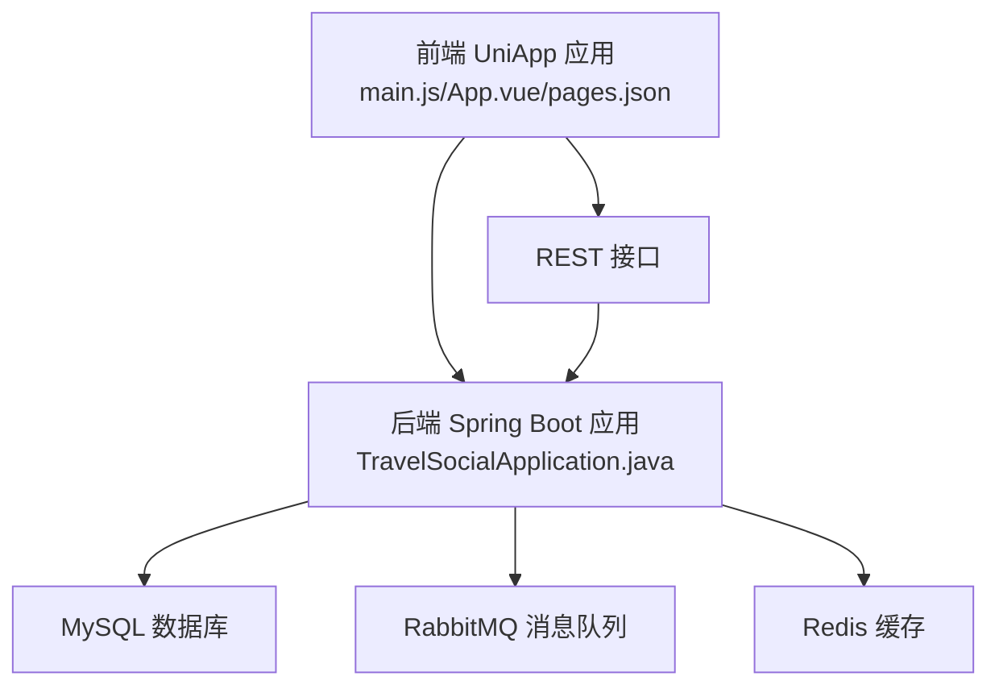
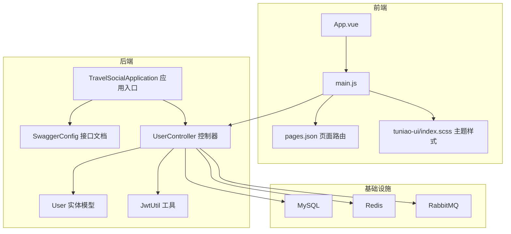
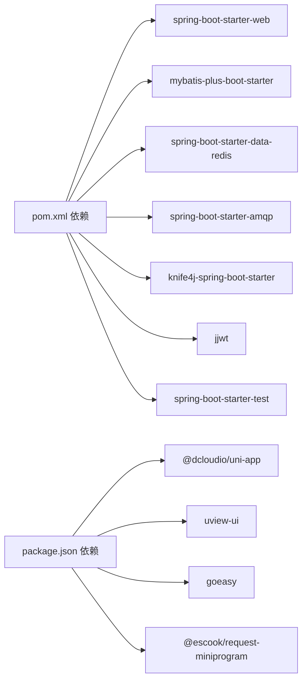

# 开发规范

<cite>
**本文引用的文件**
- [springboot-travel-social/README.md](file://springboot-travel-social/README.md)
- [springboot-travel-social/pom.xml](file://springboot-travel-social/pom.xml)
- [springboot-travel-social/src/main/resources/application.properties](file://springboot-travel-social/src/main/resources/application.properties)
- [springboot-travel-social/src/main/java/com/cxx/TravelSocialApplication.java](file://springboot-travel-social/src/main/java/com/cxx/TravelSocialApplication.java)
- [springboot-travel-social/src/main/java/com/cxx/controller/UserController.java](file://springboot-travel-social/src/main/java/com/cxx/controller/UserController.java)
- [springboot-travel-social/src/main/java/com/cxx/entity/User.java](file://springboot-travel-social/src/main/java/com/cxx/entity/User.java)
- [springboot-travel-social/src/main/java/com/cxx/utils/JwtUtil.java](file://springboot-travel-social/src/main/java/com/cxx/utils/JwtUtil.java)
- [springboot-travel-social/src/main/java/com/cxx/config/SwaggerConfig.java](file://springboot-travel-social/src/main/java/com/cxx/config/SwaggerConfig.java)
- [springboot-travel-social/.gitignore](file://springboot-travel-social/.gitignore)
- [uniapp-travel-social/package.json](file://uniapp-travel-social/package.json)
- [uniapp-travel-social/pages.json](file://uniapp-travel-social/pages.json)
- [uniapp-travel-social/App.vue](file://uniapp-travel-social/App.vue)
- [uniapp-travel-social/main.js](file://uniapp-travel-social/main.js)
- [uniapp-travel-social/tuniao-ui/index.scss](file://uniapp-travel-social/tuniao-ui/index.scss)
</cite>

## 目录
1. [引言](#引言)
2. [项目结构](#项目结构)
3. [核心组件](#核心组件)
4. [架构总览](#架构总览)
5. [详细组件分析](#详细组件分析)
6. [依赖分析](#依赖分析)
7. [性能考虑](#性能考虑)
8. [故障排查指南](#故障排查指南)
9. [结论](#结论)
10. [附录](#附录)

## 引言
本指南面向“旅游攻略社交小程序”项目的后端（Spring Boot）与前端（UniApp/Vue）团队，旨在统一开发规范与最佳实践，覆盖代码风格、命名约定、注释规范、代码格式、Git 工作流、测试与质量保障、性能优化以及安全编码等方面。文档以仓库现有实现为依据，结合通用工程化经验，形成可落地的规范条目。

## 项目结构
项目由两部分组成：
- 后端 Spring Boot 工程：提供 REST 接口、业务逻辑、消息队列、缓存、定时任务、接口文档等能力。
- 前端 UniApp 工程：基于 Vue 2 + uView/自研 Tuniao UI 组件库，按页面分包组织，统一主题与样式。

图表来源
- [uniapp-travel-social/main.js:1-118](file://uniapp-travel-social/main.js#L1-L118)
- [uniapp-travel-social/pages.json:1-814](file://uniapp-travel-social/pages.json#L1-L814)
- [springboot-travel-social/src/main/resources/application.properties:1-61](file://springboot-travel-social/src/main/resources/application.properties#L1-L61)
- [springboot-travel-social/src/main/java/com/cxx/TravelSocialApplication.java:1-54](file://springboot-travel-social/src/main/java/com/cxx/TravelSocialApplication.java#L1-L54)

章节来源
- [springboot-travel-social/README.md:1-38](file://springboot-travel-social/README.md#L1-L38)
- [uniapp-travel-social/package.json:1-27](file://uniapp-travel-social/package.json#L1-L27)

## 核心组件
- 后端应用入口与初始化：应用启动、WebSocket 上下文注入、数据库迁移检查。
- 控制器层：用户相关接口示例，包含验证码发送、登录、资料更新等。
- 实体模型：用户实体，含逻辑删除、字段填充、序列化控制等。
- 工具类：JWT 工具，用于生成令牌。
- 配置类：Knife4j/Swagger 文档配置，暴露管理端点映射。
- 前端入口与全局配置：HTTP 请求拦截、GoEasy 即时通讯初始化、全局样式引入。

章节来源
- [springboot-travel-social/src/main/java/com/cxx/TravelSocialApplication.java:1-54](file://springboot-travel-social/src/main/java/com/cxx/TravelSocialApplication.java#L1-L54)
- [springboot-travel-social/src/main/java/com/cxx/controller/UserController.java:1-136](file://springboot-travel-social/src/main/java/com/cxx/controller/UserController.java#L1-L136)
- [springboot-travel-social/src/main/java/com/cxx/entity/User.java:1-81](file://springboot-travel-social/src/main/java/com/cxx/entity/User.java#L1-L81)
- [springboot-travel-social/src/main/java/com/cxx/utils/JwtUtil.java:1-19](file://springboot-travel-social/src/main/java/com/cxx/utils/JwtUtil.java#L1-L19)
- [springboot-travel-social/src/main/java/com/cxx/config/SwaggerConfig.java:1-79](file://springboot-travel-social/src/main/java/com/cxx/config/SwaggerConfig.java#L1-L79)
- [uniapp-travel-social/main.js:1-118](file://uniapp-travel-social/main.js#L1-L118)
- [uniapp-travel-social/App.vue:1-93](file://uniapp-travel-social/App.vue#L1-L93)

## 架构总览
后端采用 Spring Boot + MyBatis-Plus + Redis + RabbitMQ + MySQL 的常见组合；前端通过统一的 HTTP 拦截器注入 token，连接后端 API 并集成即时通讯模块。

图表来源
- [uniapp-travel-social/App.vue:1-93](file://uniapp-travel-social/App.vue#L1-L93)
- [uniapp-travel-social/main.js:1-118](file://uniapp-travel-social/main.js#L1-L118)
- [uniapp-travel-social/pages.json:1-814](file://uniapp-travel-social/pages.json#L1-L814)
- [uniapp-travel-social/tuniao-ui/index.scss:1-13](file://uniapp-travel-social/tuniao-ui/index.scss#L1-L13)
- [springboot-travel-social/src/main/java/com/cxx/TravelSocialApplication.java:1-54](file://springboot-travel-social/src/main/java/com/cxx/TravelSocialApplication.java#L1-L54)
- [springboot-travel-social/src/main/java/com/cxx/config/SwaggerConfig.java:1-79](file://springboot-travel-social/src/main/java/com/cxx/config/SwaggerConfig.java#L1-L79)
- [springboot-travel-social/src/main/java/com/cxx/controller/UserController.java:1-136](file://springboot-travel-social/src/main/java/com/cxx/controller/UserController.java#L1-L136)
- [springboot-travel-social/src/main/java/com/cxx/entity/User.java:1-81](file://springboot-travel-social/src/main/java/com/cxx/entity/User.java#L1-L81)
- [springboot-travel-social/src/main/java/com/cxx/utils/JwtUtil.java:1-19](file://springboot-travel-social/src/main/java/com/cxx/utils/JwtUtil.java#L1-L19)

## 详细组件分析

### Java 后端开发规范
- 命名约定
  - 包名：采用反向域名风格，如 com.cxx。
  - 类名：采用帕斯卡命名法，如 UserController、TravelSocialApplication。
  - 方法名：采用驼峰命名法，如 sendMsg、checkAndAddPayStatusColumn。
  - 常量：全大写下划线分隔，如 LOGIN_CODE_KEY。
  - 接口与抽象类：遵循语义清晰的名词或形容词，如 Service、Repository。
- 注释规范
  - 类注释：使用标准块注释，包含简要描述与作者信息。
  - 方法注释：说明用途、参数、返回值与异常情况。
  - 字段注释：标注业务含义与约束。
- 代码格式
  - 统一使用缩进与空行，保持一致的换行与空格风格。
  - 导入顺序：第三方库优先，再本地包，最后静态导入。
  - 行宽：建议不超过 120 列。
- 日志与异常
  - 使用 SLF4J 记录日志，区分 info、warn、error 等级别。
  - 自定义异常与全局异常处理，确保对外返回统一结构。
- 安全与鉴权
  - 使用 JWT 工具生成令牌，注意密钥与有效期管理。
  - 对敏感操作使用事务与幂等设计。
- 配置与资源
  - application.properties 中集中管理数据库、Redis、RabbitMQ、邮件等配置。
  - Swagger 文档开启，便于联调与测试。

章节来源
- [springboot-travel-social/src/main/java/com/cxx/TravelSocialApplication.java:1-54](file://springboot-travel-social/src/main/java/com/cxx/TravelSocialApplication.java#L1-L54)
- [springboot-travel-social/src/main/java/com/cxx/controller/UserController.java:1-136](file://springboot-travel-social/src/main/java/com/cxx/controller/UserController.java#L1-L136)
- [springboot-travel-social/src/main/java/com/cxx/entity/User.java:1-81](file://springboot-travel-social/src/main/java/com/cxx/entity/User.java#L1-L81)
- [springboot-travel-social/src/main/java/com/cxx/utils/JwtUtil.java:1-19](file://springboot-travel-social/src/main/java/com/cxx/utils/JwtUtil.java#L1-L19)
- [springboot-travel-social/src/main/java/com/cxx/config/SwaggerConfig.java:1-79](file://springboot-travel-social/src/main/java/com/cxx/config/SwaggerConfig.java#L1-L79)
- [springboot-travel-social/src/main/resources/application.properties:1-61](file://springboot-travel-social/src/main/resources/application.properties#L1-L61)

### 前端开发规范（Vue/UniApp）
- 组件命名
  - 页面组件：采用帕斯卡命名法，如 Home、Login。
  - 业务组件：采用语义化前缀，如 cc-addressSet、vrList。
  - UI 组件：复用 uview-ui 或 tuniao-ui，命名与官方保持一致。
- 文件组织
  - 页面按功能分包：如 homePages、messagePages、routePages 等。
  - 公共组件集中于 components 目录，避免重复。
  - 样式按平台区分：MP/H5 条件编译，避免样式冲突。
- 样式规范
  - 主题统一：引入 tuniao-ui/index.scss 与 uview-ui/index.scss。
  - 条件编译：使用 /* #ifdef MP/H5 */ 控制平台特有样式。
- 路由与页面
  - pages.json 统一声明页面路径与导航样式，避免硬编码。
  - 子包分包：合理拆分子包，提升首屏加载性能。
- 全局配置
  - main.js 中统一注入 HTTP 基础地址、拦截器、GoEasy 初始化。
  - 全局工具函数：如 ScanAudio、$showMsg 等，集中管理。

章节来源
- [uniapp-travel-social/pages.json:1-814](file://uniapp-travel-social/pages.json#L1-L814)
- [uniapp-travel-social/App.vue:1-93](file://uniapp-travel-social/App.vue#L1-L93)
- [uniapp-travel-social/main.js:1-118](file://uniapp-travel-social/main.js#L1-L118)
- [uniapp-travel-social/tuniao-ui/index.scss:1-13](file://uniapp-travel-social/tuniao-ui/index.scss#L1-L13)

### Git 工作流程规范
- 分支管理
  - 默认分支：master/main（根据团队约定）。
  - 功能分支：feature/xxx，修复分支：fix/xxx，发布分支：release/xxx。
  - 合并策略：使用 squash merge 或 rebase 后 fast-forward，保持线性历史。
- 提交规范
  - 标准格式：type(scope): subject
  - 常见类型：feat、fix、docs、style、refactor、test、chore。
  - 主题建议：后端 API、前端页面、配置、依赖升级等。
- 冲突与回滚
  - 冲突优先 rebase 解决，必要时使用 merge 并保留提交记录。
  - 回滚策略：小步提交，必要时使用 revert。
- 忽略规则
  - 使用 .gitignore 忽略 IDE、构建产物、临时文件等。

章节来源
- [springboot-travel-social/.gitignore:1-34](file://springboot-travel-social/.gitignore#L1-L34)
- [springboot-travel-social/README.md:22-28](file://springboot-travel-social/README.md#L22-L28)

### 测试与质量保障
- 单元测试
  - 使用 JUnit 与 AssertJ，覆盖核心业务逻辑与边界条件。
  - 对控制器层进行 Mock 测试，模拟依赖与外部服务。
- 集成测试
  - 基于 Spring Boot Test，启动完整上下文，验证端到端流程。
  - 使用 Testcontainers 或内存数据库进行数据库集成测试。
- 覆盖率与持续集成
  - 使用 JaCoCo 生成覆盖率报告，目标阈值：接口层≥80%，业务层≥70%。
  - CI 中集成编译、测试、覆盖率与静态扫描。

章节来源
- [springboot-travel-social/pom.xml:127-181](file://springboot-travel-social/pom.xml#L127-L181)

### 代码审查与质量门禁
- 规则与工具
  - SonarQube/ESLint/PMD/SpotBugs 等工具接入 CI。
  - 代码审查清单：命名一致性、异常处理、安全性、性能与可维护性。
- 审查流程
  - PR 必须通过自动化检查与至少一名 reviewer 同意。
  - 大改动需附带设计说明与回归测试清单。

章节来源
- [springboot-travel-social/pom.xml:1-243](file://springboot-travel-social/pom.xml#L1-L243)

### 性能优化指南
- 后端
  - 数据库
    - 合理索引：对高频查询字段建立索引，避免全表扫描。
    - SQL 优化：减少 N+1 查询，使用批量插入与分页。
    - 连接池：调整最大连接数与空闲超时，监控慢查询。
  - 缓存
    - Redis：热点数据缓存、分布式锁、限流与验证码存储。
    - 注意：避免缓存穿透、击穿与雪崩，使用布隆过滤器与过期时间。
  - 异步与消息
    - RabbitMQ：异步解耦、削峰填谷，确保消息幂等与死信队列。
  - 线程与并发
    - 合理设置 Tomcat 线程池大小，避免阻塞 IO。
- 前端
  - 资源优化：图片压缩、懒加载、CDN 加速。
  - 渲染优化：组件拆分、虚拟滚动、减少不必要的响应式数据。
  - 网络优化：请求合并、缓存策略、长列表分页。

章节来源
- [springboot-travel-social/src/main/resources/application.properties:1-61](file://springboot-travel-social/src/main/resources/application.properties#L1-L61)
- [uniapp-travel-social/main.js:1-118](file://uniapp-travel-social/main.js#L1-L118)

### 安全编码规范与漏洞防护
- 输入校验与参数净化
  - 使用 Bean Validation 对入参进行校验，防止非法输入。
  - 对敏感字段进行脱敏与加密存储。
- 认证与授权
  - JWT：设置合理有效期与签名算法，避免明文传输。
  - 登录保护：频率限制、IP 白名单、验证码与风控。
- 传输与存储
  - HTTPS：强制使用 TLS，禁用弱密码套件。
  - 敏感配置：数据库密码、API Key 放置于环境变量或密管。
- 接口安全
  - CORS：仅允许受信域名，最小权限暴露。
  - 速率限制：基于 IP 或用户维度限流。
- 日志与审计
  - 关键操作记录日志，保留审计轨迹，避免泄露敏感信息。

章节来源
- [springboot-travel-social/src/main/java/com/cxx/utils/JwtUtil.java:1-19](file://springboot-travel-social/src/main/java/com/cxx/utils/JwtUtil.java#L1-L19)
- [springboot-travel-social/src/main/java/com/cxx/controller/UserController.java:1-136](file://springboot-travel-social/src/main/java/com/cxx/controller/UserController.java#L1-L136)

## 依赖分析
- 后端依赖
  - Web、MyBatis-Plus、Redis、RabbitMQ、MySQL、Knife4j/Swagger、JWT、OkHttp、AssertJ、Netty、WebSocket 等。
- 前端依赖
  - @dcloudio/uni-app、uview-ui、goeasy、@escook/request-miniprogram 等。

图表来源
- [springboot-travel-social/pom.xml:16-182](file://springboot-travel-social/pom.xml#L16-L182)
- [uniapp-travel-social/package.json:15-21](file://uniapp-travel-social/package.json#L15-L21)

章节来源
- [springboot-travel-social/pom.xml:1-243](file://springboot-travel-social/pom.xml#L1-L243)
- [uniapp-travel-social/package.json:1-27](file://uniapp-travel-social/package.json#L1-L27)

## 性能考虑
- 后端性能
  - 数据库层面：索引、SQL、连接池、读写分离（视规模扩展）。
  - 缓存层面：热点数据、分布式锁、过期策略、降级方案。
  - 并发层面：线程池、限流、熔断与降级。
- 前端性能
  - 资源体积：按需加载、Tree Shaking、图片优化。
  - 渲染性能：组件懒加载、虚拟列表、减少重排重绘。
  - 网络性能：缓存策略、请求合并、CDN。

章节来源
- [springboot-travel-social/src/main/resources/application.properties:44-46](file://springboot-travel-social/src/main/resources/application.properties#L44-L46)
- [uniapp-travel-social/main.js:25-56](file://uniapp-travel-social/main.js#L25-L56)

## 故障排查指南
- 常见问题定位
  - 接口 401：检查 token 是否存在、是否过期、是否被拦截器正确注入。
  - 数据库连接失败：核对 application.properties 中的连接串、用户名与密码。
  - Redis 连接异常：确认主机、端口、密码与池配置。
  - Swagger 文档 404：确认 Knife4j 配置与 Actuator 暴露。
- 日志与监控
  - 启用 DEBUG 级别日志，定位异常堆栈。
  - 结合 APM（如 Sleuth）追踪链路，快速定位瓶颈。

章节来源
- [springboot-travel-social/src/main/resources/application.properties:1-61](file://springboot-travel-social/src/main/resources/application.properties#L1-L61)
- [springboot-travel-social/src/main/java/com/cxx/config/SwaggerConfig.java:1-79](file://springboot-travel-social/src/main/java/com/cxx/config/SwaggerConfig.java#L1-L79)
- [uniapp-travel-social/main.js:44-56](file://uniapp-travel-social/main.js#L44-L56)

## 结论
本规范以现有代码库为基础，结合前后端工程化最佳实践，从命名、注释、格式、Git 流程、测试与质量、性能与安全等维度给出统一标准。建议团队在日常开发中严格执行，并在 CI 中固化检查项，持续提升代码质量与交付效率。

## 附录
- 示例参考路径
  - 应用入口与初始化：[TravelSocialApplication.java:1-54](file://springboot-travel-social/src/main/java/com/cxx/TravelSocialApplication.java#L1-L54)
  - 用户控制器示例：[UserController.java:1-136](file://springboot-travel-social/src/main/java/com/cxx/controller/UserController.java#L1-L136)
  - 用户实体模型：[User.java:1-81](file://springboot-travel-social/src/main/java/com/cxx/entity/User.java#L1-L81)
  - JWT 工具：[JwtUtil.java:1-19](file://springboot-travel-social/src/main/java/com/cxx/utils/JwtUtil.java#L1-L19)
  - Swagger 配置：[SwaggerConfig.java:1-79](file://springboot-travel-social/src/main/java/com/cxx/config/SwaggerConfig.java#L1-L79)
  - 前端入口与全局配置：[main.js:1-118](file://uniapp-travel-social/main.js#L1-L118)
  - 页面路由与分包：[pages.json:1-814](file://uniapp-travel-social/pages.json#L1-L814)
  - 主题样式与条件编译：[tuniao-ui/index.scss:1-13](file://uniapp-travel-social/tuniao-ui/index.scss#L1-L13)