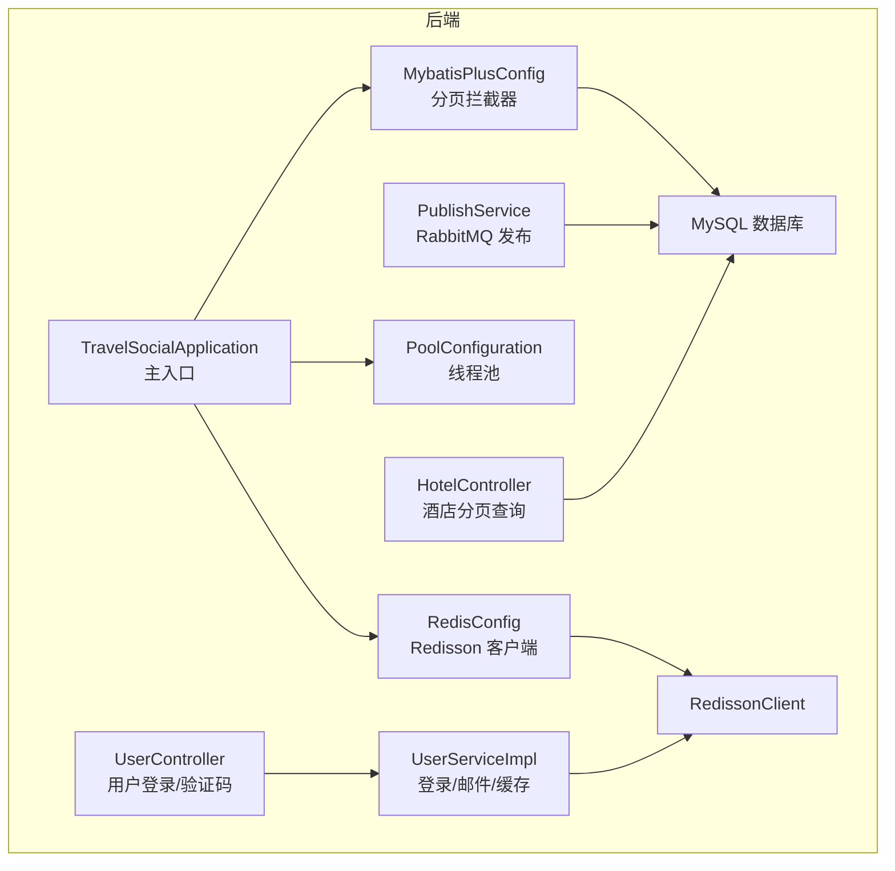
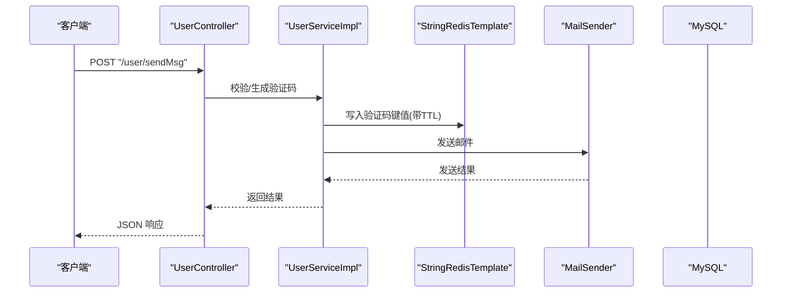
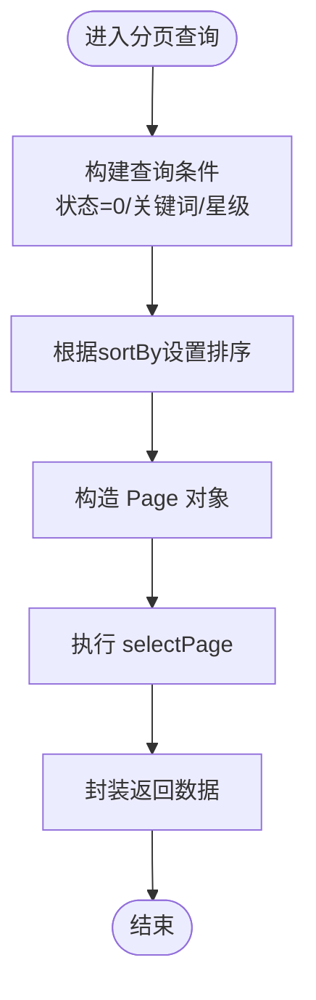
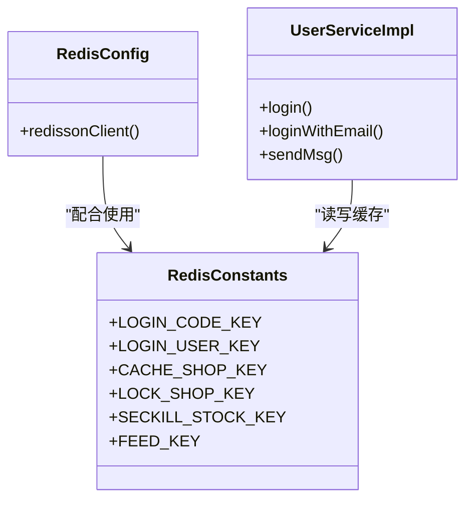
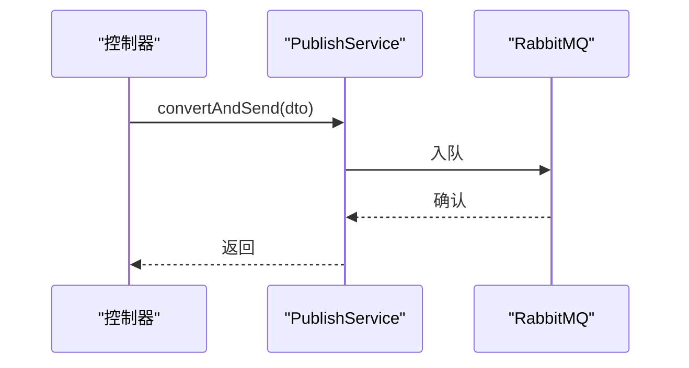
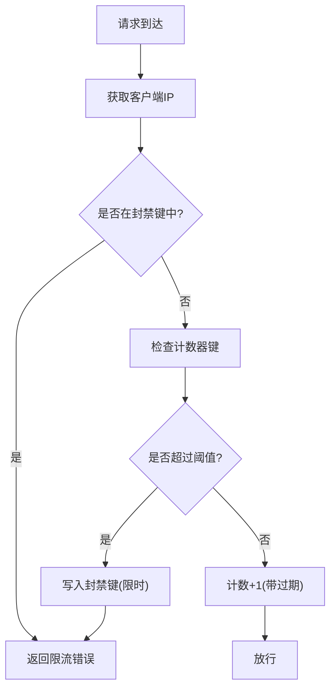
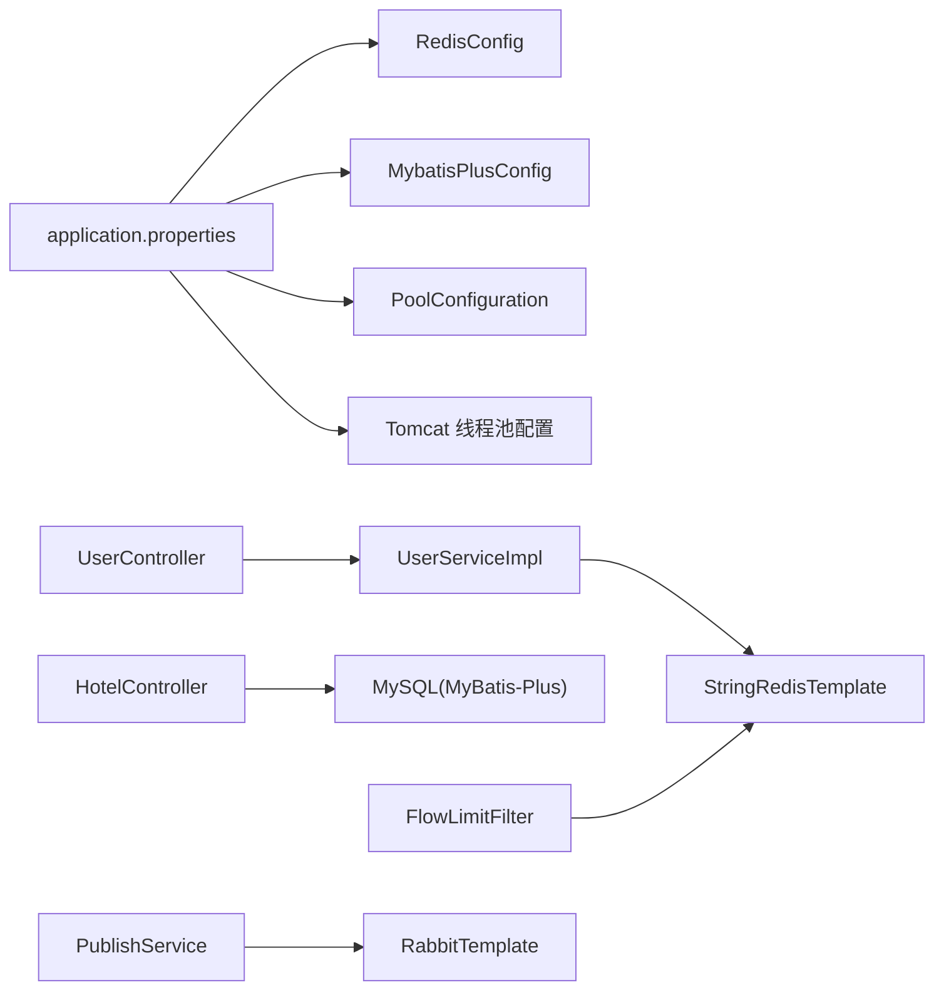

# 性能优化

<cite>
**本文引用的文件**
- [application.properties](file://springboot-travel-social/src/main/resources/application.properties)
- [pom.xml](file://springboot-travel-social/pom.xml)
- [RedisConfig.java](file://springboot-travel-social/src/main/java/com/cxx/config/RedisConfig.java)
- [PoolConfiguration.java](file://springboot-travel-social/src/main/java/com/cxx/threadpool/PoolConfiguration.java)
- [RedisConstants.java](file://springboot-travel-social/src/main/java/com/cxx/utils/RedisConstants.java)
- [MybatisPlusConfig.java](file://springboot-travel-social/src/main/java/com/cxx/config/MybatisPlusConfig.java)
- [CorsFilter.java](file://springboot-travel-social/src/main/java/com/cxx/config/CorsFilter.java)
- [FlowLimitFilter.java](file://springboot-travel-social/src/main/java/com/cxx/filter/FlowLimitFilter.java)
- [SystemConstants.java](file://springboot-travel-social/src/main/java/com/cxx/utils/SystemConstants.java)
- [FlowLimitVO.java](file://springboot-travel-social/src/main/java/com/cxx/vo/FlowLimitVO.java)
- [UserController.java](file://springboot-travel-social/src/main/java/com/cxx/controller/UserController.java)
- [HotelController.java](file://springboot-travel-social/src/main/java/com/cxx/controller/HotelController.java)
- [UserServiceImpl.java](file://springboot-travel-social/src/main/java/com/cxx/service/impl/UserServiceImpl.java)
- [PublishService.java](file://springboot-travel-social/src/main/java/com/cxx/rabbitmq/PublishService.java)
- [LoginInterceptor.java](file://springboot-travel-social/src/main/java/com/cxx/utils/LoginInterceptor.java)
</cite>

## 目录
1. [简介](#简介)
2. [项目结构](#项目结构)
3. [核心组件](#核心组件)
4. [架构总览](#架构总览)
5. [详细组件分析](#详细组件分析)
6. [依赖关系分析](#依赖关系分析)
7. [性能考量与优化建议](#性能考量与优化建议)
8. [故障排查指南](#故障排查指南)
9. [结论](#结论)
10. [附录](#附录)

## 简介
本指南面向后端 Spring Boot 应用与前端 UniApp 的性能优化，覆盖数据库查询优化（索引使用、SQL 优化、分页策略）、缓存策略（Redis 配置、缓存穿透防护、缓存雪崩处理）、线程池配置与异步处理优化；同时给出前端页面渲染、资源加载、组件懒加载、图片压缩与 CDN 使用建议；并提供内存管理、GC 调优、大对象处理策略，以及网络请求优化、API 响应时间优化、并发处理优化的实践要点与性能监控指标与测试方法。

## 项目结构
后端采用 Spring Boot 2.6.13 + MyBatis-Plus 分页插件 + Redisson 客户端 + RabbitMQ 异步队列 + Actuator 监控能力；前端为 UniApp 工程，包含大量页面与组件，适合进行资源与渲染层面的性能优化。

**图表来源**
- [MybatisPlusConfig.java:10-19](file://springboot-travel-social/src/main/java/com/cxx/config/MybatisPlusConfig.java#L10-L19)
- [RedisConfig.java:17-32](file://springboot-travel-social/src/main/java/com/cxx/config/RedisConfig.java#L17-L32)
- [PoolConfiguration.java:11-31](file://springboot-travel-social/src/main/java/com/cxx/threadpool/PoolConfiguration.java#L11-L31)
- [UserController.java:31-136](file://springboot-travel-social/src/main/java/com/cxx/controller/UserController.java#L31-L136)
- [HotelController.java:16-133](file://springboot-travel-social/src/main/java/com/cxx/controller/HotelController.java#L16-L133)
- [UserServiceImpl.java:43-200](file://springboot-travel-social/src/main/java/com/cxx/service/impl/UserServiceImpl.java#L43-L200)
- [PublishService.java:8-28](file://springboot-travel-social/src/main/java/com/cxx/rabbitmq/PublishService.java#L8-L28)

**章节来源**
- [application.properties:1-61](file://springboot-travel-social/src/main/resources/application.properties#L1-L61)
- [pom.xml:1-243](file://springboot-travel-social/pom.xml#L1-L243)

## 核心组件
- 数据库与分页：MyBatis-Plus 全局分页拦截器，统一在 SQL 层面注入分页逻辑，避免业务层重复实现。
- 缓存：Redisson 单机客户端，结合自定义键空间与 TTL 策略，支撑验证码、登录态、热点数据缓存。
- 并发与异步：线程池配置与 Sleuth 集成，RabbitMQ 异步解耦写操作与耗时流程。
- 限流与跨域：基于 Redis 的简单滑动窗口限流，全局 CORS 放通以降低跨域开销。
- 监控：Actuator 自带健康检查与指标暴露，便于接入外部监控平台。

**章节来源**
- [MybatisPlusConfig.java:10-19](file://springboot-travel-social/src/main/java/com/cxx/config/MybatisPlusConfig.java#L10-L19)
- [RedisConfig.java:17-32](file://springboot-travel-social/src/main/java/com/cxx/config/RedisConfig.java#L17-L32)
- [PoolConfiguration.java:11-31](file://springboot-travel-social/src/main/java/com/cxx/threadpool/PoolConfiguration.java#L11-L31)
- [FlowLimitFilter.java:26-71](file://springboot-travel-social/src/main/java/com/cxx/filter/FlowLimitFilter.java#L26-L71)
- [CorsFilter.java:7-28](file://springboot-travel-social/src/main/java/com/cxx/config/CorsFilter.java#L7-L28)
- [pom.xml:36-43](file://springboot-travel-social/pom.xml#L36-L43)

## 架构总览
后端通过控制器接收请求，服务层完成业务与缓存交互，持久层由 MyBatis-Plus 执行分页查询，热点数据走 Redis 缓存，非实时写入通过 RabbitMQ 异步落库。Tomcat 线程池与线程池配置共同承担高并发请求。

**图表来源**
- [UserController.java:42-80](file://springboot-travel-social/src/main/java/com/cxx/controller/UserController.java#L42-L80)
- [UserServiceImpl.java:75-120](file://springboot-travel-social/src/main/java/com/cxx/service/impl/UserServiceImpl.java#L75-L120)
- [application.properties:31-42](file://springboot-travel-social/src/main/resources/application.properties#L31-L42)

## 详细组件分析

### 数据库查询优化（索引、SQL、分页）
- 分页策略：MyBatis-Plus 在启动时注册分页拦截器，所有分页查询自动注入分页参数，避免 N+1 与全表扫描。
- 控制器示例：酒店列表接口支持关键词、星级、排序与分页，配合分页插件减少一次性拉取大量数据。
- 建议：
  - 为高频查询字段建立合适索引（如酒店名称、地址、星级、状态）。
  - 对排序字段建立复合索引，避免排序导致的临时文件与排序开销。
  - 严格控制分页大小，避免超大页码与深度分页。

**图表来源**
- [HotelController.java:27-91](file://springboot-travel-social/src/main/java/com/cxx/controller/HotelController.java#L27-L91)
- [MybatisPlusConfig.java:13-18](file://springboot-travel-social/src/main/java/com/cxx/config/MybatisPlusConfig.java#L13-L18)

**章节来源**
- [HotelController.java:27-91](file://springboot-travel-social/src/main/java/com/cxx/controller/HotelController.java#L27-L91)
- [MybatisPlusConfig.java:10-19](file://springboot-travel-social/src/main/java/com/cxx/config/MybatisPlusConfig.java#L10-L19)

### 缓存策略（Redis 配置、穿透、雪崩）
- Redis 配置：使用 Redisson 单机模式，集中式配置地址，便于横向扩展。
- 键空间与 TTL：验证码、登录态、热点商品等使用统一前缀与过期时间，避免脏数据。
- 缓存穿透：对空结果也做短 TTL 缓存，防止恶意高频空命中。
- 缓存雪崩：热点键设置随机过期时间，避免同一时刻大面积失效；后台预热热点数据。
- 登录态：登录成功后将用户信息写入哈希，并设置较短 Token 过期时间，降低长期占用。

**图表来源**
- [RedisConfig.java:17-32](file://springboot-travel-social/src/main/java/com/cxx/config/RedisConfig.java#L17-L32)
- [RedisConstants.java:3-29](file://springboot-travel-social/src/main/java/com/cxx/utils/RedisConstants.java#L3-L29)
- [UserServiceImpl.java:75-162](file://springboot-travel-social/src/main/java/com/cxx/service/impl/UserServiceImpl.java#L75-L162)

**章节来源**
- [RedisConfig.java:17-32](file://springboot-travel-social/src/main/java/com/cxx/config/RedisConfig.java#L17-L32)
- [RedisConstants.java:3-29](file://springboot-travel-social/src/main/java/com/cxx/utils/RedisConstants.java#L3-L29)
- [UserServiceImpl.java:75-162](file://springboot-travel-social/src/main/java/com/cxx/service/impl/UserServiceImpl.java#L75-L162)

### 线程池配置与异步处理
- 线程池：核心线程 10，最大 50，队列容量 100，拒绝策略 AbortPolicy，关闭时等待任务完成。
- 异步：RabbitMQ 发布消息用于异步通知与削峰填谷，避免阻塞主线程。
- 建议：对 IO 密集型任务启用异步；对 CPU 密集型任务避免放入默认线程池；结合 Sleuth 追踪异步链路。

**图表来源**
- [PoolConfiguration.java:15-30](file://springboot-travel-social/src/main/java/com/cxx/threadpool/PoolConfiguration.java#L15-L30)
- [PublishService.java:13-26](file://springboot-travel-social/src/main/java/com/cxx/rabbitmq/PublishService.java#L13-L26)

**章节来源**
- [PoolConfiguration.java:11-31](file://springboot-travel-social/src/main/java/com/cxx/threadpool/PoolConfiguration.java#L11-L31)
- [PublishService.java:8-28](file://springboot-travel-social/src/main/java/com/cxx/rabbitmq/PublishService.java#L8-L28)

### 接口限流与跨域
- 限流：基于 Redis 的滑动窗口计数器，超过阈值 IP 暂时封禁，防止刷单与攻击。
- 跨域：全局放通允许凭据、任意源、任意头与方法，缩短浏览器预检成本。
- 建议：对不同接口设置差异化阈值；生产环境建议白名单 + 更细粒度限流。

**图表来源**
- [FlowLimitFilter.java:30-70](file://springboot-travel-social/src/main/java/com/cxx/filter/FlowLimitFilter.java#L30-L70)
- [SystemConstants.java:5-10](file://springboot-travel-social/src/main/java/com/cxx/utils/SystemConstants.java#L5-L10)

**章节来源**
- [FlowLimitFilter.java:26-71](file://springboot-travel-social/src/main/java/com/cxx/filter/FlowLimitFilter.java#L26-L71)
- [SystemConstants.java:3-24](file://springboot-travel-social/src/main/java/com/cxx/utils/SystemConstants.java#L3-L24)
- [CorsFilter.java:7-28](file://springboot-travel-social/src/main/java/com/cxx/config/CorsFilter.java#L7-L28)

### 前端性能优化（UniApp）
- 页面渲染：减少不必要的 setData 与深层数据更新；使用虚拟列表渲染长列表；合理拆分页面与组件。
- 资源加载：开启 gzip/br 压缩；静态资源走 CDN；按需引入组件与样式。
- 组件懒加载：路由级懒加载与图片懒加载；减少首屏体积。
- 图片压缩：上传前压缩，后端 OSS 或 CDN 提供多规格图；使用 WebP/JPEG2000。
- CDN 使用：将静态资源与第三方库指向就近 CDN，降低首字节时间。

[本节为通用前端优化建议，不直接分析具体文件]

## 依赖关系分析

**图表来源**
- [application.properties:1-61](file://springboot-travel-social/src/main/resources/application.properties#L1-L61)
- [RedisConfig.java:17-32](file://springboot-travel-social/src/main/java/com/cxx/config/RedisConfig.java#L17-L32)
- [MybatisPlusConfig.java:10-19](file://springboot-travel-social/src/main/java/com/cxx/config/MybatisPlusConfig.java#L10-L19)
- [PoolConfiguration.java:11-31](file://springboot-travel-social/src/main/java/com/cxx/threadpool/PoolConfiguration.java#L11-L31)
- [UserController.java:31-136](file://springboot-travel-social/src/main/java/com/cxx/controller/UserController.java#L31-L136)
- [UserServiceImpl.java:43-200](file://springboot-travel-social/src/main/java/com/cxx/service/impl/UserServiceImpl.java#L43-L200)
- [HotelController.java:16-133](file://springboot-travel-social/src/main/java/com/cxx/controller/HotelController.java#L16-L133)
- [FlowLimitFilter.java:26-71](file://springboot-travel-social/src/main/java/com/cxx/filter/FlowLimitFilter.java#L26-L71)
- [PublishService.java:8-28](file://springboot-travel-social/src/main/java/com/cxx/rabbitmq/PublishService.java#L8-L28)

**章节来源**
- [application.properties:1-61](file://springboot-travel-social/src/main/resources/application.properties#L1-L61)
- [pom.xml:16-182](file://springboot-travel-social/pom.xml#L16-L182)

## 性能考量与优化建议

### 数据库查询优化
- 索引使用：为高频过滤与排序字段建立索引；避免在索引列上使用函数或隐式转换。
- SQL 优化：避免 SELECT *；仅选择必要字段；使用 EXPLAIN 分析慢查询。
- 分页策略：限制最大页码与每页数量；对深度分页使用“游标翻页”或“基于主键”的高效分页。

**章节来源**
- [HotelController.java:27-91](file://springboot-travel-social/src/main/java/com/cxx/controller/HotelController.java#L27-L91)
- [MybatisPlusConfig.java:10-19](file://springboot-travel-social/src/main/java/com/cxx/config/MybatisPlusConfig.java#L10-L19)

### 缓存策略
- 配置：Redisson 单机部署，连接池参数可按并发调整。
- 穿透防护：空值缓存 + 短 TTL；黑名单封禁异常 IP。
- 雪崩处理：热点键加随机过期；后台定时刷新；多级缓存（本地缓存 + Redis）。
- 命中率优化：区分冷热数据；对热点键设置更长 TTL；定期清理无用键。

**章节来源**
- [RedisConfig.java:17-32](file://springboot-travel-social/src/main/java/com/cxx/config/RedisConfig.java#L17-L32)
- [FlowLimitFilter.java:26-71](file://springboot-travel-social/src/main/java/com/cxx/filter/FlowLimitFilter.java#L26-L71)
- [SystemConstants.java:5-10](file://springboot-travel-social/src/main/java/com/cxx/utils/SystemConstants.java#L5-L10)

### 线程池与异步处理
- 线程池：核心/最大线程与队列容量按业务特征调优；拒绝策略根据 SLA 选择丢弃或饱和。
- 异步：将耗时写操作、通知、日志上报异步化；结合消息队列削峰填谷。
- 链路追踪：集成 Sleuth，定位慢调用与阻塞点。

**章节来源**
- [PoolConfiguration.java:11-31](file://springboot-travel-social/src/main/java/com/cxx/threadpool/PoolConfiguration.java#L11-L31)
- [PublishService.java:8-28](file://springboot-travel-social/src/main/java/com/cxx/rabbitmq/PublishService.java#L8-L28)

### 网络与 API 优化
- 超时与重试：合理设置 HTTP 客户端超时与指数退避重试。
- 压缩：开启 GZIP/BR；对文本类响应优先。
- 并发：连接池复用；批量请求合并；服务端限流与熔断。

**章节来源**
- [application.properties:1-61](file://springboot-travel-social/src/main/resources/application.properties#L1-L61)

### 内存管理与 GC 调优
- 大对象处理：避免在热路径创建大对象；使用对象池或重用结构。
- GC 调优：选择合适的 GC 算法；控制新生代/老年代比例；观察 Full GC 频率与停顿。
- 监控：结合 JVM 监控工具与容器指标，识别内存泄漏与抖动。

**章节来源**
- [application.properties:44-46](file://springboot-travel-social/src/main/resources/application.properties#L44-L46)

### 前端性能优化（UniApp）
- 渲染优化：减少 setData 次数；使用虚拟滚动；组件按需加载。
- 资源优化：CDN 加速；图片压缩与多规格；JS/CSS 拆分与懒加载。
- 网络优化：HTTP/2 复用；预连接；离线缓存策略。

[本节为通用前端优化建议，不直接分析具体文件]

## 故障排查指南
- 登录验证码异常：检查 Redis 键空间与 TTL；确认邮件发送组件可用性。
- 接口被限流：核对限流阈值与封禁键；排查是否存在恶意刷单。
- 分页数据异常：确认分页参数边界；检查排序字段是否建立索引。
- 线程池积压：查看队列长度与拒绝策略触发情况；评估任务类型与线程数。
- 缓存穿透/击穿：验证空值缓存与热点键预热策略是否生效。

**章节来源**
- [UserServiceImpl.java:75-120](file://springboot-travel-social/src/main/java/com/cxx/service/impl/UserServiceImpl.java#L75-L120)
- [FlowLimitFilter.java:26-71](file://springboot-travel-social/src/main/java/com/cxx/filter/FlowLimitFilter.java#L26-L71)
- [HotelController.java:27-91](file://springboot-travel-social/src/main/java/com/cxx/controller/HotelController.java#L27-L91)
- [PoolConfiguration.java:11-31](file://springboot-travel-social/src/main/java/com/cxx/threadpool/PoolConfiguration.java#L11-L31)

## 结论
通过分页拦截器、Redis 缓存与限流、线程池与异步队列的协同，后端可在高并发场景下保持稳定与低延迟。前端侧应聚焦于资源与渲染优化，结合 CDN 与懒加载提升首屏体验。配合完善的监控与测试体系，持续迭代性能指标，确保系统在增长中保持高性能与高可用。

## 附录

### 性能监控指标
- 后端：请求量、错误率、P95/P99 延迟、线程池队列长度、Redis 命中率、数据库慢查询、GC 次数与停顿、内存使用率。
- 前端：首屏时间、可交互时间、资源体积与加载时长、白屏时间、二次打开速度。

[本节为通用指标建议，不直接分析具体文件]

### 性能测试方法
- 压力测试：JMeter/Locust/Grinder，模拟峰值并发与混合场景。
- 端到端测试：基于真实业务流程的自动化脚本，关注关键路径。
- A/B 实验：灰度发布对比优化前后差异。
- 持续监控：接入 APM/日志/指标平台，建立告警与回归基线。

[本节为通用测试建议，不直接分析具体文件]