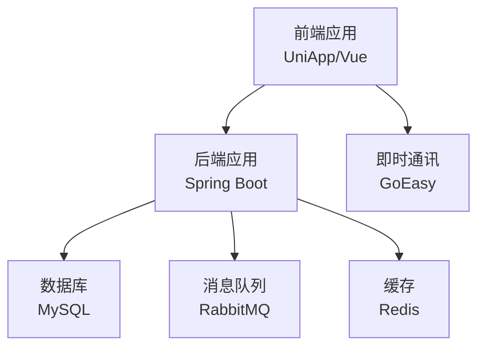
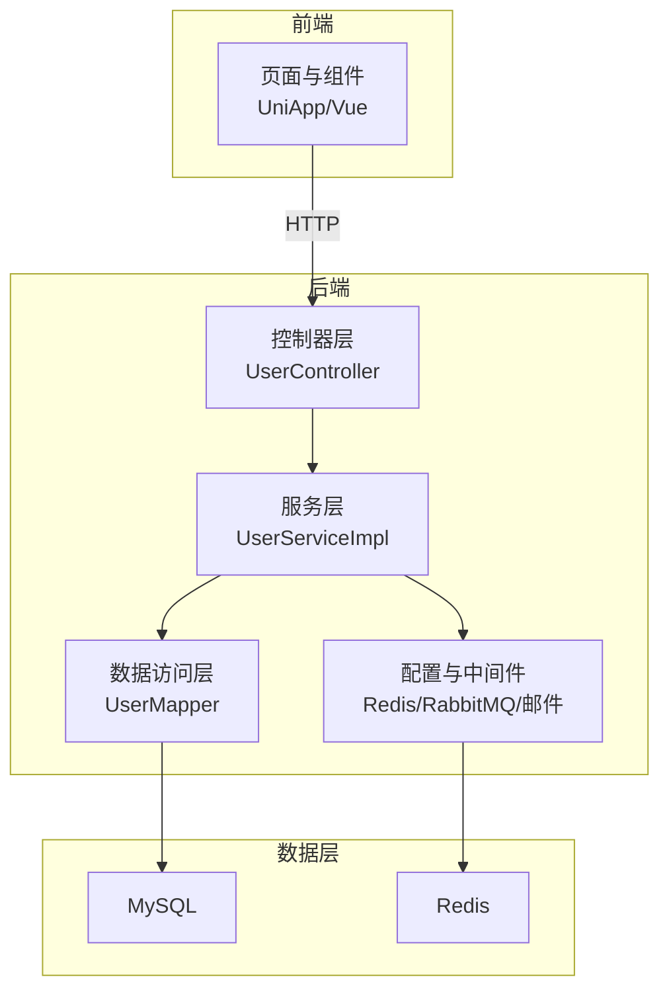
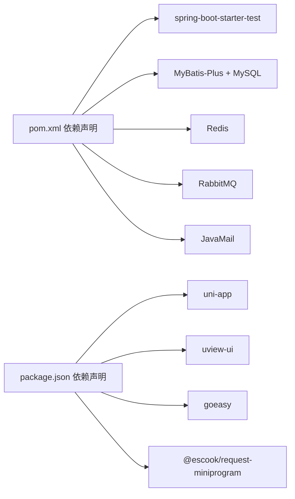

# 测试规范

<cite>
**本文引用的文件**
- [springboot-travel-social/pom.xml](file://springboot-travel-social/pom.xml)
- [springboot-travel-social/src/main/resources/application.properties](file://springboot-travel-social/src/main/resources/application.properties)
- [springboot-travel-social/src/main/java/com/cxx/controller/UserController.java](file://springboot-travel-social/src/main/java/com/cxx/controller/UserController.java)
- [springboot-travel-social/src/main/java/com/cxx/service/impl/UserServiceImpl.java](file://springboot-travel-social/src/main/java/com/cxx/service/impl/UserServiceImpl.java)
- [springboot-travel-social/src/main/java/com/cxx/mapper/UserMapper.java](file://springboot-travel-social/src/main/java/com/cxx/mapper/UserMapper.java)
- [springboot-travel-social/src/main/resources/sql/insurance_order.sql](file://springboot-travel-social/src/main/resources/sql/insurance_order.sql)
- [springboot-travel-social/README.md](file://springboot-travel-social/README.md)
- [uniapp-travel-social/package.json](file://uniapp-travel-social/package.json)
- [uniapp-travel-social/main.js](file://uniapp-travel-social/main.js)
</cite>

## 目录
1. [引言](#引言)
2. [项目结构](#项目结构)
3. [核心组件](#核心组件)
4. [架构总览](#架构总览)
5. [详细组件分析](#详细组件分析)
6. [依赖分析](#依赖分析)
7. [性能考虑](#性能考虑)
8. [故障排查指南](#故障排查指南)
9. [结论](#结论)
10. [附录](#附录)

## 引言
本测试规范旨在为“旅游攻略社交小程序”项目提供统一的质量保证标准，覆盖后端（Spring Boot）单元测试与集成测试、前端（UniApp + Vue）组件测试、测试覆盖率要求、持续集成中的测试执行策略、性能与压力测试方法，以及测试数据管理与测试环境配置。文档以仓库现有依赖与代码结构为基础，结合最佳实践给出可操作的规范。

## 项目结构
项目由两部分组成：
- 后端 Spring Boot 工程：提供 REST API、业务服务、数据访问层与配置。
- 前端 UniApp 工程：提供小程序端界面与交互，通过 HTTP 请求调用后端接口。

图示来源
- [springboot-travel-social/src/main/resources/application.properties:1-61](file://springboot-travel-social/src/main/resources/application.properties#L1-L61)
- [uniapp-travel-social/main.js:17-81](file://uniapp-travel-social/main.js#L17-L81)

章节来源
- [springboot-travel-social/README.md:1-38](file://springboot-travel-social/README.md#L1-L38)
- [springboot-travel-social/src/main/resources/application.properties:1-61](file://springboot-travel-social/src/main/resources/application.properties#L1-L61)
- [uniapp-travel-social/package.json:15-25](file://uniapp-travel-social/package.json#L15-L25)

## 核心组件
- 控制器层：负责接收请求、参数校验、调用服务层、返回响应。
- 服务层：实现业务逻辑、事务控制、与外部组件交互（邮件、缓存等）。
- 数据访问层：MyBatis-Plus Mapper 接口，提供基础 CRUD 与自定义 SQL。
- 配置与基础设施：数据库连接、Redis、RabbitMQ、邮件、日志等。

章节来源
- [springboot-travel-social/src/main/java/com/cxx/controller/UserController.java:31-136](file://springboot-travel-social/src/main/java/com/cxx/controller/UserController.java#L31-L136)
- [springboot-travel-social/src/main/java/com/cxx/service/impl/UserServiceImpl.java:43-268](file://springboot-travel-social/src/main/java/com/cxx/service/impl/UserServiceImpl.java#L43-L268)
- [springboot-travel-social/src/main/java/com/cxx/mapper/UserMapper.java:17-22](file://springboot-travel-social/src/main/java/com/cxx/mapper/UserMapper.java#L17-L22)

## 架构总览
后端采用分层架构，前端通过 HTTP 与后端交互；消息与缓存用于异步处理与会话存储；数据库承载持久化数据。

图示来源
- [springboot-travel-social/src/main/java/com/cxx/controller/UserController.java:31-136](file://springboot-travel-social/src/main/java/com/cxx/controller/UserController.java#L31-L136)
- [springboot-travel-social/src/main/java/com/cxx/service/impl/UserServiceImpl.java:43-268](file://springboot-travel-social/src/main/java/com/cxx/service/impl/UserServiceImpl.java#L43-L268)
- [springboot-travel-social/src/main/java/com/cxx/mapper/UserMapper.java:17-22](file://springboot-travel-social/src/main/java/com/cxx/mapper/UserMapper.java#L17-L22)
- [springboot-travel-social/src/main/resources/application.properties:1-61](file://springboot-travel-social/src/main/resources/application.properties#L1-L61)

## 详细组件分析

### 单元测试规范（后端）
- 测试框架与断言
  - 使用 Spring Boot Starter Test 提供的 JUnit 与断言库。
  - 断言策略建议：优先使用语义明确的断言方法，结合响应体字段与状态码进行验证。
- Mock 与依赖注入
  - 使用 Mockito 对外部依赖（如 Redis、邮件发送器、Mapper）进行模拟，隔离被测方法。
  - 使用 @ExtendWith(MockitoExtension.class) 或 @MockitoSettings 注解启用 Mockito。
- 测试用例设计原则
  - 每个方法至少覆盖正常路径与边界条件；对异常分支与空值场景进行重点覆盖。
  - 使用参数化测试（@ParameterizedTest）覆盖多组输入。
  - 保持测试独立性，避免共享状态；必要时使用 @BeforeEach/@AfterEach 清理。
- 示例参考路径
  - 控制器层：[UserController 登录与验证码接口:42-93](file://springboot-travel-social/src/main/java/com/cxx/controller/UserController.java#L42-L93)
  - 服务层：[UserServiceImpl 登录与发送验证码逻辑:75-120](file://springboot-travel-social/src/main/java/com/cxx/service/impl/UserServiceImpl.java#L75-L120)

章节来源
- [springboot-travel-social/pom.xml:177-181](file://springboot-travel-social/pom.xml#L177-L181)
- [springboot-travel-social/src/main/java/com/cxx/controller/UserController.java:31-136](file://springboot-travel-social/src/main/java/com/cxx/controller/UserController.java#L31-L136)
- [springboot-travel-social/src/main/java/com/cxx/service/impl/UserServiceImpl.java:43-268](file://springboot-travel-social/src/main/java/com/cxx/service/impl/UserServiceImpl.java#L43-L268)

### 集成测试规范（后端）
- Spring Boot 测试注解
  - 使用 @SpringBootTest 启动完整上下文；使用 @AutoConfigureTestDatabase 关闭嵌入式数据库。
  - 使用 @Import 仅导入必要配置，减少启动开销。
- 数据库测试策略
  - 使用 @Sql 或 Flyway 初始化测试数据；对关键表（如 insurance_order）进行结构与索引验证。
  - 建议使用事务回滚（@Transactional + @Rollback）或测试专用库隔离。
- API 测试方法
  - 使用 WebMvcTest 针对控制器进行轻量级测试；使用 @WebMvcTest(UserController.class)。
  - 使用 TestRestTemplate 或 MockMvc 执行请求，断言响应体与状态码。
- 示例参考路径
  - 表结构定义：[insurance_order 表结构:1-18](file://springboot-travel-social/src/main/resources/sql/insurance_order.sql#L1-L18)

章节来源
- [springboot-travel-social/pom.xml:177-181](file://springboot-travel-social/pom.xml#L177-L181)
- [springboot-travel-social/src/main/resources/sql/insurance_order.sql:1-18](file://springboot-travel-social/src/main/resources/sql/insurance_order.sql#L1-L18)

### 前端组件测试规范（UniApp/Vue）
- 测试工具与环境
  - 使用 @dcloudio/uni-app 生态与 Vue 组件测试能力；建议引入 Vue Test Utils。
- 组件快照测试
  - 对静态渲染结果进行快照对比，确保 UI 变更受控。
- 用户交互测试
  - 使用事件触发模拟用户行为（点击、输入），断言状态变化与副作用。
- 端到端测试
  - 使用 uni-app 的真机调试与自动化方案，覆盖关键流程（登录、下单、聊天）。
- 示例参考路径
  - 前端依赖与脚本：[package.json:15-25](file://uniapp-travel-social/package.json#L15-L25)
  - 全局 HTTP 配置与拦截器：[main.js:17-56](file://uniapp-travel-social/main.js#L17-L56)

章节来源
- [uniapp-travel-social/package.json:15-25](file://uniapp-travel-social/package.json#L15-L25)
- [uniapp-travel-social/main.js:17-56](file://uniapp-travel-social/main.js#L17-L56)

### 性能测试与压力测试
- 性能测试
  - 使用 JMeter/Postman/Newman 对关键接口（登录、下单、查询）进行吞吐与延迟测试。
  - 关注 Redis 缓存命中率、数据库慢查询与线程池饱和度。
- 压力测试
  - 使用 Gatling/JMeter 构造并发场景，逐步提升负载，观察系统瓶颈点（CPU、内存、数据库连接池）。
- 结果与回归
  - 将性能指标纳入 CI，设置阈值告警；对热点接口进行基准回归。

[本节为通用指导，无需特定文件引用]

### 测试覆盖率要求
- 单元测试覆盖率
  - 业务核心方法（服务层与控制器关键分支）达到 80%+；关键异常路径 100%。
- 集成测试覆盖率
  - 关键 API 与数据流 100%；数据库变更与外部依赖交互 100%。
- 前端覆盖率
  - 组件逻辑与交互路径 70%+；关键业务页面 100%。
- 工具建议
  - 后端使用 JaCoCo；前端使用 Istanbul/NYC；CI 中生成报告并设置阈值。

[本节为通用指导，无需特定文件引用]

### 持续集成中的测试执行策略
- 触发策略
  - PR/MR 触发基础测试；主干推送触发全量测试与覆盖率上报。
- 并行执行
  - 将测试拆分为单元、集成、前端三类任务并行执行，缩短反馈周期。
- 报告与门禁
  - 失败即阻断；覆盖率低于阈值禁止合并；性能回归阈值告警。
- 环境与资源
  - 使用容器化测试环境（MySQL、Redis、RabbitMQ），确保一致性。

[本节为通用指导，无需特定文件引用]

## 依赖分析
- 后端依赖要点
  - 测试依赖：spring-boot-starter-test（含 JUnit、AssertJ、Mockito）。
  - 数据库与缓存：MySQL Connector、MyBatis-Plus、Redis。
  - 消息与邮件：RabbitMQ、JavaMail Sender。
- 前端依赖要点
  - uni-app、uview-ui、goeasy、请求封装库。

图示来源
- [springboot-travel-social/pom.xml:177-181](file://springboot-travel-social/pom.xml#L177-L181)
- [uniapp-travel-social/package.json:15-25](file://uniapp-travel-social/package.json#L15-L25)

章节来源
- [springboot-travel-social/pom.xml:177-181](file://springboot-travel-social/pom.xml#L177-L181)
- [uniapp-travel-social/package.json:15-25](file://uniapp-travel-social/package.json#L15-L25)

## 性能考虑
- 接口性能
  - 对高频接口（登录、列表查询）进行限流与降级预案；缓存热点数据。
- 数据库性能
  - 为关键查询建立索引；避免 N+1 查询；合理分页。
- 缓存策略
  - 使用 Redis 缓存用户会话与热点数据；设置合理过期策略。
- 前端性能
  - 图片懒加载、组件按需加载；减少网络请求次数。

[本节为通用指导，无需特定文件引用]

## 故障排查指南
- 常见问题定位
  - 控制器层：检查请求参数、状态码与响应体；关注异常捕获与全局异常处理。
  - 服务层：核对事务边界、外部依赖可用性（邮件、缓存、消息）。
  - 数据层：确认 Mapper 方法签名与 SQL 映射；检查实体字段与表结构一致性。
- 日志与监控
  - 开启必要的日志级别；结合链路追踪与指标监控定位问题。
- 前端问题
  - 检查全局 HTTP 拦截器与 Token 注入；确认接口域名与跨域配置。

章节来源
- [springboot-travel-social/src/main/java/com/cxx/controller/UserController.java:31-136](file://springboot-travel-social/src/main/java/com/cxx/controller/UserController.java#L31-L136)
- [springboot-travel-social/src/main/java/com/cxx/service/impl/UserServiceImpl.java:43-268](file://springboot-travel-social/src/main/java/com/cxx/service/impl/UserServiceImpl.java#L43-L268)
- [springboot-travel-social/src/main/resources/application.properties:1-61](file://springboot-travel-social/src/main/resources/application.properties#L1-L61)
- [uniapp-travel-social/main.js:17-56](file://uniapp-travel-social/main.js#L17-L56)

## 结论
本规范以项目现有技术栈为基础，给出了从单元测试、集成测试到前端组件测试的全流程质量保障方法，并明确了覆盖率与持续集成策略。建议在开发过程中严格执行，结合性能与压力测试形成闭环，确保系统稳定性与可维护性。

## 附录
- 测试数据管理
  - 使用 SQL 初始化脚本与迁移工具（Flyway/Liquibase）管理测试数据版本。
- 测试环境配置
  - 使用独立的测试数据库与缓存实例；通过环境变量切换配置；确保测试环境与生产隔离。

[本节为通用指导，无需特定文件引用]