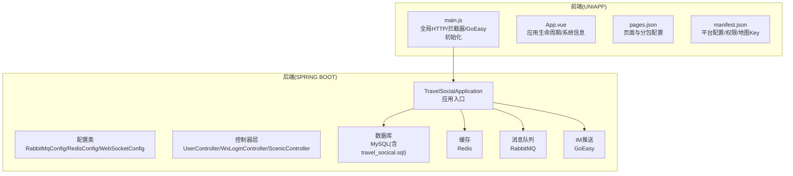
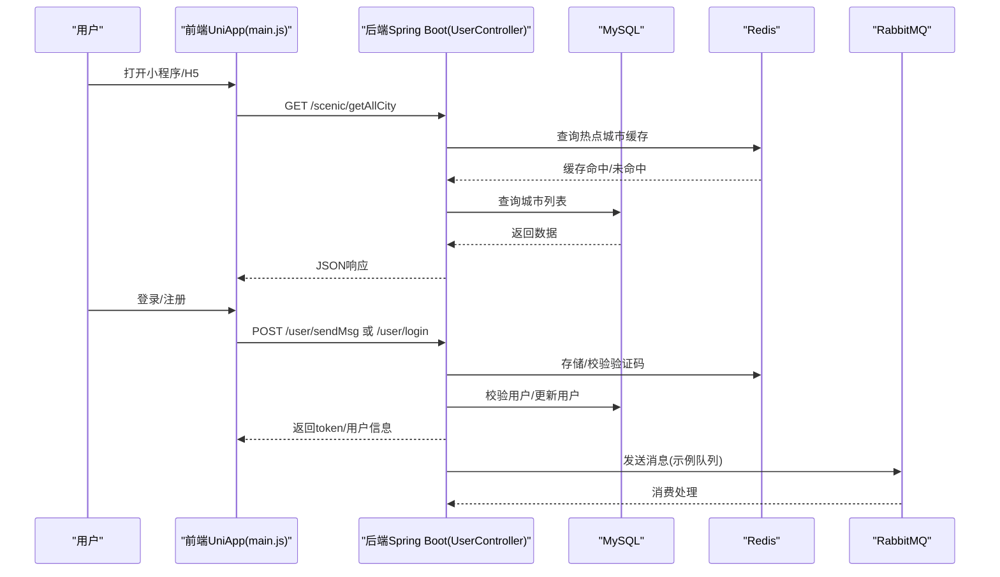
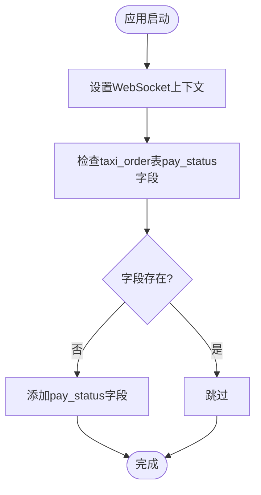
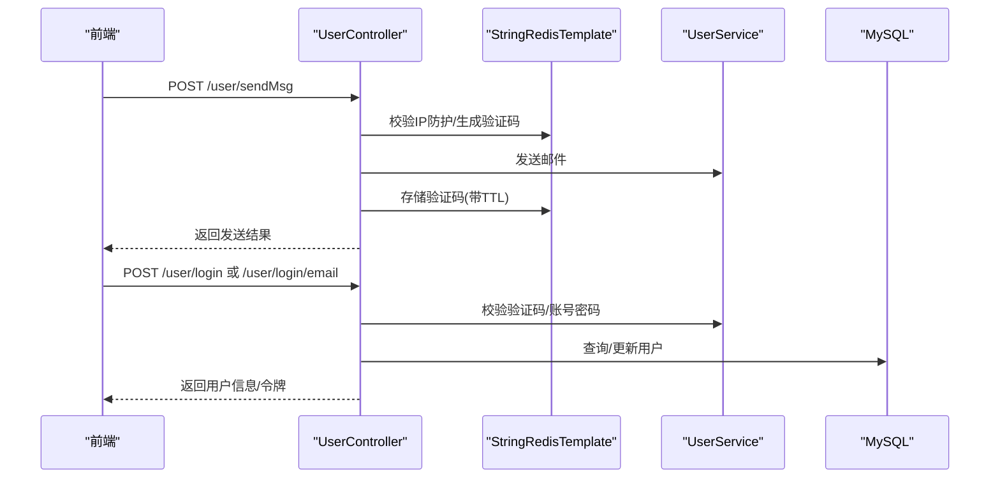
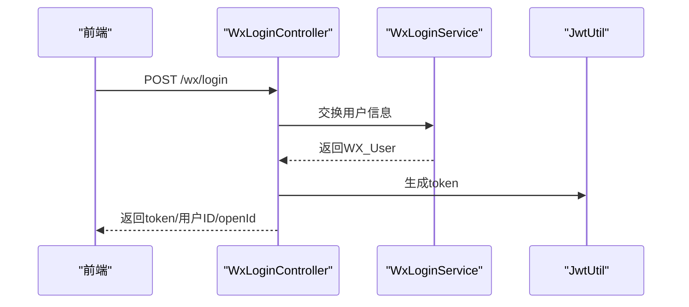
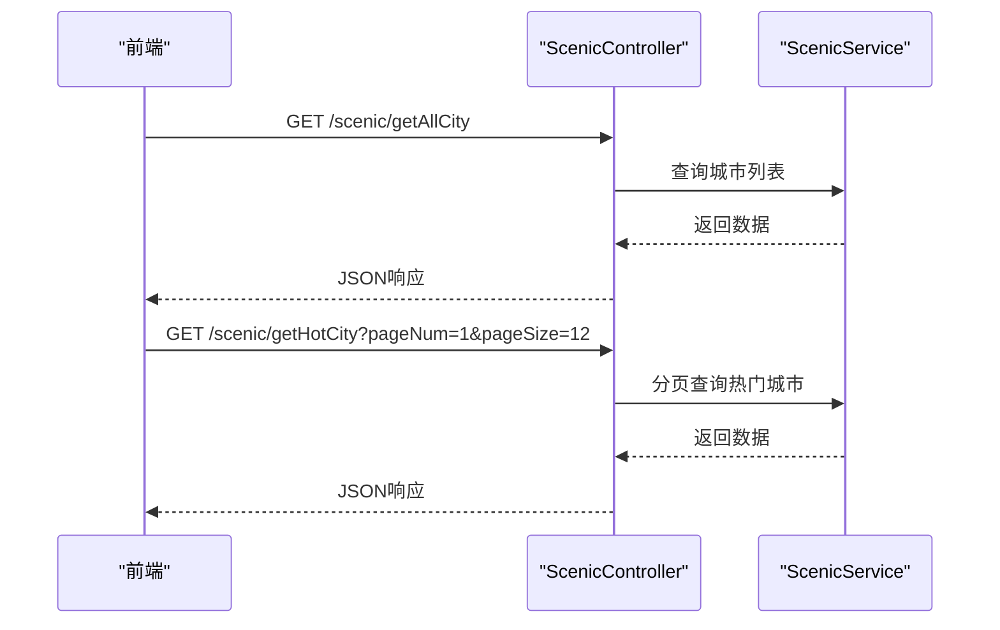
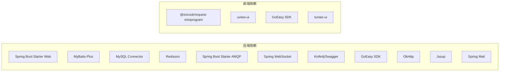

# 快速开始

<cite>
**本文引用的文件**
- [springboot-travel-social/README.md](file://springboot-travel-social/README.md)
- [springboot-travel-social/pom.xml](file://springboot-travel-social/pom.xml)
- [springboot-travel-social/src/main/resources/application.properties](file://springboot-travel-social/src/main/resources/application.properties)
- [springboot-travel-social/src/main/java/com/cxx/TravelSocialApplication.java](file://springboot-travel-social/src/main/java/com/cxx/TravelSocialApplication.java)
- [springboot-travel-social/Dockerfile](file://springboot-travel-social/Dockerfile)
- [springboot-travel-social/src/main/java/com/cxx/config/RabbitMqConfig.java](file://springboot-travel-social/src/main/java/com/cxx/config/RabbitMqConfig.java)
- [springboot-travel-social/src/main/java/com/cxx/config/RedisConfig.java](file://springboot-travel-social/src/main/java/com/cxx/config/RedisConfig.java)
- [springboot-travel-social/src/main/java/com/cxx/config/WebSocketConfig.java](file://springboot-travel-social/src/main/java/com/cxx/config/WebSocketConfig.java)
- [springboot-travel-social/src/main/java/com/cxx/controller/UserController.java](file://springboot-travel-social/src/main/java/com/cxx/controller/UserController.java)
- [springboot-travel-social/src/main/java/com/cxx/controller/WxLoginController.java](file://springboot-travel-social/src/main/java/com/cxx/controller/WxLoginController.java)
- [springboot-travel-social/src/main/java/com/cxx/controller/ScenicController.java](file://springboot-travel-social/src/main/java/com/cxx/controller/ScenicController.java)
- [uniapp-travel-social/main.js](file://uniapp-travel-social/main.js)
- [uniapp-travel-social/App.vue](file://uniapp-travel-social/App.vue)
- [uniapp-travel-social/pages.json](file://uniapp-travel-social/pages.json)
- [uniapp-travel-social/manifest.json](file://uniapp-travel-social/manifest.json)
- [travel_socical.sql](file://travel_socical.sql)
</cite>

## 目录
1. [简介](#简介)
2. [项目结构](#项目结构)
3. [核心组件](#核心组件)
4. [架构总览](#架构总览)
5. [详细组件分析](#详细组件分析)
6. [依赖分析](#依赖分析)
7. [性能考虑](#性能考虑)
8. [故障排查指南](#故障排查指南)
9. [结论](#结论)
10. [附录](#附录)

## 简介
本指南面向首次接触“旅游攻略社交小程序”项目的开发者，提供从环境准备、项目克隆、依赖安装、数据库初始化，到本地运行与API测试的全流程说明。项目后端基于 Spring Boot，前端基于 UniApp，集成 Redis、RabbitMQ、MySQL、WebSocket、IM 推送等能力，覆盖用户登录、景点查询、游记发布、消息聊天、订单管理等核心业务。

## 项目结构
项目采用前后端分离架构，后端为 Spring Boot 应用，前端为 UniApp 小程序/H5 工程。关键目录与职责如下：
- 后端模块 springboot-travel-social：Spring Boot 应用、配置、控制器、服务、实体、Mapper、工具类等
- 前端模块 uniapp-travel-social：页面、组件、样式、路由、全局配置、第三方 SDK 集成等
- 数据库脚本 travel_socical.sql：包含景点、游记、用户、订单等基础表结构与示例数据

图表来源
- [springboot-travel-social/src/main/java/com/cxx/TravelSocialApplication.java:16-25](file://springboot-travel-social/src/main/java/com/cxx/TravelSocialApplication.java#L16-L25)
- [springboot-travel-social/src/main/java/com/cxx/config/RabbitMqConfig.java:16-31](file://springboot-travel-social/src/main/java/com/cxx/config/RabbitMqConfig.java#L16-L31)
- [springboot-travel-social/src/main/java/com/cxx/config/RedisConfig.java:17-32](file://springboot-travel-social/src/main/java/com/cxx/config/RedisConfig.java#L17-L32)
- [springboot-travel-social/src/main/java/com/cxx/config/WebSocketConfig.java:7-13](file://springboot-travel-social/src/main/java/com/cxx/config/WebSocketConfig.java#L7-L13)
- [uniapp-travel-social/main.js:1-118](file://uniapp-travel-social/main.js#L1-L118)
- [uniapp-travel-social/App.vue:1-93](file://uniapp-travel-social/App.vue#L1-L93)
- [uniapp-travel-social/pages.json:1-814](file://uniapp-travel-social/pages.json#L1-L814)
- [uniapp-travel-social/manifest.json:1-127](file://uniapp-travel-social/manifest.json#L1-L127)

章节来源
- [springboot-travel-social/README.md:1-38](file://springboot-travel-social/README.md#L1-L38)
- [springboot-travel-social/pom.xml:1-243](file://springboot-travel-social/pom.xml#L1-L243)
- [uniapp-travel-social/pages.json:1-814](file://uniapp-travel-social/pages.json#L1-L814)

## 核心组件
- 后端应用入口与启动：应用启动时初始化 WebSocket 上下文，确保 WebSocket 服务可用
- 配置类
  - RabbitMQ：声明持久化队列（remove.queue/agree.queue/refuse.queue）
  - Redis：基于 Redisson 的单机客户端配置
  - WebSocket：开启标准的 ServerEndpointExporter
- 控制器示例
  - 用户相关：验证码发送、邮箱登录、账号密码登录、头像/昵称/密码更新等
  - 微信登录：换取用户信息并签发 JWT
  - 景点相关：城市列表、热门城市分页查询
- 前端
  - 全局 HTTP 基础地址指向后端 8082 端口，统一注入 token
  - 初始化 GoEasy IM 并处理点击通知跳转
  - 页面与分包配置、平台权限与地图 Key

章节来源
- [springboot-travel-social/src/main/java/com/cxx/TravelSocialApplication.java:16-50](file://springboot-travel-social/src/main/java/com/cxx/TravelSocialApplication.java#L16-L50)
- [springboot-travel-social/src/main/java/com/cxx/config/RabbitMqConfig.java:16-31](file://springboot-travel-social/src/main/java/com/cxx/config/RabbitMqConfig.java#L16-L31)
- [springboot-travel-social/src/main/java/com/cxx/config/RedisConfig.java:17-32](file://springboot-travel-social/src/main/java/com/cxx/config/RedisConfig.java#L17-L32)
- [springboot-travel-social/src/main/java/com/cxx/config/WebSocketConfig.java:7-13](file://springboot-travel-social/src/main/java/com/cxx/config/WebSocketConfig.java#L7-L13)
- [springboot-travel-social/src/main/java/com/cxx/controller/UserController.java:31-136](file://springboot-travel-social/src/main/java/com/cxx/controller/UserController.java#L31-L136)
- [springboot-travel-social/src/main/java/com/cxx/controller/WxLoginController.java:18-34](file://springboot-travel-social/src/main/java/com/cxx/controller/WxLoginController.java#L18-L34)
- [springboot-travel-social/src/main/java/com/cxx/controller/ScenicController.java:11-28](file://springboot-travel-social/src/main/java/com/cxx/controller/ScenicController.java#L11-L28)
- [uniapp-travel-social/main.js:1-118](file://uniapp-travel-social/main.js#L1-L118)

## 架构总览
后端通过 Spring MVC 暴露 REST API，前端通过 uni-app 发起请求并与后端交互。消息与实时通信通过 RabbitMQ 和 WebSocket/GoEasy 实现。

图表来源
- [springboot-travel-social/src/main/java/com/cxx/controller/UserController.java:42-93](file://springboot-travel-social/src/main/java/com/cxx/controller/UserController.java#L42-L93)
- [springboot-travel-social/src/main/java/com/cxx/controller/ScenicController.java:18-27](file://springboot-travel-social/src/main/java/com/cxx/controller/ScenicController.java#L18-L27)
- [springboot-travel-social/src/main/java/com/cxx/config/RabbitMqConfig.java:19-30](file://springboot-travel-social/src/main/java/com/cxx/config/RabbitMqConfig.java#L19-L30)
- [springboot-travel-social/src/main/resources/application.properties:1-61](file://springboot-travel-social/src/main/resources/application.properties#L1-L61)
- [uniapp-travel-social/main.js:17-56](file://uniapp-travel-social/main.js#L17-L56)

## 详细组件分析

### 后端应用启动与初始化
- 应用启动时设置 WebSocket 上下文，确保 WebSocket 组件可用
- 启动阶段检查并自动迁移数据库（如 taxi_order 表缺少 pay_status 字段则自动添加）

图表来源
- [springboot-travel-social/src/main/java/com/cxx/TravelSocialApplication.java:22-50](file://springboot-travel-social/src/main/java/com/cxx/TravelSocialApplication.java#L22-L50)

章节来源
- [springboot-travel-social/src/main/java/com/cxx/TravelSocialApplication.java:16-50](file://springboot-travel-social/src/main/java/com/cxx/TravelSocialApplication.java#L16-L50)

### 用户登录与验证码流程
- 前端发起发送验证码请求，后端进行 IP 限流与验证码存储
- 支持邮箱快捷登录与账号密码登录
- 登录成功返回用户信息与令牌

图表来源
- [springboot-travel-social/src/main/java/com/cxx/controller/UserController.java:42-93](file://springboot-travel-social/src/main/java/com/cxx/controller/UserController.java#L42-L93)
- [springboot-travel-social/src/main/resources/application.properties:31-42](file://springboot-travel-social/src/main/resources/application.properties#L31-L42)

章节来源
- [springboot-travel-social/src/main/java/com/cxx/controller/UserController.java:31-136](file://springboot-travel-social/src/main/java/com/cxx/controller/UserController.java#L31-L136)

### 微信登录与JWT
- 前端传递 code，后端调用微信登录服务换取用户信息
- 生成 JWT 返回给前端，后续接口携带 token 访问

图表来源
- [springboot-travel-social/src/main/java/com/cxx/controller/WxLoginController.java:25-33](file://springboot-travel-social/src/main/java/com/cxx/controller/WxLoginController.java#L25-L33)

章节来源
- [springboot-travel-social/src/main/java/com/cxx/controller/WxLoginController.java:18-34](file://springboot-travel-social/src/main/java/com/cxx/controller/WxLoginController.java#L18-L34)

### 景点与城市查询
- 提供城市列表与热门城市分页查询接口

图表来源
- [springboot-travel-social/src/main/java/com/cxx/controller/ScenicController.java:18-27](file://springboot-travel-social/src/main/java/com/cxx/controller/ScenicController.java#L18-L27)

章节来源
- [springboot-travel-social/src/main/java/com/cxx/controller/ScenicController.java:11-28](file://springboot-travel-social/src/main/java/com/cxx/controller/ScenicController.java#L11-L28)

### 前端初始化与全局配置
- 全局 HTTP 基础地址指向后端 8082 端口，统一注入 token
- 初始化 GoEasy IM 并处理点击通知跳转
- 页面与分包配置、平台权限与地图 Key

章节来源
- [uniapp-travel-social/main.js:1-118](file://uniapp-travel-social/main.js#L1-L118)
- [uniapp-travel-social/App.vue:1-93](file://uniapp-travel-social/App.vue#L1-L93)
- [uniapp-travel-social/pages.json:1-814](file://uniapp-travel-social/pages.json#L1-L814)
- [uniapp-travel-social/manifest.json:1-127](file://uniapp-travel-social/manifest.json#L1-L127)

## 依赖分析
- 后端依赖
  - Spring Boot Web、MyBatis-Plus、MySQL Connector、Redisson、RabbitMQ、WebSocket、Knife4j/Swagger、GoEasy SDK、OkHttp、Jsoup、Mail 等
- 前端依赖
  - @escook/request-miniprogram、uview-ui、GoEasy SDK、tuniao-ui 等

图表来源
- [springboot-travel-social/pom.xml:16-182](file://springboot-travel-social/pom.xml#L16-L182)
- [uniapp-travel-social/package.json:15-21](file://uniapp-travel-social/package.json#L15-L21)

章节来源
- [springboot-travel-social/pom.xml:1-243](file://springboot-travel-social/pom.xml#L1-L243)
- [uniapp-travel-social/package.json:1-27](file://uniapp-travel-social/package.json#L1-L27)

## 性能考虑
- Redis 缓存热点数据（如城市列表），减少数据库压力
- RabbitMQ 异步处理消息，降低接口响应延迟
- WebSocket/GoEasy 实现实时消息推送，优化用户体验
- 合理设置连接池与超时参数，避免资源泄露
- 前端请求统一注入 token，减少鉴权失败重试

## 故障排查指南
- 端口冲突
  - 后端默认端口 8082，可在 application.properties 中修改 server.port
  - 前端 H5 开发代理默认代理到 http://localhost:8082，可在 manifest.json 的 H5 devServer.proxy 中调整
- 数据库连接
  - 检查 application.properties 中的 spring.datasource.url/username/password
  - 确认 MySQL 8.0 可远程访问，字符集与时区配置正确
- Redis 连接
  - 检查 application.properties 中 spring.redis.host/port
  - 确认 Redis 6379 正常运行且无密码或已正确配置
- RabbitMQ 连接
  - 检查 application.properties 中 spring.rabbitmq.host/port/username/password
  - 确认 RabbitMQ 3.8+ 正常运行，队列已创建
- IM 推送
  - 检查 main.js 中 GoEasy 初始化参数与允许通知开关
  - 确认平台权限与证书配置（manifest.json 中 mp-weixin/webSocket 域名）
- Docker 运行
  - 使用 Dockerfile 构建镜像并暴露 8082 端口，确保容器网络互通

章节来源
- [springboot-travel-social/src/main/resources/application.properties:1-61](file://springboot-travel-social/src/main/resources/application.properties#L1-L61)
- [uniapp-travel-social/manifest.json:63-84](file://uniapp-travel-social/manifest.json#L63-L84)
- [springboot-travel-social/Dockerfile:1-5](file://springboot-travel-social/Dockerfile#L1-L5)

## 结论
本指南提供了从环境准备到本地运行的完整路径，涵盖后端服务、前端应用、数据库与消息中间件的关键配置与常见问题排查。按照步骤执行，即可快速启动并验证核心功能。

## 附录

### 环境要求与安装步骤
- JDK 8+
- MySQL 8.0
- Redis 6379
- RabbitMQ 3.8+
- Node.js（用于前端构建与调试）

章节来源
- [springboot-travel-social/pom.xml:10-14](file://springboot-travel-social/pom.xml#L10-L14)

### 项目克隆与依赖安装
- 克隆后端工程：springboot-travel-social
- 克隆前端工程：uniapp-travel-social
- 后端依赖安装：使用 Maven 导入依赖（pom.xml）
- 前端依赖安装：npm install（package.json）

章节来源
- [springboot-travel-social/pom.xml:1-243](file://springboot-travel-social/pom.xml#L1-L243)
- [uniapp-travel-social/package.json:1-27](file://uniapp-travel-social/package.json#L1-L27)

### 数据库初始化
- 创建数据库 travel_social（或根据配置调整）
- 执行 travel_socical.sql 初始化表结构与示例数据

章节来源
- [travel_socical.sql:1-200](file://travel_socical.sql#L1-L200)

### 本地运行指南
- 启动后端：运行 Spring Boot 应用入口类
- 启动前端：H5 开发模式运行（或小程序 IDE 预览）
- 默认端口
  - 后端：8082（application.properties）
  - 前端：H5 开发服务器（默认端口由 HBuilderX/H5 构建工具分配）

章节来源
- [springboot-travel-social/src/main/resources/application.properties:19-19](file://springboot-travel-social/src/main/resources/application.properties#L19-L19)
- [uniapp-travel-social/manifest.json:103-114](file://uniapp-travel-social/manifest.json#L103-L114)

### API 接口测试
- 使用 Postman 或类似工具进行接口测试
- 常用接口示例
  - GET /scenic/getAllCity：获取城市列表
  - GET /scenic/getHotCity?pageNum=1&pageSize=12：分页获取热门城市
  - POST /user/sendMsg：发送验证码（需传入邮箱）
  - POST /user/login 或 /user/login/email：登录
  - POST /wx/login：微信登录（传入 code）

章节来源
- [springboot-travel-social/src/main/java/com/cxx/controller/ScenicController.java:18-27](file://springboot-travel-social/src/main/java/com/cxx/controller/ScenicController.java#L18-L27)
- [springboot-travel-social/src/main/java/com/cxx/controller/UserController.java:42-93](file://springboot-travel-social/src/main/java/com/cxx/controller/UserController.java#L42-L93)
- [springboot-travel-social/src/main/java/com/cxx/controller/WxLoginController.java:25-33](file://springboot-travel-social/src/main/java/com/cxx/controller/WxLoginController.java#L25-L33)