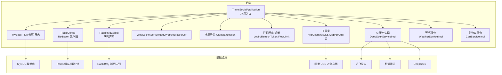
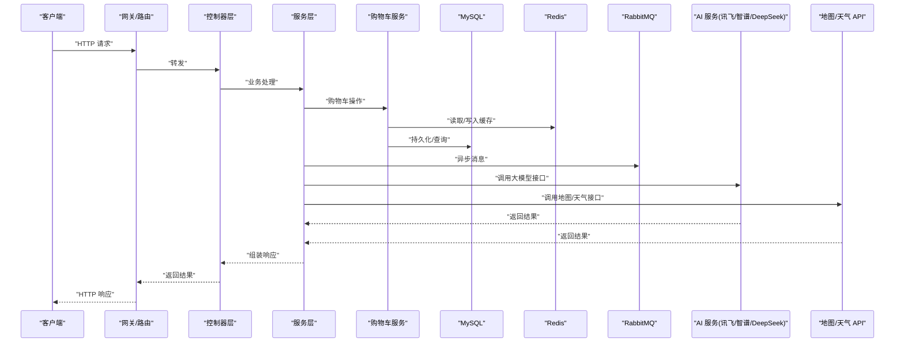
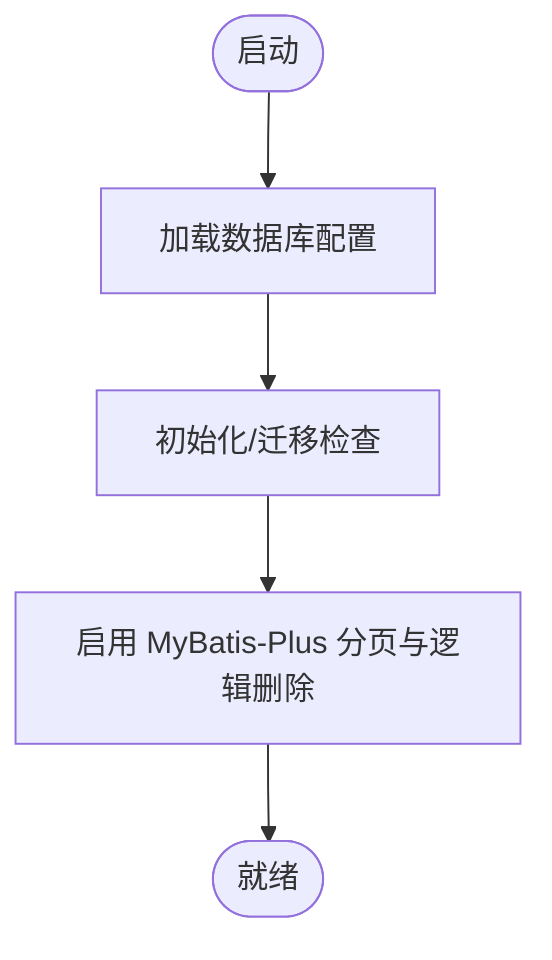
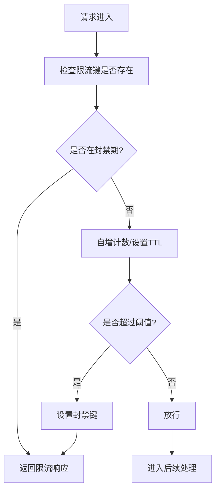
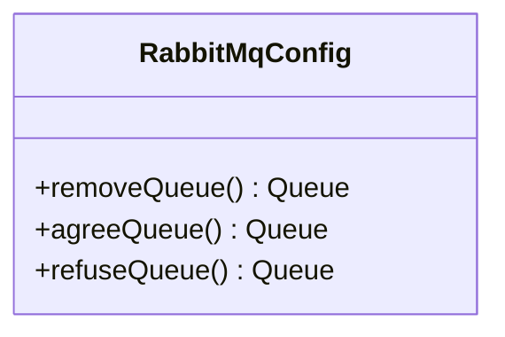
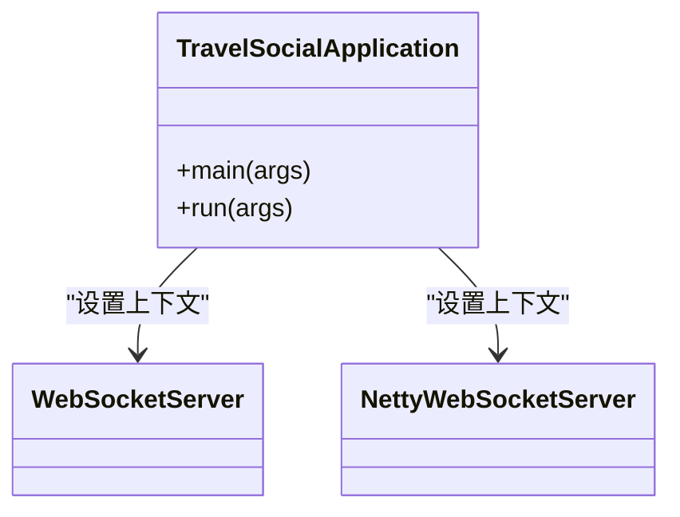
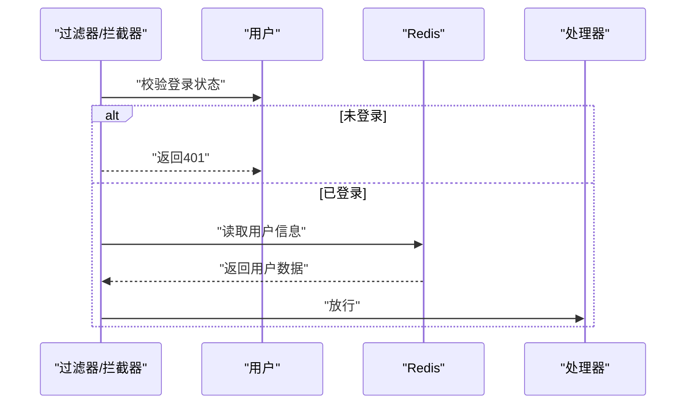
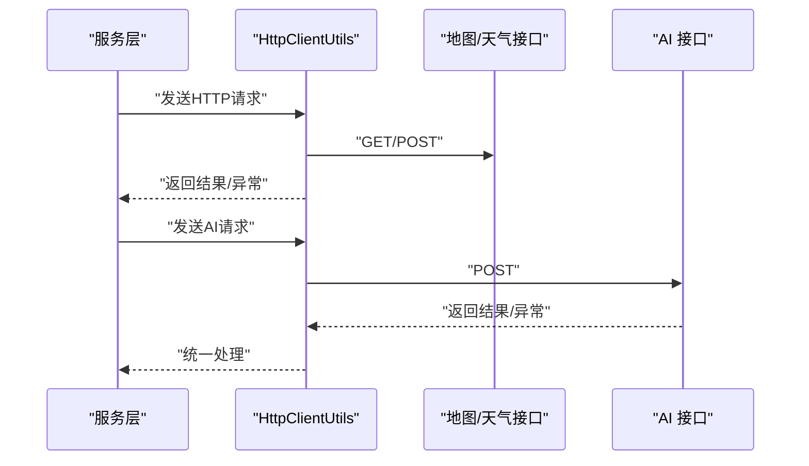
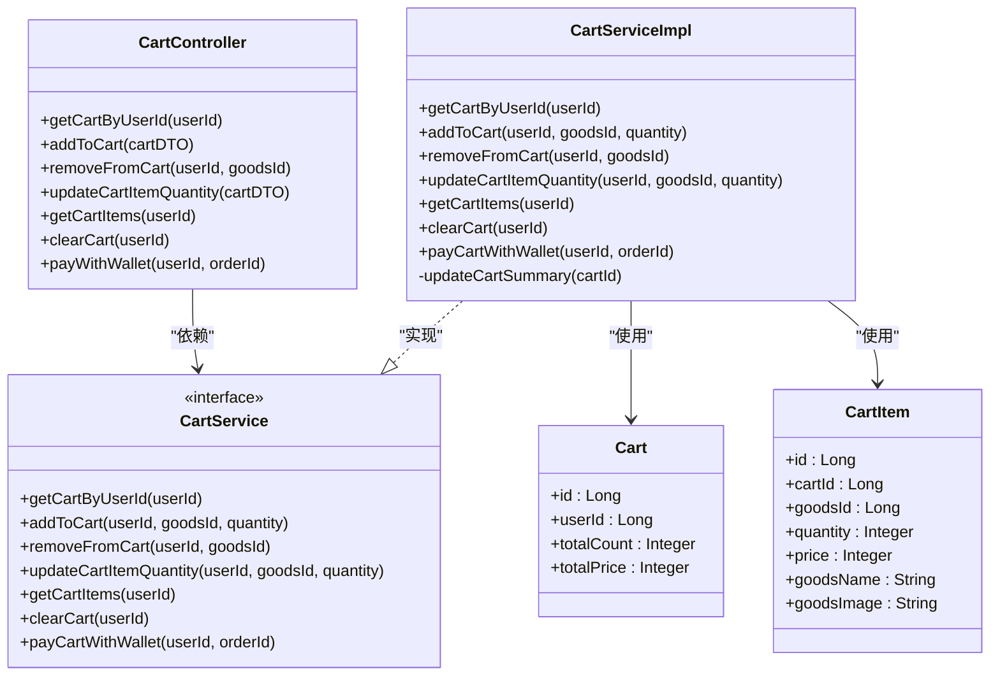
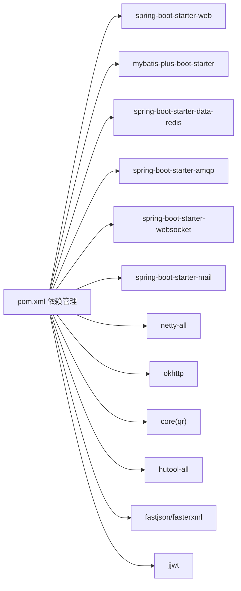

# 故障排除

<cite>
**本文引用的文件**
- [application.properties](file://springboot-travel-social/src/main/resources/application.properties)
- [pom.xml](file://springboot-travel-social/pom.xml)
- [TravelSocialApplication.java](file://springboot-travel-social/src/main/java/com/cxx/TravelSocialApplication.java)
- [RedisConfig.java](file://springboot-travel-social/src/main/java/com/cxx/config/RedisConfig.java)
- [RabbitMqConfig.java](file://springboot-travel-social/src/main/java/com/cxx/config/RabbitMqConfig.java)
- [MybatisPlusConfig.java](file://springboot-travel-social/src/main/java/com/cxx/config/MybatisPlusConfig.java)
- [RedisConstants.java](file://springboot-travel-social/src/main/java/com/cxx/utils/RedisConstants.java)
- [GlobalException.java](file://springboot-travel-social/src/main/java/com/cxx/exception/GlobalException.java)
- [CustomException.java](file://springboot-travel-social/src/main/java/com/cxx/exception/CustomException.java)
- [FlowLimitFilter.java](file://springboot-travel-social/src/main/java/com/cxx/filter/FlowLimitFilter.java)
- [LoginInterceptor.java](file://springboot-travel-social/src/main/java/com/cxx/utils/LoginInterceptor.java)
- [RefreshTokenInterceptor.java](file://springboot-travel-social/src/main/java/com/cxx/utils/RefreshTokenInterceptor.java)
- [limit.lua](file://springboot-travel-social/src/main/java/com/cxx/lua/limit.lua)
- [DeepSeekServiceImpl.java](file://springboot-travel-social/src/main/java/com/cxx/service/impl/DeepSeekServiceImpl.java)
- [WeatherServiceImpl.java](file://springboot-travel-social/src/main/java/com/cxx/service/impl/WeatherServiceImpl.java)
- [XingHuoUtils.java](file://springboot-travel-social/src/main/java/com/cxx/utils/XingHuoUtils.java)
- [ZhipuUtils.java](file://springboot-travel-social/src/main/java/com/cxx/utils/ZhipuUtils.java)
- [XfAPIUtils.java](file://springboot-travel-social/src/main/java/com/cxx/utils/XfAPIUtils.java)
- [MapApiUtils.java](file://springboot-travel-social/src/main/java/com/cxx/utils/MapApiUtils.java)
- [HttpClientUtils.java](file://springboot-travel-social/src/main/java/com/cxx/utils/HttpClientUtils.java)
- [AliOSSUtils.java](file://springboot-travel-social/src/main/java/com/cxx/utils/AliOSSUtils.java)
- [PoolConfiguration.java](file://springboot-travel-social/src/main/java/com/cxx/threadpool/PoolConfiguration.java)
- [RestTemplateConfig.java](file://springboot-travel-social/src/main/java/com/cxx/config/RestTemplateConfig.java)
- [WebSocketServer.java](file://springboot-travel-social/src/main/java/com/cxx/component/WebSocketServer.java)
- [NettyWebSocketServer.java](file://springboot-travel-social/src/main/java/com/cxx/component/NettyWebSocketServer.java)
- [CartController.java](file://springboot-travel-social/src/main/java/com/cxx/controller/CartController.java)
- [CartService.java](file://springboot-travel-social/src/main/java/com/cxx/service/CartService.java)
- [CartServiceImpl.java](file://springboot-travel-social/src/main/java/com/cxx/service/impl/CartServiceImpl.java)
- [CartMapper.java](file://springboot-travel-social/src/main/java/com/cxx/mapper/CartMapper.java)
- [CartItemMapper.java](file://springboot-travel-social/src/main/java/com/cxx/mapper/CartItemMapper.java)
- [Cart.java](file://springboot-travel-social/src/main/java/com/cxx/entity/Cart.java)
- [CartItem.java](file://springboot-travel-social/src/main/java/com/cxx/entity/CartItem.java)
- [travel_socical.sql](file://travel_socical.sql)
</cite>

## 目录
1. [简介](#简介)
2. [项目结构](#项目结构)
3. [核心组件](#核心组件)
4. [架构总览](#架构总览)
5. [详细组件分析](#详细组件分析)
6. [依赖分析](#依赖分析)
7. [性能考虑](#性能考虑)
8. [故障排除指南](#故障排除指南)
9. [结论](#结论)
10. [附录](#附录)

## 简介
本指南面向开发与运维人员，系统性梳理旅游攻略社交小程序在开发与运行阶段可能遇到的常见故障与解决方案，覆盖环境搭建、数据库连接、Redis 连接、第三方服务集成（支付、地图、AI）、API 调用失败、日志分析与错误定位、性能诊断与优化、并发与限流、以及应急处理与恢复流程。文档同时提供可视化图示与可操作步骤，帮助快速定位与解决问题。

## 项目结构
后端采用 Spring Boot 2.6.13，集成 MyBatis-Plus、Redisson、RabbitMQ、WebSocket、邮件、HTTP 客户端、二维码、阿里 OSS 等能力；前端为 UniApp 应用，通过 HTTP 请求与后端交互。数据库为 MySQL，使用逻辑删除与分页插件；Redis 用于登录态、缓存、分布式锁与限流；RabbitMQ 用于异步解耦；WebSocket 提供实时通信；AI 能力通过讯飞星火、智谱清言、DeepSeek 等外部接口实现。



图表来源
- [TravelSocialApplication.java:1-54](file://springboot-travel-social/src/main/java/com/cxx/TravelSocialApplication.java#L1-L54)
- [MybatisPlusConfig.java:1-20](file://springboot-travel-social/src/main/java/com/cxx/config/MybatisPlusConfig.java#L1-L20)
- [RedisConfig.java:1-33](file://springboot-travel-social/src/main/java/com/cxx/config/RedisConfig.java#L1-L33)
- [RabbitMqConfig.java:1-32](file://springboot-travel-social/src/main/java/com/cxx/config/RabbitMqConfig.java#L1-L32)
- [WebSocketServer.java](file://springboot-travel-social/src/main/java/com/cxx/component/WebSocketServer.java)
- [NettyWebSocketServer.java](file://springboot-travel-social/src/main/java/com/cxx/component/NettyWebSocketServer.java)
- [GlobalException.java:1-18](file://springboot-travel-social/src/main/java/com/cxx/exception/GlobalException.java#L1-L18)
- [LoginInterceptor.java:1-18](file://springboot-travel-social/src/main/java/com/cxx/utils/LoginInterceptor.java#L1-L18)
- [RefreshTokenInterceptor.java:1-50](file://springboot-travel-social/src/main/java/com/cxx/utils/RefreshTokenInterceptor.java#L1-L50)
- [FlowLimitFilter.java:1-71](file://springboot-travel-social/src/main/java/com/cxx/filter/FlowLimitFilter.java#L1-L71)
- [HttpClientUtils.java](file://springboot-travel-social/src/main/java/com/cxx/utils/HttpClientUtils.java)
- [AliOSSUtils.java](file://springboot-travel-social/src/main/java/com/cxx/utils/AliOSSUtils.java)
- [DeepSeekServiceImpl.java:212-254](file://springboot-travel-social/src/main/java/com/cxx/service/impl/DeepSeekServiceImpl.java#L212-L254)
- [WeatherServiceImpl.java:43-294](file://springboot-travel-social/src/main/java/com/cxx/service/impl/WeatherServiceImpl.java#L43-L294)
- [CartServiceImpl.java:1-274](file://springboot-travel-social/src/main/java/com/cxx/service/impl/CartServiceImpl.java#L1-L274)

章节来源
- [application.properties:1-61](file://springboot-travel-social/src/main/resources/application.properties#L1-L61)
- [pom.xml:1-243](file://springboot-travel-social/pom.xml#L1-L243)

## 核心组件
- 数据库与ORM：MyBatis-Plus 分页插件、逻辑删除配置、SQL 日志输出；MySQL 连接参数在配置文件中集中管理。
- 缓存与分布式：Redisson 单机客户端，Redis 常量键空间命名规范，限流与锁策略。
- 消息队列：RabbitMQ 队列声明，用于异步通知与解耦。
- 实时通信：WebSocket 服务端组件，支持长连接与消息推送。
- 全局异常：统一捕获运行时异常，返回标准化错误响应。
- 认证与拦截：登录拦截器与 Token 刷新拦截器，结合 Redis 存储用户会话。
- 限流与安全：基于 Redis 的请求计数与封禁策略，配合过滤器阻断高并发冲击。
- 第三方集成：HTTP 客户端封装、阿里 OSS、地图 API、AI 服务（讯飞、智谱、DeepSeek）。
- **购物车服务**：完整的购物车 CRUD 操作、商品数量更新、支付流程与订单创建。

章节来源
- [MybatisPlusConfig.java:1-20](file://springboot-travel-social/src/main/java/com/cxx/config/MybatisPlusConfig.java#L1-L20)
- [RedisConfig.java:1-33](file://springboot-travel-social/src/main/java/com/cxx/config/RedisConfig.java#L1-L33)
- [RedisConstants.java:1-30](file://springboot-travel-social/src/main/java/com/cxx/utils/RedisConstants.java#L1-L30)
- [RabbitMqConfig.java:1-32](file://springboot-travel-social/src/main/java/com/cxx/config/RabbitMqConfig.java#L1-L32)
- [WebSocketServer.java](file://springboot-travel-social/src/main/java/com/cxx/component/WebSocketServer.java)
- [NettyWebSocketServer.java](file://springboot-travel-social/src/main/java/com/cxx/component/NettyWebSocketServer.java)
- [GlobalException.java:1-18](file://springboot-travel-social/src/main/java/com/cxx/exception/GlobalException.java#L1-L18)
- [LoginInterceptor.java:1-18](file://springboot-travel-social/src/main/java/com/cxx/utils/LoginInterceptor.java#L1-L18)
- [RefreshTokenInterceptor.java:1-50](file://springboot-travel-social/src/main/java/com/cxx/utils/RefreshTokenInterceptor.java#L1-L50)
- [FlowLimitFilter.java:1-71](file://springboot-travel-social/src/main/java/com/cxx/filter/FlowLimitFilter.java#L1-L71)
- [CartServiceImpl.java:1-274](file://springboot-travel-social/src/main/java/com/cxx/service/impl/CartServiceImpl.java#L1-L274)

## 架构总览
下图展示从客户端到后端服务、数据库与第三方服务的整体调用链路与关键组件交互。



图表来源
- [TravelSocialApplication.java:1-54](file://springboot-travel-social/src/main/java/com/cxx/TravelSocialApplication.java#L1-L54)
- [MybatisPlusConfig.java:1-20](file://springboot-travel-social/src/main/java/com/cxx/config/MybatisPlusConfig.java#L1-L20)
- [RedisConfig.java:1-33](file://springboot-travel-social/src/main/java/com/cxx/config/RedisConfig.java#L1-L33)
- [RabbitMqConfig.java:1-32](file://springboot-travel-social/src/main/java/com/cxx/config/RabbitMqConfig.java#L1-L32)
- [DeepSeekServiceImpl.java:212-254](file://springboot-travel-social/src/main/java/com/cxx/service/impl/DeepSeekServiceImpl.java#L212-L254)
- [WeatherServiceImpl.java:43-294](file://springboot-travel-social/src/main/java/com/cxx/service/impl/WeatherServiceImpl.java#L43-L294)
- [CartServiceImpl.java:1-274](file://springboot-travel-social/src/main/java/com/cxx/service/impl/CartServiceImpl.java#L1-L274)

## 详细组件分析

### 数据库连接与 MyBatis-Plus
- 连接参数：驱动、URL、用户名、密码、时区、字符集等集中在配置文件中，便于统一维护与切换。
- SQL 日志：开启标准输出以辅助开发期调试。
- 分页与逻辑删除：启用分页插件与逻辑删除字段配置，避免误删与提升查询效率。
- 启动初始化：应用启动时自动检查并补全数据库结构（如新增字段），降低部署风险。



图表来源
- [application.properties:1-22](file://springboot-travel-social/src/main/resources/application.properties#L1-L22)
- [MybatisPlusConfig.java:1-20](file://springboot-travel-social/src/main/java/com/cxx/config/MybatisPlusConfig.java#L1-L20)
- [TravelSocialApplication.java:27-50](file://springboot-travel-social/src/main/java/com/cxx/TravelSocialApplication.java#L27-L50)

章节来源
- [application.properties:1-22](file://springboot-travel-social/src/main/resources/application.properties#L1-L22)
- [MybatisPlusConfig.java:1-20](file://springboot-travel-social/src/main/java/com/cxx/config/MybatisPlusConfig.java#L1-L20)
- [TravelSocialApplication.java:27-50](file://springboot-travel-social/src/main/java/com/cxx/TravelSocialApplication.java#L27-L50)

### Redis 连接与限流/锁
- 客户端：Redisson 单机模式，地址由配置注入。
- 键空间：统一常量定义，便于排查与维护。
- 限流：基于 Redis 计数与过期时间，超过阈值进行封禁；过滤器在请求入口执行。
- Lua 脚本：提供原子级限流脚本，减少竞态条件。



图表来源
- [RedisConfig.java:1-33](file://springboot-travel-social/src/main/java/com/cxx/config/RedisConfig.java#L1-L33)
- [RedisConstants.java:1-30](file://springboot-travel-social/src/main/java/com/cxx/utils/RedisConstants.java#L1-L30)
- [FlowLimitFilter.java:1-71](file://springboot-travel-social/src/main/java/com/cxx/filter/FlowLimitFilter.java#L1-L71)
- [limit.lua:1-15](file://springboot-travel-social/src/main/java/com/cxx/lua/limit.lua#L1-L15)

章节来源
- [RedisConfig.java:1-33](file://springboot-travel-social/src/main/java/com/cxx/config/RedisConfig.java#L1-L33)
- [RedisConstants.java:1-30](file://springboot-travel-social/src/main/java/com/cxx/utils/RedisConstants.java#L1-L30)
- [FlowLimitFilter.java:1-71](file://springboot-travel-social/src/main/java/com/cxx/filter/FlowLimitFilter.java#L1-L71)
- [limit.lua:1-15](file://springboot-travel-social/src/main/java/com/cxx/lua/limit.lua#L1-L15)

### RabbitMQ 队列与异步处理
- 队列声明：在配置类中集中声明，确保服务启动时队列存在。
- 使用场景：订单异步通知、审核状态变更、日志上报等。



图表来源
- [RabbitMqConfig.java:1-32](file://springboot-travel-social/src/main/java/com/cxx/config/RabbitMqConfig.java#L1-L32)

章节来源
- [RabbitMqConfig.java:1-32](file://springboot-travel-social/src/main/java/com/cxx/config/RabbitMqConfig.java#L1-L32)

### WebSocket 实时通信
- 组件：传统 WebSocket 与 Netty 实现，用于消息推送与互动。
- 集成：应用启动时注入上下文，便于在组件内访问 Bean。



图表来源
- [WebSocketServer.java](file://springboot-travel-social/src/main/java/com/cxx/component/WebSocketServer.java)
- [NettyWebSocketServer.java](file://springboot-travel-social/src/main/java/com/cxx/component/NettyWebSocketServer.java)
- [TravelSocialApplication.java:17-25](file://springboot-travel-social/src/main/java/com/cxx/TravelSocialApplication.java#L17-L25)

章节来源
- [WebSocketServer.java](file://springboot-travel-social/src/main/java/com/cxx/component/WebSocketServer.java)
- [NettyWebSocketServer.java](file://springboot-travel-social/src/main/java/com/cxx/component/NettyWebSocketServer.java)
- [TravelSocialApplication.java:17-25](file://springboot-travel-social/src/main/java/com/cxx/TravelSocialApplication.java#L17-L25)

### 全局异常与认证拦截
- 全局异常：统一捕获运行时异常，记录日志并返回标准化错误。
- 登录拦截：未登录直接拒绝，避免越权访问。
- Token 刷新：从 Redis 读取用户信息，刷新过期时间，保证会话连续性。



图表来源
- [GlobalException.java:1-18](file://springboot-travel-social/src/main/java/com/cxx/exception/GlobalException.java#L1-L18)
- [LoginInterceptor.java:1-18](file://springboot-travel-social/src/main/java/com/cxx/utils/LoginInterceptor.java#L1-L18)
- [RefreshTokenInterceptor.java:1-50](file://springboot-travel-social/src/main/java/com/cxx/utils/RefreshTokenInterceptor.java#L1-L50)

章节来源
- [GlobalException.java:1-18](file://springboot-travel-social/src/main/java/com/cxx/exception/GlobalException.java#L1-L18)
- [LoginInterceptor.java:1-18](file://springboot-travel-social/src/main/java/com/cxx/utils/LoginInterceptor.java#L1-L18)
- [RefreshTokenInterceptor.java:1-50](file://springboot-travel-social/src/main/java/com/cxx/utils/RefreshTokenInterceptor.java#L1-L50)

### 第三方服务集成与故障处理
- HTTP 客户端：统一封装请求与响应处理，便于统一错误处理与重试策略。
- 阿里 OSS：对象存储上传/下载，注意鉴权与跨域配置。
- 地图/天气：封装 API 工具类，统一参数与异常处理。
- AI 服务：DeepSeek、智谱清言、讯飞星火，提供状态检查与错误兜底。



图表来源
- [HttpClientUtils.java](file://springboot-travel-social/src/main/java/com/cxx/utils/HttpClientUtils.java)
- [WeatherServiceImpl.java:43-294](file://springboot-travel-social/src/main/java/com/cxx/service/impl/WeatherServiceImpl.java#L43-L294)
- [DeepSeekServiceImpl.java:212-254](file://springboot-travel-social/src/main/java/com/cxx/service/impl/DeepSeekServiceImpl.java#L212-L254)
- [XingHuoUtils.java](file://springboot-travel-social/src/main/java/com/cxx/utils/XingHuoUtils.java)
- [ZhipuUtils.java](file://springboot-travel-social/src/main/java/com/cxx/utils/ZhipuUtils.java)
- [XfAPIUtils.java](file://springboot-travel-social/src/main/java/com/cxx/utils/XfAPIUtils.java)
- [MapApiUtils.java](file://springboot-travel-social/src/main/java/com/cxx/utils/MapApiUtils.java)
- [AliOSSUtils.java](file://springboot-travel-social/src/main/java/com/cxx/utils/AliOSSUtils.java)

章节来源
- [HttpClientUtils.java](file://springboot-travel-social/src/main/java/com/cxx/utils/HttpClientUtils.java)
- [WeatherServiceImpl.java:43-294](file://springboot-travel-social/src/main/java/com/cxx/service/impl/WeatherServiceImpl.java#L43-L294)
- [DeepSeekServiceImpl.java:212-254](file://springboot-travel-social/src/main/java/com/cxx/service/impl/DeepSeekServiceImpl.java#L212-L254)
- [XingHuoUtils.java](file://springboot-travel-social/src/main/java/com/cxx/utils/XingHuoUtils.java)
- [ZhipuUtils.java](file://springboot-travel-social/src/main/java/com/cxx/utils/ZhipuUtils.java)
- [XfAPIUtils.java](file://springboot-travel-social/src/main/java/com/cxx/utils/XfAPIUtils.java)
- [MapApiUtils.java](file://springboot-travel-social/src/main/java/com/cxx/utils/MapApiUtils.java)
- [AliOSSUtils.java](file://springboot-travel-social/src/main/java/com/cxx/utils/AliOSSUtils.java)

### 购物车服务组件
- **控制器层**：提供完整的购物车 CRUD 操作接口，包括获取购物车、添加商品、移除商品、更新数量、清空购物车、钱包支付等。
- **服务层**：实现购物车业务逻辑，包括事务管理、商品库存检查、价格计算、订单创建等。
- **数据访问层**：MyBatis-Plus 映射购物车与购物车商品项实体，支持复杂查询与批量操作。
- **实体模型**：购物车与购物车商品项实体，包含完整的字段定义与注解配置。



图表来源
- [CartController.java:1-93](file://springboot-travel-social/src/main/java/com/cxx/controller/CartController.java#L1-L93)
- [CartService.java:1-31](file://springboot-travel-social/src/main/java/com/cxx/service/CartService.java#L1-L31)
- [CartServiceImpl.java:1-274](file://springboot-travel-social/src/main/java/com/cxx/service/impl/CartServiceImpl.java#L1-L274)
- [Cart.java:1-31](file://springboot-travel-social/src/main/java/com/cxx/entity/Cart.java#L1-L31)
- [CartItem.java:1-34](file://springboot-travel-social/src/main/java/com/cxx/entity/CartItem.java#L1-L34)

章节来源
- [CartController.java:1-93](file://springboot-travel-social/src/main/java/com/cxx/controller/CartController.java#L1-L93)
- [CartService.java:1-31](file://springboot-travel-social/src/main/java/com/cxx/service/CartService.java#L1-L31)
- [CartServiceImpl.java:1-274](file://springboot-travel-social/src/main/java/com/cxx/service/impl/CartServiceImpl.java#L1-L274)
- [CartMapper.java:1-9](file://springboot-travel-social/src/main/java/com/cxx/mapper/CartMapper.java#L1-L9)
- [CartItemMapper.java:1-9](file://springboot-travel-social/src/main/java/com/cxx/mapper/CartItemMapper.java#L1-L9)
- [Cart.java:1-31](file://springboot-travel-social/src/main/java/com/cxx/entity/Cart.java#L1-L31)
- [CartItem.java:1-34](file://springboot-travel-social/src/main/java/com/cxx/entity/CartItem.java#L1-L34)

## 依赖分析
- 核心依赖：Web、MyBatis-Plus、Redis、AMQP、WebSocket、邮件、HTTP 客户端、二维码、Netty、OkHttp、JSoup、Hutool、Fastjson、JWT、日志链路追踪等。
- 版本管理：通过 Spring Boot BOM 统一管理版本，减少冲突。
- 资源打包：Maven 插件配置主类与资源过滤，确保 XML 与静态资源正确打包。



图表来源
- [pom.xml:16-181](file://springboot-travel-social/pom.xml#L16-L181)

章节来源
- [pom.xml:16-181](file://springboot-travel-social/pom.xml#L16-L181)

## 性能考虑
- 连接池与线程：Tomcat 最大线程与最小空闲线程配置，Redis 连接池参数，需根据压测结果调整。
- 缓存命中率：热点数据预热、TTL 合理设置、避免雪崩与穿透。
- 分页与索引：合理使用分页插件，确保高频查询具备合适索引。
- 异步化：将非关键路径任务放入消息队列，降低同步延迟。
- 并发控制：限流与熔断策略，防止瞬时洪峰导致系统不可用。
- 线程池：自定义线程池配置，隔离不同业务类型任务。

章节来源
- [application.properties:44-46](file://springboot-travel-social/src/main/resources/application.properties#L44-L46)
- [application.properties:27-29](file://springboot-travel-social/src/main/resources/application.properties#L27-L29)
- [MybatisPlusConfig.java:1-20](file://springboot-travel-social/src/main/java/com/cxx/config/MybatisPlusConfig.java#L1-L20)
- [PoolConfiguration.java](file://springboot-travel-social/src/main/java/com/cxx/threadpool/PoolConfiguration.java)

## 故障排除指南

### 环境搭建问题
- JDK 版本不匹配：后端使用 Java 1.8，需确保本地与 CI 环境一致。
- Maven 仓库与代理：若依赖拉取失败，检查本地仓库与代理配置。
- 端口占用：默认端口 8082，若被占用需修改配置或释放端口。
- 字符编码：URI 编码与 Tomcat 线程池配置需保持一致，避免乱码。

章节来源
- [pom.xml:10-14](file://springboot-travel-social/pom.xml#L10-L14)
- [application.properties:18-19](file://springboot-travel-social/src/main/resources/application.properties#L18-L19)
- [application.properties:43](file://springboot-travel-social/src/main/resources/application.properties#L43)

### 数据库连接问题
- 连接串与凭据：确认驱动、URL、用户名、密码与时区参数正确。
- 权限与网络：确保数据库允许远程访问且防火墙放行。
- SQL 日志：开启 SQL 输出有助于定位语法与参数问题。
- 逻辑删除：确认逻辑删除字段与值配置正确，避免误删。

章节来源
- [application.properties:1-5](file://springboot-travel-social/src/main/resources/application.properties#L1-L5)
- [application.properties:13](file://springboot-travel-social/src/main/resources/application.properties#L13)
- [application.properties:20-22](file://springboot-travel-social/src/main/resources/application.properties#L20-L22)
- [MybatisPlusConfig.java:1-20](file://springboot-travel-social/src/main/java/com/cxx/config/MybatisPlusConfig.java#L1-L20)

### Redis 连接问题
- 主机与端口：确认 Redis 地址与端口配置正确。
- 密码与数据库选择：如启用认证或多库，需在客户端配置中体现。
- 连接池参数：最大活跃、空闲、驱逐间隔等需按流量调优。
- 键空间命名：统一使用常量定义，避免拼写错误导致缓存失效。

章节来源
- [application.properties:23-30](file://springboot-travel-social/src/main/resources/application.properties#L23-L30)
- [RedisConfig.java:1-33](file://springboot-travel-social/src/main/java/com/cxx/config/RedisConfig.java#L1-L33)
- [RedisConstants.java:1-30](file://springboot-travel-social/src/main/java/com/cxx/utils/RedisConstants.java#L1-L30)

### RabbitMQ 连接问题
- 主机、端口、虚拟主机、账号密码：确保与 Broker 配置一致。
- 队列声明：服务启动前确认队列存在，避免消息丢失。
- 消费幂等：消费端需保证重复消费不会产生副作用。

章节来源
- [application.properties:8-12](file://springboot-travel-social/src/main/resources/application.properties#L8-L12)
- [RabbitMqConfig.java:1-32](file://springboot-travel-social/src/main/java/com/cxx/config/RabbitMqConfig.java#L1-L32)

### API 调用失败
- HTTP 客户端封装：统一处理超时、重试与异常，避免分散处理。
- 参数校验：确保必填参数与格式正确，必要时增加前置校验。
- 第三方接口：关注限流与配额，必要时降级或缓存结果。
- 日志与追踪：记录请求与响应摘要，便于回溯。

章节来源
- [HttpClientUtils.java](file://springboot-travel-social/src/main/java/com/cxx/utils/HttpClientUtils.java)
- [WeatherServiceImpl.java:43-294](file://springboot-travel-social/src/main/java/com/cxx/service/impl/WeatherServiceImpl.java#L43-L294)
- [DeepSeekServiceImpl.java:212-254](file://springboot-travel-social/src/main/java/com/cxx/service/impl/DeepSeekServiceImpl.java#L212-L254)

### 日志分析与错误定位
- 全局异常：统一捕获运行时异常，记录堆栈，返回标准化错误。
- 自定义异常：通过枚举定义错误码与消息，便于前端提示与统计。
- SQL 日志：开发期开启 SQL 输出，生产期建议关闭或降级。
- 认证拦截：未登录直接拦截，避免越权引发复杂问题。

章节来源
- [GlobalException.java:1-18](file://springboot-travel-social/src/main/java/com/cxx/exception/GlobalException.java#L1-L18)
- [CustomException.java:1-19](file://springboot-travel-social/src/main/java/com/cxx/exception/CustomException.java#L1-L19)
- [application.properties:13](file://springboot-travel-social/src/main/resources/application.properties#L13)
- [LoginInterceptor.java:1-18](file://springboot-travel-social/src/main/java/com/cxx/utils/LoginInterceptor.java#L1-L18)

### 性能问题诊断与优化
- 慢查询分析：结合数据库慢日志与 SQL 执行计划，优化索引与语句。
- 内存泄漏检测：关注线程池、连接池与缓存，定期巡检对象生命周期。
- 并发问题排查：限流与熔断策略，避免级联故障；对共享资源加锁。
- Redis 优化：合理设置 TTL、批量操作、避免大 Key；使用 Lua 原子化。
- 线程池隔离：不同业务类型使用独立线程池，避免相互影响。

章节来源
- [application.properties:44-46](file://springboot-travel-social/src/main/resources/application.properties#L44-L46)
- [application.properties:27-29](file://springboot-travel-social/src/main/resources/application.properties#L27-L29)
- [FlowLimitFilter.java:1-71](file://springboot-travel-social/src/main/java/com/cxx/filter/FlowLimitFilter.java#L1-L71)
- [RedisConstants.java:1-30](file://springboot-travel-social/src/main/java/com/cxx/utils/RedisConstants.java#L1-L30)

### 调试工具使用
- IDE 调试：设置断点、观察变量与调用栈，结合日志定位问题。
- 网络抓包：使用 Wireshark 或浏览器开发者工具，查看请求与响应细节。
- 数据库分析：使用 EXPLAIN 分析 SQL，定位慢查询与索引缺失。
- Redis 分析：使用 INFO/KEYS/SCAN 等命令排查键空间与内存使用。
- 日志分析：集中化日志收集与检索，结合 Trace ID 快速回溯。

章节来源
- [application.properties:13](file://springboot-travel-social/src/main/resources/application.properties#L13)

### 应急处理预案与故障恢复
- 快速降级：对非关键接口进行限流或熔断，保障核心链路稳定。
- 缓存预热：在流量高峰前预热热点数据，降低数据库压力。
- 回滚策略：灰度发布与快速回滚，避免大面积影响。
- 备份与恢复：数据库与配置文件定期备份，演练恢复流程。
- 限流与封禁：触发限流后及时扩容或临时提高阈值，恢复后再收紧。

章节来源
- [FlowLimitFilter.java:1-71](file://springboot-travel-social/src/main/java/com/cxx/filter/FlowLimitFilter.java#L1-L71)
- [RedisConstants.java:1-30](file://springboot-travel-social/src/main/java/com/cxx/utils/RedisConstants.java#L1-L30)

### 第三方服务集成问题
- 支付接口：检查回调签名、重试机制与幂等设计；关注风控与限额。
- 地图 API：核对密钥、域名白名单与请求频率限制。
- AI 服务：检查鉴权、模型参数与配额；提供健康检查与降级策略。
- 邮件服务：验证 SMTP 配置、SSL/TLS 与发件人权限。

章节来源
- [application.properties:31-42](file://springboot-travel-social/src/main/resources/application.properties#L31-L42)
- [WeatherServiceImpl.java:43-294](file://springboot-travel-social/src/main/java/com/cxx/service/impl/WeatherServiceImpl.java#L43-L294)
- [DeepSeekServiceImpl.java:212-254](file://springboot-travel-social/src/main/java/com/cxx/service/impl/DeepSeekServiceImpl.java#L212-L254)
- [XingHuoUtils.java](file://springboot-travel-social/src/main/java/com/cxx/utils/XingHuoUtils.java)
- [ZhipuUtils.java](file://springboot-travel-social/src/main/java/com/cxx/utils/ZhipuUtils.java)
- [XfAPIUtils.java](file://springboot-travel-social/src/main/java/com/cxx/utils/XfAPIUtils.java)

### 购物车相关故障排除

#### 购物车数据获取失败
**问题现象**：用户无法获取购物车数据，接口返回空列表或异常。

**可能原因**：
1. 购物车不存在：用户首次访问或购物车已被清空
2. 数据库连接异常：无法查询购物车信息
3. 用户ID无效：传入的用户ID为空或格式错误
4. Java8兼容性问题：List.of() 方法在Java8中不可用

**解决方案**：
1. **检查购物车存在性**：在 `getCartByUserId` 方法中，如果购物车不存在，应该返回空列表而不是抛出异常
2. **验证数据库连接**：确认数据库连接参数正确，网络连通性正常
3. **用户ID校验**：在控制器层增加用户ID参数校验
4. **Java8兼容性修复**：将 `List.of()` 替换为 `new ArrayList<>()`

**关键修复点**：
```java
// 修复前：List.of() 在Java8中不可用
return List.of();

// 修复后：Java8兼容的空列表创建
return new ArrayList<>();
```

**章节来源**
- [CartServiceImpl.java:156-158](file://springboot-travel-social/src/main/java/com/cxx/service/impl/CartServiceImpl.java#L156-L158)
- [CartController.java:62-66](file://springboot-travel-social/src/main/java/com/cxx/controller/CartController.java#L62-L66)

#### 购物车商品添加失败
**问题现象**：添加商品到购物车时报错，商品未成功加入。

**可能原因**：
1. 商品不存在：商品ID对应的记录不存在
2. 事务未提交：添加操作在事务中但未正确提交
3. 购物车创建失败：用户购物车创建过程异常
4. 价格同步问题：商品价格未正确同步到购物车项

**解决方案**：
1. **商品存在性检查**：在添加商品前验证商品是否存在
2. **事务管理**：确保 `@Transactional` 注解正确配置
3. **购物车初始化**：确保购物车不存在时能够正确创建
4. **价格同步**：从商品服务获取最新价格并同步到购物车项

**章节来源**
- [CartServiceImpl.java:57-100](file://springboot-travel-social/src/main/java/com/cxx/service/impl/CartServiceImpl.java#L57-L100)
- [CartController.java:32-40](file://springboot-travel-social/src/main/java/com/cxx/controller/CartController.java#L32-L40)

#### 购物车支付失败
**问题现象**：使用钱包支付购物车时返回失败。

**可能原因**：
1. 购物车为空：用户购物车中没有商品
2. 钱包余额不足：用户钱包余额小于购物车总价
3. 支付服务异常：钱包支付服务调用失败
4. 订单创建失败：支付成功后订单创建过程异常

**解决方案**：
1. **购物车状态检查**：在支付前检查购物车是否为空
2. **余额验证**：调用钱包服务前验证用户余额
3. **支付流程监控**：监控支付服务调用结果
4. **订单创建补偿**：确保订单创建的幂等性

**章节来源**
- [CartServiceImpl.java:212-273](file://springboot-travel-social/src/main/java/com/cxx/service/impl/CartServiceImpl.java#L212-L273)
- [CartController.java:80-92](file://springboot-travel-social/src/main/java/com/cxx/controller/CartController.java#L80-L92)

#### 购物车清理问题
**问题现象**：清空购物车后数据仍然存在。

**可能原因**：
1. 查询条件错误：删除条件与购物车ID不匹配
2. 事务未提交：清空操作在事务中未提交
3. 数据库连接问题：删除操作执行失败
4. 购物车汇总更新失败：清空后未更新购物车统计信息

**解决方案**：
1. **正确查询条件**：确保使用正确的购物车ID进行删除
2. **事务完整性**：确保清空操作在事务中正确执行
3. **删除验证**：检查删除操作是否成功执行
4. **统计信息更新**：清空后正确更新购物车的总数量和总价

**章节来源**
- [CartServiceImpl.java:167-182](file://springboot-travel-social/src/main/java/com/cxx/service/impl/CartServiceImpl.java#L167-L182)
- [CartController.java:71-75](file://springboot-travel-social/src/main/java/com/cxx/controller/CartController.java#L71-L75)

## 结论
本指南从架构与组件入手，结合配置与代码实现，系统化地给出了常见故障的排查思路与解决方案。新增的购物车故障排除章节涵盖了购物车数据获取、商品添加、支付流程、清理操作等核心功能的常见问题与解决方案。建议在开发与运维实践中持续完善监控与告警体系，建立完善的日志与追踪机制，定期进行压测与演练，确保系统在高并发与复杂场景下的稳定性与可靠性。

## 附录
- 数据库结构参考：包含历史评分、消息表等结构，可用于排查数据一致性与关联问题。
- 购物车表结构：购物车与购物车商品项的完整字段定义，用于排查数据模型问题。

**章节来源**
- [travel_socical.sql:467-517](file://travel_socical.sql#L467-L517)
- [Cart.java:1-31](file://springboot-travel-social/src/main/java/com/cxx/entity/Cart.java#L1-L31)
- [CartItem.java:1-34](file://springboot-travel-social/src/main/java/com/cxx/entity/CartItem.java#L1-L34)