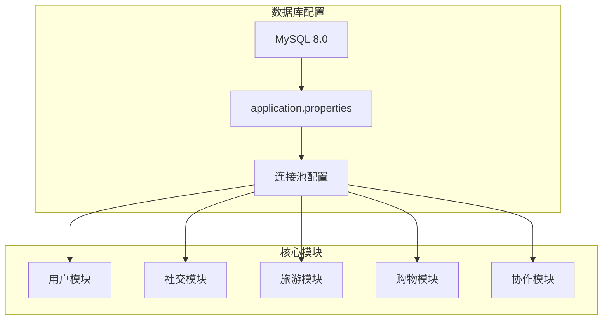
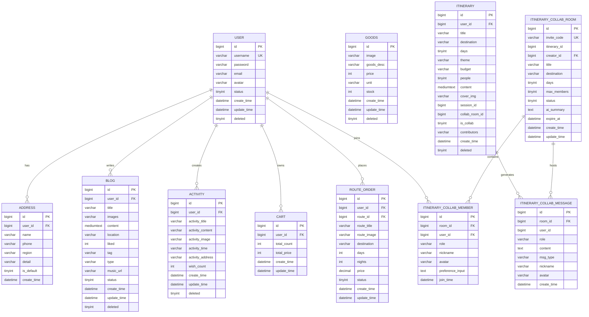
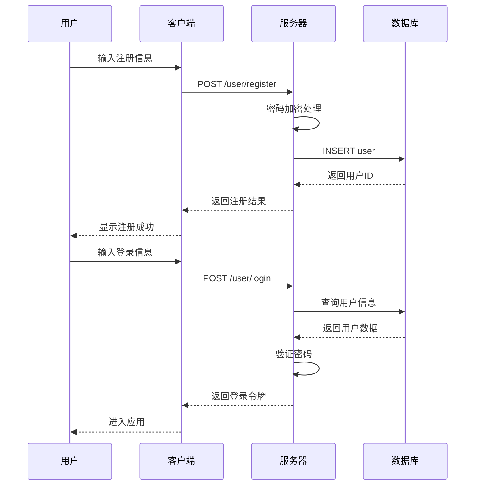
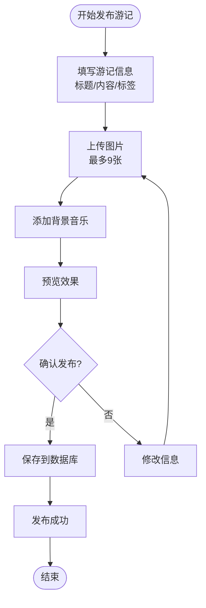
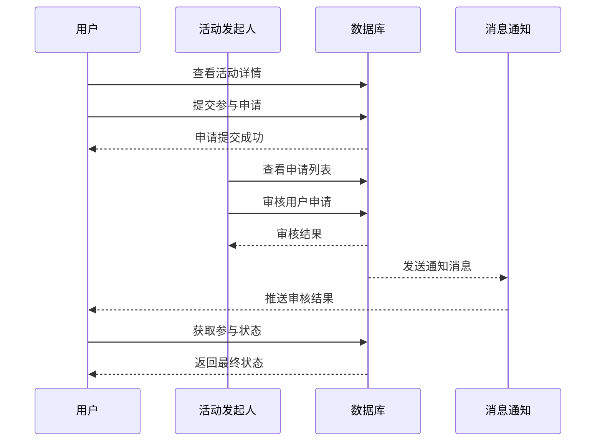
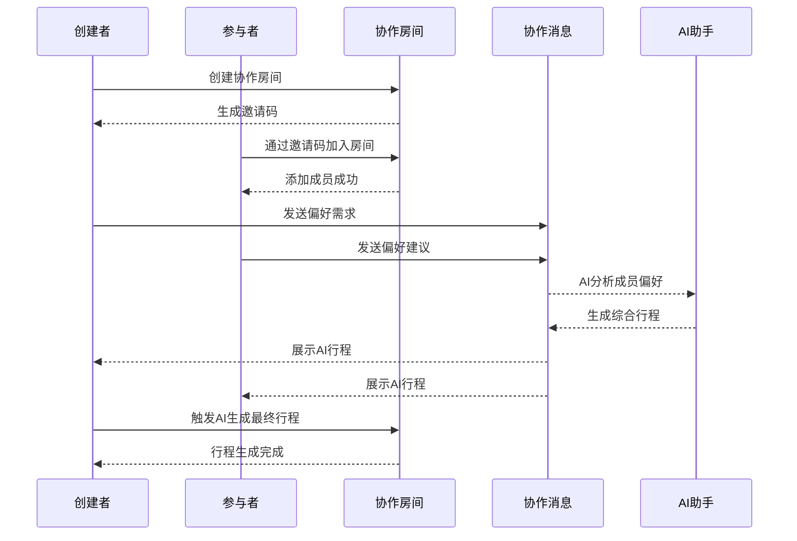
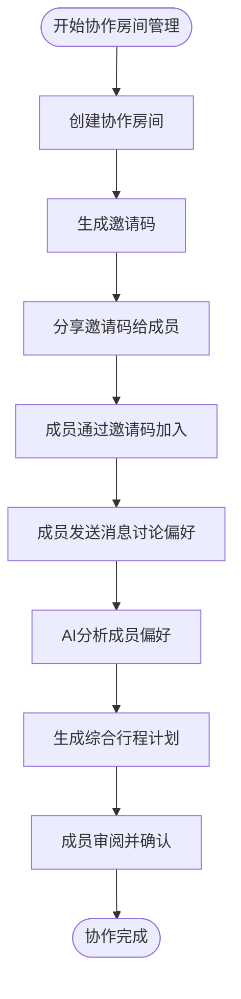

# 数据库设计

<cite>
**本文档引用的文件**
- [travel_socical.sql](file://travel_socical.sql)
- [application.properties](file://springboot-travel-social/src/main/resources/application.properties)
- [budget.sql](file://springboot-travel-social/src/main/resources/sql/budget.sql)
- [itinerary_collab.sql](file://springboot-travel-social/src/main/resources/sql/itinerary_collab.sql)
- [local_spot.sql](file://springboot-travel-social/src/main/resources/sql/local_spot.sql)
- [route_order.sql](file://springboot-travel-social/src/main/resources/sql/route_order.sql)
- [holiday_config.sql](file://springboot-travel-social/src/main/resources/sql/holiday_config.sql)
- [User.java](file://springboot-travel-social/src/main/java/com/cxx/entity/User.java)
- [Activity.java](file://springboot-travel-social/src/main/java/com/cxx/entity/Activity.java)
- [Blog.java](file://springboot-travel-social/src/main/java/com/cxx/entity/Blog.java)
- [Attractions.java](file://springboot-travel-social/src/main/java/com/cxx/entity/Attractions.java)
- [Address.java](file://springboot-travel-social/src/main/java/com/cxx/entity/Address.java)
- [Cart.java](file://springboot-travel-social/src/main/java/com/cxx/entity/Cart.java)
- [Hotel.java](file://springboot-travel-social/src/main/java/com/cxx/entity/Hotel.java)
- [Food.java](file://springboot-travel-social/src/main/java/com/cxx/entity/Food.java)
- [Goods.java](file://springboot-travel-social/src/main/java/com/cxx/entity/Goods.java)
- [Route.java](file://springboot-travel-social/src/main/java/com/cxx/entity/Route.java)
- [Itinerary.java](file://springboot-travel-social/src/main/java/com/cxx/entity/Itinerary.java)
- [ItineraryCollabRoom.java](file://springboot-travel-social/src/main/java/com/cxx/entity/ItineraryCollabRoom.java)
- [ItineraryCollabMember.java](file://springboot-travel-social/src/main/java/com/cxx/entity/ItineraryCollabMember.java)
- [ItineraryCollabMessage.java](file://springboot-travel-social/src/main/java/com/cxx/entity/ItineraryCollabMessage.java)
- [ItineraryCollabController.java](file://springboot-travel-social/src/main/java/com/cxx/controller/ItineraryCollabController.java)
- [ItineraryCollabService.java](file://springboot-travel-social/src/main/java/com/cxx/service/ItineraryCollabService.java)
- [ItineraryCollabRoomMapper.java](file://springboot-travel-social/src/main/java/com/cxx/mapper/ItineraryCollabRoomMapper.java)
- [ItineraryCollabMemberMapper.java](file://springboot-travel-social/src/main/java/com/cxx/mapper/ItineraryCollabMemberMapper.java)
- [ItineraryCollabMessageMapper.java](file://springboot-travel-social/src/main/java/com/cxx/mapper/ItineraryCollabMessageMapper.java)
</cite>

## 更新摘要
**变更内容**
- 新增行程协作系统数据库表设计章节
- 更新AI行程表结构，增加协作相关字段
- 新增协作房间、成员、消息表的详细设计
- 更新数据模型关系图，包含新的协作表结构
- 新增行程协作业务流程说明
- 新增协作表的实体类、控制器、服务层和映射器实现

## 目录
1. [项目概述](#项目概述)
2. [数据库架构总览](#数据库架构总览)
3. [核心业务表设计](#核心业务表设计)
4. [扩展功能表设计](#扩展功能表设计)
5. [数据模型关系图](#数据模型关系图)
6. [关键业务流程](#关键业务流程)
7. [性能优化策略](#性能优化策略)
8. [总结](#总结)

## 项目概述

这是一个基于Spring Boot开发的旅游攻略社交小程序，采用MySQL数据库存储核心业务数据。系统包含完整的旅游服务功能，涵盖用户社交、景点信息、行程规划、购物消费等多个方面。**最新更新**：系统现已集成行程协作功能，支持多人在线协作规划旅行行程。

## 数据库架构总览

### 数据库配置

系统使用MySQL 8.0版本，数据库名为`travel_1`，字符编码为UTF-8，时区设置为GMT+8。



**图表来源**
- [application.properties:1-64](file://springboot-travel-social/src/main/resources/application.properties#L1-L64)

**章节来源**
- [application.properties:1-64](file://springboot-travel-social/src/main/resources/application.properties#L1-L64)

## 核心业务表设计

### 用户管理系统

#### 用户表 (user)
用户基础信息表，支持用户注册、登录、个人信息管理等功能。

| 字段名 | 类型 | 约束 | 描述 |
|--------|------|------|------|
| id | bigint | 主键, 自增 | 用户唯一标识 |
| username | varchar(50) | 非空 | 用户名 |
| password | varchar(255) | 非空 | 密码（加密存储） |
| email | varchar(100) | | 邮箱地址 |
| avatar | varchar(255) | | 头像URL |
| status | tinyint | 默认1 | 用户状态 |
| create_time | datetime | 默认CURRENT_TIMESTAMP | 创建时间 |
| update_time | datetime | 默认CURRENT_TIMESTAMP | 更新时间 |
| deleted | tinyint | 逻辑删除字段 | 删除标记 |

#### 地址表 (address)
用户收货地址管理，支持多地址存储和默认地址设置。

| 字段名 | 类型 | 约束 | 描述 |
|--------|------|------|------|
| id | bigint | 主键, 自增 | 地址唯一标识 |
| user_id | bigint | 非空 | 关联用户ID |
| name | varchar(20) | 非空 | 收货人姓名 |
| phone | varchar(20) | 非空 | 联系电话 |
| region | varchar(100) | 非空 | 地区信息 |
| detail | varchar(100) | 非空 | 详细地址 |
| is_default | tinyint | 默认0 | 是否默认地址 |
| create_time | datetime | 默认CURRENT_TIMESTAMP | 创建时间 |

**章节来源**
- [User.java:1-81](file://springboot-travel-social/src/main/java/com/cxx/entity/User.java#L1-L81)
- [Address.java:1-35](file://springboot-travel-social/src/main/java/com/cxx/entity/Address.java#L1-L35)

### 社交互动模块

#### 游记表 (blog)
用户发布的旅游游记，支持图片上传、标签分类、音乐添加等功能。

| 字段名 | 类型 | 约束 | 描述 |
|--------|------|------|------|
| id | bigint | 主键, 自增 | 游记唯一标识 |
| user_id | bigint | 非空 | 发布用户ID |
| title | varchar(255) | 非空 | 标题 |
| images | varchar(2048) | | 图片URL集合 |
| content | mediumtext | 非空 | 正文内容 |
| location | varchar(255) | | 拍摄地点 |
| liked | int | 默认0 | 点赞数 |
| tag | varchar(255) | | 标签 |
| type | varchar(20) | | 类型 |
| music_url | varchar(255) | | 背景音乐URL |
| status | tinyint | 默认1 | 状态（1启用） |
| create_time | datetime | 默认CURRENT_TIMESTAMP | 创建时间 |
| update_time | datetime | 默认CURRENT_TIMESTAMP | 更新时间 |
| deleted | tinyint | 逻辑删除字段 | 删除标记 |

#### 结伴活动表 (activity)
用户发起的结伴旅游活动，支持活动详情、参与人数统计等功能。

| 字段名 | 类型 | 约束 | 描述 |
|--------|------|------|------|
| id | bigint | 主键, 自增 | 活动唯一标识 |
| user_id | bigint | | 发起人ID |
| activity_title | varchar(100) | | 活动标题 |
| activity_content | varchar(500) | | 活动内容 |
| activity_image | varchar(2000) | | 图片URL |
| activity_time | varchar(100) | | 活动时间 |
| activity_address | varchar(200) | | 活动地点 |
| wish_count | int | | 希望人数 |
| create_time | datetime | 默认CURRENT_TIMESTAMP | 创建时间 |
| update_time | datetime | 默认CURRENT_TIMESTAMP | 更新时间 |
| deleted | tinyint | 逻辑删除字段 | 删除标记 |

**章节来源**
- [Blog.java:1-135](file://springboot-travel-social/src/main/java/com/cxx/entity/Blog.java#L1-L135)
- [Activity.java:1-59](file://springboot-travel-social/src/main/java/com/cxx/entity/Activity.java#L1-L59)

### 旅游景点模块

#### 景点表 (attractions)
全国主要旅游景点信息，包含详细的景点介绍、价格、评分等信息。

| 字段名 | 类型 | 约束 | 描述 |
|--------|------|------|------|
| id | bigint | 主键, 自增 | 景点唯一标识 |
| province | varchar(10) | | 省份 |
| name | varchar(100) | 非空 | 景点名称 |
| address | varchar(100) | | 地址 |
| introduce | text | | 景点介绍 |
| price | varchar(100) | | 价格信息 |
| image | varchar(2500) | | 图片URL |
| location | varchar(30) | | 经纬度坐标 |
| rate | int | | 评分（1-5） |
| status | int | 默认0 | 状态（0有效） |

**章节来源**
- [Attractions.java:1-41](file://springboot-travel-social/src/main/java/com/cxx/entity/Attractions.java#L1-L41)

### 购物消费模块

#### 购物车表 (cart)
用户购物车管理，支持商品数量和总价统计。

| 字段名 | 类型 | 约束 | 描述 |
|--------|------|------|------|
| id | bigint | 主键, 自增 | 购物车唯一标识 |
| user_id | bigint | 非空 | 用户ID |
| total_count | int | 非空 | 商品总数 |
| total_price | int | 非空 | 总价格 |
| create_time | datetime | 默认CURRENT_TIMESTAMP | 创建时间 |
| update_time | datetime | 默认CURRENT_TIMESTAMP | 更新时间 |

#### 积分商品表 (goods)
积分商城商品管理，支持商品展示、价格、库存等功能。

| 字段名 | 类型 | 约束 | 描述 |
|--------|------|------|------|
| id | bigint | 主键, 自增 | 商品唯一标识 |
| image | varchar(255) | | 商品图片 |
| goods_desc | varchar(255) | | 商品描述 |
| price | int | 非空 | 积分价格 |
| unit | varchar(20) | | 单位 |
| stock | int | 非空 | 库存数量 |
| create_time | datetime | 默认CURRENT_TIMESTAMP | 创建时间 |
| update_time | datetime | 默认CURRENT_TIMESTAMP | 更新时间 |
| deleted | tinyint | 逻辑删除字段 | 删除标记 |

**章节来源**
- [Cart.java:1-31](file://springboot-travel-social/src/main/java/com/cxx/entity/Cart.java#L1-L31)
- [Goods.java:1-36](file://springboot-travel-social/src/main/java/com/cxx/entity/Goods.java#L1-L36)

## 扩展功能表设计

### 预算规划模块

#### 交通费用表 (transport_fare)
城市间交通费用参考表，支持多种交通方式的价格对比。

| 字段名 | 类型 | 约束 | 描述 |
|--------|------|------|------|
| id | bigint | 主键, 自增 | 主键 |
| city | varchar(50) | 非空 | 目的地城市 |
| origin | varchar(50) | 默认'全国均值' | 出发地 |
| type | varchar(20) | 非空 | 交通方式: flight/train/bus/self-drive |
| price_min | decimal(8,2) | 非空 | 最低参考价（元/人） |
| price_max | decimal(8,2) | 非空 | 最高参考价（元/人） |
| duration | varchar(20) | | 参考时长 |
| remark | varchar(200) | | 备注 |
| update_time | datetime | 默认CURRENT_TIMESTAMP | 更新时间 |

#### 预算模板表 (budget_template)
旅行预算主题模板，支持不同旅行类型的费用系数配置。

| 字段名 | 类型 | 约束 | 描述 |
|--------|------|------|------|
| id | bigint | 主键, 自增 | 主键 |
| theme | varchar(30) | 非空, 唯一 | 旅行主题: family/couple/backpacker/luxury |
| hotel_factor | decimal(4,2) | 非空, 默认1.00 | 酒店费用系数 |
| food_factor | decimal(4,2) | 非空, 默认1.00 | 餐饮费用系数 |
| ticket_factor | decimal(4,2) | 非空, 默认1.00 | 景点费用系数 |
| misc_factor | decimal(4,2) | 非空, 默认0.10 | 杂费系数（占总额比例） |
| desc | varchar(100) | | 模板说明 |

**章节来源**
- [budget.sql:1-77](file://springboot-travel-social/src/main/resources/sql/budget.sql#L1-L77)

### 行程协作模块

#### AI行程表扩展 (ai_itinerary)
AI生成的行程表，现已扩展支持协作功能。

**更新** 新增协作相关字段，支持个人行程与协作行程的统一管理

| 字段名 | 类型 | 约束 | 描述 |
|--------|------|------|------|
| id | bigint | 主键, 自增 | 行程唯一标识 |
| user_id | bigint | 非空 | 用户ID |
| title | varchar(255) | 非空 | 行程标题（目的地+天数） |
| destination | varchar(100) | 非空 | 目的地 |
| days | tinyint | 非空 | 旅行天数 |
| theme | varchar(50) | | 旅行主题（海边/山区/文化等） |
| budget | varchar(100) | | 预算 |
| people | tinyint | | 出行人数 |
| content | mediumtext | 非空 | AI生成的行程内容（完整文本） |
| cover_img | varchar(255) | | 封面图URL |
| session_id | bigint | | 所属会话ID（来自AI对话） |
| collab_room_id | bigint | | 协作房间ID，NULL表示个人行程 |
| is_collab | tinyint | 非空, 默认0 | 是否为协作行程 0否 1是 |
| contributors | varchar(500) | | 参与协作的用户ID列表，JSON数组 |
| create_time | datetime | 默认CURRENT_TIMESTAMP | 创建时间 |
| deleted | tinyint | 逻辑删除字段 | 逻辑删除 |

#### 行程协作房间表 (itinerary_collab_room)
多人行程协作房间管理，支持邀请码、成员管理等功能。

| 字段名 | 类型 | 约束 | 描述 |
|--------|------|------|------|
| id | bigint | 主键, 自增 | 房间ID |
| invite_code | varchar(10) | 非空, 唯一 | 6位邀请码（大写字母+数字） |
| itinerary_id | bigint | | 关联的行程ID（AI生成后填入） |
| creator_id | bigint | 非空 | 创建者用户ID |
| title | varchar(100) | | 协作主题，如"五一成都之旅" |
| destination | varchar(100) | | 目的地 |
| days | tinyint | 非空, 默认3 | 行程天数 |
| max_members | tinyint | 非空, 默认10 | 最大成员数 |
| status | tinyint | 非空, 默认1 | 状态：1规划中 2已生成行程 3已结束 |
| ai_summary | text | | AI综合所有成员偏好的摘要 |
| expire_at | datetime | 非空 | 邀请码过期时间，默认24小时 |
| create_time | datetime | 默认CURRENT_TIMESTAMP | 创建时间 |
| update_time | datetime | 默认CURRENT_TIMESTAMP | 更新时间 |

#### 协作成员表 (itinerary_collab_member)
行程协作成员管理，支持角色管理和偏好输入。

| 字段名 | 类型 | 约束 | 描述 |
|--------|------|------|------|
| id | bigint | 主键, 自增 | 主键 |
| room_id | bigint | 非空 | 协作房间ID |
| user_id | bigint | 非空 | 成员用户ID |
| role | varchar(20) | 非空, 默认'member' | 角色：owner/member |
| nickname | varchar(50) | | 昵称快照 |
| avatar | varchar(500) | | 头像快照 |
| preference_input | text | | 该成员的偏好输入原文（所有发言拼接） |
| join_time | datetime | 默认CURRENT_TIMESTAMP | 加入时间 |

#### 协作房间消息记录表 (itinerary_collab_message)
行程协作房间消息记录，支持实时聊天和AI生成。

| 字段名 | 类型 | 约束 | 描述 |
|--------|------|------|------|
| id | bigint | 主键, 自增 | 主键 |
| room_id | bigint | 非空 | 协作房间ID |
| user_id | bigint | 非空, 默认0 | 发言用户ID（0=AI/系统） |
| role | varchar(10) | 非空, 默认'user' | 消息角色：user/ai/system |
| content | text | 非空 | 消息内容 |
| msg_type | varchar(20) | 非空, 默认'text' | 消息类型：text/ai-plan/system |
| nickname | varchar(50) | | 发言用户昵称快照 |
| avatar | varchar(500) | | 发言用户头像快照 |
| create_time | datetime | 默认CURRENT_TIMESTAMP | 创建时间 |

**章节来源**
- [itinerary_collab.sql:1-60](file://springboot-travel-social/src/main/resources/sql/itinerary_collab.sql#L1-L60)
- [Itinerary.java:1-74](file://springboot-travel-social/src/main/java/com/cxx/entity/Itinerary.java#L1-L74)
- [ItineraryCollabRoom.java:1-67](file://springboot-travel-social/src/main/java/com/cxx/entity/ItineraryCollabRoom.java#L1-L67)
- [ItineraryCollabMember.java:1-48](file://springboot-travel-social/src/main/java/com/cxx/entity/ItineraryCollabMember.java#L1-L48)
- [ItineraryCollabMessage.java:1-52](file://springboot-travel-social/src/main/java/com/cxx/entity/ItineraryCollabMessage.java#L1-L52)

### 本地向导模块

#### 本地小众地点表 (local_spot)
本地向导推荐的小众旅游地点，支持质量评分和分类管理。

| 字段名 | 类型 | 约束 | 描述 |
|--------|------|------|------|
| id | bigint | 主键, 自增 | 主键 |
| name | varchar(100) | 非空 | 地点名称 |
| city | varchar(50) | 非空 | 所在城市 |
| province | varchar(50) | | 所在省份 |
| address | varchar(200) | | 详细地址 |
| description | text | | 地点描述 |
| tips | varchar(500) | | 实用提示 |
| best_season | varchar(50) | | 最佳游览季节 |
| image_url | varchar(500) | | 代表图片URL |
| source_blog_id | bigint | | 来源博客ID |
| source_user_id | bigint | | 推荐达人用户ID |
| category | varchar(50) | | 类别：natural/culture/food/art/market/other |
| quality_score | decimal(5,2) | 非空, 默认0 | 综合质量分(0-100) |
| view_count | int | 非空, 默认0 | 被引用次数 |
| is_active | tinyint | 非空, 默认1 | 是否上架 |
| is_featured | tinyint | 非空, 默认0 | 是否精选 |
| is_verified | tinyint | 非空, 默认0 | 是否人工审核 |
| create_time | datetime | 默认CURRENT_TIMESTAMP | 创建时间 |
| update_time | datetime | 默认CURRENT_TIMESTAMP | 更新时间 |

#### 本地向导认证表 (local_guide_cert)
本地向导认证管理，支持多级别认证体系。

| 字段名 | 类型 | 约束 | 描述 |
|--------|------|------|------|
| id | bigint | 主键, 自增 | 主键 |
| user_id | bigint | 非空 | 用户ID |
| city | varchar(50) | 非空 | 认证擅长城市 |
| intro | varchar(200) | | 向导简介 |
| cert_level | tinyint | 非空, 默认1 | 1=本地达人 2=资深向导 3=官方推荐 |
| status | tinyint | 非空, 默认0 | 0=审核中 1=已认证 2=已撤销 |
| apply_time | datetime | 默认CURRENT_TIMESTAMP | 申请时间 |
| cert_time | datetime | | 审核通过时间 |

**章节来源**
- [local_spot.sql:1-68](file://springboot-travel-social/src/main/resources/sql/local_spot.sql#L1-L68)

### 路线订单模块

#### 路线订单表 (route_order)
旅游路线订单管理，支持订单状态跟踪和支付管理。

| 字段名 | 类型 | 约束 | 描述 |
|--------|------|------|------|
| id | bigint | 主键, 自增 | 订单ID |
| user_id | bigint | 非空 | 用户ID |
| route_id | bigint | 非空 | 路线ID |
| route_title | varchar(255) | 非空 | 路线标题 |
| route_image | varchar(255) | | 路线图片 |
| destination | varchar(255) | | 目的地 |
| days | int | | 天数 |
| nights | int | | 晚数 |
| price | decimal(10,2) | 非空 | 订单价格 |
| status | tinyint | 默认0 | 订单状态（0=未支付，1=已支付，2=已取消） |
| create_time | datetime | 默认CURRENT_TIMESTAMP | 创建时间 |
| update_time | datetime | 默认CURRENT_TIMESTAMP | 更新时间 |

**章节来源**
- [route_order.sql:1-19](file://springboot-travel-social/src/main/resources/sql/route_order.sql#L1-L19)

### 节假日配置模块

#### 节假日配置表 (holiday_config)
节假日配置管理，支持出行高峰等级和出行建议。

| 字段名 | 类型 | 约束 | 描述 |
|--------|------|------|------|
| id | bigint | 主键, 自增 | 主键 |
| holiday_date | date | 非空, 唯一 | 节假日日期 |
| holiday_name | varchar(50) | 非空 | 节假日名称 |
| is_holiday | tinyint | 非空, 默认1 | 1=节假日 0=调休工作日 |
| peak_level | tinyint | 非空, 默认1 | 出行高峰等级 1=一般 2=高峰 3=超高峰 |
| tip | varchar(200) | | 出行建议 |
| year | smallint | 非空 | 所属年份 |
| create_time | datetime | 默认CURRENT_TIMESTAMP | 创建时间 |
| update_time | datetime | 默认CURRENT_TIMESTAMP | 更新时间 |

**章节来源**
- [holiday_config.sql:1-46](file://springboot-travel-social/src/main/resources/sql/holiday_config.sql#L1-L46)

## 数据模型关系图



**图表来源**
- [User.java:1-81](file://springboot-travel-social/src/main/java/com/cxx/entity/User.java#L1-L81)
- [Address.java:1-35](file://springboot-travel-social/src/main/java/com/cxx/entity/Address.java#L1-L35)
- [Blog.java:1-135](file://springboot-travel-social/src/main/java/com/cxx/entity/Blog.java#L1-L135)
- [Activity.java:1-59](file://springboot-travel-social/src/main/java/com/cxx/entity/Activity.java#L1-L59)
- [Cart.java:1-31](file://springboot-travel-social/src/main/java/com/cxx/entity/Cart.java#L1-L31)
- [Goods.java:1-36](file://springboot-travel-social/src/main/java/com/cxx/entity/Goods.java#L1-L36)
- [route_order.sql:1-19](file://springboot-travel-social/src/main/resources/sql/route_order.sql#L1-L19)
- [Itinerary.java:1-74](file://springboot-travel-social/src/main/java/com/cxx/entity/Itinerary.java#L1-L74)
- [ItineraryCollabRoom.java:1-67](file://springboot-travel-social/src/main/java/com/cxx/entity/ItineraryCollabRoom.java#L1-L67)
- [ItineraryCollabMember.java:1-48](file://springboot-travel-social/src/main/java/com/cxx/entity/ItineraryCollabMember.java#L1-L48)
- [ItineraryCollabMessage.java:1-52](file://springboot-travel-social/src/main/java/com/cxx/entity/ItineraryCollabMessage.java#L1-L52)

## 关键业务流程

### 用户注册登录流程



### 游记发布流程



### 结伴活动参与流程



### 行程协作流程



### 协作房间管理流程



**章节来源**
- [ItineraryCollabController.java:1-139](file://springboot-travel-social/src/main/java/com/cxx/controller/ItineraryCollabController.java#L1-L139)
- [ItineraryCollabService.java:1-68](file://springboot-travel-social/src/main/java/com/cxx/service/ItineraryCollabService.java#L1-L68)
- [ItineraryCollabRoomMapper.java:1-17](file://springboot-travel-social/src/main/java/com/cxx/mapper/ItineraryCollabRoomMapper.java#L1-L17)
- [ItineraryCollabMemberMapper.java:1-34](file://springboot-travel-social/src/main/java/com/cxx/mapper/ItineraryCollabMemberMapper.java#L1-L34)
- [ItineraryCollabMessageMapper.java:1-20](file://springboot-travel-social/src/main/java/com/cxx/mapper/ItineraryCollabMessageMapper.java#L1-L20)

## 性能优化策略

### 索引优化

1. **常用查询字段建立索引**
   - 用户表：username(唯一索引)
   - 地址表：user_id(普通索引)
   - 游记表：user_id, create_time(复合索引)
   - 活动表：user_id, create_time(复合索引)
   - 订单表：user_id, status(复合索引)
   - **新增协作表索引**：collab_room_id, user_id, room_id, idx_room_time

2. **全文检索优化**
   - 游记内容使用MySQL全文索引
   - 景点介绍使用全文搜索
   - **协作消息内容支持全文检索**

### 缓存策略

1. **Redis缓存**
   - 用户会话信息缓存
   - 热门景点数据缓存
   - 配置信息缓存
   - **协作房间状态缓存**
   - **AI生成内容缓存**

2. **数据库连接池**
   - 最大活跃连接数：10
   - 最大空闲连接数：10
   - 最小空闲连接数：1

### 分页查询优化

```sql
-- 使用覆盖索引的分页查询
SELECT id, user_id, title, create_time 
FROM blog 
WHERE user_id = ? 
ORDER BY create_time DESC 
LIMIT ?, ?
```

### 协作房间查询优化

```sql
-- 协作房间快速查找
SELECT r.*, m.nickname, m.avatar
FROM itinerary_collab_room r
LEFT JOIN itinerary_collab_member m ON r.id = m.room_id AND m.user_id = ?
WHERE r.invite_code = ? AND r.expire_at > NOW()
```

### 协作消息查询优化

```sql
-- 协作消息分页查询
SELECT * FROM itinerary_collab_message 
WHERE room_id = ? 
ORDER BY create_time ASC 
LIMIT ? OFFSET ?
```

## 总结

本数据库设计涵盖了旅游攻略社交小程序的核心业务需求，采用模块化设计理念：

1. **完整的用户管理体系**：支持用户注册、登录、个人信息管理
2. **丰富的社交功能**：游记分享、结伴活动、互动交流
3. **专业的旅游服务**：景点信息、行程规划、路线预订
4. **便捷的购物体验**：积分商城、购物车管理
5. **智能化辅助功能**：预算规划、节假日提醒、本地向导
6. **先进的协作功能**：多人在线协作规划旅行行程

**最新更新亮点**：
- **行程协作系统**：支持多人在线协作规划旅行，提升用户体验
- **AI智能整合**：自动整合成员偏好，生成个性化行程方案
- **实时通信**：WebSocket支持实时聊天和消息推送
- **权限管理**：房间所有者和成员角色区分，确保协作安全
- **完整的协作API**：提供RESTful接口支持房间创建、成员管理、消息发送等功能

数据库设计遵循了以下原则：
- **规范化设计**：避免数据冗余，保证数据一致性
- **性能优化**：合理索引设计，支持高频查询
- **扩展性考虑**：预留字段，支持功能扩展
- **安全性保障**：密码加密存储，逻辑删除机制
- **协作优化**：专门的协作表结构，支持实时数据同步

通过合理的数据模型设计和性能优化策略，系统能够支持高并发访问，为用户提供流畅的旅游社交体验，特别是新增的行程协作功能，为用户提供了更加智能化和人性化的旅行规划服务。

**技术实现要点**：
- **实体类映射**：完整的MyBatis-Plus实体类设计
- **数据访问层**：针对协作功能的专用Mapper接口
- **业务服务层**：协作功能的完整业务逻辑封装
- **控制层接口**：RESTful API设计，支持前后端分离
- **实时通信**：WebSocket集成，支持消息实时推送

该协作系统不仅提升了用户体验，还为后续的功能扩展奠定了坚实的技术基础。