# 数据库设计

<cite>
**本文引用的文件**
- [travel_socical.sql](file://travel_socical.sql)
- [budget.sql](file://springboot-travel-social/src/main/resources/sql/budget.sql)
- [itinerary_collab.sql](file://springboot-travel-social/src/main/resources/sql/itinerary_collab.sql)
- [local_spot.sql](file://springboot-travel-social/src/main/resources/sql/local_spot.sql)
- [holiday_config.sql](file://springboot-travel-social/src/main/resources/sql/holiday_config.sql)
- [nearby_services.sql](file://springboot-travel-social/src/main/resources/sql/nearby_services.sql)
- [UserPreference.java](file://springboot-travel-social/src/main/java/com/cxx/entity/UserPreference.java)
- [Itinerary.java](file://springboot-travel-social/src/main/java/com/cxx/entity/Itinerary.java)
- [GoodsReview.java](file://springboot-travel-social/src/main/java/com/cxx/entity/GoodsReview.java)
- [ItineraryCollabRoom.java](file://springboot-travel-social/src/main/java/com/cxx/entity/ItineraryCollabRoom.java)
- [LocalSpot.java](file://springboot-travel-social/src/main/java/com/cxx/entity/LocalSpot.java)
- [LocalGuideCert.java](file://springboot-travel-social/src/main/java/com/cxx/entity/LocalGuideCert.java)
- [TransportFare.java](file://springboot-travel-social/src/main/java/com/cxx/entity/TransportFare.java)
- [HolidayConfig.java](file://springboot-travel-social/src/main/java/com/cxx/entity/HolidayConfig.java)
- [方案①-个性化AI推荐.md](file://方案①-个性化AI推荐.md)
- [方案④-多人行程协作.md](file://方案④-多人行程协作.md)
- [方案⑥-预算智能拆解.md](file://方案⑥-预算智能拆解.md)
</cite>

## 目录
1. [简介](#简介)
2. [项目结构](#项目结构)
3. [核心组件](#核心组件)
4. [架构总览](#架构总览)
5. [详细组件分析](#详细组件分析)
6. [依赖分析](#依赖分析)
7. [性能考量](#性能考量)
8. [故障排查指南](#故障排查指南)
9. [结论](#结论)
10. [附录](#附录)

## 简介
本文件基于 travel_socical.sql 提供的数据库结构，结合 Spring Boot 工程中的实体类，系统化梳理数据库 ER 关系图、表结构设计、字段定义与约束、索引策略、表间关联关系、数据字典与业务含义、性能优化与安全备份策略，并给出迁移与版本管理的最佳实践。旨在帮助开发者与运维人员快速理解与维护该数据库。

**更新** 本次更新新增用户偏好数据模型、AI行程数据模型、商品评价数据模型、行程协作数据模型、预算模板数据模型、节假日配置数据模型、本地景点知识库数据模型、本地向导认证数据模型和周边服务扩展数据模型，完善了系统的个性化推荐、智能行程规划、预算智能拆解、节假日感知、本地向导服务和周边服务直连能力。

## 项目结构
- 数据库脚本：travel_socical.sql，包含完整的建表与示例数据。
- 新增SQL脚本：budget.sql（预算智能拆解）、itinerary_collab.sql（多人行程协作）、local_spot.sql（本地向导/小众路线）、holiday_config.sql（节假日配置）、nearby_services.sql（周边服务直连）。
- 实体类：springboot-travel-social 工程中的实体类，用于映射数据库表结构，辅助理解字段与业务含义。
- 新增实体类：UserPreference（用户偏好快照）、Itinerary（AI行程）、GoodsReview（商品评价）、ItineraryCollabRoom（协作房间）、ItineraryCollabMember（协作成员）、ItineraryCollabMessage（协作消息）、LocalSpot（本地小众地点）、LocalGuideCert（本地向导认证）、TransportFare（交通费用参考）、HolidayConfig（节假日配置）等。

```mermaid
graph TB
subgraph "核心数据库脚本"
A["travel_socical.sql"]
end
subgraph "新增功能脚本"
B["budget.sql"]
C["itinerary_collab.sql"]
D["local_spot.sql"]
E["holiday_config.sql"]
F["nearby_services.sql"]
end
subgraph "Spring Boot 实体类"
E1["User.java"]
E2["Activity.java"]
E3["Address.java"]
E4["Attractions.java"]
E5["Follow.java"]
E6["Goods.java"]
E7["GoodsReview.java"]
E8["UserPreference.java"]
E9["Itinerary.java"]
E10["ItineraryCollabRoom.java"]
E11["ItineraryCollabMember.java"]
E12["ItineraryCollabMessage.java"]
E13["LocalSpot.java"]
E14["LocalGuideCert.java"]
E15["TransportFare.java"]
E16["HolidayConfig.java"]
end
A --> E1
A --> E2
A --> E3
A --> E4
A --> E5
A --> E6
A --> E7
A --> E8
A --> E9
B --> E10
B --> E11
B --> E12
C --> E13
C --> E14
D --> E15
D --> E16
E --> E16
F --> E1
```

**图表来源**
- [travel_socical.sql](file://travel_socical.sql)
- [budget.sql](file://springboot-travel-social/src/main/resources/sql/budget.sql)
- [itinerary_collab.sql](file://springboot-travel-social/src/main/resources/sql/itinerary_collab.sql)
- [local_spot.sql](file://springboot-travel-social/src/main/resources/sql/local_spot.sql)
- [holiday_config.sql](file://springboot-travel-social/src/main/resources/sql/holiday_config.sql)
- [nearby_services.sql](file://springboot-travel-social/src/main/resources/sql/nearby_services.sql)
- [UserPreference.java](file://springboot-travel-social/src/main/java/com/cxx/entity/UserPreference.java)
- [Itinerary.java](file://springboot-travel-social/src/main/java/com/cxx/entity/Itinerary.java)
- [GoodsReview.java](file://springboot-travel-social/src/main/java/com/cxx/entity/GoodsReview.java)
- [ItineraryCollabRoom.java](file://springboot-travel-social/src/main/java/com/cxx/entity/ItineraryCollabRoom.java)
- [LocalSpot.java](file://springboot-travel-social/src/main/java/com/cxx/entity/LocalSpot.java)
- [LocalGuideCert.java](file://springboot-travel-social/src/main/java/com/cxx/entity/LocalGuideCert.java)
- [TransportFare.java](file://springboot-travel-social/src/main/java/com/cxx/entity/TransportFare.java)
- [HolidayConfig.java](file://springboot-travel-social/src/main/java/com/cxx/entity/HolidayConfig.java)

## 核心组件
本项目数据库围绕"用户社交 + 旅游内容 + 商品与订单 + 商品评价 + 用户偏好 + AI行程 + 行程协作 + 预算模板 + 节假日配置 + 本地向导 + 周边服务"展开，核心表包括：
- 用户相关：user、follow、real_name_authentication
- 内容相关：blog、comments、video、video_comments、group_chat、message
- 旅游基础：scenic、attractions、delicacy
- 运营与商品：goods、orders、credits、prize
- 商品评价：goods_review（新增）
- 用户偏好：user_preference（新增）
- AI行程：ai_itinerary（扩展字段：collab_room_id、is_collab、contributors）
- 行程协作：itinerary_collab_room、itinerary_collab_member、itinerary_collab_message（新增）
- 预算模板：transport_fare、budget_template（新增）
- 节假日配置：holiday_config（新增）
- 本地向导：local_spot、local_guide_cert（新增）
- 周边服务：sheyingshi、service_pricing（扩展字段：price_desc、city、rating、service_pricing）
- 系统与配置：sys_*（菜单、字典、参数、定时任务、登录日志等）

上述表在脚本中均有明确的建表语句与示例数据，实体类进一步映射了关键字段与业务含义。

**章节来源**
- [travel_socical.sql](file://travel_socical.sql)
- [budget.sql](file://springboot-travel-social/src/main/resources/sql/budget.sql)
- [itinerary_collab.sql](file://springboot-travel-social/src/main/resources/sql/itinerary_collab.sql)
- [local_spot.sql](file://springboot-travel-social/src/main/resources/sql/local_spot.sql)
- [holiday_config.sql](file://springboot-travel-social/src/main/resources/sql/holiday_config.sql)
- [nearby_services.sql](file://springboot-travel-social/src/main/resources/sql/nearby_services.sql)
- [方案①-个性化AI推荐.md](file://方案①-个性化AI推荐.md)
- [方案④-多人行程协作.md](file://方案④-多人行程协作.md)
- [方案⑥-预算智能拆解.md](file://方案⑥-预算智能拆解.md)

## 架构总览
数据库整体采用"用户社交 + 内容 + 旅游基础 + 运营 + 商品评价 + 用户偏好 + AI行程 + 行程协作 + 预算模板 + 节假日配置 + 本地向导 + 周边服务"的分层设计，表间通过外键与业务字段关联，支撑小程序端的社交、游记、视频、结伴、商品兑换、订单、评价、认证、个性化推荐、AI行程规划、多人协作、预算智能拆解、节假日感知、本地向导服务和周边服务直连等功能。

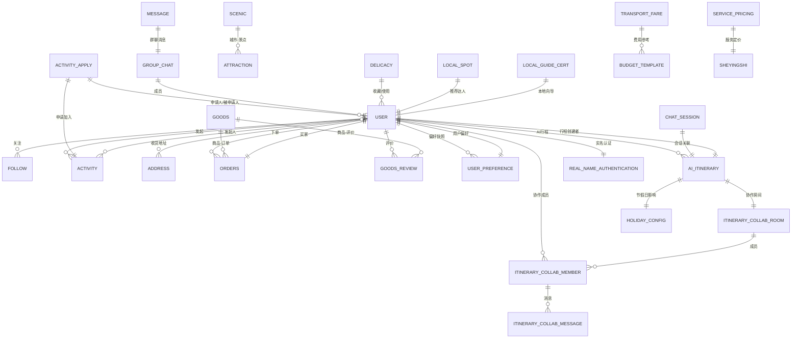

**图表来源**
- [travel_socical.sql](file://travel_socical.sql)
- [budget.sql](file://springboot-travel-social/src/main/resources/sql/budget.sql)
- [itinerary_collab.sql](file://springboot-travel-social/src/main/resources/sql/itinerary_collab.sql)
- [local_spot.sql](file://springboot-travel-social/src/main/resources/sql/local_spot.sql)
- [holiday_config.sql](file://springboot-travel-social/src/main/resources/sql/holiday_config.sql)
- [nearby_services.sql](file://springboot-travel-social/src/main/resources/sql/nearby_services.sql)
- [方案①-个性化AI推荐.md](file://方案①-个性化AI推荐.md)
- [方案④-多人行程协作.md](file://方案④-多人行程协作.md)
- [方案⑥-预算智能拆解.md](file://方案⑥-预算智能拆解.md)

**章节来源**
- [travel_socical.sql](file://travel_socical.sql)
- [budget.sql](file://springboot-travel-social/src/main/resources/sql/budget.sql)
- [itinerary_collab.sql](file://springboot-travel-social/src/main/resources/sql/itinerary_collab.sql)
- [local_spot.sql](file://springboot-travel-social/src/main/resources/sql/local_spot.sql)
- [holiday_config.sql](file://springboot-travel-social/src/main/resources/sql/holiday_config.sql)
- [nearby_services.sql](file://springboot-travel-social/src/main/resources/sql/nearby_services.sql)
- [方案①-个性化AI推荐.md](file://方案①-个性化AI推荐.md)
- [方案④-多人行程协作.md](file://方案④-多人行程协作.md)
- [方案⑥-预算智能拆解.md](file://方案⑥-预算智能拆解.md)

## 详细组件分析

### 用户与认证表
- user：用户基本信息、状态、时间戳、逻辑删除。
- follow：用户关注关系，双向关注。
- real_name_authentication：实名认证信息，绑定用户。

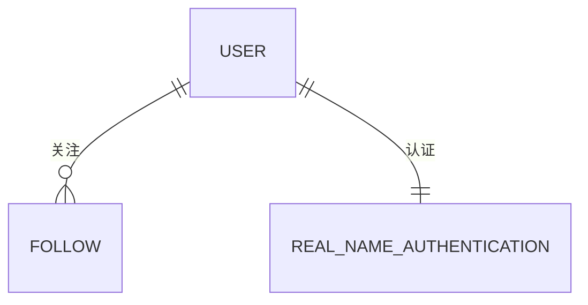

**图表来源**
- [travel_socical.sql](file://travel_socical.sql)

**章节来源**
- [travel_socical.sql](file://travel_socical.sql)

### 用户偏好数据模型（新增）
- user_preference：用户旅行偏好快照表，用于存储用户的个性化偏好信息，支持AI智能推荐和行程规划。

```mermaid
erDiagram
USER ||--|| USER_PREFERENCE : "偏好快照"
USER_PREFERENCE {
id: 主键
user_id: 用户ID
tags: 偏好标签(JSON数组)
visited_cities: 去过城市(JSON数组)
last_trip_city: 最近一次出行城市
last_trip_date: 最近一次出行日期
spending_level: 消费水平(low/mid/high/luxury)
travel_style: 旅行风格摘要
ai_summary: 供注入AI的用户画像摘要
data_version: 数据版本号
expire_at: 快照过期时间
}
```

**图表来源**
- [UserPreference.java](file://springboot-travel-social/src/main/java/com/cxx/entity/UserPreference.java)
- [方案①-个性化AI推荐.md](file://方案①-个性化AI推荐.md)

**章节来源**
- [UserPreference.java](file://springboot-travel-social/src/main/java/com/cxx/entity/UserPreference.java)
- [方案①-个性化AI推荐.md](file://方案①-个性化AI推荐.md)

### AI行程数据模型（扩展）
- ai_itinerary：AI生成的行程表，存储用户通过AI生成的个性化旅行计划，现已扩展支持协作行程。

```mermaid
erDiagram
USER ||--o{ AI_ITINERARY : "行程创建"
AI_ITINERARY ||--|| ITINERARY_COLLAB_ROOM : "协作房间"
AI_ITINERARY ||--|| HOLIDAY_CONFIG : "节假日影响"
AI_ITINERARY {
id: 主键
user_id: 用户ID
title: 行程标题
destination: 目的地
days: 旅行天数
theme: 旅行主题
budget: 预算
people: 出行人数
content: AI生成的行程内容
cover_img: 封面图URL
session_id: 所属会话ID
collab_room_id: 协作房间ID
is_collab: 是否为协作行程
contributors: 参与协作的用户ID列表(JSON数组)
create_time: 创建时间
deleted: 逻辑删除
}
```

**图表来源**
- [Itinerary.java](file://springboot-travel-social/src/main/java/com/cxx/entity/Itinerary.java)
- [方案④-多人行程协作.md](file://方案④-多人行程协作.md)

**章节来源**
- [Itinerary.java](file://springboot-travel-social/src/main/java/com/cxx/entity/Itinerary.java)
- [方案④-多人行程协作.md](file://方案④-多人行程协作.md)

### 行程协作数据模型（新增）
- itinerary_collab_room：行程协作房间表，管理多人协作的行程规划房间。
- itinerary_collab_member：行程协作成员表，记录房间内的成员信息和角色。
- itinerary_collab_message：行程协作消息记录表，存储房间内的消息内容。

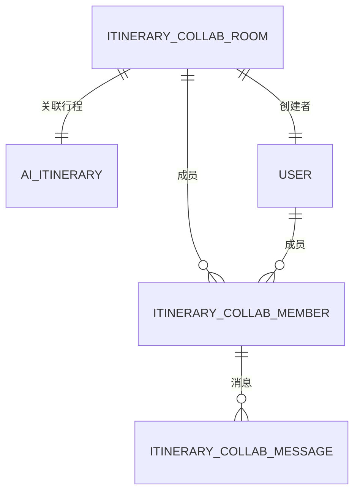

**图表来源**
- [ItineraryCollabRoom.java](file://springboot-travel-social/src/main/java/com/cxx/entity/ItineraryCollabRoom.java)
- [方案④-多人行程协作.md](file://方案④-多人行程协作.md)

**章节来源**
- [ItineraryCollabRoom.java](file://springboot-travel-social/src/main/java/com/cxx/entity/ItineraryCollabRoom.java)
- [方案④-多人行程协作.md](file://方案④-多人行程协作.md)

### 预算模板数据模型（新增）
- transport_fare：城市交通费用参考表，提供不同交通方式的价格参考。
- budget_template：预算主题模板表，定义不同旅行主题的费用系数。

```mermaid
erDiagram
TRANSPORT_FARE ||--|| BUDGET_TEMPLATE : "费用参考"
BUDGET_TEMPLATE {
id: 主键
theme: 旅行主题: family/couple/backpacker/luxury
hotel_factor: 酒店费用系数
food_factor: 餐饮费用系数
ticket_factor: 景点费用系数
misc_factor: 杂费系数占总额比例
desc: 模板说明
}
TRANSPORT_FARE {
id: 主键
city: 目的地城市
origin: 出发地
type: 交通方式: flight/train/bus/self-drive
price_min: 最低参考价元/人
price_max: 最高参考价元/人
duration: 参考时长
remark: 备注
update_time: 更新时间
}
```

**图表来源**
- [TransportFare.java](file://springboot-travel-social/src/main/java/com/cxx/entity/TransportFare.java)
- [方案⑥-预算智能拆解.md](file://方案⑥-预算智能拆解.md)

**章节来源**
- [TransportFare.java](file://springboot-travel-social/src/main/java/com/cxx/entity/TransportFare.java)
- [方案⑥-预算智能拆解.md](file://方案⑥-预算智能拆解.md)

### 节假日配置数据模型（新增）
- holiday_config：节假日配置表，管理节假日日期、名称、是否节假日、出行高峰等级等信息。

```mermaid
erDiagram
HOLIDAY_CONFIG {
id: 主键
holiday_date: 节假日日期
holiday_name: 节假日名称，如五一、国庆
is_holiday: 1=节假日 0=调休工作日
peak_level: 出行高峰等级 1=一般 2=高峰 3=超高峰
tip: 出行建议，如景区限流建议提前预约
year: 所属年份
create_time: 创建时间
update_time: 更新时间
}
AI_ITINERARY ||--o{ HOLIDAY_CONFIG : "节假日影响"
```

**图表来源**
- [HolidayConfig.java](file://springboot-travel-social/src/main/java/com/cxx/entity/HolidayConfig.java)
- [holiday_config.sql](file://springboot-travel-social/src/main/resources/sql/holiday_config.sql)

**章节来源**
- [HolidayConfig.java](file://springboot-travel-social/src/main/java/com/cxx/entity/HolidayConfig.java)
- [holiday_config.sql](file://springboot-travel-social/src/main/resources/sql/holiday_config.sql)

### 本地景点数据模型（新增）
- local_spot：本地小众地点知识库，存储本地达人推荐的优质小众景点。
- local_guide_cert：本地向导认证表，管理本地向导的认证信息。

```mermaid
erDiagram
LOCAL_SPOT ||--|| USER : "推荐达人"
LOCAL_GUIDE_CERT ||--|| USER : "本地向导"
LOCAL_SPOT {
id: 主键
name: 地点名称
city: 所在城市
province: 所在省份
address: 详细地址
description: 地点描述
tips: 实用tips
best_season: 最佳游览季节
image_url: 代表图片URL
source_blog_id: 来源博客ID
source_user_id: 推荐达人用户ID
category: 类别：natural/culture/food/art/market/other
quality_score: 综合质量分(0-100)
view_count: 被引用次数
is_active: 是否上架
is_featured: 是否精选
is_verified: 是否人工审核
create_time: 创建时间
update_time: 更新时间
}
LOCAL_GUIDE_CERT {
id: 主键
user_id: 用户ID
city: 认证擅长城市
intro: 向导简介
cert_level: 1=本地达人 2=资深向导 3=官方推荐
status: 0=审核中 1=已认证 2=已撤销
apply_time: 申请时间
cert_time: 审核通过时间
}
```

**图表来源**
- [LocalSpot.java](file://springboot-travel-social/src/main/java/com/cxx/entity/LocalSpot.java)
- [LocalGuideCert.java](file://springboot-travel-social/src/main/java/com/cxx/entity/LocalGuideCert.java)
- [local_spot.sql](file://springboot-travel-social/src/main/resources/sql/local_spot.sql)

**章节来源**
- [LocalSpot.java](file://springboot-travel-social/src/main/java/com/cxx/entity/LocalSpot.java)
- [LocalGuideCert.java](file://springboot-travel-social/src/main/java/com/cxx/entity/LocalGuideCert.java)
- [local_spot.sql](file://springboot-travel-social/src/main/resources/sql/local_spot.sql)

### 周边服务数据模型（扩展）
- sheyingshi：摄影师服务表，现已扩展价格描述、服务城市、评分等字段。
- service_pricing：服务定价配置表，提供解耦的服务定价管理。

```mermaid
erDiagram
SHEYINGSHI ||--o{ SERVICE_PRICING : "定价配置"
SHEYINGSHI {
id: 主键
xm: 姓名
dh: 电话
email: 邮箱
tx: 头像
jb: 级别
price_desc: 价格描述，如"500元/天"
city: 服务城市，NULL表示全国
rating: 综合评分
zt: 状态
scbz: 删除标志
}
SERVICE_PRICING {
id: 主键
service_type: 服务类型: photographer/driver/guide
service_id: 关联服务人员ID
price_desc: 价格描述，如"500元/天"
price_min: 最低起价
city: 服务城市，NULL表示全国
is_active: 是否上架 1是 0否
update_time: 更新时间
}
```

**图表来源**
- [nearby_services.sql](file://springboot-travel-social/src/main/resources/sql/nearby_services.sql)

**章节来源**
- [nearby_services.sql](file://springboot-travel-social/src/main/resources/sql/nearby_services.sql)

### 商品评价数据模型（新增）
- goods_review：商品评价表，关联用户与商品，含评分、评价内容、图片、订单号、时间戳、逻辑删除。

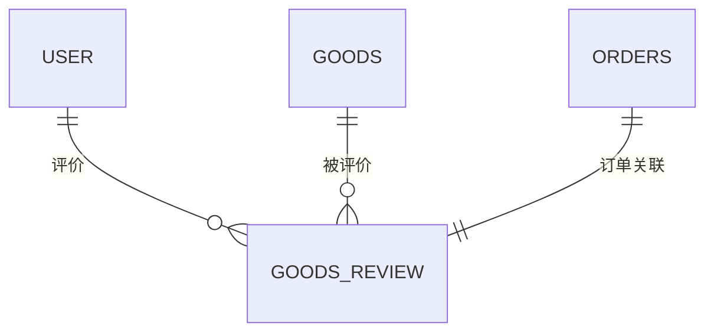

**图表来源**
- [GoodsReview.java](file://springboot-travel-social/src/main/java/com/cxx/entity/GoodsReview.java)

**章节来源**
- [GoodsReview.java](file://springboot-travel-social/src/main/java/com/cxx/entity/GoodsReview.java)

### 结伴与活动表
- activity：用户发起的结伴信息，含标题、内容、图片、时间、地址、期望人数等。
- activity_apply：结伴申请，含申请人、被申请人、联系方式、性别、自我介绍、同意状态等。

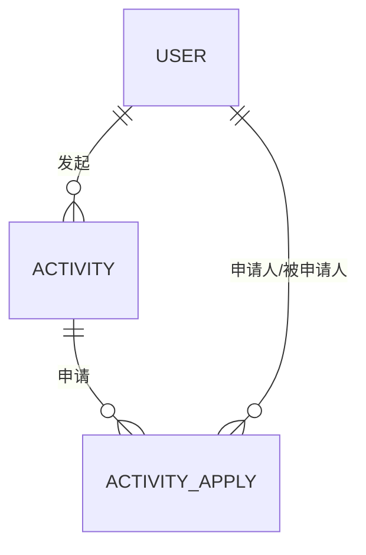

**图表来源**
- [travel_socical.sql](file://travel_socical.sql)

**章节来源**
- [travel_socical.sql](file://travel_socical.sql)

### 地址与订单表
- address：用户收货地址，默认地址标记。
- orders：订单表，关联用户与商品，含订单号、收货人、电话、地址、状态、时间戳、逻辑删除。

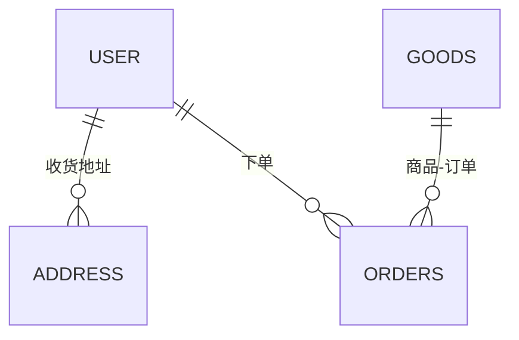

**图表来源**
- [travel_socical.sql](file://travel_socical.sql)

**章节来源**
- [travel_socical.sql](file://travel_socical.sql)

### 景点与美食表
- attractions：景点信息，含省、名称、地址、介绍、价格、图片、位置、评分、状态。
- delicacy：地方美食，含省、名称、描述、图片、时间戳。

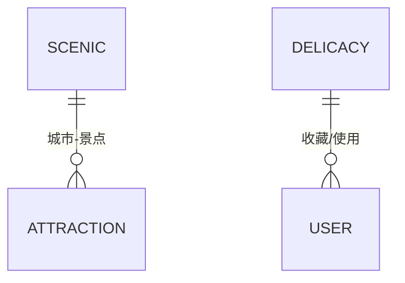

**图表来源**
- [travel_socical.sql](file://travel_socical.sql)

**章节来源**
- [travel_socical.sql](file://travel_socical.sql)

### 内容与消息表
- blog：游记，含标题、图片、内容、位置、标签、音乐、状态、时间戳、逻辑删除。
- comments：评论（未在本节详述，见脚本中 comments 表）。
- video、video_comments：视频与视频评论。
- group_chat：群聊，含群主、名称、头像、关联活动。
- message：消息，含消息ID、类型、发送/接收方、时间戳、负载（JSON）。

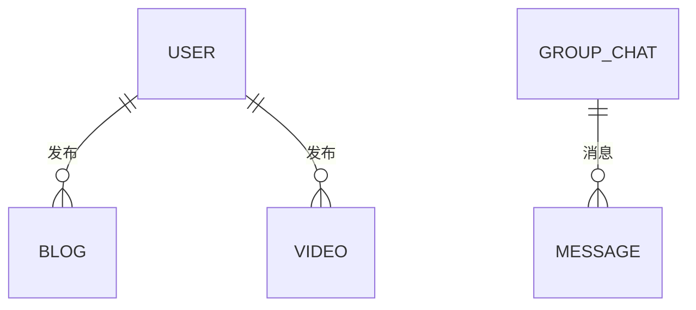

**图表来源**
- [travel_socical.sql](file://travel_socical.sql)

**章节来源**
- [travel_socical.sql](file://travel_socical.sql)

### 运营与积分表
- credits：积分相关（未在本节详述，见脚本中 credits 表）。
- prize：奖品，含名称、图片、概率、序号。
- sys_*：系统配置、菜单、字典、定时任务、登录日志等。

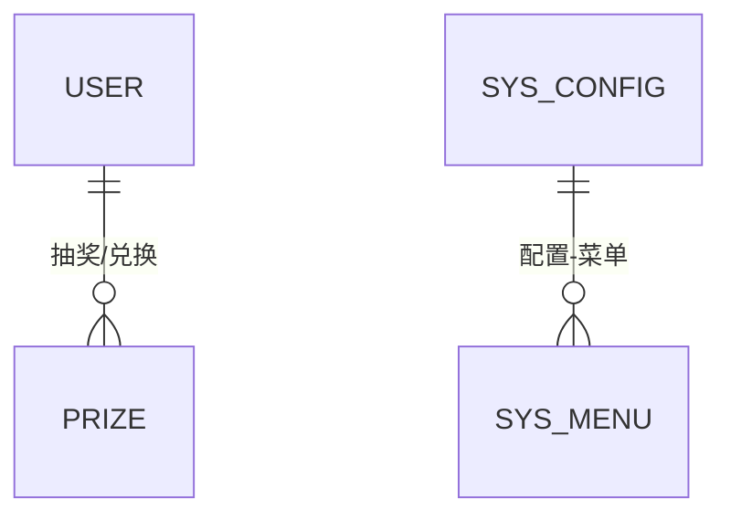

**图表来源**
- [travel_socical.sql](file://travel_socical.sql)

**章节来源**
- [travel_socical.sql](file://travel_socical.sql)

## 依赖分析
- 外键与逻辑删除：多表使用逻辑删除（deleted 字段），避免物理删除造成的数据丢失风险。
- 时间戳填充：实体类普遍使用 MyBatis Plus 的自动填充注解，确保创建/更新时间一致性。
- 字段命名与类型：遵循业务语义，如 user_id、goods_id、order_no 等，便于关联查询与维护。
- 商品评价服务：GoodsReviewService 提供评价查询和提交功能，通过 GoodsReviewMapper 进行数据库操作。
- 用户偏好服务：UserPreferenceService 提供用户偏好快照管理，支持AI智能推荐。
- AI行程服务：AIController 提供智能行程生成，结合用户偏好和AI大模型能力。
- 行程协作服务：ItineraryCollabService 管理多人协作房间、成员和消息，支持实时协作规划。
- 预算模板服务：BudgetTemplateService 提供预算模板管理，支持不同旅行主题的费用拆解。
- 节假日配置服务：HolidayConfigService 提供节假日配置管理，支持节假日感知和出行建议。
- 本地向导服务：LocalSpotService 和 LocalGuideCertService 提供本地向导认证和小众景点管理。
- 周边服务扩展：nearby_services.sql 扩展了 sheyingshi 表的字段，并新增 service_pricing 表。
- 新增表间依赖：ai_itinerary 与 itinerary_collab_room 的协作关系，itinerary_collab_room 与 itinerary_collab_member 的成员关系，itinerary_collab_member 与 itinerary_collab_message 的消息关系，transport_fare 与 budget_template 的费用参考关系，holiday_config 与 ai_itinerary 的节假日影响关系，local_spot 与 user 的推荐关系，local_guide_cert 与 user 的认证关系，service_pricing 与 sheyingshi 的定价关系。

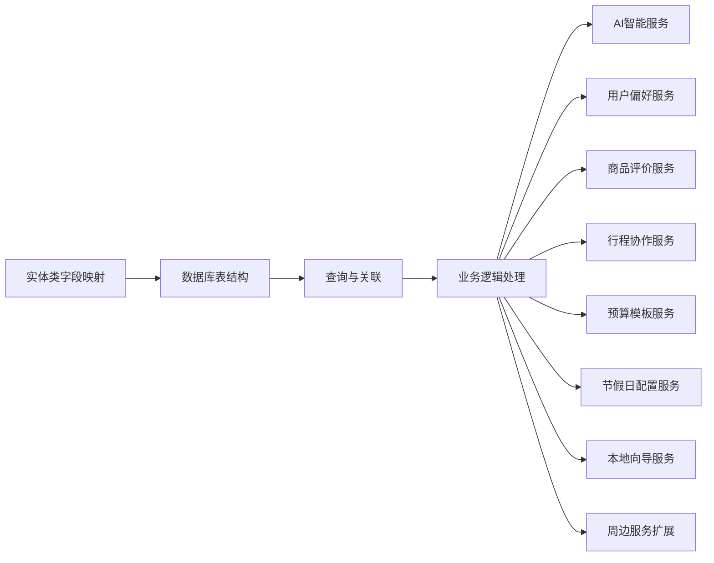

**图表来源**
- [UserPreference.java](file://springboot-travel-social/src/main/java/com/cxx/entity/UserPreference.java)
- [Itinerary.java](file://springboot-travel-social/src/main/java/com/cxx/entity/Itinerary.java)
- [GoodsReview.java](file://springboot-travel-social/src/main/java/com/cxx/entity/GoodsReview.java)
- [ItineraryCollabRoom.java](file://springboot-travel-social/src/main/java/com/cxx/entity/ItineraryCollabRoom.java)
- [LocalSpot.java](file://springboot-travel-social/src/main/java/com/cxx/entity/LocalSpot.java)
- [LocalGuideCert.java](file://springboot-travel-social/src/main/java/com/cxx/entity/LocalGuideCert.java)
- [TransportFare.java](file://springboot-travel-social/src/main/java/com/cxx/entity/TransportFare.java)
- [HolidayConfig.java](file://springboot-travel-social/src/main/java/com/cxx/entity/HolidayConfig.java)
- [方案①-个性化AI推荐.md](file://方案①-个性化AI推荐.md)
- [方案④-多人行程协作.md](file://方案④-多人行程协作.md)
- [方案⑥-预算智能拆解.md](file://方案⑥-预算智能拆解.md)

**章节来源**
- [UserPreference.java](file://springboot-travel-social/src/main/java/com/cxx/entity/UserPreference.java)
- [Itinerary.java](file://springboot-travel-social/src/main/java/com/cxx/entity/Itinerary.java)
- [GoodsReview.java](file://springboot-travel-social/src/main/java/com/cxx/entity/GoodsReview.java)
- [ItineraryCollabRoom.java](file://springboot-travel-social/src/main/java/com/cxx/entity/ItineraryCollabRoom.java)
- [LocalSpot.java](file://springboot-travel-social/src/main/java/com/cxx/entity/LocalSpot.java)
- [LocalGuideCert.java](file://springboot-travel-social/src/main/java/com/cxx/entity/LocalGuideCert.java)
- [TransportFare.java](file://springboot-travel-social/src/main/java/com/cxx/entity/TransportFare.java)
- [HolidayConfig.java](file://springboot-travel-social/src/main/java/com/cxx/entity/HolidayConfig.java)
- [方案①-个性化AI推荐.md](file://方案①-个性化AI推荐.md)
- [方案④-多人行程协作.md](file://方案④-多人行程协作.md)
- [方案⑥-预算智能拆解.md](file://方案⑥-预算智能拆解.md)

## 性能考量
- 索引策略
  - 主键索引：所有表的主键（AUTO_INCREMENT）默认具备主键索引。
  - 查询热点字段：user_id、order_no、goods_id、activity_id、group_chat_id、message_id、rating 等建议建立普通索引，加速关联查询与分页。
  - 时间字段：create_time、update_time 建立索引，支持按时间范围查询与排序。
  - JSON 负载：message.payload 为 JSON 类型，如需检索可考虑冗余字段或全文索引（视引擎支持）。
  - 商品评价：goods_review 表的 goods_id、user_id、create_time 建议建立复合索引，优化评价查询性能。
  - 用户偏好：user_preference 表的 user_id、expire_at 建议建立索引，优化偏好查询与过期检查。
  - AI行程：ai_itinerary 表的 user_id、create_time、session_id、collab_room_id 建议建立索引，优化行程查询与会话关联。
  - 协作房间：itinerary_collab_room 表的 invite_code、creator_id、expire_at 建议建立索引，优化房间查询与过期检查。
  - 协作成员：itinerary_collab_member 表的 room_id、user_id 建议建立复合索引，优化成员查询。
  - 协作消息：itinerary_collab_message 表的 room_id、create_time 建议建立复合索引，优化消息查询。
  - 预算模板：budget_template 表的 theme 建议建立唯一索引，确保主题唯一性。
  - 交通费用：transport_fare 表的 city 建议建立索引，优化城市查询。
  - 节假日配置：holiday_config 表的 holiday_date、year 建议建立索引，优化节假日查询。
  - 本地景点：local_spot 表的 city、province、category、quality_score 建议建立复合索引，优化小众景点查询。
  - 本地向导：local_guide_cert 表的 user_id、city、cert_level 建议建立复合索引，优化向导查询。
  - 周边服务：service_pricing 表的 service_type、service_id、city 建议建立复合索引，优化服务查询。
  - JSON 负载：message.payload 为 JSON 类型，如需检索可考虑冗余字段或全文索引（视引擎支持）。
- 查询优化
  - 分页查询：对高频分页场景（如 blog、video、orders、goods_review、ai_itinerary、local_spot）使用 LIMIT + ORDER BY + 索引组合。
  - 关联查询：尽量使用 JOIN 并限定返回字段，避免 SELECT *。
  - 缓存：对热点数据（如 scenic、attractions、goods、goods_review、user_preference、transport_fare、local_spot）引入 Redis 缓存，降低数据库压力。
  - 偏好快照：user_preference 支持快照机制，减少重复计算，提高AI推荐性能。
  - 协作消息：itinerary_collab_message 支持按房间和时间的高效查询，配合WebSocket实现实时推送。
  - 预算拆解：budget_template 与 transport_fare 的组合查询，支持快速预算计算。
  - 节假日感知：holiday_config 支持按日期范围查询，提供节假日出行建议。
  - 本地向导：local_spot 与 local_guide_cert 的关联查询，支持向导认证和景点推荐。
  - 周边服务：service_pricing 与 sheyingshi 的关联查询，支持服务定价和推荐。
- 分表分库
  - 按时间分表：orders、message、blog、goods_review、ai_itinerary、local_spot 等按月/日拆分，降低单表数据量。
  - 按业务分库：用户/订单库、内容/消息库、评价库、AI服务库、协作房间库、预算库、节假日库、本地向导库、周边服务库分离，提升扩展性与可用性。
- 存储与归档
  - 历史数据归档：对超过一年的日志、消息、订单、评价、AI行程、本地景点数据进行归档存储，减少在线库压力。
  - 冷热分离：热数据驻留在线库，冷数据迁移至对象存储或离线库。

## 故障排查指南
- 登录与安全
  - sys_logininfor 记录登录行为，可通过 status、msg 快速定位验证码错误、用户封禁等问题。
  - sys_config 中 captchaEnabled、registerUser、blackIPList 等参数影响登录策略。
- 消息与群聊
  - message 表 payload 为 JSON，检查消息格式与媒体资源 URL 是否有效。
  - group_chat 与 message 关联，确认群主与活动 ID 是否正确。
- 订单与商品
  - orders 表 status 字段表示订单状态，核对与 goods 库存变化是否一致。
  - goods.deleted 逻辑删除需注意查询时排除已删除记录。
- 商品评价
  - goods_review 表 rating 字段取值范围为 1-5，服务层已做默认值处理。
  - 评价图片存储为 JSON 数组字符串，需确保格式正确。
  - 评价查询需注意 deleted 字段过滤，确保只显示有效评价。
- 实名认证
  - real_name_authentication 与 user 关联，确认 user_id 是否匹配，照片与信息是否合规。
- 用户偏好
  - user_preference 表支持快照过期机制，expire_at 字段控制缓存有效期。
  - data_version 字段用于标记数据版本，行为变化时自动递增。
  - ai_summary 字段为AI注入的用户画像摘要，确保格式正确。
- AI行程
  - ai_itinerary 表支持逻辑删除，deleted 字段控制数据可见性。
  - session_id 字段关联聊天会话，确保行程与对话上下文一致。
  - content 字段存储AI生成的详细行程内容，注意长度控制和格式规范。
  - 协作行程：collab_room_id 字段标识协作来源，is_collab 标识协作状态，contributors 记录参与者。
  - 节假日影响：holiday_config 与 ai_itinerary 关联，提供节假日出行建议。
- 行程协作
  - itinerary_collab_room 表的 invite_code 唯一性，expire_at 控制过期时间。
  - itinerary_collab_member 表的 role 字段区分房主和成员，preference_input 记录偏好输入。
  - itinerary_collab_message 表支持消息类型区分（text/ai-plan/system），role 字段标识消息角色。
- 预算模板
  - budget_template 表的 theme 字段唯一性，确保旅行主题唯一。
  - hotel_factor、food_factor、ticket_factor、misc_factor 字段控制费用系数。
  - transport_fare 表的 city、type 字段支持交通费用查询。
- 节假日配置
  - holiday_config 表的 holiday_date 唯一性，确保节假日日期唯一。
  - is_holiday 字段标识节假日状态，peak_level 字段标识出行高峰等级。
  - tip 字段提供出行建议，year 字段标识所属年份。
- 本地景点
  - local_spot 表的 city、category、quality_score 字段支持小众景点查询。
  - is_active、is_featured、is_verified 字段控制景点展示状态。
  - source_blog_id、source_user_id 字段关联推荐来源。
- 本地向导
  - local_guide_cert 表的 user_id、city、cert_level 字段支持向导认证查询。
  - status 字段标识认证状态，apply_time、cert_time 字段记录认证时间。
- 周边服务
  - sheyingshi 表的 price_desc、city、rating 字段支持服务查询。
  - service_pricing 表的 service_type、service_id、city 字段支持定价查询。
- WebSocket 实时通信
  - 协作房间消息通过现有WebSocket连接广播，房间ID区分消息类型。
  - 系统消息、成员加入、AI生成结果等不同类型消息格式标准化。

**章节来源**
- [travel_socical.sql](file://travel_socical.sql)
- [UserPreference.java](file://springboot-travel-social/src/main/java/com/cxx/entity/UserPreference.java)
- [Itinerary.java](file://springboot-travel-social/src/main/java/com/cxx/entity/Itinerary.java)
- [GoodsReview.java](file://springboot-travel-social/src/main/java/com/cxx/entity/GoodsReview.java)
- [ItineraryCollabRoom.java](file://springboot-travel-social/src/main/java/com/cxx/entity/ItineraryCollabRoom.java)
- [LocalSpot.java](file://springboot-travel-social/src/main/java/com/cxx/entity/LocalSpot.java)
- [LocalGuideCert.java](file://springboot-travel-social/src/main/java/com/cxx/entity/LocalGuideCert.java)
- [TransportFare.java](file://springboot-travel-social/src/main/java/com/cxx/entity/TransportFare.java)
- [HolidayConfig.java](file://springboot-travel-social/src/main/java/com/cxx/entity/HolidayConfig.java)
- [方案①-个性化AI推荐.md](file://方案①-个性化AI推荐.md)
- [方案④-多人行程协作.md](file://方案④-多人行程协作.md)
- [方案⑥-预算智能拆解.md](file://方案⑥-预算智能拆解.md)

## 结论
本数据库设计围绕"用户社交 + 旅游内容 + 商品运营 + 商品评价 + 用户偏好 + AI行程 + 行程协作 + 预算模板 + 节假日配置 + 本地向导 + 周边服务"的核心业务，表结构清晰、字段语义明确、外键与逻辑删除策略完善。新增的用户偏好数据模型、AI行程数据模型、商品评价数据模型、行程协作数据模型、预算模板数据模型、节假日配置数据模型、本地景点知识库数据模型、本地向导认证数据模型和周边服务扩展数据模型进一步完善了系统的个性化推荐、智能行程规划、多人协作、预算智能拆解、节假日感知、本地向导服务和周边服务直连能力，结合索引、查询优化、分表分库与缓存策略，可满足高并发场景下的性能与稳定性需求。建议持续完善敏感字段加密、审计日志与自动化备份，确保数据安全与可恢复性。

## 附录

### 数据字典与字段说明
- user
  - 字段：id、username、password、email、avatar、status、createTime、updateTime、deleted
  - 说明：用户基本信息与状态，password、status 使用 JSON 注解忽略序列化，createTime/updateTime 支持自动填充
- follow
  - 字段：id、userId、followUserId、createTime
  - 说明：用户关注关系，支持双向关注
- activity
  - 字段：id、userId、activityTitle、activityContent、activityImage、activityAddress、activityTime、wishCount、createTime、updateTime、deleted
  - 说明：结伴活动信息，包含期望人数与时间
- activity_apply
  - 字段：id、applyUserId、applyActivityId、activityUserId、agree、telephone、sex、introduce、createTime
  - 说明：结伴申请与同意状态
- address
  - 字段：id、userId、name、phone、region、detail、isDefault、createTime
  - 说明：用户收货地址，默认地址标记
- orders
  - 字段：id、orderNo、userId、name、phone、goodsId、status、address、createTime、deleted
  - 说明：订单表，关联用户与商品
- goods
  - 字段：id、image、goodsDesc、price、unit、stock、createTime、updateTime、deleted
  - 说明：积分商品，含库存与单位
- attractions
  - 字段：id、province、name、address、introduce、price、image、location、rate、status
  - 说明：景点信息，含评分与状态
- real_name_authentication
  - 字段：id、userId、faceImage、name、code、nation、cardImage、createTime、updateTime
  - 说明：实名认证信息
- message
  - 字段：id、messageId、type、senderId、receiverId、timestamp、payload
  - 说明：消息表，payload 为 JSON，支持文本、图片、音频等
- group_chat
  - 字段：id、ownerId、name、avatar、activityId、createTime
  - 说明：群聊信息，关联活动
- goods_review（新增）
  - 字段：id、goodsId、userId、orderNo、rating、content、images、createTime、updateTime、deleted
  - 说明：商品评价表，含评分、评价内容、图片、订单号
- user_preference（新增）
  - 字段：id、userId、tags、visitedCities、lastTripCity、lastTripDate、spendingLevel、travelStyle、aiSummary、dataVersion、expireAt、createTime、updateTime
  - 说明：用户旅行偏好快照，支持AI个性化推荐
- ai_itinerary（扩展）
  - 字段：id、userId、title、destination、days、theme、budget、people、content、coverImg、sessionId、collabRoomId、isCollab、contributors、createTime、deleted
  - 说明：AI生成的行程，支持智能行程规划和协作标记
- itinerary_collab_room（新增）
  - 字段：id、inviteCode、itineraryId、creatorId、title、destination、days、maxMembers、status、aiSummary、expireAt、createTime、updateTime
  - 说明：行程协作房间，管理多人协作规划
- itinerary_collab_member（新增）
  - 字段：id、roomId、userId、role、nickname、avatar、preferenceInput、joinTime
  - 说明：协作房间成员，记录成员信息和偏好输入
- itinerary_collab_message（新增）
  - 字段：id、roomId、userId、role、content、msgType、nickname、avatar、createTime
  - 说明：协作房间消息记录，支持多种消息类型
- transport_fare（新增）
  - 字段：id、city、origin、type、priceMin、priceMax、duration、remark、updateTime
  - 说明：城市交通费用参考，支持不同交通方式的价格查询
- budget_template（新增）
  - 字段：id、theme、hotelFactor、foodFactor、ticketFactor、miscFactor、desc
  - 说明：预算主题模板，定义不同旅行主题的费用系数
- holiday_config（新增）
  - 字段：id、holidayDate、holidayName、isHoliday、peakLevel、tip、year、createTime、updateTime
  - 说明：节假日配置，管理节假日日期、名称、状态和出行建议
- local_spot（新增）
  - 字段：id、name、city、province、address、description、tips、bestSeason、imageUrl、sourceBlogId、sourceUserId、category、qualityScore、viewCount、isActive、isFeatured、isVerified、createTime、updateTime
  - 说明：本地小众地点知识库，支持质量评分和精选展示
- local_guide_cert（新增）
  - 字段：id、userId、city、intro、certLevel、status、applyTime、certTime
  - 说明：本地向导认证表，支持多级别认证管理
- sheyingshi（扩展）
  - 字段：id、xm、dh、email、tx、jb、priceDesc、city、rating、zt、scbz
  - 说明：摄影师服务表，扩展价格描述、服务城市、评分字段
- service_pricing（新增）
  - 字段：id、serviceType、serviceId、priceDesc、priceMin、city、isActive、updateTime
  - 说明：服务定价配置表，提供解耦的服务定价管理
- sys_logininfor
  - 字段：infoId、userName、ipaddr、loginLocation、browser、os、status、msg、loginTime
  - 说明：登录行为记录，支持按状态与时间查询

**章节来源**
- [travel_socical.sql](file://travel_socical.sql)
- [budget.sql](file://springboot-travel-social/src/main/resources/sql/budget.sql)
- [itinerary_collab.sql](file://springboot-travel-social/src/main/resources/sql/itinerary_collab.sql)
- [local_spot.sql](file://springboot-travel-social/src/main/resources/sql/local_spot.sql)
- [holiday_config.sql](file://springboot-travel-social/src/main/resources/sql/holiday_config.sql)
- [nearby_services.sql](file://springboot-travel-social/src/main/resources/sql/nearby_services.sql)
- [方案①-个性化AI推荐.md](file://方案①-个性化AI推荐.md)
- [方案④-多人行程协作.md](file://方案④-多人行程协作.md)
- [方案⑥-预算智能拆解.md](file://方案⑥-预算智能拆解.md)

### 索引与约束建议
- 建议索引
  - user：username（唯一）、email（唯一）
  - follow：userId、followUserId（复合唯一）
  - activity：userId、createTime
  - activity_apply：applyUserId、applyActivityId、activityUserId
  - address：userId、isDefault
  - orders：userId、orderNo、goodsId、status、createTime
  - goods：deleted、createTime
  - attractions：province、name、rate
  - real_name_authentication：userId（唯一）
  - message：senderId、receiverId、timestamp
  - group_chat：ownerId、activityId
  - goods_review：goodsId、userId、create_time（新增）
  - user_preference：user_id、expire_at（新增）
  - ai_itinerary：user_id、create_time、session_id、collab_room_id（扩展）
  - itinerary_collab_room：invite_code（唯一）、creator_id、expire_at（新增）
  - itinerary_collab_member：room_id、user_id（复合唯一）（新增）
  - itinerary_collab_message：room_id、create_time（新增）
  - budget_template：theme（唯一）（新增）
  - transport_fare：city（新增）
  - holiday_config：holiday_date、year（新增）
  - local_spot：city、province、category、quality_score（新增）
  - local_guide_cert：user_id、city、cert_level（新增）
  - service_pricing：service_type、service_id、city（新增）
  - sys_logininfor：status、loginTime
- 约束
  - 所有表主键约束（PRIMARY KEY）
  - user.email、real_name_authentication.code 建议唯一约束
  - orders.status、goods.deleted、goods_review.deleted、ai_itinerary.deleted 使用枚举或状态码约束
  - goods_review.rating 建议添加 CHECK 约束确保 1-5 范围
  - user_preference.data_version 默认值设置，expire_at 设置合理过期策略
  - itinerary_collab_room.max_members 默认值设置，status 状态枚举约束
  - itinerary_collab_member.role 角色枚举约束（owner/member）
  - budget_template.theme 唯一约束，费用系数默认值设置
  - transport_fare.city、type 组合唯一性约束
  - holiday_config.holiday_date 唯一约束，is_holiday、peak_level 状态枚举约束
  - local_spot.category 取值范围约束，quality_score 默认值设置
  - local_guide_cert.cert_level 级别枚举约束，status 状态枚举约束
  - service_pricing.service_type 取值范围约束，is_active 默认值设置

**章节来源**
- [travel_socical.sql](file://travel_socical.sql)
- [budget.sql](file://springboot-travel-social/src/main/resources/sql/budget.sql)
- [itinerary_collab.sql](file://springboot-travel-social/src/main/resources/sql/itinerary_collab.sql)
- [local_spot.sql](file://springboot-travel-social/src/main/resources/sql/local_spot.sql)
- [holiday_config.sql](file://springboot-travel-social/src/main/resources/sql/holiday_config.sql)
- [nearby_services.sql](file://springboot-travel-social/src/main/resources/sql/nearby_services.sql)
- [方案①-个性化AI推荐.md](file://方案①-个性化AI推荐.md)
- [方案④-多人行程协作.md](file://方案④-多人行程协作.md)
- [方案⑥-预算智能拆解.md](file://方案⑥-预算智能拆解.md)

### 数据安全与备份策略
- 数据加密
  - 敏感字段（如 password、phone、身份证号、评价内容、用户偏好信息、实名认证信息、向导认证信息）建议在传输与存储层面加密
  - 日志与审计记录避免明文存储敏感信息
  - AI生成内容（ai_itinerary.content）建议进行内容安全检查
  - 协作房间邀请码采用唯一性保证，避免易混淆字符
  - 预算模板和节假日配置数据建议进行访问控制
  - 本地景点和向导认证数据建议进行内容审核
- 访问控制
  - 数据库账号最小权限原则，区分读写账号
  - 应用层鉴权与接口限流，防止暴力破解
  - 商品评价服务需验证用户身份，防止恶意评价
  - 用户偏好服务需验证用户权限，防止数据泄露
  - 协作房间访问需验证邀请码和成员身份
  - 预算模板和节假日配置需管理员权限控制
  - 本地向导认证需审核流程，防止虚假认证
  - 周边服务定价需平台审核，防止价格欺诈
- 定期备份
  - 全量备份 + 增量备份 + binlog 归档
  - 跨机房异地备份，确保 RPO/RTO 满足业务要求
  - AI行程数据定期备份，支持用户行程恢复
  - 协作房间数据定期清理过期邀请码和历史消息
  - 预算模板和节假日配置数据定期备份
  - 本地景点和向导认证数据定期备份
- 合规与审计
  - 实名认证与敏感操作记录审计日志
  - 商品评价内容需符合相关法规要求
  - 用户偏好数据需符合隐私保护要求
  - AI生成内容需进行内容安全审核
  - 协作房间消息需符合通信记录保存要求
  - 预算模板和节假日配置需符合财务和统计要求
  - 本地向导认证需符合导游管理规定
  - 周边服务定价需符合价格监管要求

### 数据库迁移与版本管理最佳实践
- 版本化脚本
  - 以版本号命名 SQL 文件，如 v1.0.0.sql、v1.0.1.sql，记录变更内容与回滚步骤
  - 新增用户偏好表、AI行程扩展字段、协作房间相关表、预算模板表、节假日配置表、本地景点表、本地向导认证表、周边服务扩展表需在迁移脚本中明确表结构与索引定义
  - 新增AI相关表结构需考虑与现有表的关联关系
  - 协作房间表结构需考虑邀请码唯一性和过期时间控制
  - 预算数据迁移：建立预算模板初始化数据，确保费用系数合理
  - 节假日数据迁移：导入预置节假日配置，确保覆盖目标年份
  - 本地景点数据迁移：导入小众地点知识库，确保分类和质量评分合理
  - 向导认证数据迁移：导入本地向导认证信息，确保级别和状态正确
  - 周边服务数据迁移：扩展 sheyingshi 表字段，建立服务定价配置
- 迁移策略
  - 增量迁移：先添加列/索引，再更新数据，最后启用约束
  - 无锁 DDL：使用在线 DDL 工具，避免长时间锁表
  - 数据兼容性：确保现有用户数据与新的偏好表结构兼容
  - AI数据迁移：评估现有用户行为数据，建立合理的偏好计算逻辑
  - 协作数据迁移：迁移现有AI行程数据，添加协作相关字段
  - 本地数据迁移：迁移现有景点数据，添加小众景点和向导认证字段
  - 周边数据迁移：迁移现有服务数据，添加定价配置和扩展字段
- 回滚与验证
  - 迁移前备份，迁移后执行校验查询与抽样测试
  - 异常回滚：准备逆向 SQL 或使用数据库自带回滚能力
  - 性能验证：验证新增索引对查询性能的影响
  - 功能验证：验证用户偏好注入、协作房间功能、预算拆解、节假日感知、本地向导服务、周边服务直连的正确性
- 自动化
  - CI/CD 集成迁移脚本，自动化执行与结果通知
  - 配置管理：通过 sys_config 动态调整行为，减少频繁变更
  - 用户偏好迁移：建立合理的索引策略，确保偏好查询性能
  - AI服务迁移：确保AI模型接口与数据库结构的兼容性
  - 协作服务迁移：确保WebSocket消息路由和房间管理功能正常
  - 预算服务迁移：确保预算模板和费用计算逻辑正确
  - 节假日服务迁移：确保节假日配置和出行建议功能正常
  - 本地向导服务迁移：确保小众景点推荐和向导认证功能正常
  - 周边服务迁移：确保服务定价和推荐功能正常
- 新增表迁移
  - user_preference 表需建立用户偏好计算逻辑，支持快照机制
  - ai_itinerary 表需建立协作相关字段，支持多人协作行程
  - itinerary_collab_room 表需建立邀请码生成和过期控制逻辑
  - transport_fare 表需建立交通费用参考数据，支持预算计算
  - budget_template 表需建立预算模板初始化逻辑，支持不同旅行主题
  - holiday_config 表需建立节假日配置初始化逻辑，支持节假日感知
  - local_spot 表需建立小众景点初始化逻辑，支持质量评分和分类
  - local_guide_cert 表需建立向导认证初始化逻辑，支持多级别认证
  - sheyingshi 表需建立扩展字段，支持价格描述、服务城市、评分
  - service_pricing 表需建立服务定价配置逻辑，支持解耦定价管理
  - 实施数据清理策略，定期清理过期的偏好快照、历史行程数据、协作房间、预算模板、节假日配置、小众景点、向导认证和历史服务数据
- 接口兼容性
  - 保持现有API接口不变，新增协作相关接口
  - 用户偏好接口支持强制刷新和快照有效期控制
  - AI行程接口支持个人和协作两种模式
  - 协作房间接口支持创建、加入、消息发送和行程生成
  - 预算接口支持模板选择和费用拆解
  - 节假日接口支持日期查询和出行建议
  - 本地向导接口支持认证查询和景点推荐
  - 周边服务接口支持定价查询和服务推荐

**章节来源**
- [UserPreference.java](file://springboot-travel-social/src/main/java/com/cxx/entity/UserPreference.java)
- [Itinerary.java](file://springboot-travel-social/src/main/java/com/cxx/entity/Itinerary.java)
- [GoodsReview.java](file://springboot-travel-social/src/main/java/com/cxx/entity/GoodsReview.java)
- [ItineraryCollabRoom.java](file://springboot-travel-social/src/main/java/com/cxx/entity/ItineraryCollabRoom.java)
- [LocalSpot.java](file://springboot-travel-social/src/main/java/com/cxx/entity/LocalSpot.java)
- [LocalGuideCert.java](file://springboot-travel-social/src/main/java/com/cxx/entity/LocalGuideCert.java)
- [TransportFare.java](file://springboot-travel-social/src/main/java/com/cxx/entity/TransportFare.java)
- [HolidayConfig.java](file://springboot-travel-social/src/main/java/com/cxx/entity/HolidayConfig.java)
- [方案①-个性化AI推荐.md](file://方案①-个性化AI推荐.md)
- [方案④-多人行程协作.md](file://方案④-多人行程协作.md)
- [方案⑥-预算智能拆解.md](file://方案⑥-预算智能拆解.md)