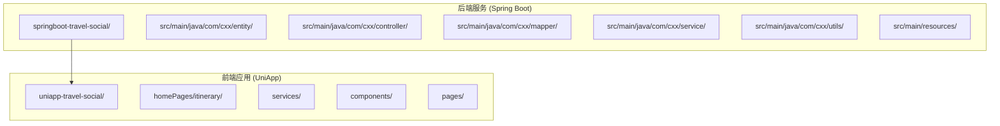
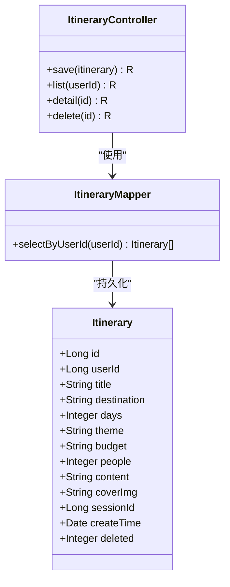
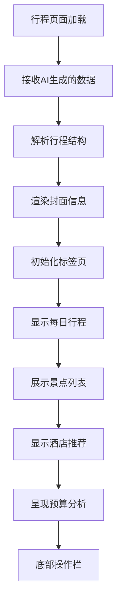
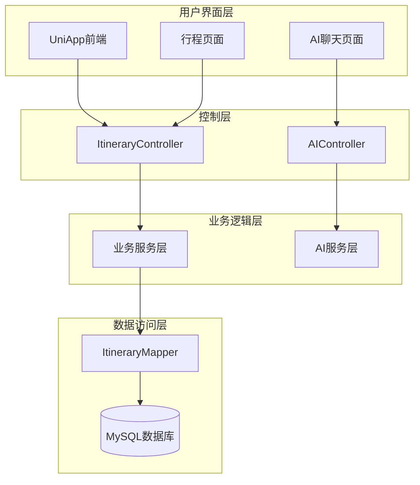
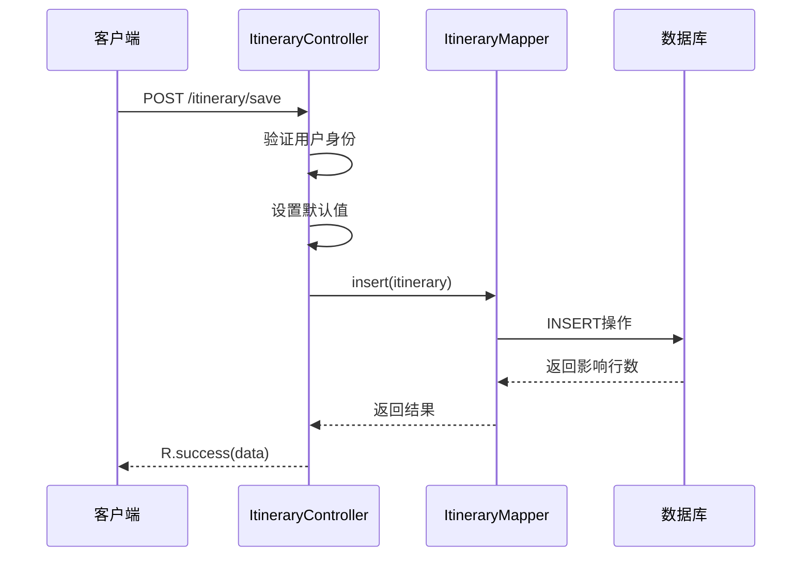
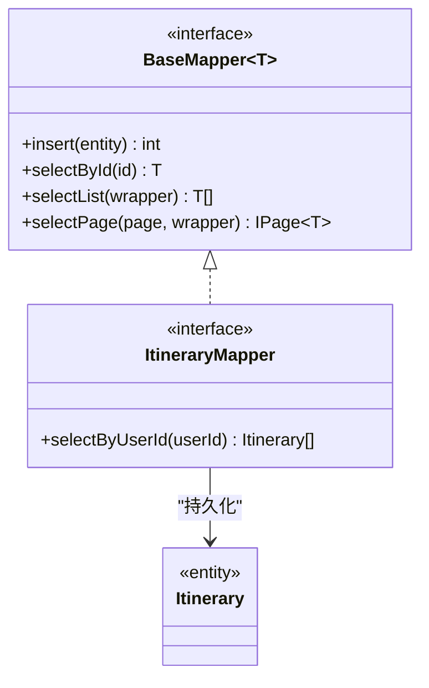
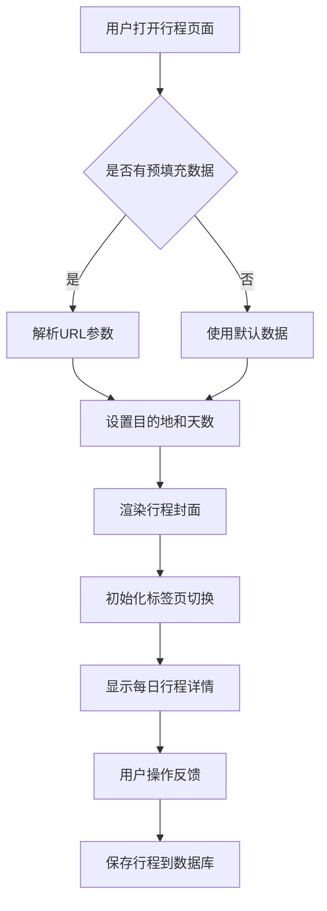
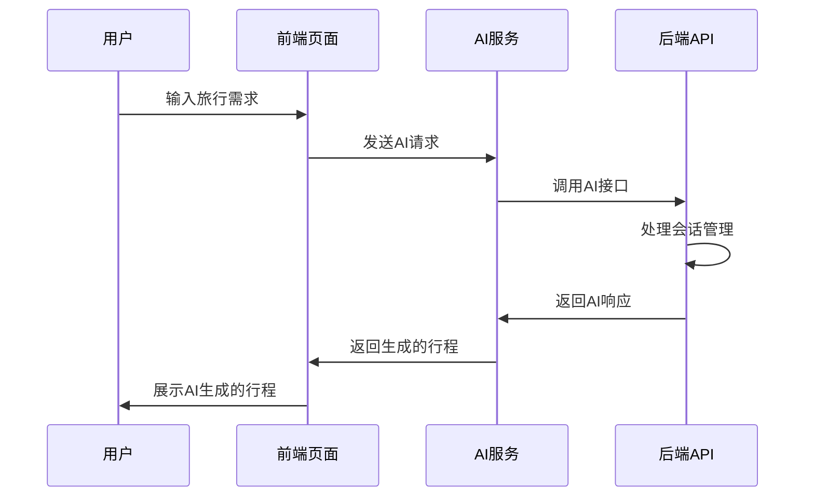
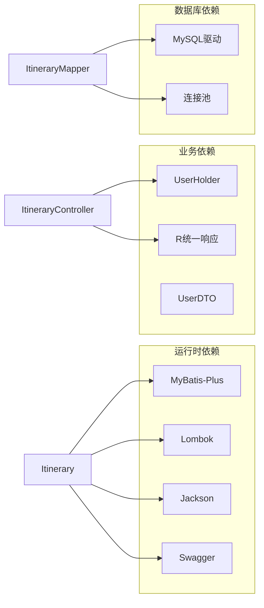

# 行程数据模型

<cite>
**本文档引用的文件**
- [Itinerary.java](file://springboot-travel-social/src/main/java/com/cxx/entity/Itinerary.java)
- [ItineraryController.java](file://springboot-travel-social/src/main/java/com/cxx/controller/ItineraryController.java)
- [ItineraryMapper.java](file://springboot-travel-social/src/main/java/com/cxx/mapper/ItineraryMapper.java)
- [UserHolder.java](file://springboot-travel-social/src/main/java/com/cxx/utils/UserHolder.java)
- [UserDTO.java](file://springboot-travel-social/src/main/java/com/cxx/dto/UserDTO.java)
- [R.java](file://springboot-travel-social/src/main/java/com/cxx/entity/R.java)
- [itinerary.vue](file://uniapp-travel-social/homePages/itinerary/itinerary.vue)
- [aiService.js](file://uniapp-travel-social/services/aiService.js)
- [travel_socical.sql](file://travel_socical.sql)
</cite>

## 更新摘要
**变更内容**
- 新增完整的AI行程生成和管理功能
- 更新数据模型字段说明，增加会话ID关联
- 完善前后端交互流程和API接口文档
- 增强用户认证和权限管理机制

## 目录
1. [简介](#简介)
2. [项目结构](#项目结构)
3. [核心组件](#核心组件)
4. [架构概览](#架构概览)
5. [详细组件分析](#详细组件分析)
6. [AI智能集成](#ai智能集成)
7. [依赖关系分析](#依赖关系分析)
8. [性能考量](#性能考量)
9. [故障排除指南](#故障排除指南)
10. [结论](#结论)

## 简介

本文档深入分析了旅行社交小程序中的行程数据模型，这是一个基于Spring Boot + UniApp构建的完整旅行规划系统。该系统的核心功能是通过AI生成个性化旅行行程，并提供完整的行程管理能力。

系统采用前后端分离架构，后端使用Java Spring Boot框架，前端使用UniApp跨平台框架。行程数据模型是整个系统的核心，负责存储和管理AI生成的旅行计划。系统集成了完整的AI聊天功能，支持会话管理和智能行程生成。

## 项目结构

该项目采用标准的Maven项目结构，主要分为两个部分：



**图表来源**
- [Itinerary.java:1-65](file://springboot-travel-social/src/main/java/com/cxx/entity/Itinerary.java#L1-L65)
- [itinerary.vue:1-722](file://uniapp-travel-social/homePages/itinerary/itinerary.vue#L1-L722)

**章节来源**
- [Itinerary.java:1-65](file://springboot-travel-social/src/main/java/com/cxx/entity/Itinerary.java#L1-L65)
- [ItineraryController.java:1-123](file://springboot-travel-social/src/main/java/com/cxx/controller/ItineraryController.java#L1-L123)

## 核心组件

### 数据模型核心

行程数据模型围绕`Itinerary`实体展开，该实体使用MyBatis-Plus注解进行ORM映射：



**图表来源**
- [Itinerary.java:21-64](file://springboot-travel-social/src/main/java/com/cxx/entity/Itinerary.java#L21-L64)
- [ItineraryController.java:23-122](file://springboot-travel-social/src/main/java/com/cxx/controller/ItineraryController.java#L23-L122)
- [ItineraryMapper.java:11-18](file://springboot-travel-social/src/main/java/com/cxx/mapper/ItineraryMapper.java#L11-L18)

### 前端展示组件

前端使用Vue.js框架构建，行程页面提供了完整的UI展示：



**图表来源**
- [itinerary.vue:264-402](file://uniapp-travel-social/homePages/itinerary/itinerary.vue#L264-L402)

**章节来源**
- [Itinerary.java:13-64](file://springboot-travel-social/src/main/java/com/cxx/entity/Itinerary.java#L13-L64)
- [itinerary.vue:1-722](file://uniapp-travel-social/homePages/itinerary/itinerary.vue#L1-L722)

## 架构概览

系统采用经典的三层架构模式，实现了完整的旅行行程管理流程：



**图表来源**
- [ItineraryController.java:19-23](file://springboot-travel-social/src/main/java/com/cxx/controller/ItineraryController.java#L19-L23)
- [ItineraryMapper.java:10-11](file://springboot-travel-social/src/main/java/com/cxx/mapper/ItineraryMapper.java#L10-L11)

## 详细组件分析

### 数据模型设计

行程数据模型采用了标准化的字段设计，确保了数据的完整性和一致性：

| 字段名 | 类型 | 描述 | 必填 |
|--------|------|------|------|
| id | Long | 主键ID | 是 |
| userId | Long | 用户标识 | 是 |
| title | String | 行程标题 | 否 |
| destination | String | 目的地 | 是 |
| days | Integer | 旅行天数 | 是 |
| theme | String | 旅行主题 | 否 |
| budget | String | 预算信息 | 否 |
| people | Integer | 出行人数 | 否 |
| content | String | AI生成内容 | 否 |
| coverImg | String | 封面图片URL | 否 |
| sessionId | Long | 会话ID | 否 |
| createTime | Date | 创建时间 | 否 |
| deleted | Integer | 逻辑删除标记 | 否 |

### 控制器实现

控制器层提供了完整的RESTful API接口：



**图表来源**
- [ItineraryController.java:32-67](file://springboot-travel-social/src/main/java/com/cxx/controller/ItineraryController.java#L32-L67)

### 数据访问层

数据访问层使用MyBatis-Plus简化了数据库操作：



**图表来源**
- [ItineraryMapper.java:3-11](file://springboot-travel-social/src/main/java/com/cxx/mapper/ItineraryMapper.java#L3-L11)

### 前端交互流程

前端页面提供了完整的用户交互体验：



**图表来源**
- [itinerary.vue:355-376](file://uniapp-travel-social/homePages/itinerary/itinerary.vue#L355-L376)

**章节来源**
- [ItineraryController.java:27-121](file://springboot-travel-social/src/main/java/com/cxx/controller/ItineraryController.java#L27-L121)
- [ItineraryMapper.java:13-17](file://springboot-travel-social/src/main/java/com/cxx/mapper/ItineraryMapper.java#L13-L17)
- [itinerary.vue:377-402](file://uniapp-travel-social/homePages/itinerary/itinerary.vue#L377-L402)

## AI智能集成

系统集成了完整的AI智能功能，支持智能行程生成和会话管理：

### AI聊天服务



**图表来源**
- [aiService.js:52-85](file://uniapp-travel-social/services/aiService.js#L52-L85)

### 会话管理机制

系统支持智能会话管理，用户可以：
- 创建新的AI会话
- 查看历史会话列表
- 在会话中继续对话
- 删除不需要的会话

**章节来源**
- [aiService.js:143-175](file://uniapp-travel-social/services/aiService.js#L143-L175)

## 依赖关系分析

系统各组件之间的依赖关系清晰明确：



**图表来源**
- [Itinerary.java:3-11](file://springboot-travel-social/src/main/java/com/cxx/entity/Itinerary.java#L3-L11)
- [UserHolder.java:1-20](file://springboot-travel-social/src/main/java/com/cxx/utils/UserHolder.java#L1-L20)
- [R.java:1-32](file://springboot-travel-social/src/main/java/com/cxx/entity/R.java#L1-L32)

**章节来源**
- [UserHolder.java:5-18](file://springboot-travel-social/src/main/java/com/cxx/utils/UserHolder.java#L5-L18)
- [UserDTO.java:8-12](file://springboot-travel-social/src/main/java/com/cxx/dto/UserDTO.java#L8-L12)
- [R.java:14-30](file://springboot-travel-social/src/main/java/com/cxx/entity/R.java#L14-L30)

## 性能考量

系统在设计时充分考虑了性能优化：

1. **数据库层面**
   - 使用逻辑删除避免物理删除造成的数据丢失
   - 合理的索引设计支持高频查询
   - 连接池配置优化数据库连接性能

2. **缓存策略**
   - 前端页面数据缓存减少重复请求
   - 用户会话信息本地存储提升用户体验

3. **API设计**
   - 统一的响应格式便于前端处理
   - 错误处理机制保证系统稳定性

4. **AI服务优化**
   - 会话复用减少重复计算
   - 异步处理提升响应速度

## 故障排除指南

### 常见问题及解决方案

1. **用户未登录问题**
   ```java
   // 检查用户身份验证
   try {
       Long userId = UserHolder.getUser().getId();
       itinerary.setUserId(userId);
   } catch (Exception ignore) {
       // 前端直接传入 userId
   }
   ```

2. **数据保存失败**
   - 检查数据库连接配置
   - 验证实体类字段映射
   - 查看MyBatis日志输出

3. **行程查询异常**
   - 确认用户ID参数传递
   - 检查逻辑删除字段值
   - 验证数据库表结构

4. **AI服务连接失败**
   - 检查后端服务是否启动
   - 验证网络连接和端口
   - 查看AI服务日志

**章节来源**
- [ItineraryController.java:35-45](file://springboot-travel-social/src/main/java/com/cxx/controller/ItineraryController.java#L35-L45)

## 结论

该行程数据模型设计合理，实现了以下核心目标：

1. **完整性**：涵盖了旅行行程的所有关键要素
2. **智能化**：集成了AI聊天功能，支持智能行程生成
3. **可扩展性**：支持AI生成内容和用户自定义编辑
4. **易用性**：前后端分离架构提供了良好的用户体验
5. **可维护性**：清晰的代码结构和文档支持后续开发
6. **会话管理**：完整的AI会话生命周期管理

系统通过AI技术实现了智能化的旅行规划，为用户提供了个性化的旅行体验。数据模型的设计充分考虑了实际应用场景，为旅行社交小程序的成功实施奠定了坚实基础。新增的AI智能集成功能进一步提升了系统的智能化水平，为用户提供了更加便捷和个性化的旅行规划服务。