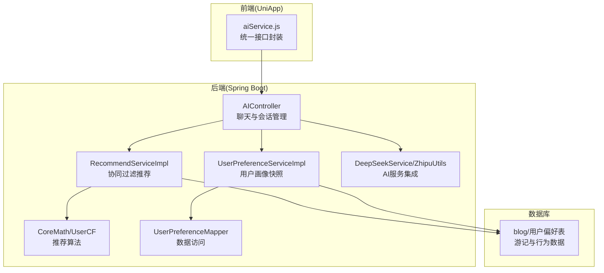
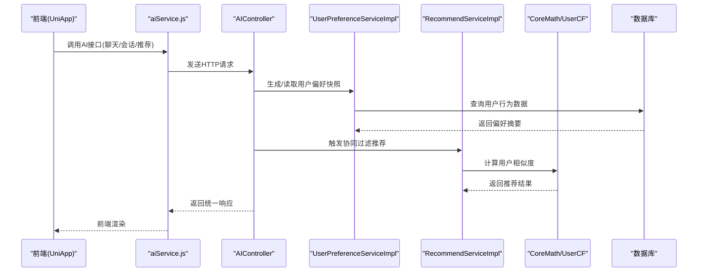
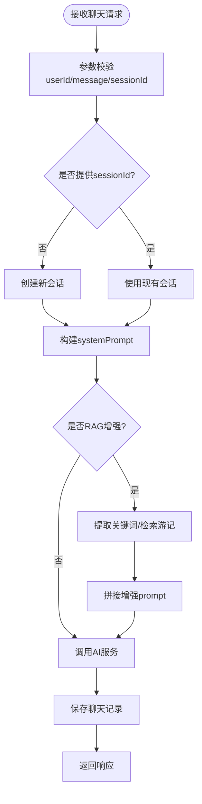
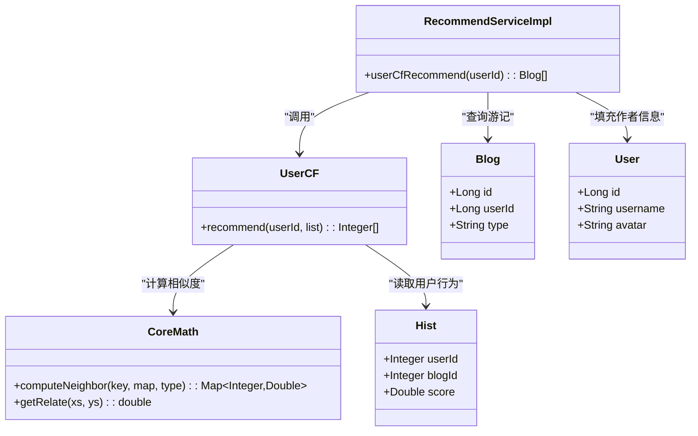
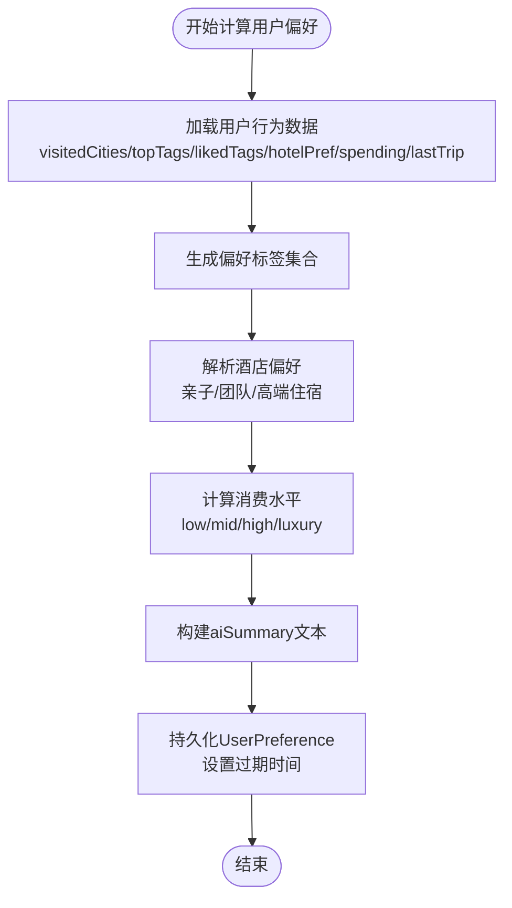
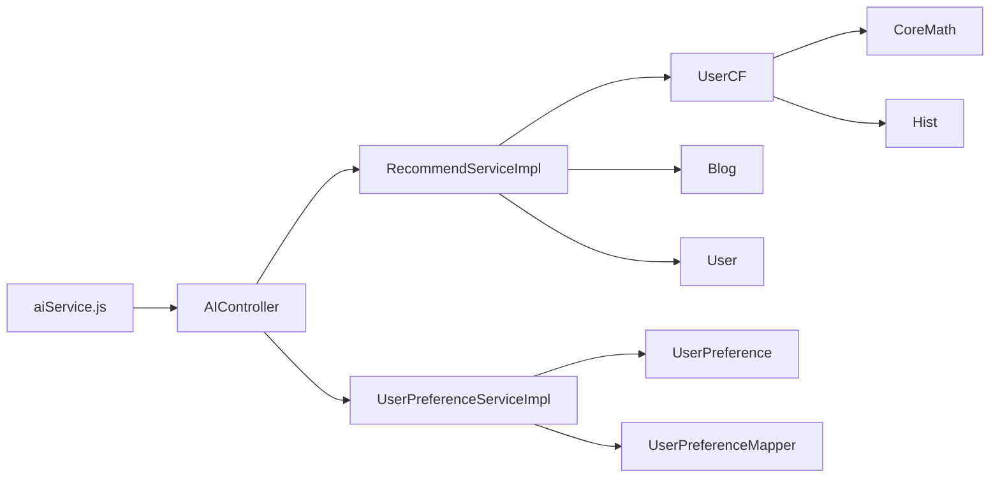

# 方案① 个性化AI推荐

<cite>
**本文档引用的文件**
- [AIController.java](file://springboot-travel-social/src/main/java/com/cxx/controller/AIController.java)
- [RecommendServiceImpl.java](file://springboot-travel-social/src/main/java/com/cxx/service/impl/RecommendServiceImpl.java)
- [UserCF.java](file://springboot-travel-social/src/main/java/com/cxx/core/UserCF.java)
- [CoreMath.java](file://springboot-travel-social/src/main/java/com/cxx/core/CoreMath.java)
- [UserPreference.java](file://springboot-travel-social/src/main/java/com/cxx/entity/UserPreference.java)
- [UserPreferenceMapper.java](file://springboot-travel-social/src/main/java/com/cxx/mapper/UserPreferenceMapper.java)
- [UserPreferenceServiceImpl.java](file://springboot-travel-social/src/main/java/com/cxx/service/impl/UserPreferenceServiceImpl.java)
- [RecommendService.java](file://springboot-travel-social/src/main/java/com/cxx/service/RecommendService.java)
- [Hist.java](file://springboot-travel-social/src/main/java/com/cxx/entity/Hist.java)
- [aiService.js](file://uniapp-travel-social/services/aiService.js)
- [application.properties](file://springboot-travel-social/src/main/resources/application.properties)
- [XingHuoConfig.java](file://springboot-travel-social/src/main/java/com/cxx/config/XingHuoConfig.java)
- [ZhipuConfig.java](file://springboot-travel-social/src/main/java/com/cxx/config/ZhipuConfig.java)
- [ZhipuUtils.java](file://springboot-travel-social/src/main/java/com/cxx/utils/ZhipuUtils.java)
- [travel_socical.sql](file://travel_socical.sql)
</cite>

## 目录
1. [简介](#简介)
2. [项目结构](#项目结构)
3. [核心组件](#核心组件)
4. [架构概览](#架构概览)
5. [详细组件分析](#详细组件分析)
6. [依赖关系分析](#依赖关系分析)
7. [性能考量](#性能考量)
8. [故障排查指南](#故障排查指南)
9. [结论](#结论)

## 简介
本方案围绕"个性化AI推荐"构建，结合用户画像、协同过滤推荐与AI增强聊天能力，为用户提供智能化的旅游内容推荐与交互体验。系统包含：
- 用户画像快照：基于用户行为数据生成旅行偏好摘要，注入AI系统提示词
- 协同过滤推荐：基于用户相似度计算，推荐相似用户看过的优质游记
- AI聊天增强：支持RAG检索增强、会话管理、行程生成等能力
- 前后端协作：UniApp前端通过统一服务封装调用后端接口

## 项目结构
后端采用Spring Boot工程，按职责分层组织：
- controller：对外HTTP接口，负责参数校验与业务编排
- service：业务逻辑层，包含推荐与用户偏好服务
- core：核心算法模块，实现Pearson相关系数与UserCF推荐
- entity/mapper：数据模型与持久层
- utils/config：工具类与第三方集成配置
- resources：配置文件与SQL脚本

**图表来源**
- [AIController.java:1-610](file://springboot-travel-social/src/main/java/com/cxx/controller/AIController.java#L1-L610)
- [RecommendServiceImpl.java:1-64](file://springboot-travel-social/src/main/java/com/cxx/service/impl/RecommendServiceImpl.java#L1-L64)
- [UserPreferenceServiceImpl.java:1-227](file://springboot-travel-social/src/main/java/com/cxx/service/impl/UserPreferenceServiceImpl.java#L1-L227)
- [CoreMath.java:1-89](file://springboot-travel-social/src/main/java/com/cxx/core/CoreMath.java#L1-L89)
- [UserCF.java:1-41](file://springboot-travel-social/src/main/java/com/cxx/core/UserCF.java#L1-L41)
- [ZhipuUtils.java:1-206](file://springboot-travel-social/src/main/java/com/cxx/utils/ZhipuUtils.java#L1-L206)

**章节来源**
- [AIController.java:1-610](file://springboot-travel-social/src/main/java/com/cxx/controller/AIController.java#L1-L610)
- [application.properties:1-64](file://springboot-travel-social/src/main/resources/application.properties#L1-L64)

## 核心组件
- AI聊天控制器：提供简单聊天、通用聊天、RAG增强聊天、会话管理、行程生成等接口
- 协同过滤推荐服务：基于用户相似度与Pearson相关系数，推荐相似用户看过的游记
- 用户偏好快照服务：聚合用户游记、订单、浏览等行为，生成旅行偏好摘要并注入AI系统提示
- AI服务集成：封装DeepSeek与Zhipu AI调用，支持多模态与异步聊天

**章节来源**
- [RecommendServiceImpl.java:1-64](file://springboot-travel-social/src/main/java/com/cxx/service/impl/RecommendServiceImpl.java#L1-L64)
- [UserPreferenceServiceImpl.java:1-227](file://springboot-travel-social/src/main/java/com/cxx/service/impl/UserPreferenceServiceImpl.java#L1-L227)
- [ZhipuUtils.java:1-206](file://springboot-travel-social/src/main/java/com/cxx/utils/ZhipuUtils.java#L1-L206)

## 架构概览
系统采用前后端分离架构，前端通过aiService.js统一调用后端REST接口，后端控制器编排服务层与数据访问层，核心算法在core包中实现。

**图表来源**
- [aiService.js:1-324](file://uniapp-travel-social/services/aiService.js#L1-L324)
- [AIController.java:1-610](file://springboot-travel-social/src/main/java/com/cxx/controller/AIController.java#L1-L610)
- [UserPreferenceServiceImpl.java:1-227](file://springboot-travel-social/src/main/java/com/cxx/service/impl/UserPreferenceServiceImpl.java#L1-L227)
- [RecommendServiceImpl.java:1-64](file://springboot-travel-social/src/main/java/com/cxx/service/impl/RecommendServiceImpl.java#L1-L64)
- [CoreMath.java:1-89](file://springboot-travel-social/src/main/java/com/cxx/core/CoreMath.java#L1-L89)
- [UserCF.java:1-41](file://springboot-travel-social/src/main/java/com/cxx/core/UserCF.java#L1-L41)

## 详细组件分析

### AI聊天控制器
- 功能范围：简单聊天、通用聊天、RAG增强聊天、会话管理、行程生成、语音识别占位
- 参数校验：userId、message、sessionId、systemPrompt等字段校验与长度限制
- 会话管理：创建会话、查询会话列表、查询消息记录、删除会话、清空消息
- RAG增强：从关键词或消息中提取地名/主题词，检索平台游记，拼接systemPrompt提升回复可信度
- 行程生成：根据目的地、天数、主题、预算等参数生成结构化行程

**图表来源**
- [AIController.java:136-597](file://springboot-travel-social/src/main/java/com/cxx/controller/AIController.java#L136-L597)

**章节来源**
- [AIController.java:1-610](file://springboot-travel-social/src/main/java/com/cxx/controller/AIController.java#L1-L610)

### 协同过滤推荐服务
- 数据来源：用户浏览历史(Hist)、游记(Blog)、用户(User)
- 推荐流程：按用户分组、计算用户相似度、选择最近邻用户、找出其看过的但当前用户未看过的游记
- 降级策略：若无相似用户，则随机推荐平台游记

**图表来源**
- [RecommendServiceImpl.java:1-64](file://springboot-travel-social/src/main/java/com/cxx/service/impl/RecommendServiceImpl.java#L1-L64)
- [UserCF.java:1-41](file://springboot-travel-social/src/main/java/com/cxx/core/UserCF.java#L1-L41)
- [CoreMath.java:1-89](file://springboot-travel-social/src/main/java/com/cxx/core/CoreMath.java#L1-L89)
- [Hist.java:1-26](file://springboot-travel-social/src/main/java/com/cxx/entity/Hist.java#L1-L26)

**章节来源**
- [RecommendServiceImpl.java:1-64](file://springboot-travel-social/src/main/java/com/cxx/service/impl/RecommendServiceImpl.java#L1-L64)
- [UserCF.java:1-41](file://springboot-travel-social/src/main/java/com/cxx/core/UserCF.java#L1-L41)
- [CoreMath.java:1-89](file://springboot-travel-social/src/main/java/com/cxx/core/CoreMath.java#L1-L89)

### 用户偏好快照服务
- 数据聚合：游记地点(visitedCities)、高频标签(topTags)、点赞博客标签、酒店订单偏好、消费水平、最近一次出行
- 快照生成：构建aiSummary(JSON字段)、设置过期时间、upsert持久化
- 异步刷新：标记用户偏好失效，下次进入AI页面时强制刷新

**图表来源**
- [UserPreferenceServiceImpl.java:60-177](file://springboot-travel-social/src/main/java/com/cxx/service/impl/UserPreferenceServiceImpl.java#L60-L177)

**章节来源**
- [UserPreferenceServiceImpl.java:1-227](file://springboot-travel-social/src/main/java/com/cxx/service/impl/UserPreferenceServiceImpl.java#L1-L227)
- [UserPreference.java:1-74](file://springboot-travel-social/src/main/java/com/cxx/entity/UserPreference.java#L1-L74)
- [UserPreferenceMapper.java:1-52](file://springboot-travel-social/src/main/java/com/cxx/mapper/UserPreferenceMapper.java#L1-L52)

### 前端AI服务封装
- 统一请求封装：统一处理token、响应格式、错误处理
- 接口覆盖：简单聊天、通用聊天、RAG聊天、会话管理、状态检查
- 参数校验：前端基础参数校验，避免无效请求

**章节来源**
- [aiService.js:1-324](file://uniapp-travel-social/services/aiService.js#L1-L324)

### AI服务集成与配置
- 配置类：XingHuoConfig(讯飞)、ZhipuConfig(智谱AI)
- 工具类：ZhipuUtils封装多模态请求，支持文本、图片、多图混合
- 应用配置：application.properties中定义DeepSeek与Zhipu API密钥、基础URL与模型

**章节来源**
- [XingHuoConfig.java:1-32](file://springboot-travel-social/src/main/java/com/cxx/config/XingHuoConfig.java#L1-L32)
- [ZhipuConfig.java:1-20](file://springboot-travel-social/src/main/java/com/cxx/config/ZhipuConfig.java#L1-L20)
- [ZhipuUtils.java:1-206](file://springboot-travel-social/src/main/java/com/cxx/utils/ZhipuUtils.java#L1-L206)
- [application.properties:46-64](file://springboot-travel-social/src/main/resources/application.properties#L46-L64)

## 依赖关系分析
- 控制器依赖服务层：AIController依赖DeepSeekService、ChatRecordService、BlogService
- 服务层依赖数据层：RecommendServiceImpl依赖UserMapper、BlogMapper、HistMapper、BlogService、UserService
- 算法依赖数据模型：UserCF与CoreMath依赖Hist实体
- 前端依赖后端接口：aiService.js封装统一调用

**图表来源**
- [AIController.java:1-610](file://springboot-travel-social/src/main/java/com/cxx/controller/AIController.java#L1-L610)
- [RecommendServiceImpl.java:1-64](file://springboot-travel-social/src/main/java/com/cxx/service/impl/RecommendServiceImpl.java#L1-L64)
- [UserPreferenceServiceImpl.java:1-227](file://springboot-travel-social/src/main/java/com/cxx/service/impl/UserPreferenceServiceImpl.java#L1-L227)
- [UserCF.java:1-41](file://springboot-travel-social/src/main/java/com/cxx/core/UserCF.java#L1-L41)
- [CoreMath.java:1-89](file://springboot-travel-social/src/main/java/com/cxx/core/CoreMath.java#L1-L89)
- [UserPreference.java:1-74](file://springboot-travel-social/src/main/java/com/cxx/entity/UserPreference.java#L1-L74)
- [UserPreferenceMapper.java:1-52](file://springboot-travel-social/src/main/java/com/cxx/mapper/UserPreferenceMapper.java#L1-L52)
- [Hist.java:1-26](file://springboot-travel-social/src/main/java/com/cxx/entity/Hist.java#L1-L26)
- [aiService.js:1-324](file://uniapp-travel-social/services/aiService.js#L1-L324)

**章节来源**
- [RecommendService.java:1-17](file://springboot-travel-social/src/main/java/com/cxx/service/RecommendService.java#L1-L17)

## 性能考量
- 推荐算法复杂度：UserCF按用户分组与相似度计算，整体复杂度与用户数与物品数相关，建议在低频触发或缓存结果
- 数据库查询：UserPreference快照设置过期时间，避免频繁全量计算；推荐服务在无相似用户时降级为随机推荐
- AI调用：支持异步聊天与多模态请求，建议在前端做请求节流与结果缓存
- 网络与配置：合理设置API密钥与基础URL，避免重复初始化客户端

## 故障排查指南
- 参数校验失败：检查前端传参与后端校验逻辑，确保userId、message、sessionId等字段完整
- 会话管理异常：确认ChatRecordService的会话创建与删除逻辑，检查数据库事务
- RAG检索无结果：验证关键词提取逻辑与BlogService检索参数，检查数据库索引
- 推荐为空：检查UserCF相似度计算与降级策略，确认Hist数据完整性
- AI服务不可用：检查application.properties中的API密钥与baseUrl，确认网络连通性

**章节来源**
- [AIController.java:38-134](file://springboot-travel-social/src/main/java/com/cxx/controller/AIController.java#L38-L134)
- [UserPreferenceServiceImpl.java:172-177](file://springboot-travel-social/src/main/java/com/cxx/service/impl/UserPreferenceServiceImpl.java#L172-L177)

## 结论
本方案通过用户画像快照与协同过滤推荐相结合，辅以AI增强聊天与会话管理，构建了完整的个性化AI推荐体系。系统具备良好的扩展性与稳定性，可通过优化算法与缓存策略进一步提升性能与用户体验。