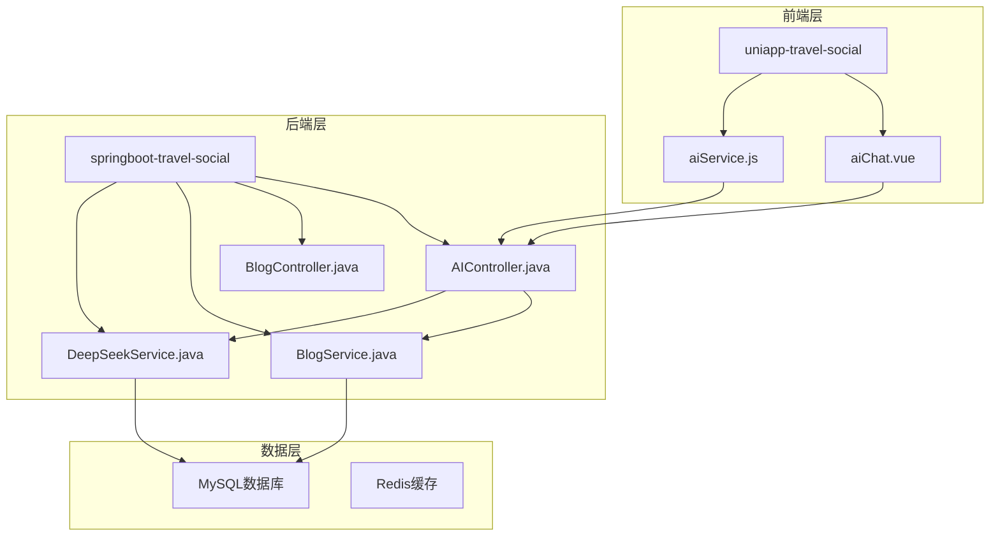
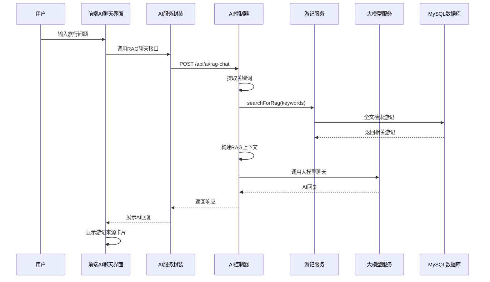
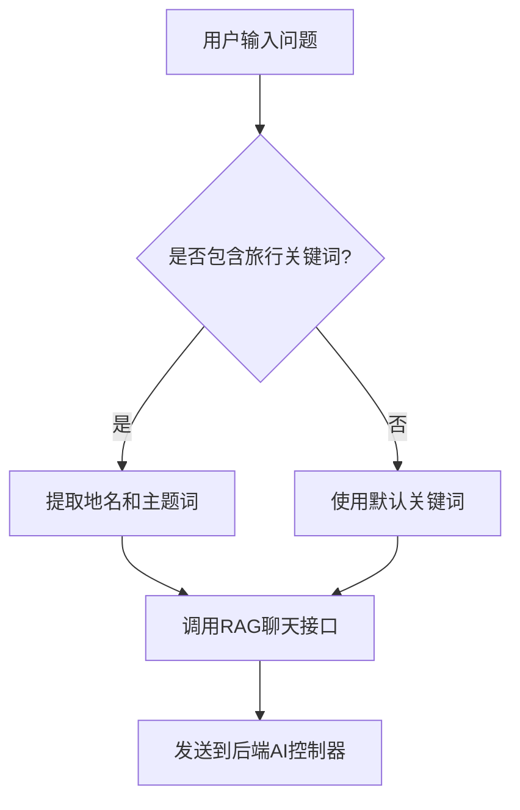
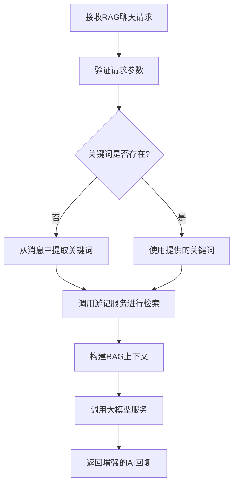
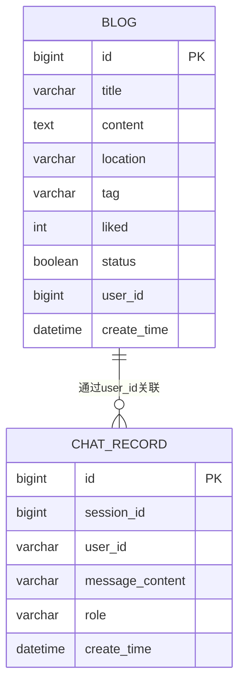
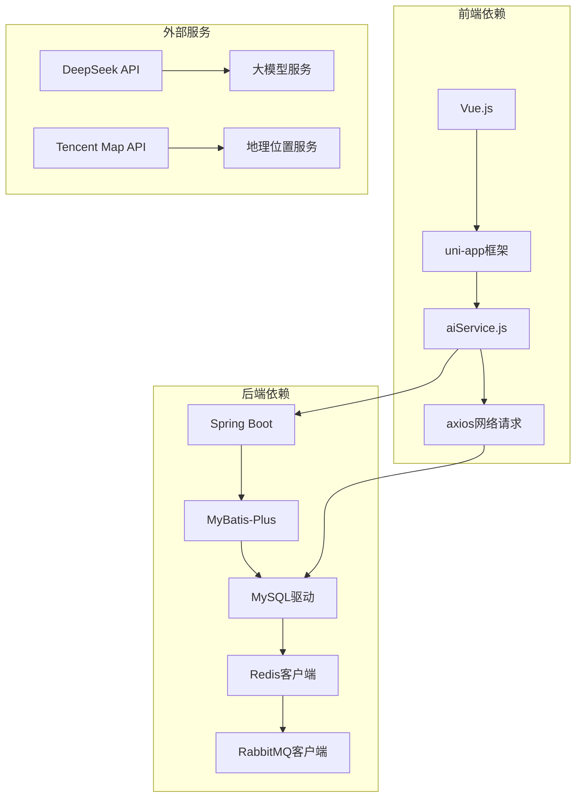

# 方案② 社区攻略RAG

<cite>
**本文档引用的文件**
- [方案②-社区攻略RAG.md](file://方案②-社区攻略RAG.md)
- [AIController.java](file://springboot-travel-social/src/main/java/com/cxx/controller/AIController.java)
- [BlogController.java](file://springboot-travel-social/src/main/java/com/cxx/controller/BlogController.java)
- [BlogService.java](file://springboot-travel-social/src/main/java/com/cxx/service/BlogService.java)
- [Blog.java](file://springboot-travel-social/src/main/java/com/cxx/entity/Blog.java)
- [ChatRecord.java](file://springboot-travel-social/src/main/java/com/cxx/entity/ChatRecord.java)
- [ChatRecordServiceImpl.java](file://springboot-travel-social/src/main/java/com/cxx/service/impl/ChatRecordServiceImpl.java)
- [DeepSeekService.java](file://springboot-travel-social/src/main/java/com/cxx/service/DeepSeekService.java)
- [application.properties](file://springboot-travel-social/src/main/resources/application.properties)
- [aiChat.vue](file://uniapp-travel-social/homePages/aiChat/aiChat.vue)
- [aiService.js](file://uniapp-travel-social/services/aiService.js)
</cite>

## 目录
1. [简介](#简介)
2. [项目结构](#项目结构)
3. [核心组件](#核心组件)
4. [架构概览](#架构概览)
5. [详细组件分析](#详细组件分析)
6. [依赖分析](#依赖分析)
7. [性能考虑](#性能考虑)
8. [故障排除指南](#故障排除指南)
9. [结论](#结论)

## 简介

方案② 社区攻略RAG（检索增强生成）是一种基于平台用户真实游记内容的AI增强方案。该方案通过将用户发布的高质量游记作为知识库，当用户向AI提问旅行相关问题时，系统会先检索与问题最相关的游记片段，将其作为参考资料拼接到AI的系统提示词中，从而让AI回复能够引用真实用户的亲历经验。

这种机制相比通用大模型的优势在于：
- 提供更准确、更实用的旅行信息
- 包含第一手的本地细节和实时经验
- 提升AI回复的可信度和实用性
- 激励用户创作高质量游记内容

## 项目结构

该项目采用前后端分离的架构设计，主要分为三个层次：



**图表来源**
- [AIController.java:1-610](file://springboot-travel-social/src/main/java/com/cxx/controller/AIController.java#L1-L610)
- [BlogController.java:1-219](file://springboot-travel-social/src/main/java/com/cxx/controller/BlogController.java#L1-L219)
- [BlogService.java:1-39](file://springboot-travel-social/src/main/java/com/cxx/service/BlogService.java#L1-L39)

**章节来源**
- [方案②-社区攻略RAG.md:1-321](file://方案②-社区攻略RAG.md#L1-L321)

## 核心组件

### 后端核心组件

#### AIController - AI聊天控制器
负责处理所有AI相关的请求，包括简单聊天、通用聊天和RAG增强聊天功能。

#### BlogController - 游记控制器  
管理游记的CRUD操作，提供游记搜索和查询功能。

#### BlogService - 游记服务接口
定义游记相关的业务逻辑，包括RAG检索功能。

#### DeepSeekService - 大模型服务接口
抽象化与DeepSeek大模型的交互，提供同步和异步聊天能力。

### 前端核心组件

#### aiChat.vue - AI聊天界面
提供用户友好的聊天界面，支持多种消息类型和交互功能。

#### aiService.js - AI服务封装
封装所有AI相关的网络请求，提供统一的API接口。

**章节来源**
- [AIController.java:1-610](file://springboot-travel-social/src/main/java/com/cxx/controller/AIController.java#L1-L610)
- [BlogController.java:1-219](file://springboot-travel-social/src/main/java/com/cxx/controller/BlogController.java#L1-L219)
- [BlogService.java:1-39](file://springboot-travel-social/src/main/java/com/cxx/service/BlogService.java#L1-L39)
- [aiChat.vue:1-800](file://uniapp-travel-social/homePages/aiChat/aiChat.vue#L1-L800)
- [aiService.js:1-324](file://uniapp-travel-social/services/aiService.js#L1-L324)

## 架构概览

整个RAG系统的架构采用经典的三层架构模式，实现了清晰的职责分离：



**图表来源**
- [AIController.java:514-597](file://springboot-travel-social/src/main/java/com/cxx/controller/AIController.java#L514-L597)
- [aiService.js:277-296](file://uniapp-travel-social/services/aiService.js#L277-L296)
- [aiChat.vue:273-306](file://uniapp-travel-social/homePages/aiChat/aiChat.vue#L273-L306)

## 详细组件分析

### RAG聊天流程

#### 前端关键词提取逻辑



**图表来源**
- [aiChat.vue:237-263](file://uniapp-travel-social/homePages/aiChat/aiChat.vue#L237-L263)

#### 后端RAG检索流程



**图表来源**
- [AIController.java:514-597](file://springboot-travel-social/src/main/java/com/cxx/controller/AIController.java#L514-L597)

#### 数据模型关系



**图表来源**
- [Blog.java:1-135](file://springboot-travel-social/src/main/java/com/cxx/entity/Blog.java#L1-L135)
- [ChatRecord.java:1-48](file://springboot-travel-social/src/main/java/com/cxx/entity/ChatRecord.java#L1-L48)

**章节来源**
- [方案②-社区攻略RAG.md:13-48](file://方案②-社区攻略RAG.md#L13-L48)

### 关键实现细节

#### 全文检索配置

系统支持MySQL全文索引配置，需要在数据库层面进行特殊设置：

```sql
-- 配置MySQL支持中文全文检索
[mysqld]
ft_min_word_len = 2
ngram_token_size = 2
```

#### RAG内容安全过滤

- 仅检索已发布(status=true)的游记
- 对摘要内容进行截断处理，避免个人信息泄露
- 支持关键词过滤，防止敏感信息注入

#### 分阶段上线策略

| 阶段 | 实现方案 | 适用场景 |
|------|----------|----------|
| 第一阶段 | LIKE模糊查询，无缓存 | 数据量 < 1000篇博客 |
| 第二阶段 | MySQL全文索引，Redis缓存 | 数据量 1000-10000篇 |
| 第三阶段 | 向量数据库+Embedding语义检索 | 数据量 > 10000篇 |

**章节来源**
- [方案②-社区攻略RAG.md:284-321](file://方案②-社区攻略RAG.md#L284-L321)

## 依赖分析

### 技术栈依赖关系



**图表来源**
- [application.properties:1-64](file://springboot-travel-social/src/main/resources/application.properties#L1-L64)

### 核心依赖组件

#### 数据库配置
- MySQL 8.0+ 支持全文索引
- Redis 用于缓存热点数据
- RabbitMQ 用于消息队列

#### 大模型集成
- DeepSeek API 作为主要AI服务提供商
- 支持异步调用和流式响应

#### 前端集成
- uni-app 框架提供跨平台支持
- Vue.js 组件化开发
- Axios 进行HTTP请求

**章节来源**
- [application.properties:1-64](file://springboot-travel-social/src/main/resources/application.properties#L1-L64)

## 性能考虑

### 数据库性能优化

1. **全文索引优化**
   - 使用ngram分词器支持中文检索
   - 合理设置最小词长(2字符)
   - 定期重建索引保证检索精度

2. **查询性能优化**
   - 限制返回结果数量(默认5条)
   - 设置最低点赞数阈值(默认3)
   - 使用复合索引优化查询速度

### 缓存策略

1. **Redis缓存**
   - 热门关键词结果缓存
   - 会话消息缓存
   - 用户偏好缓存

2. **CDN加速**
   - 静态资源CDN
   - 图片资源缓存
   - API响应缓存

### 并发处理

1. **线程池配置**
   - 合理设置线程池大小
   - 异步处理非关键任务
   - 连接池优化

2. **限流策略**
   - 接口频率限制
   - 用户行为监控
   - 异常流量检测

## 故障排除指南

### 常见问题及解决方案

#### AI服务不可用
**症状**: RAG聊天返回错误
**原因**: DeepSeek API连接失败
**解决**: 检查API密钥配置和网络连接

#### 全文检索失效
**症状**: 游记搜索结果为空
**原因**: MySQL全文索引未正确配置
**解决**: 检查ngram分词器配置和索引状态

#### 前端接口调用失败
**症状**: 聊天界面无响应
**原因**: CORS跨域或后端接口异常
**解决**: 检查后端CORS配置和接口状态

#### 性能问题
**症状**: 响应时间过长
**原因**: 数据库查询慢或缓存未命中
**解决**: 优化查询语句，增加缓存策略

**章节来源**
- [AIController.java:241-259](file://springboot-travel-social/src/main/java/com/cxx/controller/AIController.java#L241-L259)
- [application.properties:50-60](file://springboot-travel-social/src/main/resources/application.properties#L50-L60)

## 结论

方案② 社区攻略RAG通过将平台用户的真实游记转化为AI的知识库，显著提升了旅行咨询的准确性和实用性。该方案具有以下优势：

1. **真实性**: 基于用户真实体验，信息更可靠
2. **时效性**: 用户及时分享最新旅行信息
3. **实用性**: 包含具体的地点、时间和价格信息
4. **激励性**: 鼓励用户创作高质量内容

实施建议：
- 从第一阶段开始，逐步升级到更高级的检索方案
- 建立内容质量评估机制，确保知识库质量
- 完善缓存策略，提升系统性能
- 加强内容安全过滤，保护用户隐私

通过合理的分阶段实施和持续优化，该方案能够为用户提供更加智能、准确的旅行咨询服务。