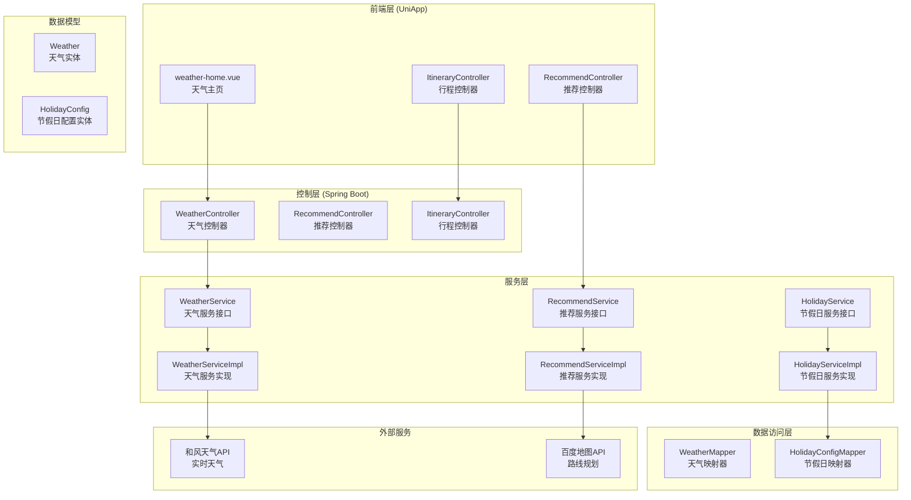
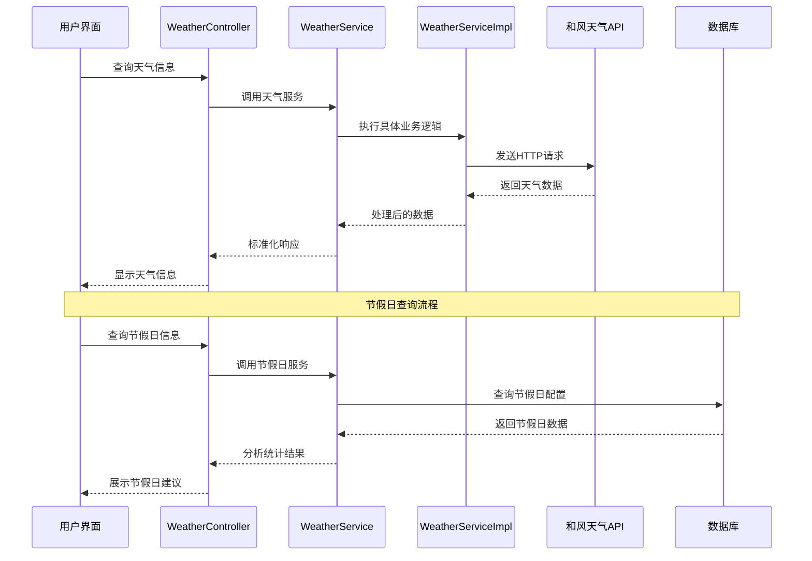
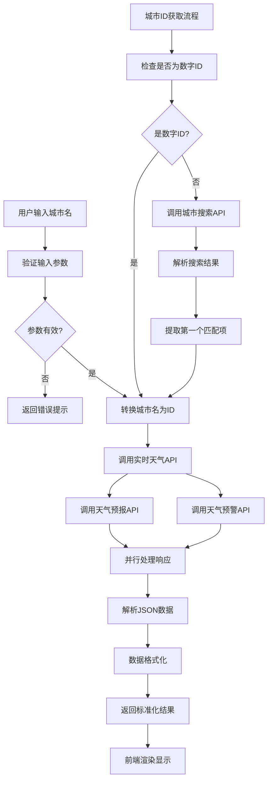
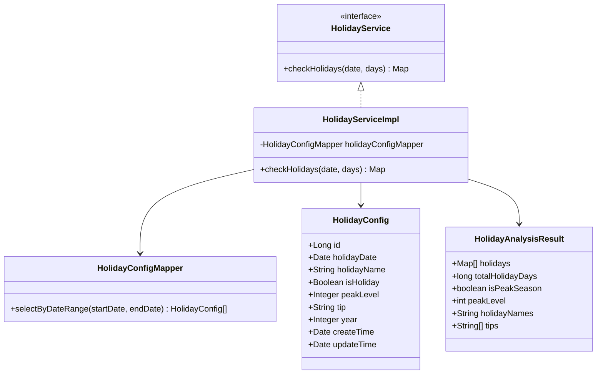
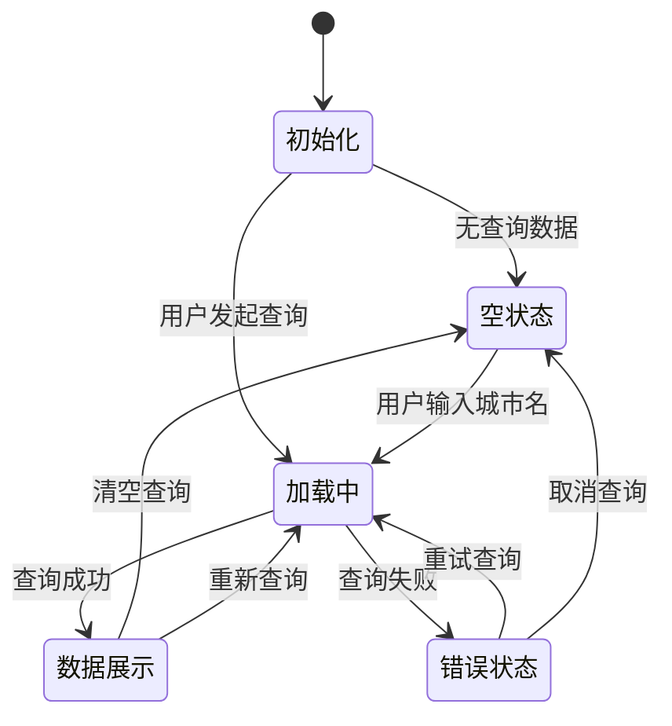
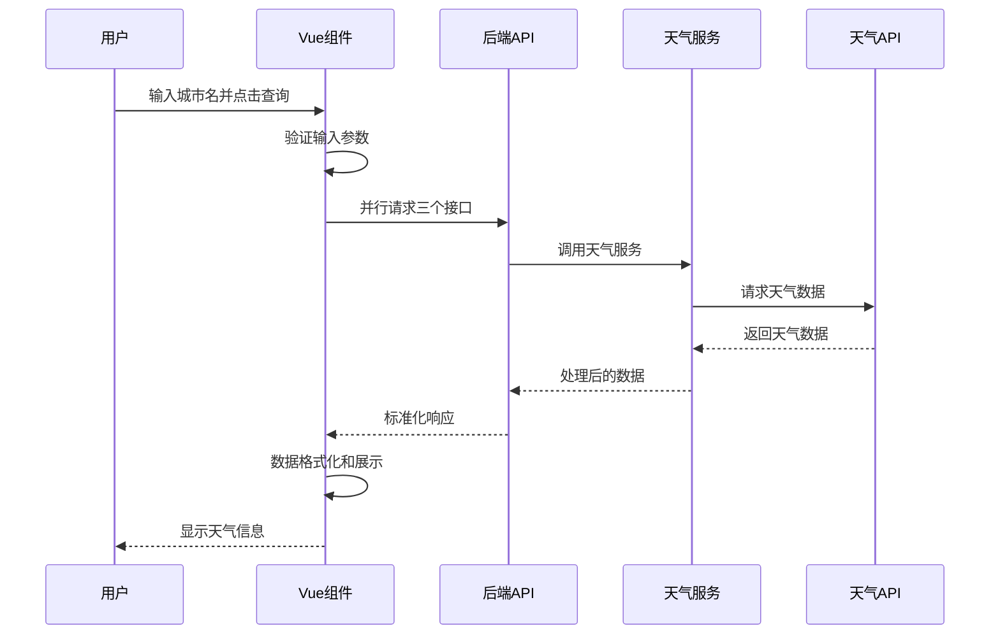
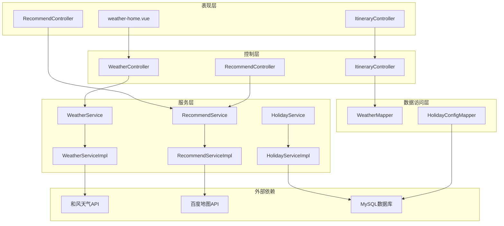

# 方案③ 天气节假日感知

<cite>
**本文档引用的文件**
- [WeatherController.java](file://springboot-travel-social/src/main/java/com/cxx/controller/WeatherController.java)
- [WeatherService.java](file://springboot-travel-social/src/main/java/com/cxx/service/WeatherService.java)
- [WeatherServiceImpl.java](file://springboot-travel-social/src/main/java/com/cxx/service/impl/WeatherServiceImpl.java)
- [HolidayConfig.java](file://springboot-travel-social/src/main/java/com/cxx/entity/HolidayConfig.java)
- [HolidayConfigMapper.java](file://springboot-travel-social/src/main/java/com/cxx/mapper/HolidayConfigMapper.java)
- [HolidayService.java](file://springboot-travel-social/src/main/java/com/cxx/service/HolidayService.java)
- [HolidayServiceImpl.java](file://springboot-travel-social/src/main/java/com/cxx/service/impl/HolidayServiceImpl.java)
- [holiday_config.sql](file://springboot-travel-social/src/main/resources/sql/holiday_config.sql)
- [weather-home.vue](file://uniapp-travel-social/weatherPages/weather-home.vue)
- [RecommendController.java](file://springboot-travel-social/src/main/java/com/cxx/controller/RecommendController.java)
- [RecommendService.java](file://springboot-travel-social/src/main/java/com/cxx/service/RecommendService.java)
- [RecommendServiceImpl.java](file://springboot-travel-social/src/main/java/com/cxx/service/impl/RecommendServiceImpl.java)
- [ItineraryController.java](file://springboot-travel-social/src/main/java/com/cxx/controller/ItineraryController.java)
- [RoutePlanningUtils.java](file://springboot-travel-social/src/main/java/com/cxx/utils/RoutePlanningUtils.java)
</cite>

## 目录
1. [简介](#简介)
2. [项目结构](#项目结构)
3. [核心组件](#核心组件)
4. [架构概览](#架构概览)
5. [详细组件分析](#详细组件分析)
6. [依赖关系分析](#依赖关系分析)
7. [性能考虑](#性能考虑)
8. [故障排除指南](#故障排除指南)
9. [结论](#结论)

## 简介

方案③"天气节假日感知"是旅游攻略社交小程序的重要功能模块，旨在为用户提供全面的天气信息和节假日出行建议。该方案通过集成第三方天气API和本地节假日数据库，实现了实时天气查询、7天天气预报、天气预警以及节假日出行高峰期分析等功能。

本系统采用前后端分离架构，后端基于Spring Boot提供RESTful API服务，前端使用UniApp构建跨平台移动应用。系统能够根据天气状况和节假日安排为用户提供个性化的出行建议和行程规划。

## 项目结构

项目采用标准的MVC架构模式，主要分为以下层次：

**图表来源**
- [WeatherController.java:1-87](file://springboot-travel-social/src/main/java/com/cxx/controller/WeatherController.java#L1-L87)
- [RecommendController.java:1-83](file://springboot-travel-social/src/main/java/com/cxx/controller/RecommendController.java#L1-L83)
- [ItineraryController.java:1-123](file://springboot-travel-social/src/main/java/com/cxx/controller/ItineraryController.java#L1-L123)

**章节来源**
- [WeatherController.java:1-87](file://springboot-travel-social/src/main/java/com/cxx/controller/WeatherController.java#L1-L87)
- [RecommendController.java:1-83](file://springboot-travel-social/src/main/java/com/cxx/controller/RecommendController.java#L1-L83)
- [ItineraryController.java:1-123](file://springboot-travel-social/src/main/java/com/cxx/controller/ItineraryController.java#L1-L123)

## 核心组件

### 天气信息服务

天气信息服务是整个方案的核心组件，提供了完整的天气数据获取能力：

| 组件 | 描述 | 主要功能 |
|------|------|----------|
| WeatherController | 天气控制器 | 提供实时天气、天气预警、7天预报、城市搜索接口 |
| WeatherService | 天气服务接口 | 定义天气数据获取的标准接口规范 |
| WeatherServiceImpl | 天气服务实现 | 实现与第三方天气API的交互逻辑 |

### 节假日感知系统

节假日感知系统负责分析特定时间段内的节假日分布情况：

| 组件 | 描述 | 主要功能 |
|------|------|----------|
| HolidayConfig | 节假日配置实体 | 存储节假日日期、名称、高峰等级等信息 |
| HolidayConfigMapper | 节假日映射器 | 提供节假日数据的数据库操作接口 |
| HolidayService | 节假日服务接口 | 定义节假日查询的标准接口 |
| HolidayServiceImpl | 节假日服务实现 | 实现节假日数据分析和统计逻辑 |

### 前端展示组件

前端采用Vue.js框架，提供了直观的天气信息展示界面：

| 组件 | 描述 | 主要功能 |
|------|------|----------|
| weather-home.vue | 天气主页 | 实时天气显示、7天预报、天气预警展示 |
| 响应式布局 | 移动端适配 | 支持不同屏幕尺寸的自适应显示 |

**章节来源**
- [WeatherService.java:1-42](file://springboot-travel-social/src/main/java/com/cxx/service/WeatherService.java#L1-L42)
- [WeatherServiceImpl.java:1-295](file://springboot-travel-social/src/main/java/com/cxx/service/impl/WeatherServiceImpl.java#L1-L295)
- [HolidayConfig.java:1-58](file://springboot-travel-social/src/main/java/com/cxx/entity/HolidayConfig.java#L1-L58)
- [HolidayServiceImpl.java:1-91](file://springboot-travel-social/src/main/java/com/cxx/service/impl/HolidayServiceImpl.java#L1-L91)
- [weather-home.vue:1-580](file://uniapp-travel-social/weatherPages/weather-home.vue#L1-L580)

## 架构概览

系统采用分层架构设计，确保了良好的可维护性和扩展性：

**图表来源**
- [WeatherController.java:32-85](file://springboot-travel-social/src/main/java/com/cxx/controller/WeatherController.java#L32-L85)
- [WeatherServiceImpl.java:37-132](file://springboot-travel-social/src/main/java/com/cxx/service/impl/WeatherServiceImpl.java#L37-L132)
- [HolidayServiceImpl.java:29-89](file://springboot-travel-social/src/main/java/com/cxx/service/impl/HolidayServiceImpl.java#L29-L89)

系统架构特点：

1. **分层清晰**：表现层、控制层、服务层、数据访问层职责明确
2. **接口隔离**：通过接口定义规范，便于单元测试和替换实现
3. **异步处理**：前端采用Promise.all并行请求多个天气数据源
4. **错误处理**：完善的异常捕获和错误提示机制
5. **缓存策略**：合理利用第三方API的缓存机制减少重复请求

## 详细组件分析

### 天气数据获取流程

天气数据获取是系统最核心的功能，涉及多个API调用和数据处理步骤：

**图表来源**
- [WeatherServiceImpl.java:141-211](file://springboot-travel-social/src/main/java/com/cxx/service/impl/WeatherServiceImpl.java#L141-L211)
- [WeatherServiceImpl.java:271-293](file://springboot-travel-social/src/main/java/com/cxx/service/impl/WeatherServiceImpl.java#L271-L293)

#### 天气API交互细节

系统集成了多个第三方天气API服务：

| API类型 | 服务名称 | 功能描述 | 请求频率限制 |
|---------|----------|----------|-------------|
| 实时天气 | 和风天气 | 当前温度、湿度、风力等 | 无限制 |
| 7天预报 | 和风天气 | 未来7天天气趋势 | 无限制 |
| 天气预警 | 和风天气 | 气象灾害预警信息 | 无限制 |
| 城市搜索 | 和风天气 | 地理位置查询 | 无限制 |

#### 错误处理机制

系统实现了多层次的错误处理：

1. **网络异常处理**：超时、连接失败等情况的优雅降级
2. **API响应处理**：对不同HTTP状态码进行分类处理
3. **数据解析处理**：JSON格式错误、字段缺失等情况的容错
4. **业务逻辑处理**：城市不存在、参数非法等业务异常

**章节来源**
- [WeatherServiceImpl.java:37-132](file://springboot-travel-social/src/main/java/com/cxx/service/impl/WeatherServiceImpl.java#L37-L132)
- [WeatherServiceImpl.java:141-211](file://springboot-travel-social/src/main/java/com/cxx/service/impl/WeatherServiceImpl.java#L141-L211)

### 节假日数据分析

节假日感知系统通过分析特定时间段内的节假日分布，为用户提供出行建议：

**图表来源**
- [HolidayConfig.java:21-57](file://springboot-travel-social/src/main/java/com/cxx/entity/HolidayConfig.java#L21-L57)
- [HolidayConfigMapper.java:12-22](file://springboot-travel-social/src/main/java/com/cxx/mapper/HolidayConfigMapper.java#L12-L22)
- [HolidayServiceImpl.java:29-89](file://springboot-travel-social/src/main/java/com/cxx/service/impl/HolidayServiceImpl.java#L29-L89)

#### 节假日数据模型

节假日配置采用了灵活的数据模型设计：

| 字段名 | 类型 | 描述 | 约束条件 |
|--------|------|------|----------|
| id | Long | 主键标识 | 自增, 主键 |
| holidayDate | Date | 节假日日期 | 非空, 唯一索引 |
| holidayName | String | 节假日名称 | 非空, 最大50字符 |
| isHoliday | Boolean | 是否节假日 | 非空, 默认1 |
| peakLevel | Integer | 出行高峰等级 | 非空, 默认1 |
| tip | String | 出行建议 | 可空, 最大200字符 |
| year | Integer | 所属年份 | 非空 |
| createTime | Date | 创建时间 | 非空, 默认当前时间 |
| updateTime | Date | 更新时间 | 非空, 默认当前时间 |

#### 节假日分析算法

系统实现了智能的节假日分析算法：

1. **日期范围查询**：根据起始日期和天数范围查询节假日配置
2. **高峰等级评估**：识别是否存在2级及以上高峰的节假日
3. **建议汇总生成**：整合所有节假日的出行建议
4. **统计指标计算**：计算总节假日天数、最高峰等级等指标

**章节来源**
- [HolidayConfig.java:1-58](file://springboot-travel-social/src/main/java/com/cxx/entity/HolidayConfig.java#L1-L58)
- [HolidayConfigMapper.java:1-24](file://springboot-travel-social/src/main/java/com/cxx/mapper/HolidayConfigMapper.java#L1-L24)
- [HolidayServiceImpl.java:29-89](file://springboot-travel-social/src/main/java/com/cxx/service/impl/HolidayServiceImpl.java#L29-L89)

### 前端天气展示

前端采用Vue.js框架构建了响应式的天气展示界面：

**图表来源**
- [weather-home.vue:114-175](file://uniapp-travel-social/weatherPages/weather-home.vue#L114-L175)

#### 前端功能特性

前端界面实现了以下核心功能：

1. **并行API请求**：同时获取实时天气、7天预报和天气预警数据
2. **响应式布局**：适配不同屏幕尺寸的移动设备
3. **动画效果**：流畅的加载动画和页面切换效果
4. **错误处理**：友好的错误提示和用户引导
5. **数据格式化**：将后端数据转换为用户友好的显示格式

#### 用户交互流程

**图表来源**
- [weather-home.vue:125-155](file://uniapp-travel-social/weatherPages/weather-home.vue#L125-L155)

**章节来源**
- [weather-home.vue:1-580](file://uniapp-travel-social/weatherPages/weather-home.vue#L1-L580)

### 推荐系统集成

系统还集成了推荐功能，为用户提供个性化的旅游服务推荐：

| 推荐类型 | 服务内容 | 技术实现 | 应用场景 |
|----------|----------|----------|----------|
| 个性化博客推荐 | 基于用户行为的游记推荐 | UserCF协同过滤算法 | 为用户提供参考游记 |
| 周边服务推荐 | 摔影师、代驾、酒店、美食 | 多数据源聚合查询 | 出行前的服务准备 |
| 路线规划 | 百度地图驾车路线规划 | HTTP客户端调用 | 出行路线优化 |

**章节来源**
- [RecommendService.java:1-26](file://springboot-travel-social/src/main/java/com/cxx/service/RecommendService.java#L1-L26)
- [RecommendServiceImpl.java:84-202](file://springboot-travel-social/src/main/java/com/cxx/service/impl/RecommendServiceImpl.java#L84-L202)
- [RoutePlanningUtils.java:23-34](file://springboot-travel-social/src/main/java/com/cxx/utils/RoutePlanningUtils.java#L23-L34)

## 依赖关系分析

系统各组件之间的依赖关系体现了清晰的分层架构：

**图表来源**
- [WeatherController.java:1-87](file://springboot-travel-social/src/main/java/com/cxx/controller/WeatherController.java#L1-L87)
- [RecommendController.java:1-83](file://springboot-travel-social/src/main/java/com/cxx/controller/RecommendController.java#L1-L83)
- [ItineraryController.java:1-123](file://springboot-travel-social/src/main/java/com/cxx/controller/ItineraryController.java#L1-L123)

### 核心依赖关系

1. **控制层到服务层**：控制层仅依赖服务接口，不直接依赖具体实现
2. **服务层到数据访问层**：服务层通过Mapper接口访问数据库
3. **实现层到外部API**：具体实现类依赖第三方服务API
4. **前端到后端**：前端通过HTTP协议与后端API通信

### 循环依赖检测

经过分析，系统不存在循环依赖关系：
- 控制层 → 服务层 → 数据访问层 → 实体层
- 前端 → 后端控制层（单向依赖）
- 外部API → 内部实现层（单向依赖）

**章节来源**
- [WeatherController.java:1-87](file://springboot-travel-social/src/main/java/com/cxx/controller/WeatherController.java#L1-L87)
- [WeatherServiceImpl.java:1-295](file://springboot-travel-social/src/main/java/com/cxx/service/impl/WeatherServiceImpl.java#L1-L295)
- [HolidayServiceImpl.java:1-91](file://springboot-travel-social/src/main/java/com/cxx/service/impl/HolidayServiceImpl.java#L1-L91)

## 性能考虑

系统在设计时充分考虑了性能优化：

### 缓存策略

1. **API缓存**：利用第三方天气API的缓存机制，减少重复请求
2. **数据缓存**：节假日配置数据可在内存中缓存，提高查询效率
3. **前端缓存**：用户最近查询的城市信息可在本地存储

### 异步处理

1. **并行请求**：前端使用Promise.all并行获取多个天气数据源
2. **异步渲染**：大数据量时采用分页或虚拟滚动技术
3. **后台任务**：节假日数据的批量更新可通过定时任务执行

### 网络优化

1. **请求合并**：将多个相关的API请求合并为一次网络往返
2. **数据压缩**：支持GZIP压缩传输，减少网络带宽占用
3. **超时控制**：合理的连接超时和读取超时设置

### 数据库优化

1. **索引优化**：为节假日日期建立唯一索引，提高查询性能
2. **查询优化**：使用范围查询而非全表扫描
3. **连接池**：合理配置数据库连接池大小

## 故障排除指南

### 常见问题及解决方案

#### 天气API访问问题

| 问题症状 | 可能原因 | 解决方案 |
|----------|----------|----------|
| API返回403错误 | API密钥无效或过期 | 检查WEATHER_API_KEY配置 |
| 请求超时 | 网络连接不稳定 | 增加超时时间，添加重试机制 |
| 数据格式错误 | API响应格式变化 | 更新数据解析逻辑 |
| 城市搜索失败 | 城市名称不准确 | 提供更精确的城市名称或经纬度 |

#### 节假日数据问题

| 问题症状 | 可能原因 | 解决方案 |
|----------|----------|----------|
| 节假日数据缺失 | 数据库初始化失败 | 检查holiday_config.sql执行情况 |
| 查询结果为空 | 日期范围计算错误 | 验证日期格式和范围参数 |
| 峰级评估不准确 | 数据质量有问题 | 检查节假日配置数据的准确性 |

#### 前端显示问题

| 问题症状 | 可能原因 | 解决方案 |
|----------|----------|----------|
| 页面空白 | API请求失败 | 检查网络连接和API可用性 |
| 数据格式异常 | 后端数据结构变化 | 更新前端数据解析逻辑 |
| 响应缓慢 | 数据量过大 | 实现分页加载和懒加载 |
| 样式错乱 | 响应式适配问题 | 检查CSS媒体查询和布局 |

### 调试技巧

1. **日志记录**：在关键节点添加详细的日志输出
2. **错误监控**：使用异常监控工具跟踪系统运行状态
3. **性能分析**：定期分析API响应时间和数据库查询性能
4. **用户反馈**：收集用户使用过程中的问题反馈

**章节来源**
- [WeatherServiceImpl.java:57-63](file://springboot-travel-social/src/main/java/com/cxx/service/impl/WeatherServiceImpl.java#L57-L63)
- [HolidayServiceImpl.java:78-88](file://springboot-travel-social/src/main/java/com/cxx/service/impl/HolidayServiceImpl.java#L78-L88)
- [weather-home.vue:156-174](file://uniapp-travel-social/weatherPages/weather-home.vue#L156-L174)

## 结论

方案③"天气节假日感知"通过精心设计的架构和实现，为用户提供了全面的出行信息服务。系统的主要优势包括：

1. **功能完整性**：涵盖了天气查询、节假日分析、出行建议等全方位功能
2. **架构合理性**：采用分层架构，职责清晰，易于维护和扩展
3. **用户体验**：提供直观的界面和流畅的交互体验
4. **技术先进性**：采用现代化的技术栈和最佳实践

### 技术亮点

- **多API集成**：成功整合了多个第三方天气服务API
- **智能分析**：实现了节假日高峰期的智能识别和分析
- **响应式设计**：完美适配各种移动设备
- **错误处理**：建立了完善的异常处理和降级机制

### 改进建议

1. **缓存优化**：可以增加更细粒度的缓存策略，提高数据访问性能
2. **监控完善**：增加更全面的系统监控和性能指标
3. **测试覆盖**：提高单元测试和集成测试的覆盖率
4. **文档完善**：补充更详细的技术文档和API说明

该方案为旅游攻略社交小程序提供了强大的天气和节假日感知能力，为用户制定出行计划提供了重要的数据支撑，具有很高的实用价值和推广前景。