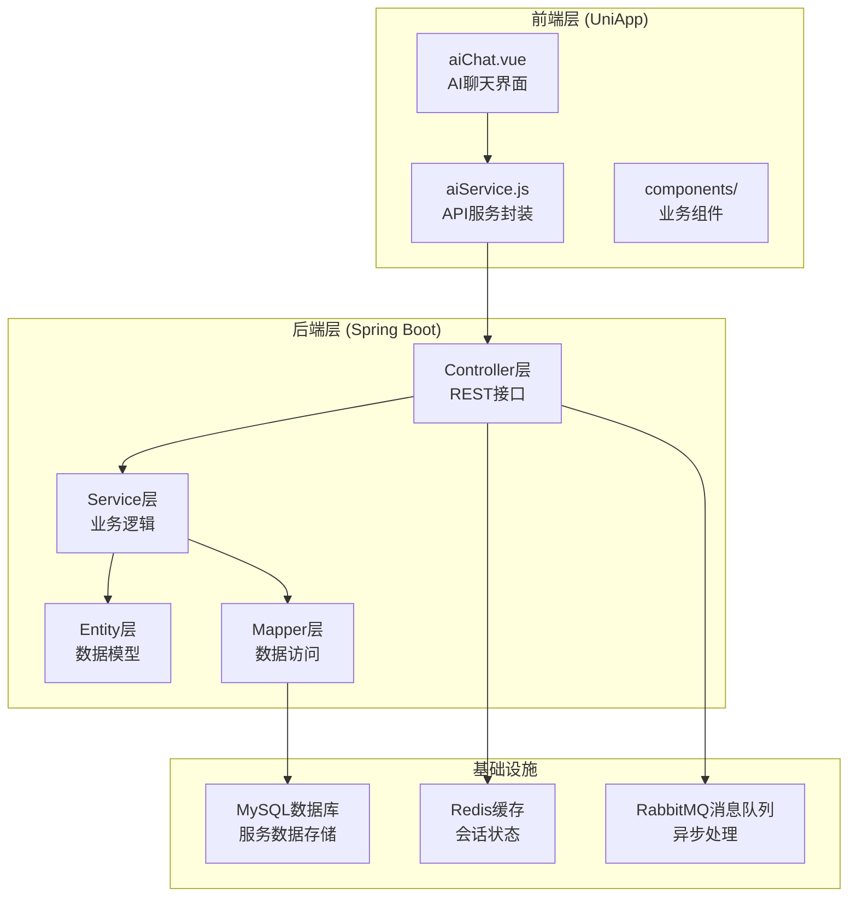
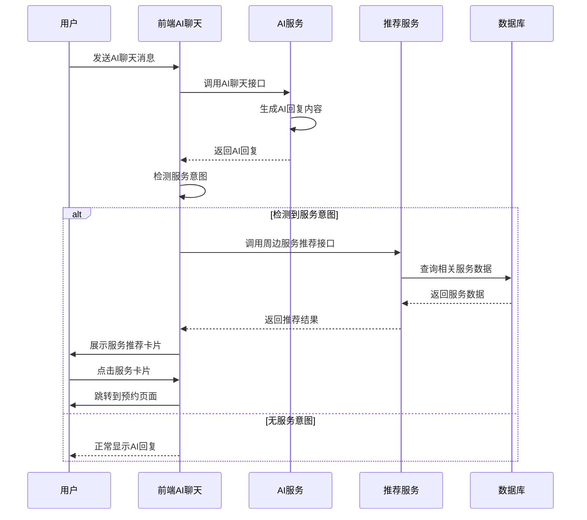
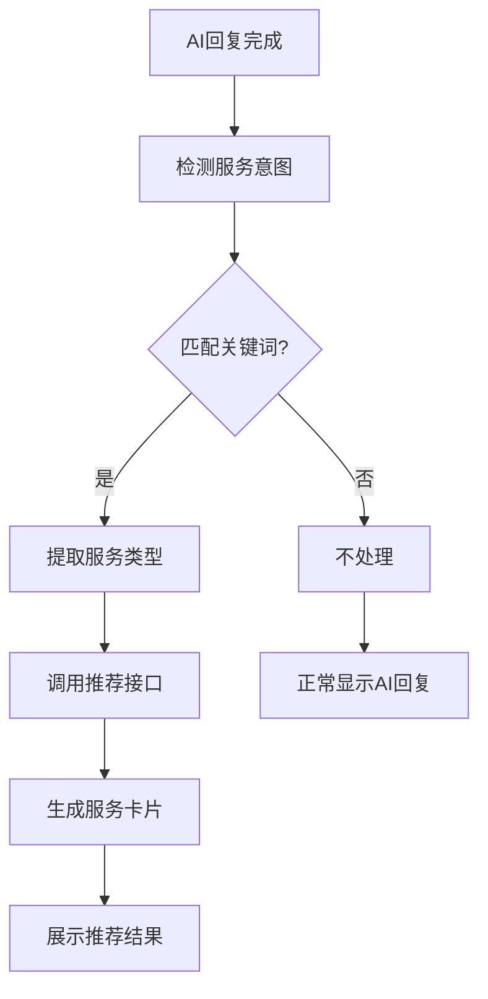
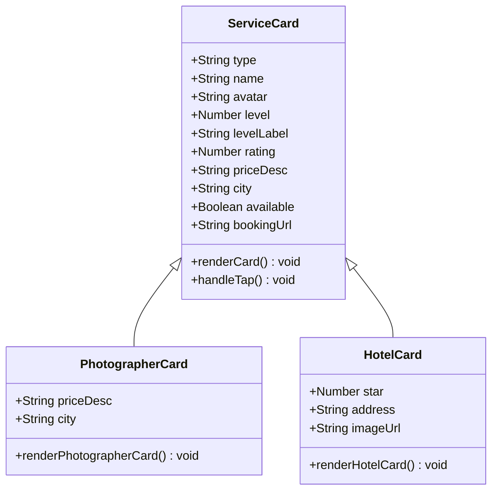
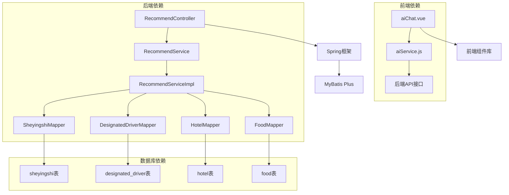

# 方案⑤ 周边服务直连

<cite>
**本文档引用的文件**
- [方案⑤-周边服务直连.md](file://方案⑤-周边服务直连.md)
- [aiChat.vue](file://uniapp-travel-social/homePages/aiChat/aiChat.vue)
- [aiService.js](file://uniapp-travel-social/services/aiService.js)
- [application.properties](file://springboot-travel-social/src/main/resources/application.properties)
- [RecommendController.java](file://springboot-travel-social/src/main/java/com/cxx/controller/RecommendController.java)
- [RecommendService.java](file://springboot-travel-social/src/main/java/com/cxx/service/RecommendService.java)
- [RecommendServiceImpl.java](file://springboot-travel-social/src/main/java/com/cxx/service/impl/RecommendServiceImpl.java)
- [Sheyingshi.java](file://springboot-travel-social/src/main/java/com/cxx/entity/Sheyingshi.java)
- [DesignatedDriver.java](file://springboot-travel-social/src/main/java/com/cxx/entity/DesignatedDriver.java)
- [HotelController.java](file://springboot-travel-social/src/main/java/com/cxx/controller/HotelController.java)
- [FoodController.java](file://springboot-travel-social/src/main/java/com/cxx/controller/FoodController.java)
- [TaxiOrderController.java](file://springboot-travel-social/src/main/java/com/cxx/controller/TaxiOrderController.java)
</cite>

## 目录
1. [简介](#简介)
2. [项目结构](#项目结构)
3. [核心组件](#核心组件)
4. [架构概览](#架构概览)
5. [详细组件分析](#详细组件分析)
6. [依赖分析](#依赖分析)
7. [性能考虑](#性能考虑)
8. [故障排除指南](#故障排除指南)
9. [结论](#结论)

## 简介

方案⑤"周边服务直连"是旅游攻略社交小程序的重要功能模块，旨在实现从AI智能助手到周边服务的无缝连接。该方案的核心目标是当AI在对话中提及摄影、代驾、打车、酒店等相关内容时，能够自动识别用户意图并提供真实的周边服务推荐，实现从智能咨询到实际预订的一站式服务体验。

该功能通过"服务推荐卡片"(service-card)消息形式，在用户看到AI回复后自动展示相关服务，用户点击即可直接跳转到对应的预约/下单页面，形成完整的从咨询到消费的闭环。

## 项目结构

基于代码库分析，该项目采用前后端分离架构，主要分为以下层次：



**图表来源**
- [aiChat.vue:1-800](file://uniapp-travel-social/homePages/aiChat/aiChat.vue#L1-L800)
- [application.properties:1-64](file://springboot-travel-social/src/main/resources/application.properties#L1-L64)

**章节来源**
- [方案⑤-周边服务直连.md:1-282](file://方案⑤-周边服务直连.md#L1-L282)
- [aiChat.vue:1-800](file://uniapp-travel-social/homePages/aiChat/aiChat.vue#L1-L800)
- [application.properties:1-64](file://springboot-travel-social/src/main/resources/application.properties#L1-L64)

## 核心组件

### 前端AI聊天组件

前端AI聊天界面是整个周边服务直连功能的核心交互层，主要包含以下关键特性：

1. **智能意图识别系统**：通过关键词匹配算法自动识别AI回复中的服务意图
2. **服务推荐卡片渲染**：动态生成服务推荐卡片，支持多种服务类型
3. **无缝跳转机制**：用户点击卡片即可跳转到对应的预约页面
4. **上下文感知**：支持城市信息传递，实现精准服务推荐

### 后端推荐服务

后端提供统一的周边服务推荐接口，支持多种服务类型的聚合查询：

1. **多服务类型支持**：摄影、代驾、出租车、酒店、美食等
2. **智能过滤机制**：根据服务状态和可用性进行筛选
3. **统一数据格式**：标准化输出服务推荐结果
4. **扩展性强**：支持新增服务类型和自定义配置

### 数据模型设计

系统涉及多个核心数据实体，包括：

- **摄影师实体**：包含摄影师基本信息、等级、状态等字段
- **代驾司机实体**：包含司机资质、评分、状态等信息
- **酒店实体**：包含酒店基本信息、星级、价格、位置等
- **美食实体**：包含餐厅信息、评分、特色菜品等

**章节来源**
- [aiChat.vue:189-254](file://uniapp-travel-social/homePages/aiChat/aiChat.vue#L189-L254)
- [RecommendController.java:1-65](file://springboot-travel-social/src/main/java/com/cxx/controller/RecommendController.java#L1-L65)
- [Sheyingshi.java:1-67](file://springboot-travel-social/src/main/java/com/cxx/entity/Sheyingshi.java#L1-L67)
- [DesignatedDriver.java:1-44](file://springboot-travel-social/src/main/java/com/cxx/entity/DesignatedDriver.java#L1-L44)

## 架构概览

整体架构采用微服务设计理念，前后端分离，通过RESTful API进行通信：



**图表来源**
- [aiChat.vue:220-226](file://uniapp-travel-social/homePages/aiChat/aiChat.vue#L220-L226)
- [aiService.js:52-85](file://uniapp-travel-social/services/aiService.js#L52-L85)

**章节来源**
- [方案⑤-周边服务直连.md:13-55](file://方案⑤-周边服务直连.md#L13-L55)

## 详细组件分析

### 前端意图识别系统

前端实现了智能化的服务意图识别机制，通过关键词匹配实现精准的服务推荐触发：



**图表来源**
- [aiChat.vue:201-211](file://uniapp-travel-social/homePages/aiChat/aiChat.vue#L201-L211)

#### 关键实现要点

1. **关键词映射表**：定义了各类服务的关键词集合，包括摄影、代驾、打车、酒店、美食等
2. **意图检测算法**：遍历关键词映射表，检查AI回复中是否包含相关关键词
3. **服务类型提取**：返回所有匹配到的服务类型数组
4. **防重复机制**：通过消息ID跟踪，避免同一AI回复重复推送服务卡片

### 推荐服务接口设计

后端提供了统一的周边服务推荐接口，支持多服务类型的聚合查询：

#### 接口规范

| 参数 | 类型 | 必填 | 说明 |
|------|------|------|------|
| city | String | 否 | 目的地城市，用于过滤酒店/餐厅 |
| types | String | 是 | 服务类型，逗号分隔：photographer,driver,taxi,hotel,food |
| limit | Integer | 否 | 每类返回数量，默认3 |

#### 数据返回格式

```json
{
  "code": 1,
  "data": {
    "services": [
      {
        "type": "photographer",
        "typeLabel": "旅行摄影师",
        "items": [
          {
            "id": 1,
            "name": "陈小影",
            "avatar": "http://...",
            "level": 3,
            "levelLabel": "首席摄影师",
            "rating": 4.9,
            "priceDesc": "800元/天",
            "city": "全国",
            "available": true,
            "bookingUrl": "/followshootpages/follow-shoot-booking?photographerId=1"
          }
        ]
      }
    ],
    "totalCount": 6
  }
}
```

**章节来源**
- [方案⑤-周边服务直连.md:104-158](file://方案⑤-周边服务直连.md#L104-L158)
- [RecommendController.java:28-65](file://springboot-travel-social/src/main/java/com/cxx/controller/RecommendController.java#L28-L65)

### 数据库设计

系统涉及多个核心业务表，每个表都有明确的职责分工：

#### 摄影师表 (sheyingshi)
- **核心字段**：姓名(xm)、手机号(dh)、头像(tx)、级别(jb)、状态(zt)
- **业务含义**：级别1-3分别代表普通、高级、首席摄影师
- **状态管理**：状态1表示在岗，状态0表示休息

#### 代驾司机表 (designated_driver)
- **核心字段**：用户ID、姓名、手机号、身份证号、驾照信息
- **业务含义**：存储代驾司机的基本信息和资质
- **状态管理**：通过status字段标识司机状态

#### 酒店表 (hotel)
- **核心字段**：酒店名称、星级、地址、价格、图片URL、状态
- **业务含义**：存储酒店的基础信息和价格信息
- **状态管理**：状态0表示正常营业

**章节来源**
- [方案⑤-周边服务直连.md:61-100](file://方案⑤-周边服务直连.md#L61-L100)
- [Sheyingshi.java:1-67](file://springboot-travel-social/src/main/java/com/cxx/entity/Sheyingshi.java#L1-L67)
- [DesignatedDriver.java:1-44](file://springboot-travel-social/src/main/java/com/cxx/entity/DesignatedDriver.java#L1-L44)

### 前端服务卡片渲染

前端实现了灵活的服务卡片渲染机制，支持不同服务类型的数据展示：



**图表来源**
- [aiChat.vue:228-244](file://uniapp-travel-social/homePages/aiChat/aiChat.vue#L228-L244)

#### 卡片模板结构

服务卡片采用统一的模板结构，包含以下元素：

1. **服务类型标识**：显示服务类别标签
2. **服务基本信息**：名称、头像、评分等
3. **价格和位置信息**：价格描述、服务城市等
4. **操作按钮**：立即预约/查看详情按钮
5. **跳转链接**：指向对应的预约页面

**章节来源**
- [方案⑤-周边服务直连.md:228-254](file://方案⑤-周边服务直连.md#L228-L254)

## 依赖分析

系统各组件之间的依赖关系呈现清晰的分层架构：



**图表来源**
- [RecommendController.java:1-65](file://springboot-travel-social/src/main/java/com/cxx/controller/RecommendController.java#L1-L65)
- [RecommendServiceImpl.java:1-64](file://springboot-travel-social/src/main/java/com/cxx/service/impl/RecommendServiceImpl.java#L1-L64)

### 外部依赖

系统集成了多个外部服务和第三方API：

1. **AI服务集成**：通过aiService.js封装各种AI相关接口
2. **地图服务**：集成腾讯地图API进行逆地理编码
3. **文件存储**：支持图片上传和存储
4. **消息队列**：使用RabbitMQ处理异步任务

**章节来源**
- [aiService.js:1-324](file://uniapp-travel-social/services/aiService.js#L1-L324)
- [application.properties:1-64](file://springboot-travel-social/src/main/resources/application.properties#L1-L64)

## 性能考虑

### 前端性能优化

1. **懒加载机制**：服务卡片仅在需要时加载和渲染
2. **虚拟滚动**：大量服务数据时采用虚拟滚动技术
3. **图片优化**：服务头像和图片采用懒加载和压缩
4. **内存管理**：及时清理不再使用的组件实例

### 后端性能优化

1. **数据库索引**：为常用查询字段建立合适的索引
2. **缓存策略**：使用Redis缓存热点数据
3. **分页查询**：对大量数据采用分页处理
4. **连接池配置**：合理配置数据库连接池大小

### 网络性能优化

1. **请求合并**：将多个小请求合并为批量请求
2. **CDN加速**：静态资源通过CDN分发
3. **HTTP缓存**：合理设置HTTP缓存头
4. **压缩传输**：启用Gzip压缩减少传输体积

## 故障排除指南

### 常见问题及解决方案

#### 1. 服务推荐不显示

**可能原因**：
- AI回复中未包含服务相关关键词
- 网络请求失败
- 数据库查询异常

**解决步骤**：
1. 检查AI回复内容是否包含关键词
2. 查看网络请求日志
3. 验证数据库连接状态
4. 检查服务状态过滤条件

#### 2. 服务卡片渲染异常

**可能原因**：
- 数据格式不正确
- 前端模板渲染错误
- 路由跳转失败

**解决步骤**：
1. 验证后端返回数据格式
2. 检查前端模板语法
3. 测试路由跳转功能
4. 查看浏览器控制台错误

#### 3. 性能问题

**可能原因**：
- 数据库查询效率低
- 前端渲染性能瓶颈
- 网络延迟过高

**解决步骤**：
1. 分析SQL执行计划
2. 优化前端渲染逻辑
3. 检查网络连接质量
4. 实施缓存策略

**章节来源**
- [方案⑤-周边服务直连.md:260-282](file://方案⑤-周边服务直连.md#L260-L282)

## 结论

方案⑤"周边服务直连"通过智能化的意图识别和无缝的服务推荐机制，成功实现了从AI智能助手到周边服务的实际连接。该方案具有以下优势：

1. **用户体验优秀**：从咨询到预订的完整闭环体验
2. **技术架构合理**：前后端分离，职责清晰
3. **扩展性强**：支持新增服务类型和服务提供商
4. **性能表现良好**：通过合理的优化策略保证系统性能

该方案为旅游攻略社交小程序提供了强大的周边服务能力，不仅提升了用户满意度，也为平台创造了更多的商业价值。通过持续的技术优化和功能扩展，该方案有望成为旅游服务平台的重要竞争力。