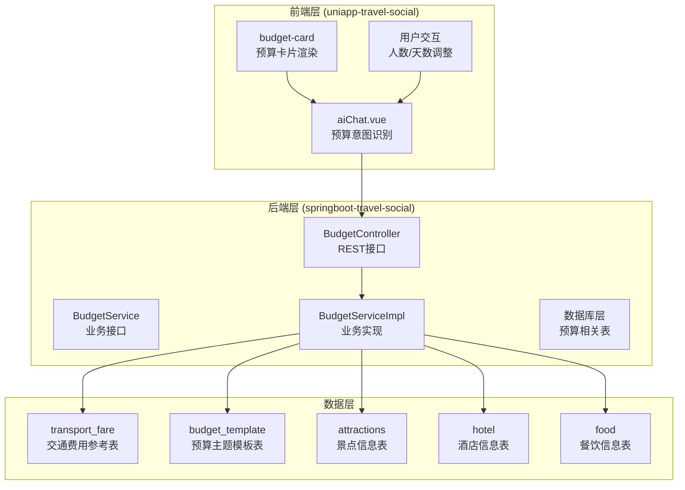
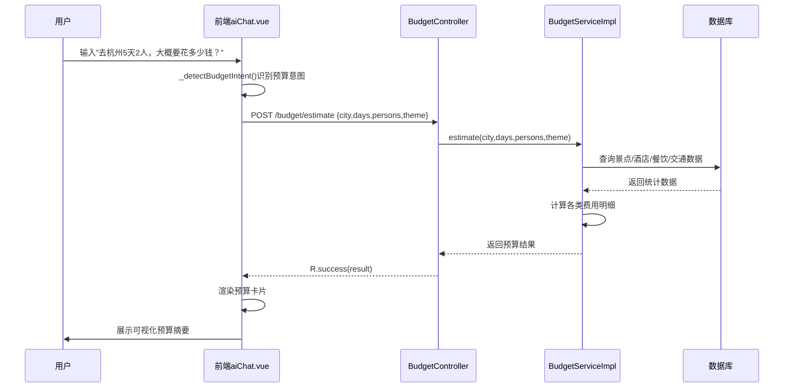
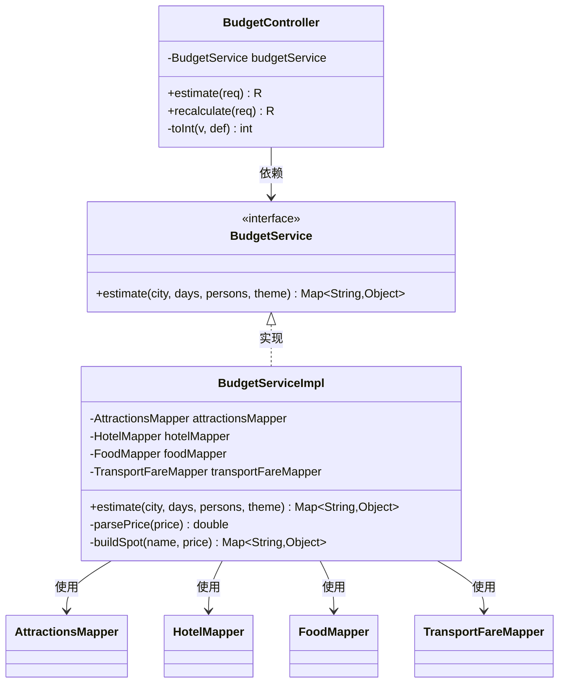
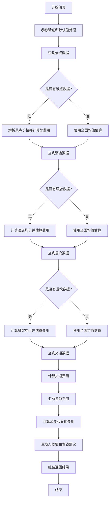
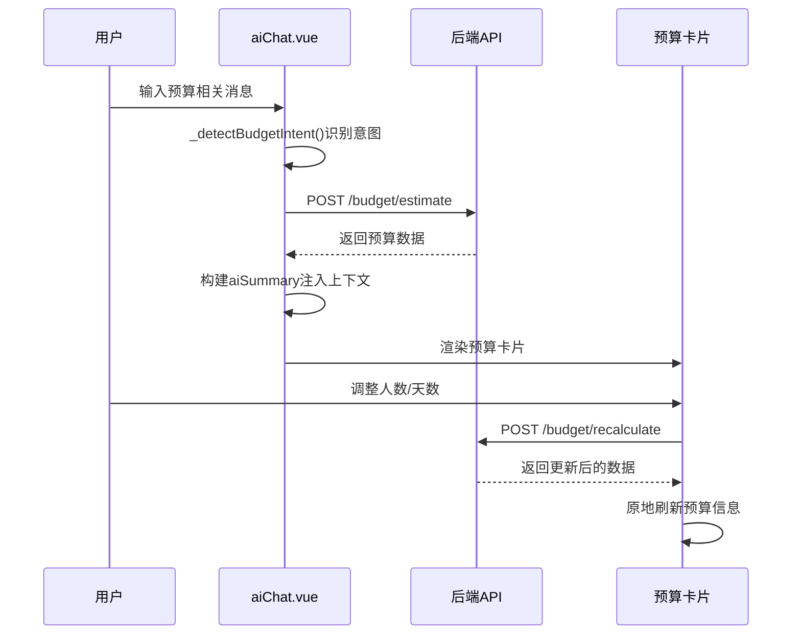
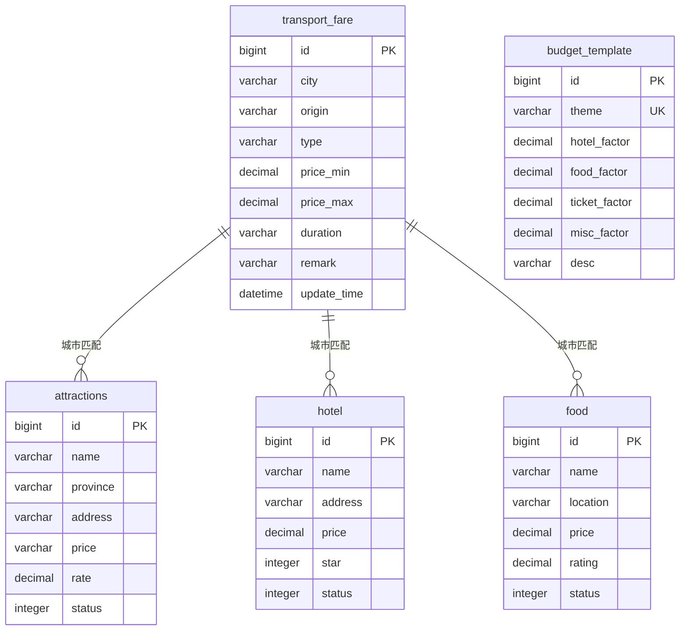
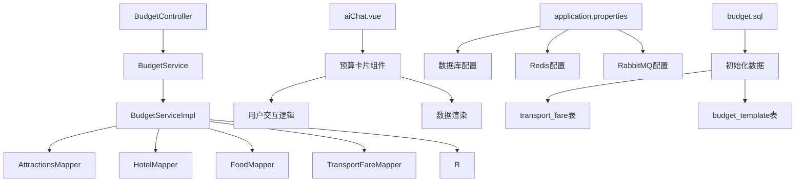

# 方案⑥ 预算智能拆解

<cite>
**本文档引用的文件**
- [BudgetController.java](file://springboot-travel-social/src/main/java/com/cxx/controller/BudgetController.java)
- [BudgetService.java](file://springboot-travel-social/src/main/java/com/cxx/service/BudgetService.java)
- [BudgetServiceImpl.java](file://springboot-travel-social/src/main/java/com/cxx/service/impl/BudgetServiceImpl.java)
- [R.java](file://springboot-travel-social/src/main/java/com/cxx/entity/R.java)
- [application.properties](file://springboot-travel-social/src/main/resources/application.properties)
- [budget.sql](file://springboot-travel-social/src/main/resources/sql/budget.sql)
- [aiChat.vue](file://uniapp-travel-social/homePages/aiChat/aiChat.vue)
- [方案⑥-预算智能拆解.md](file://方案⑥-预算智能拆解.md)
</cite>

## 目录
1. [简介](#简介)
2. [项目结构](#项目结构)
3. [核心组件](#核心组件)
4. [架构概览](#架构概览)
5. [详细组件分析](#详细组件分析)
6. [依赖分析](#依赖分析)
7. [性能考虑](#性能考虑)
8. [故障排除指南](#故障排除指南)
9. [结论](#结论)

## 简介

方案⑥ 预算智能拆解是旅游攻略社交小程序中的一个重要功能模块，旨在为用户提供精准的旅行预算估算和可视化展示。该系统通过分析用户输入中的预算相关关键词，自动从数据库中拉取目标城市的真实景点票价、酒店均价、餐饮均价和交通报价，计算出详细的分类费用明细，并以预算卡片的形式展示在聊天界面中。

该功能的核心价值在于将通用AI的模糊预算建议转化为基于真实数据的精准预算参考，为用户提供"点开就能用"的实用工具。

## 项目结构

整个预算智能拆解系统由前后端协同完成，采用分层架构设计：



**图表来源**
- [BudgetController.java:1-51](file://springboot-travel-social/src/main/java/com/cxx/controller/BudgetController.java#L1-L51)
- [BudgetServiceImpl.java:1-294](file://springboot-travel-social/src/main/java/com/cxx/service/impl/BudgetServiceImpl.java#L1-L294)
- [aiChat.vue:337-388](file://uniapp-travel-social/homePages/aiChat/aiChat.vue#L337-L388)

**章节来源**
- [BudgetController.java:1-51](file://springboot-travel-social/src/main/java/com/cxx/controller/BudgetController.java#L1-L51)
- [BudgetService.java:1-17](file://springboot-travel-social/src/main/java/com/cxx/service/BudgetService.java#L1-L17)
- [BudgetServiceImpl.java:1-294](file://springboot-travel-social/src/main/java/com/cxx/service/impl/BudgetServiceImpl.java#L1-L294)

## 核心组件

### 后端核心组件

系统的核心由三个主要组件构成：

1. **BudgetController**: 提供RESTful API接口，处理预算估算请求
2. **BudgetService**: 定义预算估算的业务接口规范
3. **BudgetServiceImpl**: 实现具体的预算计算逻辑

### 前端核心组件

1. **aiChat.vue**: 实现预算意图识别和交互逻辑
2. **预算卡片组件**: 负责预算数据的可视化展示

### 数据库组件

1. **transport_fare**: 城市交通费用参考表
2. **budget_template**: 预算主题模板表
3. **关联数据表**: attractions、hotel、food等

**章节来源**
- [BudgetController.java:10-51](file://springboot-travel-social/src/main/java/com/cxx/controller/BudgetController.java#L10-L51)
- [BudgetService.java:5-16](file://springboot-travel-social/src/main/java/com/cxx/service/BudgetService.java#L5-L16)
- [BudgetServiceImpl.java:22-294](file://springboot-travel-social/src/main/java/com/cxx/service/impl/BudgetServiceImpl.java#L22-L294)

## 架构概览

系统采用典型的三层架构设计，实现了前后端分离和职责明确的模块化组织：



**图表来源**
- [BudgetController.java:21-42](file://springboot-travel-social/src/main/java/com/cxx/controller/BudgetController.java#L21-L42)
- [BudgetServiceImpl.java:48-246](file://springboot-travel-social/src/main/java/com/cxx/service/impl/BudgetServiceImpl.java#L48-L246)
- [aiChat.vue:278-289](file://uniapp-travel-social/homePages/aiChat/aiChat.vue#L278-L289)

## 详细组件分析

### 后端接口层

#### BudgetController 分析

BudgetController作为系统的入口点，提供了两个核心接口：



**图表来源**
- [BudgetController.java:10-51](file://springboot-travel-social/src/main/java/com/cxx/controller/BudgetController.java#L10-L51)
- [BudgetService.java:5-16](file://springboot-travel-social/src/main/java/com/cxx/service/BudgetService.java#L5-L16)
- [BudgetServiceImpl.java:22-294](file://springboot-travel-social/src/main/java/com/cxx/service/impl/BudgetServiceImpl.java#L22-L294)

#### 接口设计特点

1. **RESTful 设计**: 采用标准HTTP方法和URL结构
2. **参数验证**: 内置参数类型转换和默认值处理
3. **统一响应**: 使用R实体类封装统一的响应格式

**章节来源**
- [BudgetController.java:17-49](file://springboot-travel-social/src/main/java/com/cxx/controller/BudgetController.java#L17-L49)

### 业务逻辑层

#### BudgetServiceImpl 核心算法

BudgetServiceImpl实现了完整的预算计算逻辑，包含五个主要步骤：



**图表来源**
- [BudgetServiceImpl.java:48-246](file://springboot-travel-social/src/main/java/com/cxx/service/impl/BudgetServiceImpl.java#L48-L246)

#### 数据解析算法

系统实现了复杂的字符串解析算法来处理景点价格数据：

```mermaid
flowchart TD
A[接收price字符串] --> B{是否为空?}
B --> |是| C[返回默认值]
B --> |否| D[去除空白字符]
D --> E{是否包含"免费"?}
E --> |是| F[返回0.0]
E --> |否| G[正则表达式提取数字]
G --> H{是否找到数字?}
H --> |是| I[转换为double]
H --> |否| J[返回默认值]
I --> K[返回解析结果]
F --> K
C --> K
J --> K
```

**图表来源**
- [BudgetServiceImpl.java:250-258](file://springboot-travel-social/src/main/java/com/cxx/service/impl/BudgetServiceImpl.java#L250-L258)

**章节来源**
- [BudgetServiceImpl.java:62-166](file://springboot-travel-social/src/main/java/com/cxx/service/impl/BudgetServiceImpl.java#L62-L166)

### 前端交互层

#### aiChat.vue 预算集成

前端实现了完整的预算意图识别和交互流程：



**图表来源**
- [aiChat.vue:278-289](file://uniapp-travel-social/homePages/aiChat/aiChat.vue#L278-L289)
- [BudgetController.java:31-42](file://springboot-travel-social/src/main/java/com/cxx/controller/BudgetController.java#L31-L42)

#### 预算卡片渲染

预算卡片采用响应式设计，包含以下核心元素：

1. **标题区域**: 显示城市、天数、人数信息
2. **总价显示**: 突出展示总费用和人均费用
3. **分类条形图**: 直观展示各项费用占比
4. **省钱建议**: 提供实用的节约建议
5. **交互按钮**: 支持重新计算功能

**章节来源**
- [aiChat.vue:337-388](file://uniapp-travel-social/homePages/aiChat/aiChat.vue#L337-L388)

### 数据库设计

#### 核心数据表结构

系统设计了专门的数据表来支持预算计算功能：



**图表来源**
- [budget.sql:5-77](file://springboot-travel-social/src/main/resources/sql/budget.sql#L5-L77)

**章节来源**
- [budget.sql:20-103](file://springboot-travel-social/src/main/resources/sql/budget.sql#L20-L103)

## 依赖分析

系统采用了清晰的依赖层次结构：



**图表来源**
- [BudgetController.java:1-51](file://springboot-travel-social/src/main/java/com/cxx/controller/BudgetController.java#L1-L51)
- [BudgetServiceImpl.java:1-294](file://springboot-travel-social/src/main/java/com/cxx/service/impl/BudgetServiceImpl.java#L1-L294)
- [application.properties:1-64](file://springboot-travel-social/src/main/resources/application.properties#L1-L64)

### 外部依赖

系统依赖于多个外部服务和组件：

1. **数据库服务**: MySQL提供数据存储
2. **缓存服务**: Redis用于会话管理和缓存
3. **消息队列**: RabbitMQ用于异步任务处理
4. **AI服务**: 集成多种大模型API

**章节来源**
- [application.properties:8-12](file://springboot-travel-social/src/main/resources/application.properties#L8-L12)
- [application.properties:23-29](file://springboot-travel-social/src/main/resources/application.properties#L23-L29)

## 性能考虑

### 查询优化

1. **索引设计**: 在transport_fare表上建立了city字段索引
2. **限制查询数量**: 景点和酒店查询限制在8-10条记录
3. **条件过滤**: 使用status=0确保只查询有效数据

### 缓存策略

1. **默认值缓存**: 预定义全国均值数据减少重复计算
2. **主题系数缓存**: 预加载主题系数避免重复查找
3. **响应缓存**: 前端缓存预算卡片数据

### 错误处理

系统实现了多层次的错误处理机制：

1. **参数验证**: 前端和后端双重参数验证
2. **降级处理**: 数据库无数据时使用全国均值
3. **异常捕获**: 完善的异常处理和错误返回

## 故障排除指南

### 常见问题及解决方案

#### 预算数据不准确

**问题描述**: 预算结果与预期不符

**可能原因**:
1. 数据库中缺少目标城市的详细数据
2. 景点价格解析出现异常
3. 参数传入不正确

**解决步骤**:
1. 检查数据库中是否存在目标城市的景点、酒店、餐饮数据
2. 验证景点价格字段的格式是否符合预期
3. 确认请求参数的类型和范围

#### API调用失败

**问题描述**: /budget/estimate接口返回错误

**排查步骤**:
1. 检查后端服务是否正常运行
2. 验证数据库连接配置
3. 查看后端日志中的异常信息

#### 前端显示异常

**问题描述**: 预算卡片无法正常显示

**解决方法**:
1. 检查网络连接和API响应
2. 验证预算数据的结构完整性
3. 确认Vue组件的渲染逻辑

**章节来源**
- [BudgetServiceImpl.java:31-46](file://springboot-travel-social/src/main/java/com/cxx/service/impl/BudgetServiceImpl.java#L31-L46)
- [BudgetController.java:44-49](file://springboot-travel-social/src/main/java/com/cxx/controller/BudgetController.java#L44-L49)

## 结论

方案⑥ 预算智能拆解系统成功实现了将通用AI预算建议转化为基于真实数据的精准预算参考。通过合理的架构设计、完善的业务逻辑和友好的用户界面，该系统为用户提供了实用的旅行预算工具。

### 主要优势

1. **数据驱动**: 基于真实数据库数据而非猜测
2. **可视化展示**: 预算卡片直观易懂
3. **交互友好**: 支持动态调整和重新计算
4. **扩展性强**: 模块化设计便于功能扩展

### 技术亮点

1. **智能解析**: 复杂的价格字符串解析算法
2. **降级机制**: 数据不足时的智能降级处理
3. **统一接口**: 标准化的RESTful API设计
4. **响应式渲染**: 前端组件的高效渲染

该系统为旅游攻略社交小程序增添了重要的实用功能，提升了用户体验和平台价值。