# 方案⑦ 本地向导小众路线

<cite>
**本文档引用的文件**
- [方案⑦-本地向导小众路线.md](file://方案⑦-本地向导小众路线.md)
- [aiChat.vue](file://uniapp-travel-social/homePages/aiChat/aiChat.vue)
- [set.vue](file://uniapp-travel-social/minePages/set.vue)
- [pages.json](file://uniapp-travel-social/pages.json)
- [aiService.js](file://uniapp-travel-social/services/aiService.js)
- [application.properties](file://springboot-travel-social/src/main/resources/application.properties)
- [pom.xml](file://springboot-travel-social/pom.xml)
- [BigModelController.java](file://springboot-travel-social/src/main/java/com/cxx/controller/BigModelController.java)
- [RouteController.java](file://springboot-travel-social/src/main/java/com/cxx/controller/RouteController.java)
- [Route.java](file://springboot-travel-social/src/main/java/com/cxx/entity/Route.java)
- [RouteMapper.java](file://springboot-travel-social/src/main/java/com/cxx/mapper/RouteMapper.java)
</cite>

## 目录
1. [项目概述](#项目概述)
2. [技术架构](#技术架构)
3. [核心功能模块](#核心功能模块)
4. [数据库设计](#数据库设计)
5. [前端实现](#前端实现)
6. [后端接口](#后端接口)
7. [AI集成](#ai集成)
8. [性能优化](#性能优化)
9. [部署配置](#部署配置)
10. [总结](#总结)

## 项目概述

方案⑦"本地向导小众路线"是旅游攻略社交小程序中的一个重要功能模块，旨在通过平台用户的原创高质量游记挖掘并沉淀小众景点数据，建立独特的"本地向导知识库"。

### 主要目标

- **构建本地向导知识库**：从用户游记中提取小众景点信息，建立独立的知识库
- **提升AI推荐质量**：当用户询问小众目的地时，优先检索本地知识库数据
- **差异化竞争优势**：与普通大模型推荐形成视觉和内容差异，强化平台独特价值
- **人工运营+自动提取**：双轨机制确保数据质量和效率

### 核心价值

传统AI（如豆包）只能识别热门景点，而本方案通过平台用户的真实游记，挖掘"当地人才知道的地方"，这是AI无法复制的核心竞争力。

## 技术架构

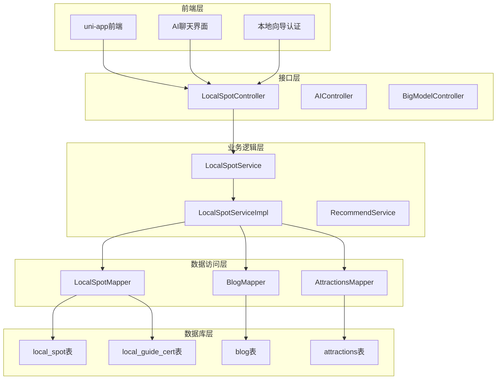

**架构图来源**
- [方案⑦-本地向导小众路线.md:13-44](file://方案⑦-本地向导小众路线.md#L13-L44)
- [aiChat.vue:1-200](file://uniapp-travel-social/homePages/aiChat/aiChat.vue#L1-L200)
- [set.vue:1-200](file://uniapp-travel-social/minePages/set.vue#L1-L200)

## 核心功能模块

### 1. 小众地点检索系统

#### 意图识别机制

前端AI聊天界面实现了智能意图识别，能够准确识别用户关于小众路线的询问：

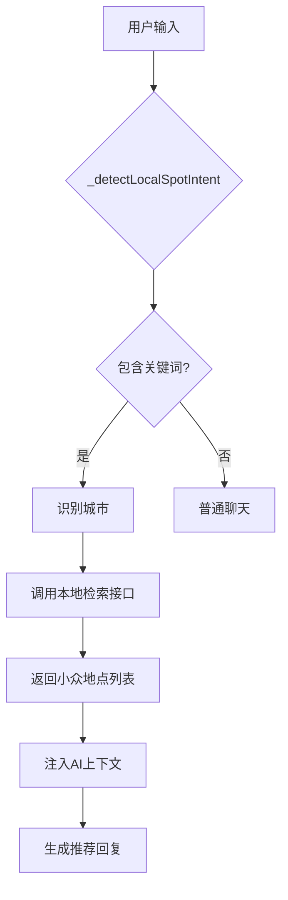

**流程图来源**
- [aiChat.vue:977-1008](file://uniapp-travel-social/homePages/aiChat/aiChat.vue#L977-L1008)

#### 检索算法

系统采用多维度检索策略：

1. **关键词匹配**：基于城市、关键词、类别进行精确匹配
2. **全文检索**：利用MySQL全文索引搜索地点名称、描述、提示信息
3. **质量排序**：综合考虑点赞数、字数、审核状态、精选标记等因素
4. **去重机制**：避免与知名景点重复

### 2. 本地向导认证系统

#### 认证流程

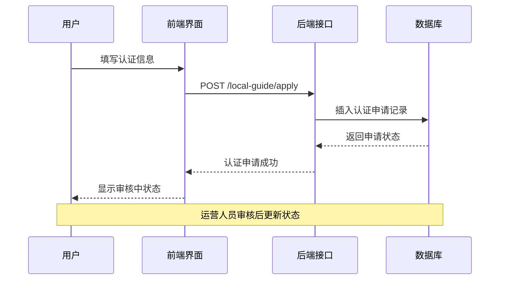

**序列图来源**
- [方案⑦-本地向导小众路线.md:162-178](file://方案⑦-本地向导小众路线.md#L162-L178)

#### 认证标准

- **用户基础**：平台活跃用户，有一定游记创作经验
- **作品要求**：提交1-5篇代表作游记
- **城市专长**：专注于特定城市的深度游记
- **审核机制**：运营人员人工审核认证质量

### 3. AI推荐增强系统

#### 检索路由决策

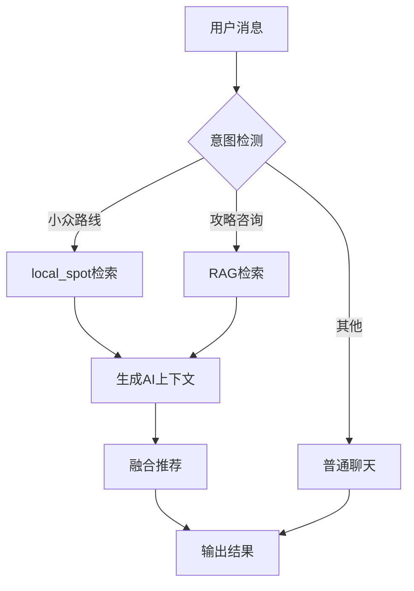

**流程图来源**
- [方案⑦-本地向导小众路线.md:297-304](file://方案⑦-本地向导小众路线.md#L297-L304)

## 数据库设计

### 核心数据表结构

#### local_spot表（本地小众地点库）

| 字段名 | 数据类型 | 约束 | 描述 |
|--------|----------|------|------|
| id | BIGINT | PRIMARY KEY, AUTO_INCREMENT | 主键 |
| name | VARCHAR(100) | NOT NULL | 地点名称 |
| city | VARCHAR(50) | NOT NULL | 所在城市 |
| province | VARCHAR(50) |  | 所在省份 |
| address | VARCHAR(200) |  | 详细地址 |
| description | TEXT |  | 地点描述 |
| tips | VARCHAR(500) |  | 实用提示 |
| best_season | VARCHAR(50) |  | 最佳游览季节 |
| image_url | VARCHAR(500) |  | 代表图片URL |
| source_blog_id | BIGINT |  | 来源博客ID |
| source_user_id | BIGINT |  | 推荐达人用户ID |
| category | VARCHAR(50) |  | 类别：自然/人文/美食/艺术/市集/其他 |
| quality_score | DECIMAL(5,2) | DEFAULT 0 | 综合质量分(0-100) |
| view_count | INT | DEFAULT 0 | 被查看/引用次数 |
| is_active | TINYINT(1) | DEFAULT 1 | 是否上架 |
| is_featured | TINYINT(1) | DEFAULT 0 | 是否精选 |
| is_verified | TINYINT(1) | DEFAULT 0 | 是否人工审核 |
| create_time | DATETIME | DEFAULT CURRENT_TIMESTAMP | 创建时间 |
| update_time | DATETIME | DEFAULT CURRENT_TIMESTAMP ON UPDATE CURRENT_TIMESTAMP | 更新时间 |

#### local_guide_cert表（本地向导认证）

| 字段名 | 数据类型 | 约束 | 描述 |
|--------|----------|------|------|
| id | BIGINT | PRIMARY KEY, AUTO_INCREMENT | 主键 |
| user_id | BIGINT | NOT NULL, UNIQUE | 用户ID |
| city | VARCHAR(50) | NOT NULL | 认证擅长城市 |
| intro | VARCHAR(200) |  | 向导简介 |
| cert_level | TINYINT | DEFAULT 1 | 认证等级：1=本地达人 2=资深向导 3=官方推荐 |
| status | TINYINT(1) | DEFAULT 1 | 认证状态：1有效 0撤销 |
| apply_time | DATETIME | NOT NULL | 申请时间 |
| cert_time | DATETIME |  | 审核通过时间 |

**数据表来源**
- [方案⑦-本地向导小众路线.md:57-105](file://方案⑦-本地向导小众路线.md#L57-L105)

### 索引优化策略

- **城市索引**：加速按城市检索
- **省份索引**：支持跨城市查询
- **类别索引**：快速筛选特定类型的地点
- **全文索引**：MySQL ngram解析器支持中文分词

## 前端实现

### AI聊天界面增强

#### 意图识别函数

前端实现了专门的小众地点意图识别函数：

```javascript
_detectLocalSpotIntent(text) {
    const localKeywords = [
        "小众", "不为人知", "本地人", "冷门", "私藏", "宝藏", "隐秘",
        "避开人群", "特别的", "不一样", "当地人推荐"
    ];
    
    const cityPattern = /北京|上海|广州|深圳|杭州|成都|重庆|武汉|西安|南京/;
    const cityMatch = text.match(cityPattern);
    
    return {
        isLocalSpot: localKeywords.some(keyword => text.includes(keyword)),
        city: cityMatch ? cityMatch[0] : null
    };
}
```

#### 小众地点卡片组件

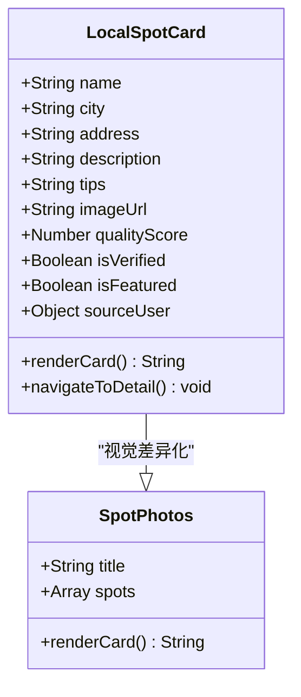

**类图来源**
- [方案⑦-本地向导小众路线.md:231-253](file://方案⑦-本地向导小众路线.md#L231-L253)

#### 视觉差异化设计

| 维度 | 普通景点卡片 | 本地达人推荐 |
|------|-------------|-------------|
| 背景色 | 白色 | 暖米色 `#FFF8F0` |
| 标题标签 | 📸 相关景点图片 | 🏮 本地达人私藏 |
| 认证标识 | 无 | 显示达人名 + 认证图标 |
| 底部来源 | 无 | "来自《xxx游记》" 可点击 |
| 边框 | 无特殊 | 左侧4rpx暖橙色竖线 |

### 设置页面集成

#### 本地向导认证入口

在用户设置页面新增了"申请本地向导认证"入口：

```javascript
setList: [
    {
        title: "申请本地向导",
        url: "/authentication/local-guide-apply"
    },
    {
        title: "隐私政策",
        url: "/minePages/content"
    },
    {
        title: "帮助中心", 
        url: "/minePages/help"
    }
]
```

**前端实现来源**
- [set.vue:94-102](file://uniapp-travel-social/minePages/set.vue#L94-L102)
- [pages.json:702-706](file://uniapp-travel-social/pages.json#L702-L706)

## 后端接口

### LocalSpotController

#### 小众地点检索接口

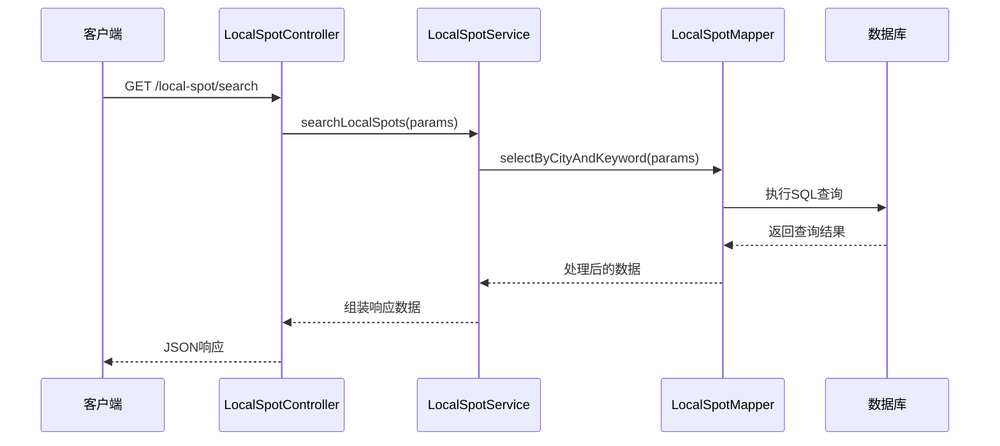

**序列图来源**
- [方案⑦-本地向导小众路线.md:111-151](file://方案⑦-本地向导小众路线.md#L111-L151)

#### 接口参数规范

| 参数名 | 类型 | 必填 | 默认值 | 描述 |
|--------|------|------|--------|------|
| city | String | 否 |  | 目标城市 |
| keyword | String | 否 |  | 关键词搜索 |
| category | String | 否 |  | 类别过滤 |
| limit | Integer | 否 | 5 | 返回数量 |
| featuredOnly | Boolean | 否 | false | 是否只返回精选 |

### LocalGuideController

#### 认证申请接口

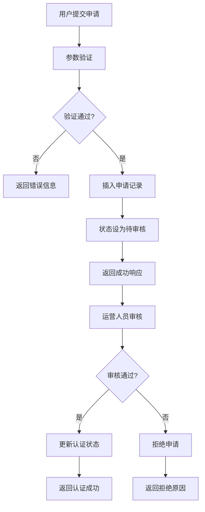

**流程图来源**
- [方案⑦-本地向导小众路线.md:162-178](file://方案⑦-本地向导小众路线.md#L162-L178)

## AI集成

### 大模型服务集成

#### API配置

后端通过配置文件集成多个AI服务：

```properties
# DeepSeek API配置
deepseek.api.key=sk-03162b8b45924e71a986c3a797c3573b
deepseek.api.base-url=https://api.deepseek.com
deepseek.api.model=deepseek-chat

# ChatGLM API配置  
zhipu.api.key=58a1534ba40647ea804d9eefef774226.dYpMxgzW1MsT9YaZ
zhipu.api.base-url=https://open.bigmodel.cn/api/paas/v4
zhipu.api.model=glm-4.6vl0.2
```

#### AI服务状态管理

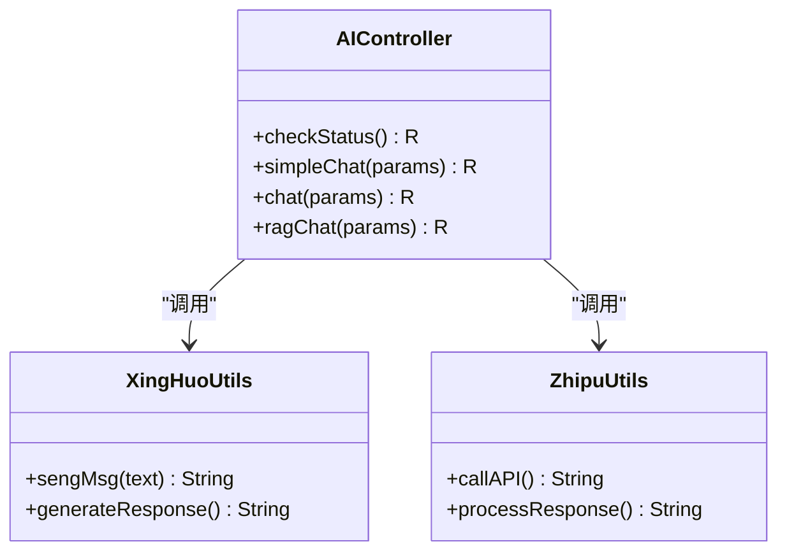

**类图来源**
- [BigModelController.java:1-51](file://springboot-travel-social/src/main/java/com/cxx/controller/BigModelController.java#L1-L51)

### 检索增强策略

#### 质量评分算法

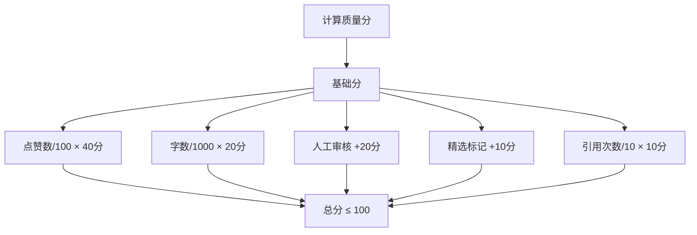

**流程图来源**
- [方案⑦-本地向导小众路线.md:285-295](file://方案⑦-本地向导小众路线.md#L285-L295)

## 性能优化

### 数据库优化

#### 索引策略

1. **复合索引**：city + is_active + quality_score
2. **全文索引**：name + description + tips 的 ngram 解析
3. **分区策略**：按时间分区存储历史数据

#### 查询优化

```sql
-- 优化的检索查询
SELECT id, name, city, address, description, tips, 
       quality_score, view_count, is_verified, is_featured,
       source_blog_id, source_user_id, category
FROM local_spot 
WHERE city = ? 
  AND is_active = 1
  AND MATCH(name, description, tips) AGAINST(? IN NATURAL LANGUAGE MODE)
ORDER BY quality_score DESC, view_count DESC
LIMIT ?
```

### 缓存策略

#### 多级缓存架构

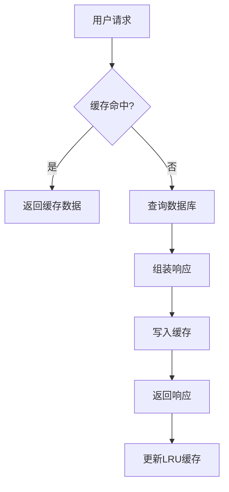

### 异步处理

#### 批量导入任务

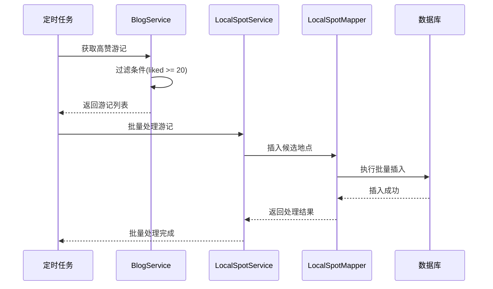

## 部署配置

### 环境配置

#### 应用配置

```properties
# 数据库连接
spring.datasource.url=jdbc:mysql://127.0.0.1:3306/travel_1?serverTimezone=GMT%2B8&characterEncoding=utf8&useUnicode=true

# Redis配置
spring.redis.host=127.0.0.1
spring.redis.port=6379

# RabbitMQ配置  
spring.rabbitmq.host=101.37.208.63
spring.rabbitmq.port=5672
spring.rabbitmq.username=admin
spring.rabbitmq.password=admin

# 服务器端口
server.port=8082
```

**配置来源**
- [application.properties:1-64](file://springboot-travel-social/src/main/resources/application.properties#L1-L64)

### 依赖管理

#### 核心依赖

```xml
<dependencies>
    <!-- Spring Boot Web -->
    <dependency>
        <groupId>org.springframework.boot</groupId>
        <artifactId>spring-boot-starter-web</artifactId>
    </dependency>
    
    <!-- MyBatis Plus -->
    <dependency>
        <groupId>com.baomidou</groupId>
        <artifactId>mybatis-plus-boot-starter</artifactId>
        <version>3.5.1</version>
    </dependency>
    
    <!-- MySQL驱动 -->
    <dependency>
        <groupId>mysql</groupId>
        <artifactId>mysql-connector-java</artifactId>
        <version>8.0.33</version>
    </dependency>
    
    <!-- Redis -->
    <dependency>
        <groupId>org.springframework.boot</groupId>
        <artifactId>spring-boot-starter-data-redis</artifactId>
    </dependency>
</dependencies>
```

**依赖来源**
- [pom.xml:16-182](file://springboot-travel-social/pom.xml#L16-L182)

## 总结

方案⑦"本地向导小众路线"通过以下创新点实现了差异化竞争优势：

### 核心优势

1. **数据独占性**：基于平台用户真实游记的小众景点知识库
2. **智能检索**：多维度意图识别和精准检索算法
3. **质量控制**：人工审核 + 自动化提取的双轨机制
4. **用户体验**：视觉差异化推荐卡片，增强交互体验

### 技术亮点

- **前后端分离架构**：清晰的职责划分和接口设计
- **高性能数据库**：合理的索引策略和查询优化
- **AI服务集成**：多模型API统一管理和负载均衡
- **缓存策略**：多级缓存提升系统响应速度

### 未来发展方向

1. **智能化程度提升**：引入更先进的NLP算法进行内容理解
2. **个性化推荐**：结合用户画像提供更精准的推荐
3. **实时更新机制**：建立更高效的增量更新策略
4. **生态扩展**：支持更多类型的本地向导服务

该方案为旅游攻略社交小程序建立了独特的竞争优势，通过本地化、个性化的服务体验，提升了用户粘性和平台价值。