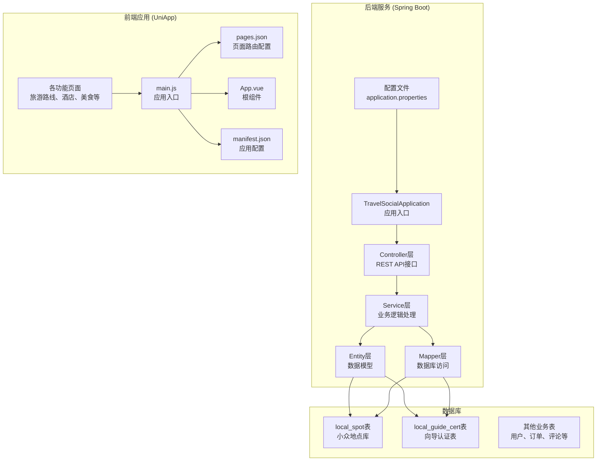
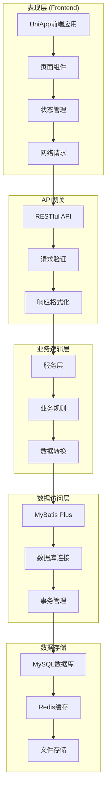
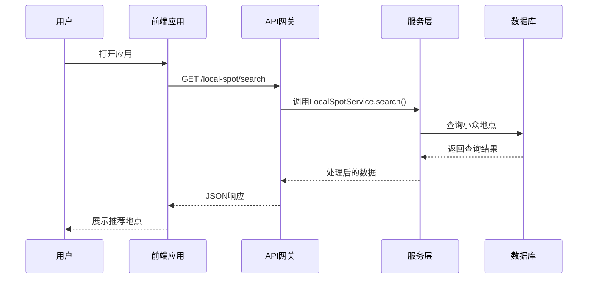
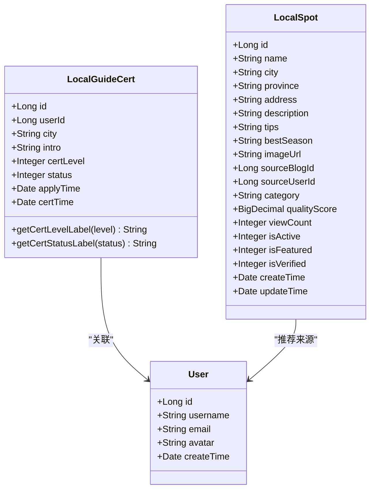
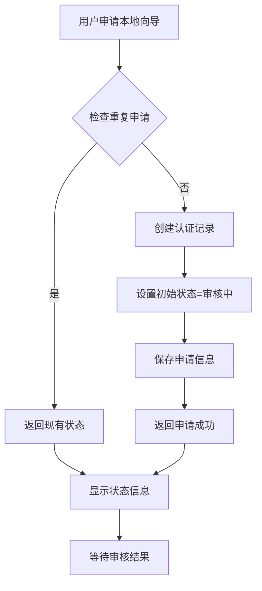
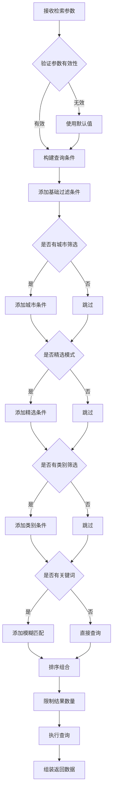
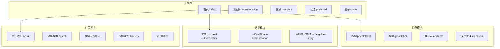
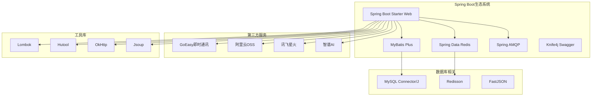
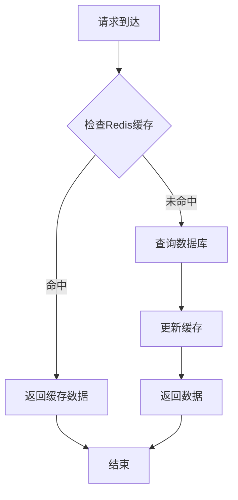

# 本地向导小众路线

<cite>
**本文档引用的文件**
- [TravelSocialApplication.java](file://springboot-travel-social/src/main/java/com/cxx/TravelSocialApplication.java)
- [LocalSpotController.java](file://springboot-travel-social/src/main/java/com/cxx/controller/LocalSpotController.java)
- [LocalSpotService.java](file://springboot-travel-social/src/main/java/com/cxx/service/LocalSpotService.java)
- [LocalSpotServiceImpl.java](file://springboot-travel-social/src/main/java/com/cxx/service/impl/LocalSpotServiceImpl.java)
- [LocalGuideCert.java](file://springboot-travel-social/src/main/java/com/cxx/entity/LocalGuideCert.java)
- [application.properties](file://springboot-travel-social/src/main/resources/application.properties)
- [local_spot.sql](file://springboot-travel-social/src/main/resources/sql/local_spot.sql)
- [pom.xml](file://springboot-travel-social/pom.xml)
- [manifest.json](file://uniapp-travel-social/manifest.json)
- [main.js](file://uniapp-travel-social/main.js)
- [pages.json](file://uniapp-travel-social/pages.json)
- [App.vue](file://uniapp-travel-social/App.vue)
</cite>

## 目录
1. [项目概述](#项目概述)
2. [项目结构](#项目结构)
3. [核心组件](#核心组件)
4. [架构概览](#架构概览)
5. [详细组件分析](#详细组件分析)
6. [依赖关系分析](#依赖关系分析)
7. [性能考虑](#性能考虑)
8. [故障排除指南](#故障排除指南)
9. [结论](#结论)

## 项目概述

"本地向导小众路线"是一个基于Spring Boot和UniApp开发的旅游攻略社交小程序，专注于为用户提供小众、非主流的旅游目的地推荐和本地向导服务。该项目旨在打破传统旅游攻略的同质化模式，通过本地向导的真实体验和深度推荐，为用户打造独特的旅行体验。

### 核心功能特性

- **小众地点发现**：提供精心筛选的非主流旅游目的地
- **本地向导认证体系**：建立专业的本地向导认证机制
- **智能推荐算法**：基于用户偏好和地理位置的个性化推荐
- **社交互动功能**：支持用户分享旅行体验和交流
- **一站式服务**：整合交通、住宿、美食等旅行相关服务

## 项目结构

项目采用前后端分离架构，包含Spring Boot后端服务和UniApp前端应用两个主要部分。



**图表来源**
- [TravelSocialApplication.java:16-25](file://springboot-travel-social/src/main/java/com/cxx/TravelSocialApplication.java#L16-L25)
- [main.js:1-25](file://uniapp-travel-social/main.js#L1-L25)

**章节来源**
- [pom.xml:1-243](file://springboot-travel-social/pom.xml#L1-L243)
- [manifest.json:1-124](file://uniapp-travel-social/manifest.json#L1-L124)

## 核心组件

### 后端核心组件

#### 应用启动类
应用启动类负责初始化Spring Boot应用并配置WebSocket服务器。

#### 控制器层
- **LocalSpotController**：处理小众地点相关的HTTP请求
- **多个业务控制器**：涵盖旅游相关的各种功能模块

#### 服务层
- **LocalSpotService**：定义小众地点服务接口
- **LocalSpotServiceImpl**：实现具体的业务逻辑

#### 数据模型层
- **LocalGuideCert**：本地向导认证实体类
- **多个业务实体类**：对应数据库中的各种表结构

**章节来源**
- [TravelSocialApplication.java:13-54](file://springboot-travel-social/src/main/java/com/cxx/TravelSocialApplication.java#L13-L54)
- [LocalSpotController.java:11-65](file://springboot-travel-social/src/main/java/com/cxx/controller/LocalSpotController.java#L11-L65)
- [LocalSpotService.java:6-35](file://springboot-travel-social/src/main/java/com/cxx/service/LocalSpotService.java#L6-L35)
- [LocalSpotServiceImpl.java:18-229](file://springboot-travel-social/src/main/java/com/cxx/service/impl/LocalSpotServiceImpl.java#L18-L229)
- [LocalGuideCert.java:10-25](file://springboot-travel-social/src/main/java/com/cxx/entity/LocalGuideCert.java#L10-L25)

### 前端核心组件

#### 应用入口配置
- **main.js**：配置HTTP请求、全局拦截器和第三方SDK
- **App.vue**：应用生命周期管理和系统信息获取
- **pages.json**：页面路由和导航配置
- **manifest.json**：应用基本信息和权限配置

#### 功能页面组织
- **首页模块**：旅游攻略、AI聊天、行程规划
- **服务模块**：酒店预订、美食推荐、交通服务
- **社交模块**：游记分享、圈子互动、消息系统
- **个人中心**：账户管理、设置选项

**章节来源**
- [main.js:1-118](file://uniapp-travel-social/main.js#L1-L118)
- [App.vue:6-85](file://uniapp-travel-social/App.vue#L6-L85)
- [pages.json:1-867](file://uniapp-travel-social/pages.json#L1-L867)
- [manifest.json:1-124](file://uniapp-travel-social/manifest.json#L1-L124)

## 架构概览

系统采用分层架构设计，确保前后端分离和职责清晰。



**图表来源**
- [pom.xml:16-182](file://springboot-travel-social/pom.xml#L16-L182)
- [application.properties:1-64](file://springboot-travel-social/src/main/resources/application.properties#L1-L64)

### 数据流架构



**图表来源**
- [LocalSpotController.java:20-29](file://springboot-travel-social/src/main/java/com/cxx/controller/LocalSpotController.java#L20-L29)
- [LocalSpotServiceImpl.java:37-140](file://springboot-travel-social/src/main/java/com/cxx/service/impl/LocalSpotServiceImpl.java#L37-L140)

## 详细组件分析

### 本地向导认证系统

#### 数据模型设计



**图表来源**
- [LocalGuideCert.java:10-25](file://springboot-travel-social/src/main/java/com/cxx/entity/LocalGuideCert.java#L10-L25)
- [LocalSpotServiceImpl.java:84-123](file://springboot-travel-social/src/main/java/com/cxx/service/impl/LocalSpotServiceImpl.java#L84-L123)

#### 认证流程



**图表来源**
- [LocalSpotServiceImpl.java:142-180](file://springboot-travel-social/src/main/java/com/cxx/service/impl/LocalSpotServiceImpl.java#L142-L180)

**章节来源**
- [LocalGuideCert.java:10-25](file://springboot-travel-social/src/main/java/com/cxx/entity/LocalGuideCert.java#L10-L25)
- [LocalSpotServiceImpl.java:142-229](file://springboot-travel-social/src/main/java/com/cxx/service/impl/LocalSpotServiceImpl.java#L142-L229)

### 小众地点检索系统

#### 检索算法



**图表来源**
- [LocalSpotServiceImpl.java:37-140](file://springboot-travel-social/src/main/java/com/cxx/service/impl/LocalSpotServiceImpl.java#L37-L140)

#### 排序策略

系统采用多维度排序策略，确保推荐结果的质量和相关性：

1. **精选优先**：优先展示经过人工审核的精选地点
2. **质量评分**：基于综合质量分进行降序排列
3. **热度指标**：根据浏览量和用户反馈调整排名

**章节来源**
- [LocalSpotServiceImpl.java:37-140](file://springboot-travel-social/src/main/java/com/cxx/service/impl/LocalSpotServiceImpl.java#L37-L140)

### 前端应用架构

#### 页面路由系统



**图表来源**
- [pages.json:6-867](file://uniapp-travel-social/pages.json#L6-L867)

#### 网络请求配置

前端应用通过统一的HTTP请求配置实现：

- **基础URL设置**：指向后端API服务
- **请求拦截器**：自动添加认证令牌
- **响应拦截器**：处理登录状态和错误信息
- **全局加载状态**：统一的加载提示

**章节来源**
- [main.js:15-63](file://uniapp-travel-social/main.js#L15-L63)
- [pages.json:1-867](file://uniapp-travel-social/pages.json#L1-L867)

## 依赖关系分析

### 后端技术栈

系统采用现代化的Java技术栈，确保系统的稳定性和可扩展性。



**图表来源**
- [pom.xml:16-182](file://springboot-travel-social/pom.xml#L16-L182)

### 前端技术栈

前端应用采用UniApp跨平台框架，支持多端部署。

```mermaid
graph TB
subgraph "UI框架"
A[uView UI]
B[Tuniao UI]
C[SCSS样式预处理器]
end
subgraph "网络请求"
D[@escook/request-miniprogram]
E[HTTP拦截器]
end
subgraph "即时通讯"
F[GoEasy SDK]
G[消息推送]
end
subgraph "多媒体处理"
H[录音管理]
I[音频播放]
J[文件上传]
end
A --> D
B --> D
C --> A
D --> E
D --> F
F --> G
A --> H
A --> I
A --> J
```

**图表来源**
- [main.js:10-24](file://uniapp-travel-social/main.js#L10-L24)
- [manifest.json:63-96](file://uniapp-travel-social/manifest.json#L63-L96)

**章节来源**
- [pom.xml:16-182](file://springboot-travel-social/pom.xml#L16-L182)
- [main.js:10-24](file://uniapp-travel-social/main.js#L10-L24)

## 性能考虑

### 数据库优化

系统在数据库层面采用了多项优化措施：

- **索引策略**：为常用查询字段建立复合索引
- **查询优化**：使用条件查询和排序组合减少全表扫描
- **缓存机制**：结合Redis实现热点数据缓存
- **连接池配置**：合理配置数据库连接池参数

### 缓存策略



### 并发控制

系统通过以下方式保证并发安全性：

- **分布式锁**：使用Redisson实现分布式锁
- **事务管理**：Spring声明式事务确保数据一致性
- **限流策略**：防止恶意刷单和系统过载
- **优雅降级**：在高负载情况下提供基本功能

## 故障排除指南

### 常见问题及解决方案

#### 后端服务问题

**问题**：应用启动失败
- 检查数据库连接配置
- 验证端口占用情况
- 确认依赖包完整性

**问题**：API接口返回异常
- 查看服务端日志输出
- 检查请求参数格式
- 验证数据库连接状态

#### 前端应用问题

**问题**：页面加载缓慢
- 检查网络请求状态
- 验证静态资源加载
- 清除浏览器缓存

**问题**：功能按钮无响应
- 检查JavaScript错误
- 验证事件绑定
- 确认组件状态

### 调试工具

系统提供了完善的调试和监控工具：

- **Swagger API文档**：在线API测试界面
- **日志系统**：结构化的日志输出
- **性能监控**：系统运行状态监控
- **错误追踪**：异常信息收集和分析

**章节来源**
- [application.properties:13-43](file://springboot-travel-social/src/main/resources/application.properties#L13-L43)

## 结论

"本地向导小众路线"旅游攻略社交小程序通过精心设计的技术架构和丰富的功能特性，为用户提供了独特而优质的旅行体验。系统采用前后端分离的设计模式，结合Spring Boot和UniApp技术栈，实现了高性能、可扩展的应用程序。

### 主要优势

1. **技术创新**：采用本地向导认证机制，提供真实可靠的旅行推荐
2. **用户体验**：简洁直观的界面设计，流畅的操作体验
3. **技术先进**：现代化的技术栈，良好的可维护性和扩展性
4. **功能完善**：覆盖旅游服务的各个环节，满足用户多样化需求

### 发展前景

随着旅游业的数字化转型，该系统具有广阔的发展空间。未来可以进一步优化推荐算法、增强社交功能、拓展服务范围，为用户提供更加智能化和个性化的旅行服务。

通过持续的技术创新和功能完善，"本地向导小众路线"将成为旅游行业数字化转型的典范，为用户创造更多价值。