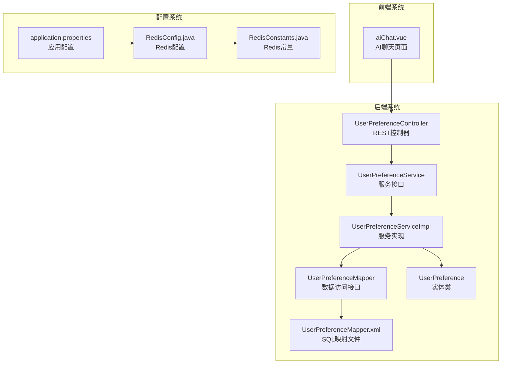
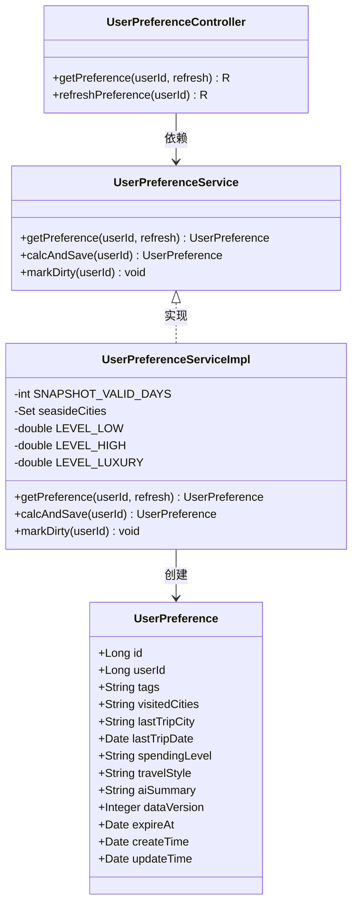
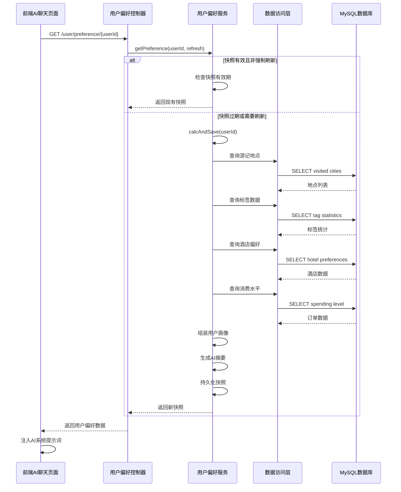
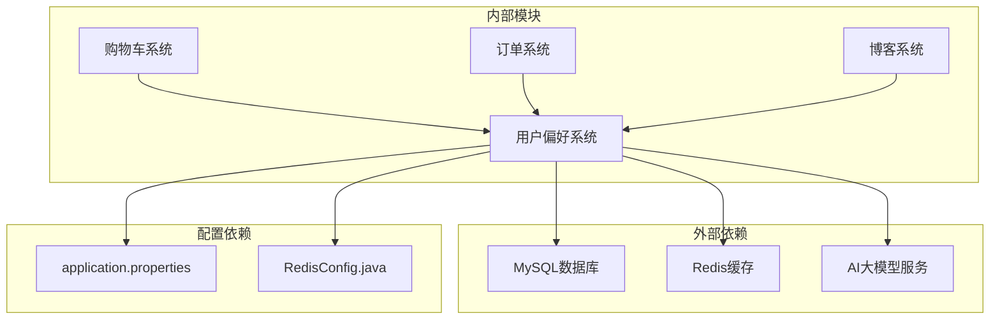

# 用户偏好系统

<cite>
**本文档引用的文件**
- [UserPreferenceController.java](file://springboot-travel-social/src/main/java/com/cxx/controller/UserPreferenceController.java)
- [UserPreferenceService.java](file://springboot-travel-social/src/main/java/com/cxx/service/UserPreferenceService.java)
- [UserPreferenceServiceImpl.java](file://springboot-travel-social/src/main/java/com/cxx/service/impl/UserPreferenceServiceImpl.java)
- [UserPreferenceMapper.java](file://springboot-travel-social/src/main/java/com/cxx/mapper/UserPreferenceMapper.java)
- [UserPreferenceMapper.xml](file://springboot-travel-social/src/main/resources/com/cxx/mapper/UserPreferenceMapper.xml)
- [UserPreference.java](file://springboot-travel-social/src/main/java/com/cxx/entity/UserPreference.java)
- [application.properties](file://springboot-travel-social/src/main/resources/application.properties)
- [RedisConfig.java](file://springboot-travel-social/src/main/java/com/cxx/config/RedisConfig.java)
- [RedisConstants.java](file://springboot-travel-social/src/main/java/com/cxx/utils/RedisConstants.java)
- [aiChat.vue](file://uniapp-travel-social/homePages/aiChat/aiChat.vue)
- [方案①-个性化AI推荐.md](file://方案①-个性化AI推荐.md)
</cite>

## 目录
1. [简介](#简介)
2. [项目结构](#项目结构)
3. [核心组件](#核心组件)
4. [架构概览](#架构概览)
5. [详细组件分析](#详细组件分析)
6. [依赖关系分析](#依赖关系分析)
7. [性能考虑](#性能考虑)
8. [故障排除指南](#故障排除指南)
9. [结论](#结论)

## 简介

用户偏好系统是旅游攻略社交小程序的核心智能化功能模块，旨在通过分析用户的历史行为数据，构建个性化的旅行偏好画像，并将其注入AI聊天系统中，为用户提供更加精准和个性化的旅行推荐服务。

该系统能够从多个维度分析用户行为，包括：
- 旅行经历：通过游记地点和酒店预订记录分析用户偏好的旅行目的地
- 兴趣爱好：通过博客标签和点赞内容分析用户的兴趣偏好
- 消费水平：通过订单数据分析用户的消费能力和偏好
- 旅行风格：通过综合分析生成用户独特的旅行风格描述

## 项目结构

用户偏好系统主要分布在Spring Boot后端和UniApp前端两个部分：

**图表来源**
- [UserPreferenceController.java:1-56](file://springboot-travel-social/src/main/java/com/cxx/controller/UserPreferenceController.java#L1-L56)
- [UserPreferenceServiceImpl.java:1-227](file://springboot-travel-social/src/main/java/com/cxx/service/impl/UserPreferenceServiceImpl.java#L1-L227)
- [aiChat.vue:1007-1465](file://uniapp-travel-social/homePages/aiChat/aiChat.vue#L1007-L1465)

**章节来源**
- [UserPreferenceController.java:1-56](file://springboot-travel-social/src/main/java/com/cxx/controller/UserPreferenceController.java#L1-L56)
- [UserPreferenceServiceImpl.java:1-227](file://springboot-travel-social/src/main/java/com/cxx/service/impl/UserPreferenceServiceImpl.java#L1-L227)
- [aiChat.vue:1007-1465](file://uniapp-travel-social/homePages/aiChat/aiChat.vue#L1007-L1465)

## 核心组件

### 数据模型设计

用户偏好系统的核心数据模型是一个名为`UserPreference`的实体类，它包含了用户旅行偏好的完整信息：

**图表来源**
- [UserPreference.java:1-74](file://springboot-travel-social/src/main/java/com/cxx/entity/UserPreference.java#L1-L74)
- [UserPreferenceController.java:1-56](file://springboot-travel-social/src/main/java/com/cxx/controller/UserPreferenceController.java#L1-L56)
- [UserPreferenceService.java:1-30](file://springboot-travel-social/src/main/java/com/cxx/service/UserPreferenceService.java#L1-L30)
- [UserPreferenceServiceImpl.java:1-227](file://springboot-travel-social/src/main/java/com/cxx/service/impl/UserPreferenceServiceImpl.java#L1-L227)

### 数据库查询策略

系统通过MyBatis映射文件实现了复杂的数据聚合查询，主要包括以下几种查询类型：

1. **游记地点查询**：从博客表中提取用户去过的真实地点
2. **标签分析查询**：统计用户博客中的高频标签
3. **酒店偏好查询**：分析用户的住宿偏好和消费水平
4. **消费水平查询**：通过订单数据计算用户的消费能力

**章节来源**
- [UserPreferenceMapper.java:1-52](file://springboot-travel-social/src/main/java/com/cxx/mapper/UserPreferenceMapper.java#L1-L52)
- [UserPreferenceMapper.xml:1-127](file://springboot-travel-social/src/main/resources/com/cxx/mapper/UserPreferenceMapper.xml#L1-L127)

## 架构概览

用户偏好系统采用典型的三层架构设计，实现了数据采集、处理和应用的完整流程：

**图表来源**
- [UserPreferenceController.java:25-54](file://springboot-travel-social/src/main/java/com/cxx/controller/UserPreferenceController.java#L25-L54)
- [UserPreferenceServiceImpl.java:45-177](file://springboot-travel-social/src/main/java/com/cxx/service/impl/UserPreferenceServiceImpl.java#L45-L177)
- [aiChat.vue:1028-1038](file://uniapp-travel-social/homePages/aiChat/aiChat.vue#L1028-L1038)

## 详细组件分析

### 后端服务层

#### 用户偏好控制器

控制器层提供了两个核心接口：
1. **获取用户偏好**：支持快照读取和强制刷新
2. **手动刷新偏好**：供内部业务调用触发

控制器实现了优雅的错误处理机制，当用户偏好数据为空或AI摘要为空时，系统会返回空数据而非抛出异常。

#### 用户偏好服务实现

服务实现层是整个系统的核心逻辑所在，包含以下关键功能：

**快照管理机制**
- 快照有效期：默认7天
- 自动刷新：过期自动重新计算
- 手动标记：行为变化时立即失效

**多维度数据分析**
- **游记分析**：从博客表中提取地点和标签信息
- **酒店偏好**：通过酒店订单分析住宿偏好
- **消费水平**：基于订单均价计算消费能力
- **兴趣标签**：综合用户点赞内容的兴趣偏好

**AI摘要生成**
系统将所有分析结果整合为自然语言描述，便于AI系统理解和使用。

**章节来源**
- [UserPreferenceController.java:25-54](file://springboot-travel-social/src/main/java/com/cxx/controller/UserPreferenceController.java#L25-L54)
- [UserPreferenceServiceImpl.java:45-177](file://springboot-travel-social/src/main/java/com/cxx/service/impl/UserPreferenceServiceImpl.java#L45-L177)

### 数据访问层

#### 复杂查询优化

数据访问层通过精心设计的SQL查询实现了高效的数据聚合：

**标签解析策略**
系统支持MySQL 5.7和8.0的不同语法，通过UNION操作实现标签的动态解析，兼容不同版本的数据库。

**性能优化措施**
- 使用LIMIT限制查询结果数量
- 通过DISTINCT去重避免重复计算
- 合理的索引使用提升查询性能

**章节来源**
- [UserPreferenceMapper.xml:37-59](file://springboot-travel-social/src/main/resources/com/cxx/mapper/UserPreferenceMapper.xml#L37-L59)
- [UserPreferenceMapper.xml:105-124](file://springboot-travel-social/src/main/resources/com/cxx/mapper/UserPreferenceMapper.xml#L105-L124)

### 前端集成

#### AI聊天页面集成

前端AI聊天页面通过以下方式集成用户偏好系统：

**懒加载机制**
- 页面加载时不阻塞用户体验
- 静默获取用户偏好数据
- 失败时不影响聊天功能

**提示词注入**
系统将用户偏好数据自动注入到AI的systemPrompt中，使AI能够提供个性化的旅行建议。

**章节来源**
- [aiChat.vue:1028-1038](file://uniapp-travel-social/homePages/aiChat/aiChat.vue#L1028-L1038)
- [aiChat.vue:1456-1465](file://uniapp-travel-social/homePages/aiChat/aiChat.vue#L1456-L1465)

## 依赖关系分析

用户偏好系统与其他系统组件的依赖关系如下：

**图表来源**
- [application.properties:1-64](file://springboot-travel-social/src/main/resources/application.properties#L1-L64)
- [RedisConfig.java:1-33](file://springboot-travel-social/src/main/java/com/cxx/config/RedisConfig.java#L1-L33)

### 数据库设计

系统使用MySQL作为主要数据存储，通过逻辑删除字段实现软删除功能。Redis用于缓存用户偏好快照，提升系统响应速度。

**章节来源**
- [application.properties:20-22](file://springboot-travel-social/src/main/resources/application.properties#L20-L22)
- [RedisConstants.java:1-30](file://springboot-travel-social/src/main/java/com/cxx/utils/RedisConstants.java#L1-L30)

## 性能考虑

### 缓存策略

系统采用了多层次的缓存策略来提升性能：

1. **快照缓存**：用户偏好快照默认7天有效期
2. **Redis缓存**：利用Redis存储热点数据
3. **数据库优化**：合理的索引设计和查询优化

### 异步处理

系统使用`@Async`注解实现异步标记机制，当用户行为发生变化时，系统会异步标记相关用户的偏好快照为过期状态，避免阻塞主线程。

### 错误处理

系统实现了完善的错误处理机制：
- 数据库查询异常时返回空偏好
- 前端集成采用静默失败策略
- 日志记录便于问题排查

## 故障排除指南

### 常见问题及解决方案

**问题1：用户偏好数据为空**
- 检查用户是否有足够的历史行为数据
- 验证数据库连接配置
- 查看日志文件定位具体错误

**问题2：AI聊天功能异常**
- 确认用户偏好接口返回正常
- 检查前端集成代码
- 验证网络连接状态

**问题3：性能问题**
- 检查数据库查询性能
- 优化Redis缓存配置
- 监控系统资源使用情况

### 调试技巧

1. **启用详细日志**：在开发环境中开启详细的日志输出
2. **监控指标**：关注数据库查询时间和缓存命中率
3. **单元测试**：编写针对关键业务逻辑的测试用例

**章节来源**
- [UserPreferenceServiceImpl.java:172-176](file://springboot-travel-social/src/main/java/com/cxx/service/impl/UserPreferenceServiceImpl.java#L172-L176)

## 结论

用户偏好系统通过智能化的数据分析和处理，为旅游攻略社交小程序提供了强大的个性化推荐能力。系统采用模块化设计，具有良好的扩展性和维护性。

### 主要优势

1. **全面的数据分析**：从多个维度分析用户行为
2. **智能的快照机制**：平衡数据新鲜度和系统性能
3. **优雅的错误处理**：确保系统稳定性
4. **良好的前后端集成**：无缝融入AI聊天体验

### 未来改进方向

1. **机器学习算法**：引入更高级的推荐算法
2. **实时数据处理**：支持更及时的用户行为响应
3. **A/B测试框架**：验证推荐效果的改进
4. **多模态数据融合**：结合图片、视频等多媒体内容

该系统为整个旅游攻略社交小程序奠定了智能化的基础，为用户提供更加个性化和优质的旅行服务体验。