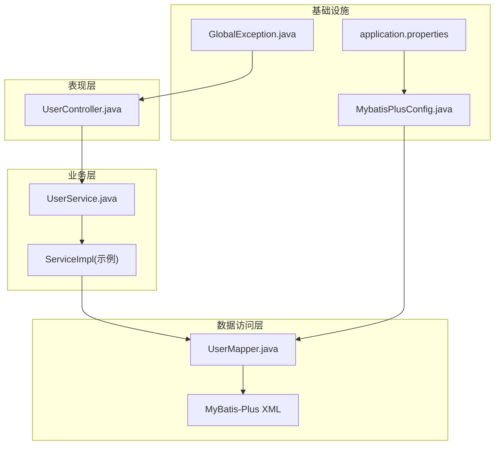
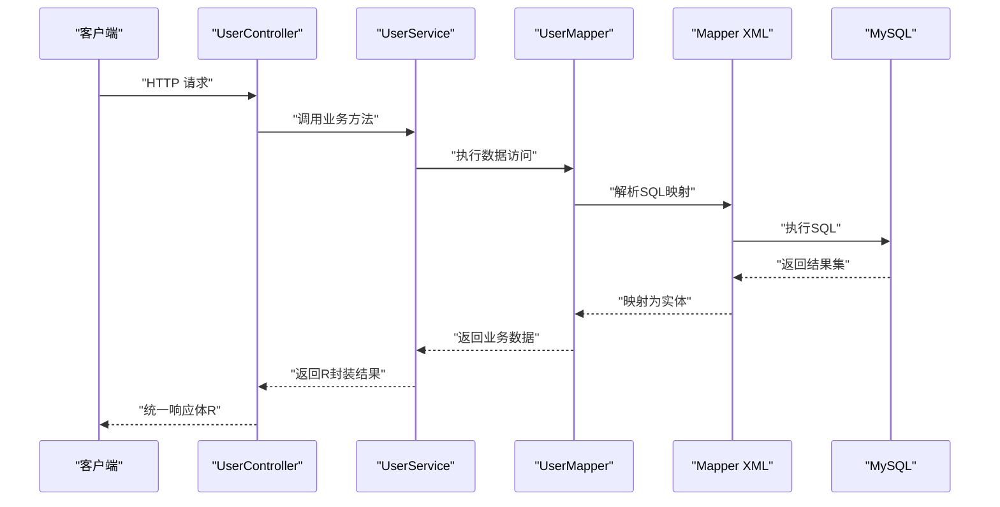
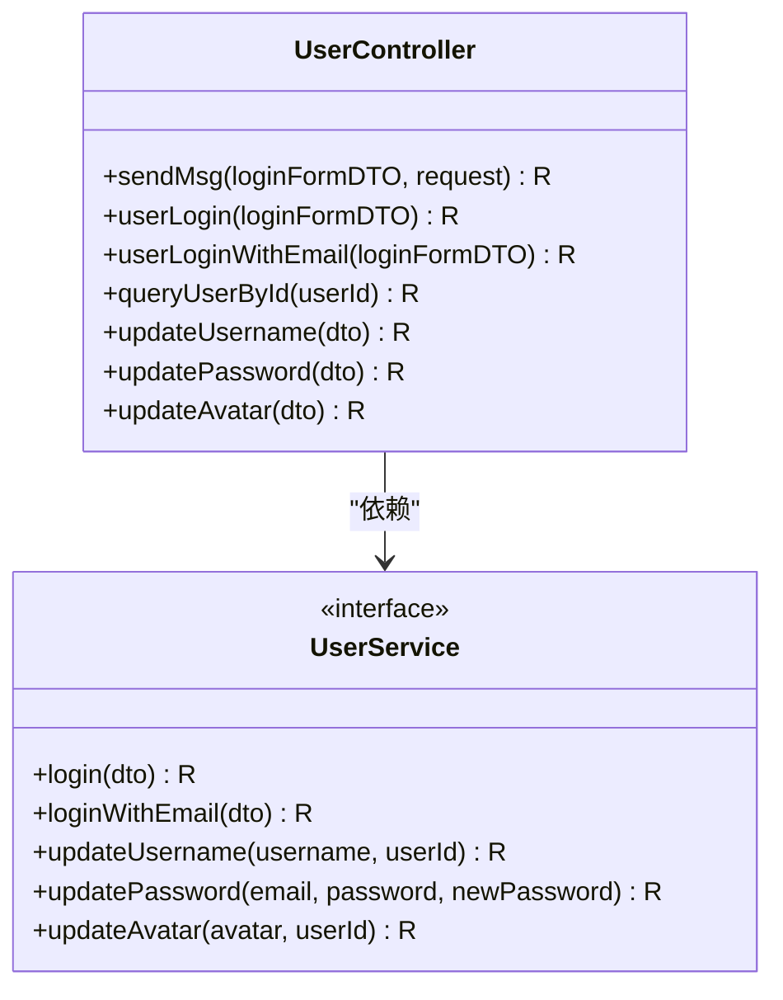
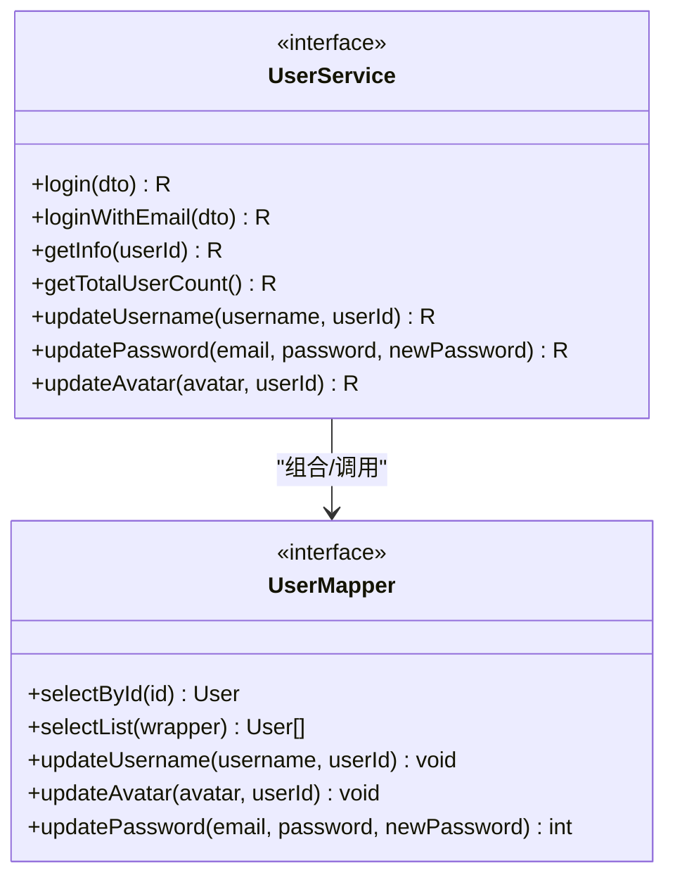
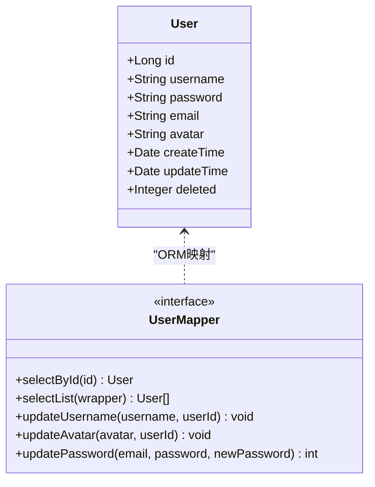
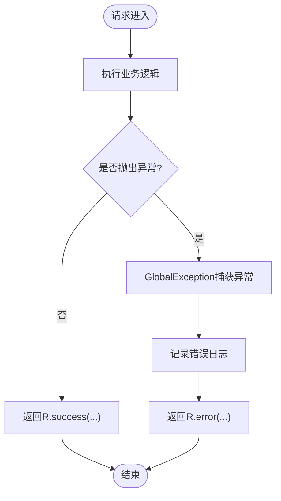
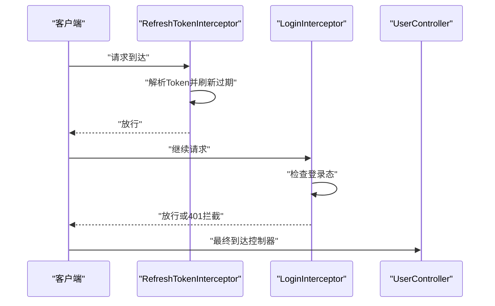
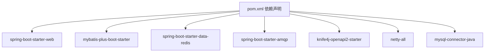

# 分层架构设计

<cite>
**本文引用的文件**
- [TravelSocialApplication.java](file://springboot-travel-social/src/main/java/com/cxx/TravelSocialApplication.java)
- [MybatisPlusConfig.java](file://springboot-travel-social/src/main/java/com/cxx/config/MybatisPlusConfig.java)
- [GlobalException.java](file://springboot-travel-social/src/main/java/com/cxx/exception/GlobalException.java)
- [UserController.java](file://springboot-travel-social/src/main/java/com/cxx/controller/UserController.java)
- [UserService.java](file://springboot-travel-social/src/main/java/com/cxx/service/UserService.java)
- [UserMapper.java](file://springboot-travel-social/src/main/java/com/cxx/mapper/UserMapper.java)
- [User.java](file://springboot-travel-social/src/main/java/com/cxx/entity/User.java)
- [R.java](file://springboot-travel-social/src/main/java/com/cxx/entity/R.java)
- [MvcConfig.java](file://springboot-travel-social/src/main/java/com/cxx/config/MvcConfig.java)
- [LoginInterceptor.java](file://springboot-travel-social/src/main/java/com/cxx/utils/LoginInterceptor.java)
- [RefreshTokenInterceptor.java](file://springboot-travel-social/src/main/java/com/cxx/utils/RefreshTokenInterceptor.java)
- [application.properties](file://springboot-travel-social/src/main/resources/application.properties)
- [pom.xml](file://springboot-travel-social/pom.xml)
</cite>

## 目录
1. [引言](#引言)
2. [项目结构](#项目结构)
3. [核心组件](#核心组件)
4. [架构总览](#架构总览)
5. [详细组件分析](#详细组件分析)
6. [依赖分析](#依赖分析)
7. [性能考虑](#性能考虑)
8. [故障排查指南](#故障排查指南)
9. [结论](#结论)
10. [附录](#附录)

## 引言
本设计文档聚焦于该Spring Boot项目的三层架构实现：表现层（Controller）、业务逻辑层（Service）、数据访问层（Mapper）。文档将阐述每层的职责与调用关系，说明数据与控制流如何在各层之间传递；同时介绍MyBatis-Plus在本项目中的使用方式与ORM映射策略，并总结事务管理与异常处理在分层架构中的落地实践。

## 项目结构
项目采用标准的分层目录组织方式：
- 表现层：controller 包，负责接收HTTP请求、参数校验、返回统一响应体。
- 业务层：service 接口与实现，封装业务规则与流程编排。
- 数据访问层：mapper 接口与XML映射，负责数据库操作。
- 实体与DTO：entity 与 dto 包，承载数据模型与传输对象。
- 配置与工具：config、utils、exception 等，提供拦截器、全局异常、MyBatis-Plus配置等横切能力。
- 资源与配置：resources 下的 application.properties、mapper XML等。

图表来源
- [UserController.java:31-136](file://springboot-travel-social/src/main/java/com/cxx/controller/UserController.java#L31-L136)
- [UserService.java:18-35](file://springboot-travel-social/src/main/java/com/cxx/service/UserService.java#L18-L35)
- [UserMapper.java:17-22](file://springboot-travel-social/src/main/java/com/cxx/mapper/UserMapper.java#L17-L22)
- [MybatisPlusConfig.java:10-19](file://springboot-travel-social/src/main/java/com/cxx/config/MybatisPlusConfig.java#L10-L19)
- [application.properties:1-61](file://springboot-travel-social/src/main/resources/application.properties#L1-L61)
- [GlobalException.java:8-17](file://springboot-travel-social/src/main/java/com/cxx/exception/GlobalException.java#L8-L17)

章节来源
- [TravelSocialApplication.java:16-25](file://springboot-travel-social/src/main/java/com/cxx/TravelSocialApplication.java#L16-L25)
- [pom.xml:16-182](file://springboot-travel-social/pom.xml#L16-L182)

## 核心组件
- 统一响应体 R：用于所有接口返回值的标准化封装，包含状态码、消息与数据体，便于前端统一处理。
- 控制器 UserController：面向REST API，负责参数接收、简单校验、调用Service并返回R。
- 服务接口 UserService：定义业务契约，结合MyBatis-Plus的IService扩展能力，提供通用CRUD与自定义方法。
- Mapper 接口 UserMapper：继承BaseMapper，提供基础查询与自定义SQL方法，配合XML映射实现复杂查询。
- MyBatis-Plus 配置：启用分页插件、扫描Mapper包、设置逻辑删除字段等。
- 全局异常 GlobalException：统一捕获运行时异常，返回R.error，保障接口健壮性。
- MVC拦截器：LoginInterceptor与RefreshTokenInterceptor，分别负责登录态校验与Token刷新，贯穿请求生命周期。

章节来源
- [R.java:14-30](file://springboot-travel-social/src/main/java/com/cxx/entity/R.java#L14-L30)
- [UserController.java:31-136](file://springboot-travel-social/src/main/java/com/cxx/controller/UserController.java#L31-L136)
- [UserService.java:18-35](file://springboot-travel-social/src/main/java/com/cxx/service/UserService.java#L18-L35)
- [UserMapper.java:17-22](file://springboot-travel-social/src/main/java/com/cxx/mapper/UserMapper.java#L17-L22)
- [MybatisPlusConfig.java:10-19](file://springboot-travel-social/src/main/java/com/cxx/config/MybatisPlusConfig.java#L10-L19)
- [GlobalException.java:8-17](file://springboot-travel-social/src/main/java/com/cxx/exception/GlobalException.java#L8-L17)
- [MvcConfig.java:11-74](file://springboot-travel-social/src/main/java/com/cxx/config/MvcConfig.java#L11-L74)
- [LoginInterceptor.java:7-17](file://springboot-travel-social/src/main/java/com/cxx/utils/LoginInterceptor.java#L7-L17)
- [RefreshTokenInterceptor.java:13-49](file://springboot-travel-social/src/main/java/com/cxx/utils/RefreshTokenInterceptor.java#L13-L49)

## 架构总览
下图展示了从HTTP请求到数据库访问的完整链路，以及各层之间的依赖方向：

图表来源
- [UserController.java:83-93](file://springboot-travel-social/src/main/java/com/cxx/controller/UserController.java#L83-L93)
- [UserService.java:20-24](file://springboot-travel-social/src/main/java/com/cxx/service/UserService.java#L20-L24)
- [UserMapper.java:17-22](file://springboot-travel-social/src/main/java/com/cxx/mapper/UserMapper.java#L17-L22)
- [application.properties:13-14](file://springboot-travel-social/src/main/resources/application.properties#L13-L14)

## 详细组件分析

### 表现层（Controller）
- 职责：接收HTTP请求、参数绑定、简单校验、调用Service、返回R。
- 示例：UserController 提供登录、验证码发送、用户信息更新等接口，部分接口标注@Transactional以开启事务。
- 统一返回：所有接口最终返回R，保证前后端交互一致性。

图表来源
- [UserController.java:31-136](file://springboot-travel-social/src/main/java/com/cxx/controller/UserController.java#L31-L136)
- [UserService.java:18-35](file://springboot-travel-social/src/main/java/com/cxx/service/UserService.java#L18-L35)

章节来源
- [UserController.java:31-136](file://springboot-travel-social/src/main/java/com/cxx/controller/UserController.java#L31-L136)

### 业务逻辑层（Service）
- 职责：封装业务规则、协调多个Mapper、处理事务边界、组装领域对象。
- 接口扩展：UserService继承MyBatis-Plus的IService<User>，天然具备常用CRUD能力，同时定义自营业务方法。
- 事务管理：通过Controller层的@Transactional注解声明式开启事务，确保业务原子性。

图表来源
- [UserService.java:18-35](file://springboot-travel-social/src/main/java/com/cxx/service/UserService.java#L18-L35)
- [UserMapper.java:17-22](file://springboot-travel-social/src/main/java/com/cxx/mapper/UserMapper.java#L17-L22)

章节来源
- [UserService.java:18-35](file://springboot-travel-social/src/main/java/com/cxx/service/UserService.java#L18-L35)

### 数据访问层（Mapper）
- 职责：定义DAO契约，提供基础查询与自定义方法，配合XML映射SQL。
- ORM映射策略：
  - 实体注解：@TableName、@TableId、@TableField、@TableLogic等，映射表结构与逻辑删除。
  - Mapper扫描：MybatisPlusConfig中通过@MapperScan("com.cxx.mapper")扫描所有Mapper接口。
  - SQL映射：application.properties中配置mapper-locations为classpath*:com/cxx/mapper/xml/*.xml，XML文件按命名规范与接口对应。
  - 逻辑删除：application.properties中配置logic-delete-field、logic-delete-value、logic-not-delete-value，实现软删除。

图表来源
- [User.java:22-80](file://springboot-travel-social/src/main/java/com/cxx/entity/User.java#L22-L80)
- [UserMapper.java:17-22](file://springboot-travel-social/src/main/java/com/cxx/mapper/UserMapper.java#L17-L22)
- [MybatisPlusConfig.java:10-19](file://springboot-travel-social/src/main/java/com/cxx/config/MybatisPlusConfig.java#L10-L19)
- [application.properties:13-22](file://springboot-travel-social/src/main/resources/application.properties#L13-L22)

章节来源
- [User.java:22-80](file://springboot-travel-social/src/main/java/com/cxx/entity/User.java#L22-L80)
- [UserMapper.java:17-22](file://springboot-travel-social/src/main/java/com/cxx/mapper/UserMapper.java#L17-L22)
- [MybatisPlusConfig.java:10-19](file://springboot-travel-social/src/main/java/com/cxx/config/MybatisPlusConfig.java#L10-L19)
- [application.properties:13-22](file://springboot-travel-social/src/main/resources/application.properties#L13-L22)

### MyBatis-Plus 使用与ORM映射
- 插件与分页：MybatisPlusConfig注册PaginationInnerInterceptor，支持分页查询。
- Mapper扫描：@MapperScan("com.cxx.mapper")自动扫描并注册Mapper。
- SQL映射位置：application.properties中mapper-locations指定XML路径。
- 逻辑删除：通过global-config.db-config配置逻辑删除字段与值，实体使用@TableLogic标注。
- 日志输出：StdOutImpl开启SQL日志输出，便于开发调试。

章节来源
- [MybatisPlusConfig.java:10-19](file://springboot-travel-social/src/main/java/com/cxx/config/MybatisPlusConfig.java#L10-L19)
- [application.properties:13-14](file://springboot-travel-social/src/main/resources/application.properties#L13-L14)
- [application.properties:20-22](file://springboot-travel-social/src/main/resources/application.properties#L20-L22)

### 事务管理
- 声明式事务：在Controller层对需要原子性的接口方法标注@Transactional，由Spring AOP代理拦截并织入事务增强，确保业务方法内的数据库操作要么全部成功，要么回滚。
- 应用场景：如用户改名、改密、改头像等涉及多步骤或跨表更新的接口，通过事务保障一致性。

章节来源
- [UserController.java:110-125](file://springboot-travel-social/src/main/java/com/cxx/controller/UserController.java#L110-L125)

### 异常处理
- 全局异常：GlobalException通过@RestControllerAdvice统一捕获运行时异常，记录日志并返回R.error，避免异常栈泄露给前端。
- 控制流：异常发生后，不会穿透到客户端，而是被统一包装为标准响应体。

图表来源
- [GlobalException.java:8-17](file://springboot-travel-social/src/main/java/com/cxx/exception/GlobalException.java#L8-L17)
- [R.java:14-30](file://springboot-travel-social/src/main/java/com/cxx/entity/R.java#L14-L30)

章节来源
- [GlobalException.java:8-17](file://springboot-travel-social/src/main/java/com/cxx/exception/GlobalException.java#L8-L17)
- [R.java:14-30](file://springboot-travel-social/src/main/java/com/cxx/entity/R.java#L14-L30)

### MVC拦截器与安全
- 登录拦截：LoginInterceptor在preHandle中检查用户登录态，未登录直接返回401并拦截请求。
- Token刷新：RefreshTokenInterceptor从请求头读取token，从Redis中获取用户信息，放入ThreadLocal，并刷新token有效期；afterCompletion中清理线程变量。
- 拦截范围：MvcConfig集中注册拦截器，排除公开接口（如登录、验证码、Swagger等），并对顺序进行控制。

图表来源
- [MvcConfig.java:15-74](file://springboot-travel-social/src/main/java/com/cxx/config/MvcConfig.java#L15-L74)
- [LoginInterceptor.java:7-17](file://springboot-travel-social/src/main/java/com/cxx/utils/LoginInterceptor.java#L7-L17)
- [RefreshTokenInterceptor.java:13-49](file://springboot-travel-social/src/main/java/com/cxx/utils/RefreshTokenInterceptor.java#L13-L49)

章节来源
- [MvcConfig.java:11-74](file://springboot-travel-social/src/main/java/com/cxx/config/MvcConfig.java#L11-L74)
- [LoginInterceptor.java:7-17](file://springboot-travel-social/src/main/java/com/cxx/utils/LoginInterceptor.java#L7-L17)
- [RefreshTokenInterceptor.java:13-49](file://springboot-travel-social/src/main/java/com/cxx/utils/RefreshTokenInterceptor.java#L13-L49)

## 依赖分析
- Spring Boot Starter：web、validation、actuator、mail、websocket、amqp、data-redis、netty、knife4j等。
- MyBatis-Plus：mybatis-plus-boot-starter，提供代码生成、分页、逻辑删除等能力。
- 数据库与连接：MySQL Connector/J。
- 缓存与消息：Redis、RabbitMQ。
- 工具库：Hutool、Fastjson、OkHttp、Jsoup、Netty等。

图表来源
- [pom.xml:16-182](file://springboot-travel-social/pom.xml#L16-L182)

章节来源
- [pom.xml:16-182](file://springboot-travel-social/pom.xml#L16-L182)

## 性能考虑
- 分页优化：MyBatis-Plus分页插件已在配置中启用，建议在大数据量查询时优先使用分页。
- SQL日志：开发阶段开启StdOutImpl便于定位慢SQL，生产环境建议关闭或降级。
- 缓存策略：结合RedisTemplate在Service层缓存热点数据，减少数据库压力。
- 并发控制：拦截器中对验证码发送频率进行限制，防止刷取。

## 故障排查指南
- 统一异常：若出现服务器异常，全局异常处理器会记录日志并返回R.error，优先检查日志输出与异常堆栈。
- 数据库连接：确认application.properties中的数据库URL、用户名、密码正确，驱动类名与版本兼容。
- Mapper映射：核对Mapper接口与XML文件命名一致且位于mapper-locations指定路径下。
- 逻辑删除：确认实体字段与配置一致，避免误删真实数据。
- 事务回滚：检查Controller层@Transactional是否生效，以及业务方法内部异常传播策略。

章节来源
- [GlobalException.java:8-17](file://springboot-travel-social/src/main/java/com/cxx/exception/GlobalException.java#L8-L17)
- [application.properties:1-61](file://springboot-travel-social/src/main/resources/application.properties#L1-L61)

## 结论
本项目通过清晰的三层架构实现了职责分离：Controller负责接口与返回体标准化，Service封装业务与事务，Mapper对接数据库并利用MyBatis-Plus完成ORM映射。配合全局异常处理、拦截器体系与MyBatis-Plus配置，整体具备良好的可维护性与扩展性。建议在后续迭代中持续完善分页、缓存与监控埋点，进一步提升系统性能与可观测性。

## 附录
- 启动入口：TravelSocialApplication作为Spring Boot启动类，应用上下文初始化后设置WebSocket上下文。
- 配置要点：application.properties中包含数据库、Redis、RabbitMQ、邮件、MyBatis-Plus等关键配置项。

章节来源
- [TravelSocialApplication.java:16-25](file://springboot-travel-social/src/main/java/com/cxx/TravelSocialApplication.java#L16-L25)
- [application.properties:1-61](file://springboot-travel-social/src/main/resources/application.properties#L1-L61)