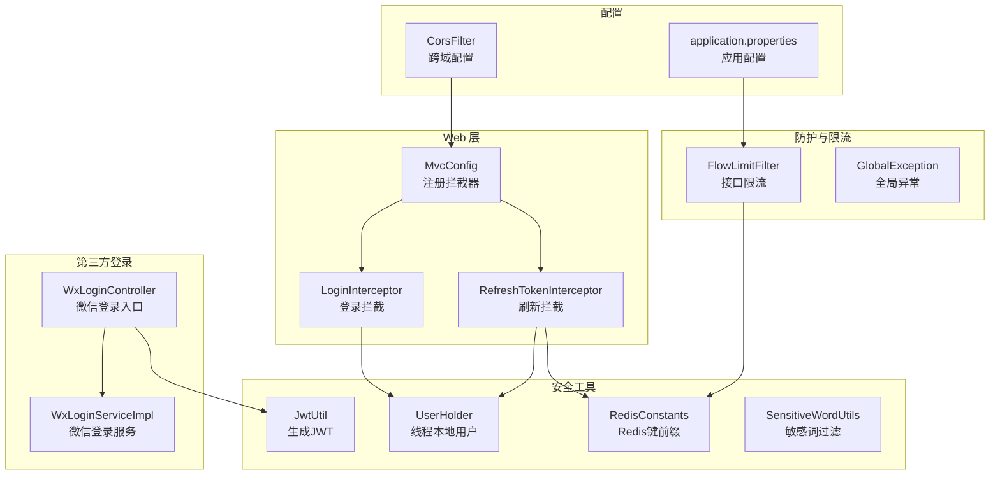
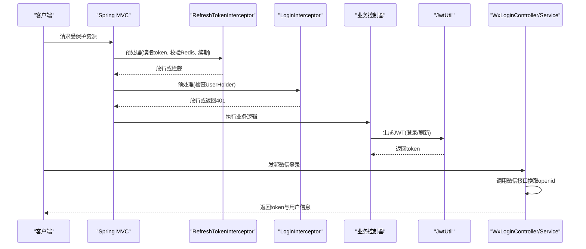
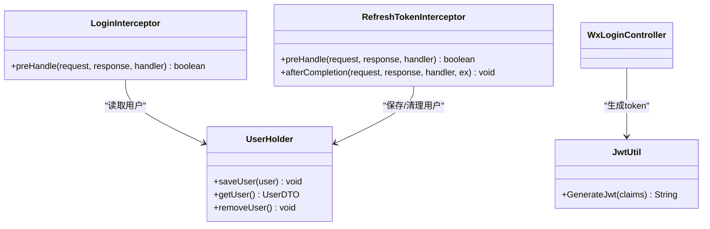
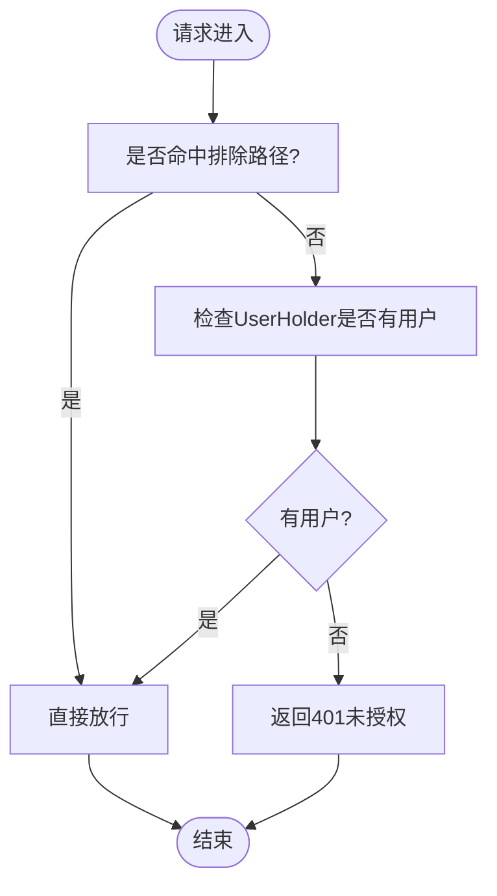
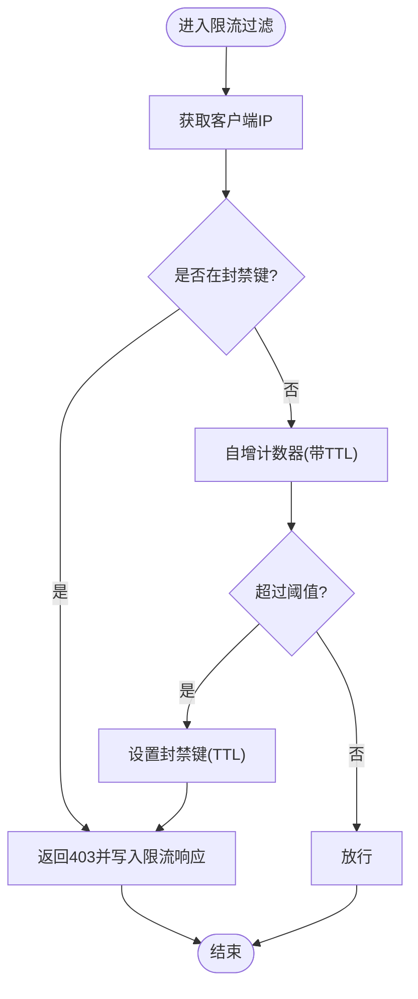
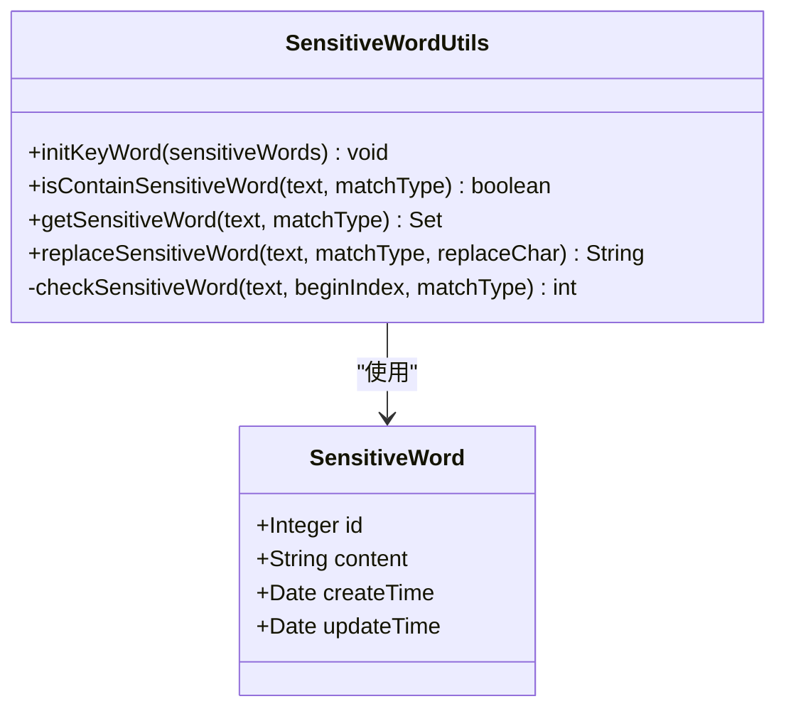
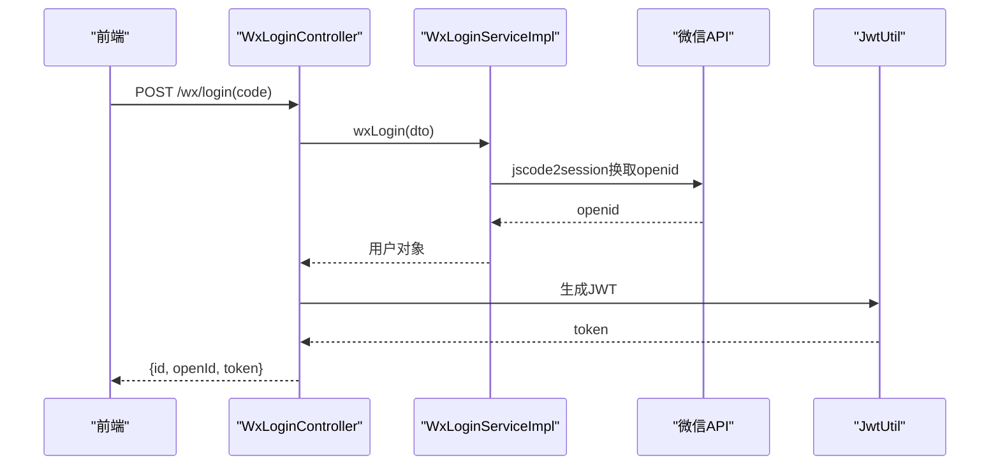
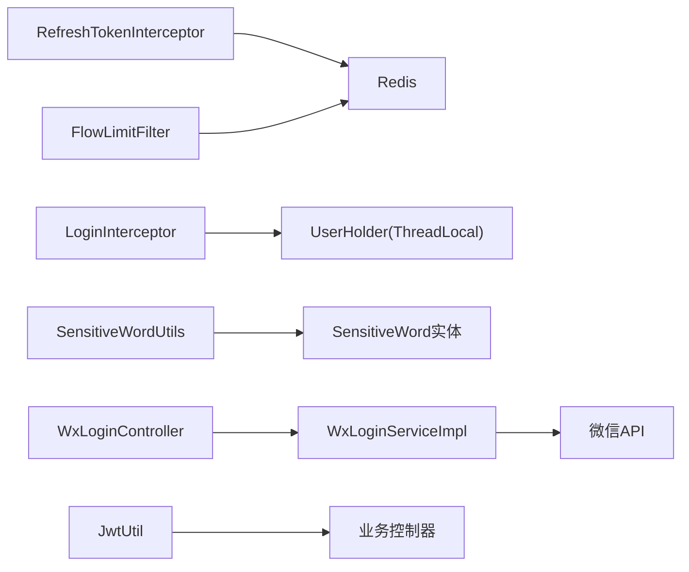

# 安全架构设计

<cite>
**本文引用的文件**
- [JwtUtil.java](file://springboot-travel-social/src/main/java/com/cxx/utils/JwtUtil.java)
- [LoginInterceptor.java](file://springboot-travel-social/src/main/java/com/cxx/utils/LoginInterceptor.java)
- [RefreshTokenInterceptor.java](file://springboot-travel-social/src/main/java/com/cxx/utils/RefreshTokenInterceptor.java)
- [UserHolder.java](file://springboot-travel-social/src/main/java/com/cxx/utils/UserHolder.java)
- [RedisConstants.java](file://springboot-travel-social/src/main/java/com/cxx/utils/RedisConstants.java)
- [MvcConfig.java](file://springboot-travel-social/src/main/java/com/cxx/config/MvcConfig.java)
- [CorsFilter.java](file://springboot-travel-social/src/main/java/com/cxx/config/CorsFilter.java)
- [FlowLimitFilter.java](file://springboot-travel-social/src/main/java/com/cxx/filter/FlowLimitFilter.java)
- [SystemConstants.java](file://springboot-travel-social/src/main/java/com/cxx/utils/SystemConstants.java)
- [SensitiveWordUtils.java](file://springboot-travel-social/src/main/java/com/cxx/utils/SensitiveWordUtils.java)
- [SensitiveWord.java](file://springboot-travel-social/src/main/java/com/cxx/entity/SensitiveWord.java)
- [WxLoginController.java](file://springboot-travel-social/src/main/java/com/cxx/controller/WxLoginController.java)
- [WxLoginServiceImpl.java](file://springboot-travel-social/src/main/java/com/cxx/service/impl/WxLoginServiceImpl.java)
- [AliOSSUtils.java](file://springboot-travel-social/src/main/java/com/cxx/utils/AliOSSUtils.java)
- [GlobalException.java](file://springboot-travel-social/src/main/java/com/cxx/exception/GlobalException.java)
- [application.properties](file://springboot-travel-social/src/main/resources/application.properties)
</cite>

## 目录
1. [引言](#引言)
2. [项目结构](#项目结构)
3. [核心组件](#核心组件)
4. [架构总览](#架构总览)
5. [详细组件分析](#详细组件分析)
6. [依赖分析](#依赖分析)
7. [性能考虑](#性能考虑)
8. [故障排查指南](#故障排查指南)
9. [结论](#结论)
10. [附录](#附录)

## 引言
本文件面向“旅游攻略社交小程序”的后端安全架构，系统性阐述认证与授权、权限控制、跨域安全、防刷与敏感词过滤、数据与传输安全、第三方登录集成与数据保护等安全机制。文档以代码为依据，结合序列图、流程图与类图，帮助技术与非技术读者理解整体安全设计与实现要点。

## 项目结构
后端采用 Spring Boot 架构，安全相关能力主要分布在以下模块：
- 认证与会话：JWT 工具、拦截器链、用户上下文持有者
- 权限控制：拦截器排除路径、统一异常处理
- 跨域与传输：CORS 配置
- 防护与限流：限流过滤器、敏感词工具
- 第三方登录：微信登录控制器与服务实现
- 存储与配置：Redis 常量、应用配置

图表来源
- [MvcConfig.java:11-75](file://springboot-travel-social/src/main/java/com/cxx/config/MvcConfig.java#L11-L75)
- [LoginInterceptor.java:7-17](file://springboot-travel-social/src/main/java/com/cxx/utils/LoginInterceptor.java#L7-L17)
- [RefreshTokenInterceptor.java:13-49](file://springboot-travel-social/src/main/java/com/cxx/utils/RefreshTokenInterceptor.java#L13-L49)
- [JwtUtil.java:8-18](file://springboot-travel-social/src/main/java/com/cxx/utils/JwtUtil.java#L8-L18)
- [UserHolder.java:5-19](file://springboot-travel-social/src/main/java/com/cxx/utils/UserHolder.java#L5-L19)
- [RedisConstants.java:3-29](file://springboot-travel-social/src/main/java/com/cxx/utils/RedisConstants.java#L3-L29)
- [SensitiveWordUtils.java:9-205](file://springboot-travel-social/src/main/java/com/cxx/utils/SensitiveWordUtils.java#L9-L205)
- [FlowLimitFilter.java:26-70](file://springboot-travel-social/src/main/java/com/cxx/filter/FlowLimitFilter.java#L26-L70)
- [GlobalException.java:8-17](file://springboot-travel-social/src/main/java/com/cxx/exception/GlobalException.java#L8-L17)
- [WxLoginController.java:18-34](file://springboot-travel-social/src/main/java/com/cxx/controller/WxLoginController.java#L18-L34)
- [WxLoginServiceImpl.java:18-53](file://springboot-travel-social/src/main/java/com/cxx/service/impl/WxLoginServiceImpl.java#L18-L53)
- [CorsFilter.java:7-25](file://springboot-travel-social/src/main/java/com/cxx/config/CorsFilter.java#L7-L25)
- [application.properties:1-61](file://springboot-travel-social/src/main/resources/application.properties#L1-L61)

章节来源
- [MvcConfig.java:11-75](file://springboot-travel-social/src/main/java/com/cxx/config/MvcConfig.java#L11-L75)
- [application.properties:1-61](file://springboot-travel-social/src/main/resources/application.properties#L1-L61)

## 核心组件
- JWT 认证与令牌管理
  - 使用工具类生成短期 JWT，包含用户标识声明，并设置过期时间。
  - 登录拦截器通过线程本地存储的用户信息判断是否放行。
- 会话与刷新
  - 刷新拦截器从请求头读取令牌，校验 Redis 中的用户哈希，成功则续期并放入线程本地。
- 统一异常处理
  - 全局异常处理器捕获运行时异常并返回统一错误响应。
- 跨域与传输
  - CORS 允许凭据、通配方法与头，限定最大预检时间。
- 防护与限流
  - 基于 Redis 的滑动窗口限流，超过阈值进入封禁窗口。
- 敏感词过滤
  - 前缀树敏感词库，支持最小匹配与最大匹配两种策略。
- 第三方登录
  - 微信登录通过服务端换取 openid，新用户自动注册并签发 JWT。

章节来源
- [JwtUtil.java:8-18](file://springboot-travel-social/src/main/java/com/cxx/utils/JwtUtil.java#L8-L18)
- [LoginInterceptor.java:7-17](file://springboot-travel-social/src/main/java/com/cxx/utils/LoginInterceptor.java#L7-L17)
- [RefreshTokenInterceptor.java:13-49](file://springboot-travel-social/src/main/java/com/cxx/utils/RefreshTokenInterceptor.java#L13-L49)
- [UserHolder.java:5-19](file://springboot-travel-social/src/main/java/com/cxx/utils/UserHolder.java#L5-L19)
- [GlobalException.java:8-17](file://springboot-travel-social/src/main/java/com/cxx/exception/GlobalException.java#L8-L17)
- [CorsFilter.java:7-25](file://springboot-travel-social/src/main/java/com/cxx/config/CorsFilter.java#L7-L25)
- [FlowLimitFilter.java:26-70](file://springboot-travel-social/src/main/java/com/cxx/filter/FlowLimitFilter.java#L26-L70)
- [SensitiveWordUtils.java:9-205](file://springboot-travel-social/src/main/java/com/cxx/utils/SensitiveWordUtils.java#L9-L205)
- [WxLoginController.java:18-34](file://springboot-travel-social/src/main/java/com/cxx/controller/WxLoginController.java#L18-L34)
- [WxLoginServiceImpl.java:18-53](file://springboot-travel-social/src/main/java/com/cxx/service/impl/WxLoginServiceImpl.java#L18-L53)

## 架构总览
下图展示了从客户端到服务端的关键安全交互：认证授权、权限控制、安全防护与第三方登录。

图表来源
- [MvcConfig.java:15-73](file://springboot-travel-social/src/main/java/com/cxx/config/MvcConfig.java#L15-L73)
- [RefreshTokenInterceptor.java:19-42](file://springboot-travel-social/src/main/java/com/cxx/utils/RefreshTokenInterceptor.java#L19-L42)
- [LoginInterceptor.java:9-16](file://springboot-travel-social/src/main/java/com/cxx/utils/LoginInterceptor.java#L9-L16)
- [WxLoginController.java:25-33](file://springboot-travel-social/src/main/java/com/cxx/controller/WxLoginController.java#L25-L33)
- [WxLoginServiceImpl.java:28-52](file://springboot-travel-social/src/main/java/com/cxx/service/impl/WxLoginServiceImpl.java#L28-L52)
- [JwtUtil.java:11-17](file://springboot-travel-social/src/main/java/com/cxx/utils/JwtUtil.java#L11-L17)

## 详细组件分析

### 认证与授权：JWT 与拦截器链
- 登录拦截器
  - 在每个请求到达控制器前检查线程本地是否已绑定用户；若无则返回 401。
- 刷新拦截器
  - 从请求头读取 token，查询 Redis 中的用户哈希；存在则填充线程本地并刷新过期时间；完成后清理线程本地。
- 用户上下文持有者
  - 提供线程本地存储与清理，避免跨线程污染。
- JWT 工具
  - 生成包含用户标识与过期时间的签名令牌，用于后续鉴权。

图表来源
- [LoginInterceptor.java:7-17](file://springboot-travel-social/src/main/java/com/cxx/utils/LoginInterceptor.java#L7-L17)
- [RefreshTokenInterceptor.java:13-49](file://springboot-travel-social/src/main/java/com/cxx/utils/RefreshTokenInterceptor.java#L13-L49)
- [UserHolder.java:5-19](file://springboot-travel-social/src/main/java/com/cxx/utils/UserHolder.java#L5-L19)
- [JwtUtil.java:8-18](file://springboot-travel-social/src/main/java/com/cxx/utils/JwtUtil.java#L8-L18)

章节来源
- [LoginInterceptor.java:7-17](file://springboot-travel-social/src/main/java/com/cxx/utils/LoginInterceptor.java#L7-L17)
- [RefreshTokenInterceptor.java:13-49](file://springboot-travel-social/src/main/java/com/cxx/utils/RefreshTokenInterceptor.java#L13-L49)
- [UserHolder.java:5-19](file://springboot-travel-social/src/main/java/com/cxx/utils/UserHolder.java#L5-L19)
- [JwtUtil.java:8-18](file://springboot-travel-social/src/main/java/com/cxx/utils/JwtUtil.java#L8-L18)

### 权限控制策略
- 拦截器注册与排除路径
  - 刷新拦截器对全部路径生效，优先级靠前。
  - 登录拦截器排除大量公开接口（如登录、Swagger、静态资源等），其余路径默认需要登录。
- 统一异常处理
  - 捕获运行时异常并返回统一错误响应，避免内部异常细节泄露。

图表来源
- [MvcConfig.java:16-73](file://springboot-travel-social/src/main/java/com/cxx/config/MvcConfig.java#L16-L73)
- [LoginInterceptor.java:10-15](file://springboot-travel-social/src/main/java/com/cxx/utils/LoginInterceptor.java#L10-L15)

章节来源
- [MvcConfig.java:15-75](file://springboot-travel-social/src/main/java/com/cxx/config/MvcConfig.java#L15-L75)
- [GlobalException.java:8-17](file://springboot-travel-social/src/main/java/com/cxx/exception/GlobalException.java#L8-L17)

### 跨域安全配置
- 允许凭据（Cookie/证书）、通配方法与头、预检缓存时间。
- 建议生产环境限制 allowedOriginPatterns 并明确 allowedHeaders 与 exposedHeaders，降低风险面。

章节来源
- [CorsFilter.java:7-25](file://springboot-travel-social/src/main/java/com/cxx/config/CorsFilter.java#L7-L25)

### 防刷机制与限流
- 滑动窗口限流
  - 基于 IP 的计数器与封禁键，超过阈值进入封禁窗口。
  - 返回统一限流错误码与提示。
- Redis 常量
  - 提供限流计数器、封禁键前缀与 TTL。

图表来源
- [FlowLimitFilter.java:30-69](file://springboot-travel-social/src/main/java/com/cxx/filter/FlowLimitFilter.java#L30-L69)
- [SystemConstants.java:4-22](file://springboot-travel-social/src/main/java/com/cxx/utils/SystemConstants.java#L4-L22)
- [RedisConstants.java:3-9](file://springboot-travel-social/src/main/java/com/cxx/utils/RedisConstants.java#L3-L9)

章节来源
- [FlowLimitFilter.java:26-70](file://springboot-travel-social/src/main/java/com/cxx/filter/FlowLimitFilter.java#L26-L70)
- [SystemConstants.java:3-23](file://springboot-travel-social/src/main/java/com/cxx/utils/SystemConstants.java#L3-L23)
- [RedisConstants.java:3-9](file://springboot-travel-social/src/main/java/com/cxx/utils/RedisConstants.java#L3-L9)

### 敏感词过滤
- 前缀树敏感词库
  - 支持最小匹配与最大匹配两种策略，可统计、提取与替换敏感词。
- 初始化
  - 从数据库加载敏感词列表，构建前缀树结构。

图表来源
- [SensitiveWordUtils.java:9-205](file://springboot-travel-social/src/main/java/com/cxx/utils/SensitiveWordUtils.java#L9-L205)
- [SensitiveWord.java:17-28](file://springboot-travel-social/src/main/java/com/cxx/entity/SensitiveWord.java#L17-L28)

章节来源
- [SensitiveWordUtils.java:9-205](file://springboot-travel-social/src/main/java/com/cxx/utils/SensitiveWordUtils.java#L9-L205)
- [SensitiveWord.java:17-28](file://springboot-travel-social/src/main/java/com/cxx/entity/SensitiveWord.java#L17-L28)

### 第三方登录与数据保护
- 微信登录
  - 控制器接收前端 code，服务层调用微信接口换取 openid，新用户自动注册，返回 token。
- 数据保护
  - 敏感配置集中于配置文件，建议使用环境变量或密钥管理服务。
  - 文件上传通过 OSS 客户端上传至云端，避免本地敏感数据暴露。

图表来源
- [WxLoginController.java:25-33](file://springboot-travel-social/src/main/java/com/cxx/controller/WxLoginController.java#L25-L33)
- [WxLoginServiceImpl.java:28-52](file://springboot-travel-social/src/main/java/com/cxx/service/impl/WxLoginServiceImpl.java#L28-L52)
- [JwtUtil.java:11-17](file://springboot-travel-social/src/main/java/com/cxx/utils/JwtUtil.java#L11-L17)

章节来源
- [WxLoginController.java:18-34](file://springboot-travel-social/src/main/java/com/cxx/controller/WxLoginController.java#L18-L34)
- [WxLoginServiceImpl.java:18-53](file://springboot-travel-social/src/main/java/com/cxx/service/impl/WxLoginServiceImpl.java#L18-L53)
- [AliOSSUtils.java:13-33](file://springboot-travel-social/src/main/java/com/cxx/utils/AliOSSUtils.java#L13-L33)
- [application.properties:1-61](file://springboot-travel-social/src/main/resources/application.properties#L1-L61)

## 依赖分析
- 组件耦合
  - 拦截器链依赖 Redis 与线程本地存储，形成鉴权闭环。
  - 限流过滤器依赖 Redis 与系统常量，形成统一防护策略。
  - 敏感词工具独立于业务，通过实体类加载词库。
- 外部依赖
  - Redis 用于会话与限流状态存储。
  - 微信开放平台用于第三方登录。
  - OSS 用于文件上传与数据隔离。

图表来源
- [RefreshTokenInterceptor.java:13-49](file://springboot-travel-social/src/main/java/com/cxx/utils/RefreshTokenInterceptor.java#L13-L49)
- [LoginInterceptor.java:7-17](file://springboot-travel-social/src/main/java/com/cxx/utils/LoginInterceptor.java#L7-L17)
- [UserHolder.java:5-19](file://springboot-travel-social/src/main/java/com/cxx/utils/UserHolder.java#L5-L19)
- [FlowLimitFilter.java:26-70](file://springboot-travel-social/src/main/java/com/cxx/filter/FlowLimitFilter.java#L26-L70)
- [SensitiveWordUtils.java:9-205](file://springboot-travel-social/src/main/java/com/cxx/utils/SensitiveWordUtils.java#L9-L205)
- [SensitiveWord.java:17-28](file://springboot-travel-social/src/main/java/com/cxx/entity/SensitiveWord.java#L17-L28)
- [WxLoginController.java:18-34](file://springboot-travel-social/src/main/java/com/cxx/controller/WxLoginController.java#L18-L34)
- [WxLoginServiceImpl.java:18-53](file://springboot-travel-social/src/main/java/com/cxx/service/impl/WxLoginServiceImpl.java#L18-L53)
- [JwtUtil.java:8-18](file://springboot-travel-social/src/main/java/com/cxx/utils/JwtUtil.java#L8-L18)

章节来源
- [MvcConfig.java:15-75](file://springboot-travel-social/src/main/java/com/cxx/config/MvcConfig.java#L15-L75)
- [application.properties:23-42](file://springboot-travel-social/src/main/resources/application.properties#L23-L42)

## 性能考虑
- Redis 命中与过期
  - 刷新拦截器在每次请求都会查询与续期，建议评估热点用户并发下的 Redis 压力。
- 限流粒度
  - 当前按 IP 实施，建议引入更细粒度的维度（如用户 ID、AppId）以提升准确性。
- 敏感词匹配
  - 前缀树匹配复杂度与文本长度相关，建议对长文本分段处理并缓存中间结果。
- 跨域配置
  - 生产环境应缩小 allowedOriginPatterns 与 exposedHeaders，减少不必要的暴露。

## 故障排查指南
- 401 未授权
  - 检查请求头是否携带 token，确认刷新拦截器是否正确续期，以及登录拦截器是否正确绑定用户。
- 限流被触发
  - 查看对应 IP 的计数器与封禁键是否过期，调整阈值与封禁时间。
- 敏感词误判
  - 检查敏感词库是否完整加载，匹配策略是否符合预期。
- 微信登录失败
  - 核对 appid/secret 与网络连通性，关注 openid 是否为空。
- 全局异常
  - 关注日志输出，定位具体异常位置并修复。

章节来源
- [LoginInterceptor.java:10-15](file://springboot-travel-social/src/main/java/com/cxx/utils/LoginInterceptor.java#L10-L15)
- [RefreshTokenInterceptor.java:20-42](file://springboot-travel-social/src/main/java/com/cxx/utils/RefreshTokenInterceptor.java#L20-L42)
- [FlowLimitFilter.java:40-47](file://springboot-travel-social/src/main/java/com/cxx/filter/FlowLimitFilter.java#L40-L47)
- [GlobalException.java:10-16](file://springboot-travel-social/src/main/java/com/cxx/exception/GlobalException.java#L10-L16)

## 结论
本项目通过“拦截器链 + JWT + Redis + 限流 + 敏感词 + 跨域配置”的组合，构建了基础而实用的安全架构。建议在生产环境中进一步完善 CORS 策略、引入 CSRF 防护、强化 SQL 注入与 XSS 防护、完善密钥管理与审计日志，以满足更严格的安全合规要求。

## 附录
- 安全策略建议
  - CSRF 防护：引入同源校验与 CSRF Token，配合 SameSite Cookie。
  - XSS 防护：输入输出转义、CSP 头、白名单富文本渲染。
  - SQL 注入防护：MyBatis Plus 原生 SQL 审核、参数化查询、最小权限数据库账号。
  - 数据加密：敏感字段落库前加密、传输层 TLS 1.3、密钥轮换。
  - 第三方登录：回调地址白名单、state 参数校验、授权范围最小化。