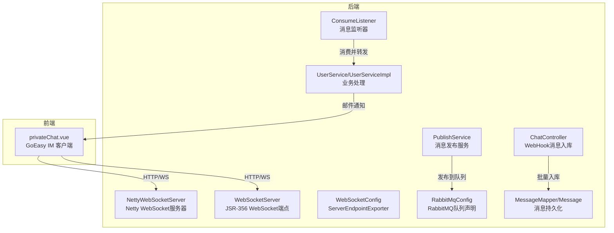
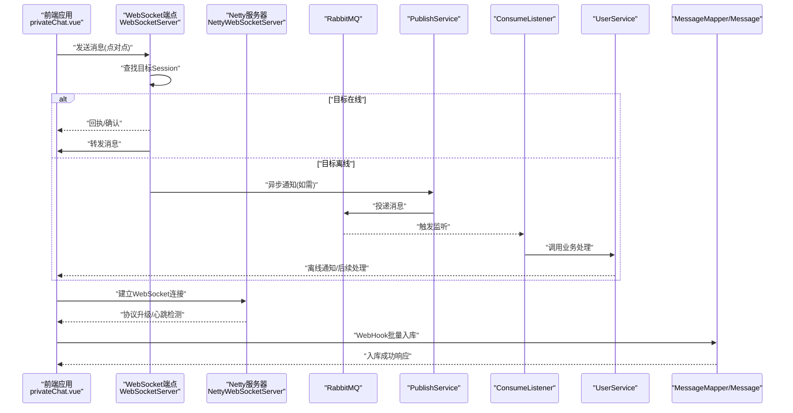
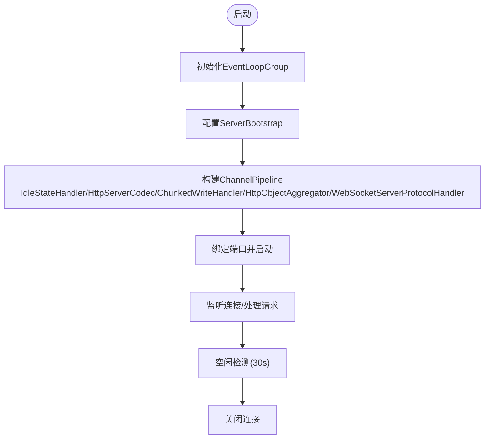
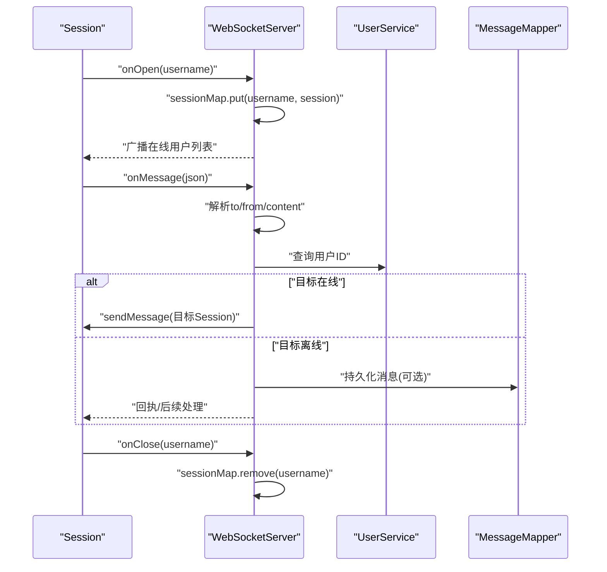
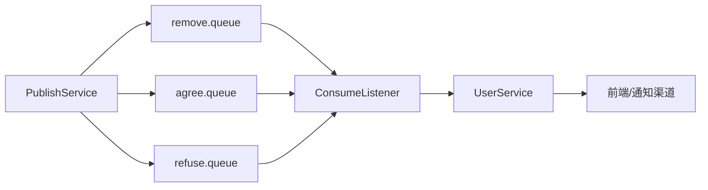
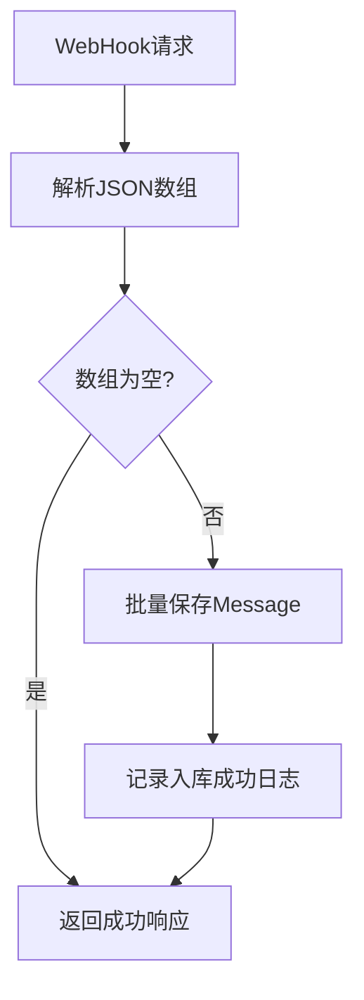
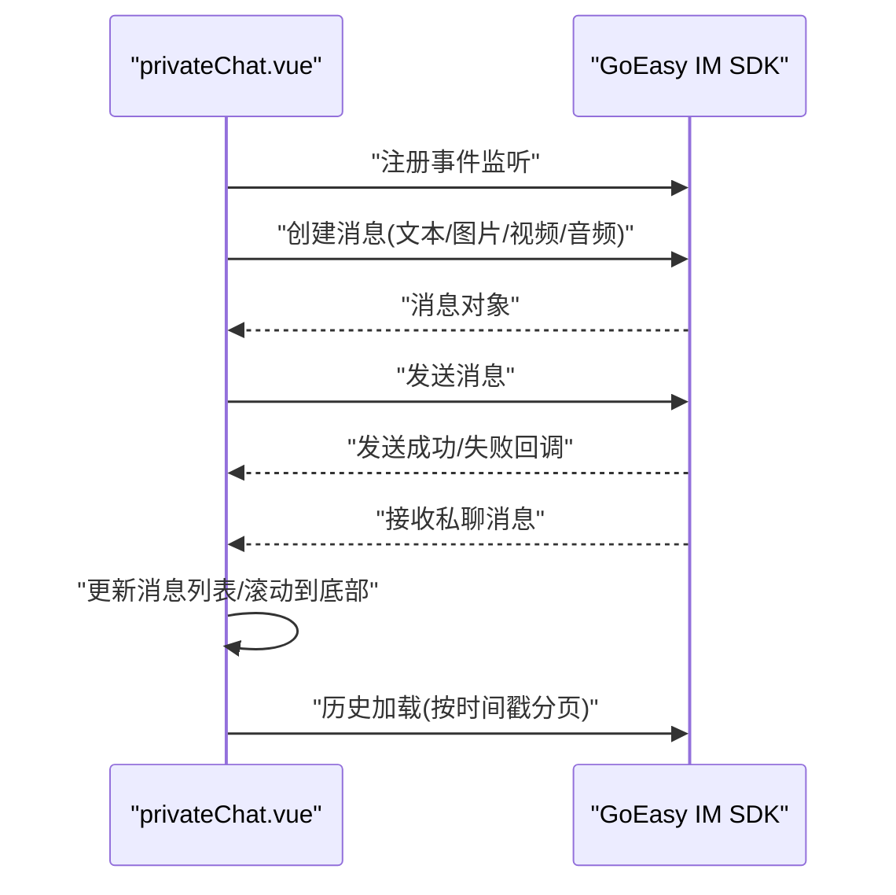
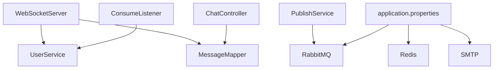

# 实时通信架构

<cite>
**本文引用的文件**
- [NettyWebSocketServer.java](file://springboot-travel-social/src/main/java/com/cxx/component/NettyWebSocketServer.java)
- [WebSocketServer.java](file://springboot-travel-social/src/main/java/com/cxx/component/WebSocketServer.java)
- [WebSocketConfig.java](file://springboot-travel-social/src/main/java/com/cxx/config/WebSocketConfig.java)
- [RabbitMqConfig.java](file://springboot-travel-social/src/main/java/com/cxx/config/RabbitMqConfig.java)
- [ConsumeListener.java](file://springboot-travel-social/src/main/java/com/cxx/rabbitmq/ConsumeListener.java)
- [PublishService.java](file://springboot-travel-social/src/main/java/com/cxx/rabbitmq/PublishService.java)
- [UserService.java](file://springboot-travel-social/src/main/java/com/cxx/service/UserService.java)
- [UserServiceImpl.java](file://springboot-travel-social/src/main/java/com/cxx/service/impl/UserServiceImpl.java)
- [Message.java](file://springboot-travel-social/src/main/java/com/cxx/entity/Message.java)
- [MessageMapper.java](file://springboot-travel-social/src/main/java/com/cxx/mapper/MessageMapper.java)
- [ChatController.java](file://springboot-travel-social/src/main/java/com/cxx/controller/ChatController.java)
- [application.properties](file://springboot-travel-social/src/main/resources/application.properties)
- [privateChat.vue](file://uniapp-travel-social/messagePages/privateChat.vue)
</cite>

## 目录
1. [简介](#简介)
2. [项目结构](#项目结构)
3. [核心组件](#核心组件)
4. [架构总览](#架构总览)
5. [详细组件分析](#详细组件分析)
6. [依赖分析](#依赖分析)
7. [性能考虑](#性能考虑)
8. [故障排查指南](#故障排查指南)
9. [结论](#结论)
10. [附录](#附录)

## 简介
本文件系统性梳理该社交小程序项目的实时通信架构，覆盖WebSocket配置与服务器端实现、客户端连接管理、消息推送机制、在线状态管理、消息持久化、连接池与心跳检测、断线重连策略，以及与RabbitMQ消息队列的集成方式。文档同时提供端到端的消息流转图，帮助读者快速理解从发送到接收的完整路径。

## 项目结构
该项目采用前后端分离架构：
- 后端基于Spring Boot，包含WebSocket组件（两种实现：Netty与标准JSR-356）、RabbitMQ集成、消息持久化、控制器等。
- 前端基于UniApp，使用第三方IM SDK（GoEasy）进行消息收发与UI交互。

图表来源
- [NettyWebSocketServer.java:28-75](file://springboot-travel-social/src/main/java/com/cxx/component/NettyWebSocketServer.java#L28-L75)
- [WebSocketServer.java:23-136](file://springboot-travel-social/src/main/java/com/cxx/component/WebSocketServer.java#L23-L136)
- [WebSocketConfig.java:8-13](file://springboot-travel-social/src/main/java/com/cxx/config/WebSocketConfig.java#L8-L13)
- [RabbitMqConfig.java:18-31](file://springboot-travel-social/src/main/java/com/cxx/config/RabbitMqConfig.java#L18-L31)
- [ConsumeListener.java:12-40](file://springboot-travel-social/src/main/java/com/cxx/rabbitmq/ConsumeListener.java#L12-L40)
- [PublishService.java:9-27](file://springboot-travel-social/src/main/java/com/cxx/rabbitmq/PublishService.java#L9-L27)
- [ChatController.java:16-41](file://springboot-travel-social/src/main/java/com/cxx/controller/ChatController.java#L16-L41)
- [Message.java:14-28](file://springboot-travel-social/src/main/java/com/cxx/entity/Message.java#L14-L28)
- [UserService.java:18-35](file://springboot-travel-social/src/main/java/com/cxx/service/UserService.java#L18-L35)
- [UserServiceImpl.java:112-120](file://springboot-travel-social/src/main/java/com/cxx/service/impl/UserServiceImpl.java#L112-L120)
- [privateChat.vue:452-562](file://uniapp-travel-social/messagePages/privateChat.vue#L452-L562)

章节来源
- [NettyWebSocketServer.java:28-75](file://springboot-travel-social/src/main/java/com/cxx/component/NettyWebSocketServer.java#L28-L75)
- [WebSocketServer.java:23-136](file://springboot-travel-social/src/main/java/com/cxx/component/WebSocketServer.java#L23-L136)
- [WebSocketConfig.java:8-13](file://springboot-travel-social/src/main/java/com/cxx/config/WebSocketConfig.java#L8-L13)
- [RabbitMqConfig.java:18-31](file://springboot-travel-social/src/main/java/com/cxx/config/RabbitMqConfig.java#L18-L31)
- [ConsumeListener.java:12-40](file://springboot-travel-social/src/main/java/com/cxx/rabbitmq/ConsumeListener.java#L12-L40)
- [PublishService.java:9-27](file://springboot-travel-social/src/main/java/com/cxx/rabbitmq/PublishService.java#L9-L27)
- [ChatController.java:16-41](file://springboot-travel-social/src/main/java/com/cxx/controller/ChatController.java#L16-L41)
- [Message.java:14-28](file://springboot-travel-social/src/main/java/com/cxx/entity/Message.java#L14-L28)
- [UserService.java:18-35](file://springboot-travel-social/src/main/java/com/cxx/service/UserService.java#L18-L35)
- [UserServiceImpl.java:112-120](file://springboot-travel-social/src/main/java/com/cxx/service/impl/UserServiceImpl.java#L112-L120)
- [privateChat.vue:452-562](file://uniapp-travel-social/messagePages/privateChat.vue#L452-L562)

## 核心组件
- Netty WebSocket服务器：基于Netty实现高性能WebSocket服务，内置空闲检测、HTTP编解码、聚合器与协议升级处理器。
- JSR-356 WebSocket端点：基于注解的端点，维护在线会话映射，支持点对点与广播消息。
- WebSocket配置：启用ServerEndpointExporter以暴露端点。
- RabbitMQ集成：声明队列、发布消息、监听消息并触发业务处理。
- 消息持久化：消息实体与Mapper，支持WebHook批量入库。
- 前端IM客户端：使用GoEasy SDK进行消息收发、历史加载、UI交互。

章节来源
- [NettyWebSocketServer.java:28-75](file://springboot-travel-social/src/main/java/com/cxx/component/NettyWebSocketServer.java#L28-L75)
- [WebSocketServer.java:23-136](file://springboot-travel-social/src/main/java/com/cxx/component/WebSocketServer.java#L23-L136)
- [WebSocketConfig.java:8-13](file://springboot-travel-social/src/main/java/com/cxx/config/WebSocketConfig.java#L8-L13)
- [RabbitMqConfig.java:18-31](file://springboot-travel-social/src/main/java/com/cxx/config/RabbitMqConfig.java#L18-L31)
- [ConsumeListener.java:12-40](file://springboot-travel-social/src/main/java/com/cxx/rabbitmq/ConsumeListener.java#L12-L40)
- [PublishService.java:9-27](file://springboot-travel-social/src/main/java/com/cxx/rabbitmq/PublishService.java#L9-L27)
- [ChatController.java:16-41](file://springboot-travel-social/src/main/java/com/cxx/controller/ChatController.java#L16-L41)
- [Message.java:14-28](file://springboot-travel-social/src/main/java/com/cxx/entity/Message.java#L14-L28)
- [MessageMapper.java:8-11](file://springboot-travel-social/src/main/java/com/cxx/mapper/MessageMapper.java#L8-L11)
- [UserService.java:18-35](file://springboot-travel-social/src/main/java/com/cxx/service/UserService.java#L18-L35)
- [UserServiceImpl.java:112-120](file://springboot-travel-social/src/main/java/com/cxx/service/impl/UserServiceImpl.java#L112-L120)
- [privateChat.vue:452-562](file://uniapp-travel-social/messagePages/privateChat.vue#L452-L562)

## 架构总览
下图展示了消息从发送到接收的完整路径，涵盖后端两种WebSocket实现、RabbitMQ异步处理与数据库持久化：

图表来源
- [WebSocketServer.java:65-94](file://springboot-travel-social/src/main/java/com/cxx/component/WebSocketServer.java#L65-L94)
- [NettyWebSocketServer.java:51-75](file://springboot-travel-social/src/main/java/com/cxx/component/NettyWebSocketServer.java#L51-L75)
- [PublishService.java:13-26](file://springboot-travel-social/src/main/java/com/cxx/rabbitmq/PublishService.java#L13-L26)
- [ConsumeListener.java:17-39](file://springboot-travel-social/src/main/java/com/cxx/rabbitmq/ConsumeListener.java#L17-L39)
- [UserService.java:22-22](file://springboot-travel-social/src/main/java/com/cxx/service/UserService.java#L22-L22)
- [ChatController.java:23-40](file://springboot-travel-social/src/main/java/com/cxx/controller/ChatController.java#L23-L40)
- [Message.java:14-28](file://springboot-travel-social/src/main/java/com/cxx/entity/Message.java#L14-L28)

## 详细组件分析

### Netty WebSocket服务器
- 组件职责：启动NIO事件循环组，绑定端口，配置HTTP编解码、聚合器、分块写入与WebSocket协议处理器；内置空闲检测（30秒无心跳关闭连接）。
- 性能优势：基于Netty的非阻塞I/O模型，适合高并发长连接场景；线程池按CPU核数配置，具备良好的吞吐能力。
- 关键配置：日志处理器、背压参数、保活选项。

图表来源
- [NettyWebSocketServer.java:36-75](file://springboot-travel-social/src/main/java/com/cxx/component/NettyWebSocketServer.java#L36-L75)

章节来源
- [NettyWebSocketServer.java:28-75](file://springboot-travel-social/src/main/java/com/cxx/component/NettyWebSocketServer.java#L28-L75)

### JSR-356 WebSocket端点
- 组件职责：通过注解暴露WebSocket端点，维护在线会话映射；在消息到达时解析JSON，查找目标Session并转发；若目标离线则广播或触发其他处理。
- 在线状态管理：使用ConcurrentHashMap维护username到Session的映射，支持连接建立、消息转发、关闭清理。
- 消息处理：解析发送方、接收方与内容，查询用户ID并构造消息体，优先点对点转发，否则广播或落库。

图表来源
- [WebSocketServer.java:42-103](file://springboot-travel-social/src/main/java/com/cxx/component/WebSocketServer.java#L42-L103)
- [UserService.java:22-22](file://springboot-travel-social/src/main/java/com/cxx/service/UserService.java#L22-L22)
- [MessageMapper.java:8-11](file://springboot-travel-social/src/main/java/com/cxx/mapper/MessageMapper.java#L8-L11)

章节来源
- [WebSocketServer.java:23-136](file://springboot-travel-social/src/main/java/com/cxx/component/WebSocketServer.java#L23-L136)
- [WebSocketConfig.java:8-13](file://springboot-travel-social/src/main/java/com/cxx/config/WebSocketConfig.java#L8-L13)

### RabbitMQ消息队列集成
- 队列声明：在配置类中声明三个持久化队列（remove、agree、refuse），用于不同业务场景的消息分发。
- 消息发布：通过RabbitTemplate将DTO对象发送至对应队列。
- 消息监听：监听器根据队列名称调用业务层方法，实现异步通知（如邮件）或业务逻辑处理。
- 与WebSocket联动：当目标用户离线时，可通过RabbitMQ异步处理并在合适时机进行通知或落库。

图表来源
- [RabbitMqConfig.java:18-31](file://springboot-travel-social/src/main/java/com/cxx/config/RabbitMqConfig.java#L18-L31)
- [PublishService.java:9-27](file://springboot-travel-social/src/main/java/com/cxx/rabbitmq/PublishService.java#L9-L27)
- [ConsumeListener.java:12-40](file://springboot-travel-social/src/main/java/com/cxx/rabbitmq/ConsumeListener.java#L12-L40)
- [UserService.java:22-22](file://springboot-travel-social/src/main/java/com/cxx/service/UserService.java#L22-L22)
- [UserServiceImpl.java:112-120](file://springboot-travel-social/src/main/java/com/cxx/service/impl/UserServiceImpl.java#L112-L120)

章节来源
- [RabbitMqConfig.java:18-31](file://springboot-travel-social/src/main/java/com/cxx/config/RabbitMqConfig.java#L18-L31)
- [PublishService.java:9-27](file://springboot-travel-social/src/main/java/com/cxx/rabbitmq/PublishService.java#L9-L27)
- [ConsumeListener.java:12-40](file://springboot-travel-social/src/main/java/com/cxx/rabbitmq/ConsumeListener.java#L12-L40)
- [UserService.java:22-22](file://springboot-travel-social/src/main/java/com/cxx/service/UserService.java#L22-L22)
- [UserServiceImpl.java:112-120](file://springboot-travel-social/src/main/java/com/cxx/service/impl/UserServiceImpl.java#L112-L120)

### 消息持久化与WebHook入库
- 数据模型：Message实体包含消息ID、类型、发送者与接收者、时间戳与载荷等字段。
- 批量入库：后端提供WebHook接口接收前端或外部系统推送的历史消息数组，批量保存至数据库。
- 应用场景：用于历史消息归档、离线消息补推、审计与统计。

图表来源
- [ChatController.java:23-40](file://springboot-travel-social/src/main/java/com/cxx/controller/ChatController.java#L23-L40)
- [Message.java:14-28](file://springboot-travel-social/src/main/java/com/cxx/entity/Message.java#L14-L28)
- [MessageMapper.java:8-11](file://springboot-travel-social/src/main/java/com/cxx/mapper/MessageMapper.java#L8-L11)

章节来源
- [ChatController.java:16-41](file://springboot-travel-social/src/main/java/com/cxx/controller/ChatController.java#L16-L41)
- [Message.java:14-28](file://springboot-travel-social/src/main/java/com/cxx/entity/Message.java#L14-L28)
- [MessageMapper.java:8-11](file://springboot-travel-social/src/main/java/com/cxx/mapper/MessageMapper.java#L8-L11)

### 前端实时通信与UI交互
- 客户端SDK：前端使用GoEasy IM SDK进行消息收发、历史加载、删除与撤回等操作。
- 事件监听：注册私聊消息与消息删除事件，动态更新UI并滚动到底部。
- 多媒体消息：支持文本、图片、视频、音频消息的创建与发送，并提供进度回调与错误处理。
- 历史加载：按时间戳分页拉取历史消息，支持上拉刷新与自动滚动。

图表来源
- [privateChat.vue:452-562](file://uniapp-travel-social/messagePages/privateChat.vue#L452-L562)
- [privateChat.vue:733-774](file://uniapp-travel-social/messagePages/privateChat.vue#L733-L774)
- [privateChat.vue:458-470](file://uniapp-travel-social/messagePages/privateChat.vue#L458-L470)

章节来源
- [privateChat.vue:188-562](file://uniapp-travel-social/messagePages/privateChat.vue#L188-L562)
- [privateChat.vue:733-774](file://uniapp-travel-social/messagePages/privateChat.vue#L733-L774)

## 依赖分析
- 组件耦合：WebSocket端点依赖UserService与MessageMapper；RabbitMQ监听器依赖UserService；前端依赖GoEasy SDK。
- 外部依赖：RabbitMQ、MySQL、Redis（用于登录态与缓存）、邮件服务（SMTP）。
- 配置集中：RabbitMQ、Redis、邮件等通过application.properties统一配置。

图表来源
- [WebSocketServer.java:30-37](file://springboot-travel-social/src/main/java/com/cxx/component/WebSocketServer.java#L30-L37)
- [UserService.java:18-35](file://springboot-travel-social/src/main/java/com/cxx/service/UserService.java#L18-L35)
- [MessageMapper.java:8-11](file://springboot-travel-social/src/main/java/com/cxx/mapper/MessageMapper.java#L8-L11)
- [ConsumeListener.java:12-40](file://springboot-travel-social/src/main/java/com/cxx/rabbitmq/ConsumeListener.java#L12-L40)
- [PublishService.java:9-27](file://springboot-travel-social/src/main/java/com/cxx/rabbitmq/PublishService.java#L9-L27)
- [ChatController.java:16-41](file://springboot-travel-social/src/main/java/com/cxx/controller/ChatController.java#L16-L41)
- [application.properties:1-61](file://springboot-travel-social/src/main/resources/application.properties#L1-L61)

章节来源
- [application.properties:1-61](file://springboot-travel-social/src/main/resources/application.properties#L1-L61)

## 性能考虑
- 连接池与线程模型：Netty使用独立的boss与worker线程组，建议结合业务QPS调整worker线程数量。
- 心跳与空闲：Netty端设置30秒空闲超时，可根据网络环境与业务需求调整。
- 背压与限流：合理设置SO_BACKLOG与HTTP聚合大小，避免内存峰值；必要时引入限流与熔断。
- 异步处理：RabbitMQ实现异步通知，降低主链路阻塞风险。
- 缓存与持久化：Redis用于登录态与热点数据，消息持久化保证可靠性与可追溯性。

## 故障排查指南
- WebSocket连接失败
  - 检查端口占用与防火墙设置（默认端口见Netty配置）。
  - 查看日志处理器输出，定位协议升级或编解码异常。
- 空闲断开
  - 若客户端未发送心跳，将在30秒后被关闭；请确保客户端定时发送心跳。
- 消息未送达
  - 确认目标用户是否在线；若离线，检查RabbitMQ队列与监听器是否正常。
  - 核对消息格式与字段映射（from/to/content）。
- 历史消息入库
  - 确认WebHook请求参数与JSON格式正确；查看批量保存日志与异常堆栈。
- 邮件通知
  - 检查SMTP配置与凭据；确认UserService中的邮件发送逻辑是否被调用。

章节来源
- [NettyWebSocketServer.java:63-64](file://springboot-travel-social/src/main/java/com/cxx/component/NettyWebSocketServer.java#L63-L64)
- [WebSocketServer.java:105-109](file://springboot-travel-social/src/main/java/com/cxx/component/WebSocketServer.java#L105-L109)
- [ChatController.java:23-40](file://springboot-travel-social/src/main/java/com/cxx/controller/ChatController.java#L23-L40)
- [application.properties:31-42](file://springboot-travel-social/src/main/resources/application.properties#L31-L42)

## 结论
该实时通信架构通过Netty与JSR-356双通道满足不同部署与性能需求，配合RabbitMQ实现异步通知与解耦，结合消息持久化与前端GoEasy SDK，形成从连接、消息、存储到UI的完整闭环。建议在生产环境中进一步完善限流、监控与告警体系，持续优化线程池与连接参数以匹配实际流量。

## 附录
- 端口与配置
  - Netty WebSocket端口：参考组件常量定义。
  - RabbitMQ地址与凭证：见配置文件。
  - SMTP邮件服务：用于业务通知（如用户消息提醒）。
- 前端SDK事件
  - 私聊消息接收、消息删除、历史加载等事件均在前端页面中注册与处理。

章节来源
- [NettyWebSocketServer.java:29-29](file://springboot-travel-social/src/main/java/com/cxx/component/NettyWebSocketServer.java#L29-L29)
- [application.properties:8-12](file://springboot-travel-social/src/main/resources/application.properties#L8-L12)
- [application.properties:31-42](file://springboot-travel-social/src/main/resources/application.properties#L31-L42)
- [privateChat.vue:452-562](file://uniapp-travel-social/messagePages/privateChat.vue#L452-L562)