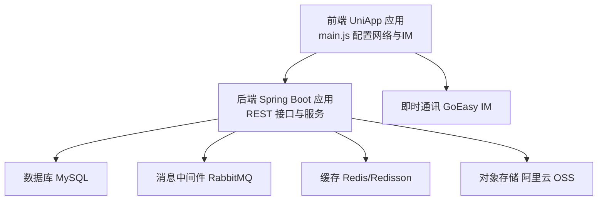
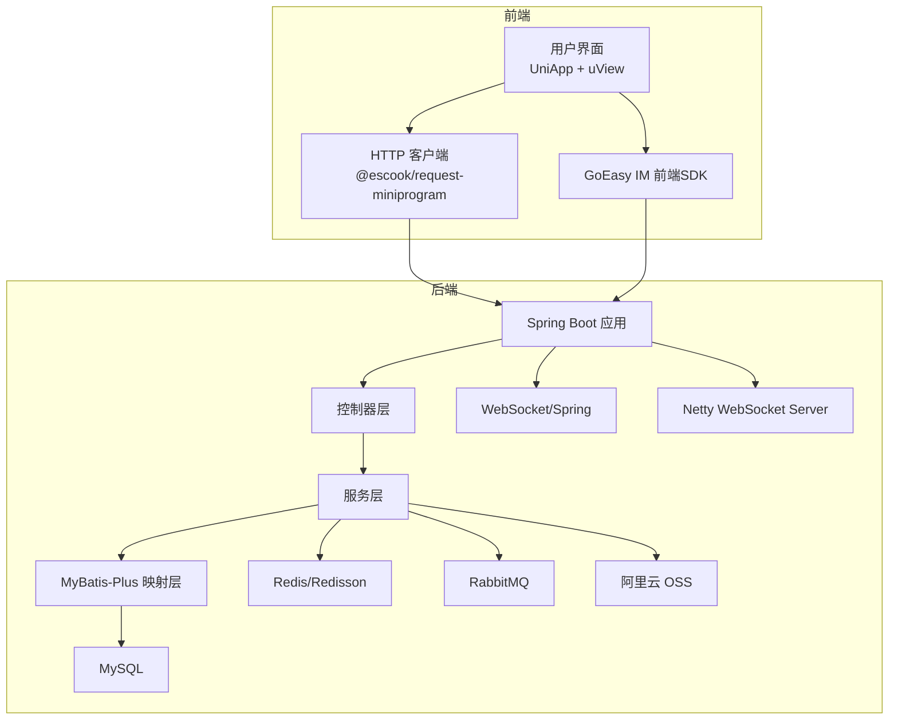
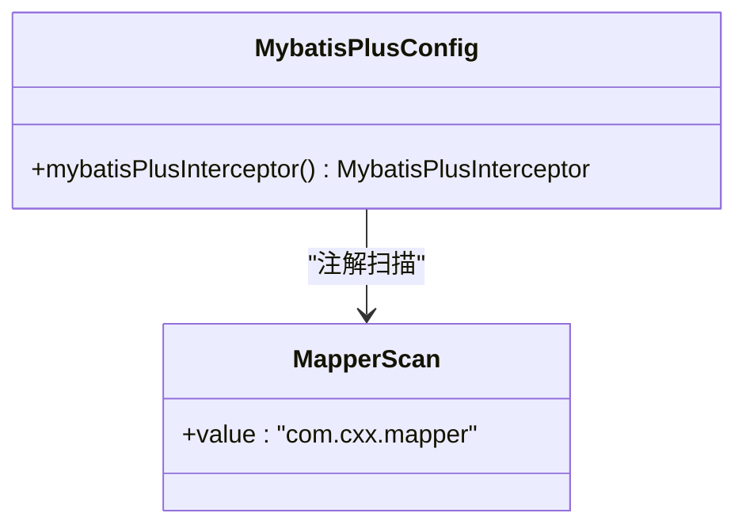
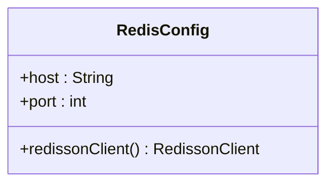
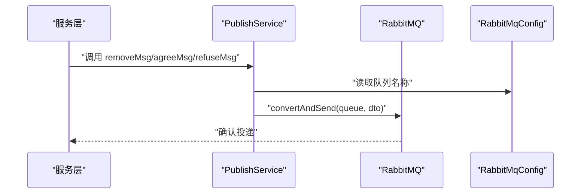
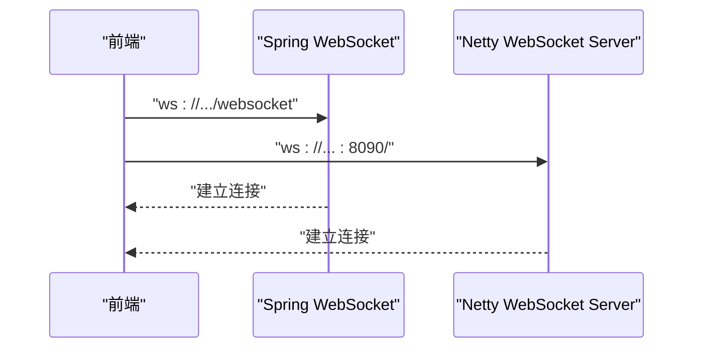
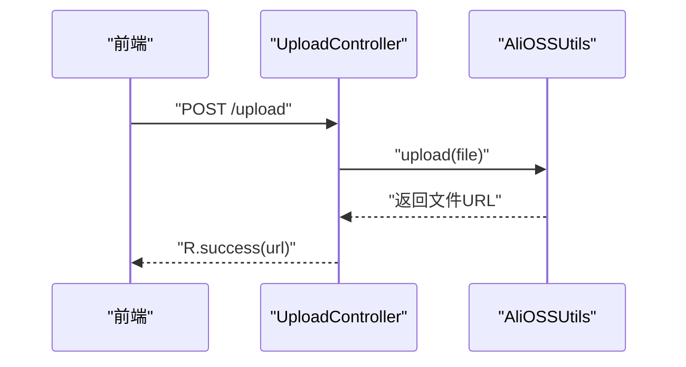
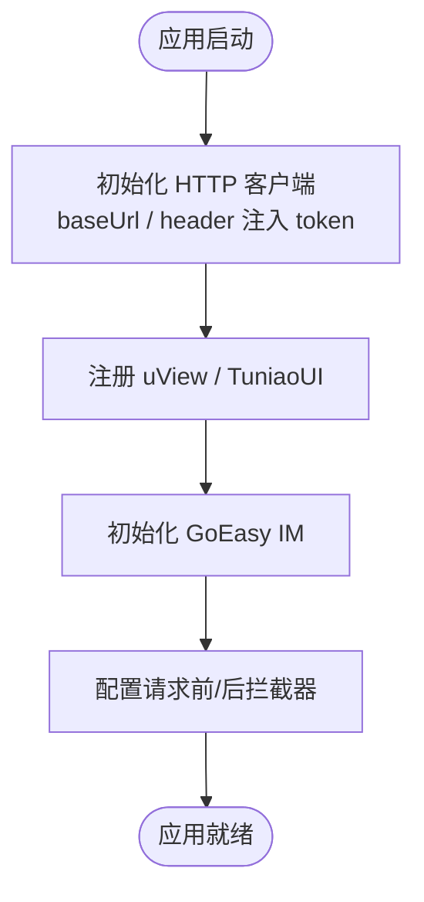
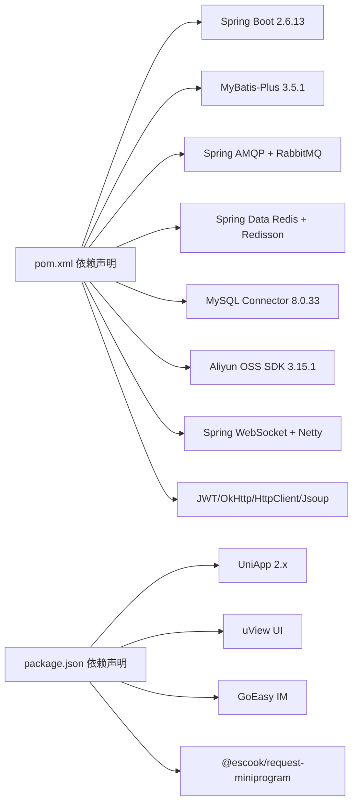

# 技术栈选型

<cite>
**本文引用的文件**
- [pom.xml](file://springboot-travel-social/pom.xml)
- [application.properties](file://springboot-travel-social/src/main/resources/application.properties)
- [MybatisPlusConfig.java](file://springboot-travel-social/src/main/java/com/cxx/config/MybatisPlusConfig.java)
- [RedisConfig.java](file://springboot-travel-social/src/main/java/com/cxx/config/RedisConfig.java)
- [RabbitMqConfig.java](file://springboot-travel-social/src/main/java/com/cxx/config/RabbitMqConfig.java)
- [WebSocketConfig.java](file://springboot-travel-social/src/main/java/com/cxx/config/WebSocketConfig.java)
- [TravelSocialApplication.java](file://springboot-travel-social/src/main/java/com/cxx/TravelSocialApplication.java)
- [AliOSSUtils.java](file://springboot-travel-social/src/main/java/com/cxx/utils/AliOSSUtils.java)
- [UploadController.java](file://springboot-travel-social/src/main/java/com/cxx/upload/UploadController.java)
- [PublishService.java](file://springboot-travel-social/src/main/java/com/cxx/rabbitmq/PublishService.java)
- [NettyWebSocketServer.java](file://springboot-travel-social/src/main/java/com/cxx/component/NettyWebSocketServer.java)
- [package.json](file://uniapp-travel-social/package.json)
- [main.js](file://uniapp-travel-social/main.js)
- [HELP.md](file://springboot-travel-social/HELP.md)
- [README.md](file://springboot-travel-social/README.md)
</cite>

## 目录
1. [引言](#引言)
2. [项目结构](#项目结构)
3. [核心组件](#核心组件)
4. [架构总览](#架构总览)
5. [详细组件分析](#详细组件分析)
6. [依赖关系分析](#依赖关系分析)
7. [性能考量](#性能考量)
8. [故障排查指南](#故障排查指南)
9. [结论](#结论)
10. [附录](#附录)

## 引言
本技术栈选型文档面向“旅游攻略社交小程序”项目，系统梳理后端（Spring Boot 2.6.13 + MyBatis-Plus）、消息中间件（RabbitMQ）、缓存（Redis/Redisson）、实时通信（WebSocket/Netty）、对象存储（阿里云 OSS）、前端（UniApp + uView）以及第三方即时通讯（GoEasy IM）等核心技术与框架的选型理由、协同机制、版本与兼容性要求，并给出演进趋势与未来规划建议。

## 项目结构
项目采用前后端分离架构：
- 后端：Spring Boot 应用，提供 REST 接口、业务服务、定时任务、消息发布、文件上传、WebSocket 等能力。
- 前端：UniApp 应用，适配多端（小程序/H5），通过统一的 HTTP 客户端与后端交互，集成即时通讯与 UI 组件库。

图表来源
- [main.js:1-118](file://uniapp-travel-social/main.js#L1-L118)
- [TravelSocialApplication.java:1-54](file://springboot-travel-social/src/main/java/com/cxx/TravelSocialApplication.java#L1-L54)
- [application.properties:1-61](file://springboot-travel-social/src/main/resources/application.properties#L1-L61)

章节来源
- [README.md:1-38](file://springboot-travel-social/README.md#L1-L38)
- [HELP.md:1-21](file://springboot-travel-social/HELP.md#L1-L21)

## 核心组件
- 后端框架：Spring Boot 2.6.13（Maven 管理依赖）
- 数据持久层：MyBatis-Plus 3.5.1（分页插件、逻辑删除）
- 缓存与分布式锁：Redis + Redisson 3.6.5
- 消息中间件：RabbitMQ（Spring AMQP）
- 实时通信：WebSocket（Spring WebSocket）+ Netty WebSocket Server（自建）
- 对象存储：阿里云 OSS SDK 3.15.1
- 前端框架：UniApp 2.x + uView UI
- 即时通讯：GoEasy IM（前端 JS SDK）

章节来源
- [pom.xml:10-182](file://springboot-travel-social/pom.xml#L10-L182)
- [application.properties:1-61](file://springboot-travel-social/src/main/resources/application.properties#L1-L61)
- [package.json:1-27](file://uniapp-travel-social/package.json#L1-L27)

## 架构总览
后端通过 REST 接口对外提供能力，前端通过统一的 HTTP 客户端发起请求；业务数据经由 MySQL 存储，热点数据与会话状态走 Redis；异步任务与活动审核等场景使用 RabbitMQ；文件上传走阿里云 OSS；前端通过 GoEasy IM 实现消息推送与聊天。

图表来源
- [main.js:1-118](file://uniapp-travel-social/main.js#L1-L118)
- [TravelSocialApplication.java:1-54](file://springboot-travel-social/src/main/java/com/cxx/TravelSocialApplication.java#L1-L54)
- [MybatisPlusConfig.java:1-20](file://springboot-travel-social/src/main/java/com/cxx/config/MybatisPlusConfig.java#L1-L20)
- [RedisConfig.java:1-33](file://springboot-travel-social/src/main/java/com/cxx/config/RedisConfig.java#L1-L33)
- [RabbitMqConfig.java:1-32](file://springboot-travel-social/src/main/java/com/cxx/config/RabbitMqConfig.java#L1-L32)
- [WebSocketConfig.java:1-14](file://springboot-travel-social/src/main/java/com/cxx/config/WebSocketConfig.java#L1-L14)
- [NettyWebSocketServer.java:1-77](file://springboot-travel-social/src/main/java/com/cxx/component/NettyWebSocketServer.java#L1-L77)
- [AliOSSUtils.java:1-34](file://springboot-travel-social/src/main/java/com/cxx/utils/AliOSSUtils.java#L1-L34)

## 详细组件分析

### Spring Boot 2.6.13
- 选型原因
  - 稳定的企业级微服务基础能力，内置 Web、安全、监控、自动配置等特性，适合快速搭建业务服务。
  - 与 Spring 生态（AMQP、Redis、WebMvc）无缝集成。
- 关键特性
  - Actuator、Validation、Mail、WebSocket、AMQP、Redis Starter 等。
  - 依赖管理通过 spring-boot-dependencies 2.6.13 版本统一约束。
- 兼容性
  - Java 版本：1.8（属性定义），但编译插件目标设置为 9，建议统一为 8 或 17。
  - 与 MyBatis-Plus、RabbitMQ、Redis、Swagger/Knife4j 的版本组合在工程中已明确声明。

章节来源
- [pom.xml:10-182](file://springboot-travel-social/pom.xml#L10-L182)
- [application.properties:1-61](file://springboot-travel-social/src/main/resources/application.properties#L1-L61)

### MyBatis-Plus 3.5.1
- 选型原因
  - 减少重复 SQL 与 Mapper XML，提供通用 CRUD、分页、逻辑删除等增强能力。
- 关键实现
  - 分页插件配置为 MySQL 类型，Mapper 扫描路径集中于 com.cxx.mapper。
- 兼容性
  - 与 Spring Boot 2.6.x、MySql Connector 8.0.33 兼容。

图表来源
- [MybatisPlusConfig.java:1-20](file://springboot-travel-social/src/main/java/com/cxx/config/MybatisPlusConfig.java#L1-L20)

章节来源
- [MybatisPlusConfig.java:1-20](file://springboot-travel-social/src/main/java/com/cxx/config/MybatisPlusConfig.java#L1-L20)

### Redis 与 Redisson 3.6.5
- 选型原因
  - 高性能缓存与分布式锁能力，支撑会话、限流、幂等、分布式锁等场景。
- 关键实现
  - RedissonClient 通过单机模式配置，使用 lettuce/jedis 连接池参数。
- 兼容性
  - 与 Spring Boot 2.6.x 的 starter 自动装配兼容。

图表来源
- [RedisConfig.java:1-33](file://springboot-travel-social/src/main/java/com/cxx/config/RedisConfig.java#L1-L33)

章节来源
- [RedisConfig.java:1-33](file://springboot-travel-social/src/main/java/com/cxx/config/RedisConfig.java#L1-L33)
- [application.properties:23-30](file://springboot-travel-social/src/main/resources/application.properties#L23-L30)

### RabbitMQ（Spring AMQP）
- 选型原因
  - 异步解耦、削峰填谷，用于活动审核、通知等异步流程。
- 关键实现
  - 声明 remove.agree.refuse 三个持久化队列，发布侧通过 RabbitTemplate 发送 DTO。
- 兼容性
  - 与 Spring Boot 2.6.x 的 amqp starter 兼容。

图表来源
- [PublishService.java:1-28](file://springboot-travel-social/src/main/java/com/cxx/rabbitmq/PublishService.java#L1-L28)
- [RabbitMqConfig.java:1-32](file://springboot-travel-social/src/main/java/com/cxx/config/RabbitMqConfig.java#L1-L32)

章节来源
- [RabbitMqConfig.java:1-32](file://springboot-travel-social/src/main/java/com/cxx/config/RabbitMqConfig.java#L1-L32)
- [PublishService.java:1-28](file://springboot-travel-social/src/main/java/com/cxx/rabbitmq/PublishService.java#L1-L28)
- [application.properties:8-12](file://springboot-travel-social/src/main/resources/application.properties#L8-L12)

### WebSocket 与 Netty WebSocket Server
- 选型原因
  - 实时通信需求，Spring WebSocket 用于标准协议，Netty 作为补充或独立服务端口。
- 关键实现
  - Spring WebSocket 通过注解导出 ServerEndpointExporter。
  - Netty 自建服务端口 8090，配置 HTTP 编解码、聚合器、WebSocket 协议处理器与空闲检测。
- 兼容性
  - 与 Spring Boot 2.6.x 的 websocket starter 兼容。

图表来源
- [WebSocketConfig.java:1-14](file://springboot-travel-social/src/main/java/com/cxx/config/WebSocketConfig.java#L1-L14)
- [NettyWebSocketServer.java:1-77](file://springboot-travel-social/src/main/java/com/cxx/component/NettyWebSocketServer.java#L1-L77)

章节来源
- [WebSocketConfig.java:1-14](file://springboot-travel-social/src/main/java/com/cxx/config/WebSocketConfig.java#L1-L14)
- [NettyWebSocketServer.java:1-77](file://springboot-travel-social/src/main/java/com/cxx/component/NettyWebSocketServer.java#L1-L77)

### 阿里云 OSS
- 选型原因
  - 文件上传与静态资源托管，降低自建对象存储成本与运维复杂度。
- 关键实现
  - UploadController 提供 /upload 接口，AliOSSUtils 使用 OSSClientBuilder 上传并返回可访问 URL。
- 兼容性
  - SDK 3.15.1 与 Java 8+ 兼容。

图表来源
- [UploadController.java:1-27](file://springboot-travel-social/src/main/java/com/cxx/upload/UploadController.java#L1-L27)
- [AliOSSUtils.java:1-34](file://springboot-travel-social/src/main/java/com/cxx/utils/AliOSSUtils.java#L1-L34)

章节来源
- [UploadController.java:1-27](file://springboot-travel-social/src/main/java/com/cxx/upload/UploadController.java#L1-L27)
- [AliOSSUtils.java:1-34](file://springboot-travel-social/src/main/java/com/cxx/utils/AliOSSUtils.java#L1-L34)

### 前端：UniApp 与 uView
- 选型原因
  - 一套代码多端运行，覆盖小程序/H5，提升开发效率与维护性。
- 关键实现
  - main.js 中配置 $http 基础地址、拦截器注入 token、全局提示与错误处理。
  - 引入 uView 与自研 TuniaoUI，集成 GoEasy IM SDK 初始化与点击通知跳转。
- 兼容性
  - @dcloudio/uni-app ^2.0.x，uview-ui ^2.0.x。

图表来源
- [main.js:1-118](file://uniapp-travel-social/main.js#L1-L118)
- [package.json:1-27](file://uniapp-travel-social/package.json#L1-L27)

章节来源
- [main.js:1-118](file://uniapp-travel-social/main.js#L1-L118)
- [package.json:1-27](file://uniapp-travel-social/package.json#L1-L27)

### 第三方服务集成概览
- Redis：本地或远端主机，端口 6379，默认 database 0，连接池参数配置。
- RabbitMQ：远程主机 101.37.x.x，虚拟主机 /，账号 admin/admin。
- MySQL：驱动 com.mysql.cj.jdbc.Driver，JDBC URL 指向 travel_1 库。
- 阿里云 OSS：endpoint、ak/sk、bucketName 已在工具类中配置。
- GoEasy IM：前端 SDK 初始化，支持私聊/群聊通知跳转。

章节来源
- [application.properties:1-61](file://springboot-travel-social/src/main/resources/application.properties#L1-L61)
- [AliOSSUtils.java:1-34](file://springboot-travel-social/src/main/java/com/cxx/utils/AliOSSUtils.java#L1-L34)
- [main.js:76-111](file://uniapp-travel-social/main.js#L76-L111)

## 依赖关系分析
- 后端依赖层次
  - Web 层（Spring Web）+ 数据访问（MyBatis-Plus + MySQL Connector）+ 缓存（Redis + Redisson）+ 消息（RabbitMQ）+ 文件（OSS）+ 实时通信（WebSocket/Netty）+ 工具（JWT/OkHttp/HttpClient/Jsoup）。
- 前端依赖层次
  - UniApp 运行时 + uView UI + GoEasy IM SDK + 请求库 @escook/request-miniprogram。

图表来源
- [pom.xml:10-182](file://springboot-travel-social/pom.xml#L10-L182)
- [package.json:15-21](file://uniapp-travel-social/package.json#L15-L21)

章节来源
- [pom.xml:10-182](file://springboot-travel-social/pom.xml#L10-L182)
- [package.json:15-21](file://uniapp-travel-social/package.json#L15-L21)

## 性能考量
- 连接池与线程
  - Redis 连接池最大活跃数、空闲数与空闲回收周期已配置；Tomcat 最大线程与最小空闲线程在 application.properties 中设置。
- 缓存策略
  - 利用 Redis 缓存热点数据与会话，结合 Redisson 分布式锁保障一致性。
- 异步处理
  - 使用 RabbitMQ 异步处理非关键路径任务，避免阻塞主流程。
- 文件上传
  - OSS 上传采用流式写入，注意并发与超时控制。
- WebSocket
  - Netty 独立端口承载高并发长连接，配合空闲检测与日志处理器，便于定位问题。

章节来源
- [application.properties:23-46](file://springboot-travel-social/src/main/resources/application.properties#L23-L46)
- [RedisConfig.java:1-33](file://springboot-travel-social/src/main/java/com/cxx/config/RedisConfig.java#L1-L33)
- [NettyWebSocketServer.java:1-77](file://springboot-travel-social/src/main/java/com/cxx/component/NettyWebSocketServer.java#L1-L77)

## 故障排查指南
- 启动与端口
  - 后端默认端口 8082；Netty WebSocket 独占 8090。检查端口占用与防火墙放通。
- 数据库连接
  - JDBC URL、用户名、密码需与实际环境一致；MySQL Connector 8.0.33 需匹配服务端时区与字符集。
- 缓存与会话
  - Redis 主机、端口、密码（如开启）需正确；连接池参数异常会导致频繁重建连接。
- 消息队列
  - RabbitMQ 主机、虚拟主机、账号密码需正确；确认队列存在且权限允许。
- 文件上传
  - OSS endpoint、ak/sk、bucketName 需正确；上传失败时检查网络与权限。
- 即时通讯
  - GoEasy 初始化 host/appkey 与前端路由跳转逻辑需一致；401 时前端会清理 token 并跳转登录页。

章节来源
- [application.properties:1-61](file://springboot-travel-social/src/main/resources/application.properties#L1-L61)
- [UploadController.java:1-27](file://springboot-travel-social/src/main/java/com/cxx/upload/UploadController.java#L1-L27)
- [main.js:44-56](file://uniapp-travel-social/main.js#L44-L56)

## 结论
该技术栈围绕 Spring Boot 2.6.13 构建，结合 MyBatis-Plus、Redis/Redisson、RabbitMQ、阿里云 OSS 与前端 UniApp/uView/GoEasy IM，形成前后端分离、模块清晰、扩展性强的完整方案。当前版本与依赖组合稳定，建议后续在以下方面持续优化：升级 JDK 至 8/17 统一编译目标、引入 SpringDoc/OpenAPI 替代 Knife4j、完善链路追踪与可观测性、评估容器化与微服务拆分。

## 附录
- 版本与兼容性摘要
  - Spring Boot：2.6.13
  - MyBatis-Plus：3.5.1
  - Redis/Redisson：Spring Data Redis + Redisson 3.6.5
  - RabbitMQ：Spring AMQP
  - MySQL Connector：8.0.33
  - 阿里云 OSS：3.15.1
  - 前端：UniApp 2.x + uView UI + GoEasy IM + @escook/request-miniprogram
- 开发与构建
  - Maven 插件：spring-boot-maven-plugin、maven-compiler-plugin
  - 运行入口：TravelSocialApplication

章节来源
- [pom.xml:211-238](file://springboot-travel-social/pom.xml#L211-L238)
- [TravelSocialApplication.java:1-54](file://springboot-travel-social/src/main/java/com/cxx/TravelSocialApplication.java#L1-L54)