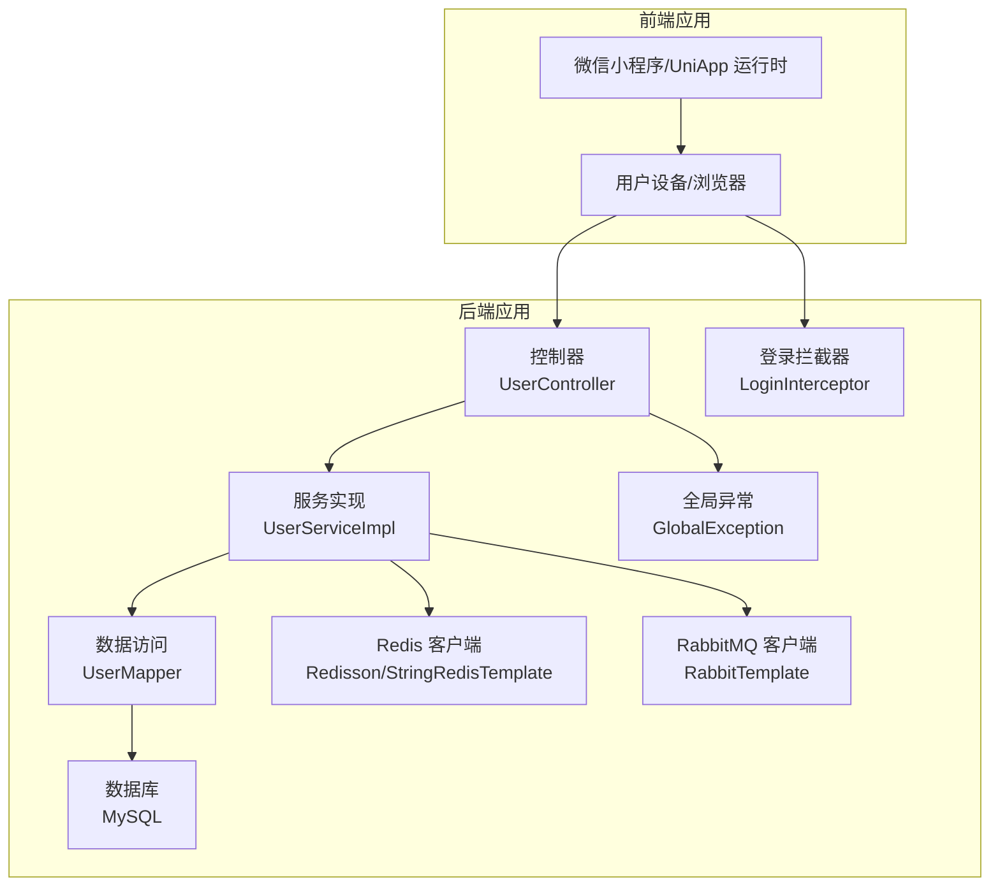
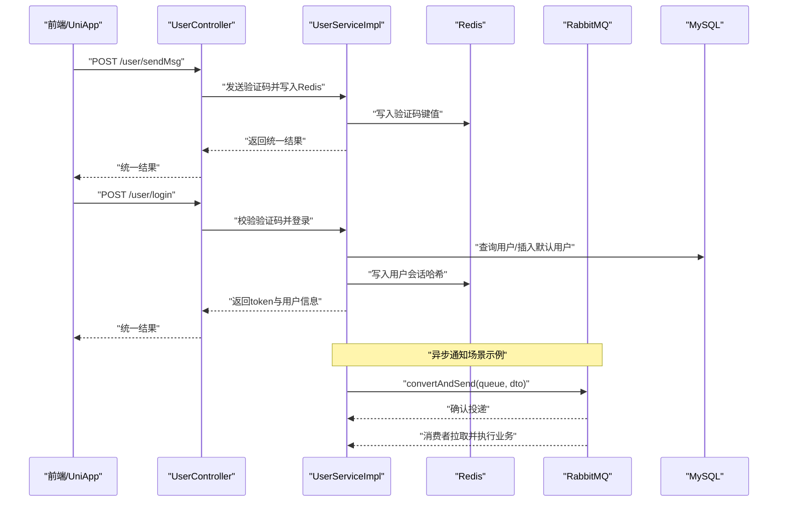
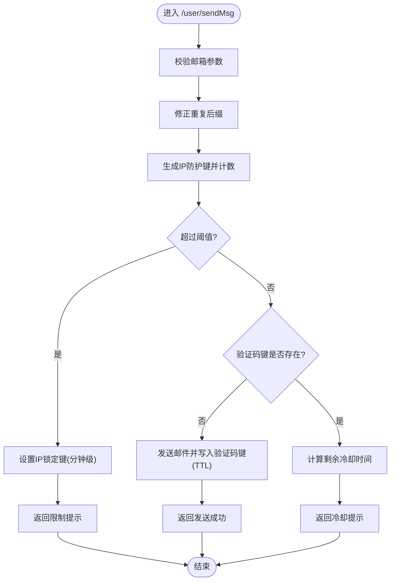
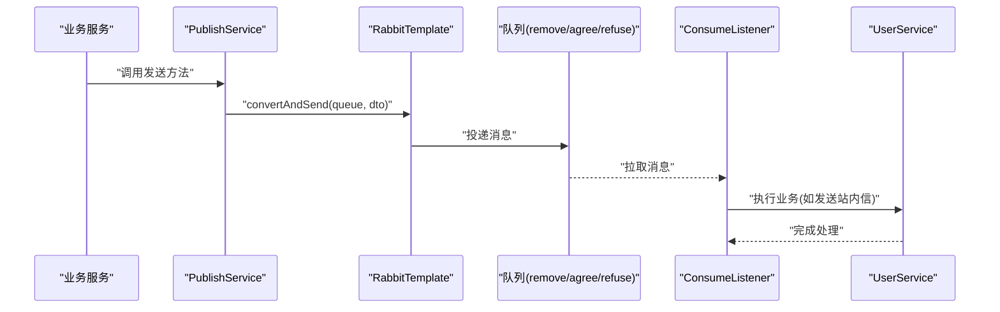
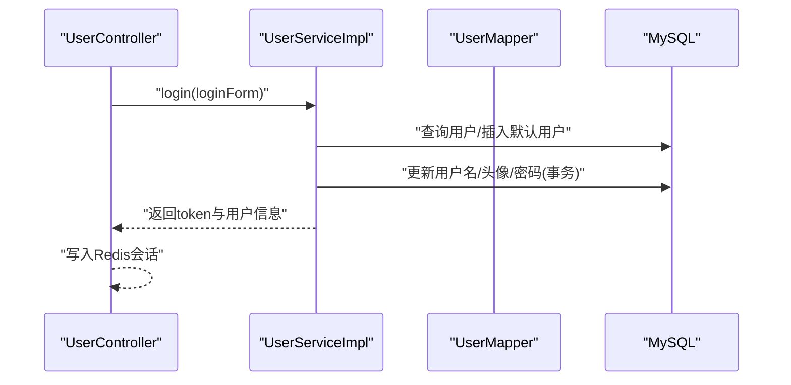
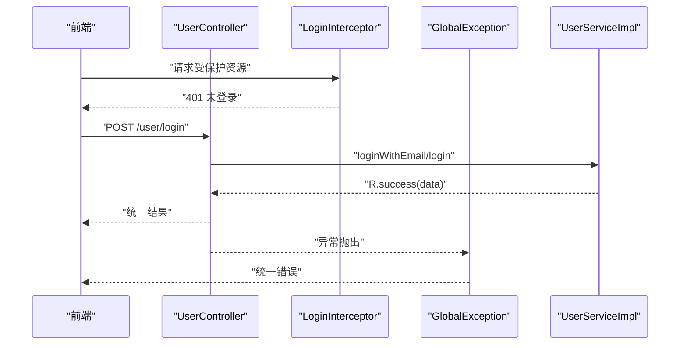
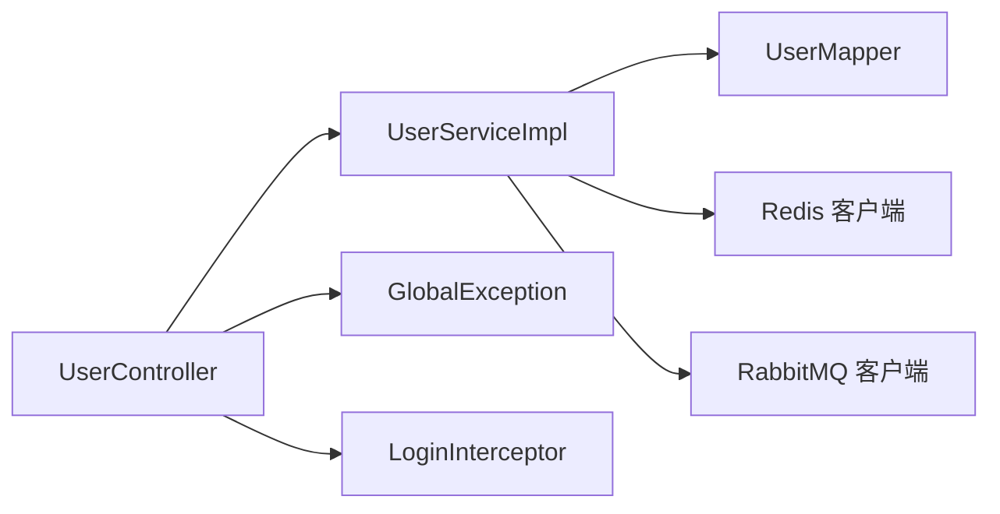

# 数据流架构

<cite>
**本文引用的文件**
- [application.properties](file://springboot-travel-social/src/main/resources/application.properties)
- [RedisConfig.java](file://springboot-travel-social/src/main/java/com/xx/config/RedisConfig.java)
- [RabbitMqConfig.java](file://springboot-travel-social/src/main/java/com/xx/config/RabbitMqConfig.java)
- [PublishService.java](file://springboot-travel-social/src/main/java/com/xx/rabbitmq/PublishService.java)
- [ConsumeListener.java](file://springboot-travel-social/src/main/java/com/xx/rabbitmq/ConsumeListener.java)
- [RedisConstants.java](file://springboot-travel-social/src/main/java/com/xx/utils/RedisConstants.java)
- [UserController.java](file://springboot-travel-social/src/main/java/com/xx/controller/UserController.java)
- [UserService.java](file://springboot-travel-social/src/main/java/com/xx/service/impl/UserServiceImpl.java)
- [UserMapper.java](file://springboot-travel-social/src/main/java/com/xx/mapper/UserMapper.java)
- [R.java](file://springboot-travel-social/src/main/java/com/xx/entity/R.java)
- [LoginInterceptor.java](file://springboot-travel-social/src/main/java/com/xx/utils/LoginInterceptor.java)
- [GlobalException.java](file://springboot-travel-social/src/main/java/com/xx/exception/GlobalException.java)
</cite>

## 目录
1. [引言](#引言)
2. [项目结构](#项目结构)
3. [核心组件](#核心组件)
4. [架构总览](#架构总览)
5. [详细组件分析](#详细组件分析)
6. [依赖关系分析](#依赖关系分析)
7. [性能考量](#性能考量)
8. [故障排查指南](#故障排查指南)
9. [结论](#结论)
10. [附录](#附录)

## 引言
本文件面向“旅游攻略社交小程序”的数据流架构，聚焦后端Spring Boot与前端UniApp的集成场景，系统性阐述以下主题：
- 缓存数据流：Redis键空间设计、缓存策略与缓存穿透防护
- 消息队列数据流：RabbitMQ异步处理（生产、消费、持久化）
- 数据库数据流：MyBatis-Plus映射与事务边界
- 数据一致性与事务：跨模块更新的事务语义
- 错误重试与异常处理：全局异常与拦截器配合
- 前端请求到后端响应的完整链路

## 项目结构
后端采用标准Spring Boot分层：controller（接口层）、service（业务层）、mapper（数据访问层）、config（配置）、rabbitmq（消息）、utils（工具）、entity（模型）、exception（异常）。

图表来源
- [UserController.java:31-136](file://springboot-travel-social/src/main/java/com/xx/controller/UserController.java#L31-L136)
- [UserService.java:43-268](file://springboot-travel-social/src/main/java/com/xx/service/impl/UserServiceImpl.java#L43-L268)
- [UserMapper.java:17-23](file://springboot-travel-social/src/main/java/com/xx/mapper/UserMapper.java#L17-L23)
- [RedisConfig.java:17-33](file://springboot-travel-social/src/main/java/com/xx/config/RedisConfig.java#L17-L33)
- [RabbitMqConfig.java:16-32](file://springboot-travel-social/src/main/java/com/xx/config/RabbitMqConfig.java#L16-L32)
- [GlobalException.java:8-18](file://springboot-travel-social/src/main/java/com/xx/exception/GlobalException.java#L8-L18)
- [LoginInterceptor.java:7-18](file://springboot-travel-social/src/main/java/com/xx/utils/LoginInterceptor.java#L7-L18)

章节来源
- [application.properties:1-61](file://springboot-travel-social/src/main/resources/application.properties#L1-L61)

## 核心组件
- Redis配置与客户端：通过Redisson单机模式连接本地Redis，提供分布式能力；同时使用StringRedisTemplate进行键值操作。
- RabbitMQ配置与消息：定义三个持久化队列，发布侧通过RabbitTemplate发送消息，消费侧通过注解监听队列并调用业务服务。
- 用户登录与验证码：控制器负责接收请求、限流与防刷、调用服务层登录与邮件发送，并将用户信息写入Redis。
- 统一响应体与异常处理：R作为统一返回体，全局异常处理器捕获运行时异常并返回标准化错误。
- 登录拦截器：校验用户是否已登录，未登录直接返回401。

章节来源
- [RedisConfig.java:17-33](file://springboot-travel-social/src/main/java/com/xx/config/RedisConfig.java#L17-L33)
- [RabbitMqConfig.java:16-32](file://springboot-travel-social/src/main/java/com/xx/config/RabbitMqConfig.java#L16-L32)
- [PublishService.java:8-28](file://springboot-travel-social/src/main/java/com/xx/rabbitmq/PublishService.java#L8-L28)
- [ConsumeListener.java:10-42](file://springboot-travel-social/src/main/java/com/xx/rabbitmq/ConsumeListener.java#L10-L42)
- [UserController.java:31-136](file://springboot-travel-social/src/main/java/com/xx/controller/UserController.java#L31-L136)
- [UserService.java:43-268](file://springboot-travel-social/src/main/java/com/xx/service/impl/UserServiceImpl.java#L43-L268)
- [R.java:14-30](file://springboot-travel-social/src/main/java/com/xx/entity/R.java#L14-L30)
- [GlobalException.java:8-18](file://springboot-travel-social/src/main/java/com/xx/exception/GlobalException.java#L8-L18)
- [LoginInterceptor.java:7-18](file://springboot-travel-social/src/main/java/com/xx/utils/LoginInterceptor.java#L7-L18)

## 架构总览
下图展示从前端请求到数据库与缓存、消息队列的全链路数据流。

图表来源
- [UserController.java:42-93](file://springboot-travel-social/src/main/java/com/xx/controller/UserController.java#L42-L93)
- [UserService.java:75-110](file://springboot-travel-social/src/main/java/com/xx/service/impl/UserServiceImpl.java#L75-L110)
- [PublishService.java:13-26](file://springboot-travel-social/src/main/java/com/xx/rabbitmq/PublishService.java#L13-L26)
- [ConsumeListener.java:17-39](file://springboot-travel-social/src/main/java/com/xx/rabbitmq/ConsumeListener.java#L17-L39)

## 详细组件分析

### 缓存数据流与缓存穿透防护
- 键空间设计
  - 验证码键：以邮箱为后缀，带过期时间，用于登录校验。
  - IP防护键：按IP统计请求次数，超过阈值进行临时封禁。
  - 登录会话键：以token为后缀，使用哈希存储用户信息，便于读取与更新。
- 缓存策略
  - 短时效验证码缓存，降低数据库压力。
  - 登录态缓存，减少鉴权与查询开销。
- 缓存穿透防护
  - 控制器对同一邮箱短时间内重复请求进行限制，并记录IP频次。
  - 当IP触发防护后设置锁定键，阻断后续请求，防止恶意刷取。
- 失效与清理
  - 验证码与会话键设置TTL，到期自动失效。
  - IP防护键设置分钟级TTL，超时自动释放。

图表来源
- [UserController.java:42-80](file://springboot-travel-social/src/main/java/com/xx/controller/UserController.java#L42-L80)
- [RedisConstants.java:4-9](file://springboot-travel-social/src/main/java/com/xx/utils/RedisConstants.java#L4-L9)

章节来源
- [RedisConstants.java:4-29](file://springboot-travel-social/src/main/java/com/xx/utils/RedisConstants.java#L4-L29)
- [UserController.java:42-80](file://springboot-travel-social/src/main/java/com/xx/controller/UserController.java#L42-L80)
- [UserService.java:75-110](file://springboot-travel-social/src/main/java/com/xx/service/impl/UserServiceImpl.java#L75-L110)

### 消息队列数据流（RabbitMQ）
- 队列定义
  - 持久化队列：remove.queue、agree.queue、refuse.queue，确保消息可靠落地。
- 生产者
  - 通过PublishService向指定队列发送DTO消息，使用convertAndSend进行序列化投递。
- 消费者
  - 使用@RabbitListener监听对应队列，解析DTO后调用业务服务执行具体逻辑。
- 可靠性
  - 队列持久化，Broker重启后消息不丢失。
  - 业务处理完成后日志记录，便于审计与重放。

图表来源
- [RabbitMqConfig.java:18-31](file://springboot-travel-social/src/main/java/com/xx/config/RabbitMqConfig.java#L18-L31)
- [PublishService.java:8-28](file://springboot-travel-social/src/main/java/com/xx/rabbitmq/PublishService.java#L8-L28)
- [ConsumeListener.java:10-42](file://springboot-travel-social/src/main/java/com/xx/rabbitmq/ConsumeListener.java#L10-L42)

章节来源
- [RabbitMqConfig.java:16-32](file://springboot-travel-social/src/main/java/com/xx/config/RabbitMqConfig.java#L16-L32)
- [PublishService.java:8-28](file://springboot-travel-social/src/main/java/com/xx/rabbitmq/PublishService.java#L8-L28)
- [ConsumeListener.java:10-42](file://springboot-travel-social/src/main/java/com/xx/rabbitmq/ConsumeListener.java#L10-L42)

### 数据库数据流与事务处理
- 用户登录与注册
  - 登录时若用户不存在则创建默认用户及关联信息，随后写入Redis会话。
  - 更新用户名、头像、密码等均通过Mapper执行SQL，部分涉及多表更新使用@Transactional保证原子性。
- 事务边界
  - 在需要跨表一致性更新的场景（如用户名变更、头像更新）标注@Transactional，确保失败回滚。
- MyBatis-Plus
  - Mapper继承BaseMapper，提供通用CRUD；自定义方法通过XML或注解实现。

图表来源
- [UserController.java:83-93](file://springboot-travel-social/src/main/java/com/xx/controller/UserController.java#L83-L93)
- [UserService.java:75-110](file://springboot-travel-social/src/main/java/com/xx/service/impl/UserServiceImpl.java#L75-L110)
- [UserMapper.java:17-23](file://springboot-travel-social/src/main/java/com/xx/mapper/UserMapper.java#L17-L23)

章节来源
- [UserService.java:191-239](file://springboot-travel-social/src/main/java/com/xx/service/impl/UserServiceImpl.java#L191-L239)
- [UserMapper.java:17-23](file://springboot-travel-social/src/main/java/com/xx/mapper/UserMapper.java#L17-L23)

### 前端请求处理与后端响应机制
- 请求入口
  - UserController提供REST接口，接收JSON请求体，返回统一结果R。
- 登录拦截
  - LoginInterceptor在preHandle阶段检查用户登录状态，未登录返回401。
- 全局异常
  - GlobalException捕获运行时异常，统一输出错误信息，避免泄露内部细节。

图表来源
- [UserController.java:83-93](file://springboot-travel-social/src/main/java/com/xx/controller/UserController.java#L83-L93)
- [LoginInterceptor.java:7-18](file://springboot-travel-social/src/main/java/com/xx/utils/LoginInterceptor.java#L7-L18)
- [GlobalException.java:8-18](file://springboot-travel-social/src/main/java/com/xx/exception/GlobalException.java#L8-L18)
- [R.java:14-30](file://springboot-travel-social/src/main/java/com/xx/entity/R.java#L14-L30)

章节来源
- [UserController.java:31-136](file://springboot-travel-social/src/main/java/com/xx/controller/UserController.java#L31-L136)
- [LoginInterceptor.java:7-18](file://springboot-travel-social/src/main/java/com/xx/utils/LoginInterceptor.java#L7-L18)
- [GlobalException.java:8-18](file://springboot-travel-social/src/main/java/com/xx/exception/GlobalException.java#L8-L18)
- [R.java:14-30](file://springboot-travel-social/src/main/java/com/xx/entity/R.java#L14-L30)

## 依赖关系分析
- 组件耦合
  - 控制器仅依赖服务接口，降低对实现细节的耦合。
  - 服务层依赖Mapper与Redis、RabbitMQ客户端，形成清晰的业务边界。
- 外部依赖
  - MySQL：持久化用户与业务数据。
  - Redis：缓存与会话存储。
  - RabbitMQ：异步通知与削峰填谷。
- 配置集中
  - 数据源、Redis、RabbitMQ、邮件等配置集中在application.properties中，便于运维管理。

图表来源
- [UserController.java:31-136](file://springboot-travel-social/src/main/java/com/xx/controller/UserController.java#L31-L136)
- [UserService.java:43-268](file://springboot-travel-social/src/main/java/com/xx/service/impl/UserServiceImpl.java#L43-L268)
- [UserMapper.java:17-23](file://springboot-travel-social/src/main/java/com/xx/mapper/UserMapper.java#L17-L23)
- [GlobalException.java:8-18](file://springboot-travel-social/src/main/java/com/xx/exception/GlobalException.java#L8-L18)
- [LoginInterceptor.java:7-18](file://springboot-travel-social/src/main/java/com/xx/utils/LoginInterceptor.java#L7-L18)

章节来源
- [application.properties:1-61](file://springboot-travel-social/src/main/resources/application.properties#L1-L61)

## 性能考量
- 缓存命中率
  - 对高频读取的用户信息与验证码使用Redis，显著降低数据库压力。
- 异步化
  - 使用RabbitMQ将非关键路径的业务（如站内通知）异步化，提升接口吞吐。
- 事务边界
  - 合理使用@Transactional，避免长事务占用锁资源；批量更新尽量合并。
- 并发控制
  - 登录验证码接口内置IP防护与冷却时间，防止并发刷取导致缓存穿透与邮件压力。

## 故障排查指南
- 验证码相关
  - 若用户频繁获取验证码被限制，检查IP防护键是否正确写入与过期。
  - 验证码未收到：检查邮件配置与发送逻辑。
- 登录失败
  - 校验Redis中的验证码键是否存在且未过期。
  - 用户不存在时，确认默认用户创建流程是否正常。
- 消息未达
  - 确认队列是否持久化、Broker是否可用、消费者是否启动。
  - 查看消费者日志，定位业务处理异常点。
- 全局异常
  - 观察全局异常处理器输出，结合业务日志定位根因。

章节来源
- [UserController.java:42-80](file://springboot-travel-social/src/main/java/com/xx/controller/UserController.java#L42-L80)
- [UserService.java:75-110](file://springboot-travel-social/src/main/java/com/xx/service/impl/UserServiceImpl.java#L75-L110)
- [ConsumeListener.java:17-39](file://springboot-travel-social/src/main/java/com/xx/rabbitmq/ConsumeListener.java#L17-L39)
- [GlobalException.java:8-18](file://springboot-travel-social/src/main/java/com/xx/exception/GlobalException.java#L8-L18)

## 结论
本项目通过“缓存+消息队列+数据库”的组合实现了高可用与高性能的数据流架构。Redis承担高频读取与会话存储，配合严格的缓存穿透与防刷策略；RabbitMQ提供可靠的异步通知通道；MyBatis-Plus与事务管理保障数据一致性。前端通过统一的REST接口与拦截器、异常处理机制，获得一致的交互体验与安全边界。

## 附录
- 关键配置项
  - 数据库：驱动、URL、账号、密码
  - Redis：主机、端口、池配置
  - RabbitMQ：主机、端口、虚拟主机、账号、密码
  - 邮件：SMTP主机、端口、认证、协议
- 常用键前缀
  - 验证码、登录会话、IP防护、业务缓存等键前缀见RedisConstants

章节来源
- [application.properties:1-61](file://springboot-travel-social/src/main/resources/application.properties#L1-L61)
- [RedisConstants.java:4-29](file://springboot-travel-social/src/main/java/com/xx/utils/RedisConstants.java#L4-L29)