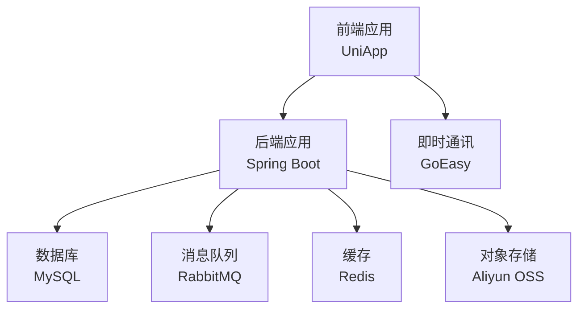
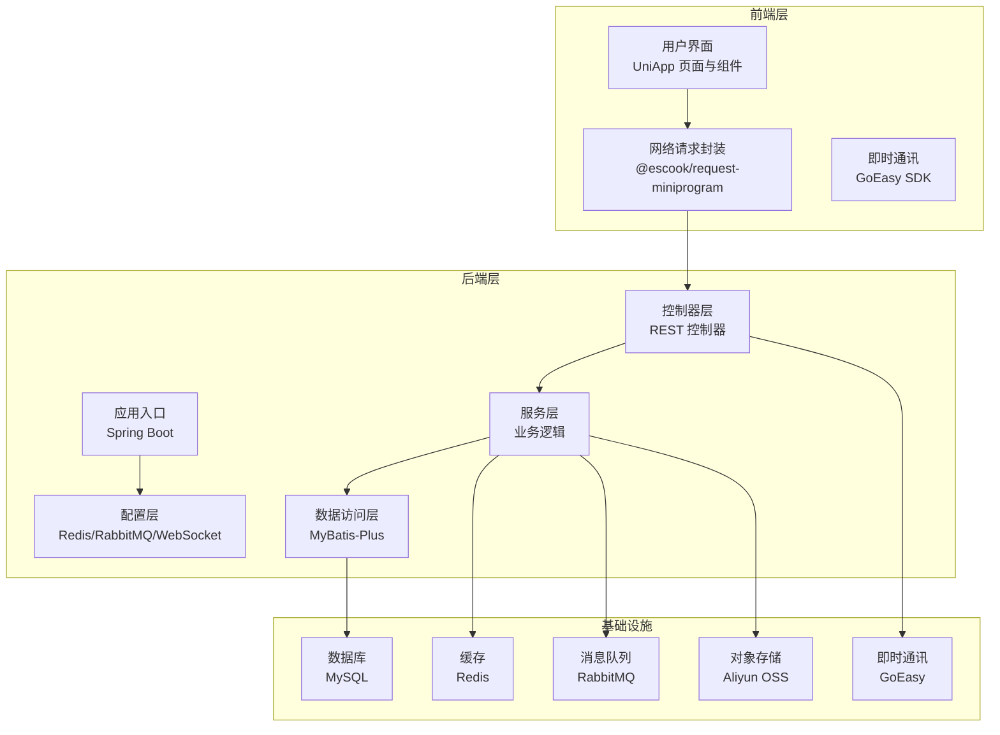
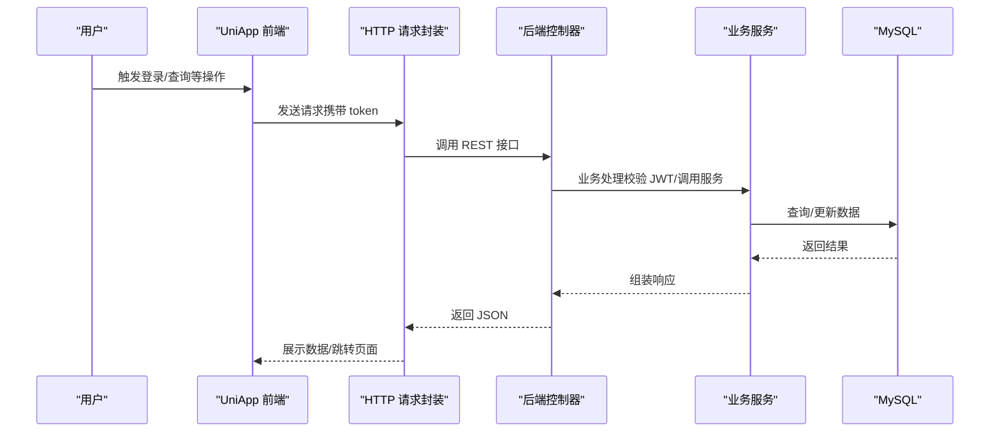
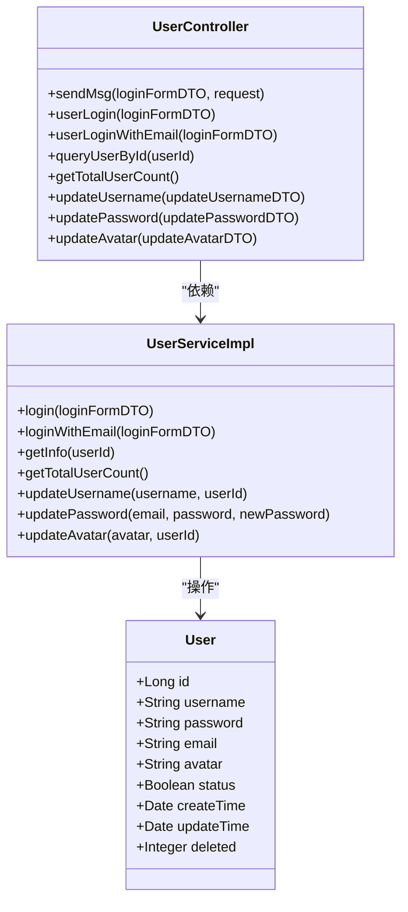
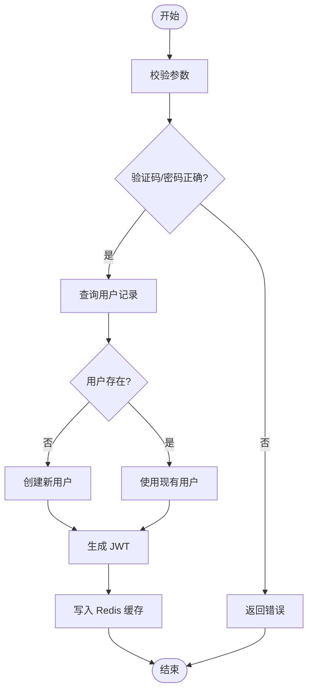
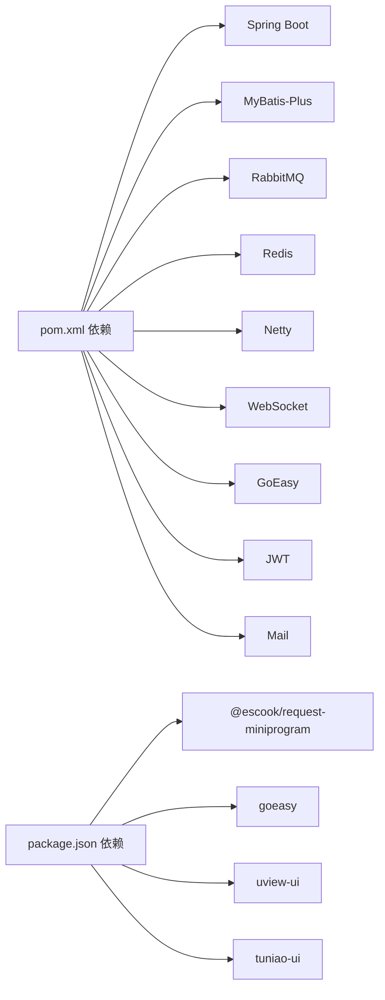

# 整体架构设计

<cite>
**本文档引用的文件**
- [TravelSocialApplication.java](file://springboot-travel-social/src/main/java/com/cxx/TravelSocialApplication.java)
- [pom.xml](file://springboot-travel-social/pom.xml)
- [application.properties](file://springboot-travel-social/src/main/resources/application.properties)
- [main.js](file://uniapp-travel-social/main.js)
- [package.json](file://uniapp-travel-social/package.json)
- [pages.json](file://uniapp-travel-social/pages.json)
- [UserController.java](file://springboot-travel-social/src/main/java/com/cxx/controller/UserController.java)
- [UserServiceImpl.java](file://springboot-travel-social/src/main/java/com/cxx/service/impl/UserServiceImpl.java)
- [WebSocketConfig.java](file://springboot-travel-social/src/main/java/com/cxx/config/WebSocketConfig.java)
- [RabbitMqConfig.java](file://springboot-travel-social/src/main/java/com/cxx/config/RabbitMqConfig.java)
- [RedisConfig.java](file://springboot-travel-social/src/main/java/com/cxx/config/RedisConfig.java)
- [Dockerfile](file://springboot-travel-social/Dockerfile)
- [User.java](file://springboot-travel-social/src/main/java/com/cxx/entity/User.java)
- [App.vue](file://uniapp-travel-social/App.vue)
- [travel_socical.sql](file://travel_socical.sql)
</cite>

## 目录
1. [简介](#简介)
2. [项目结构](#项目结构)
3. [核心组件](#核心组件)
4. [架构总览](#架构总览)
5. [详细组件分析](#详细组件分析)
6. [依赖关系分析](#依赖关系分析)
7. [性能考虑](#性能考虑)
8. [故障排查指南](#故障排查指南)
9. [结论](#结论)
10. [附录](#附录)

## 简介
本项目为“旅游攻略社交小程序”，采用前后端分离架构，前端基于 UniApp 构建，后端基于 Spring Boot 开发，结合 Redis、RabbitMQ、MySQL 等中间件，实现用户认证、社交互动、内容管理、消息推送、订单与支付等核心功能。系统具备良好的模块化设计与可扩展性，支持多端部署与运维。

## 项目结构
项目采用典型的前后端分离目录组织方式：
- 后端（Spring Boot）：位于 springboot-travel-social，包含应用入口、配置、控制器、服务、持久层、工具类、消息队列与缓存配置等。
- 前端（UniApp）：位于 uniapp-travel-social，包含页面路由、组件、样式、第三方 UI 库、全局状态管理与网络请求封装等。
- 数据库脚本：travel_socical.sql 提供核心业务表结构与示例数据。

图表来源
- [main.js:1-118](file://uniapp-travel-social/main.js#L1-L118)
- [application.properties:1-61](file://springboot-travel-social/src/main/resources/application.properties#L1-L61)
- [pom.xml:16-182](file://springboot-travel-social/pom.xml#L16-L182)

章节来源
- [main.js:1-118](file://uniapp-travel-social/main.js#L1-L118)
- [pages.json:1-814](file://uniapp-travel-social/pages.json#L1-L814)
- [application.properties:1-61](file://springboot-travel-social/src/main/resources/application.properties#L1-L61)

## 核心组件
- 应用入口与启动
  - 后端入口类负责启动 Spring Boot 应用，并初始化 WebSocket 上下文。
  - 前端入口负责全局 HTTP 请求拦截、Token 注入、全局 UI 组件注册与 IM 初始化。
- 认证与会话
  - 用户登录流程：邮箱验证码登录、邮箱密码登录，生成 JWT 并写入 Redis 缓存。
- 消息与推送
  - WebSocket 实时通信配置，RabbitMQ 队列配置，GoEasy 即时通讯集成。
- 缓存与性能
  - Redisson 客户端配置，结合 StringRedisTemplate 进行会话与验证码缓存。
- 数据持久化
  - MyBatis-Plus 配置与逻辑删除策略，MySQL 数据库连接与事务管理。
- 部署与运维
  - Dockerfile 提供容器化打包，Spring Boot Maven 插件完成打包与启动。

章节来源
- [TravelSocialApplication.java:16-51](file://springboot-travel-social/src/main/java/com/cxx/TravelSocialApplication.java#L16-L51)
- [UserController.java:31-136](file://springboot-travel-social/src/main/java/com/cxx/controller/UserController.java#L31-L136)
- [UserServiceImpl.java:43-200](file://springboot-travel-social/src/main/java/com/cxx/service/impl/UserServiceImpl.java#L43-L200)
- [WebSocketConfig.java:7-13](file://springboot-travel-social/src/main/java/com/cxx/config/WebSocketConfig.java#L7-L13)
- [RabbitMqConfig.java:16-31](file://springboot-travel-social/src/main/java/com/cxx/config/RabbitMqConfig.java#L16-L31)
- [RedisConfig.java:17-32](file://springboot-travel-social/src/main/java/com/cxx/config/RedisConfig.java#L17-L32)
- [Dockerfile:1-5](file://springboot-travel-social/Dockerfile#L1-L5)

## 架构总览
系统采用前后端分离架构，前端通过 HTTP/HTTPS 与后端交互，后端提供 RESTful 接口与实时通信能力。核心数据通过 MySQL 存储，Redis 提供高性能缓存与会话管理，RabbitMQ 支持异步消息处理，Aliyun OSS 承载图片与文件资源，GoEasy 提供即时通讯能力。

图表来源
- [main.js:1-118](file://uniapp-travel-social/main.js#L1-L118)
- [pom.xml:16-182](file://springboot-travel-social/pom.xml#L16-L182)
- [application.properties:1-61](file://springboot-travel-social/src/main/resources/application.properties#L1-L61)

## 详细组件分析

### 前端组件分析（UniApp）
- 全局配置
  - 全局 HTTP 基础地址、请求拦截器注入 Token、响应拦截器处理 401 登录态失效。
  - 全局 UI 组件库（uView、Tuniao UI）注册与混入。
  - 即时通讯（GoEasy）初始化与通知点击回调处理。
- 页面与路由
  - pages.json 定义分包结构与页面路径，覆盖首页、消息、个人中心、活动、酒店、美食、保险、打车、钱包、天气等多个业务模块。
- 状态管理
  - store/index.js 提供全局状态管理，App.vue 中注入系统信息与平台判断。

图表来源
- [main.js:17-63](file://uniapp-travel-social/main.js#L17-L63)
- [UserController.java:83-93](file://springboot-travel-social/src/main/java/com/cxx/controller/UserController.java#L83-L93)
- [UserServiceImpl.java:75-162](file://springboot-travel-social/src/main/java/com/cxx/service/impl/UserServiceImpl.java#L75-L162)

章节来源
- [main.js:1-118](file://uniapp-travel-social/main.js#L1-L118)
- [pages.json:1-814](file://uniapp-travel-social/pages.json#L1-L814)
- [App.vue:1-93](file://uniapp-travel-social/App.vue#L1-L93)

### 后端组件分析（Spring Boot）
- 应用入口与启动
  - TravelSocialApplication 启动应用并设置 WebSocket 上下文，启动时检查并迁移数据库字段。
- 控制器层
  - UserController 提供用户相关接口：发送验证码、邮箱快捷登录、邮箱密码登录、查询用户信息、更新用户名/密码/头像等。
- 服务层
  - UserServiceImpl 实现登录逻辑：验证码校验、用户查询/创建、JWT 生成、Redis 缓存用户信息。
- 配置层
  - WebSocketConfig：启用 WebSocket。
  - RabbitMqConfig：声明 remove/agree/refuse 队列。
  - RedisConfig：Redisson 客户端配置。
- 数据模型
  - User 实体包含用户基本信息、时间戳与逻辑删除字段。

图表来源
- [UserController.java:31-136](file://springboot-travel-social/src/main/java/com/cxx/controller/UserController.java#L31-L136)
- [UserServiceImpl.java:43-200](file://springboot-travel-social/src/main/java/com/cxx/service/impl/UserServiceImpl.java#L43-L200)
- [User.java:22-81](file://springboot-travel-social/src/main/java/com/cxx/entity/User.java#L22-L81)

章节来源
- [TravelSocialApplication.java:16-51](file://springboot-travel-social/src/main/java/com/cxx/TravelSocialApplication.java#L16-L51)
- [UserController.java:31-136](file://springboot-travel-social/src/main/java/com/cxx/controller/UserController.java#L31-L136)
- [UserServiceImpl.java:43-200](file://springboot-travel-social/src/main/java/com/cxx/service/impl/UserServiceImpl.java#L43-L200)
- [User.java:22-81](file://springboot-travel-social/src/main/java/com/cxx/entity/User.java#L22-L81)

### 数据流与处理逻辑
- 登录流程
  - 前端发起登录请求，携带邮箱与验证码或密码。
  - 后端校验验证码/密码，查询用户，生成 JWT 并写入 Redis。
  - 前端缓存 token，后续请求自动注入。
- 实时通信
  - WebSocket 配置启用，结合 GoEasy 实现实时消息推送与点击跳转。

图表来源
- [UserServiceImpl.java:75-162](file://springboot-travel-social/src/main/java/com/cxx/service/impl/UserServiceImpl.java#L75-L162)
- [UserController.java:83-93](file://springboot-travel-social/src/main/java/com/cxx/controller/UserController.java#L83-L93)

章节来源
- [UserServiceImpl.java:75-162](file://springboot-travel-social/src/main/java/com/cxx/service/impl/UserServiceImpl.java#L75-L162)
- [UserController.java:83-93](file://springboot-travel-social/src/main/java/com/cxx/controller/UserController.java#L83-L93)

## 依赖关系分析
- 技术栈依赖
  - Spring Boot Web、MyBatis-Plus、MySQL Connector、Redis、RabbitMQ、Netty、WebSocket、GoEasy、OkHttp、Fastjson、JWT、Mail 等。
- 前端依赖
  - @escook/request-miniprogram、goeasy、uview-ui、tuniao-ui 等。
- 配置与运行
  - application.properties 配置数据库、Redis、RabbitMQ、邮件、服务器端口等。
  - Dockerfile 提供容器化打包。

图表来源
- [pom.xml:16-182](file://springboot-travel-social/pom.xml#L16-L182)
- [package.json:15-21](file://uniapp-travel-social/package.json#L15-L21)

章节来源
- [pom.xml:16-182](file://springboot-travel-social/pom.xml#L16-L182)
- [package.json:15-21](file://uniapp-travel-social/package.json#L15-L21)
- [application.properties:1-61](file://springboot-travel-social/src/main/resources/application.properties#L1-L61)

## 性能考虑
- 缓存策略
  - 使用 Redis 缓存用户会话与验证码，降低数据库压力，提升登录与验证性能。
- 异步处理
  - RabbitMQ 队列用于异步任务（如审核、推送），避免阻塞主线程。
- 连接池与线程
  - Redis 连接池与 Tomcat 线程池配置，提升并发处理能力。
- 文件存储
  - 图片与文件上传至 Aliyun OSS，减轻应用服务器存储与带宽压力。
- 前端优化
  - 分包加载 pages.json，减少首屏体积；全局 Loading 与错误提示优化用户体验。

## 故障排查指南
- 登录失败
  - 检查验证码是否正确、Redis 是否可用、JWT 生成与缓存写入是否成功。
- 401 未授权
  - 前端拦截器会清除本地 token 并跳转登录页，检查 token 是否过期或被清理。
- 数据库连接异常
  - 检查 application.properties 中数据库连接参数与网络连通性。
- 消息队列/缓存不可用
  - 检查 RabbitMQ 与 Redis 服务状态与网络配置。

章节来源
- [main.js:43-56](file://uniapp-travel-social/main.js#L43-L56)
- [application.properties:1-61](file://springboot-travel-social/src/main/resources/application.properties#L1-L61)

## 结论
本项目采用 Spring Boot + UniApp 的技术栈组合，具备清晰的前后端分离架构与模块化设计。通过 Redis、RabbitMQ、MySQL、GoEasy 等中间件，系统在可扩展性、可维护性与性能方面取得良好平衡。建议后续持续完善微服务拆分、监控与日志体系、自动化测试与 CI/CD 流水线，进一步提升系统稳定性与交付效率。

## 附录
- 数据库表结构概览
  - 核心业务表包括 activity、activity_apply、address、admin、attractions、blog、user 等，涵盖活动、地址、景点、游记、用户等模块。
- 运行环境要求
  - JDK 8、MySQL 8、Redis、RabbitMQ、Node.js（构建）、Docker（可选）。

章节来源
- [travel_socical.sql:19-200](file://travel_socical.sql#L19-L200)