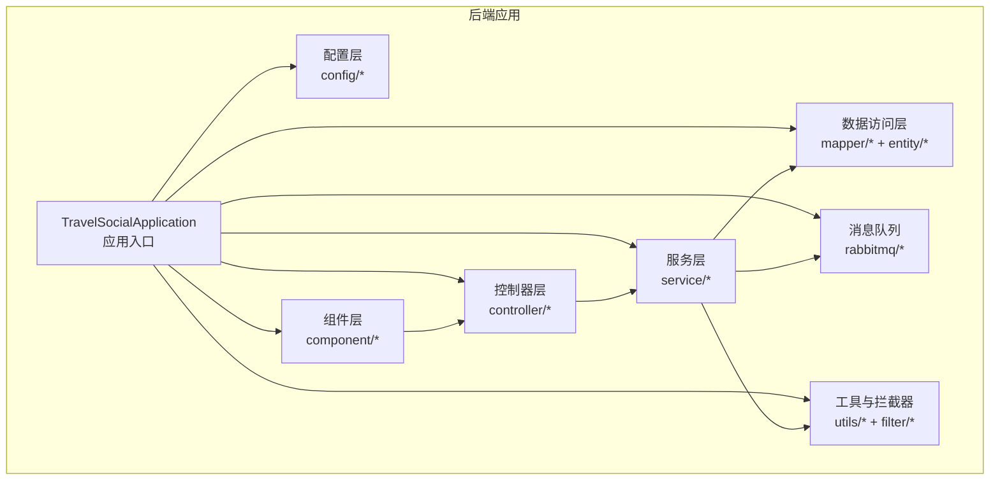
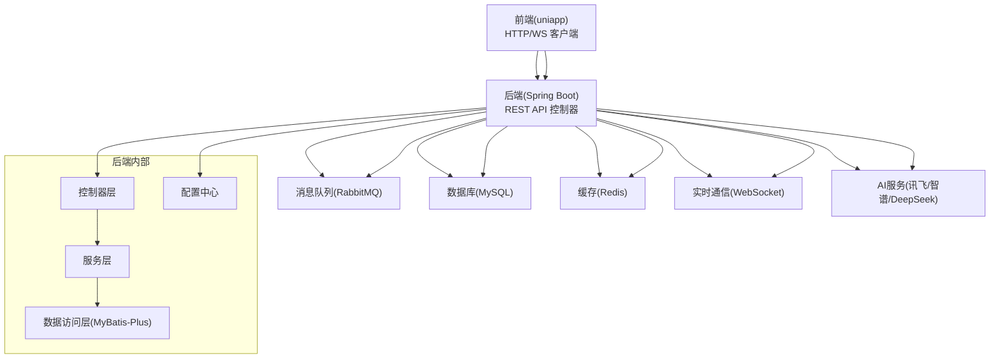
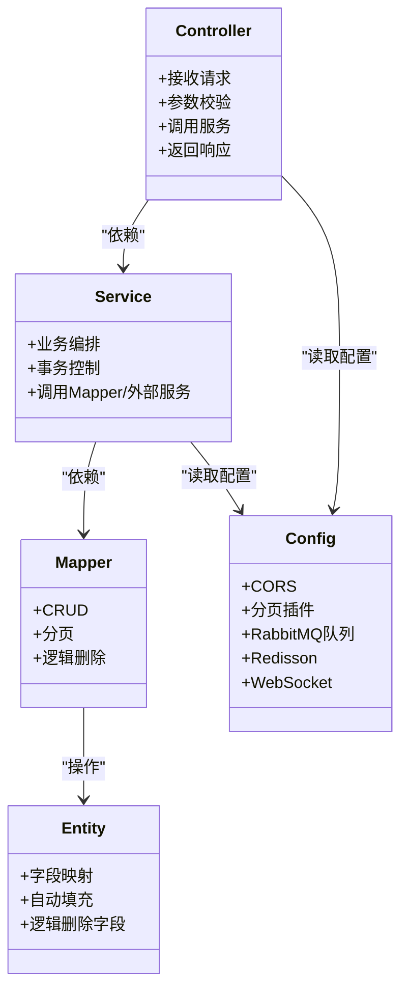
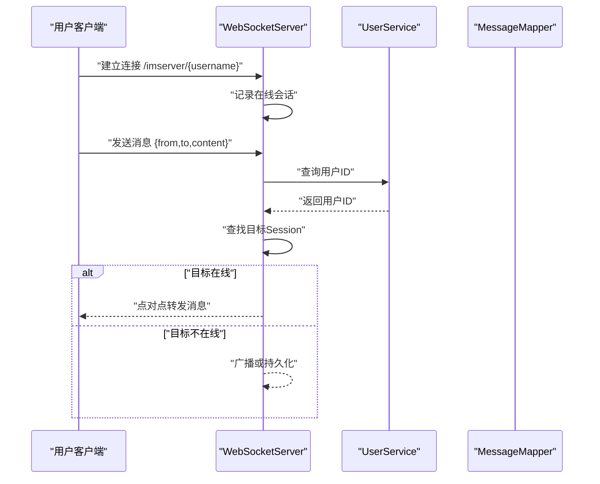
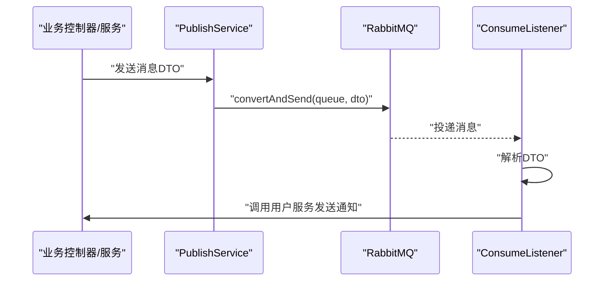
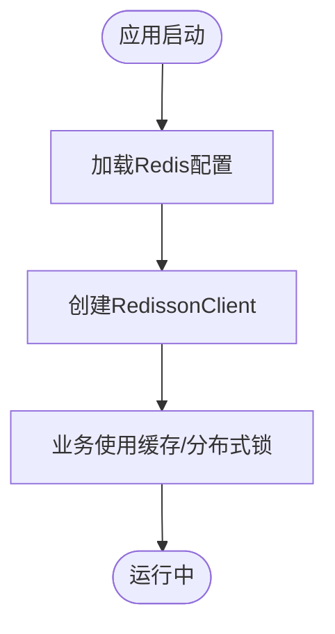
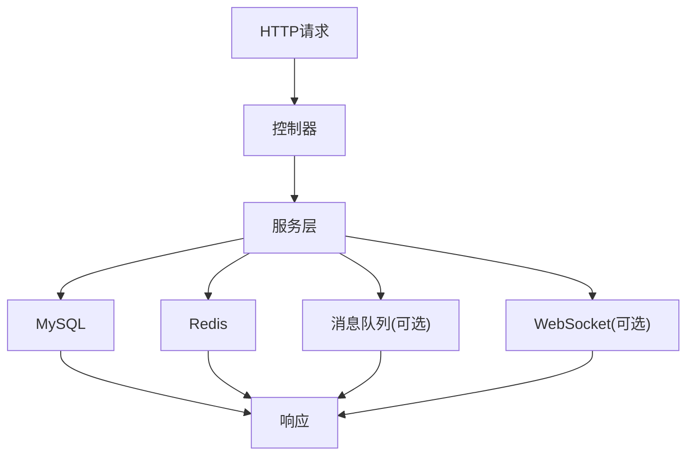
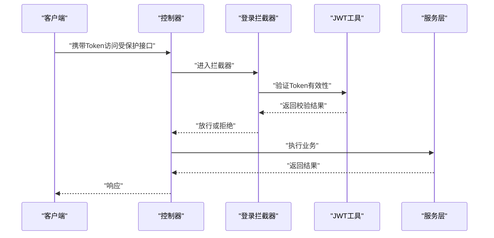
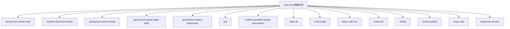
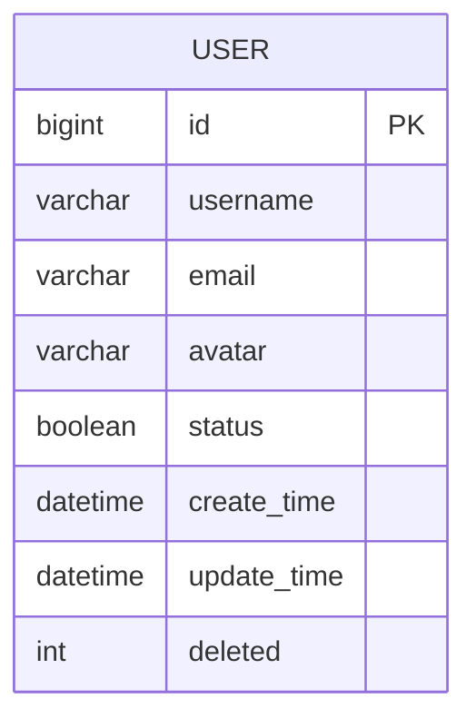

# 系统架构

<cite>
**本文引用的文件**
- [TravelSocialApplication.java](file://springboot-travel-social/src/main/java/com/cxx/TravelSocialApplication.java)
- [pom.xml](file://springboot-travel-social/pom.xml)
- [application.properties](file://springboot-travel-social/src/main/resources/application.properties)
- [WebSocketConfig.java](file://springboot-travel-social/src/main/java/com/cxx/config/WebSocketConfig.java)
- [WebSocketServer.java](file://springboot-travel-social/src/main/java/com/cxx/component/WebSocketServer.java)
- [RabbitMqConfig.java](file://springboot-travel-social/src/main/java/com/cxx/config/RabbitMqConfig.java)
- [ConsumeListener.java](file://springboot-travel-social/src/main/java/com/cxx/rabbitmq/ConsumeListener.java)
- [PublishService.java](file://springboot-travel-social/src/main/java/com/cxx/rabbitmq/PublishService.java)
- [RedisConfig.java](file://springboot-travel-social/src/main/java/com/cxx/config/RedisConfig.java)
- [MybatisPlusConfig.java](file://springboot-travel-social/src/main/java/com/cxx/config/MybatisPlusConfig.java)
- [CorsFilter.java](file://springboot-travel-social/src/main/java/com/cxx/config/CorsFilter.java)
- [JwtUtil.java](file://springboot-travel-social/src/main/java/com/cxx/utils/JwtUtil.java)
- [UserService.java](file://springboot-travel-social/src/main/java/com/cxx/service/UserService.java)
- [UserMapper.java](file://springboot-travel-social/src/main/java/com/cxx/mapper/UserMapper.java)
- [User.java](file://springboot-travel-social/src/main/java/com/cxx/entity/User.java)
</cite>

## 目录
1. [引言](#引言)
2. [项目结构](#项目结构)
3. [核心组件](#核心组件)
4. [架构总览](#架构总览)
5. [详细组件分析](#详细组件分析)
6. [依赖分析](#依赖分析)
7. [性能考虑](#性能考虑)
8. [故障排查指南](#故障排查指南)
9. [结论](#结论)
10. [附录](#附录)

## 引言
本系统是一个面向旅游攻略与社交的小程序后端，采用前后端分离架构，后端基于 Spring Boot，前端基于 UniApp。系统以模块化控制器为核心，结合 MyBatis-Plus 数据访问层、Redis 缓存、RabbitMQ 消息队列、WebSocket 实时通信等技术，构建高可用、可扩展、可维护的分布式架构。本文档从整体架构、分层设计、数据流、关键技术实现、可扩展性与性能优化、安全设计等方面进行系统化阐述。

## 项目结构
后端工程采用标准 Spring Boot 结构，按功能域划分包：
- config：全局配置（CORS、MyBatis-Plus 分页、RabbitMQ 队列、Redis、WebSocket、邮件、Swagger 等）
- component：组件级实现（WebSocket 服务器）
- controller：REST 控制器（覆盖旅游、社交、订单、AI、聊天、认证等业务）
- service：业务接口与实现（用户、博客、评论、订单、消息、AI 等）
- mapper：数据访问接口（MyBatis-Plus Mapper）
- entity：领域模型（数据库实体）
- dto：传输对象（请求/响应 DTO）
- utils：工具类（JWT、拦截器、常量、敏感词、地图 API、二维码等）
- rabbitmq：消息发布/订阅监听
- exception：异常处理
- filter：限流过滤器
- threadpool：线程池配置
- upload：文件上传控制器
- vo：视图对象

图表来源
- [TravelSocialApplication.java:1-54](file://springboot-travel-social/src/main/java/com/cxx/TravelSocialApplication.java#L1-L54)
- [MybatisPlusConfig.java:1-20](file://springboot-travel-social/src/main/java/com/cxx/config/MybatisPlusConfig.java#L1-L20)

章节来源
- [TravelSocialApplication.java:1-54](file://springboot-travel-social/src/main/java/com/cxx/TravelSocialApplication.java#L1-L54)
- [pom.xml:1-243](file://springboot-travel-social/pom.xml#L1-L243)

## 核心组件
- 应用入口与启动：应用在启动时初始化 WebSocket 上下文，并在启动完成后检查并自动迁移数据库字段。
- 配置中心：统一管理 CORS、MyBatis-Plus 分页、RabbitMQ 队列、Redis、WebSocket、邮件、Swagger 等。
- 控制器层：覆盖用户、社交、活动、酒店、美食、路线、订单、AI、聊天、天气、支付等业务控制器。
- 服务层：封装业务逻辑，提供用户、消息、订单、AI、风控等服务接口。
- 数据访问层：基于 MyBatis-Plus 的通用 Mapper，支持分页、逻辑删除、自动填充。
- 组件层：WebSocket 服务器实现点对点/广播消息。
- 消息队列：RabbitMQ 发布/订阅，异步通知用户（如活动审核结果）。
- 工具与拦截器：JWT、登录拦截器、限流过滤器、敏感词、地图 API、二维码生成等。

章节来源
- [TravelSocialApplication.java:22-50](file://springboot-travel-social/src/main/java/com/cxx/TravelSocialApplication.java#L22-L50)
- [MybatisPlusConfig.java:10-19](file://springboot-travel-social/src/main/java/com/cxx/config/MybatisPlusConfig.java#L10-L19)
- [CorsFilter.java:7-25](file://springboot-travel-social/src/main/java/com/cxx/config/CorsFilter.java#L7-L25)
- [RedisConfig.java:17-32](file://springboot-travel-social/src/main/java/com/cxx/config/RedisConfig.java#L17-L32)
- [WebSocketConfig.java:7-13](file://springboot-travel-social/src/main/java/com/cxx/config/WebSocketConfig.java#L7-L13)
- [RabbitMqConfig.java:16-31](file://springboot-travel-social/src/main/java/com/cxx/config/RabbitMqConfig.java#L16-L31)

## 架构总览
系统采用前后端分离架构，后端提供 REST API 与 WebSocket 服务，前端通过 HTTP 与 WebSocket 与后端交互。数据层采用 MySQL + Redis，消息层采用 RabbitMQ，AI 能力通过第三方大模型服务集成。

图表来源
- [pom.xml:16-181](file://springboot-travel-social/pom.xml#L16-L181)
- [application.properties:1-61](file://springboot-travel-social/src/main/resources/application.properties#L1-L61)
- [WebSocketConfig.java:7-13](file://springboot-travel-social/src/main/java/com/cxx/config/WebSocketConfig.java#L7-L13)
- [RabbitMqConfig.java:16-31](file://springboot-travel-social/src/main/java/com/cxx/config/RabbitMqConfig.java#L16-L31)
- [RedisConfig.java:17-32](file://springboot-travel-social/src/main/java/com/cxx/config/RedisConfig.java#L17-L32)

## 详细组件分析

### 分层架构与职责
- 表现层（控制器层）：负责接收 HTTP 请求，参数校验，调用服务层，返回统一响应结构。
- 业务逻辑层（服务层）：封装业务规则，协调数据访问与外部服务，保证事务一致性。
- 数据访问层（Mapper/Entity）：基于 MyBatis-Plus 提供 CRUD、分页、逻辑删除、自动填充能力。
- 基础设施层（配置/组件/工具）：提供跨域、分页、消息队列、缓存、WebSocket、JWT、限流等基础设施。

图表来源
- [MybatisPlusConfig.java:10-19](file://springboot-travel-social/src/main/java/com/cxx/config/MybatisPlusConfig.java#L10-L19)
- [CorsFilter.java:7-25](file://springboot-travel-social/src/main/java/com/cxx/config/CorsFilter.java#L7-L25)
- [RabbitMqConfig.java:16-31](file://springboot-travel-social/src/main/java/com/cxx/config/RabbitMqConfig.java#L16-L31)
- [RedisConfig.java:17-32](file://springboot-travel-social/src/main/java/com/cxx/config/RedisConfig.java#L17-L32)
- [WebSocketConfig.java:7-13](file://springboot-travel-social/src/main/java/com/cxx/config/WebSocketConfig.java#L7-L13)

章节来源
- [MybatisPlusConfig.java:10-19](file://springboot-travel-social/src/main/java/com/cxx/config/MybatisPlusConfig.java#L10-L19)
- [CorsFilter.java:7-25](file://springboot-travel-social/src/main/java/com/cxx/config/CorsFilter.java#L7-L25)
- [RabbitMqConfig.java:16-31](file://springboot-travel-social/src/main/java/com/cxx/config/RabbitMqConfig.java#L16-L31)
- [RedisConfig.java:17-32](file://springboot-travel-social/src/main/java/com/cxx/config/RedisConfig.java#L17-L32)
- [WebSocketConfig.java:7-13](file://springboot-travel-social/src/main/java/com/cxx/config/WebSocketConfig.java#L7-L13)

### WebSocket 实时通信架构
- 服务器端：基于 Java-WebSocket 注解式端点，维护在线用户会话映射，支持点对点与广播消息。
- 客户端：前端通过 WebSocket 连接后端，发送 JSON 格式消息，包含发送方、接收方与内容。
- 业务流程：用户上线加入会话列表；消息到达后根据目标用户查找会话并发送；若目标不在线则广播或落库持久化（由具体业务决定）。

图表来源
- [WebSocketServer.java:23-137](file://springboot-travel-social/src/main/java/com/cxx/component/WebSocketServer.java#L23-L137)
- [UserService.java:18-35](file://springboot-travel-social/src/main/java/com/cxx/service/UserService.java#L18-L35)
- [UserMapper.java:17-22](file://springboot-travel-social/src/main/java/com/cxx/mapper/UserMapper.java#L17-L22)

章节来源
- [WebSocketServer.java:23-137](file://springboot-travel-social/src/main/java/com/cxx/component/WebSocketServer.java#L23-L137)
- [WebSocketConfig.java:7-13](file://springboot-travel-social/src/main/java/com/cxx/config/WebSocketConfig.java#L7-L13)

### 消息队列异步处理架构
- 发布端：业务触发时调用发布服务，向指定队列发送消息 DTO。
- 监听端：消费者监听对应队列，解析消息并调用用户服务发送通知。
- 队列定义：提供“移除”“同意”“拒绝”三类队列，用于活动相关异步通知。

图表来源
- [PublishService.java:1-28](file://springboot-travel-social/src/main/java/com/cxx/rabbitmq/PublishService.java#L1-L28)
- [ConsumeListener.java:1-42](file://springboot-travel-social/src/main/java/com/cxx/rabbitmq/ConsumeListener.java#L1-L42)
- [RabbitMqConfig.java:16-31](file://springboot-travel-social/src/main/java/com/cxx/config/RabbitMqConfig.java#L16-L31)

章节来源
- [PublishService.java:1-28](file://springboot-travel-social/src/main/java/com/cxx/rabbitmq/PublishService.java#L1-L28)
- [ConsumeListener.java:1-42](file://springboot-travel-social/src/main/java/com/cxx/rabbitmq/ConsumeListener.java#L1-L42)
- [RabbitMqConfig.java:16-31](file://springboot-travel-social/src/main/java/com/cxx/config/RabbitMqConfig.java#L16-L31)

### 缓存架构
- 使用 Redisson 客户端连接本地 Redis，提供分布式锁、计数器、布隆过滤器等高级能力。
- 配置项包含主机、端口、连接池参数等，便于横向扩展与高可用部署。

图表来源
- [RedisConfig.java:17-32](file://springboot-travel-social/src/main/java/com/cxx/config/RedisConfig.java#L17-L32)
- [application.properties:23-30](file://springboot-travel-social/src/main/resources/application.properties#L23-L30)

章节来源
- [RedisConfig.java:17-32](file://springboot-travel-social/src/main/java/com/cxx/config/RedisConfig.java#L17-L32)
- [application.properties:23-30](file://springboot-travel-social/src/main/resources/application.properties#L23-L30)

### 数据流架构
- 入口：控制器接收请求，参数校验后调用服务层。
- 业务：服务层组合数据访问与外部服务，必要时写入消息队列异步通知。
- 存储：MyBatis-Plus 执行 SQL，支持分页与逻辑删除。
- 缓存：热点数据读写缓存，降低数据库压力。
- 实时：WebSocket 处理在线用户的即时消息。

图表来源
- [pom.xml:16-181](file://springboot-travel-social/pom.xml#L16-L181)
- [application.properties:1-61](file://springboot-travel-social/src/main/resources/application.properties#L1-61)
- [MybatisPlusConfig.java:10-19](file://springboot-travel-social/src/main/java/com/cxx/config/MybatisPlusConfig.java#L10-L19)

章节来源
- [pom.xml:16-181](file://springboot-travel-social/pom.xml#L16-L181)
- [application.properties:1-61](file://springboot-travel-social/src/main/resources/application.properties#L1-61)
- [MybatisPlusConfig.java:10-19](file://springboot-travel-social/src/main/java/com/cxx/config/MybatisPlusConfig.java#L10-L19)

### 安全架构设计
- JWT：用于用户身份令牌签发，设置过期时间，保护接口访问。
- 登录拦截器：统一校验 Token，确保受保护资源的安全访问。
- 跨域：开启 CORS，允许凭证与通配方法/头，便于前端调试与部署。
- 敏感词与输入校验：服务层与工具类配合，保障内容安全与输入合法性。

图表来源
- [JwtUtil.java:8-18](file://springboot-travel-social/src/main/java/com/cxx/utils/JwtUtil.java#L8-L18)
- [CorsFilter.java:7-25](file://springboot-travel-social/src/main/java/com/cxx/config/CorsFilter.java#L7-L25)

章节来源
- [JwtUtil.java:8-18](file://springboot-travel-social/src/main/java/com/cxx/utils/JwtUtil.java#L8-L18)
- [CorsFilter.java:7-25](file://springboot-travel-social/src/main/java/com/cxx/config/CorsFilter.java#L7-L25)

## 依赖分析
- 技术栈选择：
  - Spring Boot：快速搭建与统一配置
  - MyBatis-Plus：简化 ORM 与分页、逻辑删除
  - MySQL：关系型数据存储
  - Redis/Redisson：高性能缓存与分布式能力
  - RabbitMQ：异步解耦与可靠投递
  - WebSocket：实时通信
  - JWT：鉴权
  - Knife4j/Swagger：接口文档
  - Netty/Java-WebSocket：WebSocket 服务端实现
  - OkHttp/Jsoup/Hutool：网络与工具库
  - Lombok：减少样板代码
- 外部依赖：讯飞、智谱、DeepSeek 等大模型服务，通过配置注入使用。

图表来源
- [pom.xml:16-181](file://springboot-travel-social/pom.xml#L16-L181)

章节来源
- [pom.xml:16-181](file://springboot-travel-social/pom.xml#L16-L181)

## 性能考虑
- 数据库层
  - 使用 MyBatis-Plus 分页插件，避免全表扫描。
  - 逻辑删除字段统一管理，减少物理删除带来的锁竞争。
- 缓存层
  - Redisson 提供高性能缓存与分布式锁，建议热点数据加缓存，设置合理过期策略。
- 消息队列
  - 将耗时操作（如通知、日志、统计）异步化，降低请求延迟。
- WebSocket
  - 仅维护在线会话映射，避免广播风暴；对离线消息进行持久化或回传策略。
- 网络与工具
  - 合理配置 Tomcat 线程池参数，提升并发处理能力。
  - 使用 OkHttp/Jsoup 等高效工具处理外部 API 调用。

章节来源
- [MybatisPlusConfig.java:10-19](file://springboot-travel-social/src/main/java/com/cxx/config/MybatisPlusConfig.java#L10-L19)
- [application.properties:44-45](file://springboot-travel-social/src/main/resources/application.properties#L44-L45)
- [RedisConfig.java:17-32](file://springboot-travel-social/src/main/java/com/cxx/config/RedisConfig.java#L17-L32)

## 故障排查指南
- WebSocket 连接失败
  - 检查 WebSocket 配置是否启用，端点路径是否正确。
  - 查看服务端日志，确认会话建立与关闭回调是否正常。
- RabbitMQ 消费异常
  - 确认队列名称与绑定是否一致，消费者是否正确监听。
  - 检查消息序列化/反序列化是否匹配 DTO。
- Redis 连接问题
  - 校验主机、端口、密码配置，确认网络连通性。
- JWT 校验失败
  - 检查签名密钥与过期时间，确认前端是否正确携带 Token。
- 跨域问题
  - 确认 CORS 配置允许的源、方法与头，以及是否允许凭据。

章节来源
- [WebSocketConfig.java:7-13](file://springboot-travel-social/src/main/java/com/cxx/config/WebSocketConfig.java#L7-L13)
- [WebSocketServer.java:23-137](file://springboot-travel-social/src/main/java/com/cxx/component/WebSocketServer.java#L23-L137)
- [RabbitMqConfig.java:16-31](file://springboot-travel-social/src/main/java/com/cxx/config/RabbitMqConfig.java#L16-L31)
- [ConsumeListener.java:1-42](file://springboot-travel-social/src/main/java/com/cxx/rabbitmq/ConsumeListener.java#L1-L42)
- [RedisConfig.java:17-32](file://springboot-travel-social/src/main/java/com/cxx/config/RedisConfig.java#L17-L32)
- [JwtUtil.java:8-18](file://springboot-travel-social/src/main/java/com/cxx/utils/JwtUtil.java#L8-L18)
- [CorsFilter.java:7-25](file://springboot-travel-social/src/main/java/com/cxx/config/CorsFilter.java#L7-L25)

## 结论
本系统通过清晰的分层设计与多种关键技术（WebSocket、RabbitMQ、Redis、JWT、MyBatis-Plus），实现了高可用、可扩展、易维护的旅游社交小程序后端。未来可在以下方面持续演进：引入服务网格与链路追踪、完善灰度发布与熔断降级、增强监控与告警体系、优化缓存命中率与热点数据治理。

## 附录
- 数据模型要点
  - 用户实体包含主键、用户名、邮箱、头像、状态、创建/更新时间与逻辑删除字段。
  - 服务层接口提供登录、信息获取、头像/密码/用户名更新等能力。
  - Mapper 提供基础 CRUD 与自定义方法，配合 MyBatis-Plus 插件使用。

图表来源
- [User.java:29-80](file://springboot-travel-social/src/main/java/com/cxx/entity/User.java#L29-L80)

章节来源
- [User.java:29-80](file://springboot-travel-social/src/main/java/com/cxx/entity/User.java#L29-L80)
- [UserService.java:18-35](file://springboot-travel-social/src/main/java/com/cxx/service/UserService.java#L18-L35)
- [UserMapper.java:17-22](file://springboot-travel-social/src/main/java/com/cxx/mapper/UserMapper.java#L17-L22)