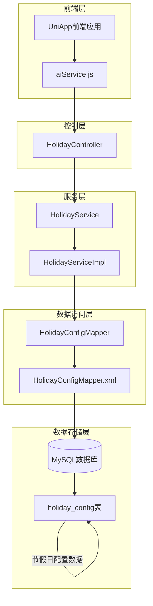
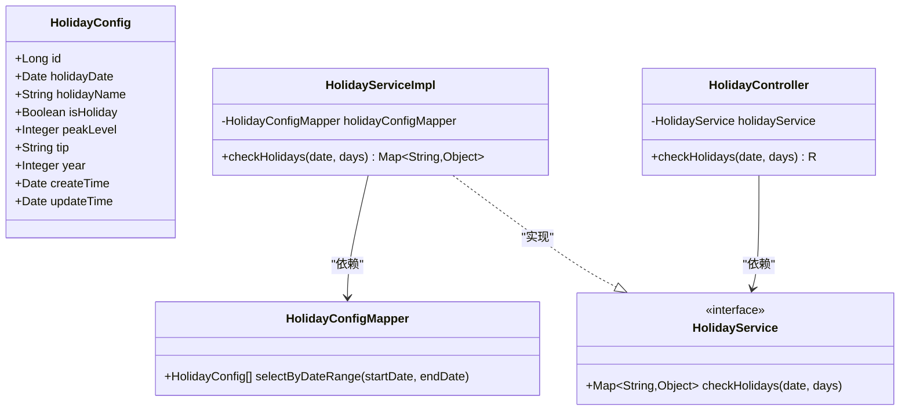
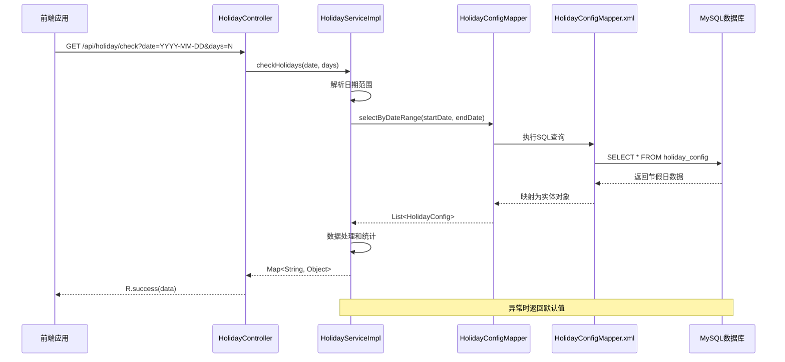
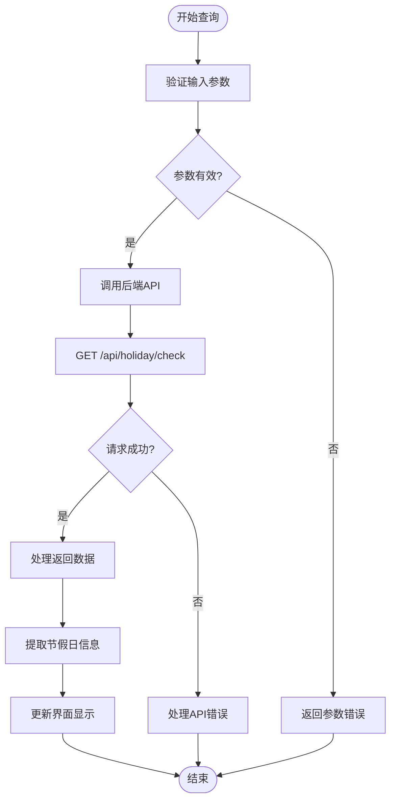

# 节假日配置系统

<cite>
**本文档引用的文件**
- [HolidayConfig.java](file://springboot-travel-social/src/main/java/com/cxx/entity/HolidayConfig.java)
- [HolidayConfigMapper.java](file://springboot-travel-social/src/main/java/com/cxx/mapper/HolidayConfigMapper.java)
- [HolidayConfigMapper.xml](file://springboot-travel-social/src/main/resources/com/cxx/mapper/HolidayConfigMapper.xml)
- [HolidayService.java](file://springboot-travel-social/src/main/java/com/cxx/service/HolidayService.java)
- [HolidayServiceImpl.java](file://springboot-travel-social/src/main/java/com/cxx/service/impl/HolidayServiceImpl.java)
- [HolidayController.java](file://springboot-travel-social/src/main/java/com/cxx/controller/HolidayController.java)
- [holiday_config.sql](file://springboot-travel-social/src/main/resources/sql/holiday_config.sql)
- [application.properties](file://springboot-travel-social/src/main/resources/application.properties)
- [aiService.js](file://uniapp-travel-social/services/aiService.js)
</cite>

## 目录
1. [项目概述](#项目概述)
2. [系统架构](#系统架构)
3. [核心组件分析](#核心组件分析)
4. [数据模型设计](#数据模型设计)
5. [API 接口文档](#api-接口文档)
6. [前端集成方案](#前端集成方案)
7. [性能优化策略](#性能优化策略)
8. [故障排查指南](#故障排查指南)
9. [总结](#总结)

## 项目概述

节假日配置系统是旅游攻略社交小程序的重要组成部分，旨在为用户提供准确的节假日信息查询服务。该系统通过本地化的节假日配置表，提供节假日日期查询、出行高峰等级评估、出行建议等功能，为AI智能推荐和旅行规划提供数据支撑。

系统采用Spring Boot + MyBatis Plus + MySQL的技术栈，实现了完整的CRUD操作和业务逻辑处理，支持RESTful API接口，便于前后端分离开发和部署。

## 系统架构



**图表来源**
- [HolidayController.java:1-42](file://springboot-travel-social/src/main/java/com/cxx/controller/HolidayController.java#L1-42)
- [HolidayServiceImpl.java:1-91](file://springboot-travel-social/src/main/java/com/cxx/service/impl/HolidayServiceImpl.java#L1-91)
- [HolidayConfigMapper.java:1-24](file://springboot-travel-social/src/main/java/com/cxx/mapper/HolidayConfigMapper.java#L1-24)
- [HolidayConfigMapper.xml:1-28](file://springboot-travel-social/src/main/resources/com/cxx/mapper/HolidayConfigMapper.xml#L1-28)

## 核心组件分析

### 实体类设计



**图表来源**
- [HolidayConfig.java:12-57](file://springboot-travel-social/src/main/java/com/cxx/entity/HolidayConfig.java#L12-L57)
- [HolidayConfigMapper.java:9-23](file://springboot-travel-social/src/main/java/com/cxx/mapper/HolidayConfigMapper.java#L9-L23)
- [HolidayService.java:5-18](file://springboot-travel-social/src/main/java/com/cxx/service/HolidayService.java#L5-L18)
- [HolidayServiceImpl.java:16-90](file://springboot-travel-social/src/main/java/com/cxx/service/impl/HolidayServiceImpl.java#L16-L90)
- [HolidayController.java:16-41](file://springboot-travel-social/src/main/java/com/cxx/controller/HolidayController.java#L16-L41)

### 业务流程分析



**图表来源**
- [HolidayController.java:27-40](file://springboot-travel-social/src/main/java/com/cxx/controller/HolidayController.java#L27-L40)
- [HolidayServiceImpl.java:29-89](file://springboot-travel-social/src/main/java/com/cxx/service/impl/HolidayServiceImpl.java#L29-L89)
- [HolidayConfigMapper.xml:18-25](file://springboot-travel-social/src/main/resources/com/cxx/mapper/HolidayConfigMapper.xml#L18-L25)

**章节来源**
- [HolidayConfig.java:12-57](file://springboot-travel-social/src/main/java/com/cxx/entity/HolidayConfig.java#L12-L57)
- [HolidayConfigMapper.java:9-23](file://springboot-travel-social/src/main/java/com/cxx/mapper/HolidayConfigMapper.java#L9-L23)
- [HolidayService.java:5-18](file://springboot-travel-social/src/main/java/com/cxx/service/HolidayService.java#L5-L18)
- [HolidayServiceImpl.java:16-90](file://springboot-travel-social/src/main/java/com/cxx/service/impl/HolidayServiceImpl.java#L16-L90)
- [HolidayController.java:16-41](file://springboot-travel-social/src/main/java/com/cxx/controller/HolidayController.java#L16-L41)

## 数据模型设计

### 数据库表结构

```mermaid
erDiagram
HOLIDAY_CONFIG {
BIGINT id PK
DATE holiday_date UK
VARCHAR(50) holiday_name
TINYINT is_holiday
TINYINT peak_level
VARCHAR(200) tip
SMALLINT year
DATETIME create_time
DATETIME update_time
}
INDEX idx_year ON HOLIDAY_CONFIG(year)
UNIQUE uk_date ON HOLIDAY_CONFIG(holiday_date)
```

**图表来源**
- [holiday_config.sql:2-15](file://springboot-travel-social/src/main/resources/sql/holiday_config.sql#L2-L15)

### 数据字段说明

| 字段名 | 类型 | 约束 | 描述 | 示例值 |
|--------|------|------|------|--------|
| id | BIGINT | PRIMARY KEY, AUTO_INCREMENT | 主键标识 | 1 |
| holiday_date | DATE | NOT NULL, UNIQUE | 节假日日期 | 2025-01-01 |
| holiday_name | VARCHAR(50) | NOT NULL | 节假日名称 | 元旦、春节、五一劳动节 |
| is_holiday | TINYINT(1) | NOT NULL, DEFAULT 1 | 是否为节假日 | 1=节假日, 0=调休工作日 |
| peak_level | TINYINT | NOT NULL, DEFAULT 1 | 出行高峰等级 | 1=一般, 2=高峰, 3=超高峰 |
| tip | VARCHAR(200) | NULL | 出行建议 | 提前预约、避开高峰等 |
| year | SMALLINT | NOT NULL | 所属年份 | 2025, 2026 |
| create_time | DATETIME | NOT NULL, DEFAULT CURRENT_TIMESTAMP | 创建时间 | 2024-01-01 00:00:00 |
| update_time | DATETIME | NOT NULL, DEFAULT CURRENT_TIMESTAMP ON UPDATE CURRENT_TIMESTAMP | 更新时间 | 2024-01-01 00:00:00 |

**章节来源**
- [holiday_config.sql:1-46](file://springboot-travel-social/src/main/resources/sql/holiday_config.sql#L1-L46)

## API 接口文档

### 接口定义

| 属性 | 值 |
|------|-----|
| 接口名称 | 节假日查询接口 |
| 接口路径 | `/api/holiday/check` |
| 请求方法 | GET |
| 接口描述 | 查询指定日期起N天内的节假日情况 |

### 请求参数

| 参数名 | 类型 | 必填 | 默认值 | 描述 | 示例 |
|--------|------|------|--------|------|------|
| date | String | 是 | 无 | 起始日期，格式 yyyy-MM-dd | 2025-05-01 |
| days | Integer | 否 | 7 | 查询天数 | 7 |

### 响应数据结构

```json
{
  "holidays": [
    {
      "date": "2025-05-01",
      "name": "五一劳动节",
      "isHoliday": true,
      "peakLevel": 3,
      "tip": "黄金周，景区限流，建议提前预约门票"
    }
  ],
  "totalHolidayDays": 1,
  "isPeakSeason": true,
  "peakLevel": 3,
  "holidayNames": "五一劳动节",
  "tips": ["黄金周，景区限流，建议提前预约门票"]
}
```

### 响应字段说明

| 字段名 | 类型 | 描述 |
|--------|------|------|
| holidays | Array | 节假日列表，包含日期、名称、是否节假日、高峰等级、出行建议 |
| totalHolidayDays | Number | 期间节假日总天数 |
| isPeakSeason | Boolean | 是否处于出行高峰期 |
| peakLevel | Number | 期间最高出行等级 |
| holidayNames | String | 节假日名称集合 |
| tips | Array | 出行建议列表 |

**章节来源**
- [HolidayController.java:27-40](file://springboot-travel-social/src/main/java/com/cxx/controller/HolidayController.java#L27-L40)
- [HolidayServiceImpl.java:69-76](file://springboot-travel-social/src/main/java/com/cxx/service/impl/HolidayServiceImpl.java#L69-L76)

## 前端集成方案

### 前端服务封装



**图表来源**
- [aiService.js:5-40](file://uniapp-travel-social/services/aiService.js#L5-L40)

### 前端调用示例

前端可以通过以下方式集成节假日查询功能：

1. **基础查询**：查询指定日期7天内的节假日信息
2. **自定义范围**：根据用户输入的天数范围进行查询
3. **错误处理**：网络异常或API错误时的降级处理
4. **数据展示**：将查询结果格式化为用户友好的界面展示

**章节来源**
- [aiService.js:1-324](file://uniapp-travel-social/services/aiService.js#L1-L324)

## 性能优化策略

### 数据库优化

1. **索引优化**
   - `uk_date` 唯一索引：确保节假日日期唯一性
   - `idx_year` 普通索引：按年份查询优化

2. **查询优化**
   - 使用 `BETWEEN` 操作符进行日期范围查询
   - 按日期升序排列，提高查询效率

### 缓存策略

虽然当前实现直接查询数据库，但可以考虑以下缓存方案：

1. **Redis缓存**：缓存节假日配置数据，减少数据库压力
2. **本地缓存**：应用启动时加载节假日数据到内存
3. **分级缓存**：按年份维度进行缓存管理

### 异常处理

系统实现了完善的异常处理机制：

1. **业务异常捕获**：日期解析异常、数据转换异常
2. **降级策略**：异常情况下返回默认值，保证系统稳定性
3. **日志记录**：详细记录异常信息，便于问题排查

## 故障排查指南

### 常见问题及解决方案

| 问题类型 | 症状 | 可能原因 | 解决方案 |
|----------|------|----------|----------|
| 数据库连接失败 | API调用报错 | 数据库配置错误 | 检查 `application.properties` 中的数据库连接配置 |
| 查询结果为空 | 返回空列表 | 日期范围超出数据范围 | 确认查询日期在预置数据范围内 |
| 日期格式错误 | 参数验证失败 | 日期格式不符合要求 | 确保传入 `yyyy-MM-dd` 格式的日期 |
| 性能问题 | 查询响应慢 | 缺少索引或数据量过大 | 添加数据库索引，优化查询条件 |

### 日志分析

系统提供了详细的日志记录：

1. **异常日志**：记录节假日查询过程中的异常信息
2. **性能日志**：记录查询耗时和数据量
3. **调试日志**：开发阶段用于问题定位

**章节来源**
- [HolidayServiceImpl.java:78-88](file://springboot-travel-social/src/main/java/com/cxx/service/impl/HolidayServiceImpl.java#L78-L88)
- [application.properties:1-64](file://springboot-travel-social/src/main/resources/application.properties#L1-L64)

## 总结

节假日配置系统通过合理的架构设计和完整的功能实现，为旅游攻略社交小程序提供了可靠的节假日信息服务。系统具有以下特点：

1. **模块化设计**：清晰的分层架构，职责明确
2. **数据完整性**：完善的数据库设计和约束
3. **扩展性强**：易于添加新的节假日数据和功能
4. **性能稳定**：合理的索引设计和异常处理机制
5. **易于集成**：标准的RESTful API接口，便于前端调用

该系统不仅满足了当前的功能需求，还为未来的功能扩展和性能优化奠定了良好的基础。通过持续的数据维护和系统优化，可以为用户提供更加准确和及时的节假日信息服务。