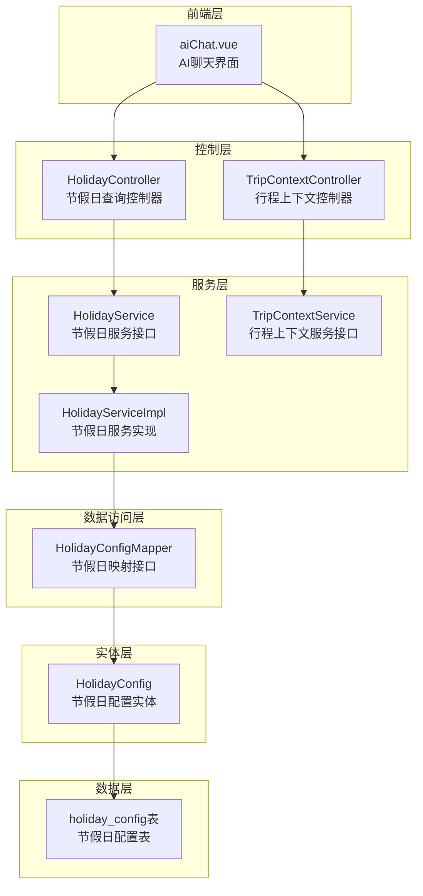
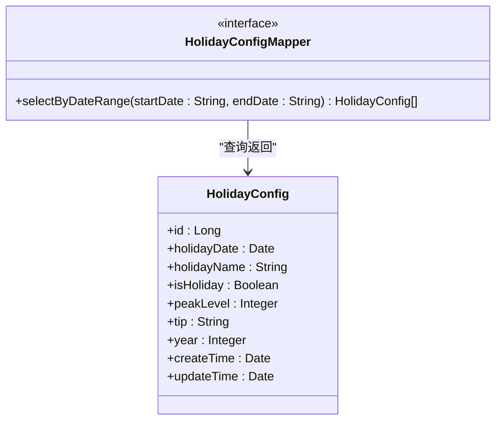
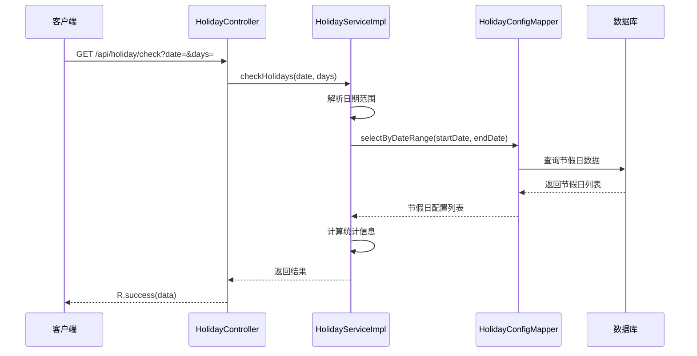
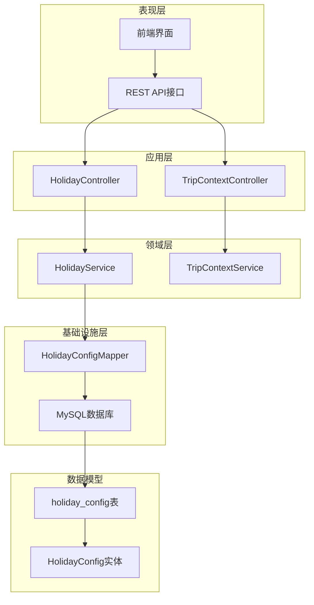
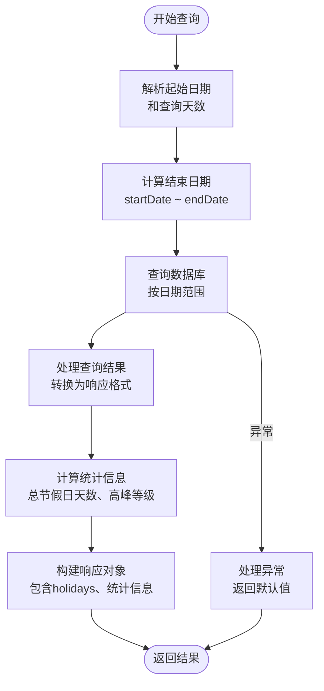
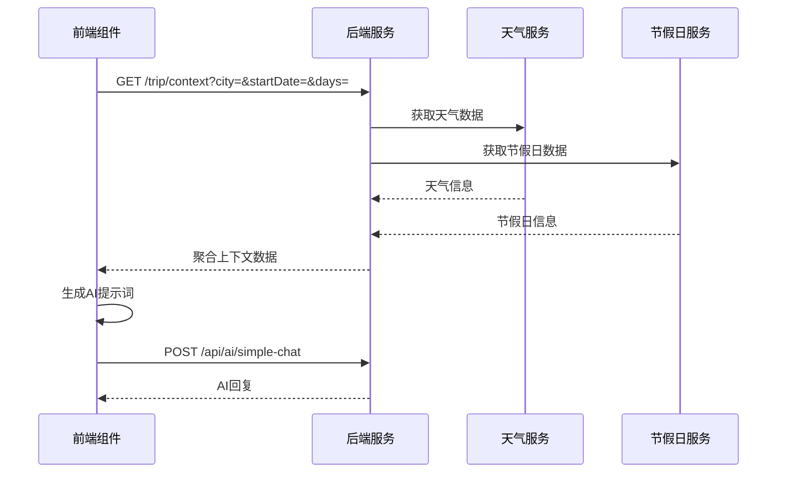
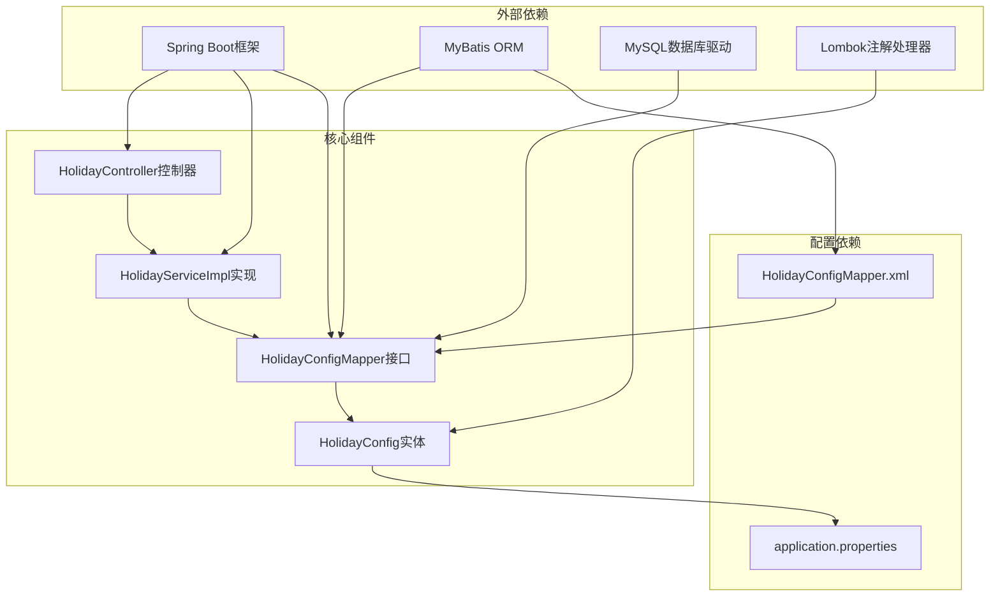
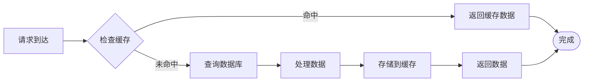
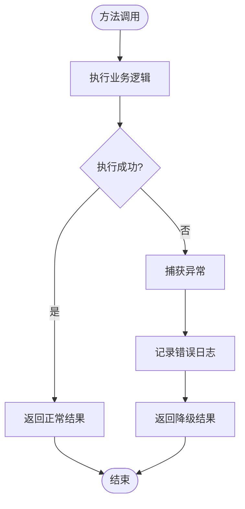

# 节日配置系统

<cite>
**本文档引用的文件**
- [HolidayConfig.java](file://springboot-travel-social/src/main/java/com/cxx/entity/HolidayConfig.java)
- [HolidayConfigMapper.java](file://springboot-travel-social/src/main/java/com/cxx/mapper/HolidayConfigMapper.java)
- [HolidayConfigMapper.xml](file://springboot-travel-social/src/main/resources/com/cxx/mapper/HolidayConfigMapper.xml)
- [HolidayService.java](file://springboot-travel-social/src/main/java/com/cxx/service/HolidayService.java)
- [HolidayServiceImpl.java](file://springboot-travel-social/src/main/java/com/cxx/service/impl/HolidayServiceImpl.java)
- [HolidayController.java](file://springboot-travel-social/src/main/java/com/cxx/controller/HolidayController.java)
- [TripContextController.java](file://springboot-travel-social/src/main/java/com/cxx/controller/TripContextController.java)
- [TripContextService.java](file://springboot-travel-social/src/main/java/com/cxx/service/TripContextService.java)
- [holiday_config.sql](file://springboot-travel-social/src/main/resources/sql/holiday_config.sql)
- [application.properties](file://springboot-travel-social/src/main/resources/application.properties)
- [SystemConstants.java](file://springboot-travel-social/src/main/java/com/cxx/utils/SystemConstants.java)
- [方案③-天气节假日感知.md](file://方案③-天气节假日感知.md)
- [aiChat.vue](file://uniapp-travel-social/homePages/aiChat/aiChat.vue)
</cite>

## 目录
1. [简介](#简介)
2. [项目结构](#项目结构)
3. [核心组件](#核心组件)
4. [架构概览](#架构概览)
5. [详细组件分析](#详细组件分析)
6. [依赖关系分析](#依赖关系分析)
7. [性能考虑](#性能考虑)
8. [故障排除指南](#故障排除指南)
9. [结论](#结论)

## 简介

节日配置系统是旅游攻略社交小程序的重要组成部分，旨在为用户提供准确的节假日信息和出行建议。该系统通过本地维护的节假日配置表，为AI聊天、行程规划等功能提供实时的节假日感知能力。

系统的核心功能包括：
- 节假日数据的存储和管理
- 按日期范围查询节假日信息
- 生成出行高峰等级评估
- 为AI聊天提供上下文感知能力
- 支持调休工作日和节假日的区分

## 项目结构

节日配置系统采用标准的Spring Boot三层架构设计，包含以下主要模块：



**图表来源**
- [HolidayController.java:1-42](file://springboot-travel-social/src/main/java/com/cxx/controller/HolidayController.java#L1-42)
- [TripContextController.java:1-45](file://springboot-travel-social/src/main/java/com/cxx/controller/TripContextController.java#L1-45)
- [HolidayServiceImpl.java:1-91](file://springboot-travel-social/src/main/java/com/cxx/service/impl/HolidayServiceImpl.java#L1-91)
- [HolidayConfigMapper.java:1-24](file://springboot-travel-social/src/main/java/com/cxx/mapper/HolidayConfigMapper.java#L1-24)
- [HolidayConfig.java:1-58](file://springboot-travel-social/src/main/java/com/cxx/entity/HolidayConfig.java#L1-58)

**章节来源**
- [HolidayController.java:1-42](file://springboot-travel-social/src/main/java/com/cxx/controller/HolidayController.java#L1-42)
- [HolidayServiceImpl.java:1-91](file://springboot-travel-social/src/main/java/com/cxx/service/impl/HolidayServiceImpl.java#L1-91)
- [HolidayConfigMapper.java:1-24](file://springboot-travel-social/src/main/java/com/cxx/mapper/HolidayConfigMapper.java#L1-24)

## 核心组件

### 实体模型

HolidayConfig实体类定义了节假日配置的数据结构，包含以下关键字段：

| 字段名 | 类型 | 描述 | 约束条件 |
|--------|------|------|----------|
| id | Long | 主键标识 | 自增 |
| holidayDate | Date | 节假日日期 | 唯一索引 |
| holidayName | String | 节假日名称 | 非空 |
| isHoliday | Boolean | 是否为节假日 | 1=节假日, 0=调休工作日 |
| peakLevel | Integer | 出行高峰等级 | 1=一般, 2=高峰, 3=超高峰 |
| tip | String | 出行建议 | 可为空 |
| year | Integer | 所属年份 | 非空 |
| createTime | Date | 创建时间 | 自动填充 |
| updateTime | Date | 更新时间 | 自动填充 |

### 数据访问层

HolidayConfigMapper接口提供了按日期范围查询节假日的功能：



**图表来源**
- [HolidayConfigMapper.java:12-23](file://springboot-travel-social/src/main/java/com/cxx/mapper/HolidayConfigMapper.java#L12-L23)
- [HolidayConfig.java:21-57](file://springboot-travel-social/src/main/java/com/cxx/entity/HolidayConfig.java#L21-L57)

### 业务服务层

HolidayService接口定义了节假日查询的核心业务逻辑：



**图表来源**
- [HolidayController.java:33-40](file://springboot-travel-social/src/main/java/com/cxx/controller/HolidayController.java#L33-L40)
- [HolidayServiceImpl.java:29-89](file://springboot-travel-social/src/main/java/com/cxx/service/impl/HolidayServiceImpl.java#L29-L89)
- [HolidayConfigMapper.java:21-22](file://springboot-travel-social/src/main/java/com/cxx/mapper/HolidayConfigMapper.java#L21-L22)

**章节来源**
- [HolidayConfig.java:1-58](file://springboot-travel-social/src/main/java/com/cxx/entity/HolidayConfig.java#L1-58)
- [HolidayConfigMapper.java:1-24](file://springboot-travel-social/src/main/java/com/cxx/mapper/HolidayConfigMapper.java#L1-24)
- [HolidayService.java:1-19](file://springboot-travel-social/src/main/java/com/cxx/service/HolidayService.java#L1-19)
- [HolidayServiceImpl.java:1-91](file://springboot-travel-social/src/main/java/com/cxx/service/impl/HolidayServiceImpl.java#L1-91)

## 架构概览

节日配置系统采用分层架构设计，实现了清晰的关注点分离：



**图表来源**
- [HolidayController.java:19-23](file://springboot-travel-social/src/main/java/com/cxx/controller/HolidayController.java#L19-L23)
- [TripContextController.java:20-24](file://springboot-travel-social/src/main/java/com/cxx/controller/TripContextController.java#L20-L24)
- [HolidayServiceImpl.java:19-22](file://springboot-travel-social/src/main/java/com/cxx/service/impl/HolidayServiceImpl.java#L19-L22)
- [TripContextService.java:9-19](file://springboot-travel-social/src/main/java/com/cxx/service/TripContextService.java#L9-L19)

系统特点：
- **可扩展性**：支持新增节假日类型和自定义出行建议
- **性能优化**：数据库建立唯一索引和年份索引，提升查询效率
- **数据一致性**：通过实体类注解确保数据完整性
- **易于维护**：清晰的分层架构便于代码维护和测试

## 详细组件分析

### 数据库设计

系统使用MySQL作为数据存储，holiday_config表的设计充分考虑了查询性能和数据完整性：

```mermaid
erDiagram
HOLIDAY_CONFIG {
BIGINT id PK
DATE holiday_date UK
VARCHAR(50) holiday_name
TINYINT is_holiday
TINYINT peak_level
VARCHAR(200) tip
SMALLINT year
DATETIME create_time
DATETIME update_time
}
INDEX idx_year ON HOLIDAY_CONFIG(year)
UNIQUE uk_date ON HOLIDAY_CONFIG(holiday_date)
```

**图表来源**
- [holiday_config.sql:2-15](file://springboot-travel-social/src/main/resources/sql/holiday_config.sql#L2-L15)

数据库设计要点：
- **唯一约束**：确保每个日期只能有一个节假日配置
- **索引优化**：year字段建立索引，支持按年份查询
- **时间戳字段**：自动记录创建和更新时间
- **数据类型选择**：合理使用TINYINT存储布尔值和等级信息

### 核心算法实现

HolidayServiceImpl中的核心算法负责处理复杂的业务逻辑：



**图表来源**
- [HolidayServiceImpl.java:29-89](file://springboot-travel-social/src/main/java/com/cxx/service/impl/HolidayServiceImpl.java#L29-L89)

算法复杂度分析：
- **时间复杂度**：O(n)，其中n为查询范围内的节假日数量
- **空间复杂度**：O(n)，用于存储查询结果和统计信息
- **查询优化**：利用数据库索引和WHERE子句优化日期范围查询

### 前端集成

前端系统通过aiChat.vue组件与后端接口进行交互：



**图表来源**
- [aiChat.vue:1252-1275](file://uniapp-travel-social/homePages/aiChat/aiChat.vue#L1252-L1275)
- [TripContextController.java:35-43](file://springboot-travel-social/src/main/java/com/cxx/controller/TripContextController.java#L35-L43)

**章节来源**
- [holiday_config.sql:17-45](file://springboot-travel-social/src/main/resources/sql/holiday_config.sql#L17-L45)
- [HolidayServiceImpl.java:29-89](file://springboot-travel-social/src/main/java/com/cxx/service/impl/HolidayServiceImpl.java#L29-L89)
- [aiChat.vue:1252-1275](file://uniapp-travel-social/homePages/aiChat/aiChat.vue#L1252-L1275)

## 依赖关系分析

系统各组件之间的依赖关系体现了良好的设计原则：



**图表来源**
- [application.properties:1-64](file://springboot-travel-social/src/main/resources/application.properties#L1-L64)
- [HolidayConfig.java:1-58](file://springboot-travel-social/src/main/java/com/cxx/entity/HolidayConfig.java#L1-L58)
- [HolidayConfigMapper.java:1-24](file://springboot-travel-social/src/main/java/com/cxx/mapper/HolidayConfigMapper.java#L1-L24)

依赖管理特点：
- **松耦合设计**：通过接口抽象降低组件间耦合度
- **依赖注入**：使用Spring框架实现自动依赖注入
- **配置集中**：数据库连接等配置集中在application.properties中
- **注解简化**：使用Lombok注解减少样板代码

**章节来源**
- [application.properties:1-64](file://springboot-travel-social/src/main/resources/application.properties#L1-L64)
- [HolidayConfig.java:1-58](file://springboot-travel-social/src/main/java/com/cxx/entity/HolidayConfig.java#L1-L58)
- [HolidayConfigMapper.xml:1-28](file://springboot-travel-social/src/main/resources/com/cxx/mapper/HolidayConfigMapper.xml#L1-L28)

## 性能考虑

### 数据库性能优化

系统在数据库层面采用了多项优化措施：

1. **索引策略**：
   - `uk_date`唯一索引：确保日期唯一性，避免重复数据
   - `idx_year`普通索引：支持按年份快速查询

2. **查询优化**：
   - 使用精确的日期范围查询，避免全表扫描
   - 通过ORDER BY子句确保结果按日期排序

3. **数据类型优化**：
   - 使用TINYINT存储布尔值和等级，节省存储空间
   - 合理设置字符串长度，避免过度占用空间

### 缓存策略

虽然当前实现未引入缓存层，但系统设计已考虑了缓存的可能性：



### 错误处理机制

系统实现了完善的错误处理机制：



**图表来源**
- [HolidayServiceImpl.java:78-88](file://springboot-travel-social/src/main/java/com/cxx/service/impl/HolidayServiceImpl.java#L78-L88)

## 故障排除指南

### 常见问题及解决方案

1. **数据库连接问题**
   - 检查application.properties中的数据库连接配置
   - 确认MySQL服务正在运行且端口可达
   - 验证用户名和密码的正确性

2. **节假日数据查询异常**
   - 确认日期格式是否符合yyyy-MM-dd要求
   - 检查数据库中是否存在对应的节假日记录
   - 验证Mapper XML文件的SQL语句正确性

3. **API接口访问问题**
   - 确认服务器端口配置（默认8082）
   - 检查CORS跨域配置
   - 验证接口URL路径的正确性

### 日志监控

系统使用SLF4J进行日志记录，关键错误会在日志中显示：

```java
log.error("节假日查询异常, date={}, days={}", date, days, e);
```

### 调试建议

1. **启用MyBatis日志**：在application.properties中配置日志输出
2. **使用Swagger**：通过API文档测试接口功能
3. **数据库监控**：使用EXPLAIN分析SQL查询性能
4. **前端调试**：检查网络请求和响应数据

**章节来源**
- [application.properties:13-13](file://springboot-travel-social/src/main/resources/application.properties#L13-L13)
- [HolidayServiceImpl.java:78-88](file://springboot-travel-social/src/main/java/com/cxx/service/impl/HolidayServiceImpl.java#L78-L88)

## 结论

节日配置系统通过精心设计的架构和实现，为旅游攻略社交小程序提供了可靠的节假日信息服务。系统的主要优势包括：

1. **架构清晰**：采用标准的分层架构，职责分离明确
2. **性能优秀**：通过数据库索引和查询优化确保高效响应
3. **扩展性强**：支持新增节假日类型和自定义业务逻辑
4. **易于维护**：简洁的代码结构和完善的注释便于维护
5. **集成友好**：为AI聊天和行程规划提供强大的上下文感知能力

系统的实现充分体现了现代Java Web开发的最佳实践，为类似的应用场景提供了优秀的参考模板。通过持续的优化和扩展，该系统能够更好地服务于用户的旅行规划需求。