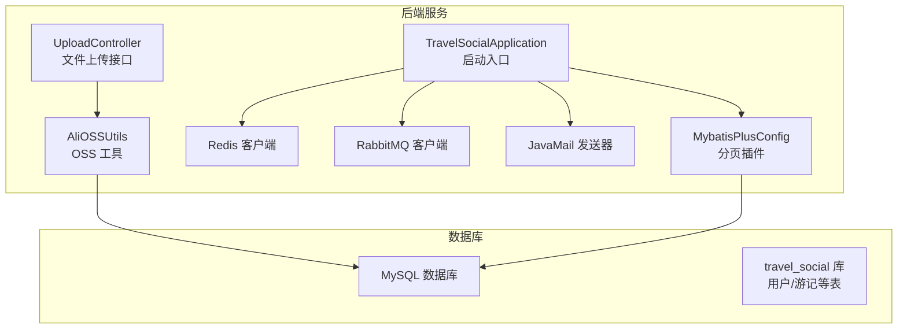
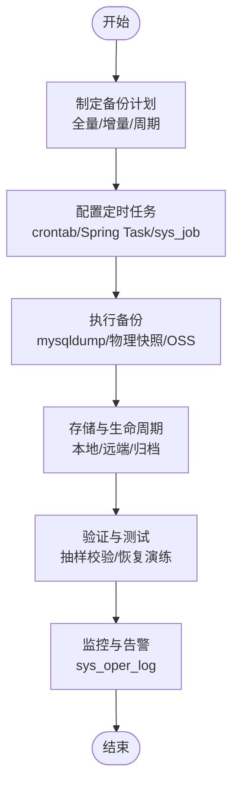
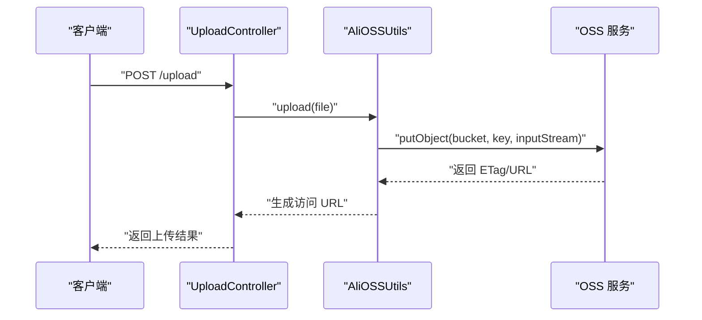
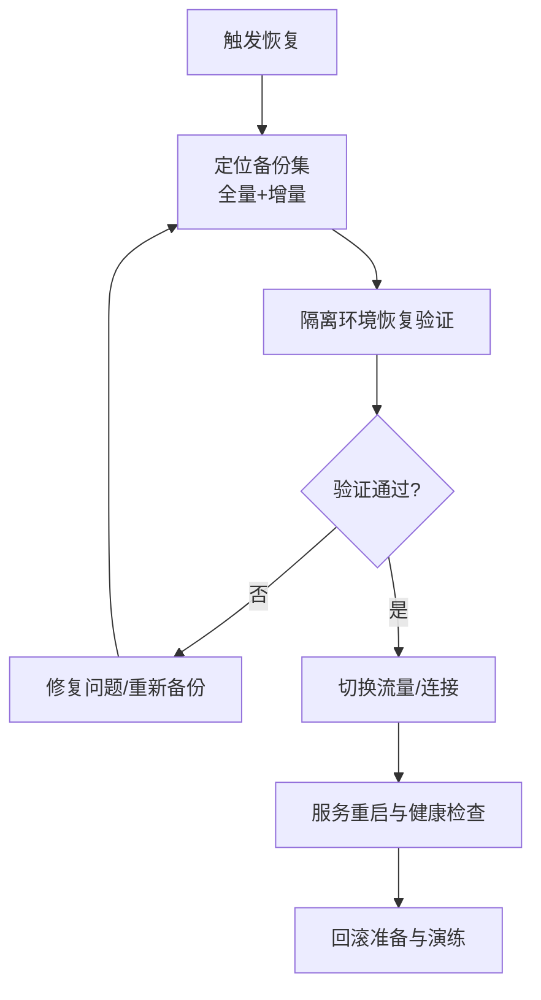
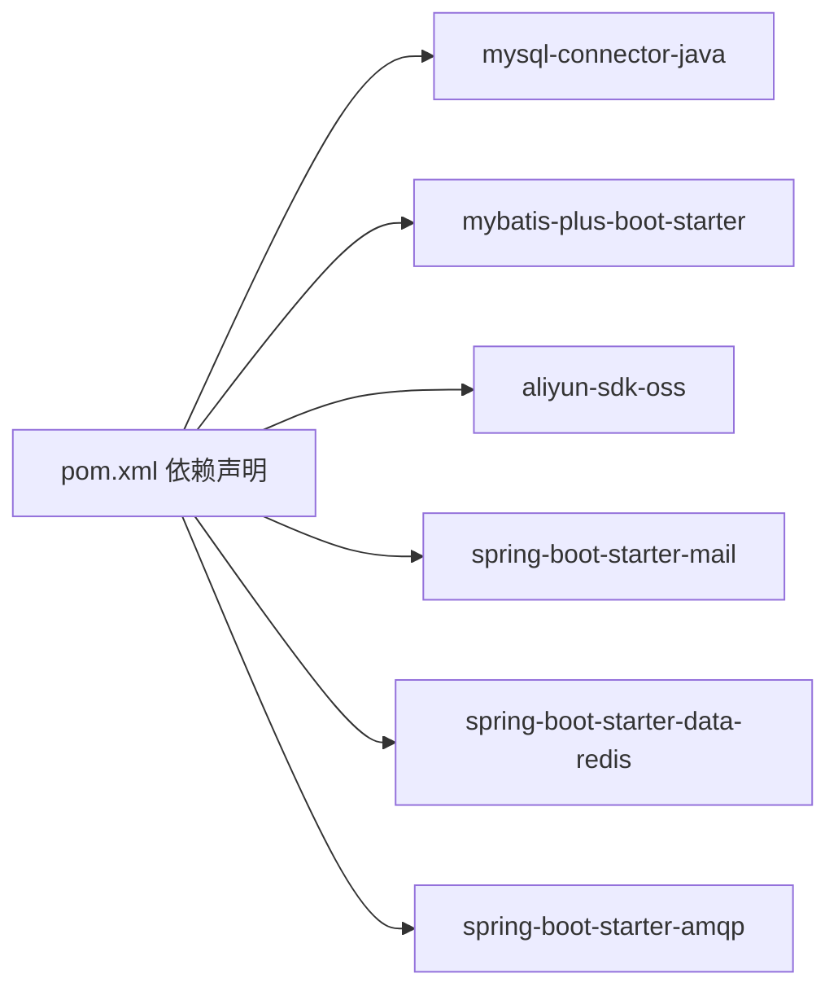

# 备份恢复

<cite>
**本文引用的文件**
- [application.properties](file://springboot-travel-social/src/main/resources/application.properties)
- [pom.xml](file://springboot-travel-social/pom.xml)
- [AliOSSUtils.java](file://springboot-travel-social/src/main/java/com/cxx/utils/AliOSSUtils.java)
- [UploadController.java](file://springboot-travel-social/src/main/java/com/cxx/upload/UploadController.java)
- [MybatisPlusConfig.java](file://springboot-travel-social/src/main/java/com/cxx/config/MybatisPlusConfig.java)
- [User.java](file://springboot-travel-social/src/main/java/com/cxx/entity/User.java)
- [Blog.java](file://springboot-travel-social/src/main/java/com/cxx/entity/Blog.java)
- [UserServiceImpl.java](file://springboot-travel-social/src/main/java/com/cxx/service/impl/UserServiceImpl.java)
- [TravelSocialApplication.java](file://springboot-travel-social/src/main/java/com/cxx/TravelSocialApplication.java)
- [travel_socical.sql](file://travel_socical.sql)
- [sys_job 表定义](file://travel_socical.sql)
- [sys_oper_log 表定义](file://travel_socical.sql)
</cite>

## 目录
1. [简介](#简介)
2. [项目结构](#项目结构)
3. [核心组件](#核心组件)
4. [架构总览](#架构总览)
5. [详细组件分析](#详细组件分析)
6. [依赖分析](#依赖分析)
7. [性能考量](#性能考量)
8. [故障排查指南](#故障排查指南)
9. [结论](#结论)
10. [附录](#附录)

## 简介
本方案围绕“备份与恢复”主题，结合当前代码库现状，给出数据库与文件（对象存储）备份策略、定时任务配置、存储与生命周期管理、灾难恢复流程、验证与测试方法、监控与告警、以及恢复演练与应急预案。由于当前仓库未内置数据库备份脚本与定时任务实现，本方案在现有能力基础上提出可落地的实施建议与流程图示。

## 项目结构
- 后端基于 Spring Boot，使用 MyBatis-Plus 进行数据库访问，配置了 MySQL 数据源、Redis、RabbitMQ、邮件等外部依赖。
- 文件上传通过阿里云 OSS 完成，提供上传接口与工具类。
- 数据模型包含用户、游记等实体，支持逻辑删除与分页插件。
- 项目具备基础的启动检查与列变更能力。

图表来源
- [TravelSocialApplication.java:16-50](file://springboot-travel-social/src/main/java/com/cxx/TravelSocialApplication.java#L16-L50)
- [MybatisPlusConfig.java:10-19](file://springboot-travel-social/src/main/java/com/cxx/config/MybatisPlusConfig.java#L10-L19)
- [AliOSSUtils.java:11-33](file://springboot-travel-social/src/main/java/com/cxx/utils/AliOSSUtils.java#L11-L33)
- [UploadController.java:11-24](file://springboot-travel-social/src/main/java/com/cxx/upload/UploadController.java#L11-L24)

章节来源
- [application.properties:1-61](file://springboot-travel-social/src/main/resources/application.properties#L1-L61)
- [pom.xml:16-121](file://springboot-travel-social/pom.xml#L16-L121)

## 核心组件
- 数据库访问与分页：MyBatis-Plus 分页拦截器，支持 MySQL。
- 文件上传与对象存储：OSS 工具类与上传接口，支持文件名去重与 URL 生成。
- 实体模型：用户、游记等实体，支持逻辑删除与时间字段填充。
- 启动检查：运行期检查并自动添加缺失字段（示例：订单表支付状态列）。

章节来源
- [MybatisPlusConfig.java:10-19](file://springboot-travel-social/src/main/java/com/cxx/config/MybatisPlusConfig.java#L10-L19)
- [AliOSSUtils.java:11-33](file://springboot-travel-social/src/main/java/com/cxx/utils/AliOSSUtils.java#L11-L33)
- [UploadController.java:11-24](file://springboot-travel-social/src/main/java/com/cxx/upload/UploadController.java#L11-L24)
- [User.java:22-80](file://springboot-travel-social/src/main/java/com/cxx/entity/User.java#L22-L80)
- [Blog.java:24-134](file://springboot-travel-social/src/main/java/com/cxx/entity/Blog.java#L24-L134)
- [TravelSocialApplication.java:27-50](file://springboot-travel-social/src/main/java/com/cxx/TravelSocialApplication.java#L27-L50)

## 架构总览
下图展示备份与恢复相关的关键交互：数据库备份、对象存储文件备份、定时任务触发、监控与告警。

```mermaid
graph TB
subgraph "备份触发"
CRON["定时任务调度<br/>sys_job"]
MANUAL["手动触发/运维脚本"]
end
subgraph "备份执行"
DBBACK["数据库备份<br/>mysqldump/物理快照"]
FILEBACK["文件备份<br/>OSS 批量归档"]
end
subgraph "存储与生命周期"
OSS["阿里云 OSS"]
LOCAL["本地/远端存储"]
LIFE["生命周期策略<br/>归档/冷存储/删除"]
end
subgraph "监控与告警"
LOG["操作日志 sys_oper_log"]
ALERT["告警通知<br/>邮件/IM"]
end
CRON --> DBBACK
MANUAL --> DBBACK
DBBACK --> LOCAL
FILEBACK --> OSS
OSS --> LIFE
LOCAL --> LIFE
DBBACK --> LOG
FILEBACK --> LOG
LOG --> ALERT
```

图表来源
- [sys_job 表定义:856-875](file://travel_socical.sql#L856-L875)
- [sys_oper_log 表定义:1030-1052](file://travel_socical.sql#L1030-L1052)

## 详细组件分析

### 数据库备份策略
- 全量备份
  - 使用 mysqldump 或物理快照（如 Percona XtraBackup）进行全量导出。
  - 建议按库或按表拆分，命名规则包含日期与版本号，便于检索与回滚。
- 增量备份
  - 基于 binlog 的增量备份，结合全量与增量进行恢复。
  - 增量备份周期建议为每 5-15 分钟（视业务写入量调整）。
- 定时任务配置
  - 使用系统 crontab 或 Spring Task 调度定时任务，调用备份脚本。
  - 任务表结构参考 sys_job，可用于记录任务名、表达式、状态等。
- 备份文件存储
  - 本地保留短期备份，远端对象存储长期归档。
  - 生命周期策略：近线/归档/冷存储/删除（例如 7 天近线、30 天归档、180 天删除）。
- 恢复验证
  - 定期抽取样本表进行校验，核对记录数与关键字段一致性。
  - 恢复演练：在隔离环境执行恢复流程，验证完整性与可用性。

图表来源
- [sys_job 表定义:856-875](file://travel_socical.sql#L856-L875)
- [sys_oper_log 表定义:1030-1052](file://travel_socical.sql#L1030-L1052)

章节来源
- [application.properties:1-61](file://springboot-travel-social/src/main/resources/application.properties#L1-L61)
- [pom.xml:44-48](file://springboot-travel-social/pom.xml#L44-L48)

### 文件备份方案（阿里云 OSS）
- 配置与使用
  - OSS 工具类提供上传入口，支持随机文件名与 URL 生成。
  - 上传接口对外暴露，便于前端直传或后端统一封装。
- 存储与生命周期
  - 建议开启 OSS 生命周期规则：对象保留期限、转换为低频/归档/深度归档、到期删除。
  - 对热点与非热点文件分类管理，优化成本与访问延迟。
- 删除与清理
  - 提供删除接口或脚本，配合生命周期策略定期清理过期文件。
- 访问控制
  - 使用签名 URL 或 Bucket Policy 控制访问权限，避免公开暴露。

图表来源
- [UploadController.java:17-23](file://springboot-travel-social/src/main/java/com/cxx/upload/UploadController.java#L17-L23)
- [AliOSSUtils.java:19-32](file://springboot-travel-social/src/main/java/com/cxx/utils/AliOSSUtils.java#L19-L32)

章节来源
- [AliOSSUtils.java:11-33](file://springboot-travel-social/src/main/java/com/cxx/utils/AliOSSUtils.java#L11-L33)
- [UploadController.java:11-24](file://springboot-travel-social/src/main/java/com/cxx/upload/UploadController.java#L11-L24)

### 灾难恢复流程
- 数据恢复步骤
  - 选择最近一次成功的全量备份与对应增量备份。
  - 在隔离环境进行恢复验证，确认数据完整性与业务可用性。
  - 切换 DNS/负载均衡或数据库连接指向恢复后的实例。
- 服务重启流程
  - 逐服务停止、恢复、启动，确保依赖顺序正确。
  - 重启后进行健康检查与功能回归测试。
- 回滚策略
  - 采用“可逆变更”原则，变更前做好标记与回滚点。
  - 回滚优先使用备份恢复，其次考虑版本回退与配置回滚。

[本图为概念流程，不直接映射具体源文件]

### 备份验证与测试
- 数据一致性
  - 抽样对比记录数、关键字段范围与索引完整性。
- 功能回归
  - 关键业务路径（登录、发布、上传）在恢复环境验证。
- 性能回归
  - 恢复后进行基准压测，评估性能指标。

[本节为通用指导，不直接分析具体源文件]

### 备份监控与告警
- 日志与审计
  - 使用 sys_oper_log 记录备份任务执行情况与异常。
- 告警渠道
  - 邮件/IM 推送失败与延迟告警，设置阈值与收敛策略。
- 可视化
  - 结合日志系统与仪表盘展示备份成功率、耗时、存储用量。

章节来源
- [sys_oper_log 表定义:1030-1052](file://travel_socical.sql#L1030-L1052)

### 恢复演练与应急预案
- 演练计划
  - 每季度至少一次全链路演练，覆盖数据库与文件恢复。
  - 明确角色分工、时间窗口与回退预案。
- 应急预案
  - 快速定位失败原因（备份源、传输、存储、解析）。
  - 启动备用系统与热备节点，缩短 RTO/RPO。

[本节为通用指导，不直接分析具体源文件]

## 依赖分析
- 数据库驱动与连接：MySQL Connector/J。
- ORM 框架：MyBatis-Plus。
- 对象存储 SDK：阿里云 OSS SDK。
- 邮件发送：Spring Boot Starter Mail。
- 缓存与消息：Redis、RabbitMQ。

图表来源
- [pom.xml:44-121](file://springboot-travel-social/pom.xml#L44-L121)

章节来源
- [pom.xml:16-121](file://springboot-travel-social/pom.xml#L16-L121)

## 性能考量
- 备份窗口与影响
  - 全量备份尽量避开业务高峰期；增量备份频率与 IO 压力平衡。
- 存储与压缩
  - 启用压缩与分片，降低网络与存储压力。
- 并发与限速
  - 并发导入与上传时注意限速，避免抢占业务带宽。

[本节为通用指导，不直接分析具体源文件]

## 故障排查指南
- 备份失败
  - 检查数据库连接、权限与磁盘空间；核对定时任务日志与 sys_oper_log。
- 上传失败
  - 检查 OSS 凭据、Bucket 权限与网络连通性；查看 AliOSSUtils 异常路径。
- 恢复异常
  - 核对备份集完整性与版本匹配；检查隔离环境依赖与配置。

章节来源
- [AliOSSUtils.java:11-33](file://springboot-travel-social/src/main/java/com/cxx/utils/AliOSSUtils.java#L11-L33)
- [sys_oper_log 表定义:1030-1052](file://travel_socical.sql#L1030-L1052)

## 结论
本方案在现有代码能力基础上，给出了数据库与文件备份的可执行策略与流程图示。建议尽快落地定时任务与生命周期策略，完善监控与演练机制，确保在发生故障时能够快速、可靠地完成恢复。

## 附录
- 数据库初始化脚本：travel_socical.sql
- 定时任务表结构：sys_job
- 操作日志表结构：sys_oper_log

章节来源
- [travel_socical.sql:1-264](file://travel_socical.sql#L1-L264)
- [sys_job 表定义:856-875](file://travel_socical.sql#L856-L875)
- [sys_oper_log 表定义:1030-1052](file://travel_socical.sql#L1030-L1052)