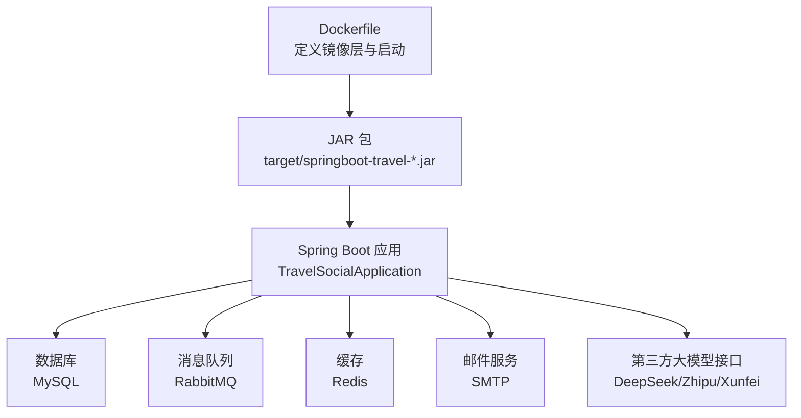
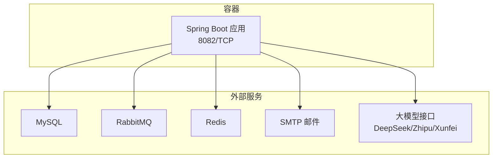
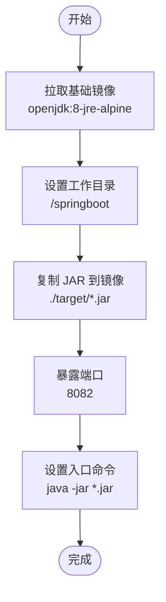
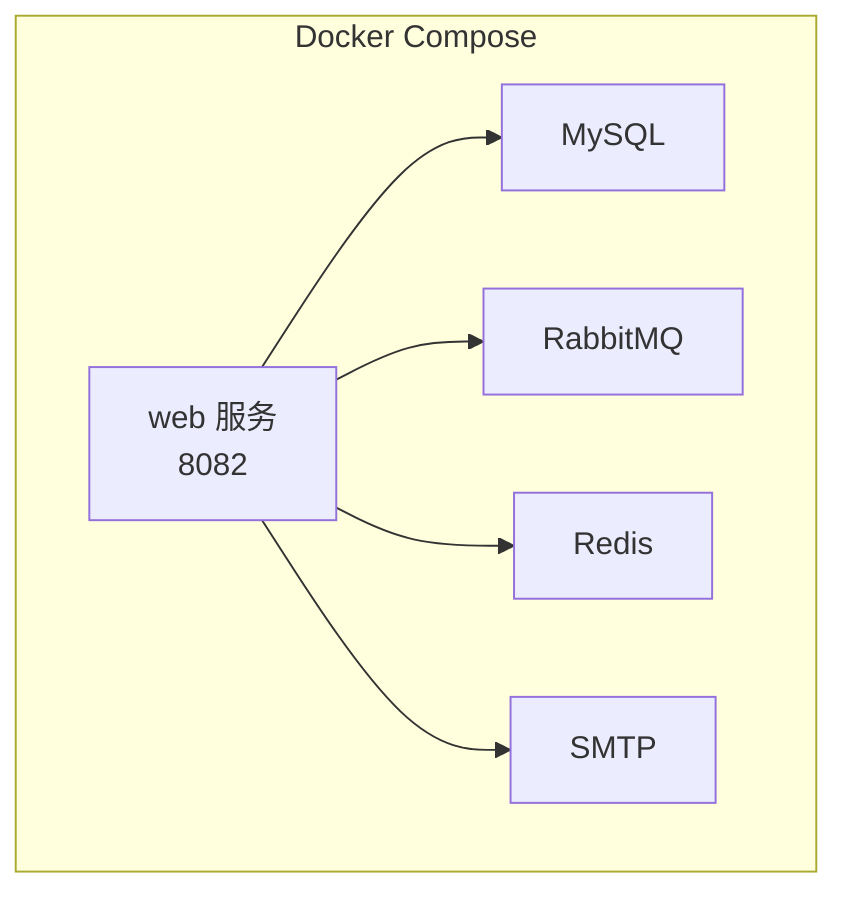
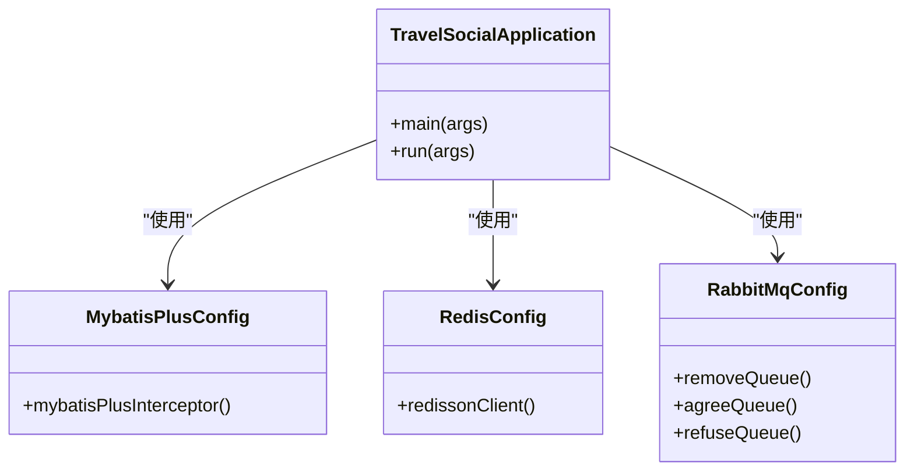

# 容器化部署

<cite>
**本文引用的文件**
- [Dockerfile](file://springboot-travel-social/Dockerfile)
- [pom.xml](file://springboot-travel-social/pom.xml)
- [application.properties](file://springboot-travel-social/src/main/resources/application.properties)
- [TravelSocialApplication.java](file://springboot-travel-social/src/main/java/com/cxx/TravelSocialApplication.java)
- [RabbitMqConfig.java](file://springboot-travel-social/src/main/java/com/cxx/config/RabbitMqConfig.java)
- [RedisConfig.java](file://springboot-travel-social/src/main/java/com/cxx/config/RedisConfig.java)
- [HELP.md](file://springboot-travel-social/HELP.md)
- [README.md](file://springboot-travel-social/README.md)
</cite>

## 目录
1. [简介](#简介)
2. [项目结构](#项目结构)
3. [核心组件](#核心组件)
4. [架构总览](#架构总览)
5. [详细组件分析](#详细组件分析)
6. [依赖分析](#依赖分析)
7. [性能考虑](#性能考虑)
8. [故障排查指南](#故障排查指南)
9. [结论](#结论)
10. [附录](#附录)

## 简介
本指南面向基于 Spring Boot 的后端服务容器化部署，结合项目现有 Dockerfile 配置，系统讲解从 JDK 8 环境到镜像构建、运行参数、网络与存储、以及容器编排（Docker Compose/Kubernetes）的完整流程。文档同时提供多阶段构建优化建议、镜像体积控制策略与安全最佳实践，帮助在生产环境中稳定、高效地运行该服务。

## 项目结构
后端服务位于 springboot-travel-social 目录，核心容器化相关文件如下：
- Dockerfile：定义基础镜像、工作目录、JAR 复制与启动命令
- pom.xml：Maven 构建配置，包含 Spring Boot 插件与 Java 版本
- application.properties：应用运行时配置（数据库、消息队列、缓存、邮件、AI 接口等）
- 启动类与配置类：TravelSocialApplication、RabbitMqConfig、RedisConfig 等

图表来源
- [Dockerfile:1-5](file://springboot-travel-social/Dockerfile#L1-L5)
- [pom.xml:195-240](file://springboot-travel-social/pom.xml#L195-L240)
- [application.properties:1-61](file://springboot-travel-social/src/main/resources/application.properties#L1-L61)
- [TravelSocialApplication.java:16-25](file://springboot-travel-social/src/main/java/com/cxx/TravelSocialApplication.java#L16-L25)

章节来源
- [Dockerfile:1-5](file://springboot-travel-social/Dockerfile#L1-L5)
- [pom.xml:10-14](file://springboot-travel-social/pom.xml#L10-L14)
- [application.properties:1-61](file://springboot-travel-social/src/main/resources/application.properties#L1-L61)

## 核心组件
- 基础镜像与 JDK 环境
  - 使用 openjdk:8-jre-alpine，满足 Java 8 运行需求且镜像体积较小
- 工作目录与 JAR 复制
  - 在 /springboot 下放置打包好的可执行 JAR
- 端口暴露与启动
  - 暴露 8082 端口，通过 java -jar 启动应用
- 构建产物
  - Maven 插件生成可执行 JAR，artifactId 对应 jar 文件名

章节来源
- [Dockerfile:1-5](file://springboot-travel-social/Dockerfile#L1-L5)
- [pom.xml:224-237](file://springboot-travel-social/pom.xml#L224-L237)

## 架构总览
下图展示了容器化后的运行时拓扑：容器内运行 Spring Boot 应用，依赖外部数据库、消息队列与缓存服务；应用通过配置文件连接这些外部资源。

图表来源
- [application.properties:1-61](file://springboot-travel-social/src/main/resources/application.properties#L1-L61)
- [RabbitMqConfig.java:16-31](file://springboot-travel-social/src/main/java/com/cxx/config/RabbitMqConfig.java#L16-L31)
- [RedisConfig.java:17-32](file://springboot-travel-social/src/main/java/com/cxx/config/RedisConfig.java#L17-L32)

## 详细组件分析

### Dockerfile 解析与构建流程
- 基础镜像选择
  - openjdk:8-jre-alpine：轻量级 JRE 运行时，适合生产环境
- 工作目录
  - WORKDIR /springboot：统一应用根目录，便于管理
- JAR 复制
  - COPY ./target/springboot-travel-0.0.1-SNAPSHOT.jar：将构建产物复制到镜像中
- 端口与入口
  - EXPOSE 8082：声明对外暴露端口
  - ENTRYPOINT java -jar ...：以可执行 JAR 方式启动应用

图表来源
- [Dockerfile:1-5](file://springboot-travel-social/Dockerfile#L1-L5)

章节来源
- [Dockerfile:1-5](file://springboot-travel-social/Dockerfile#L1-L5)

### 多阶段构建与镜像优化
- 当前现状
  - 单阶段构建，直接基于 JRE 镜像复制 JAR
- 优化建议
  - 引入构建阶段（如 maven:3.9.6-jdk-8）进行编译与打包，再将产物复制到最小化运行时镜像（alpine），减少依赖与体积
  - 使用 .dockerignore 忽略不必要的构建上下文文件，缩短构建时间
  - 合理分层：将不常变更的依赖层放在前面，利用镜像缓存

章节来源
- [pom.xml:224-237](file://springboot-travel-social/pom.xml#L224-L237)
- [HELP.md](file://springboot-travel-social/HELP.md#L9)

### 安全最佳实践
- 镜像安全
  - 固定基础镜像版本，定期更新 alpine 与 openjdk 补丁
  - 使用只读根文件系统，禁用不必要的权限
- 凭据与敏感信息
  - 数据库、消息队列、缓存、邮件与第三方 API 密钥通过环境变量注入，避免硬编码
- 网络与访问控制
  - 仅暴露必要端口（8082），使用防火墙或网络策略限制访问
  - 使用非 root 用户运行应用（需配合文件权限）

章节来源
- [application.properties:1-61](file://springboot-travel-social/src/main/resources/application.properties#L1-L61)

### 运行参数与资源配置
- 内存与 CPU
  - 通过 JVM 参数控制堆大小与 GC 行为（如 -Xms、-Xmx、-XX:+UseG1GC）
- 环境变量
  - 通过 -e 或环境变量文件传入数据库、消息队列、缓存、邮件与 AI 接口所需的主机、端口、账号与密钥
- 日志与健康检查
  - 配置日志输出到 stdout/stderr，便于容器日志收集
  - 添加健康检查端点（Actuator）以支持就绪/存活探针

章节来源
- [pom.xml:37-43](file://springboot-travel-social/pom.xml#L37-L43)
- [application.properties:1-61](file://springboot-travel-social/src/main/resources/application.properties#L1-L61)

### 网络与存储
- 网络
  - 使用自定义网络隔离服务，容器间通过服务名解析
  - 将 8082 映射到宿主机端口（开发/测试环境），生产环境通过反向代理暴露
- 存储
  - 无状态设计优先；静态资源与上传文件建议挂载到持久化卷
  - 配置日志目录挂载，避免日志丢失

章节来源
- [application.properties:15-16](file://springboot-travel-social/src/main/resources/application.properties#L15-L16)

### 服务发现与依赖管理
- 服务发现
  - 在 Docker Compose 中通过服务名访问数据库、消息队列与缓存
  - 在 Kubernetes 中使用 Headless Service 与 Pod 模板管理
- 依赖配置
  - 数据库、消息队列、缓存、邮件与 AI 接口均通过 application.properties 配置，容器启动时由环境变量覆盖

章节来源
- [application.properties:1-61](file://springboot-travel-social/src/main/resources/application.properties#L1-L61)
- [RabbitMqConfig.java:16-31](file://springboot-travel-social/src/main/java/com/cxx/config/RabbitMqConfig.java#L16-L31)
- [RedisConfig.java:17-32](file://springboot-travel-social/src/main/java/com/cxx/config/RedisConfig.java#L17-L32)

### 容器编排示例

#### Docker Compose
- 建议的服务编排
  - web：后端应用，映射 8082
  - mysql：数据库
  - rabbitmq：消息队列
  - redis：缓存
  - smtp：邮件服务（可选）
- 关键点
  - 使用 depends_on 控制启动顺序
  - 通过环境变量注入数据库、消息队列、缓存与邮件凭据
  - 使用命名网络实现服务互通

（本图为概念性编排示意，不对应具体源码文件）

#### Kubernetes
- 建议对象
  - Deployment：管理副本与滚动升级
  - Service：ClusterIP/NodePort 暴露 8082
  - ConfigMap：存放非敏感配置
  - Secret：存放数据库、消息队列、缓存、邮件与 AI 接口密钥
  - PersistentVolumeClaim：挂载日志与静态资源
- 关键点
  - 设置资源请求与限制，启用就绪/存活探针
  - 使用环境变量引用 Secret 与 ConfigMap

（本图为概念性编排示意，不对应具体源码文件）

## 依赖分析
- 应用启动与配置
  - TravelSocialApplication 作为入口，启动时初始化 WebSocket 上下文
  - MyBatis Plus 分页插件与 Mapper 扫描配置
  - Redisson 客户端基于 application.properties 中的 Redis 主机与端口
  - RabbitMQ 队列声明基于 RabbitMqConfig

图表来源
- [TravelSocialApplication.java:16-31](file://springboot-travel-social/src/main/java/com/cxx/TravelSocialApplication.java#L16-L31)
- [MybatisPlusConfig.java:10-19](file://springboot-travel-social/src/main/java/com/cxx/config/MybatisPlusConfig.java#L10-L19)
- [RedisConfig.java:17-32](file://springboot-travel-social/src/main/java/com/cxx/config/RedisConfig.java#L17-L32)
- [RabbitMqConfig.java:16-31](file://springboot-travel-social/src/main/java/com/cxx/config/RabbitMqConfig.java#L16-L31)

章节来源
- [TravelSocialApplication.java:16-31](file://springboot-travel-social/src/main/java/com/cxx/TravelSocialApplication.java#L16-L31)
- [MybatisPlusConfig.java:10-19](file://springboot-travel-social/src/main/java/com/cxx/config/MybatisPlusConfig.java#L10-L19)
- [RedisConfig.java:17-32](file://springboot-travel-social/src/main/java/com/cxx/config/RedisConfig.java#L17-L32)
- [RabbitMqConfig.java:16-31](file://springboot-travel-social/src/main/java/com/cxx/config/RabbitMqConfig.java#L16-L31)

## 性能考虑
- JVM 参数调优
  - 根据容器 CPU/内存限制设置 -XX:+UseContainerSupport、-XX:MaxRAMPercentage 等
- 连接池与线程
  - 数据库、Redis、邮件等连接池参数按并发场景调整
- 端点与监控
  - 启用 Actuator 并暴露健康与指标端点，结合 Prometheus/Grafana 监控

章节来源
- [pom.xml:37-43](file://springboot-travel-social/pom.xml#L37-L43)
- [application.properties:44-46](file://springboot-travel-social/src/main/resources/application.properties#L44-L46)

## 故障排查指南
- 启动失败
  - 检查 8082 端口占用与防火墙规则
  - 查看容器日志，定位数据库、消息队列、缓存连接异常
- 连接异常
  - 确认 application.properties 中的主机、端口、账号、密码是否正确
  - 在 Docker Compose/Kubernetes 中验证服务名与网络连通性
- 性能问题
  - 检查 JVM 参数与线程池配置，观察 GC 日志与 CPU/内存使用

章节来源
- [application.properties:1-61](file://springboot-travel-social/src/main/resources/application.properties#L1-L61)

## 结论
通过现有 Dockerfile 与 Maven 构建体系，可快速将 Spring Boot 应用容器化。结合多阶段构建、环境变量注入与容器编排，可在保证安全性的同时实现高可用与易维护的部署方案。建议在生产环境中进一步完善资源配额、健康检查与监控告警机制。

## 附录
- 构建与运行
  - 使用 Maven 打包生成可执行 JAR
  - 基于 Dockerfile 构建镜像并运行容器
- 参考文档
  - Spring Boot Maven 插件与 OCI 镜像构建参考

章节来源
- [HELP.md:9-10](file://springboot-travel-social/HELP.md#L9-L10)
- [README.md:1-38](file://springboot-travel-social/README.md#L1-L38)