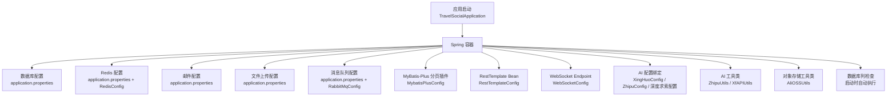
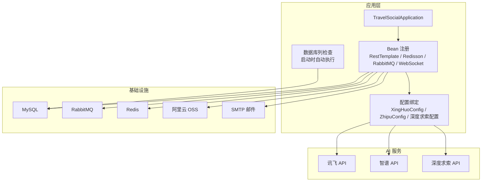
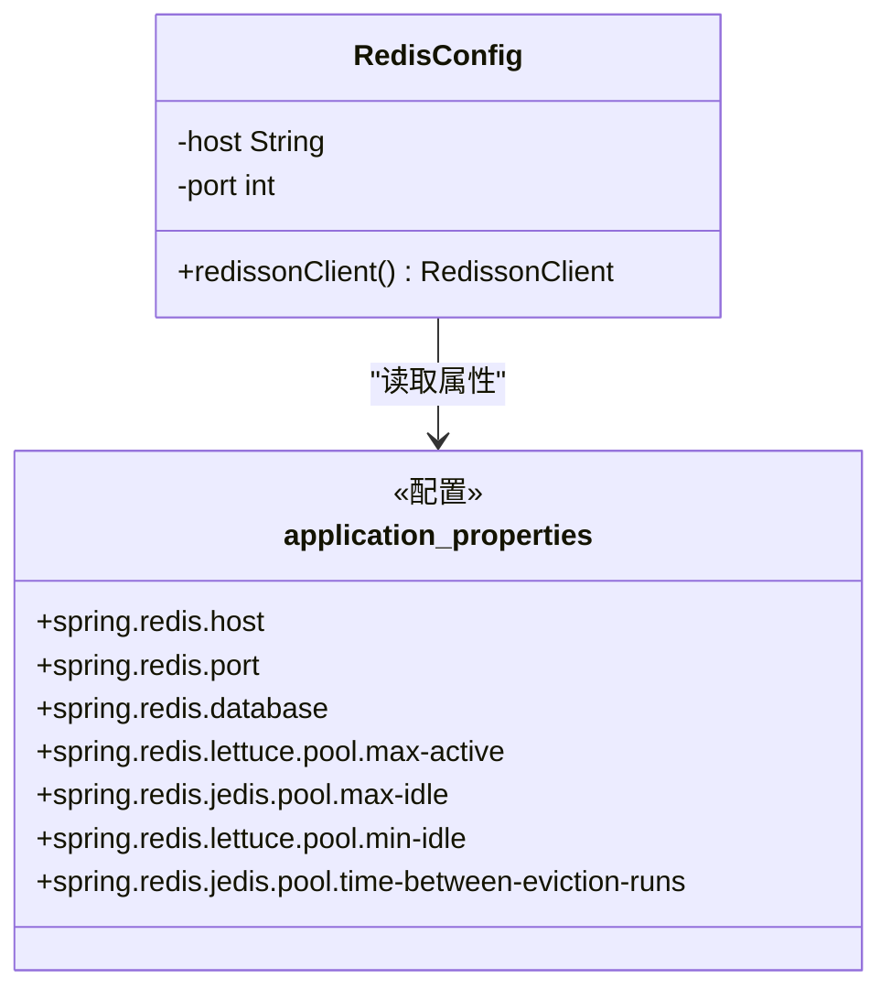
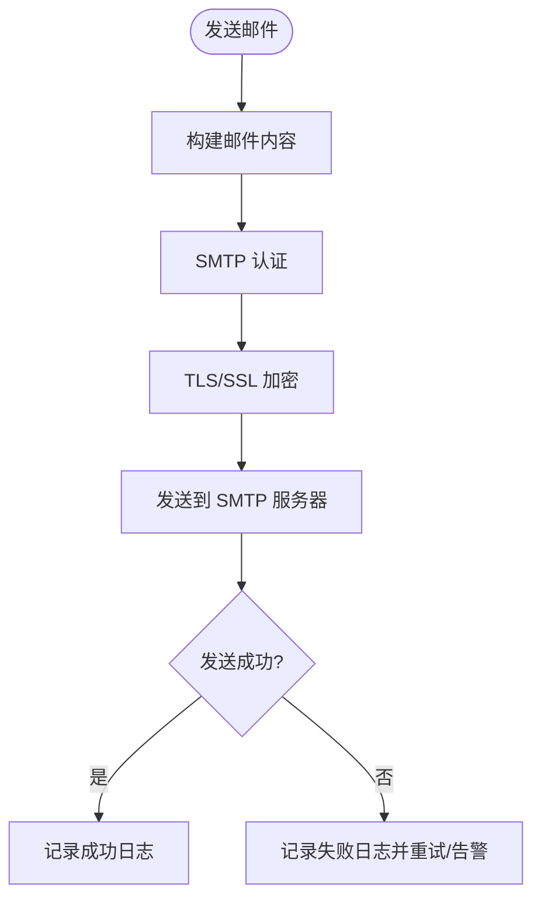
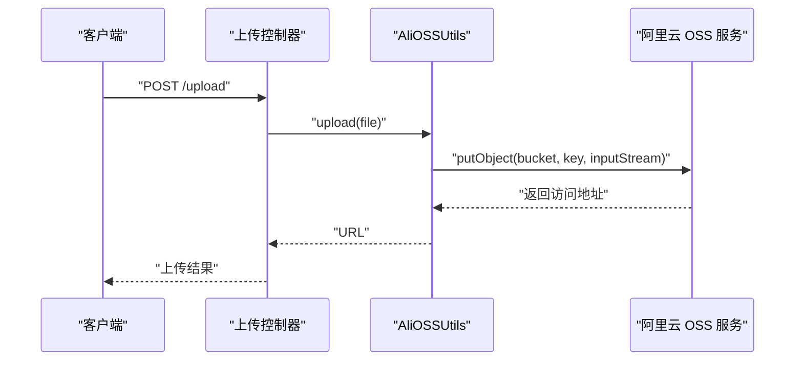
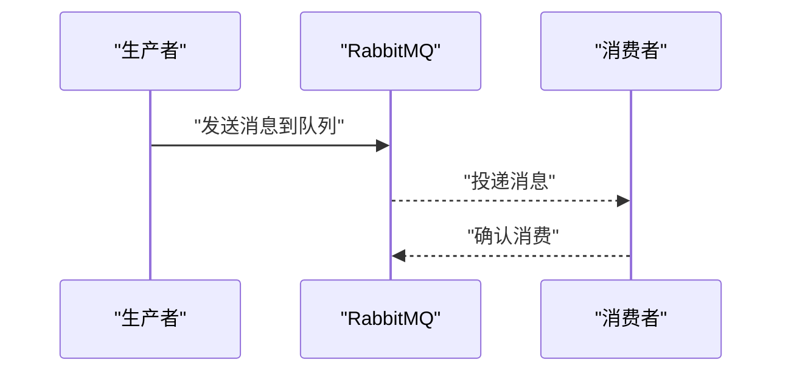
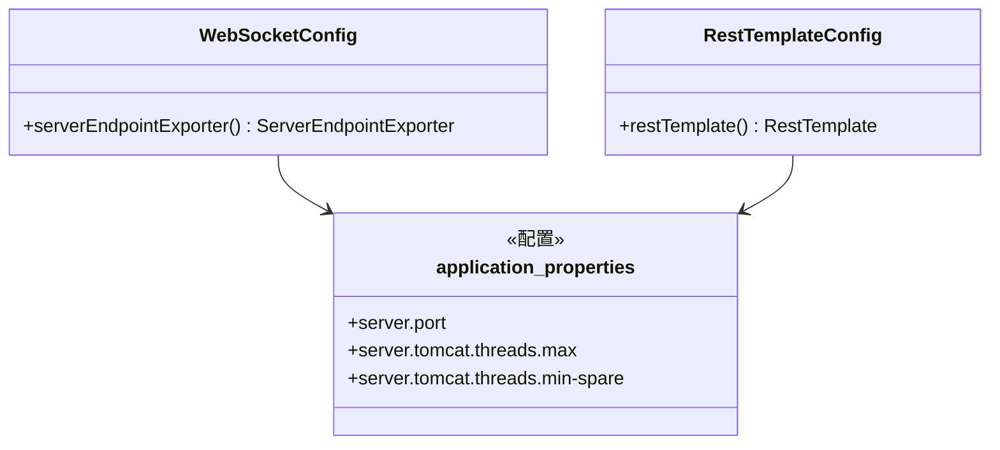
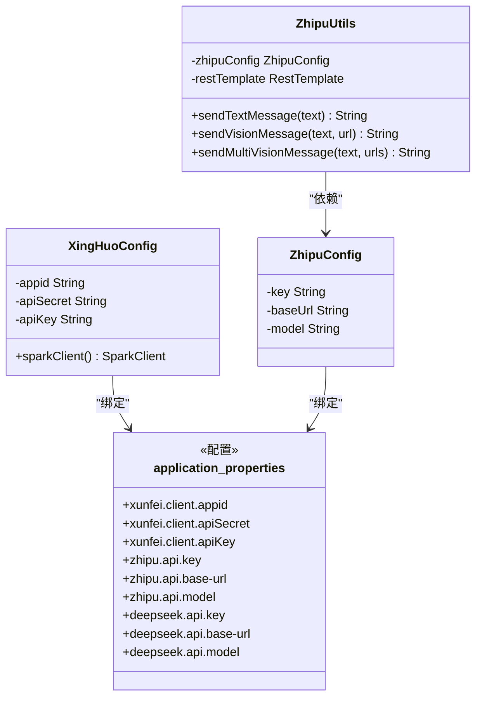
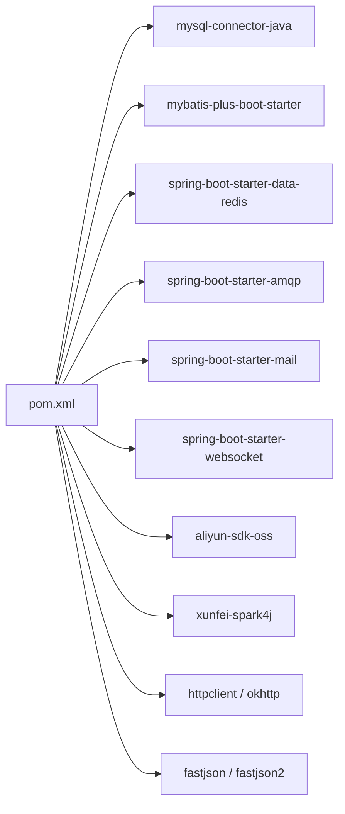

# 环境配置

<cite>
**本文引用的文件**
- [application.properties](file://springboot-travel-social/src/main/resources/application.properties)
- [RedisConfig.java](file://springboot-travel-social/src/main/java/com/cxx/config/RedisConfig.java)
- [RestTemplateConfig.java](file://springboot-travel-social/src/main/java/com/cxx/config/RestTemplateConfig.java)
- [RabbitMqConfig.java](file://springboot-travel-social/src/main/java/com/cxx/config/RabbitMqConfig.java)
- [MybatisPlusConfig.java](file://springboot-travel-social/src/main/java/com/cxx/config/MybatisPlusConfig.java)
- [WebSocketConfig.java](file://springboot-travel-social/src/main/java/com/cxx/config/WebSocketConfig.java)
- [XingHuoConfig.java](file://springboot-travel-social/src/main/java/com/cxx/config/XingHuoConfig.java)
- [ZhipuConfig.java](file://springboot-travel-social/src/main/java/com/cxx/config/ZhipuConfig.java)
- [ZhipuUtils.java](file://springboot-travel-social/src/main/java/com/cxx/utils/ZhipuUtils.java)
- [XfAPIUtils.java](file://springboot-travel-social/src/main/java/com/cxx/utils/XfAPIUtils.java)
- [AliOSSUtils.java](file://springboot-travel-social/src/main/java/com/cxx/utils/AliOSSUtils.java)
- [TravelSocialApplication.java](file://springboot-travel-social/src/main/java/com/cxx/TravelSocialApplication.java)
- [pom.xml](file://springboot-travel-social/pom.xml)
</cite>

## 更新摘要
**所做更改**
- 更新了数据库连接配置参数，包括驱动类名、URL、用户名和密码
- 新增了系统配置项，包括路径匹配策略、日期格式、时区设置
- 调整了邮件服务配置，优化了SSL/TLS设置
- 更新了Redis连接池配置参数
- 新增了深度求索AI服务配置
- 更新了应用启动时的数据库列检查逻辑

## 目录
1. [简介](#简介)
2. [项目结构与配置入口](#项目结构与配置入口)
3. [核心配置项详解](#核心配置项详解)
4. [架构总览](#架构总览)
5. [组件与配置深度分析](#组件与配置深度分析)
6. [依赖关系分析](#依赖关系分析)
7. [性能与稳定性建议](#性能与稳定性建议)
8. [环境切换与最佳实践](#环境切换与最佳实践)
9. [第三方服务接入配置](#第三方服务接入配置)
10. [配置验证与故障排查](#配置验证与故障排查)
11. [结论](#结论)

## 简介
本指南围绕 Spring Boot 后端工程的环境配置展开，系统梳理 application.properties 中的关键配置项，涵盖数据库连接、Redis 缓存、邮件服务、文件存储、消息队列、AI 大模型服务（讯飞、智谱、深度求索）、以及第三方对象存储（阿里云 OSS）。同时提供不同环境（开发、测试、生产）的配置差异与切换方法，并总结环境变量与敏感信息保护、配置文件管理、动态配置更新等最佳实践，最后给出配置验证与故障排查方法。

## 项目结构与配置入口
- 配置文件入口为 application.properties，集中定义了数据库、Redis、邮件、文件上传大小、Tomcat 线程池、日志、第三方 AI 与大模型接口等基础配置。
- Spring Boot 自动装配与手动配置结合：通过 @ConfigurationProperties 绑定前缀配置到 Java 类，再由 @Bean 注入到容器；部分组件通过 @Configuration 类显式声明。
- 应用启动入口 TravelSocialApplication 在启动时初始化 WebSocket 上下文并执行数据库列检查逻辑，自动添加支付状态字段。



**图表来源**
- [application.properties:1-64](file://springboot-travel-social/src/main/resources/application.properties#L1-L64)
- [RedisConfig.java:17-32](file://springboot-travel-social/src/main/java/com/cxx/config/RedisConfig.java#L17-L32)
- [RabbitMqConfig.java:16-31](file://springboot-travel-social/src/main/java/com/cxx/config/RabbitMqConfig.java#L16-L31)
- [MybatisPlusConfig.java:10-19](file://springboot-travel-social/src/main/java/com/cxx/config/MybatisPlusConfig.java#L10-L19)
- [RestTemplateConfig.java:10-21](file://springboot-travel-social/src/main/java/com/cxx/config/RestTemplateConfig.java#L10-L21)
- [WebSocketConfig.java:7-13](file://springboot-travel-social/src/main/java/com/cxx/config/WebSocketConfig.java#L7-L13)
- [XingHuoConfig.java:16-31](file://springboot-travel-social/src/main/java/com/cxx/config/XingHuoConfig.java#L16-L31)
- [ZhipuConfig.java:12-19](file://springboot-travel-social/src/main/java/com/cxx/config/ZhipuConfig.java#L12-L19)
- [ZhipuUtils.java:24-34](file://springboot-travel-social/src/main/java/com/cxx/utils/ZhipuUtils.java#L24-L34)
- [XfAPIUtils.java:25-30](file://springboot-travel-social/src/main/java/com/cxx/utils/XfAPIUtils.java#L25-L30)
- [AliOSSUtils.java:11-17](file://springboot-travel-social/src/main/java/com/cxx/utils/AliOSSUtils.java#L11-L17)
- [TravelSocialApplication.java:16-25](file://springboot-travel-social/src/main/java/com/cxx/TravelSocialApplication.java#L16-L25)

**章节来源**
- [application.properties:1-64](file://springboot-travel-social/src/main/resources/application.properties#L1-L64)
- [TravelSocialApplication.java:16-25](file://springboot-travel-social/src/main/java/com/cxx/TravelSocialApplication.java#L16-L25)

## 核心配置项详解
以下为 application.properties 中的关键配置项及其作用范围与注意事项：

- **数据库连接**
  - 驱动类名：com.mysql.cj.jdbc.Driver
  - JDBC URL：jdbc:mysql://127.0.0.1:3306/travel_1?serverTimezone=GMT%2B8&characterEncoding=utf8&useUnicode=true
  - 用户名：root
  - 密码：root
  - 用途：MyBatis-Plus 连接 MySQL 数据库
  - 注意：生产环境建议使用只读账号、最小权限原则；避免明文密码

- **系统配置**
  - 路径匹配策略：ant_path_matcher
  - 日期格式：yyyy-MM-dd HH:mm:ss
  - 时区：GMT+8
  - 用途：统一系统时间处理和路径匹配规则

- **MyBatis-Plus**
  - 日志实现：org.apache.ibatis.logging.stdout.StdOutImpl
  - Mapper XML 扫描路径：classpath*:com/cxx/mapper/xml/*.xml
  - 逻辑删除字段：deleted，值：1，未删除值：0
  - 用途：ORM 映射、分页插件、逻辑删除

- **文件上传**
  - 单文件最大大小：100MB
  - 请求总大小：100MB
  - 用途：限制上传体积，防止 OOM

- **Tomcat 线程池**
  - 最大线程数：1000
  - 最小空闲线程：30
  - 用途：控制高并发处理能力

- **Redis**
  - 主机：127.0.0.1
  - 端口：6379
  - 数据库索引：0
  - 连接池参数：最大活跃连接10，最大空闲连接10，最小空闲连接1，空闲连接回收间隔10秒
  - 用途：缓存、分布式锁（Redisson）

- **RabbitMQ**
  - 主机：101.37.208.63
  - 端口：5672
  - 虚拟主机：/
  - 用户名：admin
  - 密码：admin
  - 用途：异步消息队列

- **邮件服务（SMTP）**
  - SMTP 主机：smtp.qq.com
  - 端口：465
  - 用户名：3331480881@qq.com
  - 密码：lltccljxdunedbab
  - SSL/TLS：启用
  - 用途：发送邮件验证码、通知

- **AI 服务配置**
  - 讯飞客户端：appid=d28c77d4，apiSecret=Zjc5OTI1ZmIzYzM1OWYwMmU2ZDRjODEy，apiKey=cbe60665ae47e3c6060dc8f54b5ef003
  - 深度求索 API：key=sk-03162b8b45924e71a986c3a797c3573b，base-url=https://api.deepseek.com，model=deepseek-chat
  - 智谱 API：key=58a1534ba40647ea804d9eefef774226.dYpMxgzW1MsT9YaZ，base-url=https://open.bigmodel.cn/api/paas/v4，model=glm-4.6v
  - 用途：文本/图像理解、对话生成

**章节来源**
- [application.properties:1-64](file://springboot-travel-social/src/main/resources/application.properties#L1-L64)

## 架构总览
下图展示应用启动后，各配置模块如何协同工作，支撑业务功能与第三方集成。



**图表来源**
- [TravelSocialApplication.java:16-25](file://springboot-travel-social/src/main/java/com/cxx/TravelSocialApplication.java#L16-L25)
- [XingHuoConfig.java:16-31](file://springboot-travel-social/src/main/java/com/cxx/config/XingHuoConfig.java#L16-L31)
- [ZhipuConfig.java:12-19](file://springboot-travel-social/src/main/java/com/cxx/config/ZhipuConfig.java#L12-L19)
- [RestTemplateConfig.java:10-21](file://springboot-travel-social/src/main/java/com/cxx/config/RestTemplateConfig.java#L10-L21)
- [RedisConfig.java:17-32](file://springboot-travel-social/src/main/java/com/cxx/config/RedisConfig.java#L17-L32)
- [RabbitMqConfig.java:16-31](file://springboot-travel-social/src/main/java/com/cxx/config/RabbitMqConfig.java#L16-L31)
- [WebSocketConfig.java:7-13](file://springboot-travel-social/src/main/java/com/cxx/config/WebSocketConfig.java#L7-L13)
- [application.properties:1-64](file://springboot-travel-social/src/main/resources/application.properties#L1-L64)

## 组件与配置深度分析

### 数据库与 MyBatis-Plus 配置
- application.properties 中设置驱动、URL、用户名、密码、逻辑删除字段与值、Mapper XML 扫描路径。
- MybatisPlusConfig 注册分页插件，限定数据库类型为 MySQL。
- **新增**：应用启动时自动检查并添加 taxi_order 表的 pay_status 字段，支持支付状态管理。

```mermaid
classDiagram
class MybatisPlusConfig {
+mybatisPlusInterceptor() MybatisPlusInterceptor
}
class TravelSocialApplication {
+run(args) void
-checkAndAddPayStatusColumn() void
}
MybatisPlusConfig --> "使用" DB["MySQL"]
TravelSocialApplication --> DB
```

**图表来源**
- [MybatisPlusConfig.java:10-19](file://springboot-travel-social/src/main/java/com/cxx/config/MybatisPlusConfig.java#L10-L19)
- [TravelSocialApplication.java:27-50](file://springboot-travel-social/src/main/java/com/cxx/TravelSocialApplication.java#L27-L50)

**章节来源**
- [application.properties:1-22](file://springboot-travel-social/src/main/resources/application.properties#L1-L22)
- [MybatisPlusConfig.java:10-19](file://springboot-travel-social/src/main/java/com/cxx/config/MybatisPlusConfig.java#L10-L19)
- [TravelSocialApplication.java:27-50](file://springboot-travel-social/src/main/java/com/cxx/TravelSocialApplication.java#L27-L50)

### Redis 缓存与连接池
- application.properties 提供 host、port、database、连接池参数。
- RedisConfig 通过 @Value 读取配置并创建 RedissonClient，用于分布式锁等高级特性。
- **更新**：连接池参数优化，最大活跃连接10，最大空闲连接10，最小空闲连接1，空闲连接回收间隔10秒。



**图表来源**
- [RedisConfig.java:17-32](file://springboot-travel-social/src/main/java/com/cxx/config/RedisConfig.java#L17-L32)
- [application.properties:23-29](file://springboot-travel-social/src/main/resources/application.properties#L23-L29)

**章节来源**
- [application.properties:23-29](file://springboot-travel-social/src/main/resources/application.properties#L23-L29)
- [RedisConfig.java:17-32](file://springboot-travel-social/src/main/java/com/cxx/config/RedisConfig.java#L17-L32)

### 邮件服务（SMTP）
- application.properties 提供 SMTP 主机、端口、认证、SSL/TLS、默认编码等。
- **优化**：SSL 端口设置为465，启用 STARTTLS 和 SSL 加密，配置 SocketFactory。



**图表来源**
- [application.properties:31-42](file://springboot-travel-social/src/main/resources/application.properties#L31-L42)

**章节来源**
- [application.properties:31-42](file://springboot-travel-social/src/main/resources/application.properties#L31-L42)

### 文件上传与存储
- application.properties 设置单文件与请求总大小上限为100MB。
- 阿里云 OSS 工具类内置 endpoint、AK/SK、Bucket，支持文件上传并返回访问 URL。
- **注意**：OSS 工具类中硬编码了测试凭据，生产环境需替换为环境变量或配置中心。



**图表来源**
- [application.properties:15-15](file://springboot-travel-social/src/main/resources/application.properties#L15-L15)
- [AliOSSUtils.java:11-33](file://springboot-travel-social/src/main/java/com/cxx/utils/AliOSSUtils.java#L11-L33)

**章节来源**
- [application.properties:15-15](file://springboot-travel-social/src/main/resources/application.properties#L15-L15)
- [AliOSSUtils.java:11-33](file://springboot-travel-social/src/main/java/com/cxx/utils/AliOSSUtils.java#L11-L33)

### 消息队列（RabbitMQ）
- application.properties 提供连接参数。
- RabbitMqConfig 声明多个持久化队列，用于异步解耦。
- **更新**：RabbitMQ 连接地址改为公网IP 101.37.208.63，便于远程访问。



**图表来源**
- [application.properties:8-12](file://springboot-travel-social/src/main/resources/application.properties#L8-L12)
- [RabbitMqConfig.java:16-31](file://springboot-travel-social/src/main/java/com/cxx/config/RabbitMqConfig.java#L16-L31)

**章节来源**
- [application.properties:8-12](file://springboot-travel-social/src/main/resources/application.properties#L8-L12)
- [RabbitMqConfig.java:16-31](file://springboot-travel-social/src/main/java/com/cxx/config/RabbitMqConfig.java#L16-L31)

### WebSocket 与 RestTemplate
- WebSocketConfig 注册 ServerEndpointExporter，启用标准注解式端点。
- RestTemplateConfig 注册 RestTemplate Bean，供 HTTP 调用使用。
- **更新**：Tomcat 线程池配置优化，最大线程数1000，最小空闲线程30。



**图表来源**
- [WebSocketConfig.java:7-13](file://springboot-travel-social/src/main/java/com/cxx/config/WebSocketConfig.java#L7-L13)
- [RestTemplateConfig.java:10-21](file://springboot-travel-social/src/main/java/com/cxx/config/RestTemplateConfig.java#L10-L21)
- [application.properties:19-46](file://springboot-travel-social/src/main/resources/application.properties#L19-L46)

**章节来源**
- [WebSocketConfig.java:7-13](file://springboot-travel-social/src/main/java/com/cxx/config/WebSocketConfig.java#L7-L13)
- [RestTemplateConfig.java:10-21](file://springboot-travel-social/src/main/java/com/cxx/config/RestTemplateConfig.java#L10-L21)
- [application.properties:19-46](file://springboot-travel-social/src/main/resources/application.properties#L19-L46)

### AI 与大模型服务配置
- **讯飞（Xunfei）**：通过 XingHuoConfig 绑定 application.properties 中以 xunfei.client.* 开头的属性，生成 SparkClient。
- **智谱（Zhipu）**：通过 ZhipuConfig 绑定 zhipu.api.* 属性，ZhipuUtils 使用 RestTemplate 调用智谱 API。
- **深度求索（DeepSeek）**：新增 deepseek.api.* 配置项，包括 API Key、Base URL、Model，当前在代码中未见直接使用，可按需扩展。
- **建议**：为 AI 接口配置超时、重试、熔断与限流；对敏感参数使用环境变量或配置中心。



**图表来源**
- [XingHuoConfig.java:16-31](file://springboot-travel-social/src/main/java/com/cxx/config/XingHuoConfig.java#L16-L31)
- [ZhipuConfig.java:12-19](file://springboot-travel-social/src/main/java/com/cxx/config/ZhipuConfig.java#L12-L19)
- [ZhipuUtils.java:24-34](file://springboot-travel-social/src/main/java/com/cxx/utils/ZhipuUtils.java#L24-L34)
- [application.properties:46-58](file://springboot-travel-social/src/main/resources/application.properties#L46-L58)

**章节来源**
- [XingHuoConfig.java:16-31](file://springboot-travel-social/src/main/java/com/cxx/config/XingHuoConfig.java#L16-L31)
- [ZhipuConfig.java:12-19](file://springboot-travel-social/src/main/java/com/cxx/config/ZhipuConfig.java#L12-L19)
- [ZhipuUtils.java:24-34](file://springboot-travel-social/src/main/java/com/cxx/utils/ZhipuUtils.java#L24-L34)
- [application.properties:46-58](file://springboot-travel-social/src/main/resources/application.properties#L46-L58)

## 依赖关系分析
- Maven 依赖中引入了 MySQL 驱动、MyBatis-Plus、Redis、AMQP、邮件、WebSocket、OkHttp、Fastjson、HTTP 客户端、讯飞 SDK 等。
- 资源打包包含 Java 源码与 XML Mapper 文件，确保 MyBatis-Plus 正常加载映射。



**图表来源**
- [pom.xml:44-176](file://springboot-travel-social/pom.xml#L44-L176)

**章节来源**
- [pom.xml:44-176](file://springboot-travel-social/pom.xml#L44-L176)

## 性能与稳定性建议
- **数据库**
  - 连接池参数与 SQL 慢查询监控；读写分离与只读副本。
  - **新增**：根据实际业务量调整数据库连接参数，监控 pay_status 字段的使用情况。
- **缓存**
  - 合理设置过期时间与淘汰策略；热点键拆分与多级缓存。
  - **优化**：根据连接池参数调整缓存策略，避免资源浪费。
- **消息队列**
  - 队列分区与消费者并行度；死信与重试策略。
  - **更新**：公网 RabbitMQ 地址便于监控和管理。
- **文件存储**
  - CDN 加速与缩略图生成；分片上传与断点续传。
  - **注意**：生产环境务必替换 AliOSSUtils 中的硬编码凭据。
- **AI 接口**
  - 超时与重试；限流与熔断；异步调用与结果缓存。
  - **新增**：深度求索 API 配置可用于扩展 AI 功能。
- **线程与端口**
  - 根据并发峰值调整 Tomcat 线程池；端口复用与健康检查。
  - **优化**：1000个最大线程数适合高并发场景。

## 环境切换与最佳实践
- **环境文件组织**
  - 开发：application-dev.properties
  - 测试：application-test.properties
  - 生产：application-prod.properties
- **切换方式**
  - JVM 参数：-Dspring.profiles.active=dev/test/prod
  - 环境变量：SPRING_PROFILES_ACTIVE=dev/test/prod
  - Docker：通过 docker run -e SPRING_PROFILES_ACTIVE=prod 启动
- **敏感信息保护**
  - 将数据库密码、Redis 密码、邮件授权码、AI API Key、OSS AK/SK 放入环境变量或配置中心（如 Spring Cloud Config、Nacos），不在仓库中提交。
  - **特别注意**：AliOSSUtils 中的凭据仅为测试使用，生产环境必须替换。
- **动态配置更新**
  - 使用 Spring Cloud Bus 或 Actuator 的 refresh 端点触发刷新；对不支持热刷新的配置采用滚动重启。
- **配置文件管理**
  - 使用 Git Submodules 或独立配置仓库；对不同环境的差异使用模板与合并策略。
- **验证清单**
  - 启动日志中确认各 Bean 初始化成功；数据库连通性测试；Redis 连接与基本命令；邮件发送测试；AI 接口鉴权测试；OSS 上传下载验证。
  - **新增**：启动时数据库列检查功能验证。

## 第三方服务接入配置
- **阿里云 OSS**
  - endpoint：https://oss-cn-hangzhou.aliyuncs.com
  - accessKeyId/accessKeySecret：LTAI5t6yz7HxWHtpZA8MMKzc/tdtEqq3RPjMRcRLAiw4W43R2LjW6Vw
  - bucketName：wangzhenghai-oss
  - **重要**：以上为测试凭据，生产环境必须替换为真实凭据和 Bucket 配置。
- **讯飞 API（Spark4j）**
  - appid：d28c77d4
  - apiSecret：Zjc5OTI1ZmIzYzM1OWYwMmU2ZDRjODEy
  - apiKey：cbe60665ae47e3c6060dc8f54b5ef003
- **智谱 API**
  - key：58a1534ba40647ea804d9eefef774226.dYpMxgzW1MsT9YaZ
  - base-url：https://open.bigmodel.cn/api/paas/v4
  - model：glm-4.6v
- **深度求索 API**
  - key：sk-03162b8b45924e71a986c3a797c3573b
  - base-url：https://api.deepseek.com
  - model：deepseek-chat

**章节来源**
- [AliOSSUtils.java:11-33](file://springboot-travel-social/src/main/java/com/cxx/utils/AliOSSUtils.java#L11-L33)
- [XfAPIUtils.java:25-30](file://springboot-travel-social/src/main/java/com/cxx/utils/XfAPIUtils.java#L25-L30)
- [ZhipuUtils.java:24-34](file://springboot-travel-social/src/main/java/com/cxx/utils/ZhipuUtils.java#L24-L34)
- [application.properties:46-58](file://springboot-travel-social/src/main/resources/application.properties#L46-L58)

## 配置验证与故障排查
- **启动阶段**
  - 查看应用启动日志，确认数据库、Redis、RabbitMQ、邮件、WebSocket、AI 配置是否加载成功。
  - **新增**：检查 pay_status 字段添加日志输出。
- **数据库**
  - 执行简单查询验证连通性；检查逻辑删除字段是否存在。
  - **验证**：确认 taxi_order 表包含 pay_status 字段。
- **缓存**
  - 执行 ping、set/get 基本命令；检查连接池状态。
  - **监控**：关注连接池参数的实际使用情况。
- **邮件**
  - 发送一封测试邮件，核对 SMTP 参数与网络策略。
  - **优化**：验证465端口和SSL配置。
- **文件存储**
  - 上传小文件并校验 URL 可访问性；检查权限与防盗链。
  - **安全**：确保生产环境使用正确的OSS凭据。
- **消息队列**
  - 发送一条测试消息，观察消费者是否正常消费。
  - **网络**：验证公网RabbitMQ地址可达性。
- **AI 接口**
  - 使用最小化输入调用接口，检查鉴权与返回格式；记录错误码与耗时。
  - **新增**：测试深度求索 API 配置。
- **常见问题定位**
  - 端口冲突：检查 server.port 与占用进程。
  - 字符集与时区：统一 server.tomcat.uri-encoding 与 jackson 时间区域。
  - 超时与重试：为 RestTemplate 与 HTTP 客户端配置合理的超时与重试策略。
  - 日志级别：适当提高关键组件的日志级别辅助排查。

**章节来源**
- [TravelSocialApplication.java:27-50](file://springboot-travel-social/src/main/java/com/cxx/TravelSocialApplication.java#L27-L50)
- [application.properties:6-6](file://springboot-travel-social/src/main/resources/application.properties#L6-L6)

## 结论
本指南从配置项、组件关系、依赖与最佳实践等维度，系统阐述了该旅游社交小程序后端的环境配置要点。**最新更新**包括数据库连接参数优化、系统配置增强、邮件服务SSL配置改进、Redis连接池参数调整、新增深度求索AI服务配置，以及应用启动时的数据库列检查功能。建议在开发、测试、生产三套环境中分别维护独立的配置文件，结合环境变量与配置中心实现安全可控的动态配置管理，并建立完善的验证与故障排查流程，以保障系统的稳定性与可运维性。