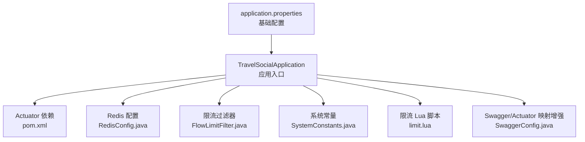
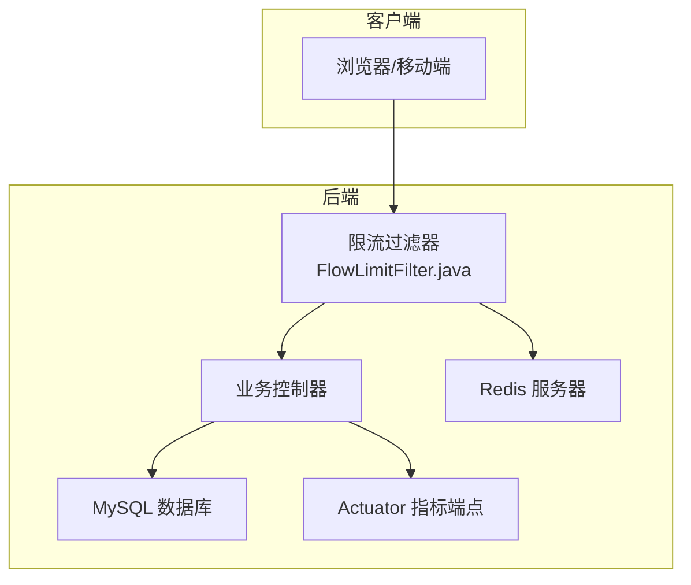
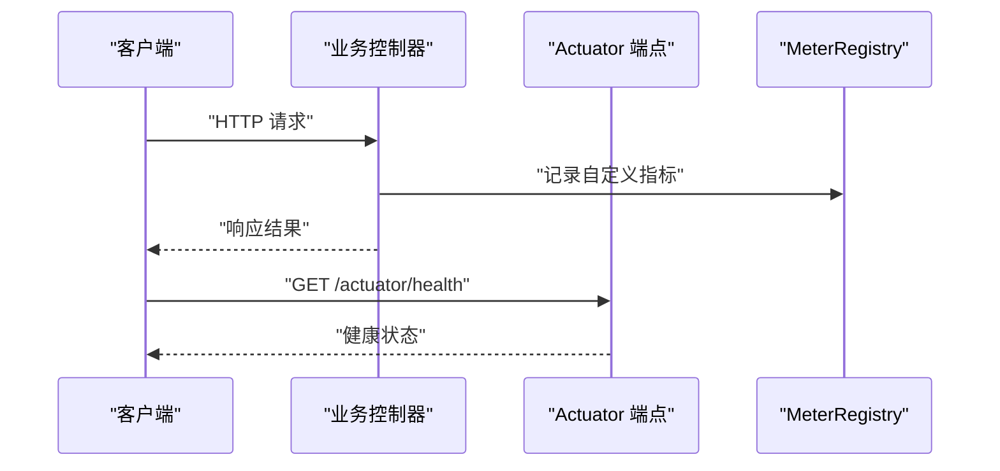
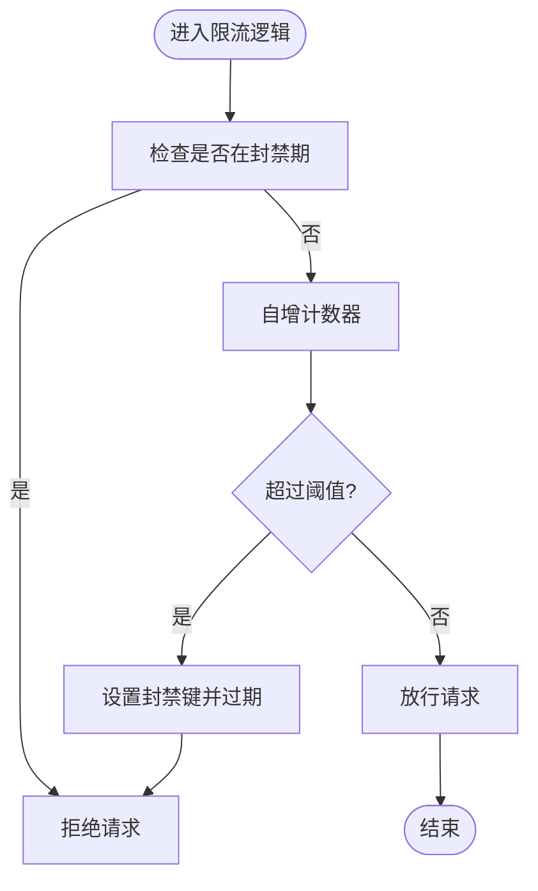
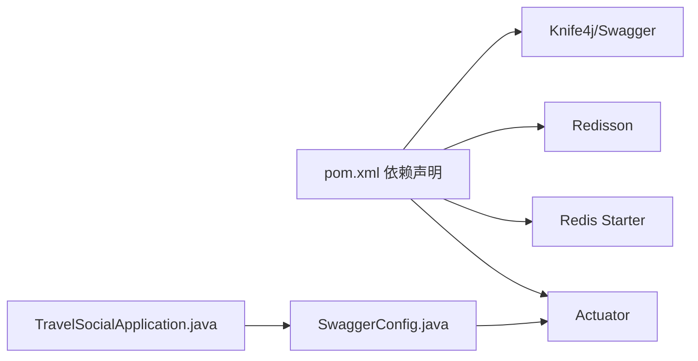

# 监控告警

<cite>
**本文引用的文件**
- [application.properties](file://springboot-travel-social/src/main/resources/application.properties)
- [pom.xml](file://springboot-travel-social/pom.xml)
- [TravelSocialApplication.java](file://springboot-travel-social/src/main/java/com/cxx/TravelSocialApplication.java)
- [RedisConfig.java](file://springboot-travel-social/src/main/java/com/cxx/config/RedisConfig.java)
- [FlowLimitFilter.java](file://springboot-travel-social/src/main/java/com/cxx/filter/FlowLimitFilter.java)
- [SystemConstants.java](file://springboot-travel-social/src/main/java/com/cxx/utils/SystemConstants.java)
- [limit.lua](file://springboot-travel-social/src/main/java/com/cxx/lua/limit.lua)
- [SwaggerConfig.java](file://springboot-travel-social/src/main/java/com/cxx/config/SwaggerConfig.java)
- [spring-boot-dependencies-2.6.13.pom](file://springboot-travel-social/D_mvn(repository)repository/org/springframework/boot/spring-boot-dependencies/2.6.13/spring-boot-dependencies-2.6.13.pom)
</cite>

## 目录
1. [简介](#简介)
2. [项目结构](#项目结构)
3. [核心组件](#核心组件)
4. [架构总览](#架构总览)
5. [详细组件分析](#详细组件分析)
6. [依赖关系分析](#依赖关系分析)
7. [性能考量](#性能考量)
8. [故障排查指南](#故障排查指南)
9. [结论](#结论)
10. [附录](#附录)

## 简介
本指南面向“旅游攻略社交小程序”后端（Spring Boot）的监控告警体系搭建，围绕以下目标展开：
- 应用性能监控：基于 Spring Boot Actuator 的配置与使用、自定义指标采集、健康检查端点。
- 数据库监控：MySQL 性能监控、慢查询分析、连接池监控。
- 缓存监控：Redis 性能指标、内存使用、命中率统计。
- 日志监控：ELK Stack 集成思路、日志聚合与错误追踪。
- 流量监控与限流：基于 Redis 的网关/服务限流、熔断降级建议。
- 告警规则与通知渠道：规则设计与通知通道配置建议。

本指南在不直接粘贴代码的前提下，通过“章节来源”与“图表来源”定位到仓库中的具体文件与行号，便于读者对照源码进行落地实施。

## 项目结构
后端采用 Spring Boot 2.6.13，核心模块与监控相关的关键位置如下：
- 配置层：application.properties 提供数据库、Redis、邮件、Tomcat 线程池等基础配置。
- 启动层：TravelSocialApplication 负责应用启动与数据库列初始化。
- 监控与限流：Actuator 依赖、Redis 限流过滤器、Redisson 客户端配置。
- 文档与可观测性：Knife4j/Swagger 配置，Actuator 端点映射增强。

**图表来源**
- [TravelSocialApplication.java:16-51](file://springboot-travel-social/src/main/java/com/cxx/TravelSocialApplication.java#L16-L51)
- [pom.xml:38-43](file://springboot-travel-social/pom.xml#L38-L43)
- [RedisConfig.java:17-32](file://springboot-travel-social/src/main/java/com/cxx/config/RedisConfig.java#L17-L32)
- [FlowLimitFilter.java:24-70](file://springboot-travel-social/src/main/java/com/cxx/filter/FlowLimitFilter.java#L24-L70)
- [SystemConstants.java:3-24](file://springboot-travel-social/src/main/java/com/cxx/utils/SystemConstants.java#L3-L24)
- [limit.lua:1-15](file://springboot-travel-social/src/main/java/com/cxx/lua/limit.lua#L1-L15)
- [SwaggerConfig.java:58-78](file://springboot-travel-social/src/main/java/com/cxx/config/SwaggerConfig.java#L58-L78)
- [application.properties:1-61](file://springboot-travel-social/src/main/resources/application.properties#L1-L61)

**章节来源**
- [application.properties:1-61](file://springboot-travel-social/src/main/resources/application.properties#L1-L61)
- [pom.xml:16-182](file://springboot-travel-social/pom.xml#L16-L182)
- [TravelSocialApplication.java:16-51](file://springboot-travel-social/src/main/java/com/cxx/TravelSocialApplication.java#L16-L51)
- [SwaggerConfig.java:58-78](file://springboot-travel-social/src/main/java/com/cxx/config/SwaggerConfig.java#L58-L78)

## 核心组件
- Spring Boot Actuator：用于暴露运行时指标与健康检查端点，结合 Micrometer 实现自定义指标。
- Redis 限流：基于 Redis 的滑动窗口限流，支持封禁与计数器键管理。
- Redisson 客户端：提供高级 Redis 能力（如分布式对象、限流工具等）。
- Swagger/Knife4j：OpenAPI 文档与 Actuator 端点映射增强，便于运维查看与调试。

**章节来源**
- [pom.xml:38-43](file://springboot-travel-social/pom.xml#L38-L43)
- [RedisConfig.java:17-32](file://springboot-travel-social/src/main/java/com/cxx/config/RedisConfig.java#L17-L32)
- [FlowLimitFilter.java:24-70](file://springboot-travel-social/src/main/java/com/cxx/filter/FlowLimitFilter.java#L24-L70)
- [SystemConstants.java:3-24](file://springboot-travel-social/src/main/java/com/cxx/utils/SystemConstants.java#L3-L24)
- [SwaggerConfig.java:58-78](file://springboot-travel-social/src/main/java/com/cxx/config/SwaggerConfig.java#L58-L78)

## 架构总览
下图展示监控与限流在系统中的位置与交互：

**图表来源**
- [FlowLimitFilter.java:24-70](file://springboot-travel-social/src/main/java/com/cxx/filter/FlowLimitFilter.java#L24-L70)
- [RedisConfig.java:17-32](file://springboot-travel-social/src/main/java/com/cxx/config/RedisConfig.java#L17-L32)
- [TravelSocialApplication.java:16-51](file://springboot-travel-social/src/main/java/com/cxx/TravelSocialApplication.java#L16-L51)

## 详细组件分析

### Spring Boot Actuator 配置与使用
- 依赖引入：pom 中包含 actuator 与 actuator-autoconfigure 依赖，确保端点可用。
- 端点映射增强：SwaggerConfig 对 Actuator 端点映射进行增强，便于通过 Knife4j/Swagger 访问。
- 自定义指标：可通过 MeterRegistry 注册计数器、计时器、分布摘要等，结合业务事件上报。
- 健康检查：利用 HealthIndicator 扩展数据库、Redis、外部服务健康度。

**图表来源**
- [pom.xml:38-43](file://springboot-travel-social/pom.xml#L38-L43)
- [SwaggerConfig.java:58-78](file://springboot-travel-social/src/main/java/com/cxx/config/SwaggerConfig.java#L58-L78)

**章节来源**
- [pom.xml:38-43](file://springboot-travel-social/pom.xml#L38-L43)
- [SwaggerConfig.java:58-78](file://springboot-travel-social/src/main/java/com/cxx/config/SwaggerConfig.java#L58-L78)

### 自定义指标采集
- 计数器：记录请求数、错误数、业务事件次数。
- 计时器：记录接口耗时、数据库查询耗时、缓存访问耗时。
- 分布摘要：记录响应大小、队列等待时间等长尾指标。
- 指标命名：遵循统一前缀与标签规范，便于聚合与告警。

[本节为通用实践说明，无需特定文件引用]

### 健康检查端点
- 使用 /actuator/health 查看应用整体健康状态。
- 可扩展数据库、Redis、消息队列、外部 API 的健康探测。
- 结合 /actuator/info 输出版本、构建信息，辅助排障。

**章节来源**
- [SwaggerConfig.java:58-78](file://springboot-travel-social/src/main/java/com/cxx/config/SwaggerConfig.java#L58-L78)

### 数据库监控方案（MySQL）
- 连接池监控：通过 Druid/Micrometer 监控连接池活跃连接、空闲连接、等待时间、超时次数。
- 慢查询分析：开启慢查询日志与执行计划分析；结合 APM 工具定位热点 SQL。
- 表与索引：定期检查表膨胀、索引使用率、回表次数。
- 连接参数：依据业务峰值调整最大连接数、空闲超时、事务隔离级别。

**章节来源**
- [application.properties:1-61](file://springboot-travel-social/src/main/resources/application.properties#L1-L61)

### 缓存监控策略（Redis）
- 连接与内存：监控连接数、内存使用、内存碎片率、LRU/LFU 淘汰率。
- 命中率：计算 key miss 次数与总访问次数，评估缓存效率。
- 命令统计：慢查询命令、阻塞命令分布，识别异常操作。
- 分布式能力：利用 Redisson 的限流、分布式锁、布隆过滤器等能力，配合监控指标优化策略。

**图表来源**
- [FlowLimitFilter.java:49-69](file://springboot-travel-social/src/main/java/com/cxx/filter/FlowLimitFilter.java#L49-L69)
- [SystemConstants.java:5-11](file://springboot-travel-social/src/main/java/com/cxx/utils/SystemConstants.java#L5-L11)

**章节来源**
- [RedisConfig.java:17-32](file://springboot-travel-social/src/main/java/com/cxx/config/RedisConfig.java#L17-L32)
- [FlowLimitFilter.java:24-70](file://springboot-travel-social/src/main/java/com/cxx/filter/FlowLimitFilter.java#L24-L70)
- [SystemConstants.java:3-24](file://springboot-travel-social/src/main/java/com/cxx/utils/SystemConstants.java#L3-L24)
- [limit.lua:1-15](file://springboot-travel-social/src/main/java/com/cxx/lua/limit.lua#L1-L15)

### 日志监控方案（ELK Stack）
- 日志采集：在应用侧输出结构化 JSON 日志，结合 Filebeat/Fluent Bit 收集。
- 存储与检索：Logstash/Beats -> Elasticsearch，Kibana 可视化。
- 错误追踪：以 trace_id/ span_id 关联请求链路，结合 Sleuth 或 OpenTelemetry。
- 告警：基于 Kibana Watcher 或 Alerting，对错误率、异常堆栈、响应时间异常触发告警。

**章节来源**
- [pom.xml:132-136](file://springboot-travel-social/pom.xml#L132-L136)

### 流量监控与限流策略
- 网关限流：在网关层（如 Spring Cloud Gateway）按 IP/用户/接口维度限流。
- 服务限流：在业务层使用 Redis 滑动窗口或令牌桶，结合 Lua 原子性控制。
- 熔断降级：当依赖服务不可用或延迟过高时，快速失败并返回降级响应。
- 配额与灰度：支持临时配额调整与灰度流量放行。

**章节来源**
- [FlowLimitFilter.java:24-70](file://springboot-travel-social/src/main/java/com/cxx/filter/FlowLimitFilter.java#L24-L70)
- [limit.lua:1-15](file://springboot-travel-social/src/main/java/com/cxx/lua/limit.lua#L1-L15)
- [SystemConstants.java:3-24](file://springboot-travel-social/src/main/java/com/cxx/utils/SystemConstants.java#L3-L24)

### 告警规则配置与通知渠道
- 规则设计：CPU 使用率、内存占用、GC 次数、线程池排队长度、数据库连接池等待、Redis 内存与命中率、接口 P95/P99、错误率、慢查询占比。
- 通知渠道：企业微信、钉钉、邮件、短信、Webhook。
- 告警收敛：同类型告警去重、静默窗口、分级升级。

[本节为通用实践说明，无需特定文件引用]

## 依赖关系分析
- Actuator 与 Micrometer：通过 Actuator 暴露端点，Micrometer 提供指标注册与导出能力。
- Redis 与 Redisson：Redisson 提供高级能力，StringRedisTemplate 用于限流键管理。
- Swagger/Knife4j：增强 Actuator 端点的可视化访问体验。

**图表来源**
- [pom.xml:38-43](file://springboot-travel-social/pom.xml#L38-L43)
- [pom.xml:71-77](file://springboot-travel-social/pom.xml#L71-L77)
- [pom.xml:24-26](file://springboot-travel-social/pom.xml#L24-L26)
- [SwaggerConfig.java:58-78](file://springboot-travel-social/src/main/java/com/cxx/config/SwaggerConfig.java#L58-L78)
- [TravelSocialApplication.java:16-25](file://springboot-travel-social/src/main/java/com/cxx/TravelSocialApplication.java#L16-L25)

**章节来源**
- [pom.xml:16-182](file://springboot-travel-social/pom.xml#L16-L182)
- [spring-boot-dependencies-2.6.13.pom:1536-1544](file://springboot-travel-social/D_mvn(repository)repository/org/springframework/boot/spring-boot-dependencies/2.6.13/spring-boot-dependencies-2.6.13.pom#L1536-L1544)

## 性能考量
- Tomcat 线程池：根据峰值并发调优 max threads 与 min spare，避免线程饥饿。
- Redis 连接池：合理设置最大连接、空闲、超时，避免连接抖动。
- SQL 优化：索引、分页、批量写入、读写分离。
- 缓存策略：热点数据预热、TTL 设计、多级缓存（本地+远端）。

**章节来源**
- [application.properties:44-46](file://springboot-travel-social/src/main/resources/application.properties#L44-L46)
- [application.properties:27-30](file://springboot-travel-social/src/main/resources/application.properties#L27-L30)

## 故障排查指南
- 启动阶段：确认数据库列初始化逻辑是否成功执行。
- 限流问题：核对封禁键与计数器键是否存在、过期时间是否正确。
- Redis 连接：检查主机、端口、密码配置与网络连通性。
- Actuator 端点：确认端点映射增强是否生效，Knife4j 是否可访问。

**章节来源**
- [TravelSocialApplication.java:27-50](file://springboot-travel-social/src/main/java/com/cxx/TravelSocialApplication.java#L27-L50)
- [FlowLimitFilter.java:49-69](file://springboot-travel-social/src/main/java/com/cxx/filter/FlowLimitFilter.java#L49-L69)
- [RedisConfig.java:19-31](file://springboot-travel-social/src/main/java/com/cxx/config/RedisConfig.java#L19-L31)
- [SwaggerConfig.java:58-78](file://springboot-travel-social/src/main/java/com/cxx/config/SwaggerConfig.java#L58-L78)

## 结论
通过引入 Actuator 与 Micrometer、完善 Redis 限流与监控、结合 ELK 的日志与错误追踪，以及基于规则的告警与通知，可以构建一套覆盖应用、数据库、缓存与流量的全链路监控告警体系。建议在生产环境逐步启用各项监控，并持续优化阈值与规则，提升系统稳定性与可运维性。

[本节为总结性内容，无需特定文件引用]

## 附录
- Actuator 端点访问路径：/actuator
- Swagger 文档访问路径：/doc.html（Knife4j）
- Redis 默认地址：application.properties 中 spring.redis.host/port
- 限流阈值与封禁时间：SystemConstants 中常量定义

**章节来源**
- [application.properties:23-29](file://springboot-travel-social/src/main/resources/application.properties#L23-L29)
- [SystemConstants.java:5-11](file://springboot-travel-social/src/main/java/com/cxx/utils/SystemConstants.java#L5-L11)