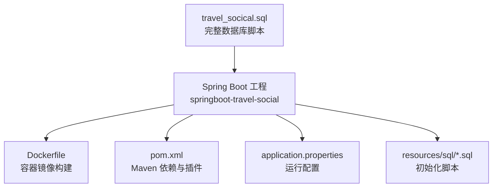
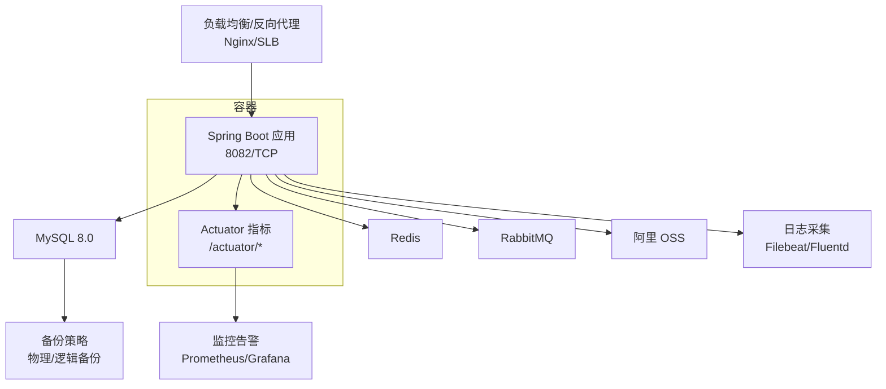
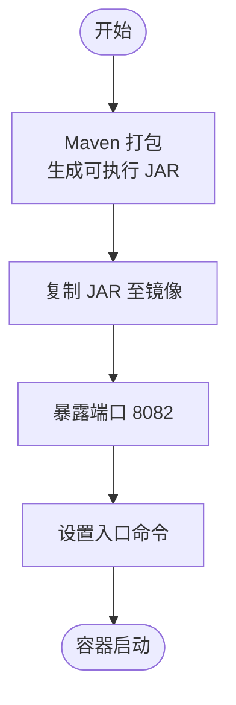
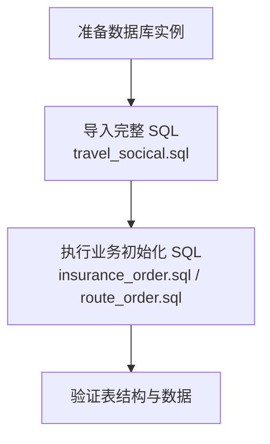
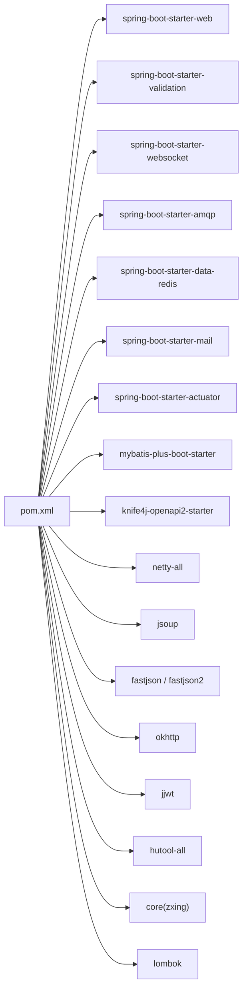

# 部署运维

<cite>
**本文引用的文件**
- [Dockerfile](file://springboot-travel-social/Dockerfile)
- [pom.xml](file://springboot-travel-social/pom.xml)
- [application.properties](file://springboot-travel-social/src/main/resources/application.properties)
- [README.md](file://springboot-travel-social/README.md)
- [insurance_order.sql](file://springboot-travel-social/src/main/resources/sql/insurance_order.sql)
- [route_order.sql](file://springboot-travel-social/src/main/resources/sql/route_order.sql)
- [travel_socical.sql](file://travel_socical.sql)
</cite>

## 目录
1. [简介](#简介)
2. [项目结构](#项目结构)
3. [核心组件](#核心组件)
4. [架构总览](#架构总览)
5. [详细组件分析](#详细组件分析)
6. [依赖分析](#依赖分析)
7. [性能考量](#性能考量)
8. [故障排查指南](#故障排查指南)
9. [结论](#结论)
10. [附录](#附录)

## 简介
本指南面向部署与运维工程师，围绕该旅游社交小程序的后端 Spring Boot 工程，提供从容器化打包、镜像构建、服务运行、数据库初始化到生产部署的全流程说明，并补充负载均衡、反向代理、SSL 证书、监控告警、日志管理、备份恢复与性能调优等运维要点。文档严格依据仓库中现有配置与脚本进行梳理，确保可执行性与可追溯性。

## 项目结构
后端工程位于 springboot-travel-social 目录，核心产物与配置如下：
- 构建与打包：Maven 工程，使用 Spring Boot 插件生成可执行 JAR
- 容器化：根目录提供 Dockerfile，基于 JDK 8 的 Alpine 镜像
- 运行配置：application.properties 中定义数据库、Redis、RabbitMQ、邮件、AI 接口等参数
- 数据脚本：resources/sql 下包含订单相关初始化 SQL，根目录提供完整数据库 SQL

图表来源
- [Dockerfile](file://springboot-travel-social/Dockerfile)
- [pom.xml](file://springboot-travel-social/pom.xml)
- [application.properties](file://springboot-travel-social/src/main/resources/application.properties)
- [insurance_order.sql](file://springboot-travel-social/src/main/resources/sql/insurance_order.sql)
- [route_order.sql](file://springboot-travel-social/src/main/resources/sql/route_order.sql)
- [travel_socical.sql](file://travel_socical.sql)

章节来源
- [Dockerfile](file://springboot-travel-social/Dockerfile)
- [pom.xml](file://springboot-travel-social/pom.xml)
- [application.properties](file://springboot-travel-social/src/main/resources/application.properties)
- [README.md](file://springboot-travel-social/README.md)

## 核心组件
- 应用服务：基于 Spring Boot 2.6.13，提供 REST API、WebSocket、RabbitMQ 消费、Actuator 监控等能力
- 数据库：MySQL 8.0，逻辑删除配置，Mapper XML 位于 resources/com/cxx/mapper/xml
- 缓存与消息：Redis（Lettuce/Jedis 池配置）、RabbitMQ（AMQP）
- 文件存储：集成阿里 OSS（上传工具类存在）
- AI 与第三方：讯飞 Spark、DeepSeek、智谱 GLM 等接口配置
- 日志与监控：Tomcat 线程池、日志级别、Actuator 暴露端点

章节来源
- [pom.xml](file://springboot-travel-social/pom.xml)
- [application.properties](file://springboot-travel-social/src/main/resources/application.properties)

## 架构总览
后端服务采用单体架构，容器化部署，依赖外部 MySQL、Redis、RabbitMQ 与对象存储。Actuator 提供健康检查与指标暴露，便于容器编排与监控系统对接。

图表来源
- [pom.xml](file://springboot-travel-social/pom.xml)
- [application.properties](file://springboot-travel-social/src/main/resources/application.properties)

## 详细组件分析

### 容器化与镜像构建
- 基础镜像：openjdk:8-jre-alpine
- 工作目录：/springboot
- 复制产物：target/springboot-travel-0.0.1-SNAPSHOT.jar
- 暴露端口：8082
- 启动命令：java -jar springboot-travel-0.0.1-SNAPSHOT.jar

图表来源
- [Dockerfile](file://springboot-travel-social/Dockerfile)
- [pom.xml](file://springboot-travel-social/pom.xml)

章节来源
- [Dockerfile](file://springboot-travel-social/Dockerfile)

### 服务配置与环境变量
- 数据库：驱动、URL、用户名、密码
- Redis：主机、端口、数据库编号、连接池参数
- RabbitMQ：主机、端口、虚拟主机、账号密码
- 邮件：SMTP 主机、端口、认证、SSL
- Tomcat：线程池大小、URI 编码
- AI 接口：讯飞、DeepSeek、智普等 API Key 与基础地址
- MyBatis-Plus：逻辑删除字段、Mapper XML 路径

建议在生产环境中通过环境变量或配置中心覆盖敏感信息，避免硬编码。

章节来源
- [application.properties](file://springboot-travel-social/src/main/resources/application.properties)

### 数据库初始化与迁移
- 初始化脚本：resources/sql 下包含保险订单与路线订单的初始化 SQL
- 完整数据库脚本：根目录 travel_socical.sql，包含多张业务表结构与示例数据
- 建议：生产部署前先执行完整脚本，再执行业务初始化脚本

图表来源
- [travel_socical.sql](file://travel_socical.sql)
- [insurance_order.sql](file://springboot-travel-social/src/main/resources/sql/insurance_order.sql)
- [route_order.sql](file://springboot-travel-social/src/main/resources/sql/route_order.sql)

章节来源
- [travel_socical.sql](file://travel_socical.sql)
- [insurance_order.sql](file://springboot-travel-social/src/main/resources/sql/insurance_order.sql)
- [route_order.sql](file://springboot-travel-social/src/main/resources/sql/route_order.sql)

### Actuator 与健康检查
- pom 中引入 actuator 依赖
- 建议启用健康检查、指标暴露，便于容器编排与外部监控系统对接

章节来源
- [pom.xml](file://springboot-travel-social/pom.xml)

### 负载均衡与反向代理
- 建议在容器前部署 Nginx 或 SLB，实现请求转发、静态资源缓存与压缩
- SSL 证书可通过 Nginx 统一管理，或使用 Ingress（Kubernetes 场景）

[本节为通用运维建议，未直接分析具体文件]

### 监控告警系统
- 应用指标：通过 Actuator /actuator/prometheus 对接 Prometheus
- 告警：Grafana 展示，结合 Prometheus Rule 设置阈值告警
- 建议监控维度：CPU、内存、GC、请求延迟、错误率、数据库连接池、Redis 连接数、MQ 队列长度

[本节为通用运维建议，未直接分析具体文件]

### 日志管理
- 应用日志：标准输出，结合容器日志驱动采集
- 建议：使用 Filebeat/Fluentd 收集，Elastic Stack 或 Loki+Grafana 进行存储与查询
- 结构化日志：建议统一 JSON 格式，包含 traceId、spanId、模块、级别、消息

[本节为通用运维建议，未直接分析具体文件]

### 备份与恢复
- 数据库备份：mysqldump 逻辑备份 + 增量备份策略；必要时结合物理备份
- 文件备份：OSS 对象版本控制与生命周期策略
- 恢复演练：定期进行 RTO/RPO 验证，确保可快速恢复

[本节为通用运维建议，未直接分析具体文件]

### 性能调优
- JVM：根据容器 CPU/内存限制设置堆大小，开启 G1GC
- 应用：合理设置 Tomcat 线程池、连接超时、连接池大小
- 数据库：慢查询日志、索引优化、读写分离（视业务量）
- 缓存：热点数据预热、淘汰策略、多级缓存
- MQ：消费者并发、死信队列、消息幂等

[本节为通用运维建议，未直接分析具体文件]

## 依赖分析
Spring Boot 工程的关键依赖与用途概览：
- web、validation、websocket、amqp、data-redis、mail、actuator
- mybatis-plus、knife4j、netty、jsoup、fastjson/fastjson2、okhttp、jwt、hutool、zxing、lombok 等

图表来源
- [pom.xml](file://springboot-travel-social/pom.xml)

章节来源
- [pom.xml](file://springboot-travel-social/pom.xml)

## 性能考量
- JVM 参数：根据容器资源限制设置 -Xms/-Xmx，启用 G1GC
- Tomcat 线程池：max、min-spare 与 URI 编码
- 数据库连接池：根据 QPS 与 RT 调整最大连接数与空闲连接
- Redis 连接池：最大活跃、最大空闲、最小空闲、空闲回收间隔
- MQ：消费者并发、批量消费、死信队列处理
- 网络：Nginx/SLB 压缩、缓存静态资源、限流与熔断

[本节为通用运维建议，未直接分析具体文件]

## 故障排查指南
- 启动失败
  - 检查端口占用与容器资源配额
  - 查看容器日志，定位异常堆栈
- 数据库连接异常
  - 核对 application.properties 中的 host/port/username/password
  - 确认网络连通与防火墙策略
- Redis/MQ 连接异常
  - 核对主机、端口、认证信息
  - 检查网络 ACL 与安全组
- Actuator 不可用
  - 确认 actuator 暴露端点与安全策略
- 性能问题
  - 观察 GC 日志、线程池饱和、慢查询
  - 使用 APM 工具定位瓶颈

章节来源
- [application.properties](file://springboot-travel-social/src/main/resources/application.properties)
- [pom.xml](file://springboot-travel-social/pom.xml)

## 结论
本指南基于仓库现有配置与脚本，给出了从镜像构建、服务运行、数据库初始化到生产部署与运维保障的完整路径。建议在生产环境中进一步完善配置中心、密钥管理、监控告警、日志体系与备份恢复策略，并结合业务增长持续进行性能调优与容量规划。

## 附录
- 快速清单
  - 构建镜像：docker build -t travel-social .
  - 启动容器：docker run -d -p 8082:8082 --name app travel-social
  - 初始化数据库：导入 travel_socical.sql，再执行 resources/sql 下的初始化脚本
  - 配置环境变量：通过环境变量覆盖敏感配置
  - 部署前置：Nginx/SLB + SSL 证书；Prometheus/Grafana + 日志采集；备份策略

[本节为通用运维建议，未直接分析具体文件]