# 慢性健康管理平台需求分析

<cite>
**本文档引用的文件**
- [慢性健康管理平台需求分析.md](file://uniapp-travel-social/慢性健康管理平台需求分析.md)
- [TravelSocialApplication.java](file://springboot-travel-social/src/main/java/com/cxx/TravelSocialApplication.java)
- [pom.xml](file://springboot-travel-social/pom.xml)
- [application.properties](file://springboot-travel-social/src/main/resources/application.properties)
- [UserController.java](file://springboot-travel-social/src/main/java/com/cxx/controller/UserController.java)
- [AIController.java](file://springboot-travel-social/src/main/java/com/cxx/controller/AIController.java)
- [BigModelController.java](file://springboot-travel-social/src/main/java/com/cxx/controller/BigModelController.java)
- [WeatherController.java](file://springboot-travel-social/src/main/java/com/cxx/controller/WeatherController.java)
- [DeepSeekService.java](file://springboot-travel-social/src/main/java/com/cxx/service/DeepSeekService.java)
- [README.md](file://springboot-travel-social/README.md)
- [package.json](file://uniapp-travel-social/package.json)
- [User.java](file://springboot-travel-social/src/main/java/com/cxx/entity/User.java)
- [budget.sql](file://springboot-travel-social/src/main/resources/sql/budget.sql)
</cite>

## 更新摘要
**所做更改**
- 新增完整的慢性健康管理平台需求分析文档
- 更新技术架构说明，反映Spring Boot 2.7版本
- 增加详细的非功能性需求分析
- 完善数据库设计和接口需求说明
- 新增项目里程碑和测试需求章节

## 目录
1. [项目概述](#项目概述)
2. [项目结构](#项目结构)
3. [核心组件](#核心组件)
4. [架构概览](#架构概览)
5. [详细组件分析](#详细组件分析)
6. [依赖分析](#依赖分析)
7. [性能考虑](#性能考虑)
8. [故障排除指南](#故障排除指南)
9. [结论](#结论)
10. [附录](#附录)

## 项目概述

### 1.1 项目背景
随着人口老龄化加剧和生活方式改变，慢性病（如高血压、糖尿病、心血管疾病等）患者数量持续增长。传统的慢病管理方式效率低、覆盖面窄，无法满足患者长期、持续的自我管理需求。

### 1.2 项目目标
构建一个基于 Spring Boot + uni-app Vue2 的慢病健康管理平台，实现患者健康数据的数字化管理、智能化分析、个性化提醒，提升慢病管理效率和患者生活质量。

### 1.3 技术架构
- **后端**：Spring Boot 2.7 + Spring Security + MyBatis-Plus
- **前端**：uni-app Vue2 + uView UI
- **数据库**：MySQL 8.0 + Redis
- **安全**：AES 加密 + JWT 认证
- **任务调度**：Quartz
- **数据可视化**：ECharts
- **消息推送**：短信/邮件服务

## 项目结构

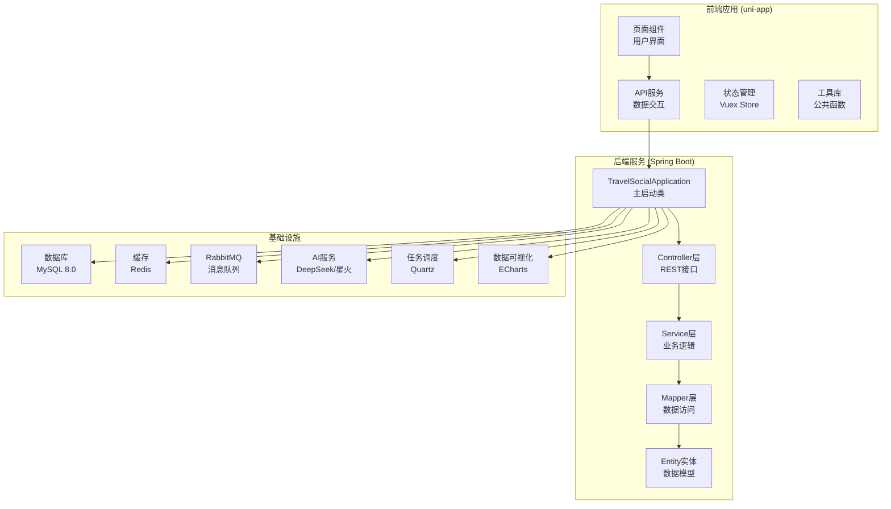

**图表来源**
- [TravelSocialApplication.java:16-25](file://springboot-travel-social/src/main/java/com/cxx/TravelSocialApplication.java#L16-L25)
- [pom.xml:16-182](file://springboot-travel-social/pom.xml#L16-L182)

**章节来源**
- [TravelSocialApplication.java:1-54](file://springboot-travel-social/src/main/java/com/cxx/TravelSocialApplication.java#L1-L54)
- [pom.xml:1-243](file://springboot-travel-social/pom.xml#L1-L243)

## 核心组件

### 2.1 用户管理系统
基于现有用户控制器，实现慢病管理平台的用户认证和权限管理：

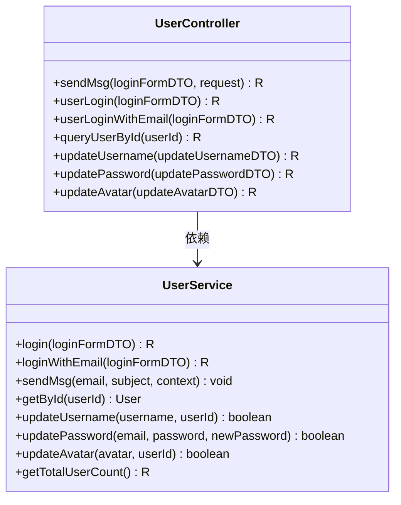

**图表来源**
- [UserController.java:34-136](file://springboot-travel-social/src/main/java/com/cxx/controller/UserController.java#L34-L136)

### 2.2 AI智能服务系统
集成DeepSeek和星火大模型，提供智能问答和行程规划功能：

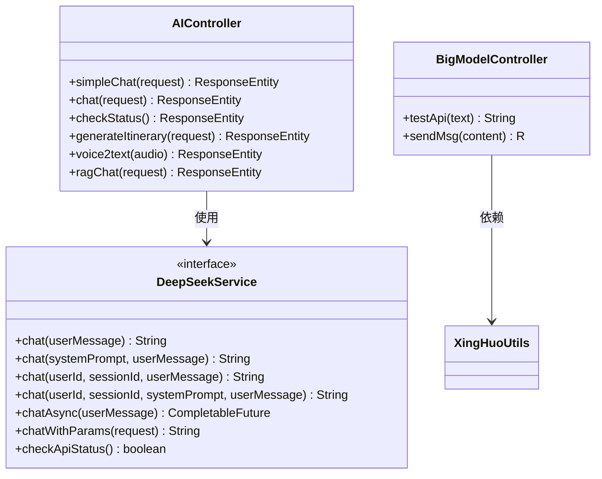

**图表来源**
- [AIController.java:26-610](file://springboot-travel-social/src/main/java/com/cxx/controller/AIController.java#L26-L610)
- [DeepSeekService.java:7-46](file://springboot-travel-social/src/main/java/com/cxx/service/DeepSeekService.java#L7-L46)

### 2.3 天气服务集成
提供天气查询和预警功能，支持旅行和健康相关的天气信息：

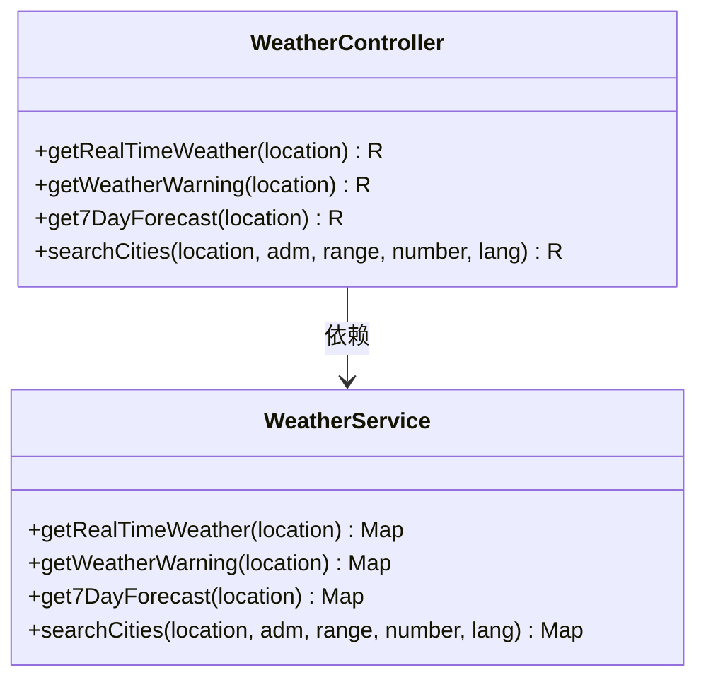

**图表来源**
- [WeatherController.java:22-87](file://springboot-travel-social/src/main/java/com/cxx/controller/WeatherController.java#L22-L87)

**章节来源**
- [UserController.java:1-136](file://springboot-travel-social/src/main/java/com/cxx/controller/UserController.java#L1-L136)
- [AIController.java:1-610](file://springboot-travel-social/src/main/java/com/cxx/controller/AIController.java#L1-L610)
- [BigModelController.java:15-51](file://springboot-travel-social/src/main/java/com/cxx/controller/BigModelController.java#L15-L51)
- [WeatherController.java:1-87](file://springboot-travel-social/src/main/java/com/cxx/controller/WeatherController.java#L1-L87)

## 架构概览

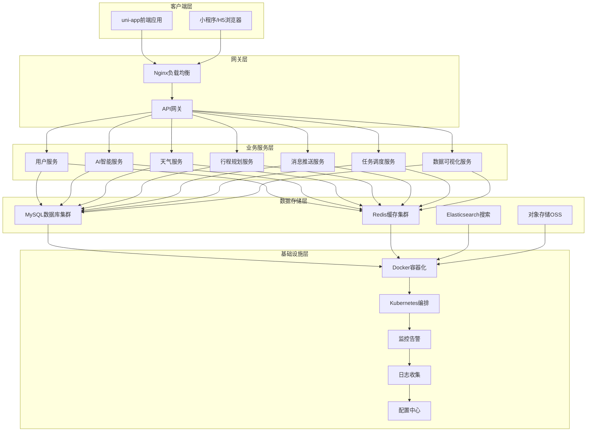

**图表来源**
- [pom.xml:16-182](file://springboot-travel-social/pom.xml#L16-L182)
- [application.properties:1-64](file://springboot-travel-social/src/main/resources/application.properties#L1-L64)

## 详细组件分析

### 3.1 慢性病档案管理模块

#### 3.1.1 患者基础信息管理
基于现有用户管理系统，扩展慢病相关的个人信息管理：

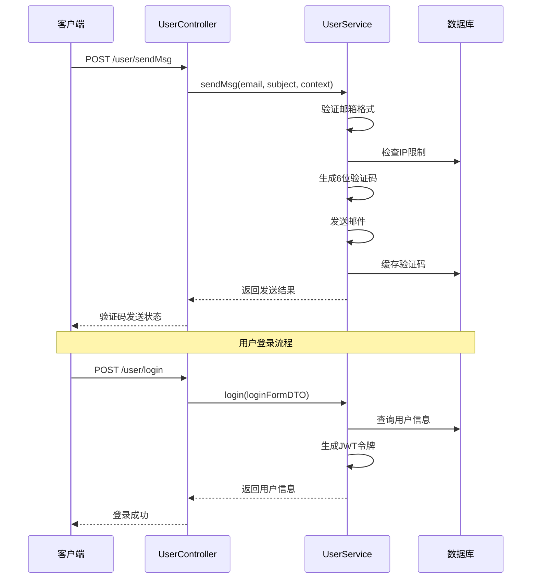

**图表来源**
- [UserController.java:42-87](file://springboot-travel-social/src/main/java/com/cxx/controller/UserController.java#L42-L87)

#### 3.1.2 档案创建与编辑
支持慢病患者档案的创建、编辑和管理，包含敏感信息加密存储：

- **身份验证**：基于JWT的用户认证机制
- **数据加密**：身份证号、手机号等敏感信息AES加密
- **权限控制**：基于角色的访问控制（RBAC）
- **操作审计**：完整的操作日志记录

### 3.2 健康指标监测模块

#### 3.2.1 指标类型管理
支持多种健康指标的录入和管理：

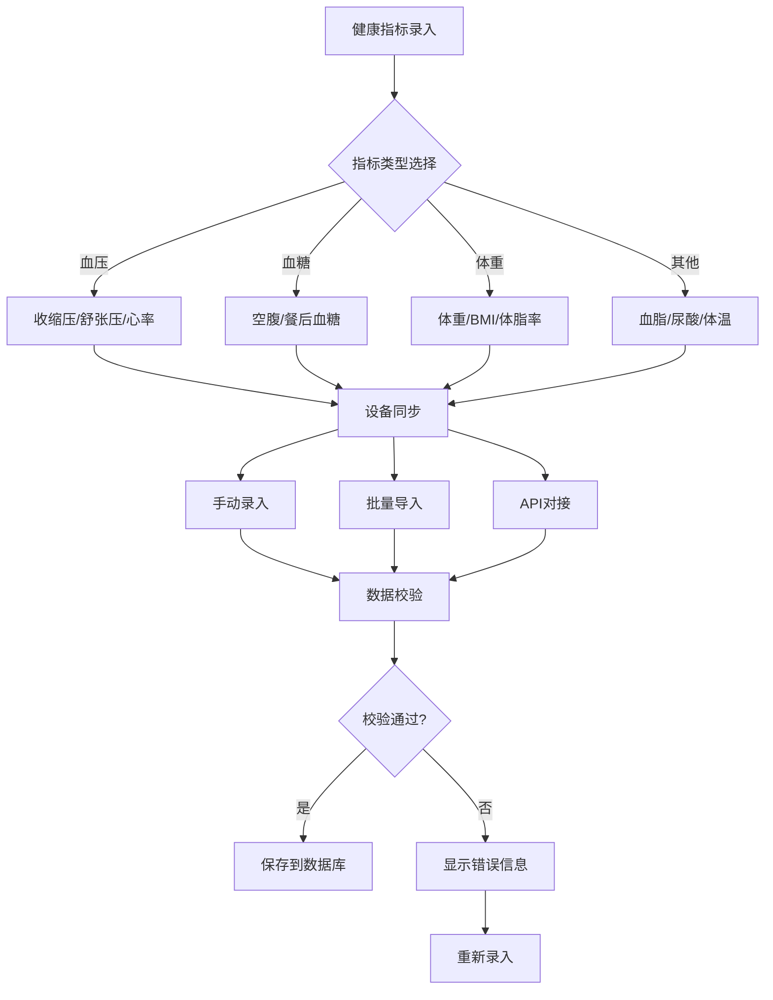

**图表来源**
- [AIController.java:416-469](file://springboot-travel-social/src/main/java/com/cxx/controller/AIController.java#L416-L469)

#### 3.2.2 数据校验机制
实现多层次的数据校验确保数据质量：

- **数值范围校验**：设定合理的上下限值
- **时间逻辑校验**：防止未来时间数据录入
- **一致性校验**：避免重复记录
- **异常值检测**：超出正常范围的标记提醒

### 3.3 异常预警系统

#### 3.3.1 预警规则配置
基于慢病特点配置个性化的预警规则：

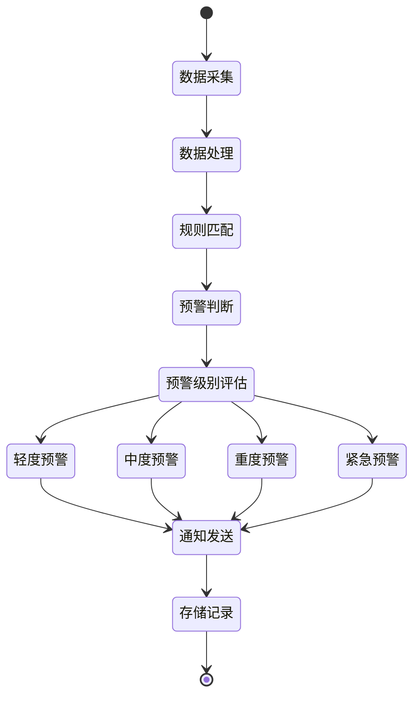

**图表来源**
- [AIController.java:514-597](file://springboot-travel-social/src/main/java/com/cxx/controller/AIController.java#L514-L597)

#### 3.3.2 预警级别管理
定义预警的严重级别：

- **轻度预警（蓝色）**：指标轻微异常，提醒关注
- **中度预警（黄色）**：指标明显异常，建议就医
- **重度预警（红色）**：指标严重异常，立即就医
- **紧急预警（黑色）**：危及生命，立即联系急救

#### 3.3.3 预警通知
支持多种通知方式确保及时提醒：

- **APP推送**：平台内消息推送
- **短信通知**：紧急情况下的短信提醒
- **邮件通知**：详细预警报告
- **微信通知**：集成微信模板消息

### 3.4 用药提醒模块

#### 3.4.1 用药计划管理
提供完整的用药管理功能：

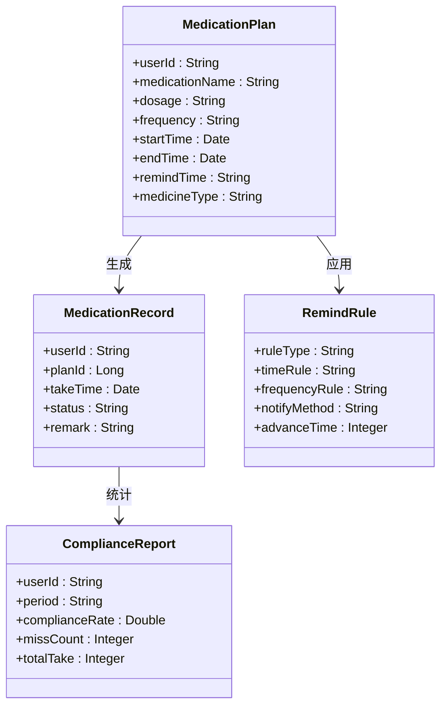

**图表来源**
- [AIController.java:416-469](file://springboot-travel-social/src/main/java/com/cxx/controller/AIController.java#L416-L469)

#### 3.4.2 提醒规则配置
配置用药提醒的时间和方式：

- **时间规则**：固定时间、间隔时间、餐前餐后
- **频率规则**：每日、每周、每月、按需
- **提醒方式**：APP通知、短信、电话
- **提醒时机**：提前15分钟、准时、延迟提醒

#### 3.4.3 用药记录追踪
通过数据分析评估用药效果：

- **按时服药率**：计算按时服药的比例
- **漏服次数统计**：记录漏服次数和时间
- **副作用监测**：跟踪药物副作用情况
- **治疗效果评估**：基于指标变化评估疗效

### 3.5 健康知识推送模块

#### 3.5.1 知识库管理
建立全面的健康知识体系：

- **疾病知识**：慢病科普、病因病理、症状识别
- **用药指导**：用药常识、注意事项、副作用处理
- **生活方式**：饮食指导、运动建议、心理调节
- **急救知识**：突发情况处理、急救措施

#### 3.5.2 个性化推送
基于患者情况提供精准的知识推送：

- **基于疾病类型**：向糖尿病患者推送糖尿病相关知识
- **基于健康指标**：指标异常时推送相关知识
- **基于用药情况**：新药使用时推送用药指导
- **基于时间节点**：季节变化、节假日推送

#### 3.5.3 内容互动
患者与知识内容的互动功能：

- **内容收藏、分享、评论**
- **知识问答、在线测试**
- **学习进度跟踪**
- **阅读统计**

### 3.6 医患留言模块

#### 3.6.1 留言管理
提供便捷的医患沟通渠道：

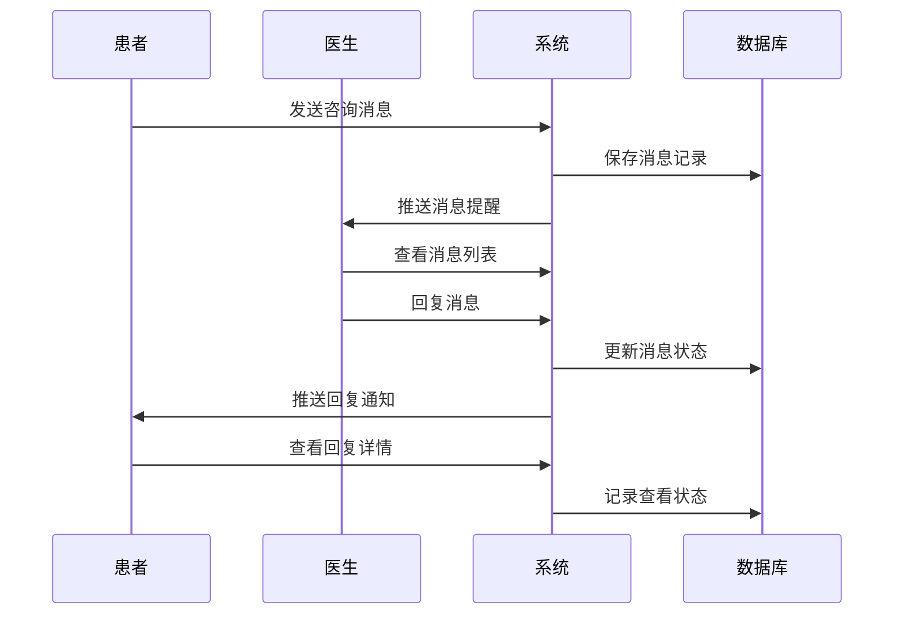

**图表来源**
- [AIController.java:514-597](file://springboot-travel-social/src/main/java/com/cxx/controller/AIController.java#L514-L597)

#### 3.6.2 医生回复
医生对患者留言的回复功能：

- **文字回复、语音回复**
- **模板回复（常用回复模板）**
- **转接功能（转给专科医生）**
- **预约功能（直接预约门诊）**

#### 3.6.3 留言统计
统计留言数据和医生工作量：

- **留言数量统计（按类型、时间）**
- **医生回复率、回复时长**
- **患者满意度评价**
- **常见问题分析**

**章节来源**
- [UserController.java:42-125](file://springboot-travel-social/src/main/java/com/cxx/controller/UserController.java#L42-L125)
- [AIController.java:37-134](file://springboot-travel-social/src/main/java/com/cxx/controller/AIController.java#L37-L134)
- [BigModelController.java:29-49](file://springboot-travel-social/src/main/java/com/cxx/controller/BigModelController.java#L29-L49)

## 依赖分析

### 4.1 技术栈依赖

```mermaid
graph TD
subgraph "核心框架"
A[Spring Boot 2.7.0]
B[MyBatis-Plus 3.5.1]
C[Lombok 1.18.34]
D[Spring Security]
end
subgraph "数据库相关"
E[MySQL 8.0.33]
F[Redis 6379]
G[Redisson 3.6.5]
H[Elasticsearch]
end
subgraph "AI服务"
I[DeepSeek API]
J[星火认知大模型]
K[XunFei语音识别]
L[Zhipu AI]
end
subgraph "消息服务"
M[RabbitMQ 5672]
N[WebSocket]
O[GoEasy SDK]
P[短信服务]
Q[邮件服务]
end
subgraph "任务调度"
R[Quartz 2.3.2]
end
subgraph "数据可视化"
S[ECharts 5.4.0]
end
subgraph "工具库"
T[Hutool 5.7.17]
U[OkHttp 4.11.0]
V[FastJSON 2.0.54]
W[Apache HttpClient]
end
A --> B
A --> C
A --> D
A --> E
A --> F
A --> G
A --> H
A --> I
A --> J
A --> K
A --> L
A --> M
A --> N
A --> O
A --> P
A --> Q
A --> R
A --> S
A --> T
A --> U
A --> V
A --> W
```

**图表来源**
- [pom.xml:16-182](file://springboot-travel-social/pom.xml#L16-L182)

### 4.2 前端依赖

```mermaid
graph LR
subgraph "核心依赖"
A[@dcloudio/uni-app ^2.0.2]
B[uview-ui ^2.0.36]
C[@escook/request-miniprogram ^0.2.1]
D[goeasy ^2.8.8]
E[color-convert ^3.1.3]
end
subgraph "构建工具"
F[Vue CLI]
G[Webpack]
H[ESLint]
end
A --> B
A --> C
A --> D
A --> E
F --> G
G --> H
```

**图表来源**
- [package.json:15-26](file://uniapp-travel-social/package.json#L15-L26)

**章节来源**
- [pom.xml:1-243](file://springboot-travel-social/pom.xml#L1-L243)
- [package.json:1-27](file://uniapp-travel-social/package.json#L1-L27)

## 性能考虑

### 5.1 系统性能指标
- **响应时间**：< 3 秒（页面加载），< 2 秒（数据查询）
- **并发能力**：支持 1000 人同时在线
- **数据处理**：支持 10 万患者数据管理
- **推送延迟**：< 30 秒到达

### 5.2 缓存策略
- **Redis缓存**：热点数据缓存，减少数据库压力
- **多级缓存**：本地缓存 + 分布式缓存
- **缓存失效**：合理的过期时间和更新策略

### 5.3 数据库优化
- **索引优化**：为常用查询字段建立索引
- **分库分表**：大数据量时的水平扩展
- **连接池**：优化数据库连接管理

### 5.4 AI服务优化
- **异步调用**：DeepSeek API异步处理
- **请求限流**：防止API调用过载
- **结果缓存**：热门问题答案缓存

## 故障排除指南

### 6.1 常见问题诊断

#### 6.1.1 用户认证问题
- **验证码发送失败**：检查邮箱配置和Redis连接
- **登录失败**：验证JWT令牌生成和解析
- **权限验证失败**：检查RBAC权限配置

#### 6.1.2 AI服务问题
- **DeepSeek API调用失败**：检查API密钥和网络连接
- **星火大模型异常**：验证接口配置和配额限制
- **RAG检索失败**：检查知识库索引和查询语句

#### 6.1.3 数据库连接问题
- **连接超时**：检查数据库连接池配置
- **SQL执行失败**：验证SQL语句和参数绑定
- **事务回滚**：检查业务逻辑和异常处理

#### 6.1.4 任务调度问题
- **定时任务不执行**：检查Quartz配置和任务状态
- **任务重复执行**：验证任务去重机制
- **任务执行失败**：查看任务执行日志

### 6.2 监控和日志

#### 6.2.1 系统监控
- **应用指标**：CPU、内存、磁盘使用率
- **数据库指标**：连接数、查询性能、锁等待
- **AI服务指标**：API调用成功率、响应时间
- **缓存指标**：命中率、内存使用情况

#### 6.2.2 日志管理
- **访问日志**：用户操作和系统事件
- **错误日志**：异常堆栈和错误信息
- **审计日志**：敏感操作和权限变更
- **性能日志**：慢查询和性能瓶颈

**章节来源**
- [TravelSocialApplication.java:33-50](file://springboot-travel-social/src/main/java/com/cxx/TravelSocialApplication.java#L33-L50)
- [application.properties:1-64](file://springboot-travel-social/src/main/resources/application.properties#L1-L64)

## 结论

本慢性健康管理平台基于现有的旅游攻略社交小程序代码库，具备了良好的技术基础和架构设计。通过扩展用户管理系统、集成AI智能服务、完善数据存储和消息推送功能，可以构建一个功能完整、性能优良的慢病管理平台。

### 主要优势
- **技术栈成熟**：Spring Boot + uni-app的组合经过实践验证
- **AI能力丰富**：DeepSeek和星火大模型提供强大的智能服务能力
- **扩展性强**：模块化设计便于功能扩展和维护
- **安全性保障**：完善的认证授权和数据加密机制
- **任务调度完善**：Quartz提供可靠的定时任务支持

### 发展建议
- **功能完善**：根据慢病管理需求完善各功能模块
- **性能优化**：针对大数据量场景进行性能调优
- **用户体验**：持续改进界面设计和交互体验
- **安全保障**：加强数据安全和隐私保护措施
- **AI集成**：深化AI在慢病管理中的应用

## 附录

### 7.1 开发环境配置
- **JDK版本**：1.8+
- **数据库**：MySQL 8.0.33
- **Redis**：6379端口
- **RabbitMQ**：5672端口
- **Node.js**：16.x以上版本

### 7.2 部署要求
- **服务器配置**：4核8G内存，支持Docker部署
- **数据库服务器**：8核16G内存，SSD存储
- **网络带宽**：100M带宽，支持HTTPS
- **域名备案**：完成域名备案和SSL证书配置

### 7.3 测试计划
- **单元测试**：核心业务逻辑测试
- **集成测试**：模块间接口测试
- **性能测试**：并发和压力测试
- **安全测试**：渗透测试和漏洞扫描
- **用户验收测试**：真实用户场景测试

### 7.4 数据库设计

#### 7.4.1 慢病管理相关表结构
基于现有项目结构，扩展慢病管理所需的数据库表：

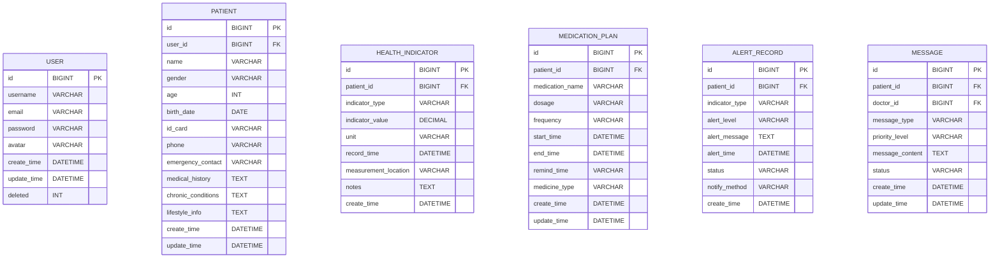

**图表来源**
- [User.java:29-81](file://springboot-travel-social/src/main/java/com/cxx/entity/User.java#L29-L81)

#### 7.4.2 数据迁移脚本示例
基于现有budget.sql结构，扩展慢病管理相关的数据迁移脚本：

```sql
-- 慢性病患者档案表
CREATE TABLE IF NOT EXISTS `patient` (
  `id` BIGINT NOT NULL AUTO_INCREMENT COMMENT '主键',
  `user_id` BIGINT NOT NULL COMMENT '关联用户ID',
  `name` VARCHAR(50) NOT NULL COMMENT '姓名',
  `gender` VARCHAR(10) COMMENT '性别',
  `age` INT COMMENT '年龄',
  `birth_date` DATE COMMENT '出生日期',
  `id_card` VARCHAR(18) COMMENT '身份证号',
  `phone` VARCHAR(20) COMMENT '手机号',
  `emergency_contact` VARCHAR(100) COMMENT '紧急联系人',
  `medical_history` TEXT COMMENT '医疗历史',
  `chronic_conditions` TEXT COMMENT '慢病类型',
  `lifestyle_info` TEXT COMMENT '生活方式信息',
  `create_time` DATETIME DEFAULT CURRENT_TIMESTAMP,
  `update_time` DATETIME DEFAULT CURRENT_TIMESTAMP ON UPDATE CURRENT_TIMESTAMP,
  PRIMARY KEY (`id`),
  UNIQUE KEY `uk_user_id` (`user_id`),
  KEY `idx_name` (`name`)
) ENGINE=InnoDB DEFAULT CHARSET=utf8mb4 COMMENT='慢性病患者档案表';

-- 健康指标记录表
CREATE TABLE IF NOT EXISTS `health_indicator` (
  `id` BIGINT NOT NULL AUTO_INCREMENT COMMENT '主键',
  `patient_id` BIGINT NOT NULL COMMENT '患者ID',
  `indicator_type` VARCHAR(50) NOT NULL COMMENT '指标类型',
  `indicator_value` DECIMAL(10,2) NOT NULL COMMENT '指标数值',
  `unit` VARCHAR(20) NOT NULL COMMENT '单位',
  `record_time` DATETIME NOT NULL COMMENT '记录时间',
  `measurement_location` VARCHAR(100) COMMENT '测量位置',
  `notes` TEXT COMMENT '备注',
  `create_time` DATETIME DEFAULT CURRENT_TIMESTAMP,
  `update_time` DATETIME DEFAULT CURRENT_TIMESTAMP ON UPDATE CURRENT_TIMESTAMP,
  PRIMARY KEY (`id`),
  KEY `idx_patient_time` (`patient_id`, `record_time`),
  KEY `idx_indicator_type` (`indicator_type`)
) ENGINE=InnoDB DEFAULT CHARSET=utf8mb4 COMMENT='健康指标记录表';

-- 用药计划表
CREATE TABLE IF NOT EXISTS `medication_plan` (
  `id` BIGINT NOT NULL AUTO_INCREMENT COMMENT '主键',
  `patient_id` BIGINT NOT NULL COMMENT '患者ID',
  `medication_name` VARCHAR(100) NOT NULL COMMENT '药品名称',
  `dosage` VARCHAR(50) NOT NULL COMMENT '剂量',
  `frequency` VARCHAR(50) NOT NULL COMMENT '频次',
  `start_time` DATETIME NOT NULL COMMENT '开始时间',
  `end_time` DATETIME COMMENT '结束时间',
  `remind_time` VARCHAR(50) COMMENT '提醒时间',
  `medicine_type` VARCHAR(50) COMMENT '药品类型',
  `create_time` DATETIME DEFAULT CURRENT_TIMESTAMP,
  `update_time` DATETIME DEFAULT CURRENT_TIMESTAMP ON UPDATE CURRENT_TIMESTAMP,
  PRIMARY KEY (`id`),
  KEY `idx_patient_time` (`patient_id`, `start_time`)
) ENGINE=InnoDB DEFAULT CHARSET=utf8mb4 COMMENT='用药计划表';

-- 异常预警记录表
CREATE TABLE IF NOT EXISTS `alert_record` (
  `id` BIGINT NOT NULL AUTO_INCREMENT COMMENT '主键',
  `patient_id` BIGINT NOT NULL COMMENT '患者ID',
  `indicator_type` VARCHAR(50) NOT NULL COMMENT '指标类型',
  `alert_level` VARCHAR(20) NOT NULL COMMENT '预警级别',
  `alert_message` TEXT NOT NULL COMMENT '预警信息',
  `alert_time` DATETIME NOT NULL COMMENT '预警时间',
  `status` VARCHAR(20) DEFAULT 'pending' COMMENT '状态',
  `notify_method` VARCHAR(50) COMMENT '通知方式',
  `create_time` DATETIME DEFAULT CURRENT_TIMESTAMP,
  PRIMARY KEY (`id`),
  KEY `idx_patient_time` (`patient_id`, `alert_time`),
  KEY `idx_alert_level` (`alert_level`)
) ENGINE=InnoDB DEFAULT CHARSET=utf8mb4 COMMENT='异常预警记录表';

-- 医患沟通消息表
CREATE TABLE IF NOT EXISTS `message` (
  `id` BIGINT NOT NULL AUTO_INCREMENT COMMENT '主键',
  `patient_id` BIGINT NOT NULL COMMENT '患者ID',
  `doctor_id` BIGINT COMMENT '医生ID',
  `message_type` VARCHAR(50) NOT NULL COMMENT '消息类型',
  `priority_level` VARCHAR(20) DEFAULT 'normal' COMMENT '优先级',
  `message_content` TEXT NOT NULL COMMENT '消息内容',
  `status` VARCHAR(20) DEFAULT 'pending' COMMENT '状态',
  `create_time` DATETIME DEFAULT CURRENT_TIMESTAMP,
  `update_time` DATETIME DEFAULT CURRENT_TIMESTAMP ON UPDATE CURRENT_TIMESTAMP,
  PRIMARY KEY (`id`),
  KEY `idx_patient_time` (`patient_id`, `create_time`),
  KEY `idx_doctor_time` (`doctor_id`, `create_time`)
) ENGINE=InnoDB DEFAULT CHARSET=utf8mb4 COMMENT='医患沟通消息表';
```

### 7.5 非功能性需求

#### 7.5.1 性能需求
- **响应时间**：页面加载 < 3 秒，数据查询 < 2 秒
- **并发能力**：支持 1000 人同时在线
- **数据处理**：支持 10 万患者数据管理
- **推送延迟**：预警通知 < 30 秒到达

#### 7.5.2 安全需求
- **数据加密**：敏感信息 AES-256 加密存储
- **身份认证**：JWT Token 认证机制
- **权限控制**：RBAC 权限模型
- **日志审计**：操作日志完整记录
- **防攻击**：防 SQL 注入、XSS 攻击

#### 7.5.3 可用性需求
- **界面友好**：简洁直观的界面设计
- **操作简便**：关键功能 3 步内完成
- **错误提示**：清晰的错误提示和解决方案
- **帮助文档**：完善的帮助文档和 FAQ

#### 7.5.4 可靠性需求
- **数据备份**：每日自动备份，支持恢复
- **故障恢复**：系统故障 30 分钟内恢复
- **数据一致**：保证数据完整性和一致性
- **监控告警**：系统异常实时监控告警

#### 7.5.5 可维护性需求
- **代码规范**：遵循开发规范，代码可读性强
- **文档完整**：技术文档、接口文档完整
- **模块化**：功能模块解耦，易于扩展
- **配置管理**：参数可配置，无需修改代码

### 7.6 接口需求

#### 7.6.1 内部接口
- **健康数据 API**：健康指标录入、查询、分析
- **用户管理 API**：用户注册、登录、权限管理
- **消息推送 API**：预警通知、用药提醒
- **文件管理 API**：图片、文档上传下载
- **任务调度 API**：定时任务配置和管理

#### 7.6.2 外部接口
- **医院系统对接**：HIS、LIS 系统数据同步
- **短信服务**：第三方短信平台集成
- **邮件服务**：SMTP 邮件发送
- **支付接口**：在线支付功能（可选）
- **AI服务集成**：DeepSeek、星火等大模型API

### 7.7 项目里程碑

#### 7.7.1 第一阶段（1-2 个月）
- 需求分析与设计
- 基础架构搭建
- 患者档案管理模块
- 健康指标录入模块

#### 7.7.2 第二阶段（2-3 个月）
- 异常预警模块
- 用药提醒模块
- 健康知识推送模块
- 医患留言模块

#### 7.7.3 第三阶段（1-2 个月）
- 系统集成测试
- 性能优化
- 安全加固
- 用户培训

#### 7.7.4 第四阶段（持续）
- 上线部署
- 运维监控
- 功能迭代
- 用户体验优化

**章节来源**
- [README.md:1-38](file://springboot-travel-social/README.md#L1-L38)
- [application.properties:1-64](file://springboot-travel-social/src/main/resources/application.properties#L1-L64)
- [User.java:1-81](file://springboot-travel-social/src/main/java/com/cxx/entity/User.java#L1-L81)
- [budget.sql:1-77](file://springboot-travel-social/src/main/resources/sql/budget.sql#L1-L77)