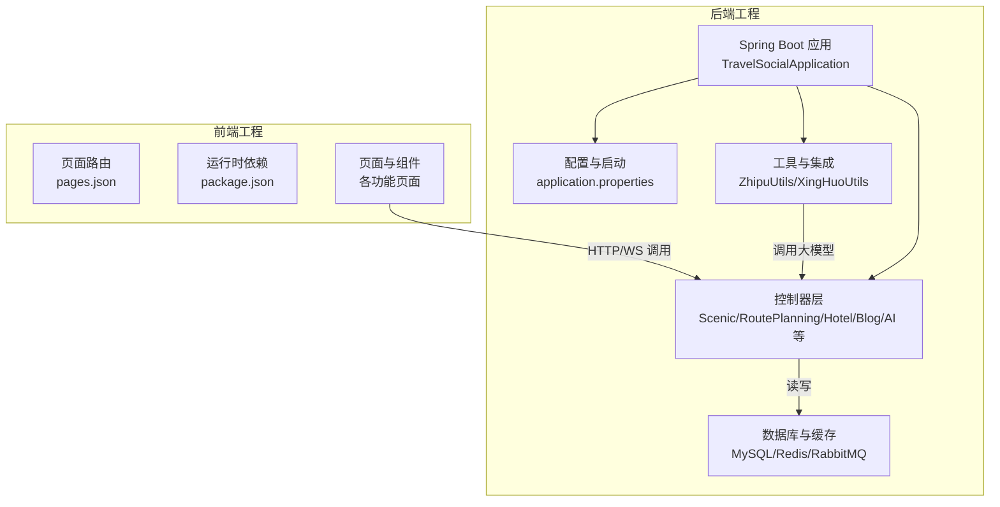
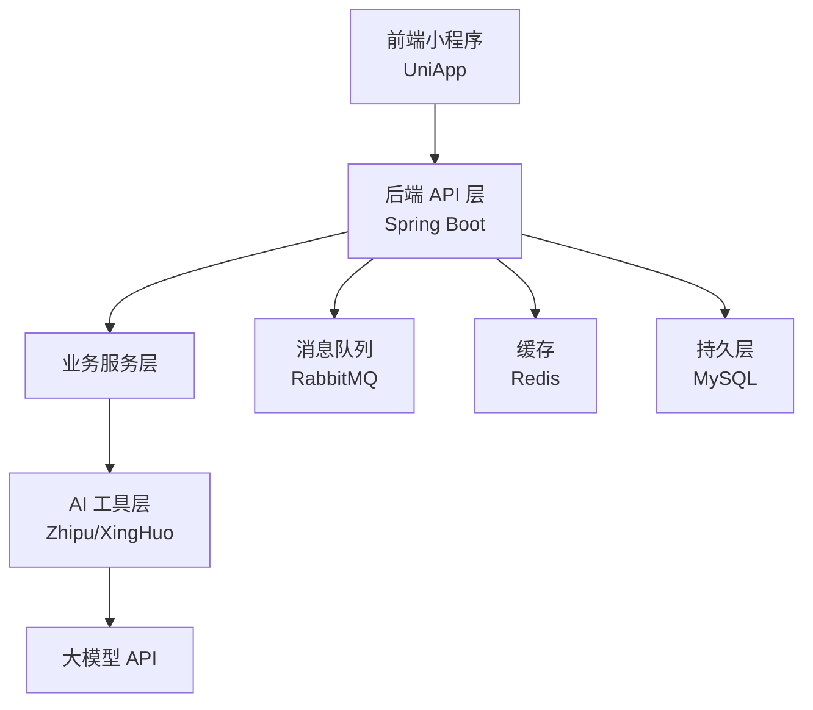
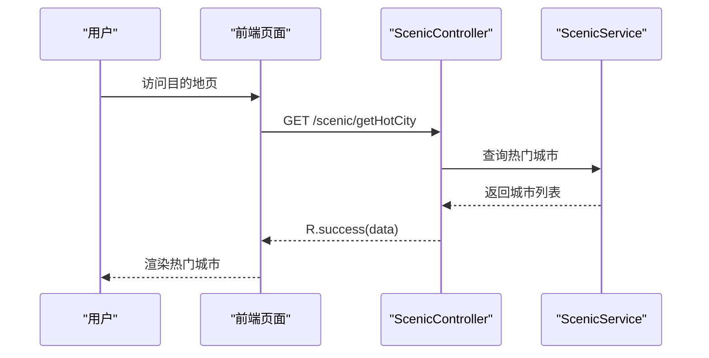
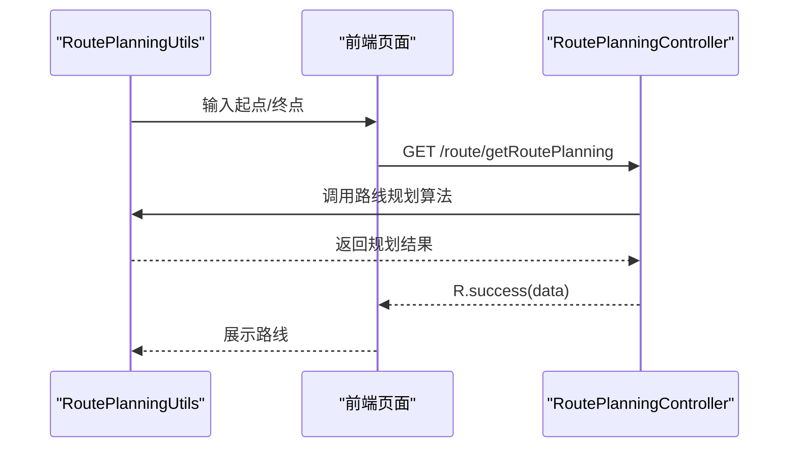
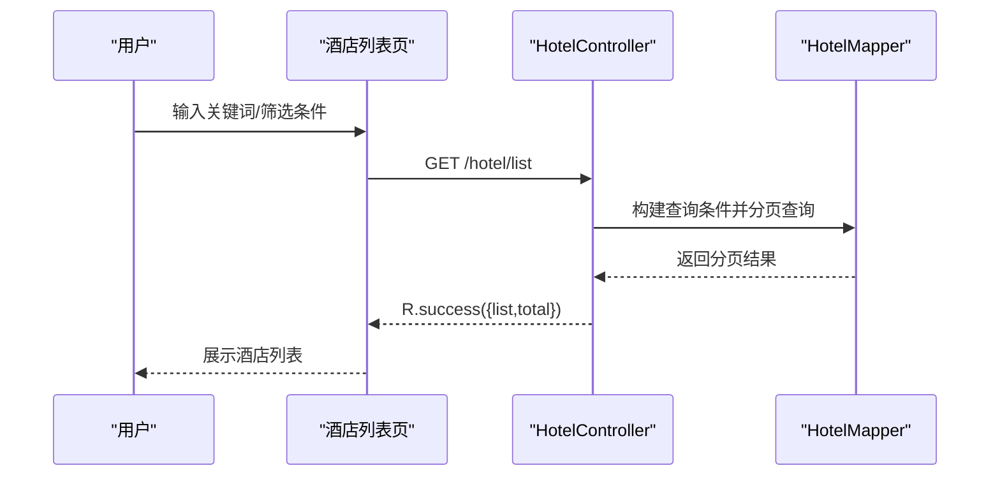
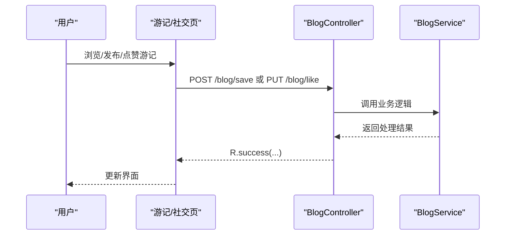
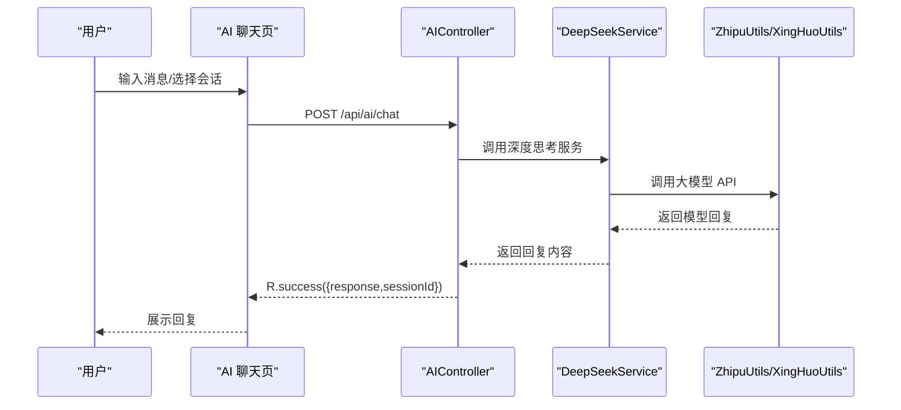
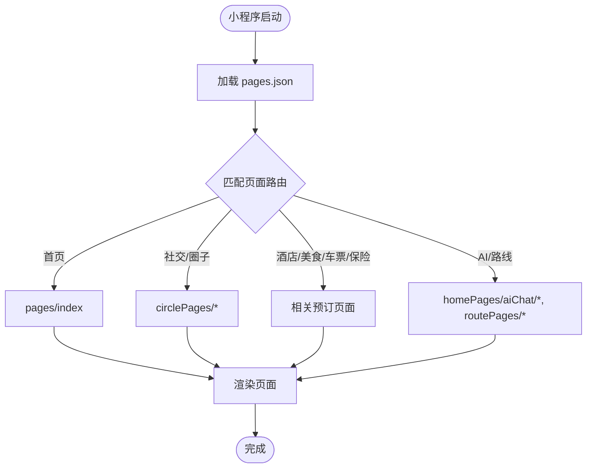
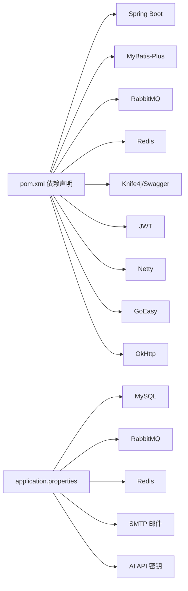

# 项目概述

<cite>
**本文引用的文件**
- [README.md](file://springboot-travel-social/README.md)
- [pom.xml](file://springboot-travel-social/pom.xml)
- [application.properties](file://springboot-travel-social/src/main/resources/application.properties)
- [TravelSocialApplication.java](file://springboot-travel-social/src/main/java/com/cxx/TravelSocialApplication.java)
- [ScenicController.java](file://springboot-travel-social/src/main/java/com/cxx/controller/ScenicController.java)
- [RoutePlanningController.java](file://springboot-travel-social/src/main/java/com/cxx/controller/RoutePlanningController.java)
- [HotelController.java](file://springboot-travel-social/src/main/java/com/cxx/controller/HotelController.java)
- [BlogController.java](file://springboot-travel-social/src/main/java/com/cxx/controller/BlogController.java)
- [AIController.java](file://springboot-travel-social/src/main/java/com/cxx/controller/AIController.java)
- [BigModelController.java](file://springboot-travel-social/src/main/java/com/cxx/controller/BigModelController.java)
- [ZhipuUtils.java](file://springboot-travel-social/src/main/java/com/cxx/utils/ZhipuUtils.java)
- [XingHuoUtils.java](file://springboot-travel-social/src/main/java/com/cxx/utils/XingHuoUtils.java)
- [pages.json](file://uniapp-travel-social/pages.json)
- [package.json](file://uniapp-travel-social/package.json)
</cite>

## 目录
1. [引言](#引言)
2. [项目结构](#项目结构)
3. [核心组件](#核心组件)
4. [架构总览](#架构总览)
5. [详细组件分析](#详细组件分析)
6. [依赖关系分析](#依赖关系分析)
7. [性能考虑](#性能考虑)
8. [故障排查指南](#故障排查指南)
9. [结论](#结论)
10. [附录](#附录)

## 引言
本项目是一个面向旅游社交场景的小程序应用，采用前后端分离架构：后端基于 Spring Boot，前端基于 UniApp（适配微信小程序等多端）。系统围绕“旅游攻略社交”这一核心目标，提供景点推荐、行程规划、在线预订（酒店、美食、车票、保险等）、社交互动（游记、评论、点赞、圈子）、AI智能服务（多模态对话、路线规划）等能力，旨在为用户提供一站式旅行解决方案。

## 项目结构
项目分为两个子工程：
- 后端工程（springboot-travel-social）：基于 Spring Boot 的 Java 后端，提供 REST API、业务逻辑、数据访问层、消息队列与缓存集成、AI 大模型对接等。
- 前端工程（uniapp-travel-social）：基于 UniApp 的小程序前端，负责页面路由、UI 组件、网络请求、状态管理与第三方 SDK 集成。

图表来源
- [TravelSocialApplication.java:1-54](file://springboot-travel-social/src/main/java/com/cxx/TravelSocialApplication.java#L1-L54)
- [application.properties:1-61](file://springboot-travel-social/src/main/resources/application.properties#L1-L61)
- [ScenicController.java:1-29](file://springboot-travel-social/src/main/java/com/cxx/controller/ScenicController.java#L1-L29)
- [RoutePlanningController.java:1-31](file://springboot-travel-social/src/main/java/com/cxx/controller/RoutePlanningController.java#L1-L31)
- [HotelController.java:1-133](file://springboot-travel-social/src/main/java/com/cxx/controller/HotelController.java#L1-L133)
- [BlogController.java:1-219](file://springboot-travel-social/src/main/java/com/cxx/controller/BlogController.java#L1-L219)
- [AIController.java:1-404](file://springboot-travel-social/src/main/java/com/cxx/controller/AIController.java#L1-L404)
- [ZhipuUtils.java:1-206](file://springboot-travel-social/src/main/java/com/cxx/utils/ZhipuUtils.java#L1-L206)
- [XingHuoUtils.java:1-61](file://springboot-travel-social/src/main/java/com/cxx/utils/XingHuoUtils.java#L1-L61)
- [pages.json:1-814](file://uniapp-travel-social/pages.json#L1-L814)
- [package.json:1-27](file://uniapp-travel-social/package.json#L1-L27)

章节来源
- [README.md:1-38](file://springboot-travel-social/README.md#L1-L38)
- [pom.xml:1-243](file://springboot-travel-social/pom.xml#L1-L243)
- [application.properties:1-61](file://springboot-travel-social/src/main/resources/application.properties#L1-L61)
- [pages.json:1-814](file://uniapp-travel-social/pages.json#L1-L814)
- [package.json:1-27](file://uniapp-travel-social/package.json#L1-L27)

## 核心组件
- 控制器层：提供 REST 接口，覆盖景点、行程、酒店、游记、AI 对话、大模型交互等功能域。
- 业务工具层：封装 AI 大模型调用（智谱、星火），提供统一的对外接口。
- 数据与缓存：集成 MySQL、Redis、RabbitMQ，支撑高并发与异步处理。
- 前端页面：以 pages.json 为入口，组织多页面与分包结构，覆盖社交、预订、AI、路线规划等场景。

章节来源
- [ScenicController.java:1-29](file://springboot-travel-social/src/main/java/com/cxx/controller/ScenicController.java#L1-L29)
- [RoutePlanningController.java:1-31](file://springboot-travel-social/src/main/java/com/cxx/controller/RoutePlanningController.java#L1-L31)
- [HotelController.java:1-133](file://springboot-travel-social/src/main/java/com/cxx/controller/HotelController.java#L1-L133)
- [BlogController.java:1-219](file://springboot-travel-social/src/main/java/com/cxx/controller/BlogController.java#L1-L219)
- [AIController.java:1-404](file://springboot-travel-social/src/main/java/com/cxx/controller/AIController.java#L1-L404)
- [BigModelController.java:1-51](file://springboot-travel-social/src/main/java/com/cxx/controller/BigModelController.java#L1-L51)
- [ZhipuUtils.java:1-206](file://springboot-travel-social/src/main/java/com/cxx/utils/ZhipuUtils.java#L1-L206)
- [XingHuoUtils.java:1-61](file://springboot-travel-social/src/main/java/com/cxx/utils/XingHuoUtils.java#L1-L61)

## 架构总览
系统采用前后端分离与微服务化思路：
- 前后端分离：前端通过 HTTP/WS 与后端交互；后端提供标准 REST API。
- 微服务化思路：将不同业务域拆分为独立的控制器与服务模块，便于扩展与演进。
- 数据与中间件：MySQL 存储业务数据，Redis 缓存热点数据与会话，RabbitMQ 支撑异步任务与事件解耦。
- AI 能力：集成多模态大模型（智谱、星火），提供智能问答、路线规划辅助等能力。

图表来源
- [pom.xml:16-182](file://springboot-travel-social/pom.xml#L16-L182)
- [application.properties:1-61](file://springboot-travel-social/src/main/resources/application.properties#L1-L61)
- [ZhipuUtils.java:1-206](file://springboot-travel-social/src/main/java/com/cxx/utils/ZhipuUtils.java#L1-L206)
- [XingHuoUtils.java:1-61](file://springboot-travel-social/src/main/java/com/cxx/utils/XingHuoUtils.java#L1-L61)

## 详细组件分析

### 景点与城市服务
- 功能：提供热门城市列表、城市检索等基础能力。
- 典型接口：/scenic/getAllCity、/scenic/getHotCity?pageNum=&pageSize=。

图表来源
- [ScenicController.java:18-27](file://springboot-travel-social/src/main/java/com/cxx/controller/ScenicController.java#L18-L27)

章节来源
- [ScenicController.java:1-29](file://springboot-travel-social/src/main/java/com/cxx/controller/ScenicController.java#L1-L29)

### 行程规划服务
- 功能：根据起点与终点计算路线，返回规划结果。
- 典型接口：/route/getRoutePlanning?origin=&destination=。

图表来源
- [RoutePlanningController.java:25-29](file://springboot-travel-social/src/main/java/com/cxx/controller/RoutePlanningController.java#L25-L29)

章节来源
- [RoutePlanningController.java:1-31](file://springboot-travel-social/src/main/java/com/cxx/controller/RoutePlanningController.java#L1-L31)

### 酒店预订服务
- 功能：支持关键字搜索、星级筛选、多种排序方式，分页返回酒店列表与详情。
- 典型接口：/hotel/list、/hotel/detail/{id}。

图表来源
- [HotelController.java:27-91](file://springboot-travel-social/src/main/java/com/cxx/controller/HotelController.java#L27-L91)

章节来源
- [HotelController.java:1-133](file://springboot-travel-social/src/main/java/com/cxx/controller/HotelController.java#L1-L133)

### 社交与游记服务
- 功能：热门游记、全部游记、用户发布、点赞、搜索、个人游记列表等。
- 典型接口：/blog/hot、/blog/save、/blog/like、/blog/queryBlogById 等。

图表来源
- [BlogController.java:117-134](file://springboot-travel-social/src/main/java/com/cxx/controller/BlogController.java#L117-L134)

章节来源
- [BlogController.java:1-219](file://springboot-travel-social/src/main/java/com/cxx/controller/BlogController.java#L1-L219)

### AI 智能服务
- 功能：提供简单聊天、带系统提示聊天、会话管理、消息记录查询、AI 状态检查等。
- 典型接口：/api/ai/simple-chat、/api/ai/chat、/api/ai/sessions/{userId}、/api/ai/status 等。
- 工具类：ZhipuUtils、XingHuoUtils 封装大模型调用细节。

图表来源
- [AIController.java:136-230](file://springboot-travel-social/src/main/java/com/cxx/controller/AIController.java#L136-L230)
- [ZhipuUtils.java:170-204](file://springboot-travel-social/src/main/java/com/cxx/utils/ZhipuUtils.java#L170-L204)
- [XingHuoUtils.java:27-58](file://springboot-travel-social/src/main/java/com/cxx/utils/XingHuoUtils.java#L27-L58)

章节来源
- [AIController.java:1-404](file://springboot-travel-social/src/main/java/com/cxx/controller/AIController.java#L1-L404)
- [BigModelController.java:1-51](file://springboot-travel-social/src/main/java/com/cxx/controller/BigModelController.java#L1-L51)
- [ZhipuUtils.java:1-206](file://springboot-travel-social/src/main/java/com/cxx/utils/ZhipuUtils.java#L1-L206)
- [XingHuoUtils.java:1-61](file://springboot-travel-social/src/main/java/com/cxx/utils/XingHuoUtils.java#L1-L61)

### 前端页面与路由
- 页面入口：pages.json 定义了主包与多个分包下的页面路径、导航标题、下拉刷新等样式配置。
- 依赖：package.json 声明运行时依赖（UniApp、uView UI、GoEasy 等）。

图表来源
- [pages.json:1-814](file://uniapp-travel-social/pages.json#L1-L814)
- [package.json:15-21](file://uniapp-travel-social/package.json#L15-L21)

章节来源
- [pages.json:1-814](file://uniapp-travel-social/pages.json#L1-L814)
- [package.json:1-27](file://uniapp-travel-social/package.json#L1-L27)

## 依赖关系分析
- 技术栈概览
  - 后端：Spring Boot、MyBatis-Plus、MySQL、Redis、RabbitMQ、WebSocket、邮件、JWT、OkHttp、Jsoup、Netty、GoEasy、Knife4j/Swagger、Lombok 等。
  - 前端：UniApp、uview-ui、@escook/request-miniprogram、goeasy 等。
- 配置与连接
  - application.properties 中配置了数据库、Redis、RabbitMQ、邮件、AI API 密钥等。

图表来源
- [pom.xml:16-182](file://springboot-travel-social/pom.xml#L16-L182)
- [application.properties:1-61](file://springboot-travel-social/src/main/resources/application.properties#L1-L61)

章节来源
- [pom.xml:1-243](file://springboot-travel-social/pom.xml#L1-L243)
- [application.properties:1-61](file://springboot-travel-social/src/main/resources/application.properties#L1-L61)

## 性能考虑
- 缓存策略：利用 Redis 缓存热点数据（如热门城市、会话记录、限流规则），降低数据库压力。
- 分页与排序：后端对列表接口采用分页与多维度排序，避免一次性传输大量数据。
- 异步处理：结合 RabbitMQ 处理订单通知、日志上报等非关键路径任务，提升响应速度。
- 并发控制：通过限流与幂等设计（如订单号生成、支付状态字段）保障一致性与稳定性。
- WebSocket：用于实时消息与会话状态推送，改善用户体验。

## 故障排查指南
- 启动与连接
  - 若数据库连接失败，检查 application.properties 中的数据库 URL、用户名、密码是否正确。
  - 若 Redis 连接异常，确认 host/port/database 配置与网络连通性。
  - 若 RabbitMQ 连接异常，核对 host/port/virtual-host/账号密码。
- AI 接口
  - 若 AI 返回失败，检查 AI API Key 与 Base URL 是否配置正确，查看工具类日志输出。
  - 若会话管理异常，确认 sessionId 格式与用户权限校验。
- 页面与路由
  - 若页面无法打开，检查 pages.json 中的路径与分包配置是否一致。
  - 若网络请求失败，确认域名白名单与 HTTPS 配置。

章节来源
- [application.properties:1-61](file://springboot-travel-social/src/main/resources/application.properties#L1-L61)
- [AIController.java:32-129](file://springboot-travel-social/src/main/java/com/cxx/controller/AIController.java#L32-L129)
- [pages.json:1-814](file://uniapp-travel-social/pages.json#L1-L814)

## 结论
本项目以“旅游攻略社交”为核心，构建了从前端页面到后端服务、数据库与缓存、消息队列与 AI 大模型的完整技术体系。通过清晰的模块划分与标准化接口，系统具备良好的可扩展性与维护性。未来可在微服务拆分、可观测性增强、AI 能力深度集成等方面持续演进，进一步提升用户体验与业务价值。

## 附录
- 业务价值与创新点
  - 场景化整合：将“景点推荐、行程规划、在线预订、社交互动、AI 智能服务”串联为闭环体验。
  - 多模态 AI：支持文本与图片的多模态对话，提升旅行决策效率与趣味性。
  - 低门槛接入：前后端分离与小程序适配，快速触达用户。
- 差异化优势
  - AI 辅助路线规划与智能问答，形成差异化竞争力。
  - 社交与内容生态：游记、点赞、评论、圈子等增强用户粘性。
  - 一体化预订：覆盖酒店、美食、车票、保险等高频场景，提升转化率。