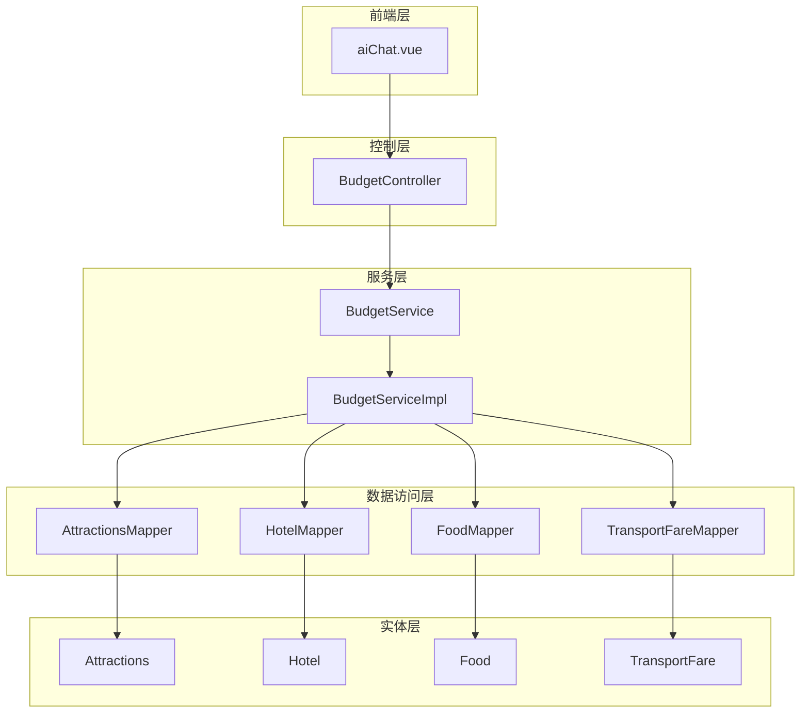
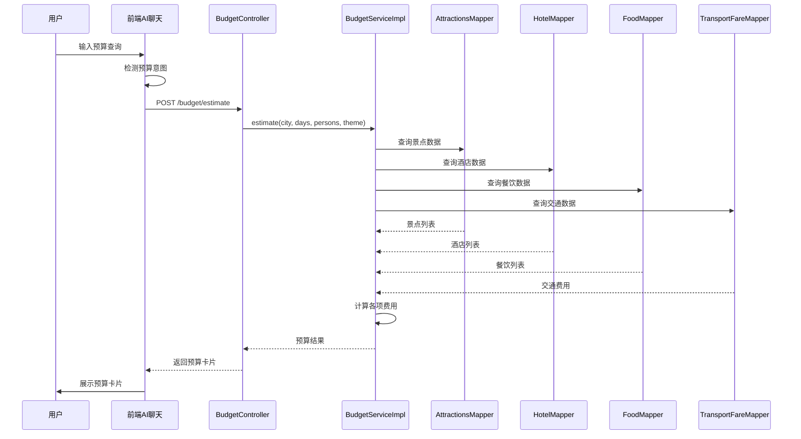
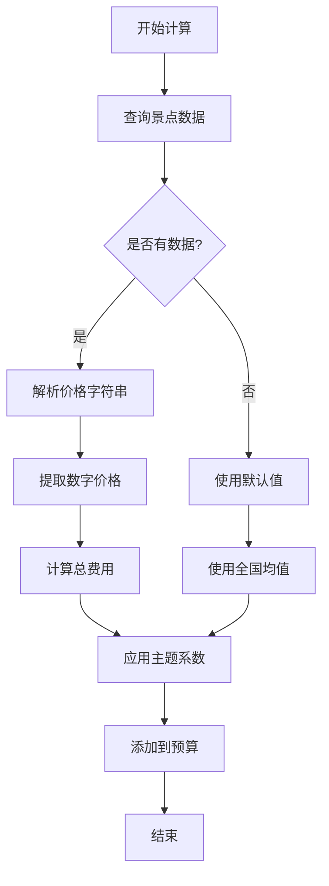
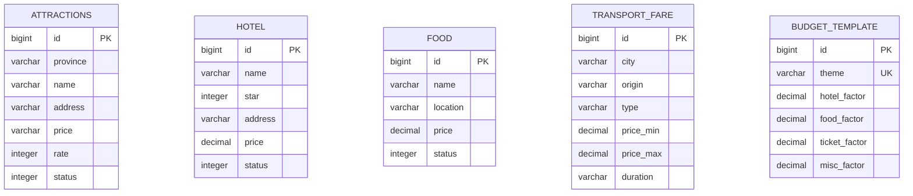
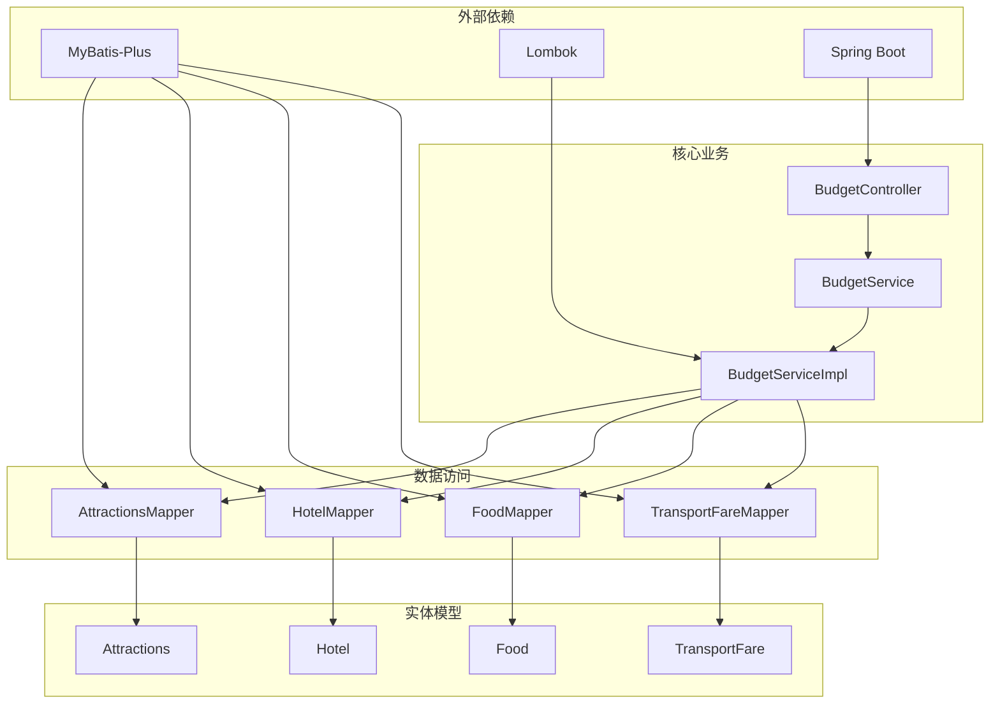

# 预算智能拆解

<cite>
**本文档引用的文件**
- [方案⑥-预算智能拆解.md](file://方案⑥-预算智能拆解.md)
- [BudgetController.java](file://springboot-travel-social/src/main/java/com/cxx/controller/BudgetController.java)
- [BudgetService.java](file://springboot-travel-social/src/main/java/com/cxx/service/BudgetService.java)
- [BudgetServiceImpl.java](file://springboot-travel-social/src/main/java/com/cxx/service/impl/BudgetServiceImpl.java)
- [Attractions.java](file://springboot-travel-social/src/main/java/com/cxx/entity/Attractions.java)
- [Hotel.java](file://springboot-travel-social/src/main/java/com/cxx/entity/Hotel.java)
- [Food.java](file://springboot-travel-social/src/main/java/com/cxx/entity/Food.java)
- [TransportFare.java](file://springboot-travel-social/src/main/java/com/cxx/entity/TransportFare.java)
- [AttractionsMapper.java](file://springboot-travel-social/src/main/java/com/cxx/mapper/AttractionsMapper.java)
- [HotelMapper.java](file://springboot-travel-social/src/main/java/com/cxx/mapper/HotelMapper.java)
- [FoodMapper.java](file://springboot-travel-social/src/main/java/com/cxx/mapper/FoodMapper.java)
- [TransportFareMapper.java](file://springboot-travel-social/src/main/java/com/cxx/mapper/TransportFareMapper.java)
- [budget.sql](file://springboot-travel-social/src/main/resources/sql/budget.sql)
</cite>

## 目录
1. [简介](#简介)
2. [项目结构](#项目结构)
3. [核心组件](#核心组件)
4. [架构概览](#架构概览)
5. [详细组件分析](#详细组件分析)
6. [依赖关系分析](#依赖关系分析)
7. [性能考虑](#性能考虑)
8. [故障排除指南](#故障排除指南)
9. [结论](#结论)

## 简介

预算智能拆解是旅游攻略社交小程序中的一个重要功能模块，旨在为用户提供精准的旅行预算参考。该功能通过AI对话识别用户的预算需求，自动从数据库中提取真实的城市消费数据，计算出详细的分类费用明细，并以可视化预算卡片的形式展示在聊天界面中。

### 功能特点

- **智能预算识别**：通过关键词检测识别用户对预算的需求
- **实时数据计算**：基于真实景点票价、酒店均价、餐饮均价进行精确计算
- **可视化展示**：以预算卡片形式直观展示各项费用构成
- **动态调整**：支持用户调整人数和天数后的实时重算
- **主题化配置**：支持不同旅行主题的费用系数配置

## 项目结构

预算智能拆解功能采用典型的三层架构设计，包含控制层、服务层和数据访问层：

**图表来源**
- [BudgetController.java:10-51](file://springboot-travel-social/src/main/java/com/cxx/controller/BudgetController.java#L10-L51)
- [BudgetServiceImpl.java:22-294](file://springboot-travel-social/src/main/java/com/cxx/service/impl/BudgetServiceImpl.java#L22-L294)

**章节来源**
- [BudgetController.java:1-51](file://springboot-travel-social/src/main/java/com/cxx/controller/BudgetController.java#L1-L51)
- [BudgetService.java:1-17](file://springboot-travel-social/src/main/java/com/cxx/service/BudgetService.java#L1-L17)
- [BudgetServiceImpl.java:1-294](file://springboot-travel-social/src/main/java/com/cxx/service/impl/BudgetServiceImpl.java#L1-L294)

## 核心组件

### 控制器层

BudgetController负责处理预算相关的HTTP请求，提供两个主要接口：
- `/budget/estimate`：首次预算估算
- `/budget/recalculate`：重新计算预算

### 服务层

BudgetServiceImpl实现了完整的预算计算逻辑，包括：
- 景点门票费用计算
- 住宿费用计算  
- 餐饮费用计算
- 交通费用计算
- 杂费和其他费用计算

### 数据访问层

四个核心Mapper负责从数据库中获取相关数据：
- AttractionsMapper：获取景点信息
- HotelMapper：获取酒店信息
- FoodMapper：获取餐饮信息
- TransportFareMapper：获取交通费用信息

**章节来源**
- [方案⑥-预算智能拆解.md:107-221](file://方案⑥-预算智能拆解.md#L107-L221)
- [BudgetController.java:17-42](file://springboot-travel-social/src/main/java/com/cxx/controller/BudgetController.java#L17-L42)
- [BudgetServiceImpl.java:48-246](file://springboot-travel-social/src/main/java/com/cxx/service/impl/BudgetServiceImpl.java#L48-L246)

## 架构概览

预算智能拆解系统的整体架构采用分层设计，确保了良好的可维护性和扩展性：

**图表来源**
- [BudgetController.java:21-42](file://springboot-travel-social/src/main/java/com/cxx/controller/BudgetController.java#L21-L42)
- [BudgetServiceImpl.java:48-246](file://springboot-travel-social/src/main/java/com/cxx/service/impl/BudgetServiceImpl.java#L48-L246)

## 详细组件分析

### 预算计算算法

预算计算采用多维度数据分析方法，每个维度都有其特定的计算逻辑：

#### 景点门票费用计算

**图表来源**
- [BudgetServiceImpl.java:62-84](file://springboot-travel-social/src/main/java/com/cxx/service/impl/BudgetServiceImpl.java#L62-L84)

#### 住宿费用计算

住宿费用计算考虑了多个因素：
- 基于酒店均价的计算
- 天数的计算（天数-1晚）
- 主题系数的应用
- 默认值的降级处理

#### 餐饮费用计算

餐饮费用采用"餐厅客单价×3顿"的折算方法：
- 从餐厅价格推导每日三餐成本
- 最低消费保障（80元/人/天）
- 主题系数调整
- 总费用=人均每天×天数×人数

#### 交通费用计算

交通费用分为两大类：
- **市内交通**：日均费用×天数×人数
- **长途交通**：往返费用×人数
- 优先使用交通参考表中的平均值

**章节来源**
- [BudgetServiceImpl.java:62-166](file://springboot-travel-social/src/main/java/com/cxx/service/impl/BudgetServiceImpl.java#L62-L166)

### 数据模型设计

系统涉及的核心数据模型包括：

**图表来源**
- [Attractions.java:16-40](file://springboot-travel-social/src/main/java/com/cxx/entity/Attractions.java#L16-L40)
- [Hotel.java:16-29](file://springboot-travel-social/src/main/java/com/cxx/entity/Hotel.java#L16-L29)
- [Food.java:18-31](file://springboot-travel-social/src/main/java/com/cxx/entity/Food.java#L18-L31)
- [TransportFare.java:13-24](file://springboot-travel-social/src/main/java/com/cxx/entity/TransportFare.java#L13-L24)

### 接口设计

系统提供两个主要的REST接口：

#### 预算估算接口

| 属性 | 值 |
|------|-----|
| 方法 | POST |
| 路径 | `/budget/estimate` |
| 请求体 | `{city, days, persons, theme}` |
| 响应 | 预算明细和统计信息 |

#### 预算重算接口

| 属性 | 值 |
|------|-----|
| 方法 | POST |
| 路径 | `/budget/recalculate` |
| 请求体 | `{city, days, persons, theme}` |
| 响应 | 更新后的预算明细 |

**章节来源**
- [方案⑥-预算智能拆解.md:109-221](file://方案⑥-预算智能拆解.md#L109-L221)
- [BudgetController.java:21-42](file://springboot-travel-social/src/main/java/com/cxx/controller/BudgetController.java#L21-L42)

## 依赖关系分析

预算智能拆解功能的依赖关系体现了清晰的分层架构：

**图表来源**
- [BudgetServiceImpl.java:3-29](file://springboot-travel-social/src/main/java/com/cxx/service/impl/BudgetServiceImpl.java#L3-L29)
- [BudgetController.java:3-15](file://springboot-travel-social/src/main/java/com/cxx/controller/BudgetController.java#L3-L15)

### 数据库设计

系统使用MySQL作为数据存储，包含以下核心表：

#### 交通费用参考表

| 字段 | 类型 | 约束 | 描述 |
|------|------|------|------|
| id | BIGINT | PRIMARY KEY | 主键自增 |
| city | VARCHAR(50) | NOT NULL | 目的地城市 |
| origin | VARCHAR(50) | NOT NULL | 出发地 |
| type | VARCHAR(20) | NOT NULL | 交通方式 |
| price_min | DECIMAL(8,2) | NOT NULL | 最低参考价 |
| price_max | DECIMAL(8,2) | NOT NULL | 最高参考价 |
| duration | VARCHAR(20) | NULL | 参考时长 |
| remark | VARCHAR(200) | NULL | 备注 |
| update_time | DATETIME | NOT NULL | 更新时间 |

#### 预算主题模板表

| 字段 | 类型 | 约束 | 描述 |
|------|------|------|------|
| id | BIGINT | PRIMARY KEY | 主键自增 |
| theme | VARCHAR(30) | UNIQUE | 旅行主题 |
| hotel_factor | DECIMAL(4,2) | NOT NULL | 酒店费用系数 |
| food_factor | DECIMAL(4,2) | NOT NULL | 餐饮费用系数 |
| ticket_factor | DECIMAL(4,2) | NOT NULL | 景点费用系数 |
| misc_factor | DECIMAL(4,2) | NOT NULL | 杂费系数 |
| desc | VARCHAR(100) | NULL | 模板说明 |

**章节来源**
- [方案⑥-预算智能拆解.md:64-103](file://方案⑥-预算智能拆解.md#L64-L103)
- [budget.sql:5-77](file://springboot-travel-social/src/main/resources/sql/budget.sql#L5-L77)

## 性能考虑

### 查询优化策略

1. **限制查询数量**：景点查询限制前8个，酒店和餐饮查询限制前10个
2. **索引优化**：为city字段建立索引以加速交通费用查询
3. **缓存策略**：可以考虑对常用城市的预算数据进行缓存

### 计算优化

1. **批量处理**：使用流式处理减少内存占用
2. **精度控制**：使用四舍五入避免浮点数精度问题
3. **默认值降级**：当数据不足时使用全国均值避免空查询

### 并发处理

系统采用Spring Boot的线程安全机制，BudgetServiceImpl使用无状态设计，适合并发访问。

## 故障排除指南

### 常见问题及解决方案

#### 1. 预算数据不准确

**问题现象**：计算出的预算与实际消费差异较大

**可能原因**：
- 数据库中缺少目标城市的详细数据
- 价格解析规则不适用于某些特殊格式

**解决方法**：
- 检查数据库中是否包含目标城市的完整数据
- 调整价格解析规则以支持更多格式

#### 2. 接口响应缓慢

**问题现象**：预算计算接口响应时间过长

**可能原因**：
- 数据库查询未使用适当索引
- 查询结果集过大

**解决方法**：
- 为city字段添加数据库索引
- 优化查询条件和限制返回数量

#### 3. 价格解析错误

**问题现象**：景点门票价格解析失败

**可能原因**：
- 价格字段格式不符合预期
- 特殊价格描述未被正确处理

**解决方法**：
- 检查Attractions表中price字段的实际格式
- 扩展parsePrice方法以支持更多格式

**章节来源**
- [BudgetServiceImpl.java:250-258](file://springboot-travel-social/src/main/java/com/cxx/service/impl/BudgetServiceImpl.java#L250-L258)

## 结论

预算智能拆解功能通过将真实的城市消费数据与AI对话相结合，为用户提供了精准、实用的旅行预算参考。该系统具有以下优势：

1. **数据驱动**：基于真实数据库中的消费数据，避免了AI的模糊估算
2. **可视化展示**：通过预算卡片直观展示各项费用构成
3. **动态调整**：支持用户根据实际情况调整预算参数
4. **主题化配置**：针对不同旅行需求提供个性化的费用系数
5. **可扩展性**：模块化设计便于后续功能扩展

该功能的成功实施显著提升了用户体验，为旅游攻略社交小程序增加了重要的实用价值。通过持续优化数据质量和算法性能，该功能将继续为用户创造更大价值。